# Glue opcodes report

Per-client NNLS fits of priced glue opcodes against their driver fixtures. Cycle-tier opcodes share one joint regression per client (shown once); pure-tier and mixed-tier opcodes each get a single-feature fit. Mixed-tier fits pre-adjust the LHS by subtracting the contribution of every priced upstream partner selected by the detector (pure ∪ cycle for `mixed_a`, plus `mixed_a` for `mixed_b`).

**Contents:** [besu](#besu) · [erigon](#erigon) · [ethrex](#ethrex) · [geth](#geth) · [nethermind](#nethermind) · [reth](#reth)

## besu

| glue_opcode | nobs | glue_runtime_ms | p_value | rsquared |
| --- | --- | --- | --- | --- |
| `ISZERO` | 3652 | 4.061e-06 | 1.00e-03 | 0.6144 |
| `JUMPDEST` | 3652 | 1.909e-06 | 1.00e-03 | 0.2393 |
| `SWAP` | 58432 | 3.054e-06 | 1.00e-03 | 0.4792 |
| `CALLDATASIZE` | 217272 | 3.63e-06 | 1.00e-03 | 0.7925 |
| `DUP` | 217272 | 2.017e-06 | 1.00e-03 | 0.7925 |
| `GAS` | 217272 | 3.171e-06 | 1.00e-03 | 0.7925 |
| `MLOAD` | 217272 | 9.639e-06 | 1.00e-03 | 0.7925 |
| `PUSH` | 217272 | 2.468e-06 | 1.00e-03 | 0.7925 |
| `PUSH0` | 217272 | 1.924e-06 | 1.00e-03 | 0.7925 |
| `STATICCALL` | 217272 | 0.0007677 | 1.00e-03 | 0.7925 |
| `ADD` | 3652 | 1.007e-05 | 1.00e-03 | 0.6881 |
| `AND` | 3652 | 8.494e-06 | 1.00e-03 | 0.5602 |
| `CALLDATACOPY` | 87648 | 1.724e-05 | 1.00e-03 | 0.7197 |
| `CALLDATALOAD` | 14608 | 0 | 1.00e+00 | 0 |
| `DIV` | 3652 | 1.316e-05 | 1.00e-03 | 0.6503 |
| `EXP` | 3652 | 0.001096 | 1.00e-03 | 0.7577 |
| `GT` | 3652 | 2.165e-05 | 1.00e-03 | 0.1848 |
| `JUMPI` | 3652 | 7.001e-06 | 1.00e-03 | 0.3399 |
| `LT` | 3652 | 2.174e-05 | 1.00e-03 | 0.1796 |
| `MSTORE` | 18260 | 1.636e-05 | 1.00e-03 | 0.8072 |
| `MSTORE8` | 18260 | 1.104e-05 | 1.00e-03 | 0.5391 |
| `MUL` | 3652 | 9.862e-06 | 1.00e-03 | 0.5144 |
| `PC` | 3652 | 3.625e-06 | 1.00e-03 | 0.5472 |
| `RETURNDATASIZE` | 14608 | 5.652e-06 | 1.00e-03 | 0.4027 |
| `SELFBALANCE` | 2988 | 7.29e-06 | 1.00e-03 | 0.4412 |
| `SUB` | 3652 | 1.066e-05 | 1.00e-03 | 0.6519 |
| `JUMP` | 3652 | 2.792e-05 | 1.00e-03 | 0.4986 |
| `KECCAK256` | 58432 | 2.372e-05 | 1.00e-03 | 0.08112 |

### Cycle glue — joint fit · besu

<details><summary>Joint NNLS regression summary</summary>

```
==============================================================================
                           NNLS Regression Results                            
==============================================================================
Dep. Variable:          test_runtime_ms              R-squared:          0.793
Model:                  NNLS                    Adj. R-squared:          0.793
No. Observations:       217272                            RMSE:          72.71
Df Residuals:           217264                             MAE:          61.76
Df Model:               7      
==============================================================================
                      coef     std err     P-value      [0.025      0.975]
------------------------------------------------------------------------------
         const     68.4039      0.4751       0.001     67.4460     69.3420
  CALLDATASIZE      0.0000      0.0000       0.001      0.0000      0.0000
           DUP      0.0000      0.0000       0.001      0.0000      0.0000
           GAS      0.0000      0.0000       0.001      0.0000      0.0000
         MLOAD      0.0000      0.0000       0.001      0.0000      0.0000
          PUSH      0.0000      0.0000       0.001      0.0000      0.0000
         PUSH0      0.0000      0.0000       0.001      0.0000      0.0000
    STATICCALL      0.0008      0.0000       0.001      0.0008      0.0008
==============================================================================
Notes: Non-negative least squares with bootstrap inference (1000 iterations)
==============================================================================
```

</details>

<details><summary><code>CALLDATASIZE</code> · nobs=217272 · runtime_ms=3.63e-06 · p=1.00e-03 · R²=0.7925</summary>


</details>

<details><summary><code>DUP</code> · nobs=217272 · runtime_ms=2.017e-06 · p=1.00e-03 · R²=0.7925</summary>


</details>

<details><summary><code>GAS</code> · nobs=217272 · runtime_ms=3.171e-06 · p=1.00e-03 · R²=0.7925</summary>


</details>

<details><summary><code>MLOAD</code> · nobs=217272 · runtime_ms=9.639e-06 · p=1.00e-03 · R²=0.7925</summary>


</details>

<details><summary><code>PUSH</code> · nobs=217272 · runtime_ms=2.468e-06 · p=1.00e-03 · R²=0.7925</summary>


</details>

<details><summary><code>PUSH0</code> · nobs=217272 · runtime_ms=1.924e-06 · p=1.00e-03 · R²=0.7925</summary>


</details>

<details><summary><code>STATICCALL</code> · nobs=217272 · runtime_ms=0.0007677 · p=1.00e-03 · R²=0.7925</summary>


</details>

### Pure glue · besu

<details><summary><code>ISZERO</code> · nobs=3652 · runtime_ms=4.061e-06 · p=1.00e-03 · R²=0.6144</summary>

```
==============================================================================
                           NNLS Regression Results                            
==============================================================================
Dep. Variable:          test_runtime_ms              R-squared:          0.614
Model:                  NNLS                    Adj. R-squared:          0.614
No. Observations:       3652                              RMSE:          67.73
Df Residuals:           3650                               MAE:          58.97
Df Model:               1      
==============================================================================
                      coef     std err     P-value      [0.025      0.975]
------------------------------------------------------------------------------
         const     76.8114      3.4697       0.001     69.7582     83.2219
        ISZERO      0.0000      0.0000       0.001      0.0000      0.0000
==============================================================================
Notes: Non-negative least squares with bootstrap inference (1000 iterations)
==============================================================================
```


</details>

<details><summary><code>JUMPDEST</code> · nobs=3652 · runtime_ms=1.909e-06 · p=1.00e-03 · R²=0.2393</summary>

```
==============================================================================
                           NNLS Regression Results                            
==============================================================================
Dep. Variable:          test_runtime_ms              R-squared:          0.239
Model:                  NNLS                    Adj. R-squared:          0.239
No. Observations:       3652                              RMSE:         214.95
Df Residuals:           3650                               MAE:         194.97
Df Model:               1      
==============================================================================
                      coef     std err     P-value      [0.025      0.975]
------------------------------------------------------------------------------
         const     66.9944     10.4711       0.001     46.1333     87.7547
      JUMPDEST      0.0000      0.0000       0.001      0.0000      0.0000
==============================================================================
Notes: Non-negative least squares with bootstrap inference (1000 iterations)
==============================================================================
```


</details>

<details><summary><code>SWAP</code> · nobs=58432 · runtime_ms=3.054e-06 · p=1.00e-03 · R²=0.4792</summary>

```
==============================================================================
                           NNLS Regression Results                            
==============================================================================
Dep. Variable:          test_runtime_ms              R-squared:          0.479
Model:                  NNLS                    Adj. R-squared:          0.479
No. Observations:       58432                             RMSE:          67.03
Df Residuals:           58430                              MAE:          59.25
Df Model:               1      
==============================================================================
                      coef     std err     P-value      [0.025      0.975]
------------------------------------------------------------------------------
         const     61.6975      0.8251       0.001     60.0985     63.3080
          SWAP      0.0000      0.0000       0.001      0.0000      0.0000
==============================================================================
Notes: Non-negative least squares with bootstrap inference (1000 iterations)
==============================================================================
```


</details>

### Mixed glue (tier A) · besu

<details><summary><code>ADD</code> · nobs=3652 · runtime_ms=1.007e-05 · p=1.00e-03 · R²=0.6881</summary>

```
==============================================================================
                           NNLS Regression Results                            
==============================================================================
Dep. Variable:          test_runtime_ms              R-squared:          0.688
Model:                  NNLS                    Adj. R-squared:          0.688
No. Observations:       3652                              RMSE:          71.36
Df Residuals:           3650                               MAE:          56.69
Df Model:               1      
==============================================================================
                      coef     std err     P-value      [0.025      0.975]
------------------------------------------------------------------------------
         const    117.0557      3.6199       0.001    109.5734    124.0252
           ADD      0.0000      0.0000       0.001      0.0000      0.0000
==============================================================================
Notes: Non-negative least squares with bootstrap inference (1000 iterations)
==============================================================================
```


</details>

<details><summary><code>AND</code> · nobs=3652 · runtime_ms=8.494e-06 · p=1.00e-03 · R²=0.5602</summary>

```
==============================================================================
                           NNLS Regression Results                            
==============================================================================
Dep. Variable:          test_runtime_ms              R-squared:          0.560
Model:                  NNLS                    Adj. R-squared:          0.560
No. Observations:       3652                              RMSE:          79.21
Df Residuals:           3650                               MAE:          63.58
Df Model:               1      
==============================================================================
                      coef     std err     P-value      [0.025      0.975]
------------------------------------------------------------------------------
         const     84.6184      3.8268       0.001     76.9532     91.7064
           AND      0.0000      0.0000       0.001      0.0000      0.0000
==============================================================================
Notes: Non-negative least squares with bootstrap inference (1000 iterations)
==============================================================================
```


</details>

<details><summary><code>CALLDATACOPY</code> · nobs=87648 · runtime_ms=1.724e-05 · p=1.00e-03 · R²=0.7197</summary>

```
==============================================================================
                           NNLS Regression Results                            
==============================================================================
Dep. Variable:          test_runtime_ms              R-squared:          0.720
Model:                  NNLS                    Adj. R-squared:          0.720
No. Observations:       87648                             RMSE:          80.92
Df Residuals:           87646                              MAE:          59.56
Df Model:               1      
==============================================================================
                      coef     std err     P-value      [0.025      0.975]
------------------------------------------------------------------------------
         const    119.6069      0.3279       0.001    118.9436    120.2238
  CALLDATACOPY      0.0000      0.0000       0.001      0.0000      0.0000
==============================================================================
Notes: Non-negative least squares with bootstrap inference (1000 iterations)
==============================================================================
```


</details>

<details><summary><code>CALLDATALOAD</code> · nobs=14608 · runtime_ms=0 · p=1.00e+00 · R²=0</summary>

```
==============================================================================
                           NNLS Regression Results                            
==============================================================================
Dep. Variable:          test_runtime_ms              R-squared:          0.000
Model:                  NNLS                    Adj. R-squared:         -0.000
No. Observations:       14608                             RMSE:           0.82
Df Residuals:           14606                              MAE:           0.57
Df Model:               1      
==============================================================================
                      coef     std err     P-value      [0.025      0.975]
------------------------------------------------------------------------------
         const      3.7814      0.0128       0.001      3.7404      3.7934
  CALLDATALOAD      0.0000      0.0000       1.000      0.0000      0.0000
==============================================================================
Notes: Non-negative least squares with bootstrap inference (1000 iterations)
==============================================================================
```


</details>

<details><summary><code>DIV</code> · nobs=3652 · runtime_ms=1.316e-05 · p=1.00e-03 · R²=0.6503</summary>

```
==============================================================================
                           NNLS Regression Results                            
==============================================================================
Dep. Variable:          test_runtime_ms              R-squared:          0.650
Model:                  NNLS                    Adj. R-squared:          0.650
No. Observations:       3652                              RMSE:          76.17
Df Residuals:           3650                               MAE:          61.98
Df Model:               1      
==============================================================================
                      coef     std err     P-value      [0.025      0.975]
------------------------------------------------------------------------------
         const    141.9384      3.5555       0.001    134.9084    148.7499
           DIV      0.0000      0.0000       0.001      0.0000      0.0000
==============================================================================
Notes: Non-negative least squares with bootstrap inference (1000 iterations)
==============================================================================
```


</details>

<details><summary><code>EXP</code> · nobs=3652 · runtime_ms=0.001096 · p=1.00e-03 · R²=0.7577</summary>

```
==============================================================================
                           NNLS Regression Results                            
==============================================================================
Dep. Variable:          test_runtime_ms              R-squared:          0.758
Model:                  NNLS                    Adj. R-squared:          0.758
No. Observations:       3652                              RMSE:          24.26
Df Residuals:           3650                               MAE:          18.40
Df Model:               1      
==============================================================================
                      coef     std err     P-value      [0.025      0.975]
------------------------------------------------------------------------------
         const     95.5024      1.6543       0.001     92.2335     98.5509
           EXP      0.0011      0.0000       0.001      0.0011      0.0011
==============================================================================
Notes: Non-negative least squares with bootstrap inference (1000 iterations)
==============================================================================
```


</details>

<details><summary><code>GT</code> · nobs=3652 · runtime_ms=2.165e-05 · p=1.00e-03 · R²=0.1848</summary>

```
==============================================================================
                           NNLS Regression Results                            
==============================================================================
Dep. Variable:          test_runtime_ms              R-squared:          0.185
Model:                  NNLS                    Adj. R-squared:          0.185
No. Observations:       3652                              RMSE:         478.58
Df Residuals:           3650                               MAE:         441.57
Df Model:               1      
==============================================================================
                      coef     std err     P-value      [0.025      0.975]
------------------------------------------------------------------------------
         const    140.6363     22.4175       0.001     97.2951    185.1934
            GT      0.0000      0.0000       0.001      0.0000      0.0000
==============================================================================
Notes: Non-negative least squares with bootstrap inference (1000 iterations)
==============================================================================
```


</details>

<details><summary><code>JUMPI</code> · nobs=3652 · runtime_ms=7.001e-06 · p=1.00e-03 · R²=0.3399</summary>

```
==============================================================================
                           NNLS Regression Results                            
==============================================================================
Dep. Variable:          test_runtime_ms              R-squared:          0.340
Model:                  NNLS                    Adj. R-squared:          0.340
No. Observations:       3652                              RMSE:          44.02
Df Residuals:           3650                               MAE:          39.82
Df Model:               1      
==============================================================================
                      coef     std err     P-value      [0.025      0.975]
------------------------------------------------------------------------------
         const     31.9750      2.1248       0.001     27.9190     36.2405
         JUMPI      0.0000      0.0000       0.001      0.0000      0.0000
==============================================================================
Notes: Non-negative least squares with bootstrap inference (1000 iterations)
==============================================================================
```


</details>

<details><summary><code>LT</code> · nobs=3652 · runtime_ms=2.174e-05 · p=1.00e-03 · R²=0.1796</summary>

```
==============================================================================
                           NNLS Regression Results                            
==============================================================================
Dep. Variable:          test_runtime_ms              R-squared:          0.180
Model:                  NNLS                    Adj. R-squared:          0.179
No. Observations:       3652                              RMSE:         489.06
Df Residuals:           3650                               MAE:         452.56
Df Model:               1      
==============================================================================
                      coef     std err     P-value      [0.025      0.975]
------------------------------------------------------------------------------
         const    170.7186     22.6338       0.001    125.8200    214.9045
            LT      0.0000      0.0000       0.001      0.0000      0.0000
==============================================================================
Notes: Non-negative least squares with bootstrap inference (1000 iterations)
==============================================================================
```


</details>

<details><summary><code>MSTORE</code> · nobs=18260 · runtime_ms=1.636e-05 · p=1.00e-03 · R²=0.8072</summary>

```
==============================================================================
                           NNLS Regression Results                            
==============================================================================
Dep. Variable:          test_runtime_ms              R-squared:          0.807
Model:                  NNLS                    Adj. R-squared:          0.807
No. Observations:       18260                             RMSE:          56.12
Df Residuals:           18258                              MAE:          45.90
Df Model:               1      
==============================================================================
                      coef     std err     P-value      [0.025      0.975]
------------------------------------------------------------------------------
         const    106.4552      1.4644       0.001    103.5659    109.1022
        MSTORE      0.0000      0.0000       0.001      0.0000      0.0000
==============================================================================
Notes: Non-negative least squares with bootstrap inference (1000 iterations)
==============================================================================
```


</details>

<details><summary><code>MSTORE8</code> · nobs=18260 · runtime_ms=1.104e-05 · p=1.00e-03 · R²=0.5391</summary>

```
==============================================================================
                           NNLS Regression Results                            
==============================================================================
Dep. Variable:          test_runtime_ms              R-squared:          0.539
Model:                  NNLS                    Adj. R-squared:          0.539
No. Observations:       18260                             RMSE:          71.65
Df Residuals:           18258                              MAE:          63.33
Df Model:               1      
==============================================================================
                      coef     std err     P-value      [0.025      0.975]
------------------------------------------------------------------------------
         const     73.2961      1.6436       0.001     70.0766     76.5981
       MSTORE8      0.0000      0.0000       0.001      0.0000      0.0000
==============================================================================
Notes: Non-negative least squares with bootstrap inference (1000 iterations)
==============================================================================
```


</details>

<details><summary><code>MUL</code> · nobs=3652 · runtime_ms=9.862e-06 · p=1.00e-03 · R²=0.5144</summary>

```
==============================================================================
                           NNLS Regression Results                            
==============================================================================
Dep. Variable:          test_runtime_ms              R-squared:          0.514
Model:                  NNLS                    Adj. R-squared:          0.514
No. Observations:       3652                              RMSE:          75.65
Df Residuals:           3650                               MAE:          57.53
Df Model:               1      
==============================================================================
                      coef     std err     P-value      [0.025      0.975]
------------------------------------------------------------------------------
         const    111.4409      3.5897       0.001    104.5167    118.4666
           MUL      0.0000      0.0000       0.001      0.0000      0.0000
==============================================================================
Notes: Non-negative least squares with bootstrap inference (1000 iterations)
==============================================================================
```


</details>

<details><summary><code>PC</code> · nobs=3652 · runtime_ms=3.625e-06 · p=1.00e-03 · R²=0.5472</summary>

```
==============================================================================
                           NNLS Regression Results                            
==============================================================================
Dep. Variable:          test_runtime_ms              R-squared:          0.547
Model:                  NNLS                    Adj. R-squared:          0.547
No. Observations:       3652                              RMSE:          98.60
Df Residuals:           3650                               MAE:          88.10
Df Model:               1      
==============================================================================
                      coef     std err     P-value      [0.025      0.975]
------------------------------------------------------------------------------
         const     97.8242      5.0760       0.001     87.9846    107.8254
            PC      0.0000      0.0000       0.001      0.0000      0.0000
==============================================================================
Notes: Non-negative least squares with bootstrap inference (1000 iterations)
==============================================================================
```


</details>

<details><summary><code>RETURNDATASIZE</code> · nobs=14608 · runtime_ms=5.652e-06 · p=1.00e-03 · R²=0.4027</summary>

```
==============================================================================
                           NNLS Regression Results                            
==============================================================================
Dep. Variable:          test_runtime_ms              R-squared:          0.403
Model:                  NNLS                    Adj. R-squared:          0.403
No. Observations:       14608                             RMSE:         108.67
Df Residuals:           14606                              MAE:          97.27
Df Model:               1      
==============================================================================
                      coef     std err     P-value      [0.025      0.975]
------------------------------------------------------------------------------
         const     80.9687      2.5834       0.001     76.1676     86.2262
RETURNDATASIZE      0.0000      0.0000       0.001      0.0000      0.0000
==============================================================================
Notes: Non-negative least squares with bootstrap inference (1000 iterations)
==============================================================================
```


</details>

<details><summary><code>SELFBALANCE</code> · nobs=2988 · runtime_ms=7.29e-06 · p=1.00e-03 · R²=0.4412</summary>

```
==============================================================================
                           NNLS Regression Results                            
==============================================================================
Dep. Variable:          test_runtime_ms              R-squared:          0.441
Model:                  NNLS                    Adj. R-squared:          0.441
No. Observations:       2988                              RMSE:          82.75
Df Residuals:           2986                               MAE:          64.53
Df Model:               1      
==============================================================================
                      coef     std err     P-value      [0.025      0.975]
------------------------------------------------------------------------------
         const    403.9633      6.1182       0.001    391.6481    416.0524
   SELFBALANCE      0.0000      0.0000       0.001      0.0000      0.0000
==============================================================================
Notes: Non-negative least squares with bootstrap inference (1000 iterations)
==============================================================================
```


</details>

<details><summary><code>SUB</code> · nobs=3652 · runtime_ms=1.066e-05 · p=1.00e-03 · R²=0.6519</summary>

```
==============================================================================
                           NNLS Regression Results                            
==============================================================================
Dep. Variable:          test_runtime_ms              R-squared:          0.652
Model:                  NNLS                    Adj. R-squared:          0.652
No. Observations:       3652                              RMSE:          81.99
Df Residuals:           3650                               MAE:          67.08
Df Model:               1      
==============================================================================
                      coef     std err     P-value      [0.025      0.975]
------------------------------------------------------------------------------
         const    110.7336      4.0623       0.001    102.8656    119.2247
           SUB      0.0000      0.0000       0.001      0.0000      0.0000
==============================================================================
Notes: Non-negative least squares with bootstrap inference (1000 iterations)
==============================================================================
```


</details>

### Mixed glue (tier B) · besu

<details><summary><code>JUMP</code> · nobs=3652 · runtime_ms=2.792e-05 · p=1.00e-03 · R²=0.4986</summary>

```
==============================================================================
                           NNLS Regression Results                            
==============================================================================
Dep. Variable:          test_runtime_ms              R-squared:          0.499
Model:                  NNLS                    Adj. R-squared:          0.498
No. Observations:       3652                              RMSE:         104.06
Df Residuals:           3650                               MAE:          79.63
Df Model:               1      
==============================================================================
                      coef     std err     P-value      [0.025      0.975]
------------------------------------------------------------------------------
         const    111.2376      5.1408       0.001    100.8564    121.0594
          JUMP      0.0000      0.0000       0.001      0.0000      0.0000
==============================================================================
Notes: Non-negative least squares with bootstrap inference (1000 iterations)
==============================================================================
```


</details>

<details><summary><code>KECCAK256</code> · nobs=58432 · runtime_ms=2.372e-05 · p=1.00e-03 · R²=0.08112</summary>

```
==============================================================================
                           NNLS Regression Results                            
==============================================================================
Dep. Variable:          test_runtime_ms              R-squared:          0.081
Model:                  NNLS                    Adj. R-squared:          0.081
No. Observations:       58432                             RMSE:         158.67
Df Residuals:           58430                              MAE:         125.40
Df Model:               1      
==============================================================================
                      coef     std err     P-value      [0.025      0.975]
------------------------------------------------------------------------------
         const    500.7338      1.4364       0.001    497.7793    503.3560
     KECCAK256      0.0000      0.0000       0.001      0.0000      0.0000
==============================================================================
Notes: Non-negative least squares with bootstrap inference (1000 iterations)
==============================================================================
```


</details>

## erigon

| glue_opcode | nobs | glue_runtime_ms | p_value | rsquared |
| --- | --- | --- | --- | --- |
| `ISZERO` | 231 | 1.139e-06 | 1.00e-03 | 0.5058 |
| `JUMPDEST` | 231 | 8.516e-07 | 1.00e-03 | 0.7877 |
| `SWAP` | 3696 | 1.28e-06 | 1.00e-03 | 0.5006 |
| `CALLDATASIZE` | 14080 | 8.317e-07 | 1.00e-03 | 0.9407 |
| `DUP` | 14080 | 1.055e-06 | 1.00e-03 | 0.9407 |
| `GAS` | 14080 | 8.965e-07 | 1.00e-03 | 0.9407 |
| `MLOAD` | 14080 | 3.439e-06 | 1.00e-03 | 0.9407 |
| `PUSH` | 14080 | 2.808e-06 | 1.00e-03 | 0.9407 |
| `PUSH0` | 14080 | 8.302e-07 | 1.00e-03 | 0.9407 |
| `STATICCALL` | 14080 | 0.0005667 | 1.00e-03 | 0.9407 |
| `ADD` | 231 | 3.012e-06 | 1.00e-03 | 0.9341 |
| `AND` | 231 | 1.815e-06 | 1.00e-03 | 0.07688 |
| `CALLDATACOPY` | 5544 | 7.488e-06 | 1.00e-03 | 0.7944 |
| `CALLDATALOAD` | 924 | 6.908e-05 | 1.00e-03 | 0.04001 |
| `DIV` | 231 | 9.063e-06 | 1.00e-03 | 0.8728 |
| `EXP` | 231 | 0.0004925 | 1.00e-03 | 0.1741 |
| `GT` | 231 | 2.917e-06 | 1.00e-03 | 0.6217 |
| `JUMPI` | 231 | 3.168e-06 | 1.00e-03 | 0.1953 |
| `LT` | 231 | 3.035e-06 | 1.00e-03 | 0.645 |
| `MSTORE` | 1155 | 5.926e-06 | 1.00e-03 | 0.7012 |
| `MSTORE8` | 1155 | 5.066e-06 | 1.00e-03 | 0.5508 |
| `MUL` | 231 | 3.594e-06 | 1.00e-03 | 0.9361 |
| `PC` | 231 | 1.463e-06 | 1.00e-03 | 0.8828 |
| `RETURNDATASIZE` | 924 | 1.753e-06 | 1.00e-03 | 0.4581 |
| `SELFBALANCE` | 189 | 1.519e-06 | 1.00e-03 | 0.8862 |
| `SUB` | 231 | 3.013e-06 | 1.00e-03 | 0.9261 |
| `JUMP` | 231 | 7.581e-06 | 1.00e-03 | 0.95 |
| `KECCAK256` | 3696 | 1.093e-05 | 1.00e-03 | 0.02441 |

### Cycle glue — joint fit · erigon

<details><summary>Joint NNLS regression summary</summary>

```
==============================================================================
                           NNLS Regression Results                            
==============================================================================
Dep. Variable:          test_runtime_ms              R-squared:          0.941
Model:                  NNLS                    Adj. R-squared:          0.941
No. Observations:       14080                             RMSE:          41.96
Df Residuals:           14072                              MAE:          18.25
Df Model:               7      
==============================================================================
                      coef     std err     P-value      [0.025      0.975]
------------------------------------------------------------------------------
         const     33.1913      1.1585       0.001     30.9641     35.2852
  CALLDATASIZE      0.0000      0.0000       0.001      0.0000      0.0000
           DUP      0.0000      0.0000       0.001      0.0000      0.0000
           GAS      0.0000      0.0000       0.001      0.0000      0.0000
         MLOAD      0.0000      0.0000       0.001      0.0000      0.0000
          PUSH      0.0000      0.0000       0.001      0.0000      0.0000
         PUSH0      0.0000      0.0000       0.001      0.0000      0.0000
    STATICCALL      0.0006      0.0000       0.001      0.0006      0.0006
==============================================================================
Notes: Non-negative least squares with bootstrap inference (1000 iterations)
==============================================================================
```

</details>

<details><summary><code>CALLDATASIZE</code> · nobs=14080 · runtime_ms=8.317e-07 · p=1.00e-03 · R²=0.9407</summary>


</details>

<details><summary><code>DUP</code> · nobs=14080 · runtime_ms=1.055e-06 · p=1.00e-03 · R²=0.9407</summary>


</details>

<details><summary><code>GAS</code> · nobs=14080 · runtime_ms=8.965e-07 · p=1.00e-03 · R²=0.9407</summary>


</details>

<details><summary><code>MLOAD</code> · nobs=14080 · runtime_ms=3.439e-06 · p=1.00e-03 · R²=0.9407</summary>


</details>

<details><summary><code>PUSH</code> · nobs=14080 · runtime_ms=2.808e-06 · p=1.00e-03 · R²=0.9407</summary>


</details>

<details><summary><code>PUSH0</code> · nobs=14080 · runtime_ms=8.302e-07 · p=1.00e-03 · R²=0.9407</summary>


</details>

<details><summary><code>STATICCALL</code> · nobs=14080 · runtime_ms=0.0005667 · p=1.00e-03 · R²=0.9407</summary>


</details>

### Pure glue · erigon

<details><summary><code>ISZERO</code> · nobs=231 · runtime_ms=1.139e-06 · p=1.00e-03 · R²=0.5058</summary>

```
==============================================================================
                           NNLS Regression Results                            
==============================================================================
Dep. Variable:          test_runtime_ms              R-squared:          0.506
Model:                  NNLS                    Adj. R-squared:          0.504
No. Observations:       231                               RMSE:          23.71
Df Residuals:           229                                MAE:           6.98
Df Model:               1      
==============================================================================
                      coef     std err     P-value      [0.025      0.975]
------------------------------------------------------------------------------
         const     13.7649      4.6405       0.011      2.1215     20.4705
        ISZERO      0.0000      0.0000       0.001      0.0000      0.0000
==============================================================================
Notes: Non-negative least squares with bootstrap inference (1000 iterations)
==============================================================================
```


</details>

<details><summary><code>JUMPDEST</code> · nobs=231 · runtime_ms=8.516e-07 · p=1.00e-03 · R²=0.7877</summary>

```
==============================================================================
                           NNLS Regression Results                            
==============================================================================
Dep. Variable:          test_runtime_ms              R-squared:          0.788
Model:                  NNLS                    Adj. R-squared:          0.787
No. Observations:       231                               RMSE:          27.92
Df Residuals:           229                                MAE:          14.03
Df Model:               1      
==============================================================================
                      coef     std err     P-value      [0.025      0.975]
------------------------------------------------------------------------------
         const     17.7468      6.9458       0.007      3.4550     30.1959
      JUMPDEST      0.0000      0.0000       0.001      0.0000      0.0000
==============================================================================
Notes: Non-negative least squares with bootstrap inference (1000 iterations)
==============================================================================
```


</details>

<details><summary><code>SWAP</code> · nobs=3696 · runtime_ms=1.28e-06 · p=1.00e-03 · R²=0.5006</summary>

```
==============================================================================
                           NNLS Regression Results                            
==============================================================================
Dep. Variable:          test_runtime_ms              R-squared:          0.501
Model:                  NNLS                    Adj. R-squared:          0.501
No. Observations:       3696                              RMSE:          26.92
Df Residuals:           3694                               MAE:           7.32
Df Model:               1      
==============================================================================
                      coef     std err     P-value      [0.025      0.975]
------------------------------------------------------------------------------
         const     25.8651      1.7804       0.001     22.4185     29.2942
          SWAP      0.0000      0.0000       0.001      0.0000      0.0000
==============================================================================
Notes: Non-negative least squares with bootstrap inference (1000 iterations)
==============================================================================
```


</details>

### Mixed glue (tier A) · erigon

<details><summary><code>ADD</code> · nobs=231 · runtime_ms=3.012e-06 · p=1.00e-03 · R²=0.9341</summary>

```
==============================================================================
                           NNLS Regression Results                            
==============================================================================
Dep. Variable:          test_runtime_ms              R-squared:          0.934
Model:                  NNLS                    Adj. R-squared:          0.934
No. Observations:       231                               RMSE:           8.42
Df Residuals:           229                                MAE:           6.74
Df Model:               1      
==============================================================================
                      coef     std err     P-value      [0.025      0.975]
------------------------------------------------------------------------------
         const     14.8472      1.7682       0.001     11.3581     18.4666
           ADD      0.0000      0.0000       0.001      0.0000      0.0000
==============================================================================
Notes: Non-negative least squares with bootstrap inference (1000 iterations)
==============================================================================
```


</details>

<details><summary><code>AND</code> · nobs=231 · runtime_ms=1.815e-06 · p=1.00e-03 · R²=0.07688</summary>

```
==============================================================================
                           NNLS Regression Results                            
==============================================================================
Dep. Variable:          test_runtime_ms              R-squared:          0.077
Model:                  NNLS                    Adj. R-squared:          0.073
No. Observations:       231                               RMSE:          66.19
Df Residuals:           229                                MAE:          24.49
Df Model:               1      
==============================================================================
                      coef     std err     P-value      [0.025      0.975]
------------------------------------------------------------------------------
         const     63.4774     19.7994       0.001     27.5888    104.4615
           AND      0.0000      0.0000       0.001      0.0000      0.0000
==============================================================================
Notes: Non-negative least squares with bootstrap inference (1000 iterations)
==============================================================================
```


</details>

<details><summary><code>CALLDATACOPY</code> · nobs=5544 · runtime_ms=7.488e-06 · p=1.00e-03 · R²=0.7944</summary>

```
==============================================================================
                           NNLS Regression Results                            
==============================================================================
Dep. Variable:          test_runtime_ms              R-squared:          0.794
Model:                  NNLS                    Adj. R-squared:          0.794
No. Observations:       5544                              RMSE:          28.65
Df Residuals:           5542                               MAE:           8.53
Df Model:               1      
==============================================================================
                      coef     std err     P-value      [0.025      0.975]
------------------------------------------------------------------------------
         const     18.8556      0.3659       0.001     18.2193     19.5942
  CALLDATACOPY      0.0000      0.0000       0.001      0.0000      0.0000
==============================================================================
Notes: Non-negative least squares with bootstrap inference (1000 iterations)
==============================================================================
```


</details>

<details><summary><code>CALLDATALOAD</code> · nobs=924 · runtime_ms=6.908e-05 · p=1.00e-03 · R²=0.04001</summary>

```
==============================================================================
                           NNLS Regression Results                            
==============================================================================
Dep. Variable:          test_runtime_ms              R-squared:          0.040
Model:                  NNLS                    Adj. R-squared:          0.039
No. Observations:       924                               RMSE:           1.30
Df Residuals:           922                                MAE:           0.42
Df Model:               1      
==============================================================================
                      coef     std err     P-value      [0.025      0.975]
------------------------------------------------------------------------------
         const      5.7902      0.1064       0.001      5.5521      5.9573
  CALLDATALOAD      0.0001      0.0000       0.001      0.0001      0.0001
==============================================================================
Notes: Non-negative least squares with bootstrap inference (1000 iterations)
==============================================================================
```


</details>

<details><summary><code>DIV</code> · nobs=231 · runtime_ms=9.063e-06 · p=1.00e-03 · R²=0.8728</summary>

```
==============================================================================
                           NNLS Regression Results                            
==============================================================================
Dep. Variable:          test_runtime_ms              R-squared:          0.873
Model:                  NNLS                    Adj. R-squared:          0.872
No. Observations:       231                               RMSE:          27.32
Df Residuals:           229                                MAE:          23.29
Df Model:               1      
==============================================================================
                      coef     std err     P-value      [0.025      0.975]
------------------------------------------------------------------------------
         const     23.9785      5.9218       0.001     12.7086     35.5325
           DIV      0.0000      0.0000       0.001      0.0000      0.0000
==============================================================================
Notes: Non-negative least squares with bootstrap inference (1000 iterations)
==============================================================================
```


</details>

<details><summary><code>EXP</code> · nobs=231 · runtime_ms=0.0004925 · p=1.00e-03 · R²=0.1741</summary>

```
==============================================================================
                           NNLS Regression Results                            
==============================================================================
Dep. Variable:          test_runtime_ms              R-squared:          0.174
Model:                  NNLS                    Adj. R-squared:          0.170
No. Observations:       231                               RMSE:          42.01
Df Residuals:           229                                MAE:           9.86
Df Model:               1      
==============================================================================
                      coef     std err     P-value      [0.025      0.975]
------------------------------------------------------------------------------
         const      0.0311      4.1256       0.450      0.0000     12.7048
           EXP      0.0005      0.0001       0.001      0.0004      0.0006
==============================================================================
Notes: Non-negative least squares with bootstrap inference (1000 iterations)
==============================================================================
```


</details>

<details><summary><code>GT</code> · nobs=231 · runtime_ms=2.917e-06 · p=1.00e-03 · R²=0.6217</summary>

```
==============================================================================
                           NNLS Regression Results                            
==============================================================================
Dep. Variable:          test_runtime_ms              R-squared:          0.622
Model:                  NNLS                    Adj. R-squared:          0.620
No. Observations:       231                               RMSE:          23.95
Df Residuals:           229                                MAE:           7.62
Df Model:               1      
==============================================================================
                      coef     std err     P-value      [0.025      0.975]
------------------------------------------------------------------------------
         const     23.7484      3.5188       0.001     18.0658     31.9359
            GT      0.0000      0.0000       0.001      0.0000      0.0000
==============================================================================
Notes: Non-negative least squares with bootstrap inference (1000 iterations)
==============================================================================
```


</details>

<details><summary><code>JUMPI</code> · nobs=231 · runtime_ms=3.168e-06 · p=1.00e-03 · R²=0.1953</summary>

```
==============================================================================
                           NNLS Regression Results                            
==============================================================================
Dep. Variable:          test_runtime_ms              R-squared:          0.195
Model:                  NNLS                    Adj. R-squared:          0.192
No. Observations:       231                               RMSE:          29.01
Df Residuals:           229                                MAE:           6.85
Df Model:               1      
==============================================================================
                      coef     std err     P-value      [0.025      0.975]
------------------------------------------------------------------------------
         const     28.2744      9.5245       0.001     16.9764     50.6071
         JUMPI      0.0000      0.0000       0.001      0.0000      0.0000
==============================================================================
Notes: Non-negative least squares with bootstrap inference (1000 iterations)
==============================================================================
```


</details>

<details><summary><code>LT</code> · nobs=231 · runtime_ms=3.035e-06 · p=1.00e-03 · R²=0.645</summary>

```
==============================================================================
                           NNLS Regression Results                            
==============================================================================
Dep. Variable:          test_runtime_ms              R-squared:          0.645
Model:                  NNLS                    Adj. R-squared:          0.643
No. Observations:       231                               RMSE:          23.70
Df Residuals:           229                                MAE:           7.87
Df Model:               1      
==============================================================================
                      coef     std err     P-value      [0.025      0.975]
------------------------------------------------------------------------------
         const     19.5832      1.6759       0.001     16.3962     23.0220
            LT      0.0000      0.0000       0.001      0.0000      0.0000
==============================================================================
Notes: Non-negative least squares with bootstrap inference (1000 iterations)
==============================================================================
```


</details>

<details><summary><code>MSTORE</code> · nobs=1155 · runtime_ms=5.926e-06 · p=1.00e-03 · R²=0.7012</summary>

```
==============================================================================
                           NNLS Regression Results                            
==============================================================================
Dep. Variable:          test_runtime_ms              R-squared:          0.701
Model:                  NNLS                    Adj. R-squared:          0.701
No. Observations:       1155                              RMSE:          27.15
Df Residuals:           1153                               MAE:          10.24
Df Model:               1      
==============================================================================
                      coef     std err     P-value      [0.025      0.975]
------------------------------------------------------------------------------
         const     27.0580      2.5578       0.001     22.8537     32.6045
        MSTORE      0.0000      0.0000       0.001      0.0000      0.0000
==============================================================================
Notes: Non-negative least squares with bootstrap inference (1000 iterations)
==============================================================================
```


</details>

<details><summary><code>MSTORE8</code> · nobs=1155 · runtime_ms=5.066e-06 · p=1.00e-03 · R²=0.5508</summary>

```
==============================================================================
                           NNLS Regression Results                            
==============================================================================
Dep. Variable:          test_runtime_ms              R-squared:          0.551
Model:                  NNLS                    Adj. R-squared:          0.550
No. Observations:       1155                              RMSE:          32.10
Df Residuals:           1153                               MAE:          10.11
Df Model:               1      
==============================================================================
                      coef     std err     P-value      [0.025      0.975]
------------------------------------------------------------------------------
         const     32.1280      3.9767       0.001     25.4365     40.6172
       MSTORE8      0.0000      0.0000       0.001      0.0000      0.0000
==============================================================================
Notes: Non-negative least squares with bootstrap inference (1000 iterations)
==============================================================================
```


</details>

<details><summary><code>MUL</code> · nobs=231 · runtime_ms=3.594e-06 · p=1.00e-03 · R²=0.9361</summary>

```
==============================================================================
                           NNLS Regression Results                            
==============================================================================
Dep. Variable:          test_runtime_ms              R-squared:          0.936
Model:                  NNLS                    Adj. R-squared:          0.936
No. Observations:       231                               RMSE:           7.41
Df Residuals:           229                                MAE:           6.25
Df Model:               1      
==============================================================================
                      coef     std err     P-value      [0.025      0.975]
------------------------------------------------------------------------------
         const     15.8896      1.5771       0.001     12.9159     19.0872
           MUL      0.0000      0.0000       0.001      0.0000      0.0000
==============================================================================
Notes: Non-negative least squares with bootstrap inference (1000 iterations)
==============================================================================
```


</details>

<details><summary><code>PC</code> · nobs=231 · runtime_ms=1.463e-06 · p=1.00e-03 · R²=0.8828</summary>

```
==============================================================================
                           NNLS Regression Results                            
==============================================================================
Dep. Variable:          test_runtime_ms              R-squared:          0.883
Model:                  NNLS                    Adj. R-squared:          0.882
No. Observations:       231                               RMSE:          15.94
Df Residuals:           229                                MAE:           9.37
Df Model:               1      
==============================================================================
                      coef     std err     P-value      [0.025      0.975]
------------------------------------------------------------------------------
         const     27.0699      3.7406       0.001     20.8594     35.0715
            PC      0.0000      0.0000       0.001      0.0000      0.0000
==============================================================================
Notes: Non-negative least squares with bootstrap inference (1000 iterations)
==============================================================================
```


</details>

<details><summary><code>RETURNDATASIZE</code> · nobs=924 · runtime_ms=1.753e-06 · p=1.00e-03 · R²=0.4581</summary>

```
==============================================================================
                           NNLS Regression Results                            
==============================================================================
Dep. Variable:          test_runtime_ms              R-squared:          0.458
Model:                  NNLS                    Adj. R-squared:          0.458
No. Observations:       924                               RMSE:          30.09
Df Residuals:           922                                MAE:           9.80
Df Model:               1      
==============================================================================
                      coef     std err     P-value      [0.025      0.975]
------------------------------------------------------------------------------
         const     27.9669      4.3263       0.001     20.4708     37.1325
RETURNDATASIZE      0.0000      0.0000       0.001      0.0000      0.0000
==============================================================================
Notes: Non-negative least squares with bootstrap inference (1000 iterations)
==============================================================================
```


</details>

<details><summary><code>SELFBALANCE</code> · nobs=189 · runtime_ms=1.519e-06 · p=1.00e-03 · R²=0.8862</summary>

```
==============================================================================
                           NNLS Regression Results                            
==============================================================================
Dep. Variable:          test_runtime_ms              R-squared:          0.886
Model:                  NNLS                    Adj. R-squared:          0.886
No. Observations:       189                               RMSE:           5.49
Df Residuals:           187                                MAE:           4.16
Df Model:               1      
==============================================================================
                      coef     std err     P-value      [0.025      0.975]
------------------------------------------------------------------------------
         const     18.1351      1.4979       0.001     14.9530     20.8666
   SELFBALANCE      0.0000      0.0000       0.001      0.0000      0.0000
==============================================================================
Notes: Non-negative least squares with bootstrap inference (1000 iterations)
==============================================================================
```


</details>

<details><summary><code>SUB</code> · nobs=231 · runtime_ms=3.013e-06 · p=1.00e-03 · R²=0.9261</summary>

```
==============================================================================
                           NNLS Regression Results                            
==============================================================================
Dep. Variable:          test_runtime_ms              R-squared:          0.926
Model:                  NNLS                    Adj. R-squared:          0.926
No. Observations:       231                               RMSE:           8.96
Df Residuals:           229                                MAE:           7.31
Df Model:               1      
==============================================================================
                      coef     std err     P-value      [0.025      0.975]
------------------------------------------------------------------------------
         const     15.5972      1.7335       0.001     12.3062     19.2953
           SUB      0.0000      0.0000       0.001      0.0000      0.0000
==============================================================================
Notes: Non-negative least squares with bootstrap inference (1000 iterations)
==============================================================================
```


</details>

### Mixed glue (tier B) · erigon

<details><summary><code>JUMP</code> · nobs=231 · runtime_ms=7.581e-06 · p=1.00e-03 · R²=0.95</summary>

```
==============================================================================
                           NNLS Regression Results                            
==============================================================================
Dep. Variable:          test_runtime_ms              R-squared:          0.950
Model:                  NNLS                    Adj. R-squared:          0.950
No. Observations:       231                               RMSE:           6.46
Df Residuals:           229                                MAE:           5.44
Df Model:               1      
==============================================================================
                      coef     std err     P-value      [0.025      0.975]
------------------------------------------------------------------------------
         const     18.9231      1.4933       0.001     16.0662     21.9892
          JUMP      0.0000      0.0000       0.001      0.0000      0.0000
==============================================================================
Notes: Non-negative least squares with bootstrap inference (1000 iterations)
==============================================================================
```


</details>

<details><summary><code>KECCAK256</code> · nobs=3696 · runtime_ms=1.093e-05 · p=1.00e-03 · R²=0.02441</summary>

```
==============================================================================
                           NNLS Regression Results                            
==============================================================================
Dep. Variable:          test_runtime_ms              R-squared:          0.024
Model:                  NNLS                    Adj. R-squared:          0.024
No. Observations:       3696                              RMSE:         137.36
Df Residuals:           3694                               MAE:         110.42
Df Model:               1      
==============================================================================
                      coef     std err     P-value      [0.025      0.975]
------------------------------------------------------------------------------
         const    379.4447      4.9032       0.001    370.0933    389.6326
     KECCAK256      0.0000      0.0000       0.001      0.0000      0.0000
==============================================================================
Notes: Non-negative least squares with bootstrap inference (1000 iterations)
==============================================================================
```


</details>

## ethrex

| glue_opcode | nobs | glue_runtime_ms | p_value | rsquared |
| --- | --- | --- | --- | --- |
| `ISZERO` | 1562 | 1.436e-06 | 1.00e-03 | 0.8401 |
| `JUMPDEST` | 1562 | 4.569e-07 | 1.00e-03 | 0.8415 |
| `SWAP` | 24992 | 7.066e-07 | 1.00e-03 | 0.802 |
| `CALLDATASIZE` | 93720 | 4.482e-07 | 1.00e-03 | 0.8708 |
| `DUP` | 93720 | 4.909e-07 | 1.00e-03 | 0.8708 |
| `GAS` | 93720 | 4.985e-07 | 1.00e-03 | 0.8708 |
| `MLOAD` | 93720 | 1.16e-06 | 1.00e-03 | 0.8708 |
| `PUSH` | 93720 | 6.575e-07 | 1.00e-03 | 0.8708 |
| `PUSH0` | 93720 | 4.506e-07 | 1.00e-03 | 0.8708 |
| `STATICCALL` | 93720 | 7.465e-05 | 1.00e-03 | 0.8708 |
| `ADD` | 1562 | 1.11e-06 | 1.00e-03 | 0.7918 |
| `AND` | 1562 | 1.094e-06 | 1.00e-03 | 0.3757 |
| `CALLDATACOPY` | 37488 | 2.709e-06 | 1.00e-03 | 0.8889 |
| `CALLDATALOAD` | 6248 | 2.248e-05 | 1.00e-03 | 0.2758 |
| `DIV` | 1562 | 8.85e-06 | 1.00e-03 | 0.8254 |
| `EXP` | 1562 | 0.0009218 | 1.00e-03 | 0.8276 |
| `GT` | 1562 | 1.065e-06 | 1.00e-03 | 0.8253 |
| `JUMPI` | 1562 | 1.585e-06 | 1.00e-03 | 0.809 |
| `LT` | 1562 | 1.052e-06 | 1.00e-03 | 0.8172 |
| `MSTORE` | 7810 | 1.758e-06 | 1.00e-03 | 0.7992 |
| `MSTORE8` | 7810 | 1.651e-06 | 1.00e-03 | 0.7741 |
| `MUL` | 1562 | 1.619e-06 | 1.00e-03 | 0.815 |
| `PC` | 1562 | 5.608e-07 | 1.00e-03 | 0.8263 |
| `RETURNDATASIZE` | 6248 | 9.413e-07 | 1.00e-03 | 0.7934 |
| `SELFBALANCE` | 1278 | 4.751e-06 | 1.00e-03 | 0.8116 |
| `SUB` | 1562 | 1.111e-06 | 1.00e-03 | 0.7995 |
| `JUMP` | 1562 | 4.321e-06 | 1.00e-03 | 0.8159 |
| `KECCAK256` | 24992 | 0 | 1.00e+00 | 2.22e-16 |

### Cycle glue — joint fit · ethrex

<details><summary>Joint NNLS regression summary</summary>

```
==============================================================================
                           NNLS Regression Results                            
==============================================================================
Dep. Variable:          test_runtime_ms              R-squared:          0.871
Model:                  NNLS                    Adj. R-squared:          0.871
No. Observations:       93720                             RMSE:           7.40
Df Residuals:           93712                              MAE:           5.78
Df Model:               7      
==============================================================================
                      coef     std err     P-value      [0.025      0.975]
------------------------------------------------------------------------------
         const     13.6864      0.0819       0.001     13.5287     13.8450
  CALLDATASIZE      0.0000      0.0000       0.001      0.0000      0.0000
           DUP      0.0000      0.0000       0.001      0.0000      0.0000
           GAS      0.0000      0.0000       0.001      0.0000      0.0000
         MLOAD      0.0000      0.0000       0.001      0.0000      0.0000
          PUSH      0.0000      0.0000       0.001      0.0000      0.0000
         PUSH0      0.0000      0.0000       0.001      0.0000      0.0000
    STATICCALL      0.0001      0.0000       0.001      0.0001      0.0001
==============================================================================
Notes: Non-negative least squares with bootstrap inference (1000 iterations)
==============================================================================
```

</details>

<details><summary><code>CALLDATASIZE</code> · nobs=93720 · runtime_ms=4.482e-07 · p=1.00e-03 · R²=0.8708</summary>

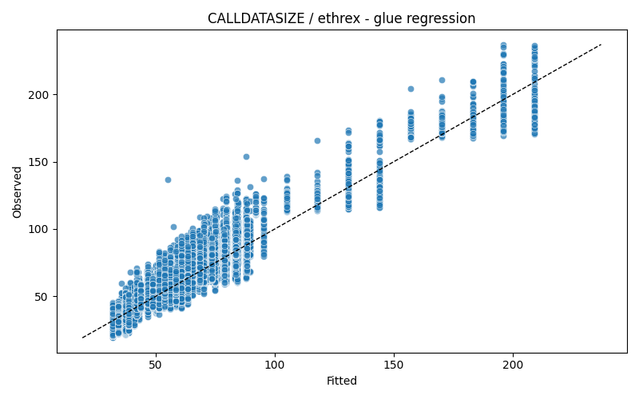

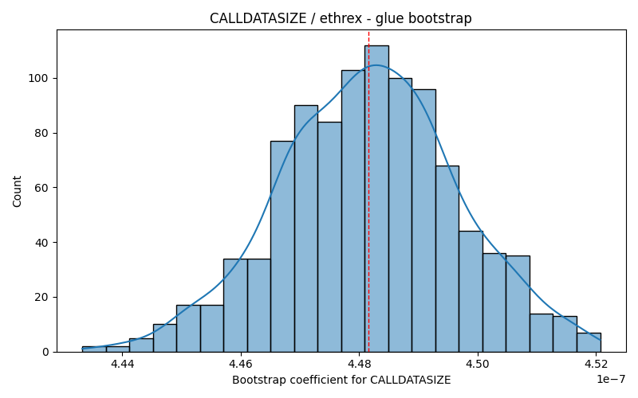

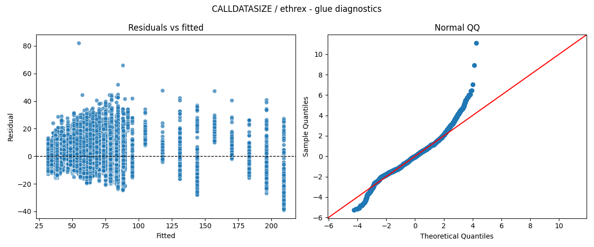

</details>

<details><summary><code>DUP</code> · nobs=93720 · runtime_ms=4.909e-07 · p=1.00e-03 · R²=0.8708</summary>

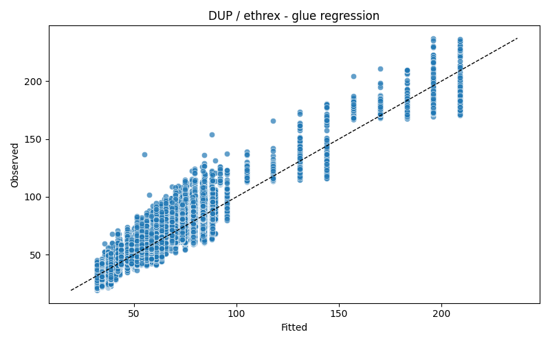

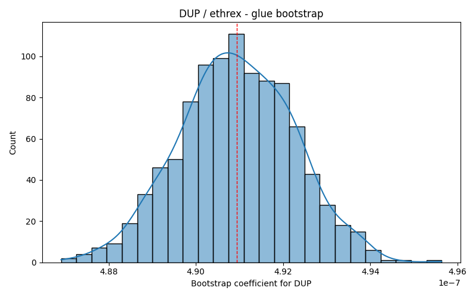


</details>

<details><summary><code>GAS</code> · nobs=93720 · runtime_ms=4.985e-07 · p=1.00e-03 · R²=0.8708</summary>


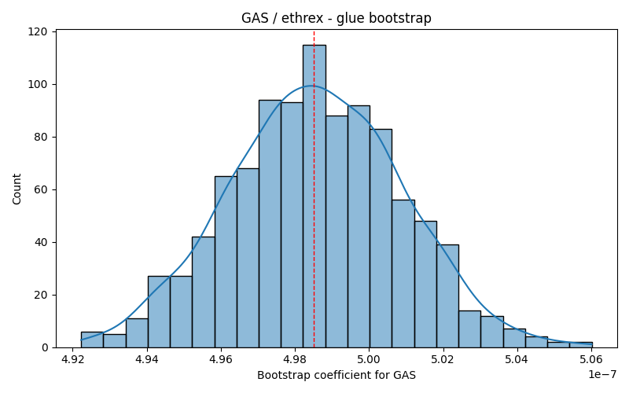


</details>

<details><summary><code>MLOAD</code> · nobs=93720 · runtime_ms=1.16e-06 · p=1.00e-03 · R²=0.8708</summary>


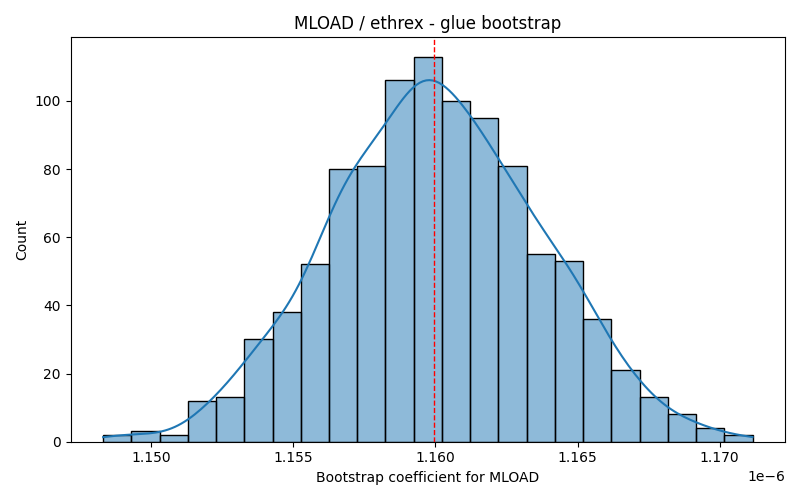

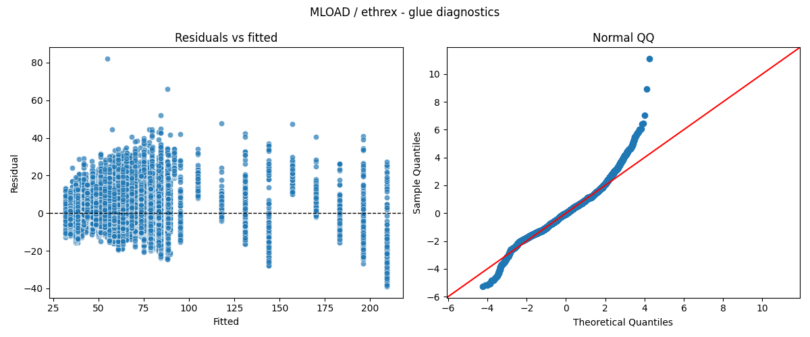

</details>

<details><summary><code>PUSH</code> · nobs=93720 · runtime_ms=6.575e-07 · p=1.00e-03 · R²=0.8708</summary>


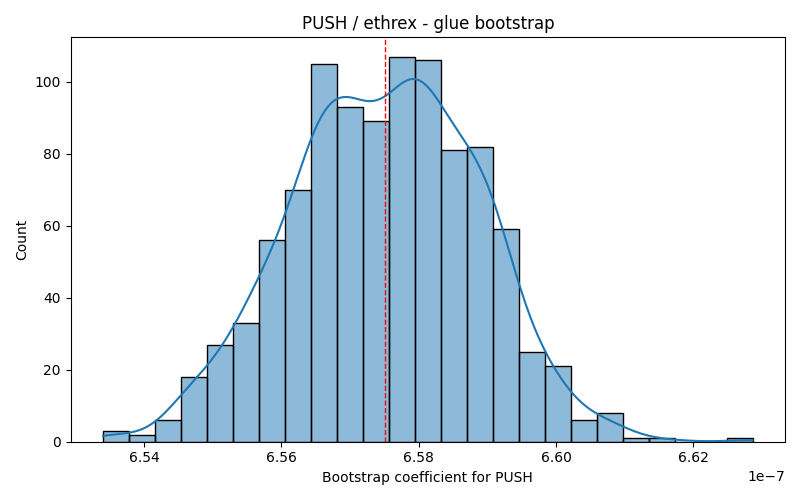


</details>

<details><summary><code>PUSH0</code> · nobs=93720 · runtime_ms=4.506e-07 · p=1.00e-03 · R²=0.8708</summary>

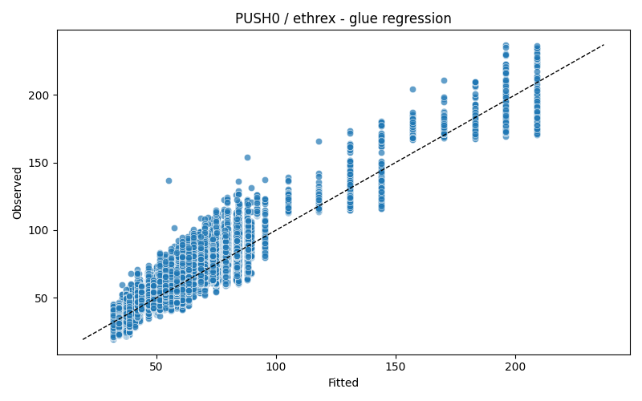


</details>

<details><summary><code>STATICCALL</code> · nobs=93720 · runtime_ms=7.465e-05 · p=1.00e-03 · R²=0.8708</summary>


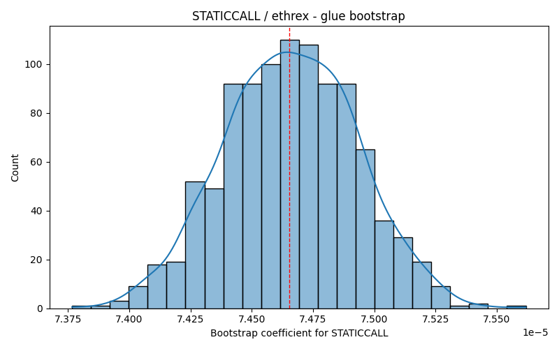


</details>

### Pure glue · ethrex

<details><summary><code>ISZERO</code> · nobs=1562 · runtime_ms=1.436e-06 · p=1.00e-03 · R²=0.8401</summary>

```
==============================================================================
                           NNLS Regression Results                            
==============================================================================
Dep. Variable:          test_runtime_ms              R-squared:          0.840
Model:                  NNLS                    Adj. R-squared:          0.840
No. Observations:       1562                              RMSE:          13.19
Df Residuals:           1560                               MAE:          11.08
Df Model:               1      
==============================================================================
                      coef     std err     P-value      [0.025      0.975]
------------------------------------------------------------------------------
         const     24.4033      1.1718       0.001     22.1468     26.6983
        ISZERO      0.0000      0.0000       0.001      0.0000      0.0000
==============================================================================
Notes: Non-negative least squares with bootstrap inference (1000 iterations)
==============================================================================
```

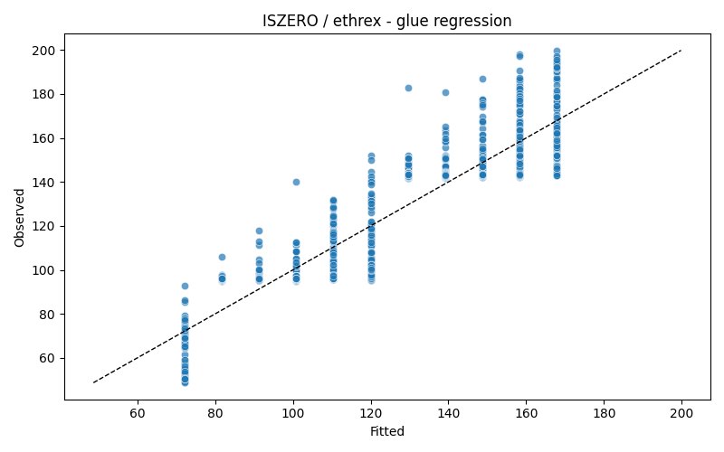

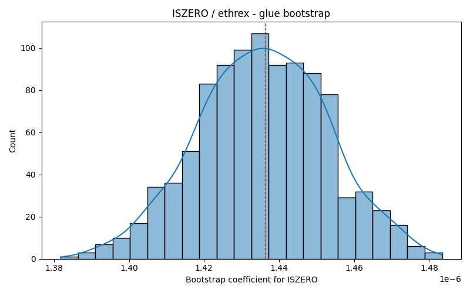

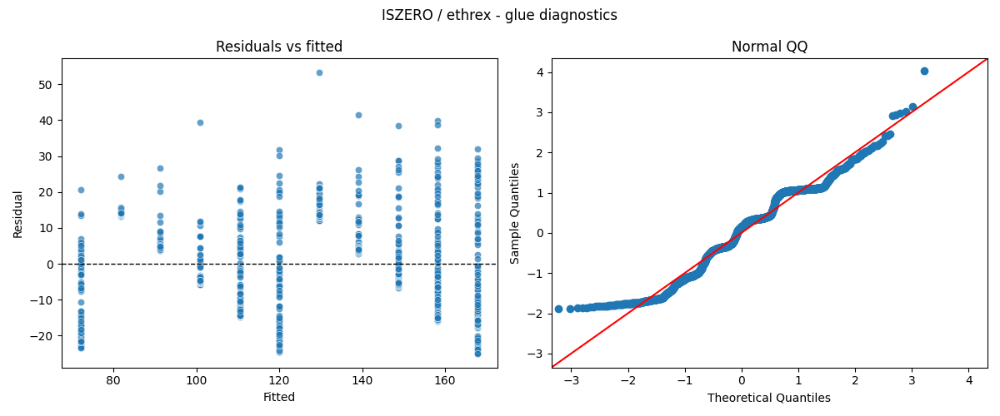

</details>

<details><summary><code>JUMPDEST</code> · nobs=1562 · runtime_ms=4.569e-07 · p=1.00e-03 · R²=0.8415</summary>

```
==============================================================================
                           NNLS Regression Results                            
==============================================================================
Dep. Variable:          test_runtime_ms              R-squared:          0.842
Model:                  NNLS                    Adj. R-squared:          0.841
No. Observations:       1562                              RMSE:          12.52
Df Residuals:           1560                               MAE:           9.69
Df Model:               1      
==============================================================================
                      coef     std err     P-value      [0.025      0.975]
------------------------------------------------------------------------------
         const     12.0966      0.9559       0.001     10.1472     13.9744
      JUMPDEST      0.0000      0.0000       0.001      0.0000      0.0000
==============================================================================
Notes: Non-negative least squares with bootstrap inference (1000 iterations)
==============================================================================
```

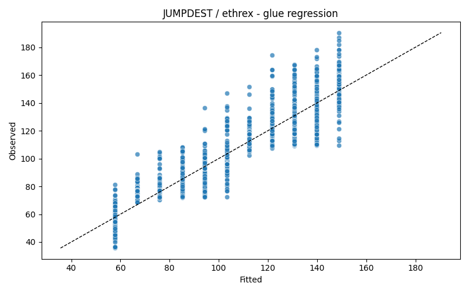

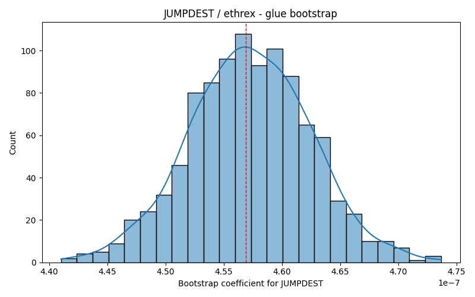

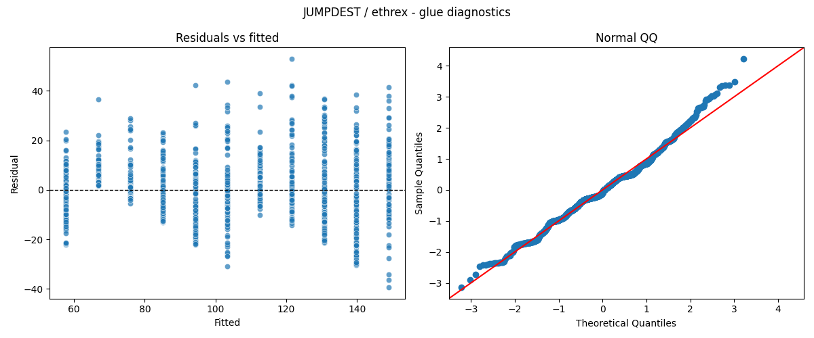

</details>

<details><summary><code>SWAP</code> · nobs=24992 · runtime_ms=7.066e-07 · p=1.00e-03 · R²=0.802</summary>

```
==============================================================================
                           NNLS Regression Results                            
==============================================================================
Dep. Variable:          test_runtime_ms              R-squared:          0.802
Model:                  NNLS                    Adj. R-squared:          0.802
No. Observations:       24992                             RMSE:           7.39
Df Residuals:           24990                              MAE:           5.84
Df Model:               1      
==============================================================================
                      coef     std err     P-value      [0.025      0.975]
------------------------------------------------------------------------------
         const     15.7802      0.1623       0.001     15.4606     16.0955
          SWAP      0.0000      0.0000       0.001      0.0000      0.0000
==============================================================================
Notes: Non-negative least squares with bootstrap inference (1000 iterations)
==============================================================================
```

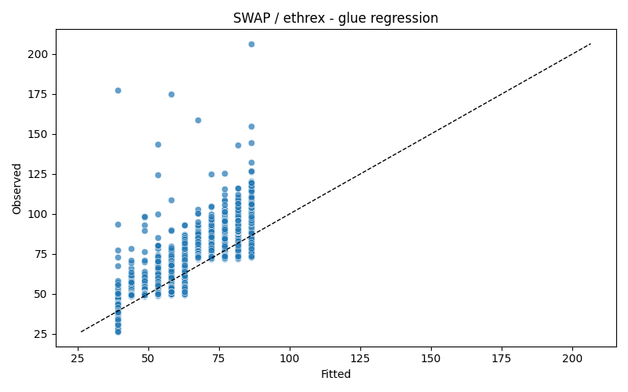

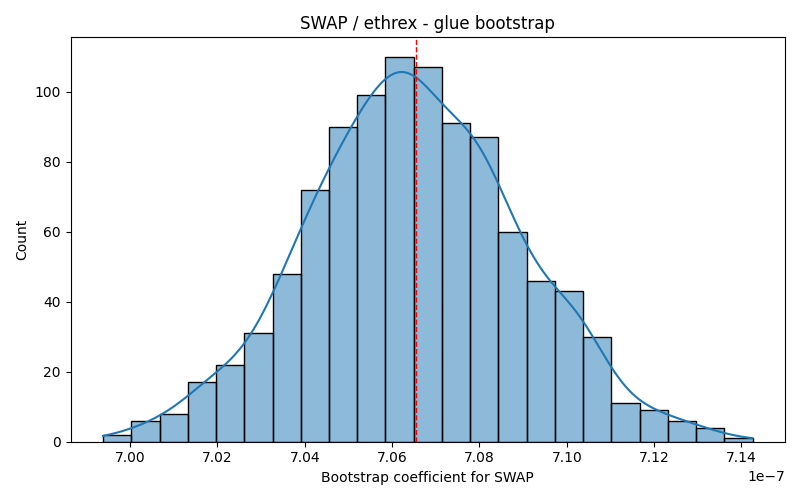

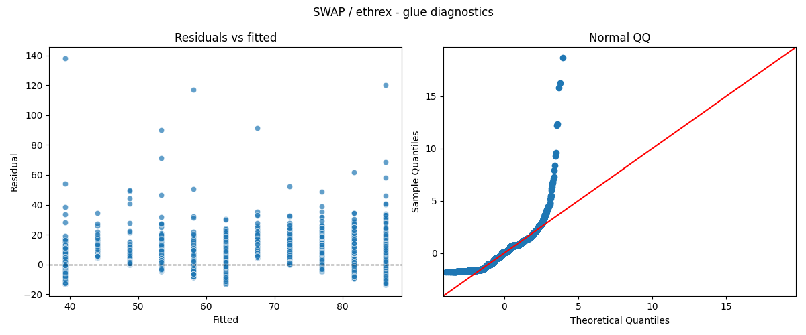

</details>

### Mixed glue (tier A) · ethrex

<details><summary><code>ADD</code> · nobs=1562 · runtime_ms=1.11e-06 · p=1.00e-03 · R²=0.7918</summary>

```
==============================================================================
                           NNLS Regression Results                            
==============================================================================
Dep. Variable:          test_runtime_ms              R-squared:          0.792
Model:                  NNLS                    Adj. R-squared:          0.792
No. Observations:       1562                              RMSE:           5.99
Df Residuals:           1560                               MAE:           4.69
Df Model:               1      
==============================================================================
                      coef     std err     P-value      [0.025      0.975]
------------------------------------------------------------------------------
         const     10.1337      0.5094       0.001      9.1608     11.0904
           ADD      0.0000      0.0000       0.001      0.0000      0.0000
==============================================================================
Notes: Non-negative least squares with bootstrap inference (1000 iterations)
==============================================================================
```

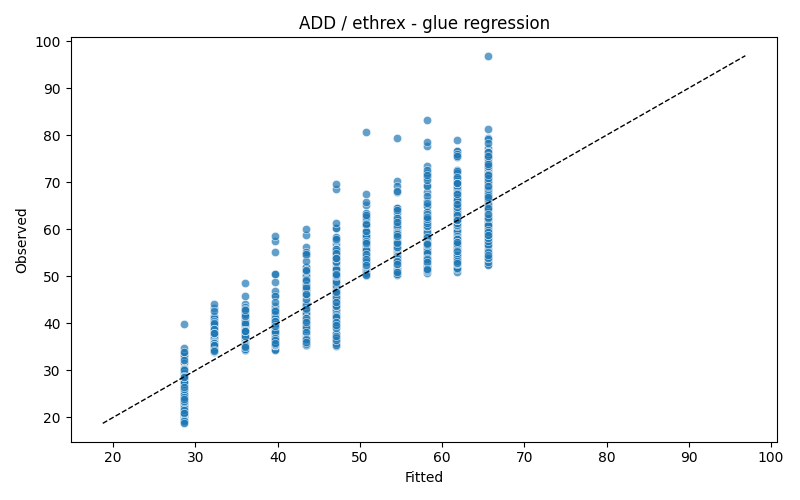

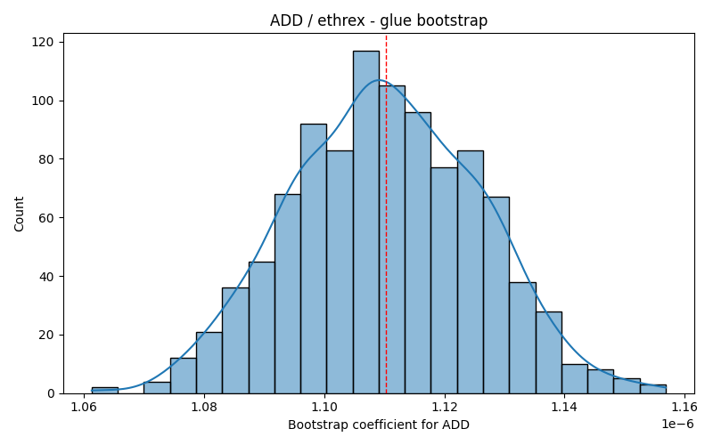

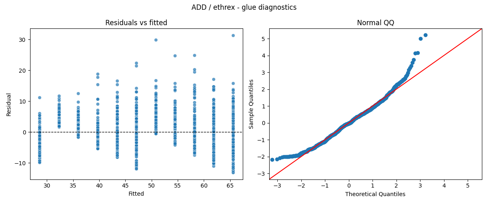

</details>

<details><summary><code>AND</code> · nobs=1562 · runtime_ms=1.094e-06 · p=1.00e-03 · R²=0.3757</summary>

```
==============================================================================
                           NNLS Regression Results                            
==============================================================================
Dep. Variable:          test_runtime_ms              R-squared:          0.376
Model:                  NNLS                    Adj. R-squared:          0.375
No. Observations:       1562                              RMSE:          14.84
Df Residuals:           1560                               MAE:          11.55
Df Model:               1      
==============================================================================
                      coef     std err     P-value      [0.025      0.975]
------------------------------------------------------------------------------
         const     15.5326      1.2779       0.001     13.1483     17.9750
           AND      0.0000      0.0000       0.001      0.0000      0.0000
==============================================================================
Notes: Non-negative least squares with bootstrap inference (1000 iterations)
==============================================================================
```

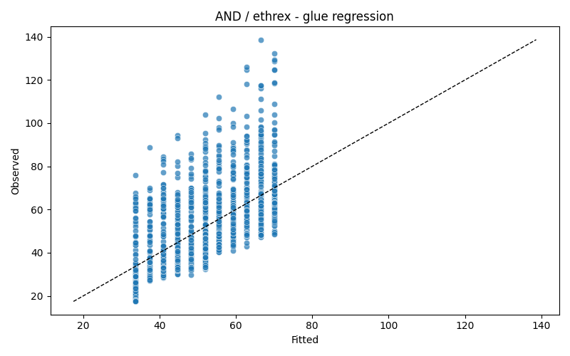

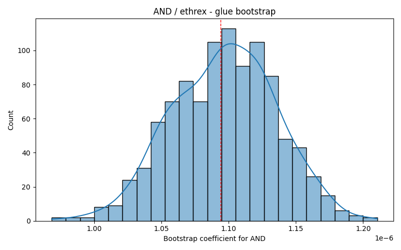

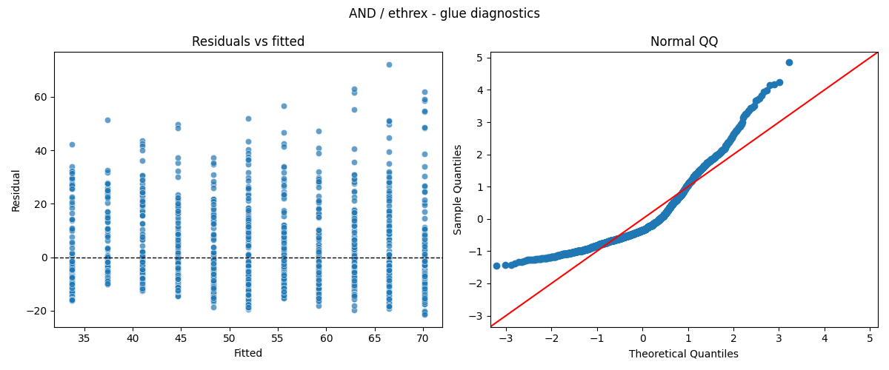

</details>

<details><summary><code>CALLDATACOPY</code> · nobs=37488 · runtime_ms=2.709e-06 · p=1.00e-03 · R²=0.8889</summary>

```
==============================================================================
                           NNLS Regression Results                            
==============================================================================
Dep. Variable:          test_runtime_ms              R-squared:          0.889
Model:                  NNLS                    Adj. R-squared:          0.889
No. Observations:       37488                             RMSE:           7.20
Df Residuals:           37486                              MAE:           5.24
Df Model:               1      
==============================================================================
                      coef     std err     P-value      [0.025      0.975]
------------------------------------------------------------------------------
         const     12.0853      0.0453       0.001     11.9939     12.1650
  CALLDATACOPY      0.0000      0.0000       0.001      0.0000      0.0000
==============================================================================
Notes: Non-negative least squares with bootstrap inference (1000 iterations)
==============================================================================
```

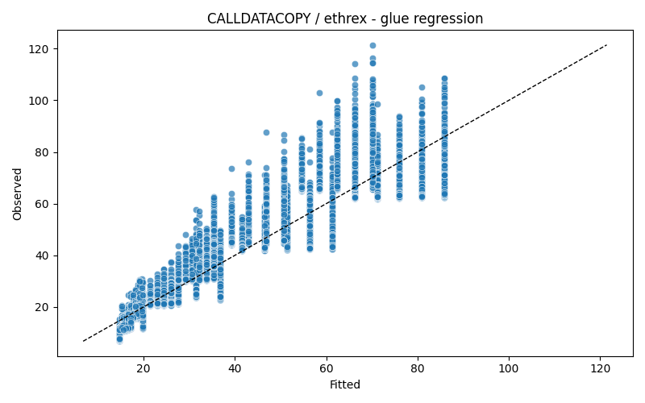

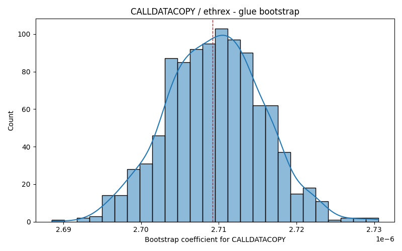

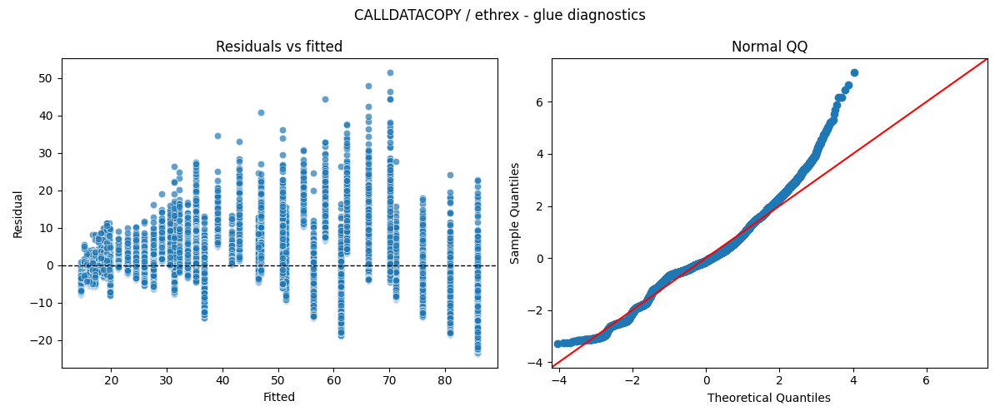

</details>

<details><summary><code>CALLDATALOAD</code> · nobs=6248 · runtime_ms=2.248e-05 · p=1.00e-03 · R²=0.2758</summary>

```
==============================================================================
                           NNLS Regression Results                            
==============================================================================
Dep. Variable:          test_runtime_ms              R-squared:          0.276
Model:                  NNLS                    Adj. R-squared:          0.276
No. Observations:       6248                              RMSE:           0.14
Df Residuals:           6246                               MAE:           0.11
Df Model:               1      
==============================================================================
                      coef     std err     P-value      [0.025      0.975]
------------------------------------------------------------------------------
         const      2.4383      0.0061       0.001      2.4270      2.4508
  CALLDATALOAD      0.0000      0.0000       0.001      0.0000      0.0000
==============================================================================
Notes: Non-negative least squares with bootstrap inference (1000 iterations)
==============================================================================
```

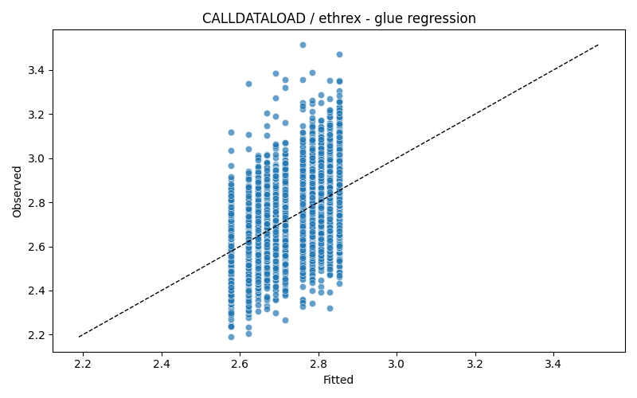

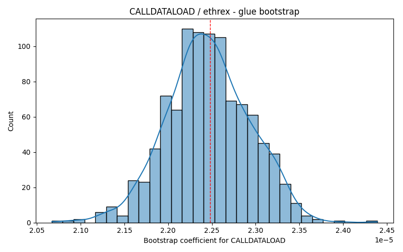

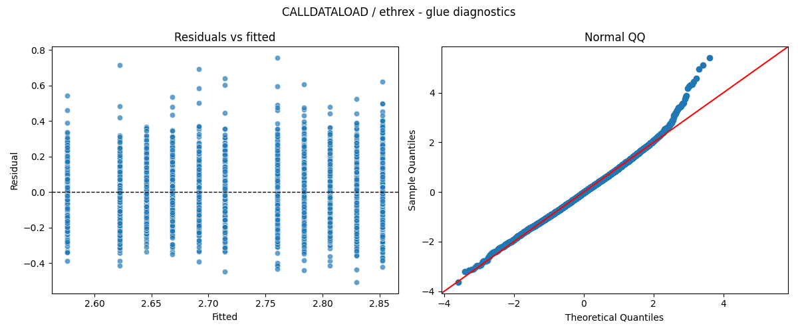

</details>

<details><summary><code>DIV</code> · nobs=1562 · runtime_ms=8.85e-06 · p=1.00e-03 · R²=0.8254</summary>

```
==============================================================================
                           NNLS Regression Results                            
==============================================================================
Dep. Variable:          test_runtime_ms              R-squared:          0.825
Model:                  NNLS                    Adj. R-squared:          0.825
No. Observations:       1562                              RMSE:          32.13
Df Residuals:           1560                               MAE:          27.05
Df Model:               1      
==============================================================================
                      coef     std err     P-value      [0.025      0.975]
------------------------------------------------------------------------------
         const     72.4046      3.1072       0.001     66.3321     78.7320
           DIV      0.0000      0.0000       0.001      0.0000      0.0000
==============================================================================
Notes: Non-negative least squares with bootstrap inference (1000 iterations)
==============================================================================
```

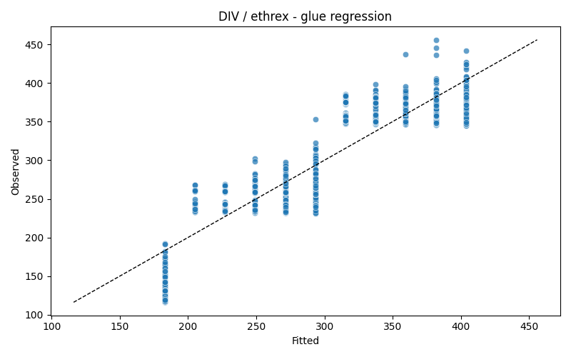

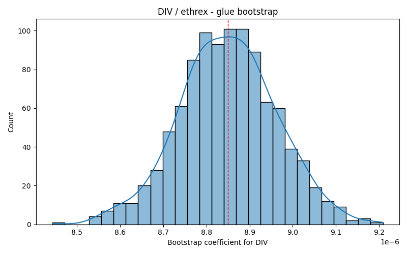

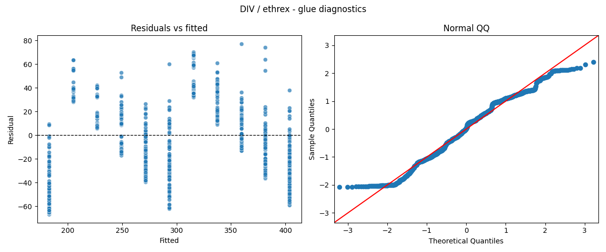

</details>

<details><summary><code>EXP</code> · nobs=1562 · runtime_ms=0.0009218 · p=1.00e-03 · R²=0.8276</summary>

```
==============================================================================
                           NNLS Regression Results                            
==============================================================================
Dep. Variable:          test_runtime_ms              R-squared:          0.828
Model:                  NNLS                    Adj. R-squared:          0.828
No. Observations:       1562                              RMSE:          16.47
Df Residuals:           1560                               MAE:          13.92
Df Model:               1      
==============================================================================
                      coef     std err     P-value      [0.025      0.975]
------------------------------------------------------------------------------
         const     35.3671      1.5164       0.001     32.2322     38.3045
           EXP      0.0009      0.0000       0.001      0.0009      0.0009
==============================================================================
Notes: Non-negative least squares with bootstrap inference (1000 iterations)
==============================================================================
```

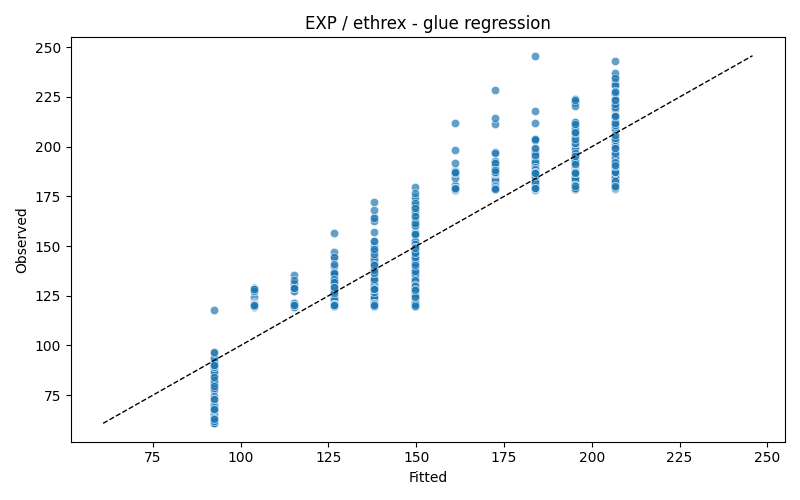

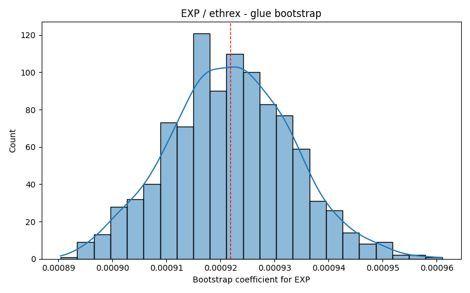

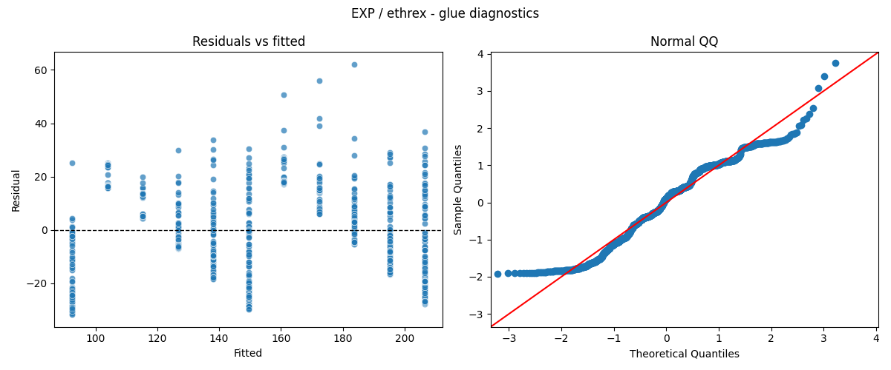

</details>

<details><summary><code>GT</code> · nobs=1562 · runtime_ms=1.065e-06 · p=1.00e-03 · R²=0.8253</summary>

```
==============================================================================
                           NNLS Regression Results                            
==============================================================================
Dep. Variable:          test_runtime_ms              R-squared:          0.825
Model:                  NNLS                    Adj. R-squared:          0.825
No. Observations:       1562                              RMSE:           5.16
Df Residuals:           1560                               MAE:           3.97
Df Model:               1      
==============================================================================
                      coef     std err     P-value      [0.025      0.975]
------------------------------------------------------------------------------
         const     10.4026      0.4245       0.001      9.5798     11.2400
            GT      0.0000      0.0000       0.001      0.0000      0.0000
==============================================================================
Notes: Non-negative least squares with bootstrap inference (1000 iterations)
==============================================================================
```

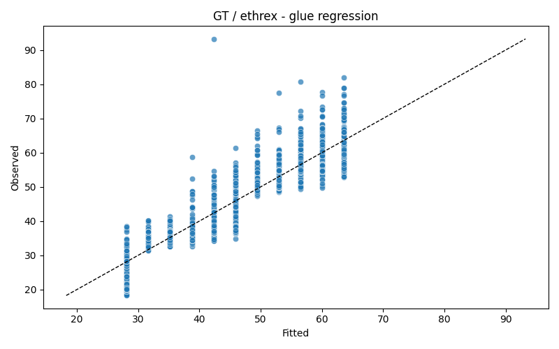

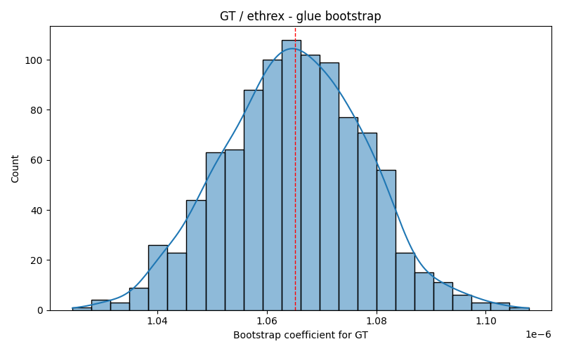

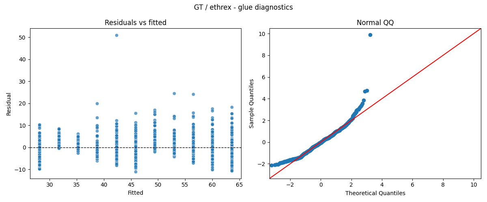

</details>

<details><summary><code>JUMPI</code> · nobs=1562 · runtime_ms=1.585e-06 · p=1.00e-03 · R²=0.809</summary>

```
==============================================================================
                           NNLS Regression Results                            
==============================================================================
Dep. Variable:          test_runtime_ms              R-squared:          0.809
Model:                  NNLS                    Adj. R-squared:          0.809
No. Observations:       1562                              RMSE:           3.47
Df Residuals:           1560                               MAE:           2.65
Df Model:               1      
==============================================================================
                      coef     std err     P-value      [0.025      0.975]
------------------------------------------------------------------------------
         const      6.6038      0.2872       0.001      6.0508      7.1736
         JUMPI      0.0000      0.0000       0.001      0.0000      0.0000
==============================================================================
Notes: Non-negative least squares with bootstrap inference (1000 iterations)
==============================================================================
```

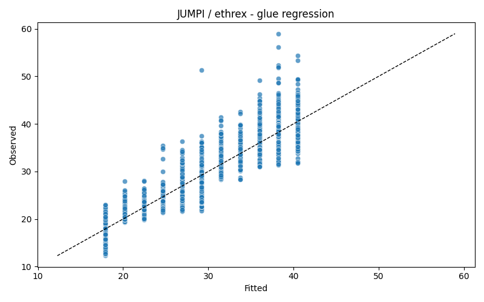

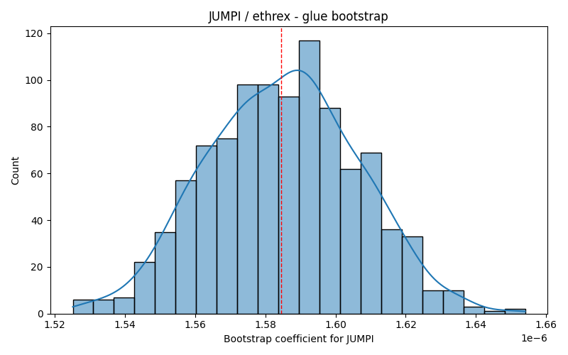

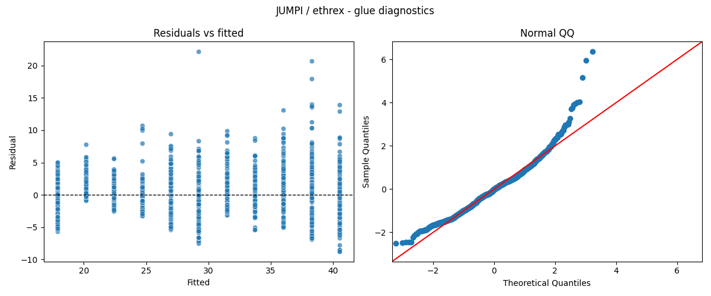

</details>

<details><summary><code>LT</code> · nobs=1562 · runtime_ms=1.052e-06 · p=1.00e-03 · R²=0.8172</summary>

```
==============================================================================
                           NNLS Regression Results                            
==============================================================================
Dep. Variable:          test_runtime_ms              R-squared:          0.817
Model:                  NNLS                    Adj. R-squared:          0.817
No. Observations:       1562                              RMSE:           5.24
Df Residuals:           1560                               MAE:           3.90
Df Model:               1      
==============================================================================
                      coef     std err     P-value      [0.025      0.975]
------------------------------------------------------------------------------
         const      9.9946      0.4361       0.001      9.2108     10.8838
            LT      0.0000      0.0000       0.001      0.0000      0.0000
==============================================================================
Notes: Non-negative least squares with bootstrap inference (1000 iterations)
==============================================================================
```

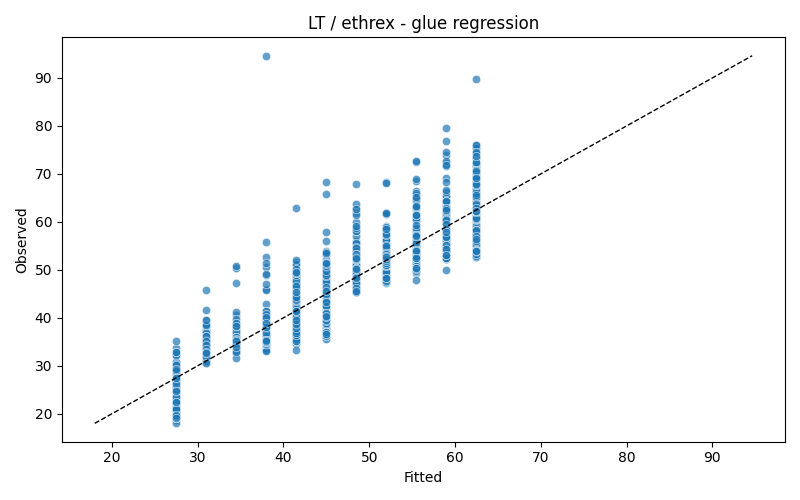

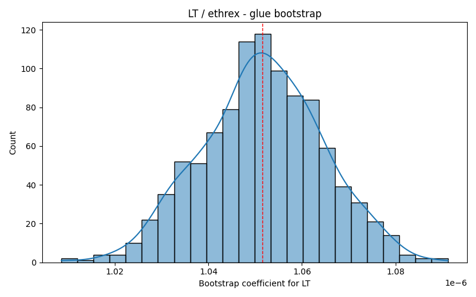

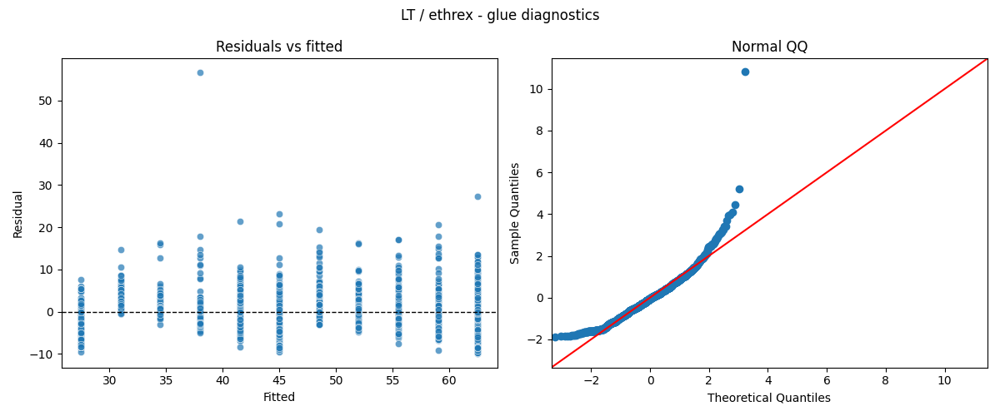

</details>

<details><summary><code>MSTORE</code> · nobs=7810 · runtime_ms=1.758e-06 · p=1.00e-03 · R²=0.7992</summary>

```
==============================================================================
                           NNLS Regression Results                            
==============================================================================
Dep. Variable:          test_runtime_ms              R-squared:          0.799
Model:                  NNLS                    Adj. R-squared:          0.799
No. Observations:       7810                              RMSE:           6.18
Df Residuals:           7808                               MAE:           4.64
Df Model:               1      
==============================================================================
                      coef     std err     P-value      [0.025      0.975]
------------------------------------------------------------------------------
         const     12.1935      0.2346       0.001     11.7453     12.6506
        MSTORE      0.0000      0.0000       0.001      0.0000      0.0000
==============================================================================
Notes: Non-negative least squares with bootstrap inference (1000 iterations)
==============================================================================
```

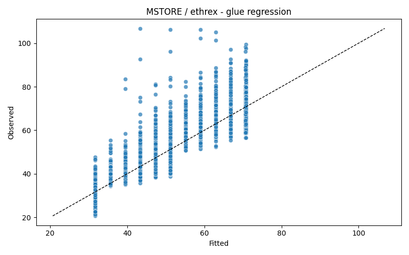

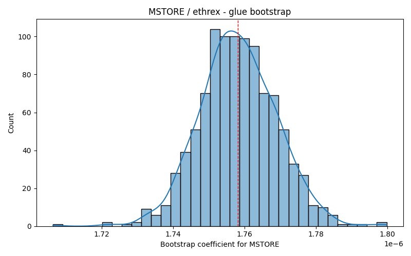

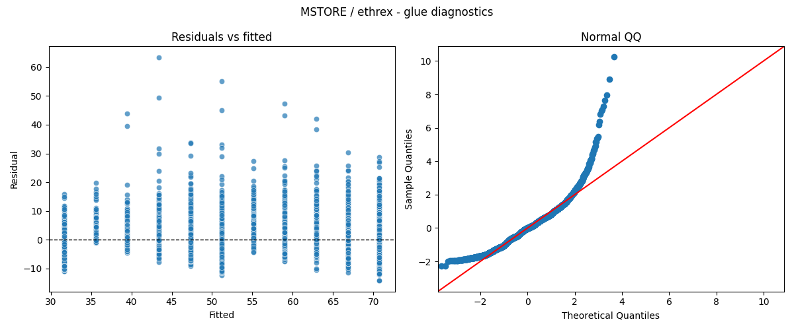

</details>

<details><summary><code>MSTORE8</code> · nobs=7810 · runtime_ms=1.651e-06 · p=1.00e-03 · R²=0.7741</summary>

```
==============================================================================
                           NNLS Regression Results                            
==============================================================================
Dep. Variable:          test_runtime_ms              R-squared:          0.774
Model:                  NNLS                    Adj. R-squared:          0.774
No. Observations:       7810                              RMSE:           6.26
Df Residuals:           7808                               MAE:           4.66
Df Model:               1      
==============================================================================
                      coef     std err     P-value      [0.025      0.975]
------------------------------------------------------------------------------
         const     11.8485      0.2372       0.001     11.3816     12.3188
       MSTORE8      0.0000      0.0000       0.001      0.0000      0.0000
==============================================================================
Notes: Non-negative least squares with bootstrap inference (1000 iterations)
==============================================================================
```


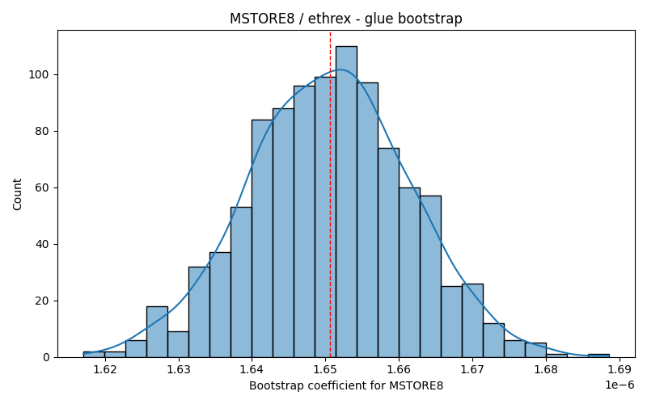

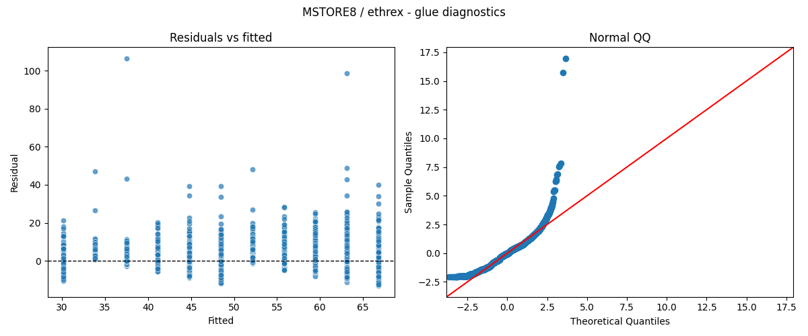

</details>

<details><summary><code>MUL</code> · nobs=1562 · runtime_ms=1.619e-06 · p=1.00e-03 · R²=0.815</summary>

```
==============================================================================
                           NNLS Regression Results                            
==============================================================================
Dep. Variable:          test_runtime_ms              R-squared:          0.815
Model:                  NNLS                    Adj. R-squared:          0.815
No. Observations:       1562                              RMSE:           6.09
Df Residuals:           1560                               MAE:           4.90
Df Model:               1      
==============================================================================
                      coef     std err     P-value      [0.025      0.975]
------------------------------------------------------------------------------
         const     12.6565      0.5210       0.001     11.6088     13.6714
           MUL      0.0000      0.0000       0.001      0.0000      0.0000
==============================================================================
Notes: Non-negative least squares with bootstrap inference (1000 iterations)
==============================================================================
```

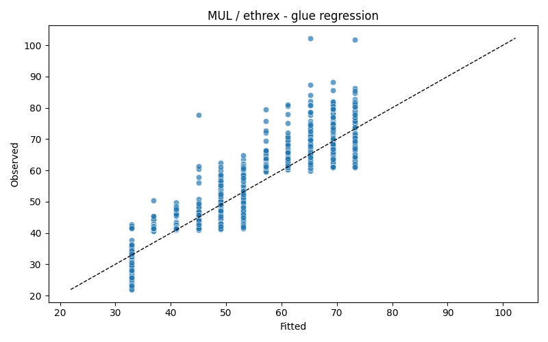

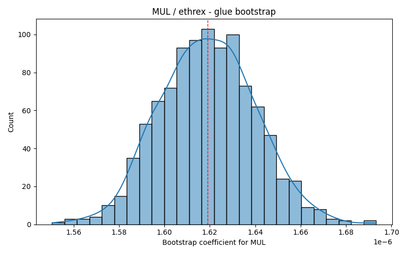

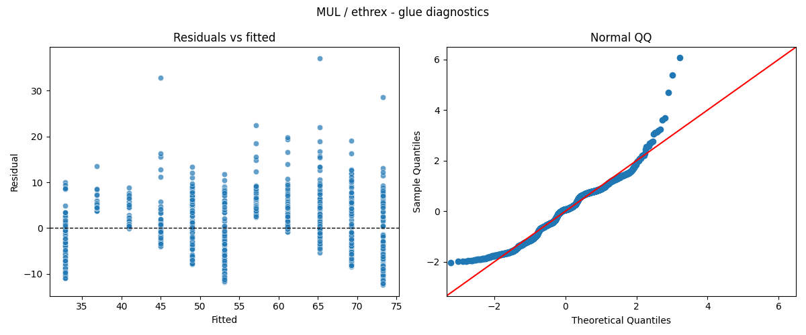

</details>

<details><summary><code>PC</code> · nobs=1562 · runtime_ms=5.608e-07 · p=1.00e-03 · R²=0.8263</summary>

```
==============================================================================
                           NNLS Regression Results                            
==============================================================================
Dep. Variable:          test_runtime_ms              R-squared:          0.826
Model:                  NNLS                    Adj. R-squared:          0.826
No. Observations:       1562                              RMSE:           7.69
Df Residuals:           1560                               MAE:           6.19
Df Model:               1      
==============================================================================
                      coef     std err     P-value      [0.025      0.975]
------------------------------------------------------------------------------
         const     15.0239      0.6697       0.001     13.6267     16.2893
            PC      0.0000      0.0000       0.001      0.0000      0.0000
==============================================================================
Notes: Non-negative least squares with bootstrap inference (1000 iterations)
==============================================================================
```

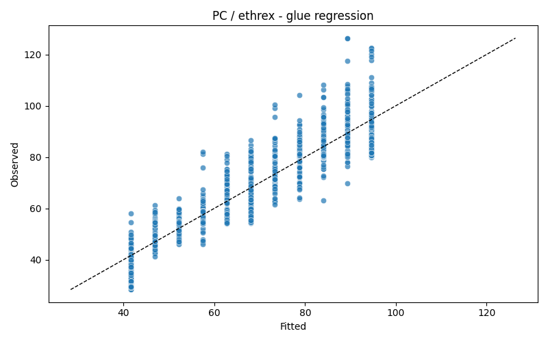

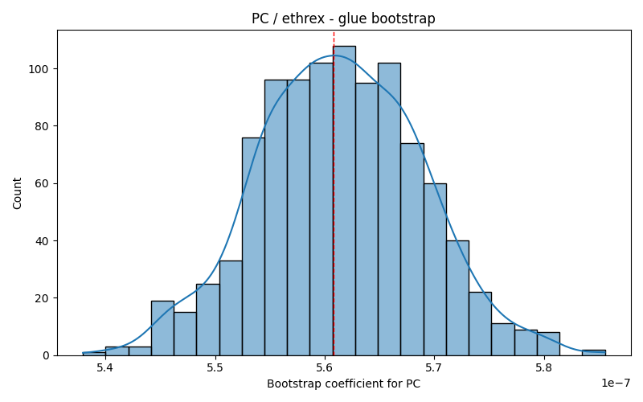

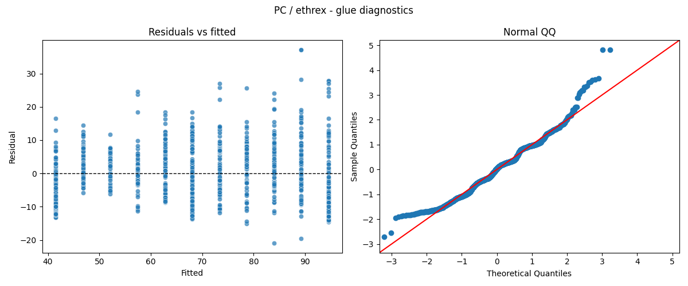

</details>

<details><summary><code>RETURNDATASIZE</code> · nobs=6248 · runtime_ms=9.413e-07 · p=1.00e-03 · R²=0.7934</summary>

```
==============================================================================
                           NNLS Regression Results                            
==============================================================================
Dep. Variable:          test_runtime_ms              R-squared:          0.793
Model:                  NNLS                    Adj. R-squared:          0.793
No. Observations:       6248                              RMSE:           7.58
Df Residuals:           6246                               MAE:           5.74
Df Model:               1      
==============================================================================
                      coef     std err     P-value      [0.025      0.975]
------------------------------------------------------------------------------
         const     12.8038      0.3187       0.001     12.2024     13.4437
RETURNDATASIZE      0.0000      0.0000       0.001      0.0000      0.0000
==============================================================================
Notes: Non-negative least squares with bootstrap inference (1000 iterations)
==============================================================================
```

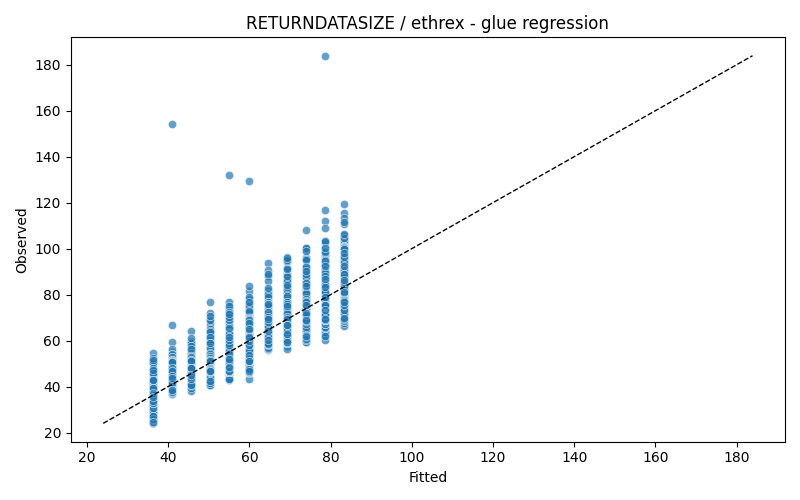

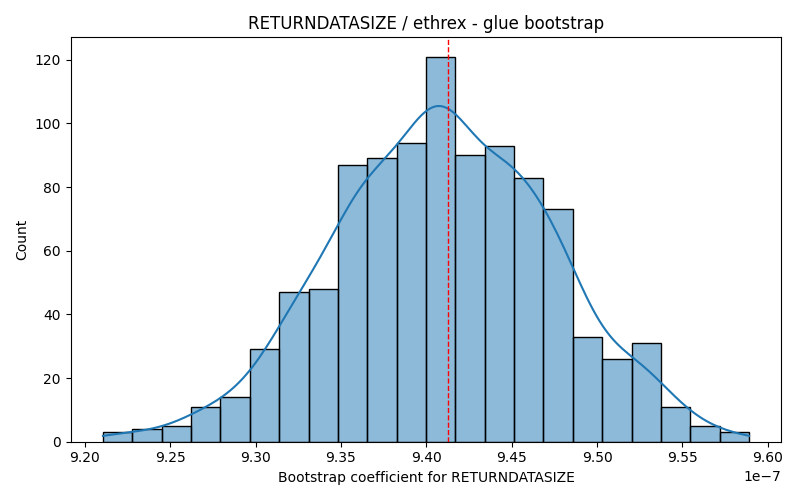

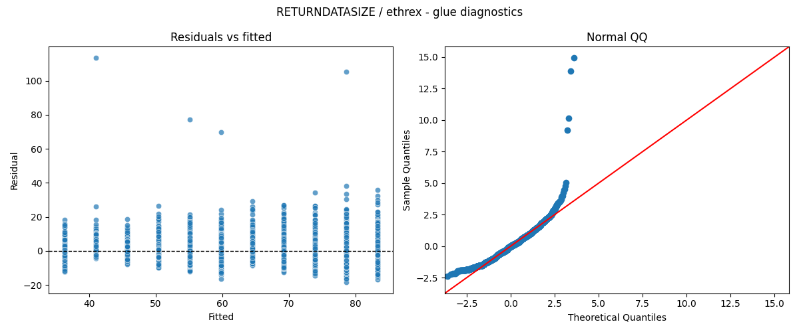

</details>

<details><summary><code>SELFBALANCE</code> · nobs=1278 · runtime_ms=4.751e-06 · p=1.00e-03 · R²=0.8116</summary>

```
==============================================================================
                           NNLS Regression Results                            
==============================================================================
Dep. Variable:          test_runtime_ms              R-squared:          0.812
Model:                  NNLS                    Adj. R-squared:          0.811
No. Observations:       1278                              RMSE:          23.09
Df Residuals:           1276                               MAE:          18.99
Df Model:               1      
==============================================================================
                      coef     std err     P-value      [0.025      0.975]
------------------------------------------------------------------------------
         const     77.4575      2.2274       0.001     73.1726     81.7269
   SELFBALANCE      0.0000      0.0000       0.001      0.0000      0.0000
==============================================================================
Notes: Non-negative least squares with bootstrap inference (1000 iterations)
==============================================================================
```

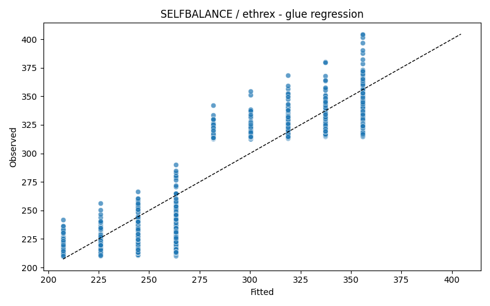

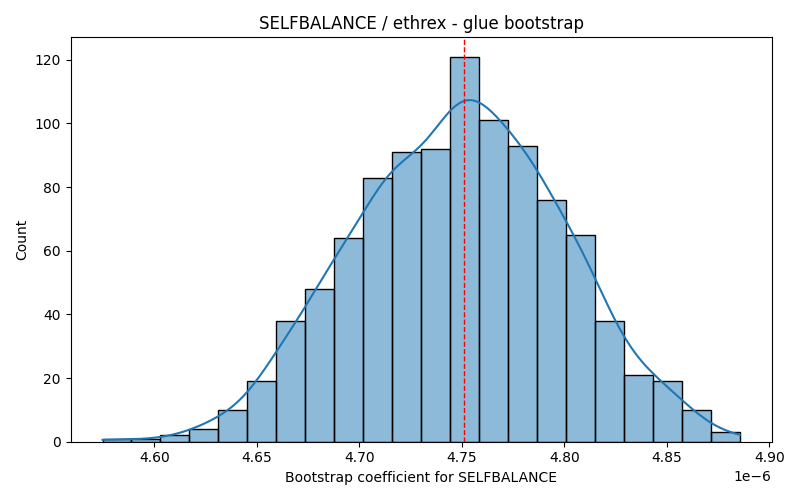

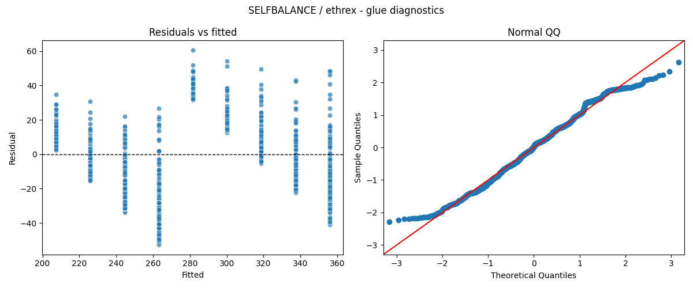

</details>

<details><summary><code>SUB</code> · nobs=1562 · runtime_ms=1.111e-06 · p=1.00e-03 · R²=0.7995</summary>

```
==============================================================================
                           NNLS Regression Results                            
==============================================================================
Dep. Variable:          test_runtime_ms              R-squared:          0.800
Model:                  NNLS                    Adj. R-squared:          0.799
No. Observations:       1562                              RMSE:           5.85
Df Residuals:           1560                               MAE:           4.65
Df Model:               1      
==============================================================================
                      coef     std err     P-value      [0.025      0.975]
------------------------------------------------------------------------------
         const     10.9133      0.4954       0.001      9.9800     11.9194
           SUB      0.0000      0.0000       0.001      0.0000      0.0000
==============================================================================
Notes: Non-negative least squares with bootstrap inference (1000 iterations)
==============================================================================
```

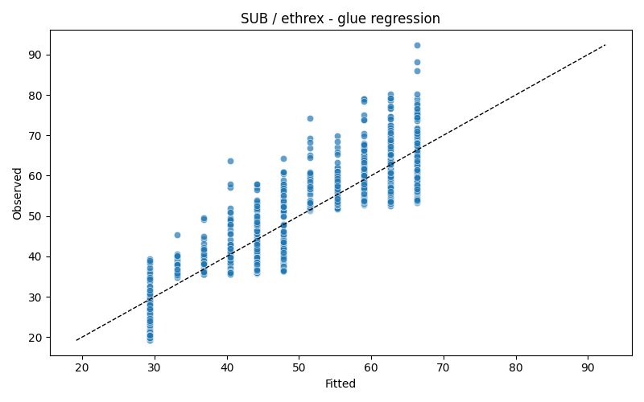

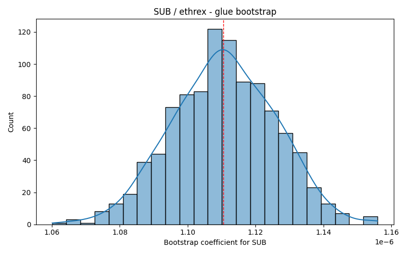

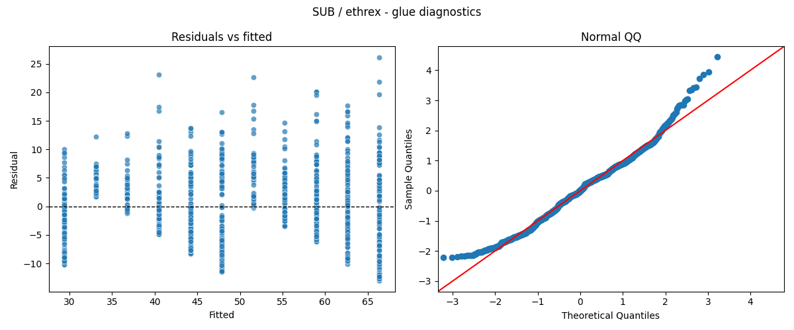

</details>

### Mixed glue (tier B) · ethrex

<details><summary><code>JUMP</code> · nobs=1562 · runtime_ms=4.321e-06 · p=1.00e-03 · R²=0.8159</summary>

```
==============================================================================
                           NNLS Regression Results                            
==============================================================================
Dep. Variable:          test_runtime_ms              R-squared:          0.816
Model:                  NNLS                    Adj. R-squared:          0.816
No. Observations:       1562                              RMSE:           7.63
Df Residuals:           1560                               MAE:           6.13
Df Model:               1      
==============================================================================
                      coef     std err     P-value      [0.025      0.975]
------------------------------------------------------------------------------
         const     18.0897      0.6383       0.001     16.8294     19.2695
          JUMP      0.0000      0.0000       0.001      0.0000      0.0000
==============================================================================
Notes: Non-negative least squares with bootstrap inference (1000 iterations)
==============================================================================
```

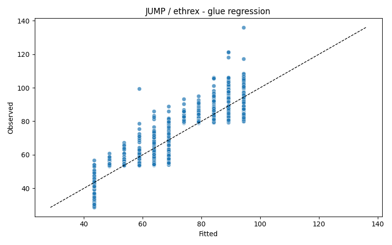

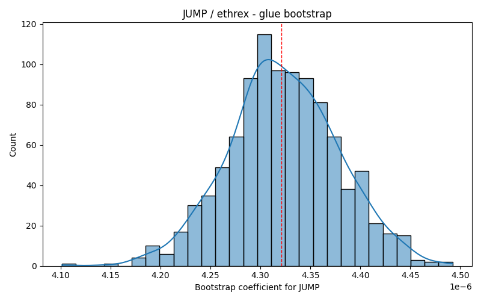

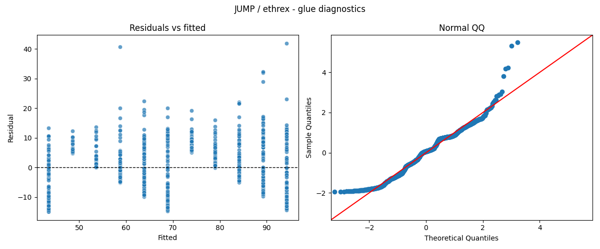

</details>

<details><summary><code>KECCAK256</code> · nobs=24992 · runtime_ms=0 · p=1.00e+00 · R²=2.22e-16</summary>

```
==============================================================================
                           NNLS Regression Results                            
==============================================================================
Dep. Variable:          test_runtime_ms              R-squared:          0.000
Model:                  NNLS                    Adj. R-squared:         -0.000
No. Observations:       24992                             RMSE:         159.73
Df Residuals:           24990                              MAE:         131.38
Df Model:               1      
==============================================================================
                      coef     std err     P-value      [0.025      0.975]
------------------------------------------------------------------------------
         const    240.5875      1.0191       0.001    238.6557    242.4812
     KECCAK256      0.0000      0.0000       1.000      0.0000      0.0000
==============================================================================
Notes: Non-negative least squares with bootstrap inference (1000 iterations)
==============================================================================
```

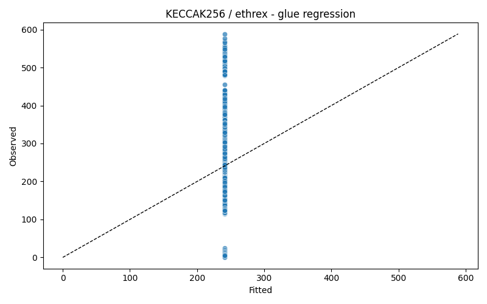


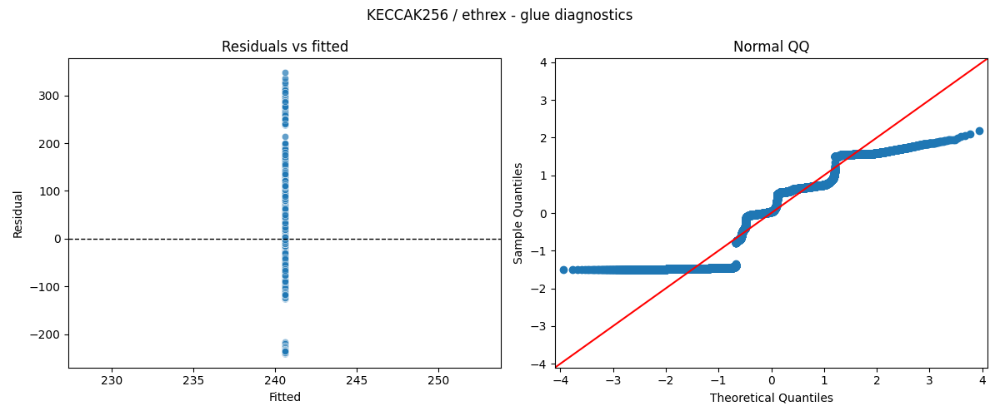

</details>

## geth

| glue_opcode | nobs | glue_runtime_ms | p_value | rsquared |
| --- | --- | --- | --- | --- |
| `ISZERO` | 4092 | 1.49e-06 | 1.00e-03 | 0.769 |
| `JUMPDEST` | 4092 | 1.184e-06 | 1.00e-03 | 0.7268 |
| `SWAP` | 65472 | 1.551e-06 | 1.00e-03 | 0.7132 |
| `CALLDATASIZE` | 242671 | 1.464e-06 | 1.00e-03 | 0.818 |
| `DUP` | 242671 | 1.554e-06 | 1.00e-03 | 0.818 |
| `GAS` | 242671 | 1.49e-06 | 1.00e-03 | 0.818 |
| `MLOAD` | 242671 | 5.256e-06 | 1.00e-03 | 0.818 |
| `PUSH` | 242671 | 2.303e-06 | 1.00e-03 | 0.818 |
| `PUSH0` | 242671 | 1.451e-06 | 1.00e-03 | 0.818 |
| `STATICCALL` | 242671 | 0.0001651 | 1.00e-03 | 0.818 |
| `ADD` | 4092 | 4.165e-06 | 1.00e-03 | 0.7332 |
| `AND` | 4092 | 3.834e-06 | 1.00e-03 | 0.7153 |
| `CALLDATACOPY` | 98208 | 1.304e-05 | 1.00e-03 | 0.9484 |
| `CALLDATALOAD` | 16368 | 5.077e-05 | 1.00e-03 | 0.02308 |
| `DIV` | 4092 | 7.929e-06 | 1.00e-03 | 0.7342 |
| `EXP` | 4092 | 0.0003483 | 1.00e-03 | 0.6943 |
| `GT` | 4092 | 3.576e-06 | 1.00e-03 | 0.7167 |
| `JUMPI` | 4092 | 5.784e-06 | 1.00e-03 | 0.7499 |
| `LT` | 4092 | 4.459e-06 | 1.00e-03 | 0.769 |
| `MSTORE` | 20460 | 7.787e-06 | 1.00e-03 | 0.7898 |
| `MSTORE8` | 20460 | 7.191e-06 | 1.00e-03 | 0.7689 |
| `MUL` | 4092 | 4.718e-06 | 1.00e-03 | 0.7998 |
| `PC` | 4092 | 1.647e-06 | 1.00e-03 | 0.809 |
| `RETURNDATASIZE` | 16368 | 3.213e-06 | 1.00e-03 | 0.6344 |
| `SELFBALANCE` | 3348 | 7.506e-06 | 1.00e-03 | 0.7965 |
| `SUB` | 4092 | 3.974e-06 | 1.00e-03 | 0.7256 |
| `JUMP` | 4092 | 9.192e-06 | 1.00e-03 | 0.7801 |
| `KECCAK256` | 65472 | 2.626e-05 | 1.00e-03 | 0.1731 |

### Cycle glue — joint fit · geth

<details><summary>Joint NNLS regression summary</summary>

```
==============================================================================
                           NNLS Regression Results                            
==============================================================================
Dep. Variable:          test_runtime_ms              R-squared:          0.818
Model:                  NNLS                    Adj. R-squared:          0.818
No. Observations:       242671                            RMSE:          25.05
Df Residuals:           242663                             MAE:          19.28
Df Model:               7      
==============================================================================
                      coef     std err     P-value      [0.025      0.975]
------------------------------------------------------------------------------
         const     39.5618      0.1786       0.001     39.2341     39.9093
  CALLDATASIZE      0.0000      0.0000       0.001      0.0000      0.0000
           DUP      0.0000      0.0000       0.001      0.0000      0.0000
           GAS      0.0000      0.0000       0.001      0.0000      0.0000
         MLOAD      0.0000      0.0000       0.001      0.0000      0.0000
          PUSH      0.0000      0.0000       0.001      0.0000      0.0000
         PUSH0      0.0000      0.0000       0.001      0.0000      0.0000
    STATICCALL      0.0002      0.0000       0.001      0.0002      0.0002
==============================================================================
Notes: Non-negative least squares with bootstrap inference (1000 iterations)
==============================================================================
```

</details>

<details><summary><code>CALLDATASIZE</code> · nobs=242671 · runtime_ms=1.464e-06 · p=1.00e-03 · R²=0.818</summary>


</details>

<details><summary><code>DUP</code> · nobs=242671 · runtime_ms=1.554e-06 · p=1.00e-03 · R²=0.818</summary>


</details>

<details><summary><code>GAS</code> · nobs=242671 · runtime_ms=1.49e-06 · p=1.00e-03 · R²=0.818</summary>


</details>

<details><summary><code>MLOAD</code> · nobs=242671 · runtime_ms=5.256e-06 · p=1.00e-03 · R²=0.818</summary>


</details>

<details><summary><code>PUSH</code> · nobs=242671 · runtime_ms=2.303e-06 · p=1.00e-03 · R²=0.818</summary>


</details>

<details><summary><code>PUSH0</code> · nobs=242671 · runtime_ms=1.451e-06 · p=1.00e-03 · R²=0.818</summary>


</details>

<details><summary><code>STATICCALL</code> · nobs=242671 · runtime_ms=0.0001651 · p=1.00e-03 · R²=0.818</summary>


</details>

### Pure glue · geth

<details><summary><code>ISZERO</code> · nobs=4092 · runtime_ms=1.49e-06 · p=1.00e-03 · R²=0.769</summary>

```
==============================================================================
                           NNLS Regression Results                            
==============================================================================
Dep. Variable:          test_runtime_ms              R-squared:          0.769
Model:                  NNLS                    Adj. R-squared:          0.769
No. Observations:       4092                              RMSE:          17.19
Df Residuals:           4090                               MAE:          12.60
Df Model:               1      
==============================================================================
                      coef     std err     P-value      [0.025      0.975]
------------------------------------------------------------------------------
         const     25.2771      0.9788       0.001     23.4834     27.1689
        ISZERO      0.0000      0.0000       0.001      0.0000      0.0000
==============================================================================
Notes: Non-negative least squares with bootstrap inference (1000 iterations)
==============================================================================
```


</details>

<details><summary><code>JUMPDEST</code> · nobs=4092 · runtime_ms=1.184e-06 · p=1.00e-03 · R²=0.7268</summary>

```
==============================================================================
                           NNLS Regression Results                            
==============================================================================
Dep. Variable:          test_runtime_ms              R-squared:          0.727
Model:                  NNLS                    Adj. R-squared:          0.727
No. Observations:       4092                              RMSE:          45.83
Df Residuals:           4090                               MAE:          29.15
Df Model:               1      
==============================================================================
                      coef     std err     P-value      [0.025      0.975]
------------------------------------------------------------------------------
         const     70.8747      2.8869       0.001     65.1024     76.6040
      JUMPDEST      0.0000      0.0000       0.001      0.0000      0.0000
==============================================================================
Notes: Non-negative least squares with bootstrap inference (1000 iterations)
==============================================================================
```


</details>

<details><summary><code>SWAP</code> · nobs=65472 · runtime_ms=1.551e-06 · p=1.00e-03 · R²=0.7132</summary>

```
==============================================================================
                           NNLS Regression Results                            
==============================================================================
Dep. Variable:          test_runtime_ms              R-squared:          0.713
Model:                  NNLS                    Adj. R-squared:          0.713
No. Observations:       65472                             RMSE:          20.71
Df Residuals:           65470                              MAE:          14.35
Df Model:               1      
==============================================================================
                      coef     std err     P-value      [0.025      0.975]
------------------------------------------------------------------------------
         const     32.7120      0.2784       0.001     32.2044     33.2719
          SWAP      0.0000      0.0000       0.001      0.0000      0.0000
==============================================================================
Notes: Non-negative least squares with bootstrap inference (1000 iterations)
==============================================================================
```


</details>

### Mixed glue (tier A) · geth

<details><summary><code>ADD</code> · nobs=4092 · runtime_ms=4.165e-06 · p=1.00e-03 · R²=0.7332</summary>

```
==============================================================================
                           NNLS Regression Results                            
==============================================================================
Dep. Variable:          test_runtime_ms              R-squared:          0.733
Model:                  NNLS                    Adj. R-squared:          0.733
No. Observations:       4092                              RMSE:          26.44
Df Residuals:           4090                               MAE:          19.19
Df Model:               1      
==============================================================================
                      coef     std err     P-value      [0.025      0.975]
------------------------------------------------------------------------------
         const     45.1612      1.3717       0.001     42.4840     47.8226
           ADD      0.0000      0.0000       0.001      0.0000      0.0000
==============================================================================
Notes: Non-negative least squares with bootstrap inference (1000 iterations)
==============================================================================
```


</details>

<details><summary><code>AND</code> · nobs=4092 · runtime_ms=3.834e-06 · p=1.00e-03 · R²=0.7153</summary>

```
==============================================================================
                           NNLS Regression Results                            
==============================================================================
Dep. Variable:          test_runtime_ms              R-squared:          0.715
Model:                  NNLS                    Adj. R-squared:          0.715
No. Observations:       4092                              RMSE:          25.46
Df Residuals:           4090                               MAE:          18.73
Df Model:               1      
==============================================================================
                      coef     std err     P-value      [0.025      0.975]
------------------------------------------------------------------------------
         const     45.4725      1.2513       0.001     42.9165     47.9854
           AND      0.0000      0.0000       0.001      0.0000      0.0000
==============================================================================
Notes: Non-negative least squares with bootstrap inference (1000 iterations)
==============================================================================
```


</details>

<details><summary><code>CALLDATACOPY</code> · nobs=98208 · runtime_ms=1.304e-05 · p=1.00e-03 · R²=0.9484</summary>

```
==============================================================================
                           NNLS Regression Results                            
==============================================================================
Dep. Variable:          test_runtime_ms              R-squared:          0.948
Model:                  NNLS                    Adj. R-squared:          0.948
No. Observations:       98208                             RMSE:          22.88
Df Residuals:           98206                              MAE:          16.53
Df Model:               1      
==============================================================================
                      coef     std err     P-value      [0.025      0.975]
------------------------------------------------------------------------------
         const     20.7873      0.0925       0.001     20.6047     20.9704
  CALLDATACOPY      0.0000      0.0000       0.001      0.0000      0.0000
==============================================================================
Notes: Non-negative least squares with bootstrap inference (1000 iterations)
==============================================================================
```


</details>

<details><summary><code>CALLDATALOAD</code> · nobs=16368 · runtime_ms=5.077e-05 · p=1.00e-03 · R²=0.02308</summary>

```
==============================================================================
                           NNLS Regression Results                            
==============================================================================
Dep. Variable:          test_runtime_ms              R-squared:          0.023
Model:                  NNLS                    Adj. R-squared:          0.023
No. Observations:       16368                             RMSE:           1.27
Df Residuals:           16366                              MAE:           0.63
Df Model:               1      
==============================================================================
                      coef     std err     P-value      [0.025      0.975]
------------------------------------------------------------------------------
         const      2.6974      0.0312       0.001      2.6377      2.7573
  CALLDATALOAD      0.0001      0.0000       0.001      0.0000      0.0001
==============================================================================
Notes: Non-negative least squares with bootstrap inference (1000 iterations)
==============================================================================
```


</details>

<details><summary><code>DIV</code> · nobs=4092 · runtime_ms=7.929e-06 · p=1.00e-03 · R²=0.7342</summary>

```
==============================================================================
                           NNLS Regression Results                            
==============================================================================
Dep. Variable:          test_runtime_ms              R-squared:          0.734
Model:                  NNLS                    Adj. R-squared:          0.734
No. Observations:       4092                              RMSE:          37.67
Df Residuals:           4090                               MAE:          30.77
Df Model:               1      
==============================================================================
                      coef     std err     P-value      [0.025      0.975]
------------------------------------------------------------------------------
         const     75.8186      2.1321       0.001     71.8208     79.8344
           DIV      0.0000      0.0000       0.001      0.0000      0.0000
==============================================================================
Notes: Non-negative least squares with bootstrap inference (1000 iterations)
==============================================================================
```


</details>

<details><summary><code>EXP</code> · nobs=4092 · runtime_ms=0.0003483 · p=1.00e-03 · R²=0.6943</summary>

```
==============================================================================
                           NNLS Regression Results                            
==============================================================================
Dep. Variable:          test_runtime_ms              R-squared:          0.694
Model:                  NNLS                    Adj. R-squared:          0.694
No. Observations:       4092                              RMSE:           9.05
Df Residuals:           4090                               MAE:           6.92
Df Model:               1      
==============================================================================
                      coef     std err     P-value      [0.025      0.975]
------------------------------------------------------------------------------
         const     13.6344      0.4624       0.001     12.7261     14.4798
           EXP      0.0003      0.0000       0.001      0.0003      0.0004
==============================================================================
Notes: Non-negative least squares with bootstrap inference (1000 iterations)
==============================================================================
```


</details>

<details><summary><code>GT</code> · nobs=4092 · runtime_ms=3.576e-06 · p=1.00e-03 · R²=0.7167</summary>

```
==============================================================================
                           NNLS Regression Results                            
==============================================================================
Dep. Variable:          test_runtime_ms              R-squared:          0.717
Model:                  NNLS                    Adj. R-squared:          0.717
No. Observations:       4092                              RMSE:          23.66
Df Residuals:           4090                               MAE:          16.34
Df Model:               1      
==============================================================================
                      coef     std err     P-value      [0.025      0.975]
------------------------------------------------------------------------------
         const     36.5714      1.2348       0.001     34.3681     39.1101
            GT      0.0000      0.0000       0.001      0.0000      0.0000
==============================================================================
Notes: Non-negative least squares with bootstrap inference (1000 iterations)
==============================================================================
```


</details>

<details><summary><code>JUMPI</code> · nobs=4092 · runtime_ms=5.784e-06 · p=1.00e-03 · R²=0.7499</summary>

```
==============================================================================
                           NNLS Regression Results                            
==============================================================================
Dep. Variable:          test_runtime_ms              R-squared:          0.750
Model:                  NNLS                    Adj. R-squared:          0.750
No. Observations:       4092                              RMSE:          15.07
Df Residuals:           4090                               MAE:          10.83
Df Model:               1      
==============================================================================
                      coef     std err     P-value      [0.025      0.975]
------------------------------------------------------------------------------
         const     21.1811      0.7868       0.001     19.5703     22.6507
         JUMPI      0.0000      0.0000       0.001      0.0000      0.0000
==============================================================================
Notes: Non-negative least squares with bootstrap inference (1000 iterations)
==============================================================================
```


</details>

<details><summary><code>LT</code> · nobs=4092 · runtime_ms=4.459e-06 · p=1.00e-03 · R²=0.769</summary>

```
==============================================================================
                           NNLS Regression Results                            
==============================================================================
Dep. Variable:          test_runtime_ms              R-squared:          0.769
Model:                  NNLS                    Adj. R-squared:          0.769
No. Observations:       4092                              RMSE:          25.72
Df Residuals:           4090                               MAE:          18.87
Df Model:               1      
==============================================================================
                      coef     std err     P-value      [0.025      0.975]
------------------------------------------------------------------------------
         const     42.6483      1.3915       0.001     39.9191     45.4231
            LT      0.0000      0.0000       0.001      0.0000      0.0000
==============================================================================
Notes: Non-negative least squares with bootstrap inference (1000 iterations)
==============================================================================
```


</details>

<details><summary><code>MSTORE</code> · nobs=20460 · runtime_ms=7.787e-06 · p=1.00e-03 · R²=0.7898</summary>

```
==============================================================================
                           NNLS Regression Results                            
==============================================================================
Dep. Variable:          test_runtime_ms              R-squared:          0.790
Model:                  NNLS                    Adj. R-squared:          0.790
No. Observations:       20460                             RMSE:          28.19
Df Residuals:           20458                              MAE:          21.74
Df Model:               1      
==============================================================================
                      coef     std err     P-value      [0.025      0.975]
------------------------------------------------------------------------------
         const     53.7825      0.7120       0.001     52.3743     55.1127
        MSTORE      0.0000      0.0000       0.001      0.0000      0.0000
==============================================================================
Notes: Non-negative least squares with bootstrap inference (1000 iterations)
==============================================================================
```


</details>

<details><summary><code>MSTORE8</code> · nobs=20460 · runtime_ms=7.191e-06 · p=1.00e-03 · R²=0.7689</summary>

```
==============================================================================
                           NNLS Regression Results                            
==============================================================================
Dep. Variable:          test_runtime_ms              R-squared:          0.769
Model:                  NNLS                    Adj. R-squared:          0.769
No. Observations:       20460                             RMSE:          27.67
Df Residuals:           20458                              MAE:          20.57
Df Model:               1      
==============================================================================
                      coef     std err     P-value      [0.025      0.975]
------------------------------------------------------------------------------
         const     50.0349      0.7101       0.001     48.6213     51.4429
       MSTORE8      0.0000      0.0000       0.001      0.0000      0.0000
==============================================================================
Notes: Non-negative least squares with bootstrap inference (1000 iterations)
==============================================================================
```


</details>

<details><summary><code>MUL</code> · nobs=4092 · runtime_ms=4.718e-06 · p=1.00e-03 · R²=0.7998</summary>

```
==============================================================================
                           NNLS Regression Results                            
==============================================================================
Dep. Variable:          test_runtime_ms              R-squared:          0.800
Model:                  NNLS                    Adj. R-squared:          0.800
No. Observations:       4092                              RMSE:          18.63
Df Residuals:           4090                               MAE:          13.87
Df Model:               1      
==============================================================================
                      coef     std err     P-value      [0.025      0.975]
------------------------------------------------------------------------------
         const     38.3300      0.9421       0.001     36.5998     40.1880
           MUL      0.0000      0.0000       0.001      0.0000      0.0000
==============================================================================
Notes: Non-negative least squares with bootstrap inference (1000 iterations)
==============================================================================
```


</details>

<details><summary><code>PC</code> · nobs=4092 · runtime_ms=1.647e-06 · p=1.00e-03 · R²=0.809</summary>

```
==============================================================================
                           NNLS Regression Results                            
==============================================================================
Dep. Variable:          test_runtime_ms              R-squared:          0.809
Model:                  NNLS                    Adj. R-squared:          0.809
No. Observations:       4092                              RMSE:          23.93
Df Residuals:           4090                               MAE:          18.80
Df Model:               1      
==============================================================================
                      coef     std err     P-value      [0.025      0.975]
------------------------------------------------------------------------------
         const     40.7251      1.3751       0.001     38.1449     43.4207
            PC      0.0000      0.0000       0.001      0.0000      0.0000
==============================================================================
Notes: Non-negative least squares with bootstrap inference (1000 iterations)
==============================================================================
```


</details>

<details><summary><code>RETURNDATASIZE</code> · nobs=16368 · runtime_ms=3.213e-06 · p=1.00e-03 · R²=0.6344</summary>

```
==============================================================================
                           NNLS Regression Results                            
==============================================================================
Dep. Variable:          test_runtime_ms              R-squared:          0.634
Model:                  NNLS                    Adj. R-squared:          0.634
No. Observations:       16368                             RMSE:          38.52
Df Residuals:           16366                              MAE:          27.30
Df Model:               1      
==============================================================================
                      coef     std err     P-value      [0.025      0.975]
------------------------------------------------------------------------------
         const     51.7538      0.9895       0.001     49.8623     53.6349
RETURNDATASIZE      0.0000      0.0000       0.001      0.0000      0.0000
==============================================================================
Notes: Non-negative least squares with bootstrap inference (1000 iterations)
==============================================================================
```


</details>

<details><summary><code>SELFBALANCE</code> · nobs=3348 · runtime_ms=7.506e-06 · p=1.00e-03 · R²=0.7965</summary>

```
==============================================================================
                           NNLS Regression Results                            
==============================================================================
Dep. Variable:          test_runtime_ms              R-squared:          0.797
Model:                  NNLS                    Adj. R-squared:          0.796
No. Observations:       3348                              RMSE:          38.27
Df Residuals:           3346                               MAE:          31.68
Df Model:               1      
==============================================================================
                      coef     std err     P-value      [0.025      0.975]
------------------------------------------------------------------------------
         const    116.5885      2.4360       0.001    112.1264    121.3869
   SELFBALANCE      0.0000      0.0000       0.001      0.0000      0.0000
==============================================================================
Notes: Non-negative least squares with bootstrap inference (1000 iterations)
==============================================================================
```


</details>

<details><summary><code>SUB</code> · nobs=4092 · runtime_ms=3.974e-06 · p=1.00e-03 · R²=0.7256</summary>

```
==============================================================================
                           NNLS Regression Results                            
==============================================================================
Dep. Variable:          test_runtime_ms              R-squared:          0.726
Model:                  NNLS                    Adj. R-squared:          0.726
No. Observations:       4092                              RMSE:          25.72
Df Residuals:           4090                               MAE:          19.02
Df Model:               1      
==============================================================================
                      coef     std err     P-value      [0.025      0.975]
------------------------------------------------------------------------------
         const     47.9106      1.2987       0.001     45.5377     50.5442
           SUB      0.0000      0.0000       0.001      0.0000      0.0000
==============================================================================
Notes: Non-negative least squares with bootstrap inference (1000 iterations)
==============================================================================
```


</details>

### Mixed glue (tier B) · geth

<details><summary><code>JUMP</code> · nobs=4092 · runtime_ms=9.192e-06 · p=1.00e-03 · R²=0.7801</summary>

```
==============================================================================
                           NNLS Regression Results                            
==============================================================================
Dep. Variable:          test_runtime_ms              R-squared:          0.780
Model:                  NNLS                    Adj. R-squared:          0.780
No. Observations:       4092                              RMSE:          18.14
Df Residuals:           4090                               MAE:          13.81
Df Model:               1      
==============================================================================
                      coef     std err     P-value      [0.025      0.975]
------------------------------------------------------------------------------
         const     35.4364      1.0860       0.001     33.4261     37.5965
          JUMP      0.0000      0.0000       0.001      0.0000      0.0000
==============================================================================
Notes: Non-negative least squares with bootstrap inference (1000 iterations)
==============================================================================
```


</details>

<details><summary><code>KECCAK256</code> · nobs=65472 · runtime_ms=2.626e-05 · p=1.00e-03 · R²=0.1731</summary>

```
==============================================================================
                           NNLS Regression Results                            
==============================================================================
Dep. Variable:          test_runtime_ms              R-squared:          0.173
Model:                  NNLS                    Adj. R-squared:          0.173
No. Observations:       65472                             RMSE:         114.06
Df Residuals:           65470                              MAE:          89.69
Df Model:               1      
==============================================================================
                      coef     std err     P-value      [0.025      0.975]
------------------------------------------------------------------------------
         const    360.4893      0.9560       0.001    358.6510    362.3804
     KECCAK256      0.0000      0.0000       0.001      0.0000      0.0000
==============================================================================
Notes: Non-negative least squares with bootstrap inference (1000 iterations)
==============================================================================
```


</details>

## nethermind

| glue_opcode | nobs | glue_runtime_ms | p_value | rsquared |
| --- | --- | --- | --- | --- |
| `ISZERO` | 1155 | 8.086e-07 | 1.00e-03 | 0.802 |
| `JUMPDEST` | 1155 | 4.201e-07 | 1.00e-03 | 0.7228 |
| `SWAP` | 18480 | 5.214e-07 | 1.00e-03 | 0.5283 |
| `CALLDATASIZE` | 68750 | 3.759e-07 | 1.00e-03 | 0.9536 |
| `DUP` | 68750 | 3.418e-07 | 1.00e-03 | 0.9536 |
| `GAS` | 68750 | 3.607e-07 | 1.00e-03 | 0.9536 |
| `MLOAD` | 68750 | 1.236e-06 | 1.00e-03 | 0.9536 |
| `PUSH` | 68750 | 4.043e-07 | 1.00e-03 | 0.9536 |
| `PUSH0` | 68750 | 2.977e-07 | 1.00e-03 | 0.9536 |
| `STATICCALL` | 68750 | 0.0004068 | 1.00e-03 | 0.9536 |
| `ADD` | 1155 | 2.471e-06 | 1.00e-03 | 0.8412 |
| `AND` | 1155 | 1.197e-06 | 1.00e-03 | 0.6623 |
| `CALLDATACOPY` | 27720 | 3.904e-06 | 1.00e-03 | 0.7134 |
| `CALLDATALOAD` | 4620 | 2.938e-05 | 1.00e-03 | 0.0007808 |
| `DIV` | 1155 | 7.405e-06 | 1.00e-03 | 0.6206 |
| `EXP` | 1155 | 0 | 1.00e+00 | 0 |
| `GT` | 1155 | 1.451e-06 | 1.00e-03 | 0.8423 |
| `JUMPI` | 1155 | 1.764e-06 | 1.00e-03 | 0.6684 |
| `LT` | 1155 | 1.334e-06 | 1.00e-03 | 0.7803 |
| `MSTORE` | 5775 | 2.041e-06 | 1.00e-03 | 0.7082 |
| `MSTORE8` | 5775 | 1.963e-06 | 1.00e-03 | 0.7011 |
| `MUL` | 1155 | 5.535e-06 | 1.00e-03 | 0.8505 |
| `PC` | 1155 | 7.739e-07 | 1.00e-03 | 0.8821 |
| `RETURNDATASIZE` | 4620 | 7.503e-07 | 1.00e-03 | 0.7064 |
| `SELFBALANCE` | 945 | 5.027e-06 | 1.00e-03 | 0.284 |
| `SUB` | 1155 | 2.472e-06 | 1.00e-03 | 0.8285 |
| `JUMP` | 1155 | 5.254e-06 | 1.00e-03 | 0.8694 |
| `KECCAK256` | 18480 | 0 | 1.00e+00 | 0 |

### Cycle glue — joint fit · nethermind

<details><summary>Joint NNLS regression summary</summary>

```
==============================================================================
                           NNLS Regression Results                            
==============================================================================
Dep. Variable:          test_runtime_ms              R-squared:          0.954
Model:                  NNLS                    Adj. R-squared:          0.954
No. Observations:       68750                             RMSE:          14.09
Df Residuals:           68742                              MAE:           6.23
Df Model:               7      
==============================================================================
                      coef     std err     P-value      [0.025      0.975]
------------------------------------------------------------------------------
         const     17.3782      0.1703       0.001     17.0361     17.7313
  CALLDATASIZE      0.0000      0.0000       0.001      0.0000      0.0000
           DUP      0.0000      0.0000       0.001      0.0000      0.0000
           GAS      0.0000      0.0000       0.001      0.0000      0.0000
         MLOAD      0.0000      0.0000       0.001      0.0000      0.0000
          PUSH      0.0000      0.0000       0.001      0.0000      0.0000
         PUSH0      0.0000      0.0000       0.001      0.0000      0.0000
    STATICCALL      0.0004      0.0000       0.001      0.0004      0.0004
==============================================================================
Notes: Non-negative least squares with bootstrap inference (1000 iterations)
==============================================================================
```

</details>

<details><summary><code>CALLDATASIZE</code> · nobs=68750 · runtime_ms=3.759e-07 · p=1.00e-03 · R²=0.9536</summary>


</details>

<details><summary><code>DUP</code> · nobs=68750 · runtime_ms=3.418e-07 · p=1.00e-03 · R²=0.9536</summary>


</details>

<details><summary><code>GAS</code> · nobs=68750 · runtime_ms=3.607e-07 · p=1.00e-03 · R²=0.9536</summary>


</details>

<details><summary><code>MLOAD</code> · nobs=68750 · runtime_ms=1.236e-06 · p=1.00e-03 · R²=0.9536</summary>


</details>

<details><summary><code>PUSH</code> · nobs=68750 · runtime_ms=4.043e-07 · p=1.00e-03 · R²=0.9536</summary>


</details>

<details><summary><code>PUSH0</code> · nobs=68750 · runtime_ms=2.977e-07 · p=1.00e-03 · R²=0.9536</summary>


</details>

<details><summary><code>STATICCALL</code> · nobs=68750 · runtime_ms=0.0004068 · p=1.00e-03 · R²=0.9536</summary>


</details>

### Pure glue · nethermind

<details><summary><code>ISZERO</code> · nobs=1155 · runtime_ms=8.086e-07 · p=1.00e-03 · R²=0.802</summary>

```
==============================================================================
                           NNLS Regression Results                            
==============================================================================
Dep. Variable:          test_runtime_ms              R-squared:          0.802
Model:                  NNLS                    Adj. R-squared:          0.802
No. Observations:       1155                              RMSE:           8.46
Df Residuals:           1153                               MAE:           5.71
Df Model:               1      
==============================================================================
                      coef     std err     P-value      [0.025      0.975]
------------------------------------------------------------------------------
         const     16.3980      0.8880       0.001     14.7333     18.0846
        ISZERO      0.0000      0.0000       0.001      0.0000      0.0000
==============================================================================
Notes: Non-negative least squares with bootstrap inference (1000 iterations)
==============================================================================
```


</details>

<details><summary><code>JUMPDEST</code> · nobs=1155 · runtime_ms=4.201e-07 · p=1.00e-03 · R²=0.7228</summary>

```
==============================================================================
                           NNLS Regression Results                            
==============================================================================
Dep. Variable:          test_runtime_ms              R-squared:          0.723
Model:                  NNLS                    Adj. R-squared:          0.723
No. Observations:       1155                              RMSE:          16.43
Df Residuals:           1153                               MAE:          12.47
Df Model:               1      
==============================================================================
                      coef     std err     P-value      [0.025      0.975]
------------------------------------------------------------------------------
         const     19.1498      1.5599       0.001     16.1583     22.2544
      JUMPDEST      0.0000      0.0000       0.001      0.0000      0.0000
==============================================================================
Notes: Non-negative least squares with bootstrap inference (1000 iterations)
==============================================================================
```


</details>

<details><summary><code>SWAP</code> · nobs=18480 · runtime_ms=5.214e-07 · p=1.00e-03 · R²=0.5283</summary>

```
==============================================================================
                           NNLS Regression Results                            
==============================================================================
Dep. Variable:          test_runtime_ms              R-squared:          0.528
Model:                  NNLS                    Adj. R-squared:          0.528
No. Observations:       18480                             RMSE:          10.37
Df Residuals:           18478                              MAE:           4.68
Df Model:               1      
==============================================================================
                      coef     std err     P-value      [0.025      0.975]
------------------------------------------------------------------------------
         const     15.8552      0.2289       0.001     15.4337     16.3074
          SWAP      0.0000      0.0000       0.001      0.0000      0.0000
==============================================================================
Notes: Non-negative least squares with bootstrap inference (1000 iterations)
==============================================================================
```


</details>

### Mixed glue (tier A) · nethermind

<details><summary><code>ADD</code> · nobs=1155 · runtime_ms=2.471e-06 · p=1.00e-03 · R²=0.8412</summary>

```
==============================================================================
                           NNLS Regression Results                            
==============================================================================
Dep. Variable:          test_runtime_ms              R-squared:          0.841
Model:                  NNLS                    Adj. R-squared:          0.841
No. Observations:       1155                              RMSE:          11.30
Df Residuals:           1153                               MAE:           7.43
Df Model:               1      
==============================================================================
                      coef     std err     P-value      [0.025      0.975]
------------------------------------------------------------------------------
         const     17.3153      1.2570       0.001     14.8841     20.0300
           ADD      0.0000      0.0000       0.001      0.0000      0.0000
==============================================================================
Notes: Non-negative least squares with bootstrap inference (1000 iterations)
==============================================================================
```


</details>

<details><summary><code>AND</code> · nobs=1155 · runtime_ms=1.197e-06 · p=1.00e-03 · R²=0.6623</summary>

```
==============================================================================
                           NNLS Regression Results                            
==============================================================================
Dep. Variable:          test_runtime_ms              R-squared:          0.662
Model:                  NNLS                    Adj. R-squared:          0.662
No. Observations:       1155                              RMSE:           9.00
Df Residuals:           1153                               MAE:           4.77
Df Model:               1      
==============================================================================
                      coef     std err     P-value      [0.025      0.975]
------------------------------------------------------------------------------
         const     15.3646      0.9925       0.001     13.5486     17.5036
           AND      0.0000      0.0000       0.001      0.0000      0.0000
==============================================================================
Notes: Non-negative least squares with bootstrap inference (1000 iterations)
==============================================================================
```


</details>

<details><summary><code>CALLDATACOPY</code> · nobs=27720 · runtime_ms=3.904e-06 · p=1.00e-03 · R²=0.7134</summary>

```
==============================================================================
                           NNLS Regression Results                            
==============================================================================
Dep. Variable:          test_runtime_ms              R-squared:          0.713
Model:                  NNLS                    Adj. R-squared:          0.713
No. Observations:       27720                             RMSE:          18.61
Df Residuals:           27718                              MAE:          14.62
Df Model:               1      
==============================================================================
                      coef     std err     P-value      [0.025      0.975]
------------------------------------------------------------------------------
         const     23.3000      0.1330       0.001     23.0540     23.5719
  CALLDATACOPY      0.0000      0.0000       0.001      0.0000      0.0000
==============================================================================
Notes: Non-negative least squares with bootstrap inference (1000 iterations)
==============================================================================
```


</details>

<details><summary><code>CALLDATALOAD</code> · nobs=4620 · runtime_ms=2.938e-05 · p=1.00e-03 · R²=0.0007808</summary>

```
==============================================================================
                           NNLS Regression Results                            
==============================================================================
Dep. Variable:          test_runtime_ms              R-squared:          0.001
Model:                  NNLS                    Adj. R-squared:          0.001
No. Observations:       4620                              RMSE:           4.03
Df Residuals:           4618                               MAE:           0.28
Df Model:               1      
==============================================================================
                      coef     std err     P-value      [0.025      0.975]
------------------------------------------------------------------------------
         const      2.1390      0.1277       0.001      1.8853      2.4059
  CALLDATALOAD      0.0000      0.0000       0.001      0.0000      0.0001
==============================================================================
Notes: Non-negative least squares with bootstrap inference (1000 iterations)
==============================================================================
```


</details>

<details><summary><code>DIV</code> · nobs=1155 · runtime_ms=7.405e-06 · p=1.00e-03 · R²=0.6206</summary>

```
==============================================================================
                           NNLS Regression Results                            
==============================================================================
Dep. Variable:          test_runtime_ms              R-squared:          0.621
Model:                  NNLS                    Adj. R-squared:          0.620
No. Observations:       1155                              RMSE:          45.71
Df Residuals:           1153                               MAE:          36.29
Df Model:               1      
==============================================================================
                      coef     std err     P-value      [0.025      0.975]
------------------------------------------------------------------------------
         const    129.0635      6.1217       0.001    116.3925    141.1473
           DIV      0.0000      0.0000       0.001      0.0000      0.0000
==============================================================================
Notes: Non-negative least squares with bootstrap inference (1000 iterations)
==============================================================================
```


</details>

<details><summary><code>EXP</code> · nobs=1155 · runtime_ms=0 · p=1.00e+00 · R²=0</summary>

```
==============================================================================
                           NNLS Regression Results                            
==============================================================================
Dep. Variable:          test_runtime_ms              R-squared:          0.000
Model:                  NNLS                    Adj. R-squared:         -0.001
No. Observations:       1155                              RMSE:          47.90
Df Residuals:           1153                               MAE:          33.01
Df Model:               1      
==============================================================================
                      coef     std err     P-value      [0.025      0.975]
------------------------------------------------------------------------------
         const    108.5703      2.0018       0.001    103.4120    111.5044
           EXP      0.0000      0.0000       1.000      0.0000      0.0000
==============================================================================
Notes: Non-negative least squares with bootstrap inference (1000 iterations)
==============================================================================
```


</details>

<details><summary><code>GT</code> · nobs=1155 · runtime_ms=1.451e-06 · p=1.00e-03 · R²=0.8423</summary>

```
==============================================================================
                           NNLS Regression Results                            
==============================================================================
Dep. Variable:          test_runtime_ms              R-squared:          0.842
Model:                  NNLS                    Adj. R-squared:          0.842
No. Observations:       1155                              RMSE:           6.61
Df Residuals:           1153                               MAE:           5.08
Df Model:               1      
==============================================================================
                      coef     std err     P-value      [0.025      0.975]
------------------------------------------------------------------------------
         const     13.4452      0.6592       0.001     12.2752     14.8121
            GT      0.0000      0.0000       0.001      0.0000      0.0000
==============================================================================
Notes: Non-negative least squares with bootstrap inference (1000 iterations)
==============================================================================
```


</details>

<details><summary><code>JUMPI</code> · nobs=1155 · runtime_ms=1.764e-06 · p=1.00e-03 · R²=0.6684</summary>

```
==============================================================================
                           NNLS Regression Results                            
==============================================================================
Dep. Variable:          test_runtime_ms              R-squared:          0.668
Model:                  NNLS                    Adj. R-squared:          0.668
No. Observations:       1155                              RMSE:           5.61
Df Residuals:           1153                               MAE:           3.10
Df Model:               1      
==============================================================================
                      coef     std err     P-value      [0.025      0.975]
------------------------------------------------------------------------------
         const      8.8719      0.4667       0.001      7.9535      9.7700
         JUMPI      0.0000      0.0000       0.001      0.0000      0.0000
==============================================================================
Notes: Non-negative least squares with bootstrap inference (1000 iterations)
==============================================================================
```


</details>

<details><summary><code>LT</code> · nobs=1155 · runtime_ms=1.334e-06 · p=1.00e-03 · R²=0.7803</summary>

```
==============================================================================
                           NNLS Regression Results                            
==============================================================================
Dep. Variable:          test_runtime_ms              R-squared:          0.780
Model:                  NNLS                    Adj. R-squared:          0.780
No. Observations:       1155                              RMSE:           7.45
Df Residuals:           1153                               MAE:           5.08
Df Model:               1      
==============================================================================
                      coef     std err     P-value      [0.025      0.975]
------------------------------------------------------------------------------
         const     18.8509      0.8963       0.001     17.2054     20.7512
            LT      0.0000      0.0000       0.001      0.0000      0.0000
==============================================================================
Notes: Non-negative least squares with bootstrap inference (1000 iterations)
==============================================================================
```


</details>

<details><summary><code>MSTORE</code> · nobs=5775 · runtime_ms=2.041e-06 · p=1.00e-03 · R²=0.7082</summary>

```
==============================================================================
                           NNLS Regression Results                            
==============================================================================
Dep. Variable:          test_runtime_ms              R-squared:          0.708
Model:                  NNLS                    Adj. R-squared:          0.708
No. Observations:       5775                              RMSE:           9.19
Df Residuals:           5773                               MAE:           4.99
Df Model:               1      
==============================================================================
                      coef     std err     P-value      [0.025      0.975]
------------------------------------------------------------------------------
         const     14.5768      0.3896       0.001     13.8738     15.4065
        MSTORE      0.0000      0.0000       0.001      0.0000      0.0000
==============================================================================
Notes: Non-negative least squares with bootstrap inference (1000 iterations)
==============================================================================
```


</details>

<details><summary><code>MSTORE8</code> · nobs=5775 · runtime_ms=1.963e-06 · p=1.00e-03 · R²=0.7011</summary>

```
==============================================================================
                           NNLS Regression Results                            
==============================================================================
Dep. Variable:          test_runtime_ms              R-squared:          0.701
Model:                  NNLS                    Adj. R-squared:          0.701
No. Observations:       5775                              RMSE:           9.00
Df Residuals:           5773                               MAE:           4.89
Df Model:               1      
==============================================================================
                      coef     std err     P-value      [0.025      0.975]
------------------------------------------------------------------------------
         const     14.3554      0.4045       0.001     13.5893     15.2387
       MSTORE8      0.0000      0.0000       0.001      0.0000      0.0000
==============================================================================
Notes: Non-negative least squares with bootstrap inference (1000 iterations)
==============================================================================
```


</details>

<details><summary><code>MUL</code> · nobs=1155 · runtime_ms=5.535e-06 · p=1.00e-03 · R²=0.8505</summary>

```
==============================================================================
                           NNLS Regression Results                            
==============================================================================
Dep. Variable:          test_runtime_ms              R-squared:          0.850
Model:                  NNLS                    Adj. R-squared:          0.850
No. Observations:       1155                              RMSE:          18.32
Df Residuals:           1153                               MAE:          14.56
Df Model:               1      
==============================================================================
                      coef     std err     P-value      [0.025      0.975]
------------------------------------------------------------------------------
         const     26.5675      1.5948       0.001     23.5173     29.6646
           MUL      0.0000      0.0000       0.001      0.0000      0.0000
==============================================================================
Notes: Non-negative least squares with bootstrap inference (1000 iterations)
==============================================================================
```


</details>

<details><summary><code>PC</code> · nobs=1155 · runtime_ms=7.739e-07 · p=1.00e-03 · R²=0.8821</summary>

```
==============================================================================
                           NNLS Regression Results                            
==============================================================================
Dep. Variable:          test_runtime_ms              R-squared:          0.882
Model:                  NNLS                    Adj. R-squared:          0.882
No. Observations:       1155                              RMSE:           8.46
Df Residuals:           1153                               MAE:           6.55
Df Model:               1      
==============================================================================
                      coef     std err     P-value      [0.025      0.975]
------------------------------------------------------------------------------
         const     16.9734      0.8858       0.001     15.2556     18.6319
            PC      0.0000      0.0000       0.001      0.0000      0.0000
==============================================================================
Notes: Non-negative least squares with bootstrap inference (1000 iterations)
==============================================================================
```


</details>

<details><summary><code>RETURNDATASIZE</code> · nobs=4620 · runtime_ms=7.503e-07 · p=1.00e-03 · R²=0.7064</summary>

```
==============================================================================
                           NNLS Regression Results                            
==============================================================================
Dep. Variable:          test_runtime_ms              R-squared:          0.706
Model:                  NNLS                    Adj. R-squared:          0.706
No. Observations:       4620                              RMSE:           7.64
Df Residuals:           4618                               MAE:           4.42
Df Model:               1      
==============================================================================
                      coef     std err     P-value      [0.025      0.975]
------------------------------------------------------------------------------
         const     11.4418      0.3712       0.001     10.7822     12.1960
RETURNDATASIZE      0.0000      0.0000       0.001      0.0000      0.0000
==============================================================================
Notes: Non-negative least squares with bootstrap inference (1000 iterations)
==============================================================================
```


</details>

<details><summary><code>SELFBALANCE</code> · nobs=945 · runtime_ms=5.027e-06 · p=1.00e-03 · R²=0.284</summary>

```
==============================================================================
                           NNLS Regression Results                            
==============================================================================
Dep. Variable:          test_runtime_ms              R-squared:          0.284
Model:                  NNLS                    Adj. R-squared:          0.283
No. Observations:       945                               RMSE:          80.50
Df Residuals:           943                                MAE:          52.91
Df Model:               1      
==============================================================================
                      coef     std err     P-value      [0.025      0.975]
------------------------------------------------------------------------------
         const    112.3892     11.6421       0.001     89.0154    133.7964
   SELFBALANCE      0.0000      0.0000       0.001      0.0000      0.0000
==============================================================================
Notes: Non-negative least squares with bootstrap inference (1000 iterations)
==============================================================================
```


</details>

<details><summary><code>SUB</code> · nobs=1155 · runtime_ms=2.472e-06 · p=1.00e-03 · R²=0.8285</summary>

```
==============================================================================
                           NNLS Regression Results                            
==============================================================================
Dep. Variable:          test_runtime_ms              R-squared:          0.829
Model:                  NNLS                    Adj. R-squared:          0.828
No. Observations:       1155                              RMSE:          11.84
Df Residuals:           1153                               MAE:           8.70
Df Model:               1      
==============================================================================
                      coef     std err     P-value      [0.025      0.975]
------------------------------------------------------------------------------
         const     16.8363      0.9751       0.001     14.9948     18.6151
           SUB      0.0000      0.0000       0.001      0.0000      0.0000
==============================================================================
Notes: Non-negative least squares with bootstrap inference (1000 iterations)
==============================================================================
```


</details>

### Mixed glue (tier B) · nethermind

<details><summary><code>JUMP</code> · nobs=1155 · runtime_ms=5.254e-06 · p=1.00e-03 · R²=0.8694</summary>

```
==============================================================================
                           NNLS Regression Results                            
==============================================================================
Dep. Variable:          test_runtime_ms              R-squared:          0.869
Model:                  NNLS                    Adj. R-squared:          0.869
No. Observations:       1155                              RMSE:           7.57
Df Residuals:           1153                               MAE:           6.05
Df Model:               1      
==============================================================================
                      coef     std err     P-value      [0.025      0.975]
------------------------------------------------------------------------------
         const     15.7582      0.8137       0.001     14.1627     17.3320
          JUMP      0.0000      0.0000       0.001      0.0000      0.0000
==============================================================================
Notes: Non-negative least squares with bootstrap inference (1000 iterations)
==============================================================================
```


</details>

<details><summary><code>KECCAK256</code> · nobs=18480 · runtime_ms=0 · p=1.00e+00 · R²=0</summary>

```
==============================================================================
                           NNLS Regression Results                            
==============================================================================
Dep. Variable:          test_runtime_ms              R-squared:          0.000
Model:                  NNLS                    Adj. R-squared:         -0.000
No. Observations:       18480                             RMSE:         291.88
Df Residuals:           18478                              MAE:         239.39
Df Model:               1      
==============================================================================
                      coef     std err     P-value      [0.025      0.975]
------------------------------------------------------------------------------
         const    433.0243      2.2625       0.001    428.7533    437.4568
     KECCAK256      0.0000      0.0000       1.000      0.0000      0.0000
==============================================================================
Notes: Non-negative least squares with bootstrap inference (1000 iterations)
==============================================================================
```


</details>

## reth

| glue_opcode | nobs | glue_runtime_ms | p_value | rsquared |
| --- | --- | --- | --- | --- |
| `ISZERO` | 99 | 3.91e-07 | 1.00e-03 | 0.8047 |
| `JUMPDEST` | 99 | 2.849e-07 | 1.00e-03 | 0.8688 |
| `SWAP` | 1760 | 4.776e-07 | 1.00e-03 | 0.7873 |
| `CALLDATASIZE` | 6338 | 4.976e-07 | 1.00e-03 | 0.8433 |
| `DUP` | 6338 | 4.175e-07 | 1.00e-03 | 0.8433 |
| `GAS` | 6338 | 4.494e-07 | 1.00e-03 | 0.8433 |
| `MLOAD` | 6338 | 1.626e-06 | 1.00e-03 | 0.8433 |
| `PUSH` | 6338 | 4.459e-07 | 1.00e-03 | 0.8433 |
| `PUSH0` | 6338 | 3.457e-07 | 1.00e-03 | 0.8433 |
| `STATICCALL` | 6338 | 4.59e-05 | 1.00e-03 | 0.8433 |
| `ADD` | 99 | 9.687e-07 | 1.00e-03 | 0.7828 |
| `AND` | 99 | 8.993e-07 | 1.00e-03 | 0.7872 |
| `CALLDATACOPY` | 2376 | 2.238e-06 | 1.00e-03 | 0.8007 |
| `CALLDATALOAD` | 396 | 4.253e-05 | 1.00e-03 | 0.4592 |
| `DIV` | 99 | 6.593e-06 | 1.00e-03 | 0.8125 |
| `EXP` | 99 | 0.0003364 | 1.00e-03 | 0.8146 |
| `GT` | 99 | 9.649e-07 | 1.00e-03 | 0.8039 |
| `JUMPI` | 99 | 1.299e-06 | 1.00e-03 | 0.6581 |
| `LT` | 99 | 9.224e-07 | 1.00e-03 | 0.7873 |
| `MSTORE` | 495 | 2.718e-06 | 1.00e-03 | 0.273 |
| `MSTORE8` | 495 | 1.258e-06 | 1.00e-03 | 0.5765 |
| `MUL` | 99 | 1.113e-06 | 1.00e-03 | 0.8099 |
| `PC` | 99 | 6.078e-07 | 1.00e-03 | 0.9199 |
| `RETURNDATASIZE` | 396 | 9.056e-07 | 1.00e-03 | 0.8551 |
| `SELFBALANCE` | 81 | 3.844e-06 | 1.00e-03 | 0.8252 |
| `SUB` | 99 | 9.513e-07 | 1.00e-03 | 0.7797 |
| `JUMP` | 99 | 2.028e-06 | 1.00e-03 | 0.7663 |
| `KECCAK256` | 1584 | 0 | 1.00e+00 | 0 |

### Cycle glue — joint fit · reth

<details><summary>Joint NNLS regression summary</summary>

```
==============================================================================
                           NNLS Regression Results                            
==============================================================================
Dep. Variable:          test_runtime_ms              R-squared:          0.843
Model:                  NNLS                    Adj. R-squared:          0.843
No. Observations:       6338                              RMSE:           7.16
Df Residuals:           6330                               MAE:           4.95
Df Model:               7      
==============================================================================
                      coef     std err     P-value      [0.025      0.975]
------------------------------------------------------------------------------
         const     11.6529      0.2849       0.001     11.0607     12.1878
  CALLDATASIZE      0.0000      0.0000       0.001      0.0000      0.0000
           DUP      0.0000      0.0000       0.001      0.0000      0.0000
           GAS      0.0000      0.0000       0.001      0.0000      0.0000
         MLOAD      0.0000      0.0000       0.001      0.0000      0.0000
          PUSH      0.0000      0.0000       0.001      0.0000      0.0000
         PUSH0      0.0000      0.0000       0.001      0.0000      0.0000
    STATICCALL      0.0000      0.0000       0.001      0.0000      0.0000
==============================================================================
Notes: Non-negative least squares with bootstrap inference (1000 iterations)
==============================================================================
```

</details>

<details><summary><code>CALLDATASIZE</code> · nobs=6338 · runtime_ms=4.976e-07 · p=1.00e-03 · R²=0.8433</summary>


</details>

<details><summary><code>DUP</code> · nobs=6338 · runtime_ms=4.175e-07 · p=1.00e-03 · R²=0.8433</summary>


</details>

<details><summary><code>GAS</code> · nobs=6338 · runtime_ms=4.494e-07 · p=1.00e-03 · R²=0.8433</summary>


</details>

<details><summary><code>MLOAD</code> · nobs=6338 · runtime_ms=1.626e-06 · p=1.00e-03 · R²=0.8433</summary>


</details>

<details><summary><code>PUSH</code> · nobs=6338 · runtime_ms=4.459e-07 · p=1.00e-03 · R²=0.8433</summary>


</details>

<details><summary><code>PUSH0</code> · nobs=6338 · runtime_ms=3.457e-07 · p=1.00e-03 · R²=0.8433</summary>


</details>

<details><summary><code>STATICCALL</code> · nobs=6338 · runtime_ms=4.59e-05 · p=1.00e-03 · R²=0.8433</summary>


</details>

### Pure glue · reth

<details><summary><code>ISZERO</code> · nobs=99 · runtime_ms=3.91e-07 · p=1.00e-03 · R²=0.8047</summary>

```
==============================================================================
                           NNLS Regression Results                            
==============================================================================
Dep. Variable:          test_runtime_ms              R-squared:          0.805
Model:                  NNLS                    Adj. R-squared:          0.803
No. Observations:       99                                RMSE:           4.06
Df Residuals:           97                                 MAE:           3.03
Df Model:               1      
==============================================================================
                      coef     std err     P-value      [0.025      0.975]
------------------------------------------------------------------------------
         const      8.6134      1.2767       0.001      6.2558     11.1102
        ISZERO      0.0000      0.0000       0.001      0.0000      0.0000
==============================================================================
Notes: Non-negative least squares with bootstrap inference (1000 iterations)
==============================================================================
```


</details>

<details><summary><code>JUMPDEST</code> · nobs=99 · runtime_ms=2.849e-07 · p=1.00e-03 · R²=0.8688</summary>

```
==============================================================================
                           NNLS Regression Results                            
==============================================================================
Dep. Variable:          test_runtime_ms              R-squared:          0.869
Model:                  NNLS                    Adj. R-squared:          0.867
No. Observations:       99                                RMSE:           6.99
Df Residuals:           97                                 MAE:           5.32
Df Model:               1      
==============================================================================
                      coef     std err     P-value      [0.025      0.975]
------------------------------------------------------------------------------
         const     12.3229      2.3814       0.001      7.4238     16.9563
      JUMPDEST      0.0000      0.0000       0.001      0.0000      0.0000
==============================================================================
Notes: Non-negative least squares with bootstrap inference (1000 iterations)
==============================================================================
```


</details>

<details><summary><code>SWAP</code> · nobs=1760 · runtime_ms=4.776e-07 · p=1.00e-03 · R²=0.7873</summary>

```
==============================================================================
                           NNLS Regression Results                            
==============================================================================
Dep. Variable:          test_runtime_ms              R-squared:          0.787
Model:                  NNLS                    Adj. R-squared:          0.787
No. Observations:       1760                              RMSE:           5.23
Df Residuals:           1758                               MAE:           4.07
Df Model:               1      
==============================================================================
                      coef     std err     P-value      [0.025      0.975]
------------------------------------------------------------------------------
         const     11.0908      0.4065       0.001     10.2392     11.8584
          SWAP      0.0000      0.0000       0.001      0.0000      0.0000
==============================================================================
Notes: Non-negative least squares with bootstrap inference (1000 iterations)
==============================================================================
```


</details>

### Mixed glue (tier A) · reth

<details><summary><code>ADD</code> · nobs=99 · runtime_ms=9.687e-07 · p=1.00e-03 · R²=0.7828</summary>

```
==============================================================================
                           NNLS Regression Results                            
==============================================================================
Dep. Variable:          test_runtime_ms              R-squared:          0.783
Model:                  NNLS                    Adj. R-squared:          0.781
No. Observations:       99                                RMSE:           5.37
Df Residuals:           97                                 MAE:           3.94
Df Model:               1      
==============================================================================
                      coef     std err     P-value      [0.025      0.975]
------------------------------------------------------------------------------
         const      7.6759      1.3720       0.001      5.0522     10.3686
           ADD      0.0000      0.0000       0.001      0.0000      0.0000
==============================================================================
Notes: Non-negative least squares with bootstrap inference (1000 iterations)
==============================================================================
```


</details>

<details><summary><code>AND</code> · nobs=99 · runtime_ms=8.993e-07 · p=1.00e-03 · R²=0.7872</summary>

```
==============================================================================
                           NNLS Regression Results                            
==============================================================================
Dep. Variable:          test_runtime_ms              R-squared:          0.787
Model:                  NNLS                    Adj. R-squared:          0.785
No. Observations:       99                                RMSE:           4.92
Df Residuals:           97                                 MAE:           3.45
Df Model:               1      
==============================================================================
                      coef     std err     P-value      [0.025      0.975]
------------------------------------------------------------------------------
         const      9.2346      1.5900       0.001      6.0725     12.4320
           AND      0.0000      0.0000       0.001      0.0000      0.0000
==============================================================================
Notes: Non-negative least squares with bootstrap inference (1000 iterations)
==============================================================================
```


</details>

<details><summary><code>CALLDATACOPY</code> · nobs=2376 · runtime_ms=2.238e-06 · p=1.00e-03 · R²=0.8007</summary>

```
==============================================================================
                           NNLS Regression Results                            
==============================================================================
Dep. Variable:          test_runtime_ms              R-squared:          0.801
Model:                  NNLS                    Adj. R-squared:          0.801
No. Observations:       2376                              RMSE:           8.40
Df Residuals:           2374                               MAE:           6.40
Df Model:               1      
==============================================================================
                      coef     std err     P-value      [0.025      0.975]
------------------------------------------------------------------------------
         const     12.4734      0.2129       0.001     12.0629     12.8966
  CALLDATACOPY      0.0000      0.0000       0.001      0.0000      0.0000
==============================================================================
Notes: Non-negative least squares with bootstrap inference (1000 iterations)
==============================================================================
```


</details>

<details><summary><code>CALLDATALOAD</code> · nobs=396 · runtime_ms=4.253e-05 · p=1.00e-03 · R²=0.4592</summary>

```
==============================================================================
                           NNLS Regression Results                            
==============================================================================
Dep. Variable:          test_runtime_ms              R-squared:          0.459
Model:                  NNLS                    Adj. R-squared:          0.458
No. Observations:       396                               RMSE:           0.18
Df Residuals:           394                                MAE:           0.13
Df Model:               1      
==============================================================================
                      coef     std err     P-value      [0.025      0.975]
------------------------------------------------------------------------------
         const      1.1973      0.0274       0.001      1.1421      1.2509
  CALLDATALOAD      0.0000      0.0000       0.001      0.0000      0.0000
==============================================================================
Notes: Non-negative least squares with bootstrap inference (1000 iterations)
==============================================================================
```


</details>

<details><summary><code>DIV</code> · nobs=99 · runtime_ms=6.593e-06 · p=1.00e-03 · R²=0.8125</summary>

```
==============================================================================
                           NNLS Regression Results                            
==============================================================================
Dep. Variable:          test_runtime_ms              R-squared:          0.812
Model:                  NNLS                    Adj. R-squared:          0.811
No. Observations:       99                                RMSE:          25.00
Df Residuals:           97                                 MAE:          21.02
Df Model:               1      
==============================================================================
                      coef     std err     P-value      [0.025      0.975]
------------------------------------------------------------------------------
         const     55.0211      9.3538       0.001     36.6781     74.0580
           DIV      0.0000      0.0000       0.001      0.0000      0.0000
==============================================================================
Notes: Non-negative least squares with bootstrap inference (1000 iterations)
==============================================================================
```


</details>

<details><summary><code>EXP</code> · nobs=99 · runtime_ms=0.0003364 · p=1.00e-03 · R²=0.8146</summary>

```
==============================================================================
                           NNLS Regression Results                            
==============================================================================
Dep. Variable:          test_runtime_ms              R-squared:          0.815
Model:                  NNLS                    Adj. R-squared:          0.813
No. Observations:       99                                RMSE:           6.28
Df Residuals:           97                                 MAE:           4.85
Df Model:               1      
==============================================================================
                      coef     std err     P-value      [0.025      0.975]
------------------------------------------------------------------------------
         const     21.4310      2.0224       0.001     17.3797     25.4185
           EXP      0.0003      0.0000       0.001      0.0003      0.0004
==============================================================================
Notes: Non-negative least squares with bootstrap inference (1000 iterations)
==============================================================================
```


</details>

<details><summary><code>GT</code> · nobs=99 · runtime_ms=9.649e-07 · p=1.00e-03 · R²=0.8039</summary>

```
==============================================================================
                           NNLS Regression Results                            
==============================================================================
Dep. Variable:          test_runtime_ms              R-squared:          0.804
Model:                  NNLS                    Adj. R-squared:          0.802
No. Observations:       99                                RMSE:           5.02
Df Residuals:           97                                 MAE:           3.80
Df Model:               1      
==============================================================================
                      coef     std err     P-value      [0.025      0.975]
------------------------------------------------------------------------------
         const     11.1700      1.3798       0.001      8.5178     13.8672
            GT      0.0000      0.0000       0.001      0.0000      0.0000
==============================================================================
Notes: Non-negative least squares with bootstrap inference (1000 iterations)
==============================================================================
```


</details>

<details><summary><code>JUMPI</code> · nobs=99 · runtime_ms=1.299e-06 · p=1.00e-03 · R²=0.6581</summary>

```
==============================================================================
                           NNLS Regression Results                            
==============================================================================
Dep. Variable:          test_runtime_ms              R-squared:          0.658
Model:                  NNLS                    Adj. R-squared:          0.655
No. Observations:       99                                RMSE:           4.23
Df Residuals:           97                                 MAE:           2.54
Df Model:               1      
==============================================================================
                      coef     std err     P-value      [0.025      0.975]
------------------------------------------------------------------------------
         const      5.6254      1.5526       0.005      2.1968      8.0696
         JUMPI      0.0000      0.0000       0.001      0.0000      0.0000
==============================================================================
Notes: Non-negative least squares with bootstrap inference (1000 iterations)
==============================================================================
```


</details>

<details><summary><code>LT</code> · nobs=99 · runtime_ms=9.224e-07 · p=1.00e-03 · R²=0.7873</summary>

```
==============================================================================
                           NNLS Regression Results                            
==============================================================================
Dep. Variable:          test_runtime_ms              R-squared:          0.787
Model:                  NNLS                    Adj. R-squared:          0.785
No. Observations:       99                                RMSE:           5.05
Df Residuals:           97                                 MAE:           3.55
Df Model:               1      
==============================================================================
                      coef     std err     P-value      [0.025      0.975]
------------------------------------------------------------------------------
         const      9.9322      1.5258       0.001      7.0382     12.9171
            LT      0.0000      0.0000       0.001      0.0000      0.0000
==============================================================================
Notes: Non-negative least squares with bootstrap inference (1000 iterations)
==============================================================================
```


</details>

<details><summary><code>MSTORE</code> · nobs=495 · runtime_ms=2.718e-06 · p=1.00e-03 · R²=0.273</summary>

```
==============================================================================
                           NNLS Regression Results                            
==============================================================================
Dep. Variable:          test_runtime_ms              R-squared:          0.273
Model:                  NNLS                    Adj. R-squared:          0.272
No. Observations:       495                               RMSE:          31.13
Df Residuals:           493                                MAE:          28.31
Df Model:               1      
==============================================================================
                      coef     std err     P-value      [0.025      0.975]
------------------------------------------------------------------------------
         const     20.4485      4.0682       0.001     12.5974     28.4746
        MSTORE      0.0000      0.0000       0.001      0.0000      0.0000
==============================================================================
Notes: Non-negative least squares with bootstrap inference (1000 iterations)
==============================================================================
```


</details>

<details><summary><code>MSTORE8</code> · nobs=495 · runtime_ms=1.258e-06 · p=1.00e-03 · R²=0.5765</summary>

```
==============================================================================
                           NNLS Regression Results                            
==============================================================================
Dep. Variable:          test_runtime_ms              R-squared:          0.577
Model:                  NNLS                    Adj. R-squared:          0.576
No. Observations:       495                               RMSE:           7.57
Df Residuals:           493                                MAE:           4.66
Df Model:               1      
==============================================================================
                      coef     std err     P-value      [0.025      0.975]
------------------------------------------------------------------------------
         const     13.0196      1.3337       0.001     10.7597     15.7752
       MSTORE8      0.0000      0.0000       0.001      0.0000      0.0000
==============================================================================
Notes: Non-negative least squares with bootstrap inference (1000 iterations)
==============================================================================
```


</details>

<details><summary><code>MUL</code> · nobs=99 · runtime_ms=1.113e-06 · p=1.00e-03 · R²=0.8099</summary>

```
==============================================================================
                           NNLS Regression Results                            
==============================================================================
Dep. Variable:          test_runtime_ms              R-squared:          0.810
Model:                  NNLS                    Adj. R-squared:          0.808
No. Observations:       99                                RMSE:           4.26
Df Residuals:           97                                 MAE:           3.30
Df Model:               1      
==============================================================================
                      coef     std err     P-value      [0.025      0.975]
------------------------------------------------------------------------------
         const     10.4012      1.2830       0.001      7.6552     12.8283
           MUL      0.0000      0.0000       0.001      0.0000      0.0000
==============================================================================
Notes: Non-negative least squares with bootstrap inference (1000 iterations)
==============================================================================
```


</details>

<details><summary><code>PC</code> · nobs=99 · runtime_ms=6.078e-07 · p=1.00e-03 · R²=0.9199</summary>

```
==============================================================================
                           NNLS Regression Results                            
==============================================================================
Dep. Variable:          test_runtime_ms              R-squared:          0.920
Model:                  NNLS                    Adj. R-squared:          0.919
No. Observations:       99                                RMSE:           5.36
Df Residuals:           97                                 MAE:           3.98
Df Model:               1      
==============================================================================
                      coef     std err     P-value      [0.025      0.975]
------------------------------------------------------------------------------
         const     12.9515      1.9104       0.001      9.4289     16.8012
            PC      0.0000      0.0000       0.001      0.0000      0.0000
==============================================================================
Notes: Non-negative least squares with bootstrap inference (1000 iterations)
==============================================================================
```


</details>

<details><summary><code>RETURNDATASIZE</code> · nobs=396 · runtime_ms=9.056e-07 · p=1.00e-03 · R²=0.8551</summary>

```
==============================================================================
                           NNLS Regression Results                            
==============================================================================
Dep. Variable:          test_runtime_ms              R-squared:          0.855
Model:                  NNLS                    Adj. R-squared:          0.855
No. Observations:       396                               RMSE:           5.89
Df Residuals:           394                                MAE:           4.61
Df Model:               1      
==============================================================================
                      coef     std err     P-value      [0.025      0.975]
------------------------------------------------------------------------------
         const     11.6661      0.9771       0.001      9.7777     13.5606
RETURNDATASIZE      0.0000      0.0000       0.001      0.0000      0.0000
==============================================================================
Notes: Non-negative least squares with bootstrap inference (1000 iterations)
==============================================================================
```


</details>

<details><summary><code>SELFBALANCE</code> · nobs=81 · runtime_ms=3.844e-06 · p=1.00e-03 · R²=0.8252</summary>

```
==============================================================================
                           NNLS Regression Results                            
==============================================================================
Dep. Variable:          test_runtime_ms              R-squared:          0.825
Model:                  NNLS                    Adj. R-squared:          0.823
No. Observations:       81                                RMSE:          17.85
Df Residuals:           79                                 MAE:          14.78
Df Model:               1      
==============================================================================
                      coef     std err     P-value      [0.025      0.975]
------------------------------------------------------------------------------
         const     54.2400      6.6605       0.001     40.5920     66.8323
   SELFBALANCE      0.0000      0.0000       0.001      0.0000      0.0000
==============================================================================
Notes: Non-negative least squares with bootstrap inference (1000 iterations)
==============================================================================
```


</details>

<details><summary><code>SUB</code> · nobs=99 · runtime_ms=9.513e-07 · p=1.00e-03 · R²=0.7797</summary>

```
==============================================================================
                           NNLS Regression Results                            
==============================================================================
Dep. Variable:          test_runtime_ms              R-squared:          0.780
Model:                  NNLS                    Adj. R-squared:          0.777
No. Observations:       99                                RMSE:           5.32
Df Residuals:           97                                 MAE:           3.99
Df Model:               1      
==============================================================================
                      coef     std err     P-value      [0.025      0.975]
------------------------------------------------------------------------------
         const     10.1394      1.5645       0.001      6.9463     13.1352
           SUB      0.0000      0.0000       0.001      0.0000      0.0000
==============================================================================
Notes: Non-negative least squares with bootstrap inference (1000 iterations)
==============================================================================
```


</details>

### Mixed glue (tier B) · reth

<details><summary><code>JUMP</code> · nobs=99 · runtime_ms=2.028e-06 · p=1.00e-03 · R²=0.7663</summary>

```
==============================================================================
                           NNLS Regression Results                            
==============================================================================
Dep. Variable:          test_runtime_ms              R-squared:          0.766
Model:                  NNLS                    Adj. R-squared:          0.764
No. Observations:       99                                RMSE:           4.16
Df Residuals:           97                                 MAE:           3.26
Df Model:               1      
==============================================================================
                      coef     std err     P-value      [0.025      0.975]
------------------------------------------------------------------------------
         const     10.7673      1.5524       0.001      7.6693     13.8106
          JUMP      0.0000      0.0000       0.001      0.0000      0.0000
==============================================================================
Notes: Non-negative least squares with bootstrap inference (1000 iterations)
==============================================================================
```


</details>

<details><summary><code>KECCAK256</code> · nobs=1584 · runtime_ms=0 · p=1.00e+00 · R²=0</summary>

```
==============================================================================
                           NNLS Regression Results                            
==============================================================================
Dep. Variable:          test_runtime_ms              R-squared:          0.000
Model:                  NNLS                    Adj. R-squared:         -0.001
No. Observations:       1584                              RMSE:         162.01
Df Residuals:           1582                               MAE:         136.74
Df Model:               1      
==============================================================================
                      coef     std err     P-value      [0.025      0.975]
------------------------------------------------------------------------------
         const    249.7528      4.0703       0.001    241.9457    257.7491
     KECCAK256      0.0000      0.0000       1.000      0.0000      0.0000
==============================================================================
Notes: Non-negative least squares with bootstrap inference (1000 iterations)
==============================================================================
```


</details>
