# Glue opcodes report

Per-client NNLS fits of priced glue opcodes against their driver fixtures. Cycle-tier opcodes share one joint regression per client (shown once); pure-tier and mixed-tier opcodes each get a single-feature fit. Mixed-tier fits pre-adjust the LHS by subtracting the contribution of every priced upstream partner selected by the detector (pure ∪ cycle for `mixed_a`, plus `mixed_a` for `mixed_b`).

**Contents:** [besu](#besu) · [erigon](#erigon) · [geth](#geth) · [nethermind](#nethermind) · [reth](#reth)

## besu

| glue_opcode | nobs | glue_runtime_ms | p_value | rsquared |
| --- | --- | --- | --- | --- |
| `ISZERO` | 1067 | 3.194e-06 | 1.00e-03 | 0.7409 |
| `JUMPDEST` | 1067 | 9.973e-07 | 1.00e-03 | 0.307 |
| `SWAP` | 17072 | 2.134e-06 | 1.00e-03 | 0.634 |
| `CALLDATASIZE` | 63107 | 2.474e-06 | 1.00e-03 | 0.9462 |
| `DUP` | 63107 | 7.537e-07 | 1.00e-03 | 0.9462 |
| `GAS` | 63107 | 2.157e-06 | 1.00e-03 | 0.9462 |
| `MLOAD` | 63107 | 8.591e-06 | 1.00e-03 | 0.9462 |
| `PUSH` | 63107 | 1.718e-06 | 1.00e-03 | 0.9462 |
| `PUSH0` | 63107 | 8.801e-07 | 1.00e-03 | 0.9462 |
| `STATICCALL` | 63107 | 0.001654 | 1.00e-03 | 0.9462 |
| `ADD` | 1067 | 8.626e-06 | 1.00e-03 | 0.8207 |
| `AND` | 1067 | 7.196e-06 | 1.00e-03 | 0.8159 |
| `CALLDATACOPY` | 25608 | 1.543e-05 | 1.00e-03 | 0.6675 |
| `CALLDATALOAD` | 4268 | 3.319e-05 | 1.00e-03 | 0.1159 |
| `DIV` | 1067 | 1.346e-05 | 1.00e-03 | 0.8253 |
| `EXP` | 1067 | 0.001136 | 1.00e-03 | 0.8282 |
| `GT` | 1067 | 2.919e-05 | 1.00e-03 | 0.8822 |
| `JUMPI` | 1067 | 5.949e-06 | 1.00e-03 | 0.7011 |
| `LT` | 1067 | 3.098e-05 | 1.00e-03 | 0.8844 |
| `MSTORE` | 5335 | 1.406e-05 | 1.00e-03 | 0.8169 |
| `MSTORE8` | 5335 | 8.541e-06 | 1.00e-03 | 0.7548 |
| `MUL` | 1067 | 1.106e-05 | 1.00e-03 | 0.7654 |
| `PC` | 1067 | 3.427e-06 | 1.00e-03 | 0.8103 |
| `RETURNDATASIZE` | 4268 | 4.354e-06 | 1.00e-03 | 0.6725 |
| `SELFBALANCE` | 873 | 6.032e-06 | 1.00e-03 | 0.4396 |
| `SUB` | 1067 | 9.202e-06 | 1.00e-03 | 0.8504 |
| `JUMP` | 1067 | 2.213e-05 | 1.00e-03 | 0.4144 |
| `KECCAK256` | 17072 | 2.69e-05 | 1.00e-03 | 0.09391 |

### Cycle glue — joint fit · besu

<details><summary>Joint NNLS regression summary</summary>

```
==============================================================================
                           NNLS Regression Results                            
==============================================================================
Dep. Variable:          test_runtime_ms              R-squared:          0.946
Model:                  NNLS                    Adj. R-squared:          0.946
No. Observations:       63107                             RMSE:          38.21
Df Residuals:           63099                              MAE:          26.28
Df Model:               7      
==============================================================================
                      coef     std err     P-value      [0.025      0.975]
------------------------------------------------------------------------------
         const     52.5627      0.4826       0.001     51.5940     53.4758
  CALLDATASIZE      0.0000      0.0000       0.001      0.0000      0.0000
           DUP      0.0000      0.0000       0.001      0.0000      0.0000
           GAS      0.0000      0.0000       0.001      0.0000      0.0000
         MLOAD      0.0000      0.0000       0.001      0.0000      0.0000
          PUSH      0.0000      0.0000       0.001      0.0000      0.0000
         PUSH0      0.0000      0.0000       0.001      0.0000      0.0000
    STATICCALL      0.0017      0.0000       0.001      0.0016      0.0017
==============================================================================
Notes: Non-negative least squares with bootstrap inference (1000 iterations)
==============================================================================
```

</details>

<details><summary><code>CALLDATASIZE</code> · nobs=63107 · runtime_ms=2.474e-06 · p=1.00e-03 · R²=0.9462</summary>

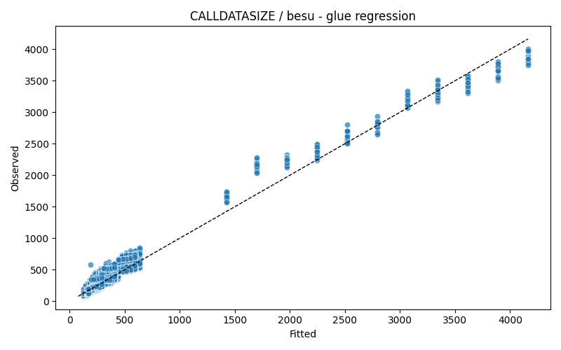

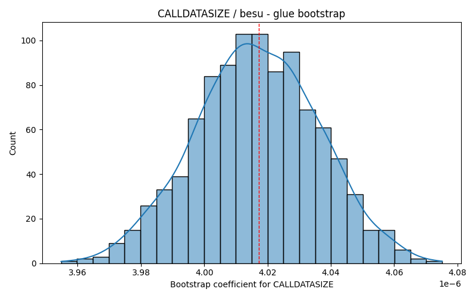


</details>

<details><summary><code>DUP</code> · nobs=63107 · runtime_ms=7.537e-07 · p=1.00e-03 · R²=0.9462</summary>

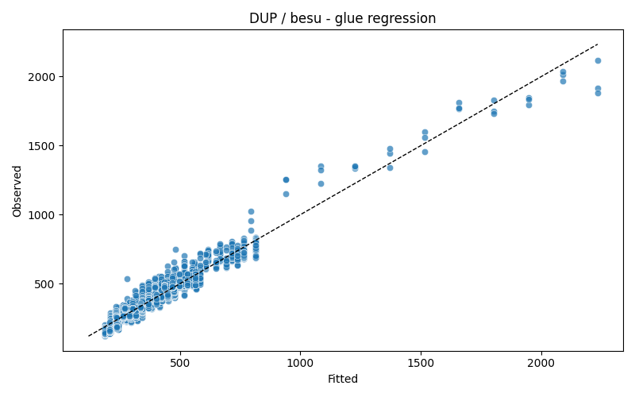

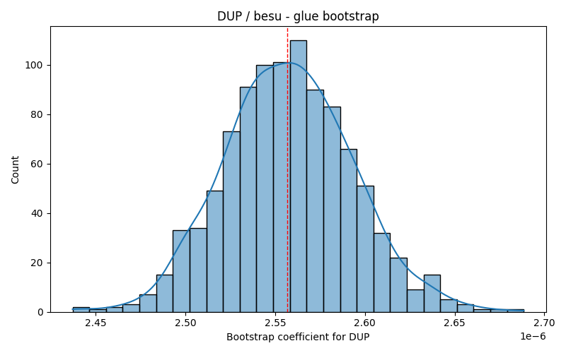

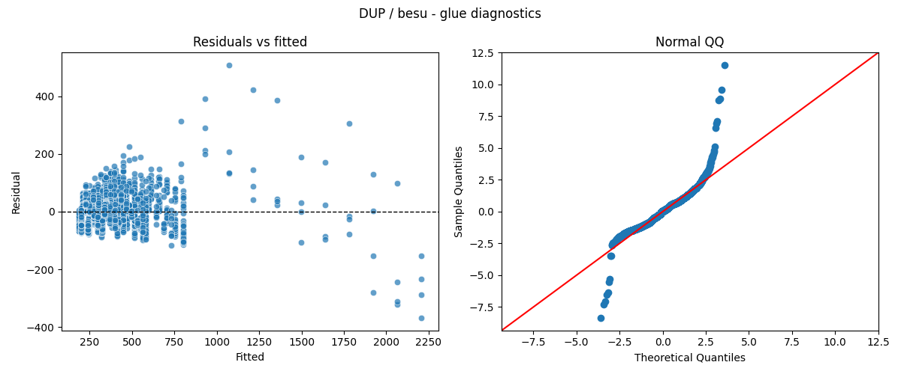

</details>

<details><summary><code>GAS</code> · nobs=63107 · runtime_ms=2.157e-06 · p=1.00e-03 · R²=0.9462</summary>

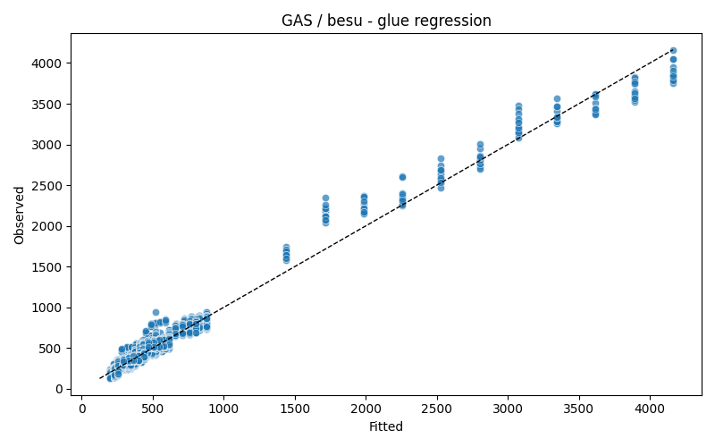

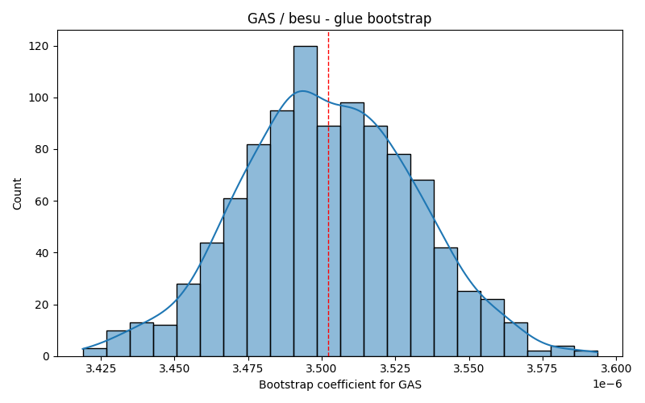

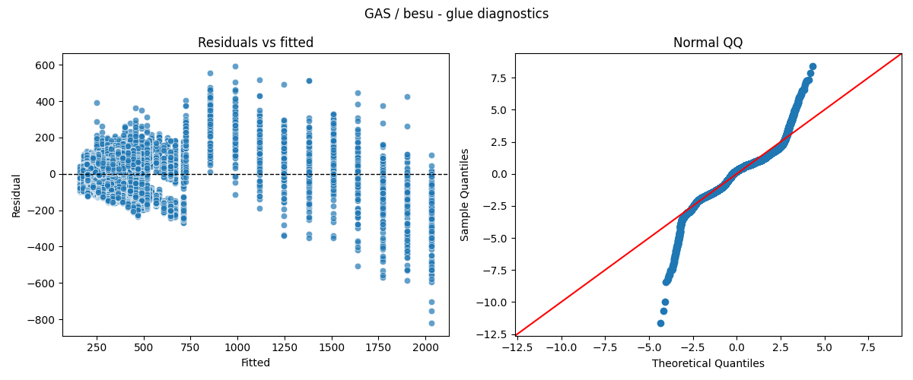

</details>

<details><summary><code>MLOAD</code> · nobs=63107 · runtime_ms=8.591e-06 · p=1.00e-03 · R²=0.9462</summary>

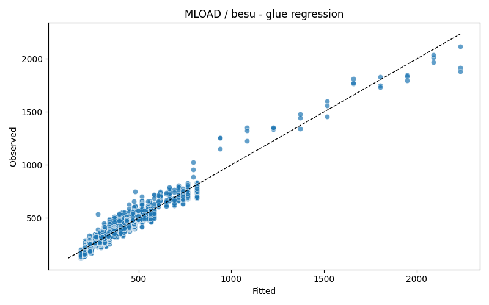

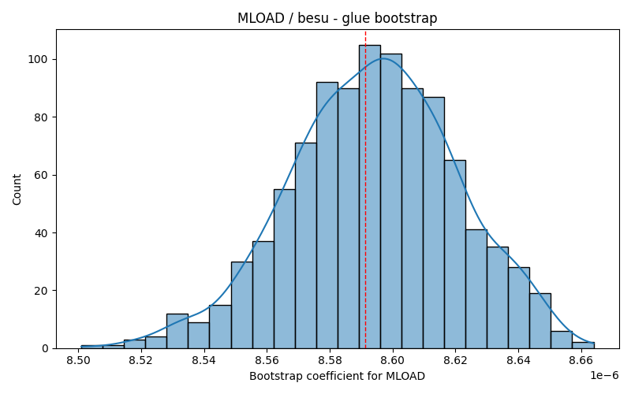


</details>

<details><summary><code>PUSH</code> · nobs=63107 · runtime_ms=1.718e-06 · p=1.00e-03 · R²=0.9462</summary>


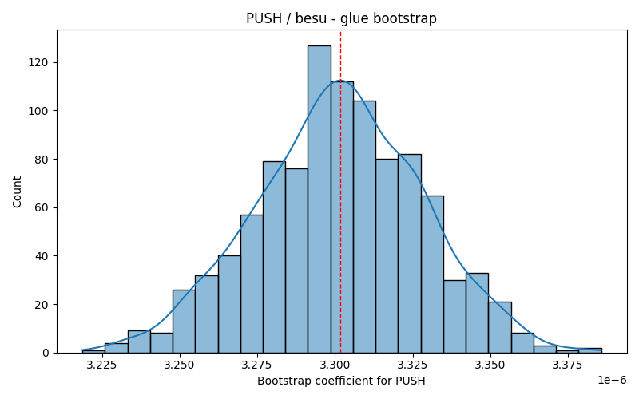


</details>

<details><summary><code>PUSH0</code> · nobs=63107 · runtime_ms=8.801e-07 · p=1.00e-03 · R²=0.9462</summary>

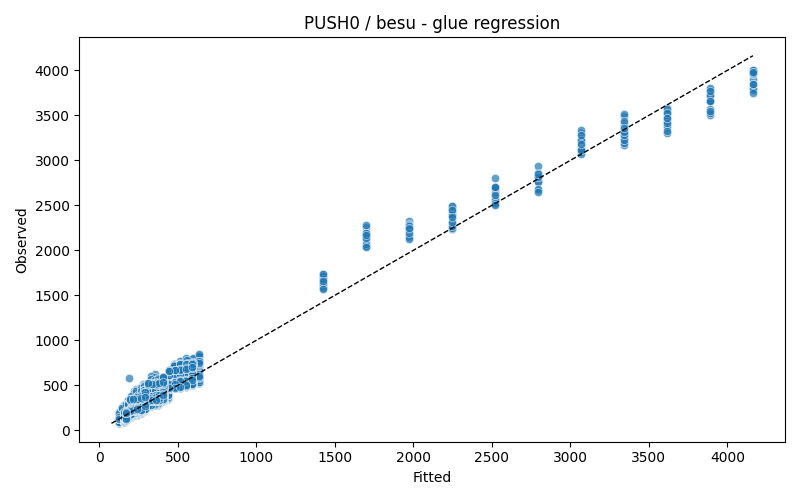

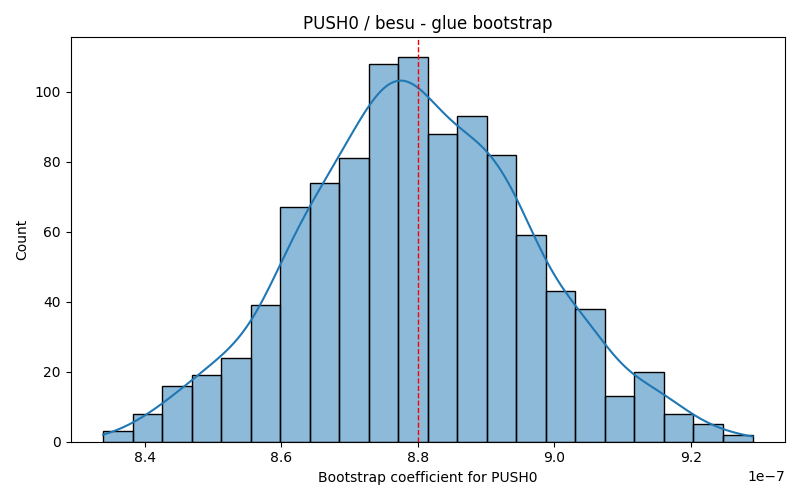

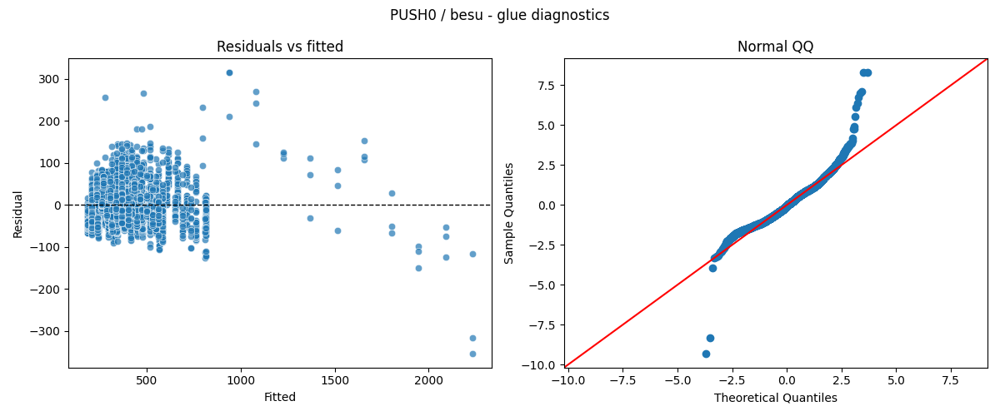

</details>

<details><summary><code>STATICCALL</code> · nobs=63107 · runtime_ms=0.001654 · p=1.00e-03 · R²=0.9462</summary>


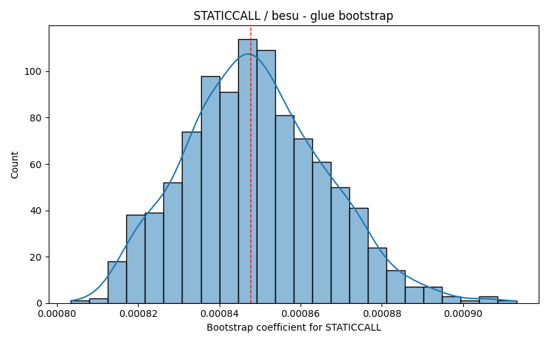

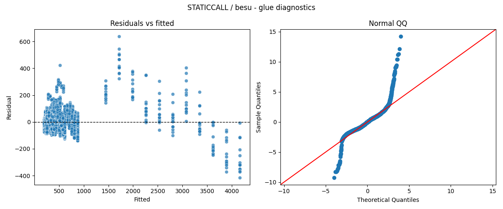

</details>

### Pure glue · besu

<details><summary><code>ISZERO</code> · nobs=1067 · runtime_ms=3.194e-06 · p=1.00e-03 · R²=0.7409</summary>

```
==============================================================================
                           NNLS Regression Results                            
==============================================================================
Dep. Variable:          test_runtime_ms              R-squared:          0.741
Model:                  NNLS                    Adj. R-squared:          0.741
No. Observations:       1067                              RMSE:          39.77
Df Residuals:           1065                               MAE:          27.44
Df Model:               1      
==============================================================================
                      coef     std err     P-value      [0.025      0.975]
------------------------------------------------------------------------------
         const     54.8583      3.9210       0.001     47.0670     63.1126
        ISZERO      0.0000      0.0000       0.001      0.0000      0.0000
==============================================================================
Notes: Non-negative least squares with bootstrap inference (1000 iterations)
==============================================================================
```

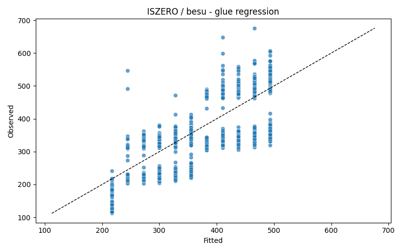

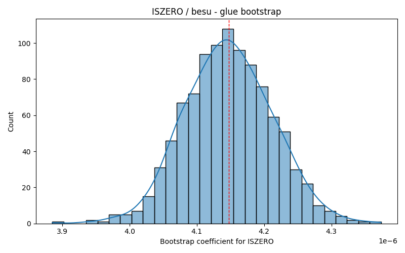

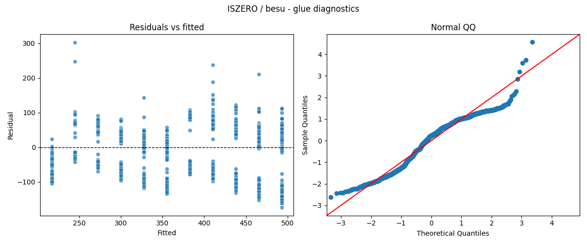

</details>

<details><summary><code>JUMPDEST</code> · nobs=1067 · runtime_ms=9.973e-07 · p=1.00e-03 · R²=0.307</summary>

```
==============================================================================
                           NNLS Regression Results                            
==============================================================================
Dep. Variable:          test_runtime_ms              R-squared:          0.307
Model:                  NNLS                    Adj. R-squared:          0.306
No. Observations:       1067                              RMSE:          94.62
Df Residuals:           1065                               MAE:          44.28
Df Model:               1      
==============================================================================
                      coef     std err     P-value      [0.025      0.975]
------------------------------------------------------------------------------
         const     25.2827      8.3838       0.002      8.2828     41.4072
      JUMPDEST      0.0000      0.0000       0.001      0.0000      0.0000
==============================================================================
Notes: Non-negative least squares with bootstrap inference (1000 iterations)
==============================================================================
```

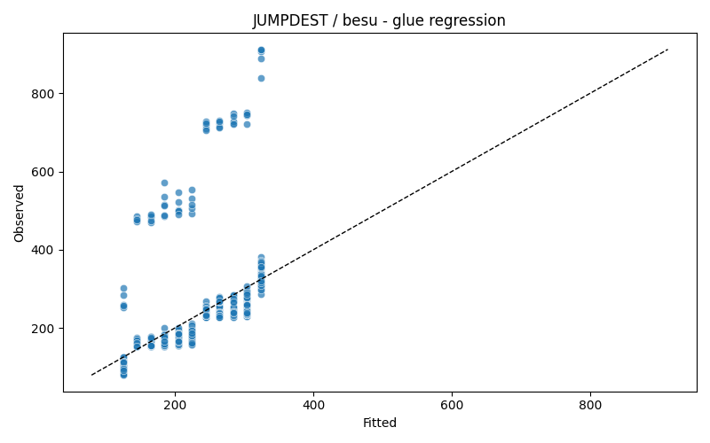


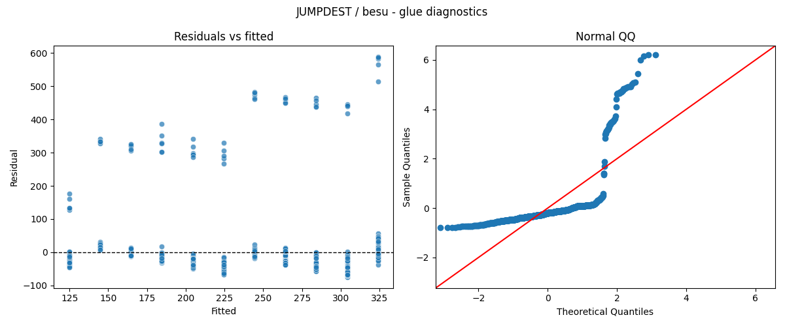

</details>

<details><summary><code>SWAP</code> · nobs=17072 · runtime_ms=2.134e-06 · p=1.00e-03 · R²=0.634</summary>

```
==============================================================================
                           NNLS Regression Results                            
==============================================================================
Dep. Variable:          test_runtime_ms              R-squared:          0.634
Model:                  NNLS                    Adj. R-squared:          0.634
No. Observations:       17072                             RMSE:          34.14
Df Residuals:           17070                              MAE:          20.79
Df Model:               1      
==============================================================================
                      coef     std err     P-value      [0.025      0.975]
------------------------------------------------------------------------------
         const     39.5908      0.7819       0.001     38.0048     41.1513
          SWAP      0.0000      0.0000       0.001      0.0000      0.0000
==============================================================================
Notes: Non-negative least squares with bootstrap inference (1000 iterations)
==============================================================================
```

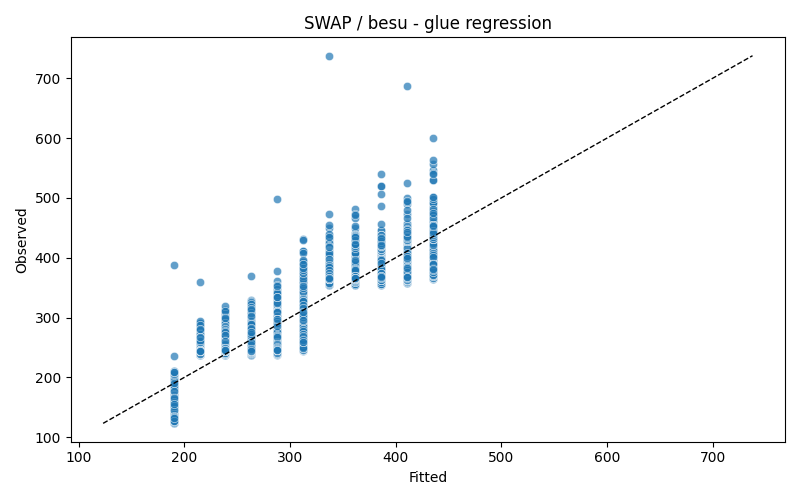

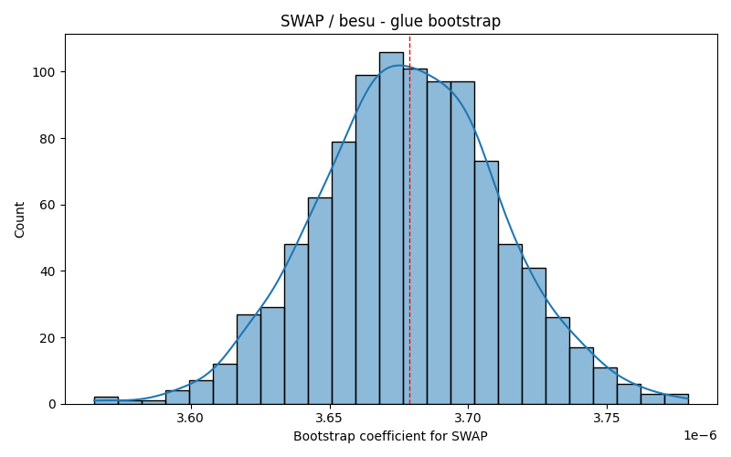

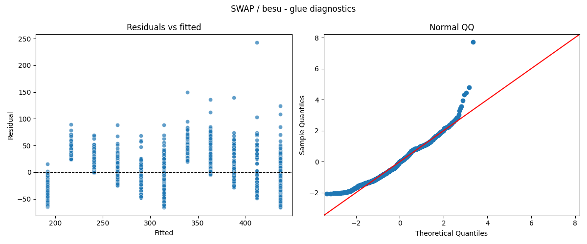

</details>

### Mixed glue (tier A) · besu

<details><summary><code>ADD</code> · nobs=1067 · runtime_ms=8.626e-06 · p=1.00e-03 · R²=0.8207</summary>

```
==============================================================================
                           NNLS Regression Results                            
==============================================================================
Dep. Variable:          test_runtime_ms              R-squared:          0.821
Model:                  NNLS                    Adj. R-squared:          0.821
No. Observations:       1067                              RMSE:          42.43
Df Residuals:           1065                               MAE:          32.88
Df Model:               1      
==============================================================================
                      coef     std err     P-value      [0.025      0.975]
------------------------------------------------------------------------------
         const     71.3675      4.4377       0.001     62.4932     80.2907
           ADD      0.0000      0.0000       0.001      0.0000      0.0000
==============================================================================
Notes: Non-negative least squares with bootstrap inference (1000 iterations)
==============================================================================
```

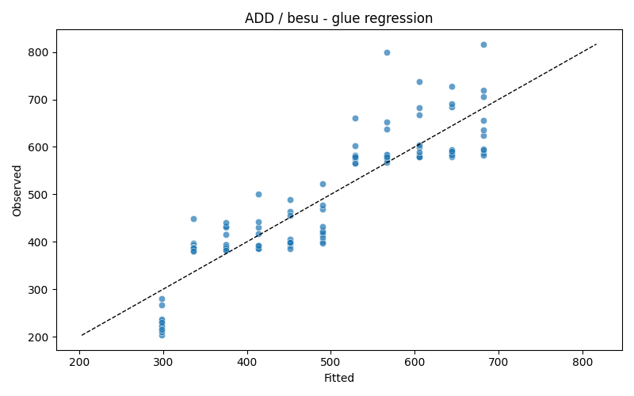

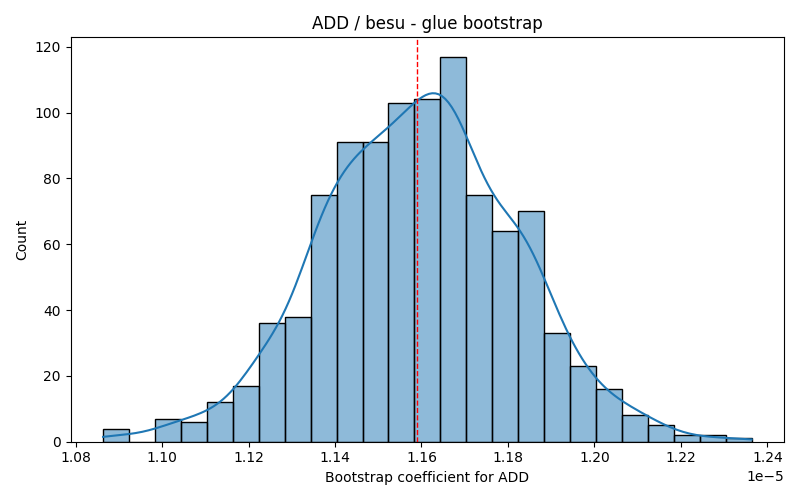

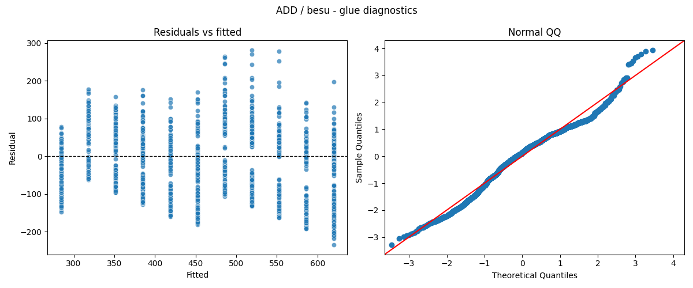

</details>

<details><summary><code>AND</code> · nobs=1067 · runtime_ms=7.196e-06 · p=1.00e-03 · R²=0.8159</summary>

```
==============================================================================
                           NNLS Regression Results                            
==============================================================================
Dep. Variable:          test_runtime_ms              R-squared:          0.816
Model:                  NNLS                    Adj. R-squared:          0.816
No. Observations:       1067                              RMSE:          35.97
Df Residuals:           1065                               MAE:          27.27
Df Model:               1      
==============================================================================
                      coef     std err     P-value      [0.025      0.975]
------------------------------------------------------------------------------
         const     62.3259      3.7027       0.001     55.4449     69.9330
           AND      0.0000      0.0000       0.001      0.0000      0.0000
==============================================================================
Notes: Non-negative least squares with bootstrap inference (1000 iterations)
==============================================================================
```

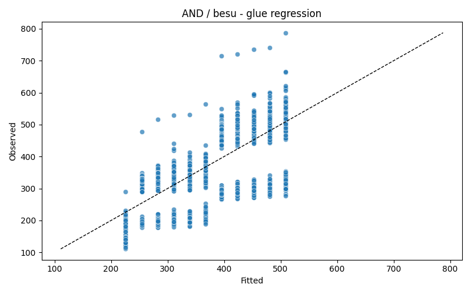

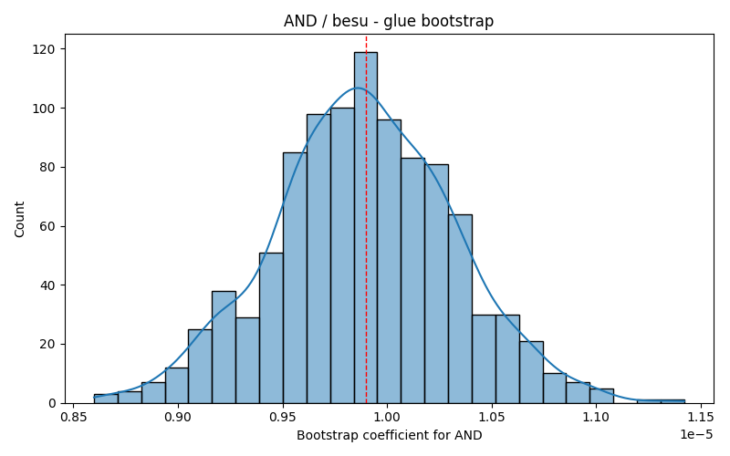

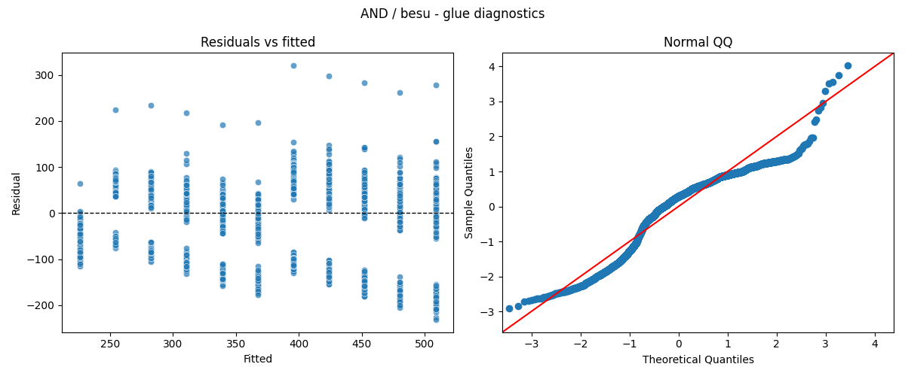

</details>

<details><summary><code>CALLDATACOPY</code> · nobs=25608 · runtime_ms=1.543e-05 · p=1.00e-03 · R²=0.6675</summary>

```
==============================================================================
                           NNLS Regression Results                            
==============================================================================
Dep. Variable:          test_runtime_ms              R-squared:          0.668
Model:                  NNLS                    Adj. R-squared:          0.668
No. Observations:       25608                             RMSE:          81.91
Df Residuals:           25606                              MAE:          66.25
Df Model:               1      
==============================================================================
                      coef     std err     P-value      [0.025      0.975]
------------------------------------------------------------------------------
         const    122.4415      0.6041       0.001    121.2564    123.6245
  CALLDATACOPY      0.0000      0.0000       0.001      0.0000      0.0000
==============================================================================
Notes: Non-negative least squares with bootstrap inference (1000 iterations)
==============================================================================
```

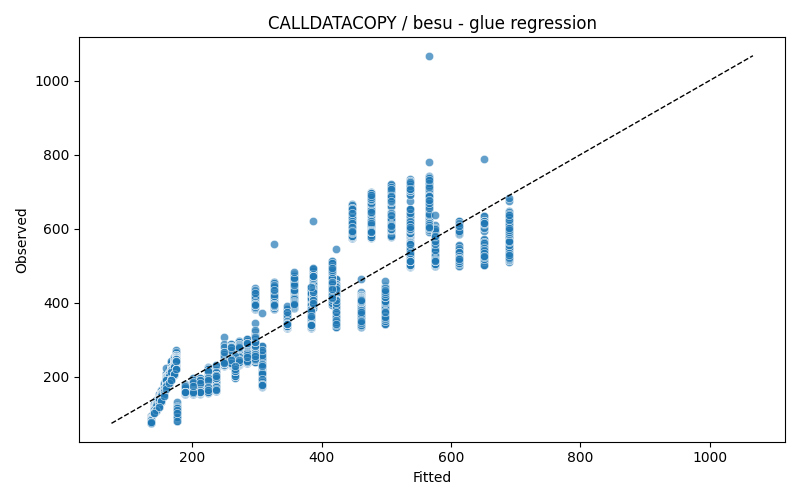

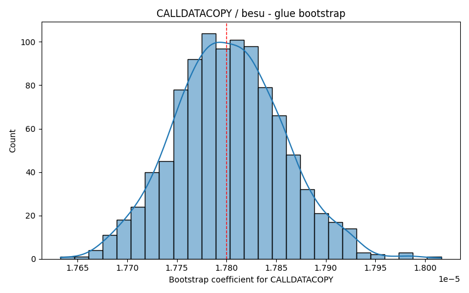

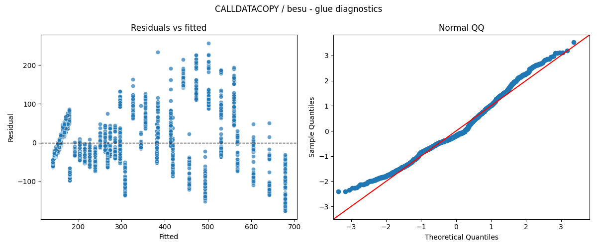

</details>

<details><summary><code>CALLDATALOAD</code> · nobs=4268 · runtime_ms=3.319e-05 · p=1.00e-03 · R²=0.1159</summary>

```
==============================================================================
                           NNLS Regression Results                            
==============================================================================
Dep. Variable:          test_runtime_ms              R-squared:          0.116
Model:                  NNLS                    Adj. R-squared:          0.116
No. Observations:       4268                              RMSE:           0.35
Df Residuals:           4266                               MAE:           0.23
Df Model:               1      
==============================================================================
                      coef     std err     P-value      [0.025      0.975]
------------------------------------------------------------------------------
         const      3.0463      0.0211       0.001      3.0048      3.0905
  CALLDATALOAD      0.0000      0.0000       0.001      0.0000      0.0000
==============================================================================
Notes: Non-negative least squares with bootstrap inference (1000 iterations)
==============================================================================
```

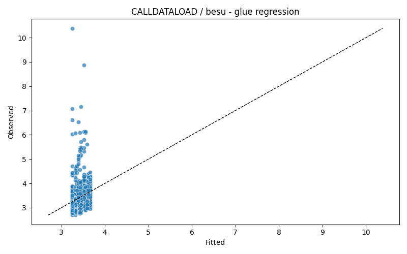

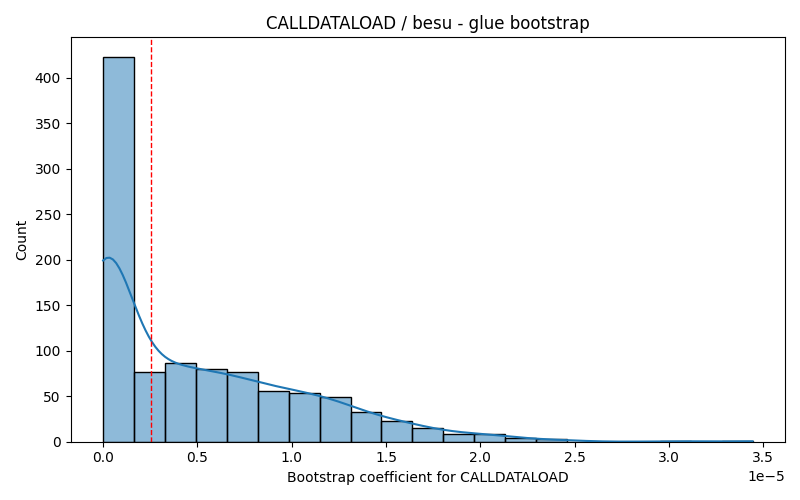

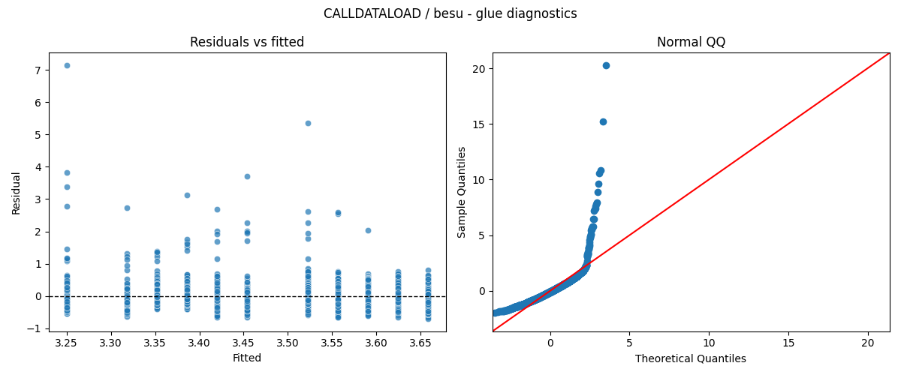

</details>

<details><summary><code>DIV</code> · nobs=1067 · runtime_ms=1.346e-05 · p=1.00e-03 · R²=0.8253</summary>

```
==============================================================================
                           NNLS Regression Results                            
==============================================================================
Dep. Variable:          test_runtime_ms              R-squared:          0.825
Model:                  NNLS                    Adj. R-squared:          0.825
No. Observations:       1067                              RMSE:          48.88
Df Residuals:           1065                               MAE:          37.85
Df Model:               1      
==============================================================================
                      coef     std err     P-value      [0.025      0.975]
------------------------------------------------------------------------------
         const    125.4361      4.1378       0.001    117.4160    133.8386
           DIV      0.0000      0.0000       0.001      0.0000      0.0000
==============================================================================
Notes: Non-negative least squares with bootstrap inference (1000 iterations)
==============================================================================
```

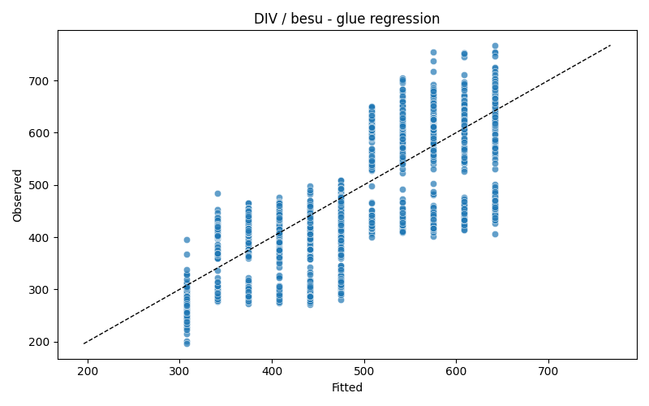

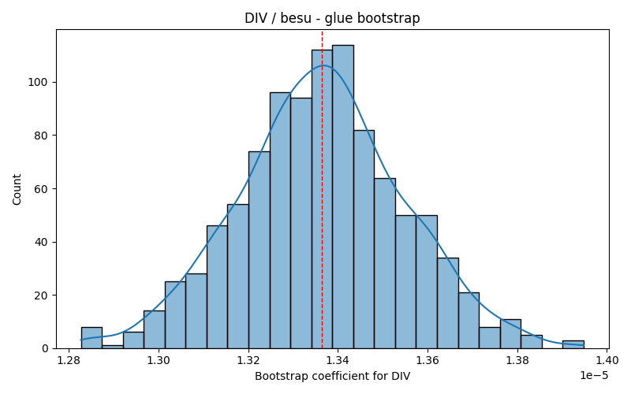

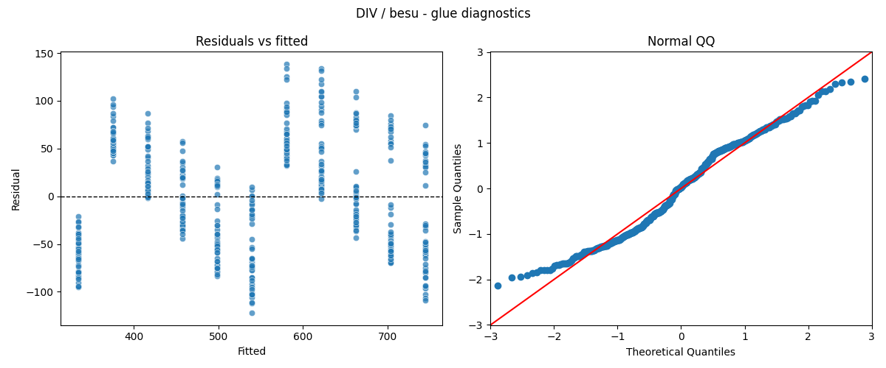

</details>

<details><summary><code>EXP</code> · nobs=1067 · runtime_ms=0.001136 · p=1.00e-03 · R²=0.8282</summary>

```
==============================================================================
                           NNLS Regression Results                            
==============================================================================
Dep. Variable:          test_runtime_ms              R-squared:          0.828
Model:                  NNLS                    Adj. R-squared:          0.828
No. Observations:       1067                              RMSE:          20.25
Df Residuals:           1065                               MAE:          15.78
Df Model:               1      
==============================================================================
                      coef     std err     P-value      [0.025      0.975]
------------------------------------------------------------------------------
         const     84.5641      2.3578       0.001     79.7578     89.0435
           EXP      0.0011      0.0000       0.001      0.0011      0.0012
==============================================================================
Notes: Non-negative least squares with bootstrap inference (1000 iterations)
==============================================================================
```

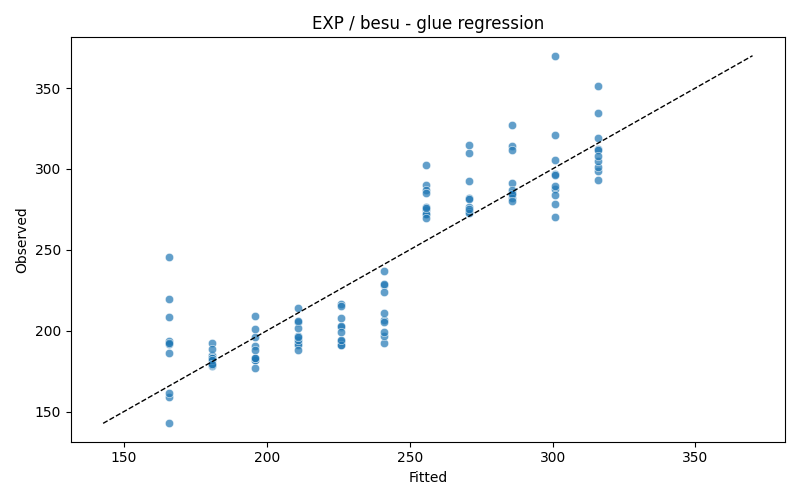

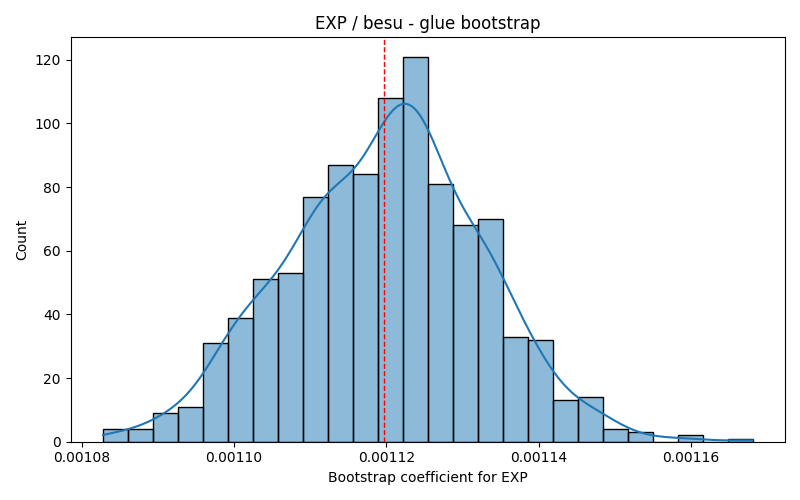

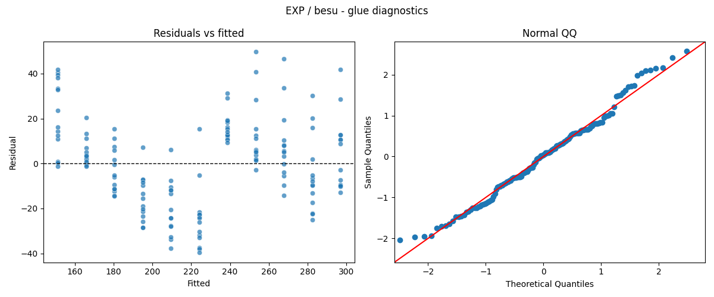

</details>

<details><summary><code>GT</code> · nobs=1067 · runtime_ms=2.919e-05 · p=1.00e-03 · R²=0.8822</summary>

```
==============================================================================
                           NNLS Regression Results                            
==============================================================================
Dep. Variable:          test_runtime_ms              R-squared:          0.882
Model:                  NNLS                    Adj. R-squared:          0.882
No. Observations:       1067                              RMSE:         112.27
Df Residuals:           1065                               MAE:          90.34
Df Model:               1      
==============================================================================
                      coef     std err     P-value      [0.025      0.975]
------------------------------------------------------------------------------
         const    195.8792     11.8767       0.001    172.7512    219.9165
            GT      0.0000      0.0000       0.001      0.0000      0.0000
==============================================================================
Notes: Non-negative least squares with bootstrap inference (1000 iterations)
==============================================================================
```

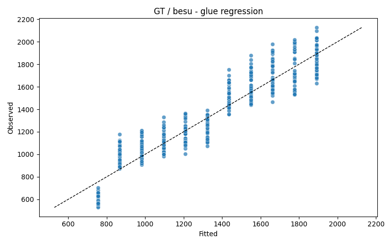

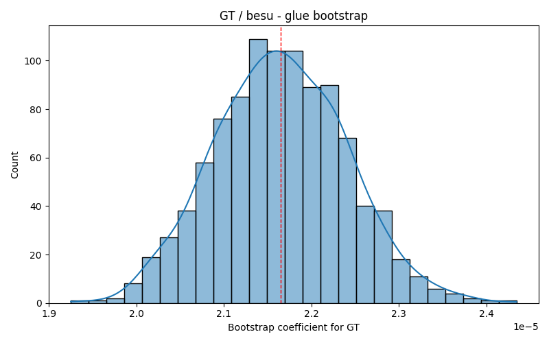

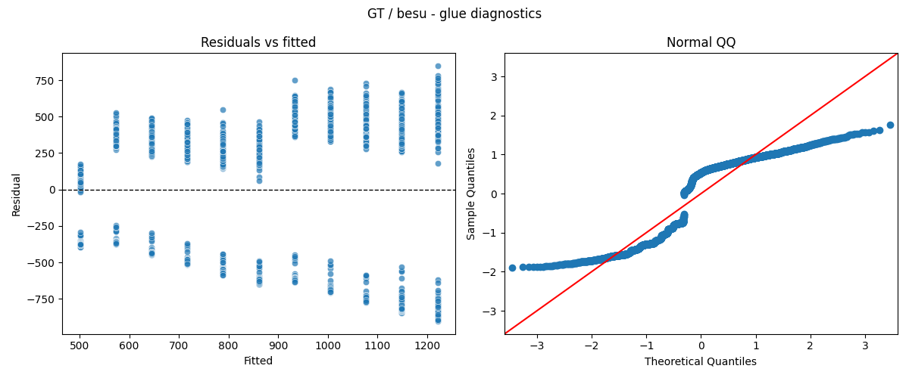

</details>

<details><summary><code>JUMPI</code> · nobs=1067 · runtime_ms=5.949e-06 · p=1.00e-03 · R²=0.7011</summary>

```
==============================================================================
                           NNLS Regression Results                            
==============================================================================
Dep. Variable:          test_runtime_ms              R-squared:          0.701
Model:                  NNLS                    Adj. R-squared:          0.701
No. Observations:       1067                              RMSE:          17.53
Df Residuals:           1065                               MAE:          10.98
Df Model:               1      
==============================================================================
                      coef     std err     P-value      [0.025      0.975]
------------------------------------------------------------------------------
         const     29.0910      1.5255       0.001     26.1995     32.1426
         JUMPI      0.0000      0.0000       0.001      0.0000      0.0000
==============================================================================
Notes: Non-negative least squares with bootstrap inference (1000 iterations)
==============================================================================
```

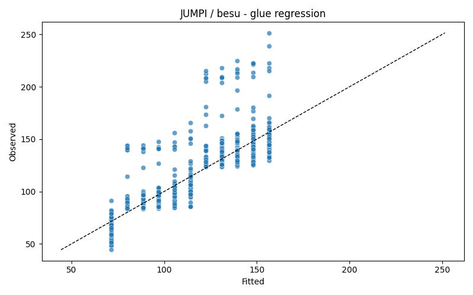

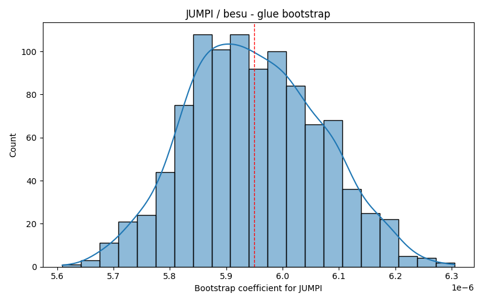

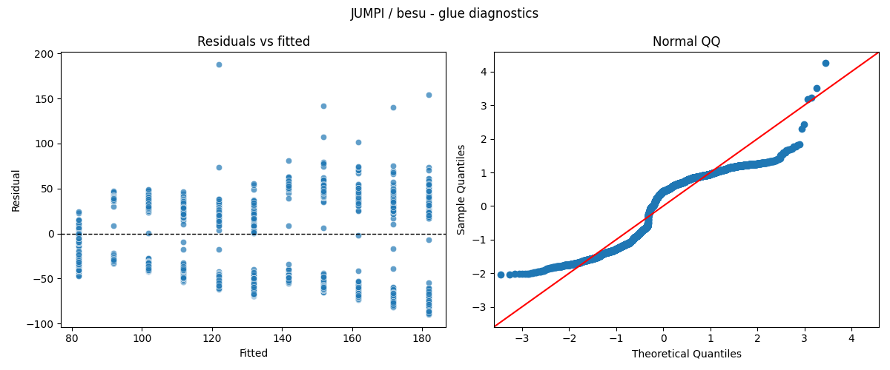

</details>

<details><summary><code>LT</code> · nobs=1067 · runtime_ms=3.098e-05 · p=1.00e-03 · R²=0.8844</summary>

```
==============================================================================
                           NNLS Regression Results                            
==============================================================================
Dep. Variable:          test_runtime_ms              R-squared:          0.884
Model:                  NNLS                    Adj. R-squared:          0.884
No. Observations:       1067                              RMSE:         117.86
Df Residuals:           1065                               MAE:          97.28
Df Model:               1      
==============================================================================
                      coef     std err     P-value      [0.025      0.975]
------------------------------------------------------------------------------
         const    191.3772     12.3536       0.001    166.7569    215.8883
            LT      0.0000      0.0000       0.001      0.0000      0.0000
==============================================================================
Notes: Non-negative least squares with bootstrap inference (1000 iterations)
==============================================================================
```

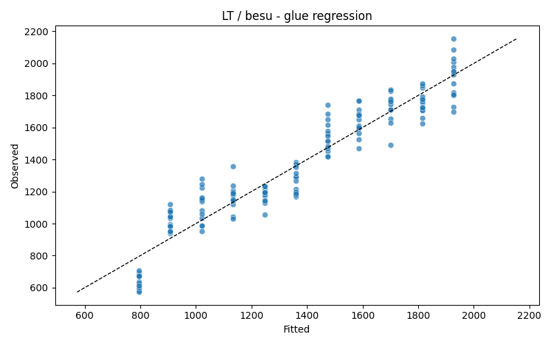

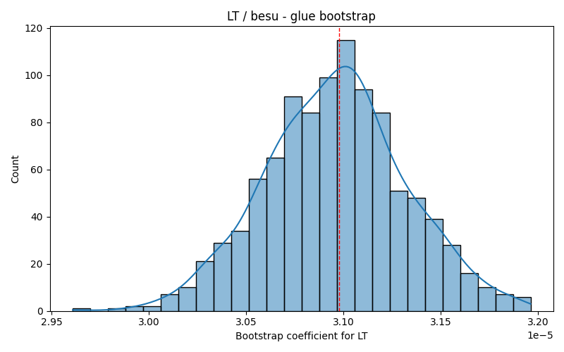


</details>

<details><summary><code>MSTORE</code> · nobs=5335 · runtime_ms=1.406e-05 · p=1.00e-03 · R²=0.8169</summary>

```
==============================================================================
                           NNLS Regression Results                            
==============================================================================
Dep. Variable:          test_runtime_ms              R-squared:          0.817
Model:                  NNLS                    Adj. R-squared:          0.817
No. Observations:       5335                              RMSE:          46.72
Df Residuals:           5333                               MAE:          36.46
Df Model:               1      
==============================================================================
                      coef     std err     P-value      [0.025      0.975]
------------------------------------------------------------------------------
         const     84.1751      2.0346       0.001     79.9904     87.9583
        MSTORE      0.0000      0.0000       0.001      0.0000      0.0000
==============================================================================
Notes: Non-negative least squares with bootstrap inference (1000 iterations)
==============================================================================
```


</details>

<details><summary><code>MSTORE8</code> · nobs=5335 · runtime_ms=8.541e-06 · p=1.00e-03 · R²=0.7548</summary>

```
==============================================================================
                           NNLS Regression Results                            
==============================================================================
Dep. Variable:          test_runtime_ms              R-squared:          0.755
Model:                  NNLS                    Adj. R-squared:          0.755
No. Observations:       5335                              RMSE:          34.16
Df Residuals:           5333                               MAE:          24.00
Df Model:               1      
==============================================================================
                      coef     std err     P-value      [0.025      0.975]
------------------------------------------------------------------------------
         const     54.2705      1.4891       0.001     51.4501     57.2398
       MSTORE8      0.0000      0.0000       0.001      0.0000      0.0000
==============================================================================
Notes: Non-negative least squares with bootstrap inference (1000 iterations)
==============================================================================
```


</details>

<details><summary><code>MUL</code> · nobs=1067 · runtime_ms=1.106e-05 · p=1.00e-03 · R²=0.7654</summary>

```
==============================================================================
                           NNLS Regression Results                            
==============================================================================
Dep. Variable:          test_runtime_ms              R-squared:          0.765
Model:                  NNLS                    Adj. R-squared:          0.765
No. Observations:       1067                              RMSE:          48.35
Df Residuals:           1065                               MAE:          35.78
Df Model:               1      
==============================================================================
                      coef     std err     P-value      [0.025      0.975]
------------------------------------------------------------------------------
         const     94.4992      4.2411       0.001     86.5953    102.9990
           MUL      0.0000      0.0000       0.001      0.0000      0.0000
==============================================================================
Notes: Non-negative least squares with bootstrap inference (1000 iterations)
==============================================================================
```


</details>

<details><summary><code>PC</code> · nobs=1067 · runtime_ms=3.427e-06 · p=1.00e-03 · R²=0.8103</summary>

```
==============================================================================
                           NNLS Regression Results                            
==============================================================================
Dep. Variable:          test_runtime_ms              R-squared:          0.810
Model:                  NNLS                    Adj. R-squared:          0.810
No. Observations:       1067                              RMSE:          49.57
Df Residuals:           1065                               MAE:          35.32
Df Model:               1      
==============================================================================
                      coef     std err     P-value      [0.025      0.975]
------------------------------------------------------------------------------
         const     75.7863      5.0041       0.001     66.2315     85.5812
            PC      0.0000      0.0000       0.001      0.0000      0.0000
==============================================================================
Notes: Non-negative least squares with bootstrap inference (1000 iterations)
==============================================================================
```


</details>

<details><summary><code>RETURNDATASIZE</code> · nobs=4268 · runtime_ms=4.354e-06 · p=1.00e-03 · R²=0.6725</summary>

```
==============================================================================
                           NNLS Regression Results                            
==============================================================================
Dep. Variable:          test_runtime_ms              R-squared:          0.672
Model:                  NNLS                    Adj. R-squared:          0.672
No. Observations:       4268                              RMSE:          47.97
Df Residuals:           4266                               MAE:          30.56
Df Model:               1      
==============================================================================
                      coef     std err     P-value      [0.025      0.975]
------------------------------------------------------------------------------
         const     57.8292      2.2885       0.001     53.4438     62.2506
RETURNDATASIZE      0.0000      0.0000       0.001      0.0000      0.0000
==============================================================================
Notes: Non-negative least squares with bootstrap inference (1000 iterations)
==============================================================================
```


</details>

<details><summary><code>SELFBALANCE</code> · nobs=873 · runtime_ms=6.032e-06 · p=1.00e-03 · R²=0.4396</summary>

```
==============================================================================
                           NNLS Regression Results                            
==============================================================================
Dep. Variable:          test_runtime_ms              R-squared:          0.440
Model:                  NNLS                    Adj. R-squared:          0.439
No. Observations:       873                               RMSE:          68.70
Df Residuals:           871                                MAE:          56.15
Df Model:               1      
==============================================================================
                      coef     std err     P-value      [0.025      0.975]
------------------------------------------------------------------------------
         const    396.7568     10.5067       0.001    375.8731    417.0152
   SELFBALANCE      0.0000      0.0000       0.001      0.0000      0.0000
==============================================================================
Notes: Non-negative least squares with bootstrap inference (1000 iterations)
==============================================================================
```


</details>

<details><summary><code>SUB</code> · nobs=1067 · runtime_ms=9.202e-06 · p=1.00e-03 · R²=0.8504</summary>

```
==============================================================================
                           NNLS Regression Results                            
==============================================================================
Dep. Variable:          test_runtime_ms              R-squared:          0.850
Model:                  NNLS                    Adj. R-squared:          0.850
No. Observations:       1067                              RMSE:          40.62
Df Residuals:           1065                               MAE:          33.71
Df Model:               1      
==============================================================================
                      coef     std err     P-value      [0.025      0.975]
------------------------------------------------------------------------------
         const     83.7429      4.3037       0.001     75.4953     92.3574
           SUB      0.0000      0.0000       0.001      0.0000      0.0000
==============================================================================
Notes: Non-negative least squares with bootstrap inference (1000 iterations)
==============================================================================
```


</details>

### Mixed glue (tier B) · besu

<details><summary><code>JUMP</code> · nobs=1067 · runtime_ms=2.213e-05 · p=1.00e-03 · R²=0.4144</summary>

```
==============================================================================
                           NNLS Regression Results                            
==============================================================================
Dep. Variable:          test_runtime_ms              R-squared:          0.414
Model:                  NNLS                    Adj. R-squared:          0.414
No. Observations:       1067                              RMSE:          97.75
Df Residuals:           1065                               MAE:          48.30
Df Model:               1      
==============================================================================
                      coef     std err     P-value      [0.025      0.975]
------------------------------------------------------------------------------
         const     67.4835      8.7466       0.001     49.9205     84.2459
          JUMP      0.0000      0.0000       0.001      0.0000      0.0000
==============================================================================
Notes: Non-negative least squares with bootstrap inference (1000 iterations)
==============================================================================
```


</details>

<details><summary><code>KECCAK256</code> · nobs=17072 · runtime_ms=2.69e-05 · p=1.00e-03 · R²=0.09391</summary>

```
==============================================================================
                           NNLS Regression Results                            
==============================================================================
Dep. Variable:          test_runtime_ms              R-squared:          0.094
Model:                  NNLS                    Adj. R-squared:          0.094
No. Observations:       17072                             RMSE:         166.02
Df Residuals:           17070                              MAE:         130.21
Df Model:               1      
==============================================================================
                      coef     std err     P-value      [0.025      0.975]
------------------------------------------------------------------------------
         const    510.3948      2.8293       0.001    504.5860    515.5915
     KECCAK256      0.0000      0.0000       0.001      0.0000      0.0000
==============================================================================
Notes: Non-negative least squares with bootstrap inference (1000 iterations)
==============================================================================
```


</details>

## erigon

| glue_opcode | nobs | glue_runtime_ms | p_value | rsquared |
| --- | --- | --- | --- | --- |
| `ISZERO` | 44 | 1.019e-06 | 1.00e-03 | 0.9283 |
| `JUMPDEST` | 44 | 8.05e-07 | 1.00e-03 | 0.8869 |
| `SWAP` | 704 | 1.268e-06 | 1.00e-03 | 0.4848 |
| `CALLDATASIZE` | 2728 | 8.649e-07 | 1.00e-03 | 0.9269 |
| `DUP` | 2728 | 1.068e-06 | 1.00e-03 | 0.9269 |
| `GAS` | 2728 | 8.667e-07 | 1.00e-03 | 0.9269 |
| `MLOAD` | 2728 | 3.358e-06 | 1.00e-03 | 0.9269 |
| `PUSH` | 2728 | 2.685e-06 | 1.00e-03 | 0.9269 |
| `PUSH0` | 2728 | 9.758e-07 | 1.00e-03 | 0.9269 |
| `STATICCALL` | 2728 | 0.0004851 | 1.00e-03 | 0.9269 |
| `ADD` | 44 | 2.934e-06 | 1.00e-03 | 0.933 |
| `AND` | 44 | 3.378e-06 | 1.00e-03 | 0.7544 |
| `CALLDATACOPY` | 1056 | 7.512e-06 | 1.00e-03 | 0.8599 |
| `CALLDATALOAD` | 176 | 5.643e-05 | 1.00e-03 | 0.1792 |
| `DIV` | 44 | 9.026e-06 | 1.00e-03 | 0.8515 |
| `EXP` | 44 | 0.0005015 | 1.00e-03 | 0.1188 |
| `GT` | 44 | 2.709e-06 | 1.00e-03 | 0.1702 |
| `JUMPI` | 44 | 1.126e-06 | 2.58e-01 | 0.007126 |
| `LT` | 44 | 3.082e-06 | 1.00e-03 | 0.9216 |
| `MSTORE` | 220 | 5.876e-06 | 1.00e-03 | 0.9232 |
| `MSTORE8` | 220 | 5.63e-06 | 1.00e-03 | 0.6494 |
| `MUL` | 44 | 3.633e-06 | 1.00e-03 | 0.9345 |
| `PC` | 44 | 1.431e-06 | 1.00e-03 | 0.924 |
| `RETURNDATASIZE` | 176 | 1.849e-06 | 1.00e-03 | 0.9261 |
| `SELFBALANCE` | 36 | 1.206e-05 | 2.05e-01 | 0.01967 |
| `SUB` | 44 | 2.995e-06 | 1.00e-03 | 0.9113 |
| `JUMP` | 44 | 7.595e-06 | 1.00e-03 | 0.8993 |
| `KECCAK256` | 704 | 1.092e-05 | 1.00e-03 | 0.02493 |

### Cycle glue — joint fit · erigon

<details><summary>Joint NNLS regression summary</summary>

```
==============================================================================
                           NNLS Regression Results                            
==============================================================================
Dep. Variable:          test_runtime_ms              R-squared:          0.927
Model:                  NNLS                    Adj. R-squared:          0.927
No. Observations:       2728                              RMSE:          47.32
Df Residuals:           2720                               MAE:          20.90
Df Model:               7      
==============================================================================
                      coef     std err     P-value      [0.025      0.975]
------------------------------------------------------------------------------
         const     33.3796      3.1475       0.001     27.6235     40.2566
  CALLDATASIZE      0.0000      0.0000       0.001      0.0000      0.0000
           DUP      0.0000      0.0000       0.001      0.0000      0.0000
           GAS      0.0000      0.0000       0.001      0.0000      0.0000
         MLOAD      0.0000      0.0000       0.001      0.0000      0.0000
          PUSH      0.0000      0.0000       0.001      0.0000      0.0000
         PUSH0      0.0000      0.0000       0.001      0.0000      0.0000
    STATICCALL      0.0005      0.0000       0.001      0.0005      0.0005
==============================================================================
Notes: Non-negative least squares with bootstrap inference (1000 iterations)
==============================================================================
```

</details>

<details><summary><code>CALLDATASIZE</code> · nobs=2728 · runtime_ms=8.649e-07 · p=1.00e-03 · R²=0.9269</summary>


</details>

<details><summary><code>DUP</code> · nobs=2728 · runtime_ms=1.068e-06 · p=1.00e-03 · R²=0.9269</summary>


</details>

<details><summary><code>GAS</code> · nobs=2728 · runtime_ms=8.667e-07 · p=1.00e-03 · R²=0.9269</summary>


</details>

<details><summary><code>MLOAD</code> · nobs=2728 · runtime_ms=3.358e-06 · p=1.00e-03 · R²=0.9269</summary>


</details>

<details><summary><code>PUSH</code> · nobs=2728 · runtime_ms=2.685e-06 · p=1.00e-03 · R²=0.9269</summary>


</details>

<details><summary><code>PUSH0</code> · nobs=2728 · runtime_ms=9.758e-07 · p=1.00e-03 · R²=0.9269</summary>


</details>

<details><summary><code>STATICCALL</code> · nobs=2728 · runtime_ms=0.0004851 · p=1.00e-03 · R²=0.9269</summary>


</details>

### Pure glue · erigon

<details><summary><code>ISZERO</code> · nobs=44 · runtime_ms=1.019e-06 · p=1.00e-03 · R²=0.9283</summary>

```
==============================================================================
                           NNLS Regression Results                            
==============================================================================
Dep. Variable:          test_runtime_ms              R-squared:          0.928
Model:                  NNLS                    Adj. R-squared:          0.927
No. Observations:       44                                RMSE:           5.96
Df Residuals:           42                                 MAE:           5.09
Df Model:               1      
==============================================================================
                      coef     std err     P-value      [0.025      0.975]
------------------------------------------------------------------------------
         const     18.2480      3.5843       0.001     11.7582     25.4544
        ISZERO      0.0000      0.0000       0.001      0.0000      0.0000
==============================================================================
Notes: Non-negative least squares with bootstrap inference (1000 iterations)
==============================================================================
```


</details>

<details><summary><code>JUMPDEST</code> · nobs=44 · runtime_ms=8.05e-07 · p=1.00e-03 · R²=0.8869</summary>

```
==============================================================================
                           NNLS Regression Results                            
==============================================================================
Dep. Variable:          test_runtime_ms              R-squared:          0.887
Model:                  NNLS                    Adj. R-squared:          0.884
No. Observations:       44                                RMSE:          18.15
Df Residuals:           42                                 MAE:          14.10
Df Model:               1      
==============================================================================
                      coef     std err     P-value      [0.025      0.975]
------------------------------------------------------------------------------
         const     17.5015      9.0541       0.018      0.6331     36.1851
      JUMPDEST      0.0000      0.0000       0.001      0.0000      0.0000
==============================================================================
Notes: Non-negative least squares with bootstrap inference (1000 iterations)
==============================================================================
```


</details>

<details><summary><code>SWAP</code> · nobs=704 · runtime_ms=1.268e-06 · p=1.00e-03 · R²=0.4848</summary>

```
==============================================================================
                           NNLS Regression Results                            
==============================================================================
Dep. Variable:          test_runtime_ms              R-squared:          0.485
Model:                  NNLS                    Adj. R-squared:          0.484
No. Observations:       704                               RMSE:          27.52
Df Residuals:           702                                MAE:           8.79
Df Model:               1      
==============================================================================
                      coef     std err     P-value      [0.025      0.975]
------------------------------------------------------------------------------
         const     24.0155      2.0102       0.001     20.5271     28.2054
          SWAP      0.0000      0.0000       0.001      0.0000      0.0000
==============================================================================
Notes: Non-negative least squares with bootstrap inference (1000 iterations)
==============================================================================
```


</details>

### Mixed glue (tier A) · erigon

<details><summary><code>ADD</code> · nobs=44 · runtime_ms=2.934e-06 · p=1.00e-03 · R²=0.933</summary>

```
==============================================================================
                           NNLS Regression Results                            
==============================================================================
Dep. Variable:          test_runtime_ms              R-squared:          0.933
Model:                  NNLS                    Adj. R-squared:          0.931
No. Observations:       44                                RMSE:           8.27
Df Residuals:           42                                 MAE:           7.12
Df Model:               1      
==============================================================================
                      coef     std err     P-value      [0.025      0.975]
------------------------------------------------------------------------------
         const     14.3351      4.7283       0.001      5.5323     23.9199
           ADD      0.0000      0.0000       0.001      0.0000      0.0000
==============================================================================
Notes: Non-negative least squares with bootstrap inference (1000 iterations)
==============================================================================
```


</details>

<details><summary><code>AND</code> · nobs=44 · runtime_ms=3.378e-06 · p=1.00e-03 · R²=0.7544</summary>

```
==============================================================================
                           NNLS Regression Results                            
==============================================================================
Dep. Variable:          test_runtime_ms              R-squared:          0.754
Model:                  NNLS                    Adj. R-squared:          0.749
No. Observations:       44                                RMSE:          20.28
Df Residuals:           42                                 MAE:          11.68
Df Model:               1      
==============================================================================
                      coef     std err     P-value      [0.025      0.975]
------------------------------------------------------------------------------
         const      1.8388      6.8011       0.432      0.0000     21.7800
           AND      0.0000      0.0000       0.001      0.0000      0.0000
==============================================================================
Notes: Non-negative least squares with bootstrap inference (1000 iterations)
==============================================================================
```


</details>

<details><summary><code>CALLDATACOPY</code> · nobs=1056 · runtime_ms=7.512e-06 · p=1.00e-03 · R²=0.8599</summary>

```
==============================================================================
                           NNLS Regression Results                            
==============================================================================
Dep. Variable:          test_runtime_ms              R-squared:          0.860
Model:                  NNLS                    Adj. R-squared:          0.860
No. Observations:       1056                              RMSE:          22.80
Df Residuals:           1054                               MAE:           8.85
Df Model:               1      
==============================================================================
                      coef     std err     P-value      [0.025      0.975]
------------------------------------------------------------------------------
         const     17.4830      0.5222       0.001     16.5554     18.5786
  CALLDATACOPY      0.0000      0.0000       0.001      0.0000      0.0000
==============================================================================
Notes: Non-negative least squares with bootstrap inference (1000 iterations)
==============================================================================
```


</details>

<details><summary><code>CALLDATALOAD</code> · nobs=176 · runtime_ms=5.643e-05 · p=1.00e-03 · R²=0.1792</summary>

```
==============================================================================
                           NNLS Regression Results                            
==============================================================================
Dep. Variable:          test_runtime_ms              R-squared:          0.179
Model:                  NNLS                    Adj. R-squared:          0.175
No. Observations:       176                               RMSE:           0.46
Df Residuals:           174                                MAE:           0.36
Df Model:               1      
==============================================================================
                      coef     std err     P-value      [0.025      0.975]
------------------------------------------------------------------------------
         const      5.6720      0.1191       0.001      5.4164      5.9020
  CALLDATALOAD      0.0001      0.0000       0.001      0.0000      0.0001
==============================================================================
Notes: Non-negative least squares with bootstrap inference (1000 iterations)
==============================================================================
```


</details>

<details><summary><code>DIV</code> · nobs=44 · runtime_ms=9.026e-06 · p=1.00e-03 · R²=0.8515</summary>

```
==============================================================================
                           NNLS Regression Results                            
==============================================================================
Dep. Variable:          test_runtime_ms              R-squared:          0.852
Model:                  NNLS                    Adj. R-squared:          0.848
No. Observations:       44                                RMSE:          29.76
Df Residuals:           42                                 MAE:          25.59
Df Model:               1      
==============================================================================
                      coef     std err     P-value      [0.025      0.975]
------------------------------------------------------------------------------
         const     20.7903     14.3459       0.069      0.0000     51.8869
           DIV      0.0000      0.0000       0.001      0.0000      0.0000
==============================================================================
Notes: Non-negative least squares with bootstrap inference (1000 iterations)
==============================================================================
```


</details>

<details><summary><code>EXP</code> · nobs=44 · runtime_ms=0.0005015 · p=1.00e-03 · R²=0.1188</summary>

```
==============================================================================
                           NNLS Regression Results                            
==============================================================================
Dep. Variable:          test_runtime_ms              R-squared:          0.119
Model:                  NNLS                    Adj. R-squared:          0.098
No. Observations:       44                                RMSE:          53.48
Df Residuals:           42                                 MAE:          16.40
Df Model:               1      
==============================================================================
                      coef     std err     P-value      [0.025      0.975]
------------------------------------------------------------------------------
         const      1.2412      4.7305       0.361      0.0000     13.1733
           EXP      0.0005      0.0001       0.001      0.0003      0.0007
==============================================================================
Notes: Non-negative least squares with bootstrap inference (1000 iterations)
==============================================================================
```


</details>

<details><summary><code>GT</code> · nobs=44 · runtime_ms=2.709e-06 · p=1.00e-03 · R²=0.1702</summary>

```
==============================================================================
                           NNLS Regression Results                            
==============================================================================
Dep. Variable:          test_runtime_ms              R-squared:          0.170
Model:                  NNLS                    Adj. R-squared:          0.150
No. Observations:       44                                RMSE:          62.96
Df Residuals:           42                                 MAE:          20.41
Df Model:               1      
==============================================================================
                      coef     std err     P-value      [0.025      0.975]
------------------------------------------------------------------------------
         const     38.1061     22.1231       0.001     11.4225     97.4604
            GT      0.0000      0.0000       0.001      0.0000      0.0000
==============================================================================
Notes: Non-negative least squares with bootstrap inference (1000 iterations)
==============================================================================
```


</details>

<details><summary><code>JUMPI</code> · nobs=44 · runtime_ms=1.126e-06 · p=2.58e-01 · R²=0.007126</summary>

```
==============================================================================
                           NNLS Regression Results                            
==============================================================================
Dep. Variable:          test_runtime_ms              R-squared:          0.007
Model:                  NNLS                    Adj. R-squared:         -0.017
No. Observations:       44                                RMSE:          59.98
Df Residuals:           42                                 MAE:          20.98
Df Model:               1      
==============================================================================
                      coef     std err     P-value      [0.025      0.975]
------------------------------------------------------------------------------
         const     62.5369     31.3571       0.001     10.9740    103.2066
         JUMPI      0.0000      0.0000       0.258      0.0000      0.0000
==============================================================================
Notes: Non-negative least squares with bootstrap inference (1000 iterations)
==============================================================================
```


</details>

<details><summary><code>LT</code> · nobs=44 · runtime_ms=3.082e-06 · p=1.00e-03 · R²=0.9216</summary>

```
==============================================================================
                           NNLS Regression Results                            
==============================================================================
Dep. Variable:          test_runtime_ms              R-squared:          0.922
Model:                  NNLS                    Adj. R-squared:          0.920
No. Observations:       44                                RMSE:           9.46
Df Residuals:           42                                 MAE:           8.38
Df Model:               1      
==============================================================================
                      coef     std err     P-value      [0.025      0.975]
------------------------------------------------------------------------------
         const     15.0123      5.1551       0.001      5.5965     26.2920
            LT      0.0000      0.0000       0.001      0.0000      0.0000
==============================================================================
Notes: Non-negative least squares with bootstrap inference (1000 iterations)
==============================================================================
```


</details>

<details><summary><code>MSTORE</code> · nobs=220 · runtime_ms=5.876e-06 · p=1.00e-03 · R²=0.9232</summary>

```
==============================================================================
                           NNLS Regression Results                            
==============================================================================
Dep. Variable:          test_runtime_ms              R-squared:          0.923
Model:                  NNLS                    Adj. R-squared:          0.923
No. Observations:       220                               RMSE:          11.89
Df Residuals:           218                                MAE:           9.83
Df Model:               1      
==============================================================================
                      coef     std err     P-value      [0.025      0.975]
------------------------------------------------------------------------------
         const     22.5796      2.7312       0.001     17.4292     28.1509
        MSTORE      0.0000      0.0000       0.001      0.0000      0.0000
==============================================================================
Notes: Non-negative least squares with bootstrap inference (1000 iterations)
==============================================================================
```


</details>

<details><summary><code>MSTORE8</code> · nobs=220 · runtime_ms=5.63e-06 · p=1.00e-03 · R²=0.6494</summary>

```
==============================================================================
                           NNLS Regression Results                            
==============================================================================
Dep. Variable:          test_runtime_ms              R-squared:          0.649
Model:                  NNLS                    Adj. R-squared:          0.648
No. Observations:       220                               RMSE:          29.03
Df Residuals:           218                                MAE:          11.90
Df Model:               1      
==============================================================================
                      coef     std err     P-value      [0.025      0.975]
------------------------------------------------------------------------------
         const     16.9686      4.4521       0.001      6.9033     24.5686
       MSTORE8      0.0000      0.0000       0.001      0.0000      0.0000
==============================================================================
Notes: Non-negative least squares with bootstrap inference (1000 iterations)
==============================================================================
```


</details>

<details><summary><code>MUL</code> · nobs=44 · runtime_ms=3.633e-06 · p=1.00e-03 · R²=0.9345</summary>

```
==============================================================================
                           NNLS Regression Results                            
==============================================================================
Dep. Variable:          test_runtime_ms              R-squared:          0.934
Model:                  NNLS                    Adj. R-squared:          0.933
No. Observations:       44                                RMSE:           7.59
Df Residuals:           42                                 MAE:           6.51
Df Model:               1      
==============================================================================
                      coef     std err     P-value      [0.025      0.975]
------------------------------------------------------------------------------
         const     11.8221      3.9729       0.001      4.9101     20.3840
           MUL      0.0000      0.0000       0.001      0.0000      0.0000
==============================================================================
Notes: Non-negative least squares with bootstrap inference (1000 iterations)
==============================================================================
```


</details>

<details><summary><code>PC</code> · nobs=44 · runtime_ms=1.431e-06 · p=1.00e-03 · R²=0.924</summary>

```
==============================================================================
                           NNLS Regression Results                            
==============================================================================
Dep. Variable:          test_runtime_ms              R-squared:          0.924
Model:                  NNLS                    Adj. R-squared:          0.922
No. Observations:       44                                RMSE:          12.27
Df Residuals:           42                                 MAE:          10.81
Df Model:               1      
==============================================================================
                      coef     std err     P-value      [0.025      0.975]
------------------------------------------------------------------------------
         const     18.3169      6.5211       0.001      6.7939     32.0848
            PC      0.0000      0.0000       0.001      0.0000      0.0000
==============================================================================
Notes: Non-negative least squares with bootstrap inference (1000 iterations)
==============================================================================
```


</details>

<details><summary><code>RETURNDATASIZE</code> · nobs=176 · runtime_ms=1.849e-06 · p=1.00e-03 · R²=0.9261</summary>

```
==============================================================================
                           NNLS Regression Results                            
==============================================================================
Dep. Variable:          test_runtime_ms              R-squared:          0.926
Model:                  NNLS                    Adj. R-squared:          0.926
No. Observations:       176                               RMSE:           8.24
Df Residuals:           174                                MAE:           6.86
Df Model:               1      
==============================================================================
                      coef     std err     P-value      [0.025      0.975]
------------------------------------------------------------------------------
         const     16.2431      2.0946       0.001     12.2445     20.6009
RETURNDATASIZE      0.0000      0.0000       0.001      0.0000      0.0000
==============================================================================
Notes: Non-negative least squares with bootstrap inference (1000 iterations)
==============================================================================
```


</details>

<details><summary><code>SELFBALANCE</code> · nobs=36 · runtime_ms=1.206e-05 · p=2.05e-01 · R²=0.01967</summary>

```
==============================================================================
                           NNLS Regression Results                            
==============================================================================
Dep. Variable:          test_runtime_ms              R-squared:          0.020
Model:                  NNLS                    Adj. R-squared:         -0.009
No. Observations:       36                                RMSE:         859.01
Df Residuals:           34                                 MAE:         725.01
Df Model:               1      
==============================================================================
                      coef     std err     P-value      [0.025      0.975]
------------------------------------------------------------------------------
         const     46.3299    227.6980       0.465      0.0000    676.2031
   SELFBALANCE      0.0000      0.0000       0.205      0.0000      0.0000
==============================================================================
Notes: Non-negative least squares with bootstrap inference (1000 iterations)
==============================================================================
```


</details>

<details><summary><code>SUB</code> · nobs=44 · runtime_ms=2.995e-06 · p=1.00e-03 · R²=0.9113</summary>

```
==============================================================================
                           NNLS Regression Results                            
==============================================================================
Dep. Variable:          test_runtime_ms              R-squared:          0.911
Model:                  NNLS                    Adj. R-squared:          0.909
No. Observations:       44                                RMSE:           9.83
Df Residuals:           42                                 MAE:           8.47
Df Model:               1      
==============================================================================
                      coef     std err     P-value      [0.025      0.975]
------------------------------------------------------------------------------
         const     13.0854      4.9722       0.003      3.9181     23.7254
           SUB      0.0000      0.0000       0.001      0.0000      0.0000
==============================================================================
Notes: Non-negative least squares with bootstrap inference (1000 iterations)
==============================================================================
```


</details>

### Mixed glue (tier B) · erigon

<details><summary><code>JUMP</code> · nobs=44 · runtime_ms=7.595e-06 · p=1.00e-03 · R²=0.8993</summary>

```
==============================================================================
                           NNLS Regression Results                            
==============================================================================
Dep. Variable:          test_runtime_ms              R-squared:          0.899
Model:                  NNLS                    Adj. R-squared:          0.897
No. Observations:       44                                RMSE:           9.45
Df Residuals:           42                                 MAE:           7.39
Df Model:               1      
==============================================================================
                      coef     std err     P-value      [0.025      0.975]
------------------------------------------------------------------------------
         const     13.1925      5.0619       0.003      3.4771     23.7201
          JUMP      0.0000      0.0000       0.001      0.0000      0.0000
==============================================================================
Notes: Non-negative least squares with bootstrap inference (1000 iterations)
==============================================================================
```


</details>

<details><summary><code>KECCAK256</code> · nobs=704 · runtime_ms=1.092e-05 · p=1.00e-03 · R²=0.02493</summary>

```
==============================================================================
                           NNLS Regression Results                            
==============================================================================
Dep. Variable:          test_runtime_ms              R-squared:          0.025
Model:                  NNLS                    Adj. R-squared:          0.024
No. Observations:       704                               RMSE:         135.78
Df Residuals:           702                                MAE:         109.07
Df Model:               1      
==============================================================================
                      coef     std err     P-value      [0.025      0.975]
------------------------------------------------------------------------------
         const    367.7191     11.5239       0.001    343.9617    390.0381
     KECCAK256      0.0000      0.0000       0.001      0.0000      0.0000
==============================================================================
Notes: Non-negative least squares with bootstrap inference (1000 iterations)
==============================================================================
```


</details>

## geth

| glue_opcode | nobs | glue_runtime_ms | p_value | rsquared |
| --- | --- | --- | --- | --- |
| `ISZERO` | 539 | 8.384e-06 | 1.00e-03 | 0.974 |
| `JUMPDEST` | 539 | 7.171e-06 | 1.00e-03 | 0.9607 |
| `SWAP` | 8624 | 9.503e-06 | 1.00e-03 | 0.9671 |
| `CALLDATASIZE` | 31801 | 9.204e-06 | 1.00e-03 | 0.9443 |
| `DUP` | 31801 | 1.008e-05 | 1.00e-03 | 0.9443 |
| `GAS` | 31801 | 9.271e-06 | 1.00e-03 | 0.9443 |
| `MLOAD` | 31801 | 2.988e-05 | 1.00e-03 | 0.9443 |
| `PUSH` | 31801 | 1.347e-05 | 1.00e-03 | 0.9443 |
| `PUSH0` | 31801 | 9.139e-06 | 1.00e-03 | 0.9443 |
| `STATICCALL` | 31801 | 0 | 1.00e+00 | 0.9443 |
| `ADD` | 539 | 2.721e-05 | 1.00e-03 | 0.7862 |
| `AND` | 539 | 2.719e-05 | 1.00e-03 | 0.7651 |
| `CALLDATACOPY` | 12936 | 6.466e-05 | 1.00e-03 | 0.9931 |
| `CALLDATALOAD` | 2156 | 5.016e-05 | 1.00e-03 | 0.02872 |
| `DIV` | 539 | 4.827e-05 | 1.00e-03 | 0.9925 |
| `EXP` | 539 | 0.002067 | 1.00e-03 | 0.9951 |
| `GT` | 539 | 2.113e-05 | 1.00e-03 | 0.8175 |
| `JUMPI` | 539 | 3.313e-05 | 1.00e-03 | 0.9628 |
| `LT` | 539 | 2.566e-05 | 1.00e-03 | 0.7605 |
| `MSTORE` | 2695 | 4.875e-05 | 1.00e-03 | 0.9742 |
| `MSTORE8` | 2695 | 4.37e-05 | 1.00e-03 | 0.9722 |
| `MUL` | 539 | 2.715e-05 | 1.00e-03 | 0.863 |
| `PC` | 539 | 9.423e-06 | 1.00e-03 | 0.9862 |
| `RETURNDATASIZE` | 2156 | 1.604e-05 | 1.00e-03 | 0.9105 |
| `SELFBALANCE` | 441 | 5.089e-05 | 1.00e-03 | 0.9928 |
| `SUB` | 539 | 2.634e-05 | 1.00e-03 | 0.763 |
| `JUMP` | 539 | 5.794e-05 | 1.00e-03 | 0.8854 |
| `KECCAK256` | 8624 | 0.0001249 | 1.00e-03 | 0.1384 |

### Cycle glue — joint fit · geth

<details><summary>Joint NNLS regression summary</summary>

```
==============================================================================
                           NNLS Regression Results                            
==============================================================================
Dep. Variable:          test_runtime_ms              R-squared:          0.944
Model:                  NNLS                    Adj. R-squared:          0.944
No. Observations:       31801                             RMSE:          68.96
Df Residuals:           31793                              MAE:          35.08
Df Model:               7      
==============================================================================
                      coef     std err     P-value      [0.025      0.975]
------------------------------------------------------------------------------
         const      6.9335      1.1199       0.001      4.6858      9.0315
  CALLDATASIZE      0.0000      0.0000       0.001      0.0000      0.0000
           DUP      0.0000      0.0000       0.001      0.0000      0.0000
           GAS      0.0000      0.0000       0.001      0.0000      0.0000
         MLOAD      0.0000      0.0000       0.001      0.0000      0.0000
          PUSH      0.0000      0.0000       0.001      0.0000      0.0000
         PUSH0      0.0000      0.0000       0.001      0.0000      0.0000
    STATICCALL      0.0000      0.0000       1.000      0.0000      0.0000
==============================================================================
Notes: Non-negative least squares with bootstrap inference (1000 iterations)
==============================================================================
```

</details>

<details><summary><code>CALLDATASIZE</code> · nobs=31801 · runtime_ms=9.204e-06 · p=1.00e-03 · R²=0.9443</summary>


</details>

<details><summary><code>DUP</code> · nobs=31801 · runtime_ms=1.008e-05 · p=1.00e-03 · R²=0.9443</summary>


</details>

<details><summary><code>GAS</code> · nobs=31801 · runtime_ms=9.271e-06 · p=1.00e-03 · R²=0.9443</summary>


</details>

<details><summary><code>MLOAD</code> · nobs=31801 · runtime_ms=2.988e-05 · p=1.00e-03 · R²=0.9443</summary>


</details>

<details><summary><code>PUSH</code> · nobs=31801 · runtime_ms=1.347e-05 · p=1.00e-03 · R²=0.9443</summary>


</details>

<details><summary><code>PUSH0</code> · nobs=31801 · runtime_ms=9.139e-06 · p=1.00e-03 · R²=0.9443</summary>


</details>

<details><summary><code>STATICCALL</code> · nobs=31801 · runtime_ms=0 · p=1.00e+00 · R²=0.9443</summary>


</details>

### Pure glue · geth

<details><summary><code>ISZERO</code> · nobs=539 · runtime_ms=8.384e-06 · p=1.00e-03 · R²=0.974</summary>

```
==============================================================================
                           NNLS Regression Results                            
==============================================================================
Dep. Variable:          test_runtime_ms              R-squared:          0.974
Model:                  NNLS                    Adj. R-squared:          0.974
No. Observations:       539                               RMSE:          28.82
Df Residuals:           537                                MAE:          15.58
Df Model:               1      
==============================================================================
                      coef     std err     P-value      [0.025      0.975]
------------------------------------------------------------------------------
         const      2.4531      2.7807       0.225      0.0000      9.5352
        ISZERO      0.0000      0.0000       0.001      0.0000      0.0000
==============================================================================
Notes: Non-negative least squares with bootstrap inference (1000 iterations)
==============================================================================
```


</details>

<details><summary><code>JUMPDEST</code> · nobs=539 · runtime_ms=7.171e-06 · p=1.00e-03 · R²=0.9607</summary>

```
==============================================================================
                           NNLS Regression Results                            
==============================================================================
Dep. Variable:          test_runtime_ms              R-squared:          0.961
Model:                  NNLS                    Adj. R-squared:          0.961
No. Observations:       539                               RMSE:          92.99
Df Residuals:           537                                MAE:          45.12
Df Model:               1      
==============================================================================
                      coef     std err     P-value      [0.025      0.975]
------------------------------------------------------------------------------
         const      0.0000      0.6823       1.000      0.0000      0.0000
      JUMPDEST      0.0000      0.0000       0.001      0.0000      0.0000
==============================================================================
Notes: Non-negative least squares with bootstrap inference (1000 iterations)
==============================================================================
```


</details>

<details><summary><code>SWAP</code> · nobs=8624 · runtime_ms=9.503e-06 · p=1.00e-03 · R²=0.9671</summary>

```
==============================================================================
                           NNLS Regression Results                            
==============================================================================
Dep. Variable:          test_runtime_ms              R-squared:          0.967
Model:                  NNLS                    Adj. R-squared:          0.967
No. Observations:       8624                              RMSE:          36.90
Df Residuals:           8622                               MAE:          15.32
Df Model:               1      
==============================================================================
                      coef     std err     P-value      [0.025      0.975]
------------------------------------------------------------------------------
         const      6.2788      1.2690       0.001      3.6854      8.6826
          SWAP      0.0000      0.0000       0.001      0.0000      0.0000
==============================================================================
Notes: Non-negative least squares with bootstrap inference (1000 iterations)
==============================================================================
```


</details>

### Mixed glue (tier A) · geth

<details><summary><code>ADD</code> · nobs=539 · runtime_ms=2.721e-05 · p=1.00e-03 · R²=0.7862</summary>

```
==============================================================================
                           NNLS Regression Results                            
==============================================================================
Dep. Variable:          test_runtime_ms              R-squared:          0.786
Model:                  NNLS                    Adj. R-squared:          0.786
No. Observations:       539                               RMSE:         150.09
Df Residuals:           537                                MAE:         121.27
Df Model:               1      
==============================================================================
                      coef     std err     P-value      [0.025      0.975]
------------------------------------------------------------------------------
         const      0.0000      9.1993       1.000      0.0000     32.0078
           ADD      0.0000      0.0000       0.001      0.0000      0.0000
==============================================================================
Notes: Non-negative least squares with bootstrap inference (1000 iterations)
==============================================================================
```


</details>

<details><summary><code>AND</code> · nobs=539 · runtime_ms=2.719e-05 · p=1.00e-03 · R²=0.7651</summary>

```
==============================================================================
                           NNLS Regression Results                            
==============================================================================
Dep. Variable:          test_runtime_ms              R-squared:          0.765
Model:                  NNLS                    Adj. R-squared:          0.765
No. Observations:       539                               RMSE:         164.55
Df Residuals:           537                                MAE:         127.13
Df Model:               1      
==============================================================================
                      coef     std err     P-value      [0.025      0.975]
------------------------------------------------------------------------------
         const      0.0000      1.2051       1.000      0.0000      0.0000
           AND      0.0000      0.0000       0.001      0.0000      0.0000
==============================================================================
Notes: Non-negative least squares with bootstrap inference (1000 iterations)
==============================================================================
```


</details>

<details><summary><code>CALLDATACOPY</code> · nobs=12936 · runtime_ms=6.466e-05 · p=1.00e-03 · R²=0.9931</summary>

```
==============================================================================
                           NNLS Regression Results                            
==============================================================================
Dep. Variable:          test_runtime_ms              R-squared:          0.993
Model:                  NNLS                    Adj. R-squared:          0.993
No. Observations:       12936                             RMSE:          40.56
Df Residuals:           12934                              MAE:          25.59
Df Model:               1      
==============================================================================
                      coef     std err     P-value      [0.025      0.975]
------------------------------------------------------------------------------
         const     48.9408      0.4503       0.001     48.0326     49.7467
  CALLDATACOPY      0.0001      0.0000       0.001      0.0001      0.0001
==============================================================================
Notes: Non-negative least squares with bootstrap inference (1000 iterations)
==============================================================================
```


</details>

<details><summary><code>CALLDATALOAD</code> · nobs=2156 · runtime_ms=5.016e-05 · p=1.00e-03 · R²=0.02872</summary>

```
==============================================================================
                           NNLS Regression Results                            
==============================================================================
Dep. Variable:          test_runtime_ms              R-squared:          0.029
Model:                  NNLS                    Adj. R-squared:          0.028
No. Observations:       2156                              RMSE:           1.12
Df Residuals:           2154                               MAE:           0.57
Df Model:               1      
==============================================================================
                      coef     std err     P-value      [0.025      0.975]
------------------------------------------------------------------------------
         const      2.6751      0.0868       0.001      2.5115      2.8407
  CALLDATALOAD      0.0001      0.0000       0.001      0.0000      0.0001
==============================================================================
Notes: Non-negative least squares with bootstrap inference (1000 iterations)
==============================================================================
```


</details>

<details><summary><code>DIV</code> · nobs=539 · runtime_ms=4.827e-05 · p=1.00e-03 · R²=0.9925</summary>

```
==============================================================================
                           NNLS Regression Results                            
==============================================================================
Dep. Variable:          test_runtime_ms              R-squared:          0.993
Model:                  NNLS                    Adj. R-squared:          0.993
No. Observations:       539                               RMSE:          33.06
Df Residuals:           537                                MAE:          20.69
Df Model:               1      
==============================================================================
                      coef     std err     P-value      [0.025      0.975]
------------------------------------------------------------------------------
         const     14.5686      3.8772       0.001      7.1491     22.4393
           DIV      0.0000      0.0000       0.001      0.0000      0.0000
==============================================================================
Notes: Non-negative least squares with bootstrap inference (1000 iterations)
==============================================================================
```


</details>

<details><summary><code>EXP</code> · nobs=539 · runtime_ms=0.002067 · p=1.00e-03 · R²=0.9951</summary>

```
==============================================================================
                           NNLS Regression Results                            
==============================================================================
Dep. Variable:          test_runtime_ms              R-squared:          0.995
Model:                  NNLS                    Adj. R-squared:          0.995
No. Observations:       539                               RMSE:           5.69
Df Residuals:           537                                MAE:           4.85
Df Model:               1      
==============================================================================
                      coef     std err     P-value      [0.025      0.975]
------------------------------------------------------------------------------
         const      6.3784      0.7305       0.001      4.8696      7.6908
           EXP      0.0021      0.0000       0.001      0.0021      0.0021
==============================================================================
Notes: Non-negative least squares with bootstrap inference (1000 iterations)
==============================================================================
```


</details>

<details><summary><code>GT</code> · nobs=539 · runtime_ms=2.113e-05 · p=1.00e-03 · R²=0.8175</summary>

```
==============================================================================
                           NNLS Regression Results                            
==============================================================================
Dep. Variable:          test_runtime_ms              R-squared:          0.818
Model:                  NNLS                    Adj. R-squared:          0.817
No. Observations:       539                               RMSE:         107.73
Df Residuals:           537                                MAE:          24.92
Df Model:               1      
==============================================================================
                      coef     std err     P-value      [0.025      0.975]
------------------------------------------------------------------------------
         const      0.0000      1.6890       1.000      0.0000      5.7662
            GT      0.0000      0.0000       0.001      0.0000      0.0000
==============================================================================
Notes: Non-negative least squares with bootstrap inference (1000 iterations)
==============================================================================
```


</details>

<details><summary><code>JUMPI</code> · nobs=539 · runtime_ms=3.313e-05 · p=1.00e-03 · R²=0.9628</summary>

```
==============================================================================
                           NNLS Regression Results                            
==============================================================================
Dep. Variable:          test_runtime_ms              R-squared:          0.963
Model:                  NNLS                    Adj. R-squared:          0.963
No. Observations:       539                               RMSE:          29.40
Df Residuals:           537                                MAE:          14.84
Df Model:               1      
==============================================================================
                      coef     std err     P-value      [0.025      0.975]
------------------------------------------------------------------------------
         const      2.0635      3.2396       0.327      0.0000     11.0111
         JUMPI      0.0000      0.0000       0.001      0.0000      0.0000
==============================================================================
Notes: Non-negative least squares with bootstrap inference (1000 iterations)
==============================================================================
```


</details>

<details><summary><code>LT</code> · nobs=539 · runtime_ms=2.566e-05 · p=1.00e-03 · R²=0.7605</summary>

```
==============================================================================
                           NNLS Regression Results                            
==============================================================================
Dep. Variable:          test_runtime_ms              R-squared:          0.760
Model:                  NNLS                    Adj. R-squared:          0.760
No. Observations:       539                               RMSE:         151.55
Df Residuals:           537                                MAE:         122.58
Df Model:               1      
==============================================================================
                      coef     std err     P-value      [0.025      0.975]
------------------------------------------------------------------------------
         const      6.1554     13.1525       0.368      0.0000     44.4100
            LT      0.0000      0.0000       0.001      0.0000      0.0000
==============================================================================
Notes: Non-negative least squares with bootstrap inference (1000 iterations)
==============================================================================
```


</details>

<details><summary><code>MSTORE</code> · nobs=2695 · runtime_ms=4.875e-05 · p=1.00e-03 · R²=0.9742</summary>

```
==============================================================================
                           NNLS Regression Results                            
==============================================================================
Dep. Variable:          test_runtime_ms              R-squared:          0.974
Model:                  NNLS                    Adj. R-squared:          0.974
No. Observations:       2695                              RMSE:          55.69
Df Residuals:           2693                               MAE:          26.59
Df Model:               1      
==============================================================================
                      coef     std err     P-value      [0.025      0.975]
------------------------------------------------------------------------------
         const      6.8774      3.0252       0.009      1.1942     12.7339
        MSTORE      0.0000      0.0000       0.001      0.0000      0.0000
==============================================================================
Notes: Non-negative least squares with bootstrap inference (1000 iterations)
==============================================================================
```


</details>

<details><summary><code>MSTORE8</code> · nobs=2695 · runtime_ms=4.37e-05 · p=1.00e-03 · R²=0.9722</summary>

```
==============================================================================
                           NNLS Regression Results                            
==============================================================================
Dep. Variable:          test_runtime_ms              R-squared:          0.972
Model:                  NNLS                    Adj. R-squared:          0.972
No. Observations:       2695                              RMSE:          51.86
Df Residuals:           2693                               MAE:          21.23
Df Model:               1      
==============================================================================
                      coef     std err     P-value      [0.025      0.975]
------------------------------------------------------------------------------
         const      7.7812      2.6544       0.002      2.8966     12.9708
       MSTORE8      0.0000      0.0000       0.001      0.0000      0.0000
==============================================================================
Notes: Non-negative least squares with bootstrap inference (1000 iterations)
==============================================================================
```


</details>

<details><summary><code>MUL</code> · nobs=539 · runtime_ms=2.715e-05 · p=1.00e-03 · R²=0.863</summary>

```
==============================================================================
                           NNLS Regression Results                            
==============================================================================
Dep. Variable:          test_runtime_ms              R-squared:          0.863
Model:                  NNLS                    Adj. R-squared:          0.863
No. Observations:       539                               RMSE:          85.39
Df Residuals:           537                                MAE:          51.10
Df Model:               1      
==============================================================================
                      coef     std err     P-value      [0.025      0.975]
------------------------------------------------------------------------------
         const     26.3945      9.1487       0.004      7.5799     43.7267
           MUL      0.0000      0.0000       0.001      0.0000      0.0000
==============================================================================
Notes: Non-negative least squares with bootstrap inference (1000 iterations)
==============================================================================
```


</details>

<details><summary><code>PC</code> · nobs=539 · runtime_ms=9.423e-06 · p=1.00e-03 · R²=0.9862</summary>

```
==============================================================================
                           NNLS Regression Results                            
==============================================================================
Dep. Variable:          test_runtime_ms              R-squared:          0.986
Model:                  NNLS                    Adj. R-squared:          0.986
No. Observations:       539                               RMSE:          33.31
Df Residuals:           537                                MAE:          18.78
Df Model:               1      
==============================================================================
                      coef     std err     P-value      [0.025      0.975]
------------------------------------------------------------------------------
         const      9.5883      4.7509       0.036      0.0000     18.7158
            PC      0.0000      0.0000       0.001      0.0000      0.0000
==============================================================================
Notes: Non-negative least squares with bootstrap inference (1000 iterations)
==============================================================================
```


</details>

<details><summary><code>RETURNDATASIZE</code> · nobs=2156 · runtime_ms=1.604e-05 · p=1.00e-03 · R²=0.9105</summary>

```
==============================================================================
                           NNLS Regression Results                            
==============================================================================
Dep. Variable:          test_runtime_ms              R-squared:          0.910
Model:                  NNLS                    Adj. R-squared:          0.910
No. Observations:       2156                              RMSE:          79.43
Df Residuals:           2154                               MAE:          37.03
Df Model:               1      
==============================================================================
                      coef     std err     P-value      [0.025      0.975]
------------------------------------------------------------------------------
         const     22.0343      5.4829       0.001     11.3890     33.1070
RETURNDATASIZE      0.0000      0.0000       0.001      0.0000      0.0000
==============================================================================
Notes: Non-negative least squares with bootstrap inference (1000 iterations)
==============================================================================
```


</details>

<details><summary><code>SELFBALANCE</code> · nobs=441 · runtime_ms=5.089e-05 · p=1.00e-03 · R²=0.9928</summary>

```
==============================================================================
                           NNLS Regression Results                            
==============================================================================
Dep. Variable:          test_runtime_ms              R-squared:          0.993
Model:                  NNLS                    Adj. R-squared:          0.993
No. Observations:       441                               RMSE:          43.71
Df Residuals:           439                                MAE:          32.76
Df Model:               1      
==============================================================================
                      coef     std err     P-value      [0.025      0.975]
------------------------------------------------------------------------------
         const      4.0895      5.9567       0.304      0.0000     19.5718
   SELFBALANCE      0.0001      0.0000       0.001      0.0001      0.0001
==============================================================================
Notes: Non-negative least squares with bootstrap inference (1000 iterations)
==============================================================================
```


</details>

<details><summary><code>SUB</code> · nobs=539 · runtime_ms=2.634e-05 · p=1.00e-03 · R²=0.763</summary>

```
==============================================================================
                           NNLS Regression Results                            
==============================================================================
Dep. Variable:          test_runtime_ms              R-squared:          0.763
Model:                  NNLS                    Adj. R-squared:          0.763
No. Observations:       539                               RMSE:         154.47
Df Residuals:           537                                MAE:         127.89
Df Model:               1      
==============================================================================
                      coef     std err     P-value      [0.025      0.975]
------------------------------------------------------------------------------
         const     16.3735     14.9656       0.190      0.0000     51.3976
           SUB      0.0000      0.0000       0.001      0.0000      0.0000
==============================================================================
Notes: Non-negative least squares with bootstrap inference (1000 iterations)
==============================================================================
```


</details>

### Mixed glue (tier B) · geth

<details><summary><code>JUMP</code> · nobs=539 · runtime_ms=5.794e-05 · p=1.00e-03 · R²=0.8854</summary>

```
==============================================================================
                           NNLS Regression Results                            
==============================================================================
Dep. Variable:          test_runtime_ms              R-squared:          0.885
Model:                  NNLS                    Adj. R-squared:          0.885
No. Observations:       539                               RMSE:          78.28
Df Residuals:           537                                MAE:          24.24
Df Model:               1      
==============================================================================
                      coef     std err     P-value      [0.025      0.975]
------------------------------------------------------------------------------
         const      0.0000      2.5932       1.000      0.0000      9.3189
          JUMP      0.0001      0.0000       0.001      0.0001      0.0001
==============================================================================
Notes: Non-negative least squares with bootstrap inference (1000 iterations)
==============================================================================
```


</details>

<details><summary><code>KECCAK256</code> · nobs=8624 · runtime_ms=0.0001249 · p=1.00e-03 · R²=0.1384</summary>

```
==============================================================================
                           NNLS Regression Results                            
==============================================================================
Dep. Variable:          test_runtime_ms              R-squared:          0.138
Model:                  NNLS                    Adj. R-squared:          0.138
No. Observations:       8624                              RMSE:         619.26
Df Residuals:           8622                               MAE:         498.09
Df Model:               1      
==============================================================================
                      coef     std err     P-value      [0.025      0.975]
------------------------------------------------------------------------------
         const   1627.0521     15.1033       0.001   1598.3338   1657.1757
     KECCAK256      0.0001      0.0000       0.001      0.0001      0.0001
==============================================================================
Notes: Non-negative least squares with bootstrap inference (1000 iterations)
==============================================================================
```


</details>

## nethermind

| glue_opcode | nobs | glue_runtime_ms | p_value | rsquared |
| --- | --- | --- | --- | --- |
| `ISZERO` | 231 | 7.508e-07 | 1.00e-03 | 0.4702 |
| `JUMPDEST` | 231 | 4.166e-07 | 1.00e-03 | 0.6891 |
| `SWAP` | 3696 | 5.182e-07 | 1.00e-03 | 0.5561 |
| `CALLDATASIZE` | 13882 | 2.329e-07 | 1.00e-03 | 0.8298 |
| `DUP` | 13882 | 0 | 1.00e+00 | 0.8298 |
| `GAS` | 13882 | 8.719e-11 | 5.41e-01 | 0.8298 |
| `MLOAD` | 13882 | 1.646e-06 | 1.00e-03 | 0.8298 |
| `PUSH` | 13882 | 5.242e-08 | 1.00e-03 | 0.8298 |
| `PUSH0` | 13882 | 0 | 1.00e+00 | 0.8298 |
| `STATICCALL` | 13882 | 0.0008164 | 1.00e-03 | 0.8298 |
| `ADD` | 242 | 2.447e-06 | 1.00e-03 | 0.8474 |
| `AND` | 242 | 1.254e-06 | 1.00e-03 | 0.7423 |
| `CALLDATACOPY` | 5808 | 4.063e-06 | 1.00e-03 | 0.2375 |
| `CALLDATALOAD` | 968 | 0 | 1.00e+00 | 0 |
| `DIV` | 242 | 8.105e-06 | 1.00e-03 | 0.6228 |
| `EXP` | 242 | 0 | 1.00e+00 | 0 |
| `GT` | 231 | 1.63e-06 | 1.00e-03 | 0.3475 |
| `JUMPI` | 231 | 1.799e-06 | 1.00e-03 | 0.7933 |
| `LT` | 231 | 1.515e-06 | 1.00e-03 | 0.2929 |
| `MSTORE` | 1155 | 2.198e-06 | 1.00e-03 | 0.4201 |
| `MSTORE8` | 1155 | 2.031e-06 | 1.00e-03 | 0.4713 |
| `MUL` | 242 | 5.671e-06 | 1.00e-03 | 0.7825 |
| `PC` | 231 | 8.131e-07 | 1.00e-03 | 0.9026 |
| `RETURNDATASIZE` | 924 | 7.386e-07 | 1.00e-03 | 0.7769 |
| `SELFBALANCE` | 198 | 1.119e-05 | 1.00e-03 | 0.7432 |
| `SUB` | 242 | 2.423e-06 | 1.00e-03 | 0.8961 |
| `JUMP` | 231 | 5.254e-06 | 1.00e-03 | 0.853 |
| `KECCAK256` | 3696 | 0 | 1.00e+00 | 2.22e-16 |

### Cycle glue — joint fit · nethermind

<details><summary>Joint NNLS regression summary</summary>

```
==============================================================================
                           NNLS Regression Results                            
==============================================================================
Dep. Variable:          test_runtime_ms              R-squared:          0.830
Model:                  NNLS                    Adj. R-squared:          0.830
No. Observations:       13882                             RMSE:          75.24
Df Residuals:           13874                              MAE:          10.28
Df Model:               7      
==============================================================================
                      coef     std err     P-value      [0.025      0.975]
------------------------------------------------------------------------------
         const     17.4390      0.8656       0.001     15.7670     18.9642
  CALLDATASIZE      0.0000      0.0000       0.001      0.0000      0.0000
           DUP      0.0000      0.0000       1.000      0.0000      0.0000
           GAS      0.0000      0.0000       0.541      0.0000      0.0000
         MLOAD      0.0000      0.0000       0.001      0.0000      0.0000
          PUSH      0.0000      0.0000       0.001      0.0000      0.0000
         PUSH0      0.0000      0.0000       1.000      0.0000      0.0000
    STATICCALL      0.0008      0.0000       0.001      0.0008      0.0008
==============================================================================
Notes: Non-negative least squares with bootstrap inference (1000 iterations)
==============================================================================
```

</details>

<details><summary><code>CALLDATASIZE</code> · nobs=13882 · runtime_ms=2.329e-07 · p=1.00e-03 · R²=0.8298</summary>


</details>

<details><summary><code>DUP</code> · nobs=13882 · runtime_ms=0 · p=1.00e+00 · R²=0.8298</summary>


</details>

<details><summary><code>GAS</code> · nobs=13882 · runtime_ms=8.719e-11 · p=5.41e-01 · R²=0.8298</summary>


</details>

<details><summary><code>MLOAD</code> · nobs=13882 · runtime_ms=1.646e-06 · p=1.00e-03 · R²=0.8298</summary>


</details>

<details><summary><code>PUSH</code> · nobs=13882 · runtime_ms=5.242e-08 · p=1.00e-03 · R²=0.8298</summary>


</details>

<details><summary><code>PUSH0</code> · nobs=13882 · runtime_ms=0 · p=1.00e+00 · R²=0.8298</summary>


</details>

<details><summary><code>STATICCALL</code> · nobs=13882 · runtime_ms=0.0008164 · p=1.00e-03 · R²=0.8298</summary>


</details>

### Pure glue · nethermind

<details><summary><code>ISZERO</code> · nobs=231 · runtime_ms=7.508e-07 · p=1.00e-03 · R²=0.4702</summary>

```
==============================================================================
                           NNLS Regression Results                            
==============================================================================
Dep. Variable:          test_runtime_ms              R-squared:          0.470
Model:                  NNLS                    Adj. R-squared:          0.468
No. Observations:       231                               RMSE:          16.78
Df Residuals:           229                                MAE:           8.82
Df Model:               1      
==============================================================================
                      coef     std err     P-value      [0.025      0.975]
------------------------------------------------------------------------------
         const     24.1038      4.9100       0.001     15.4230     34.6337
        ISZERO      0.0000      0.0000       0.001      0.0000      0.0000
==============================================================================
Notes: Non-negative least squares with bootstrap inference (1000 iterations)
==============================================================================
```


</details>

<details><summary><code>JUMPDEST</code> · nobs=231 · runtime_ms=4.166e-07 · p=1.00e-03 · R²=0.6891</summary>

```
==============================================================================
                           NNLS Regression Results                            
==============================================================================
Dep. Variable:          test_runtime_ms              R-squared:          0.689
Model:                  NNLS                    Adj. R-squared:          0.688
No. Observations:       231                               RMSE:          17.67
Df Residuals:           229                                MAE:          13.41
Df Model:               1      
==============================================================================
                      coef     std err     P-value      [0.025      0.975]
------------------------------------------------------------------------------
         const     19.7525      3.7098       0.001     12.7757     26.8799
      JUMPDEST      0.0000      0.0000       0.001      0.0000      0.0000
==============================================================================
Notes: Non-negative least squares with bootstrap inference (1000 iterations)
==============================================================================
```


</details>

<details><summary><code>SWAP</code> · nobs=3696 · runtime_ms=5.182e-07 · p=1.00e-03 · R²=0.5561</summary>

```
==============================================================================
                           NNLS Regression Results                            
==============================================================================
Dep. Variable:          test_runtime_ms              R-squared:          0.556
Model:                  NNLS                    Adj. R-squared:          0.556
No. Observations:       3696                              RMSE:           9.75
Df Residuals:           3694                               MAE:           4.38
Df Model:               1      
==============================================================================
                      coef     std err     P-value      [0.025      0.975]
------------------------------------------------------------------------------
         const     16.2923      0.5745       0.001     15.1516     17.4621
          SWAP      0.0000      0.0000       0.001      0.0000      0.0000
==============================================================================
Notes: Non-negative least squares with bootstrap inference (1000 iterations)
==============================================================================
```


</details>

### Mixed glue (tier A) · nethermind

<details><summary><code>ADD</code> · nobs=242 · runtime_ms=2.447e-06 · p=1.00e-03 · R²=0.8474</summary>

```
==============================================================================
                           NNLS Regression Results                            
==============================================================================
Dep. Variable:          test_runtime_ms              R-squared:          0.847
Model:                  NNLS                    Adj. R-squared:          0.847
No. Observations:       242                               RMSE:          10.93
Df Residuals:           240                                MAE:           8.75
Df Model:               1      
==============================================================================
                      coef     std err     P-value      [0.025      0.975]
------------------------------------------------------------------------------
         const     15.6126      1.9402       0.001     12.0191     19.5361
           ADD      0.0000      0.0000       0.001      0.0000      0.0000
==============================================================================
Notes: Non-negative least squares with bootstrap inference (1000 iterations)
==============================================================================
```


</details>

<details><summary><code>AND</code> · nobs=242 · runtime_ms=1.254e-06 · p=1.00e-03 · R²=0.7423</summary>

```
==============================================================================
                           NNLS Regression Results                            
==============================================================================
Dep. Variable:          test_runtime_ms              R-squared:          0.742
Model:                  NNLS                    Adj. R-squared:          0.741
No. Observations:       242                               RMSE:           7.78
Df Residuals:           240                                MAE:           4.84
Df Model:               1      
==============================================================================
                      coef     std err     P-value      [0.025      0.975]
------------------------------------------------------------------------------
         const     13.3554      1.1319       0.001     11.1429     15.4251
           AND      0.0000      0.0000       0.001      0.0000      0.0000
==============================================================================
Notes: Non-negative least squares with bootstrap inference (1000 iterations)
==============================================================================
```


</details>

<details><summary><code>CALLDATACOPY</code> · nobs=5808 · runtime_ms=4.063e-06 · p=1.00e-03 · R²=0.2375</summary>

```
==============================================================================
                           NNLS Regression Results                            
==============================================================================
Dep. Variable:          test_runtime_ms              R-squared:          0.238
Model:                  NNLS                    Adj. R-squared:          0.237
No. Observations:       5808                              RMSE:          54.74
Df Residuals:           5806                               MAE:          16.10
Df Model:               1      
==============================================================================
                      coef     std err     P-value      [0.025      0.975]
------------------------------------------------------------------------------
         const     23.7602      0.8263       0.001     22.2799     25.6774
  CALLDATACOPY      0.0000      0.0000       0.001      0.0000      0.0000
==============================================================================
Notes: Non-negative least squares with bootstrap inference (1000 iterations)
==============================================================================
```


</details>

<details><summary><code>CALLDATALOAD</code> · nobs=968 · runtime_ms=0 · p=1.00e+00 · R²=0</summary>

```
==============================================================================
                           NNLS Regression Results                            
==============================================================================
Dep. Variable:          test_runtime_ms              R-squared:          0.000
Model:                  NNLS                    Adj. R-squared:         -0.001
No. Observations:       968                               RMSE:         153.52
Df Residuals:           966                                MAE:          18.18
Df Model:               1      
==============================================================================
                      coef     std err     P-value      [0.025      0.975]
------------------------------------------------------------------------------
         const     11.7577      6.4033       0.185      0.0000     21.2385
  CALLDATALOAD      0.0000      0.0004       1.000      0.0000      0.0014
==============================================================================
Notes: Non-negative least squares with bootstrap inference (1000 iterations)
==============================================================================
```


</details>

<details><summary><code>DIV</code> · nobs=242 · runtime_ms=8.105e-06 · p=1.00e-03 · R²=0.6228</summary>

```
==============================================================================
                           NNLS Regression Results                            
==============================================================================
Dep. Variable:          test_runtime_ms              R-squared:          0.623
Model:                  NNLS                    Adj. R-squared:          0.621
No. Observations:       242                               RMSE:          49.80
Df Residuals:           240                                MAE:          39.69
Df Model:               1      
==============================================================================
                      coef     std err     P-value      [0.025      0.975]
------------------------------------------------------------------------------
         const    120.1294     14.2698       0.001     92.1950    147.0756
           DIV      0.0000      0.0000       0.001      0.0000      0.0000
==============================================================================
Notes: Non-negative least squares with bootstrap inference (1000 iterations)
==============================================================================
```


</details>

<details><summary><code>EXP</code> · nobs=242 · runtime_ms=0 · p=1.00e+00 · R²=0</summary>

```
==============================================================================
                           NNLS Regression Results                            
==============================================================================
Dep. Variable:          test_runtime_ms              R-squared:          0.000
Model:                  NNLS                    Adj. R-squared:         -0.004
No. Observations:       242                               RMSE:          47.38
Df Residuals:           240                                MAE:          32.63
Df Model:               1      
==============================================================================
                      coef     std err     P-value      [0.025      0.975]
------------------------------------------------------------------------------
         const    107.5891      6.9724       0.001     86.5000    113.9126
           EXP      0.0000      0.0000       1.000      0.0000      0.0001
==============================================================================
Notes: Non-negative least squares with bootstrap inference (1000 iterations)
==============================================================================
```


</details>

<details><summary><code>GT</code> · nobs=231 · runtime_ms=1.63e-06 · p=1.00e-03 · R²=0.3475</summary>

```
==============================================================================
                           NNLS Regression Results                            
==============================================================================
Dep. Variable:          test_runtime_ms              R-squared:          0.348
Model:                  NNLS                    Adj. R-squared:          0.345
No. Observations:       231                               RMSE:          23.51
Df Residuals:           229                                MAE:          12.58
Df Model:               1      
==============================================================================
                      coef     std err     P-value      [0.025      0.975]
------------------------------------------------------------------------------
         const     14.1312      4.2858       0.001      5.6796     23.2465
            GT      0.0000      0.0000       0.001      0.0000      0.0000
==============================================================================
Notes: Non-negative least squares with bootstrap inference (1000 iterations)
==============================================================================
```


</details>

<details><summary><code>JUMPI</code> · nobs=231 · runtime_ms=1.799e-06 · p=1.00e-03 · R²=0.7933</summary>

```
==============================================================================
                           NNLS Regression Results                            
==============================================================================
Dep. Variable:          test_runtime_ms              R-squared:          0.793
Model:                  NNLS                    Adj. R-squared:          0.792
No. Observations:       231                               RMSE:           4.14
Df Residuals:           229                                MAE:           2.95
Df Model:               1      
==============================================================================
                      coef     std err     P-value      [0.025      0.975]
------------------------------------------------------------------------------
         const      8.7758      1.0396       0.001      6.8537     10.8719
         JUMPI      0.0000      0.0000       0.001      0.0000      0.0000
==============================================================================
Notes: Non-negative least squares with bootstrap inference (1000 iterations)
==============================================================================
```


</details>

<details><summary><code>LT</code> · nobs=231 · runtime_ms=1.515e-06 · p=1.00e-03 · R²=0.2929</summary>

```
==============================================================================
                           NNLS Regression Results                            
==============================================================================
Dep. Variable:          test_runtime_ms              R-squared:          0.293
Model:                  NNLS                    Adj. R-squared:          0.290
No. Observations:       231                               RMSE:          24.78
Df Residuals:           229                                MAE:          13.03
Df Model:               1      
==============================================================================
                      coef     std err     P-value      [0.025      0.975]
------------------------------------------------------------------------------
         const     18.9547      4.3348       0.001      9.5932     27.4967
            LT      0.0000      0.0000       0.001      0.0000      0.0000
==============================================================================
Notes: Non-negative least squares with bootstrap inference (1000 iterations)
==============================================================================
```


</details>

<details><summary><code>MSTORE</code> · nobs=1155 · runtime_ms=2.198e-06 · p=1.00e-03 · R²=0.4201</summary>

```
==============================================================================
                           NNLS Regression Results                            
==============================================================================
Dep. Variable:          test_runtime_ms              R-squared:          0.420
Model:                  NNLS                    Adj. R-squared:          0.420
No. Observations:       1155                              RMSE:          18.12
Df Residuals:           1153                               MAE:           8.54
Df Model:               1      
==============================================================================
                      coef     std err     P-value      [0.025      0.975]
------------------------------------------------------------------------------
         const     14.8882      1.8465       0.001     11.4313     18.6258
        MSTORE      0.0000      0.0000       0.001      0.0000      0.0000
==============================================================================
Notes: Non-negative least squares with bootstrap inference (1000 iterations)
==============================================================================
```


</details>

<details><summary><code>MSTORE8</code> · nobs=1155 · runtime_ms=2.031e-06 · p=1.00e-03 · R²=0.4713</summary>

```
==============================================================================
                           NNLS Regression Results                            
==============================================================================
Dep. Variable:          test_runtime_ms              R-squared:          0.471
Model:                  NNLS                    Adj. R-squared:          0.471
No. Observations:       1155                              RMSE:          15.09
Df Residuals:           1153                               MAE:           6.76
Df Model:               1      
==============================================================================
                      coef     std err     P-value      [0.025      0.975]
------------------------------------------------------------------------------
         const     14.8927      1.3022       0.001     12.3861     17.5985
       MSTORE8      0.0000      0.0000       0.001      0.0000      0.0000
==============================================================================
Notes: Non-negative least squares with bootstrap inference (1000 iterations)
==============================================================================
```


</details>

<details><summary><code>MUL</code> · nobs=242 · runtime_ms=5.671e-06 · p=1.00e-03 · R²=0.7825</summary>

```
==============================================================================
                           NNLS Regression Results                            
==============================================================================
Dep. Variable:          test_runtime_ms              R-squared:          0.782
Model:                  NNLS                    Adj. R-squared:          0.782
No. Observations:       242                               RMSE:          23.60
Df Residuals:           240                                MAE:          17.46
Df Model:               1      
==============================================================================
                      coef     std err     P-value      [0.025      0.975]
------------------------------------------------------------------------------
         const     26.6195      4.3109       0.001     18.5932     35.4330
           MUL      0.0000      0.0000       0.001      0.0000      0.0000
==============================================================================
Notes: Non-negative least squares with bootstrap inference (1000 iterations)
==============================================================================
```


</details>

<details><summary><code>PC</code> · nobs=231 · runtime_ms=8.131e-07 · p=1.00e-03 · R²=0.9026</summary>

```
==============================================================================
                           NNLS Regression Results                            
==============================================================================
Dep. Variable:          test_runtime_ms              R-squared:          0.903
Model:                  NNLS                    Adj. R-squared:          0.902
No. Observations:       231                               RMSE:           7.99
Df Residuals:           229                                MAE:           6.34
Df Model:               1      
==============================================================================
                      coef     std err     P-value      [0.025      0.975]
------------------------------------------------------------------------------
         const     16.5199      1.9567       0.001     12.8217     20.6602
            PC      0.0000      0.0000       0.001      0.0000      0.0000
==============================================================================
Notes: Non-negative least squares with bootstrap inference (1000 iterations)
==============================================================================
```


</details>

<details><summary><code>RETURNDATASIZE</code> · nobs=924 · runtime_ms=7.386e-07 · p=1.00e-03 · R²=0.7769</summary>

```
==============================================================================
                           NNLS Regression Results                            
==============================================================================
Dep. Variable:          test_runtime_ms              R-squared:          0.777
Model:                  NNLS                    Adj. R-squared:          0.777
No. Observations:       924                               RMSE:           6.25
Df Residuals:           922                                MAE:           4.23
Df Model:               1      
==============================================================================
                      coef     std err     P-value      [0.025      0.975]
------------------------------------------------------------------------------
         const     11.8673      0.7985       0.001     10.3891     13.4225
RETURNDATASIZE      0.0000      0.0000       0.001      0.0000      0.0000
==============================================================================
Notes: Non-negative least squares with bootstrap inference (1000 iterations)
==============================================================================
```


</details>

<details><summary><code>SELFBALANCE</code> · nobs=198 · runtime_ms=1.119e-05 · p=1.00e-03 · R²=0.7432</summary>

```
==============================================================================
                           NNLS Regression Results                            
==============================================================================
Dep. Variable:          test_runtime_ms              R-squared:          0.743
Model:                  NNLS                    Adj. R-squared:          0.742
No. Observations:       198                               RMSE:          66.39
Df Residuals:           196                                MAE:          41.55
Df Model:               1      
==============================================================================
                      coef     std err     P-value      [0.025      0.975]
------------------------------------------------------------------------------
         const     82.5107     20.3389       0.001     44.9210    125.9810
   SELFBALANCE      0.0000      0.0000       0.001      0.0000      0.0000
==============================================================================
Notes: Non-negative least squares with bootstrap inference (1000 iterations)
==============================================================================
```


</details>

<details><summary><code>SUB</code> · nobs=242 · runtime_ms=2.423e-06 · p=1.00e-03 · R²=0.8961</summary>

```
==============================================================================
                           NNLS Regression Results                            
==============================================================================
Dep. Variable:          test_runtime_ms              R-squared:          0.896
Model:                  NNLS                    Adj. R-squared:          0.896
No. Observations:       242                               RMSE:           8.68
Df Residuals:           240                                MAE:           6.48
Df Model:               1      
==============================================================================
                      coef     std err     P-value      [0.025      0.975]
------------------------------------------------------------------------------
         const     16.7812      1.6577       0.001     13.3450     19.9141
           SUB      0.0000      0.0000       0.001      0.0000      0.0000
==============================================================================
Notes: Non-negative least squares with bootstrap inference (1000 iterations)
==============================================================================
```


</details>

### Mixed glue (tier B) · nethermind

<details><summary><code>JUMP</code> · nobs=231 · runtime_ms=5.254e-06 · p=1.00e-03 · R²=0.853</summary>

```
==============================================================================
                           NNLS Regression Results                            
==============================================================================
Dep. Variable:          test_runtime_ms              R-squared:          0.853
Model:                  NNLS                    Adj. R-squared:          0.852
No. Observations:       231                               RMSE:           8.10
Df Residuals:           229                                MAE:           6.45
Df Model:               1      
==============================================================================
                      coef     std err     P-value      [0.025      0.975]
------------------------------------------------------------------------------
         const     15.9640      1.9546       0.001     12.1796     19.9657
          JUMP      0.0000      0.0000       0.001      0.0000      0.0000
==============================================================================
Notes: Non-negative least squares with bootstrap inference (1000 iterations)
==============================================================================
```


</details>

<details><summary><code>KECCAK256</code> · nobs=3696 · runtime_ms=0 · p=1.00e+00 · R²=2.22e-16</summary>

```
==============================================================================
                           NNLS Regression Results                            
==============================================================================
Dep. Variable:          test_runtime_ms              R-squared:          0.000
Model:                  NNLS                    Adj. R-squared:         -0.000
No. Observations:       3696                              RMSE:         290.30
Df Residuals:           3694                               MAE:         238.92
Df Model:               1      
==============================================================================
                      coef     std err     P-value      [0.025      0.975]
------------------------------------------------------------------------------
         const    445.1224      4.6516       0.001    436.1776    454.6586
     KECCAK256      0.0000      0.0000       1.000      0.0000      0.0000
==============================================================================
Notes: Non-negative least squares with bootstrap inference (1000 iterations)
==============================================================================
```


</details>

## reth

| glue_opcode | nobs | glue_runtime_ms | p_value | rsquared |
| --- | --- | --- | --- | --- |
| `ISZERO` | 176 | 3.749e-07 | 1.00e-03 | 0.7357 |
| `JUMPDEST` | 176 | 2.9e-07 | 1.00e-03 | 0.7295 |
| `SWAP` | 2816 | 4.82e-07 | 1.00e-03 | 0.3838 |
| `CALLDATASIZE` | 10769 | 5.042e-07 | 1.00e-03 | 0.8446 |
| `DUP` | 10769 | 4.208e-07 | 1.00e-03 | 0.8446 |
| `GAS` | 10769 | 4.441e-07 | 1.00e-03 | 0.8446 |
| `MLOAD` | 10769 | 1.585e-06 | 1.00e-03 | 0.8446 |
| `PUSH` | 10769 | 4.503e-07 | 1.00e-03 | 0.8446 |
| `PUSH0` | 10769 | 3.471e-07 | 1.00e-03 | 0.8446 |
| `STATICCALL` | 10769 | 4.603e-05 | 1.00e-03 | 0.8446 |
| `ADD` | 176 | 8.988e-07 | 1.00e-03 | 0.8523 |
| `AND` | 176 | 9.659e-07 | 1.00e-03 | 0.808 |
| `CALLDATACOPY` | 4224 | 2.235e-06 | 1.00e-03 | 0.7978 |
| `CALLDATALOAD` | 704 | 4.127e-05 | 1.00e-03 | 0.3921 |
| `DIV` | 176 | 6.745e-06 | 1.00e-03 | 0.8265 |
| `EXP` | 176 | 0.0003669 | 1.00e-03 | 0.8446 |
| `GT` | 176 | 9.996e-07 | 1.00e-03 | 0.7952 |
| `JUMPI` | 176 | 1.208e-06 | 1.00e-03 | 0.739 |
| `LT` | 176 | 9.563e-07 | 1.00e-03 | 0.8219 |
| `MSTORE` | 880 | 2.792e-06 | 1.00e-03 | 0.2791 |
| `MSTORE8` | 880 | 1.285e-06 | 1.00e-03 | 0.625 |
| `MUL` | 176 | 1.204e-06 | 1.00e-03 | 0.7762 |
| `PC` | 176 | 6.129e-07 | 1.00e-03 | 0.9252 |
| `RETURNDATASIZE` | 704 | 8.816e-07 | 1.00e-03 | 0.8416 |
| `SELFBALANCE` | 144 | 3.871e-06 | 1.00e-03 | 0.8005 |
| `SUB` | 176 | 1.041e-06 | 1.00e-03 | 0.7051 |
| `JUMP` | 176 | 2.207e-06 | 1.00e-03 | 0.7669 |
| `KECCAK256` | 2816 | 0 | 1.00e+00 | -4.441e-16 |

### Cycle glue — joint fit · reth

<details><summary>Joint NNLS regression summary</summary>

```
==============================================================================
                           NNLS Regression Results                            
==============================================================================
Dep. Variable:          test_runtime_ms              R-squared:          0.845
Model:                  NNLS                    Adj. R-squared:          0.844
No. Observations:       10769                             RMSE:           7.11
Df Residuals:           10761                              MAE:           5.01
Df Model:               7      
==============================================================================
                      coef     std err     P-value      [0.025      0.975]
------------------------------------------------------------------------------
         const     11.2433      0.2305       0.001     10.7986     11.6972
  CALLDATASIZE      0.0000      0.0000       0.001      0.0000      0.0000
           DUP      0.0000      0.0000       0.001      0.0000      0.0000
           GAS      0.0000      0.0000       0.001      0.0000      0.0000
         MLOAD      0.0000      0.0000       0.001      0.0000      0.0000
          PUSH      0.0000      0.0000       0.001      0.0000      0.0000
         PUSH0      0.0000      0.0000       0.001      0.0000      0.0000
    STATICCALL      0.0000      0.0000       0.001      0.0000      0.0000
==============================================================================
Notes: Non-negative least squares with bootstrap inference (1000 iterations)
==============================================================================
```

</details>

<details><summary><code>CALLDATASIZE</code> · nobs=10769 · runtime_ms=5.042e-07 · p=1.00e-03 · R²=0.8446</summary>


</details>

<details><summary><code>DUP</code> · nobs=10769 · runtime_ms=4.208e-07 · p=1.00e-03 · R²=0.8446</summary>


</details>

<details><summary><code>GAS</code> · nobs=10769 · runtime_ms=4.441e-07 · p=1.00e-03 · R²=0.8446</summary>


</details>

<details><summary><code>MLOAD</code> · nobs=10769 · runtime_ms=1.585e-06 · p=1.00e-03 · R²=0.8446</summary>


</details>

<details><summary><code>PUSH</code> · nobs=10769 · runtime_ms=4.503e-07 · p=1.00e-03 · R²=0.8446</summary>


</details>

<details><summary><code>PUSH0</code> · nobs=10769 · runtime_ms=3.471e-07 · p=1.00e-03 · R²=0.8446</summary>


</details>

<details><summary><code>STATICCALL</code> · nobs=10769 · runtime_ms=4.603e-05 · p=1.00e-03 · R²=0.8446</summary>


</details>

### Pure glue · reth

<details><summary><code>ISZERO</code> · nobs=176 · runtime_ms=3.749e-07 · p=1.00e-03 · R²=0.7357</summary>

```
==============================================================================
                           NNLS Regression Results                            
==============================================================================
Dep. Variable:          test_runtime_ms              R-squared:          0.736
Model:                  NNLS                    Adj. R-squared:          0.734
No. Observations:       176                               RMSE:           4.73
Df Residuals:           174                                MAE:           3.46
Df Model:               1      
==============================================================================
                      coef     std err     P-value      [0.025      0.975]
------------------------------------------------------------------------------
         const      8.8155      1.1127       0.001      6.7793     10.9447
        ISZERO      0.0000      0.0000       0.001      0.0000      0.0000
==============================================================================
Notes: Non-negative least squares with bootstrap inference (1000 iterations)
==============================================================================
```


</details>

<details><summary><code>JUMPDEST</code> · nobs=176 · runtime_ms=2.9e-07 · p=1.00e-03 · R²=0.7295</summary>

```
==============================================================================
                           NNLS Regression Results                            
==============================================================================
Dep. Variable:          test_runtime_ms              R-squared:          0.730
Model:                  NNLS                    Adj. R-squared:          0.728
No. Observations:       176                               RMSE:          11.15
Df Residuals:           174                                MAE:           7.59
Df Model:               1      
==============================================================================
                      coef     std err     P-value      [0.025      0.975]
------------------------------------------------------------------------------
         const     15.1454      2.5044       0.001     10.1896     20.1814
      JUMPDEST      0.0000      0.0000       0.001      0.0000      0.0000
==============================================================================
Notes: Non-negative least squares with bootstrap inference (1000 iterations)
==============================================================================
```


</details>

<details><summary><code>SWAP</code> · nobs=2816 · runtime_ms=4.82e-07 · p=1.00e-03 · R²=0.3838</summary>

```
==============================================================================
                           NNLS Regression Results                            
==============================================================================
Dep. Variable:          test_runtime_ms              R-squared:          0.384
Model:                  NNLS                    Adj. R-squared:          0.384
No. Observations:       2816                              RMSE:          12.86
Df Residuals:           2814                               MAE:           5.17
Df Model:               1      
==============================================================================
                      coef     std err     P-value      [0.025      0.975]
------------------------------------------------------------------------------
         const     11.7790      0.8187       0.001     10.2603     13.4565
          SWAP      0.0000      0.0000       0.001      0.0000      0.0000
==============================================================================
Notes: Non-negative least squares with bootstrap inference (1000 iterations)
==============================================================================
```


</details>

### Mixed glue (tier A) · reth

<details><summary><code>ADD</code> · nobs=176 · runtime_ms=8.988e-07 · p=1.00e-03 · R²=0.8523</summary>

```
==============================================================================
                           NNLS Regression Results                            
==============================================================================
Dep. Variable:          test_runtime_ms              R-squared:          0.852
Model:                  NNLS                    Adj. R-squared:          0.851
No. Observations:       176                               RMSE:           3.94
Df Residuals:           174                                MAE:           3.02
Df Model:               1      
==============================================================================
                      coef     std err     P-value      [0.025      0.975]
------------------------------------------------------------------------------
         const      8.8548      0.9509       0.001      6.9808     10.6653
           ADD      0.0000      0.0000       0.001      0.0000      0.0000
==============================================================================
Notes: Non-negative least squares with bootstrap inference (1000 iterations)
==============================================================================
```


</details>

<details><summary><code>AND</code> · nobs=176 · runtime_ms=9.659e-07 · p=1.00e-03 · R²=0.808</summary>

```
==============================================================================
                           NNLS Regression Results                            
==============================================================================
Dep. Variable:          test_runtime_ms              R-squared:          0.808
Model:                  NNLS                    Adj. R-squared:          0.807
No. Observations:       176                               RMSE:           4.96
Df Residuals:           174                                MAE:           3.75
Df Model:               1      
==============================================================================
                      coef     std err     P-value      [0.025      0.975]
------------------------------------------------------------------------------
         const      7.1720      1.2478       0.001      4.7976      9.6523
           AND      0.0000      0.0000       0.001      0.0000      0.0000
==============================================================================
Notes: Non-negative least squares with bootstrap inference (1000 iterations)
==============================================================================
```


</details>

<details><summary><code>CALLDATACOPY</code> · nobs=4224 · runtime_ms=2.235e-06 · p=1.00e-03 · R²=0.7978</summary>

```
==============================================================================
                           NNLS Regression Results                            
==============================================================================
Dep. Variable:          test_runtime_ms              R-squared:          0.798
Model:                  NNLS                    Adj. R-squared:          0.798
No. Observations:       4224                              RMSE:           8.46
Df Residuals:           4222                               MAE:           6.42
Df Model:               1      
==============================================================================
                      coef     std err     P-value      [0.025      0.975]
------------------------------------------------------------------------------
         const     12.4002      0.1616       0.001     12.0895     12.7199
  CALLDATACOPY      0.0000      0.0000       0.001      0.0000      0.0000
==============================================================================
Notes: Non-negative least squares with bootstrap inference (1000 iterations)
==============================================================================
```


</details>

<details><summary><code>CALLDATALOAD</code> · nobs=704 · runtime_ms=4.127e-05 · p=1.00e-03 · R²=0.3921</summary>

```
==============================================================================
                           NNLS Regression Results                            
==============================================================================
Dep. Variable:          test_runtime_ms              R-squared:          0.392
Model:                  NNLS                    Adj. R-squared:          0.391
No. Observations:       704                               RMSE:           0.20
Df Residuals:           702                                MAE:           0.13
Df Model:               1      
==============================================================================
                      coef     std err     P-value      [0.025      0.975]
------------------------------------------------------------------------------
         const      1.2030      0.0233       0.001      1.1564      1.2497
  CALLDATALOAD      0.0000      0.0000       0.001      0.0000      0.0000
==============================================================================
Notes: Non-negative least squares with bootstrap inference (1000 iterations)
==============================================================================
```


</details>

<details><summary><code>DIV</code> · nobs=176 · runtime_ms=6.745e-06 · p=1.00e-03 · R²=0.8265</summary>

```
==============================================================================
                           NNLS Regression Results                            
==============================================================================
Dep. Variable:          test_runtime_ms              R-squared:          0.826
Model:                  NNLS                    Adj. R-squared:          0.825
No. Observations:       176                               RMSE:          24.40
Df Residuals:           174                                MAE:          20.21
Df Model:               1      
==============================================================================
                      coef     std err     P-value      [0.025      0.975]
------------------------------------------------------------------------------
         const     55.4797      6.8203       0.001     42.3223     68.5901
           DIV      0.0000      0.0000       0.001      0.0000      0.0000
==============================================================================
Notes: Non-negative least squares with bootstrap inference (1000 iterations)
==============================================================================
```


</details>

<details><summary><code>EXP</code> · nobs=176 · runtime_ms=0.0003669 · p=1.00e-03 · R²=0.8446</summary>

```
==============================================================================
                           NNLS Regression Results                            
==============================================================================
Dep. Variable:          test_runtime_ms              R-squared:          0.845
Model:                  NNLS                    Adj. R-squared:          0.844
No. Observations:       176                               RMSE:           6.16
Df Residuals:           174                                MAE:           4.91
Df Model:               1      
==============================================================================
                      coef     std err     P-value      [0.025      0.975]
------------------------------------------------------------------------------
         const     17.1418      1.5298       0.001     14.1349     20.2158
           EXP      0.0004      0.0000       0.001      0.0003      0.0004
==============================================================================
Notes: Non-negative least squares with bootstrap inference (1000 iterations)
==============================================================================
```


</details>

<details><summary><code>GT</code> · nobs=176 · runtime_ms=9.996e-07 · p=1.00e-03 · R²=0.7952</summary>

```
==============================================================================
                           NNLS Regression Results                            
==============================================================================
Dep. Variable:          test_runtime_ms              R-squared:          0.795
Model:                  NNLS                    Adj. R-squared:          0.794
No. Observations:       176                               RMSE:           5.34
Df Residuals:           174                                MAE:           4.03
Df Model:               1      
==============================================================================
                      coef     std err     P-value      [0.025      0.975]
------------------------------------------------------------------------------
         const     10.1134      1.2028       0.001      7.7665     12.5562
            GT      0.0000      0.0000       0.001      0.0000      0.0000
==============================================================================
Notes: Non-negative least squares with bootstrap inference (1000 iterations)
==============================================================================
```


</details>

<details><summary><code>JUMPI</code> · nobs=176 · runtime_ms=1.208e-06 · p=1.00e-03 · R²=0.739</summary>

```
==============================================================================
                           NNLS Regression Results                            
==============================================================================
Dep. Variable:          test_runtime_ms              R-squared:          0.739
Model:                  NNLS                    Adj. R-squared:          0.737
No. Observations:       176                               RMSE:           3.24
Df Residuals:           174                                MAE:           2.18
Df Model:               1      
==============================================================================
                      coef     std err     P-value      [0.025      0.975]
------------------------------------------------------------------------------
         const      6.6511      0.7148       0.001      5.3319      8.0292
         JUMPI      0.0000      0.0000       0.001      0.0000      0.0000
==============================================================================
Notes: Non-negative least squares with bootstrap inference (1000 iterations)
==============================================================================
```


</details>

<details><summary><code>LT</code> · nobs=176 · runtime_ms=9.563e-07 · p=1.00e-03 · R²=0.8219</summary>

```
==============================================================================
                           NNLS Regression Results                            
==============================================================================
Dep. Variable:          test_runtime_ms              R-squared:          0.822
Model:                  NNLS                    Adj. R-squared:          0.821
No. Observations:       176                               RMSE:           4.69
Df Residuals:           174                                MAE:           3.55
Df Model:               1      
==============================================================================
                      coef     std err     P-value      [0.025      0.975]
------------------------------------------------------------------------------
         const      8.9918      0.9656       0.001      7.1878     10.9159
            LT      0.0000      0.0000       0.001      0.0000      0.0000
==============================================================================
Notes: Non-negative least squares with bootstrap inference (1000 iterations)
==============================================================================
```


</details>

<details><summary><code>MSTORE</code> · nobs=880 · runtime_ms=2.792e-06 · p=1.00e-03 · R²=0.2791</summary>

```
==============================================================================
                           NNLS Regression Results                            
==============================================================================
Dep. Variable:          test_runtime_ms              R-squared:          0.279
Model:                  NNLS                    Adj. R-squared:          0.278
No. Observations:       880                               RMSE:          31.49
Df Residuals:           878                                MAE:          28.54
Df Model:               1      
==============================================================================
                      coef     std err     P-value      [0.025      0.975]
------------------------------------------------------------------------------
         const     19.9313      3.0989       0.001     13.9199     25.8935
        MSTORE      0.0000      0.0000       0.001      0.0000      0.0000
==============================================================================
Notes: Non-negative least squares with bootstrap inference (1000 iterations)
==============================================================================
```


</details>

<details><summary><code>MSTORE8</code> · nobs=880 · runtime_ms=1.285e-06 · p=1.00e-03 · R²=0.625</summary>

```
==============================================================================
                           NNLS Regression Results                            
==============================================================================
Dep. Variable:          test_runtime_ms              R-squared:          0.625
Model:                  NNLS                    Adj. R-squared:          0.625
No. Observations:       880                               RMSE:           6.98
Df Residuals:           878                                MAE:           4.61
Df Model:               1      
==============================================================================
                      coef     std err     P-value      [0.025      0.975]
------------------------------------------------------------------------------
         const     12.0009      0.7956       0.001     10.4004     13.5045
       MSTORE8      0.0000      0.0000       0.001      0.0000      0.0000
==============================================================================
Notes: Non-negative least squares with bootstrap inference (1000 iterations)
==============================================================================
```


</details>

<details><summary><code>MUL</code> · nobs=176 · runtime_ms=1.204e-06 · p=1.00e-03 · R²=0.7762</summary>

```
==============================================================================
                           NNLS Regression Results                            
==============================================================================
Dep. Variable:          test_runtime_ms              R-squared:          0.776
Model:                  NNLS                    Adj. R-squared:          0.775
No. Observations:       176                               RMSE:           5.10
Df Residuals:           174                                MAE:           3.98
Df Model:               1      
==============================================================================
                      coef     std err     P-value      [0.025      0.975]
------------------------------------------------------------------------------
         const      9.0173      1.1754       0.001      6.6318     11.1319
           MUL      0.0000      0.0000       0.001      0.0000      0.0000
==============================================================================
Notes: Non-negative least squares with bootstrap inference (1000 iterations)
==============================================================================
```


</details>

<details><summary><code>PC</code> · nobs=176 · runtime_ms=6.129e-07 · p=1.00e-03 · R²=0.9252</summary>

```
==============================================================================
                           NNLS Regression Results                            
==============================================================================
Dep. Variable:          test_runtime_ms              R-squared:          0.925
Model:                  NNLS                    Adj. R-squared:          0.925
No. Observations:       176                               RMSE:           5.21
Df Residuals:           174                                MAE:           4.21
Df Model:               1      
==============================================================================
                      coef     std err     P-value      [0.025      0.975]
------------------------------------------------------------------------------
         const     11.7885      1.3191       0.001      9.2600     14.3910
            PC      0.0000      0.0000       0.001      0.0000      0.0000
==============================================================================
Notes: Non-negative least squares with bootstrap inference (1000 iterations)
==============================================================================
```


</details>

<details><summary><code>RETURNDATASIZE</code> · nobs=704 · runtime_ms=8.816e-07 · p=1.00e-03 · R²=0.8416</summary>

```
==============================================================================
                           NNLS Regression Results                            
==============================================================================
Dep. Variable:          test_runtime_ms              R-squared:          0.842
Model:                  NNLS                    Adj. R-squared:          0.841
No. Observations:       704                               RMSE:           6.04
Df Residuals:           702                                MAE:           4.65
Df Model:               1      
==============================================================================
                      coef     std err     P-value      [0.025      0.975]
------------------------------------------------------------------------------
         const     12.6550      0.7587       0.001     11.1485     14.0977
RETURNDATASIZE      0.0000      0.0000       0.001      0.0000      0.0000
==============================================================================
Notes: Non-negative least squares with bootstrap inference (1000 iterations)
==============================================================================
```


</details>

<details><summary><code>SELFBALANCE</code> · nobs=144 · runtime_ms=3.871e-06 · p=1.00e-03 · R²=0.8005</summary>

```
==============================================================================
                           NNLS Regression Results                            
==============================================================================
Dep. Variable:          test_runtime_ms              R-squared:          0.801
Model:                  NNLS                    Adj. R-squared:          0.799
No. Observations:       144                               RMSE:          19.49
Df Residuals:           142                                MAE:          15.50
Df Model:               1      
==============================================================================
                      coef     std err     P-value      [0.025      0.975]
------------------------------------------------------------------------------
         const     55.7512      6.1917       0.001     43.2050     67.0478
   SELFBALANCE      0.0000      0.0000       0.001      0.0000      0.0000
==============================================================================
Notes: Non-negative least squares with bootstrap inference (1000 iterations)
==============================================================================
```


</details>

<details><summary><code>SUB</code> · nobs=176 · runtime_ms=1.041e-06 · p=1.00e-03 · R²=0.7051</summary>

```
==============================================================================
                           NNLS Regression Results                            
==============================================================================
Dep. Variable:          test_runtime_ms              R-squared:          0.705
Model:                  NNLS                    Adj. R-squared:          0.703
No. Observations:       176                               RMSE:           7.08
Df Residuals:           174                                MAE:           4.16
Df Model:               1      
==============================================================================
                      coef     std err     P-value      [0.025      0.975]
------------------------------------------------------------------------------
         const      6.7586      2.0019       0.003      2.5650     10.1677
           SUB      0.0000      0.0000       0.001      0.0000      0.0000
==============================================================================
Notes: Non-negative least squares with bootstrap inference (1000 iterations)
==============================================================================
```


</details>

### Mixed glue (tier B) · reth

<details><summary><code>JUMP</code> · nobs=176 · runtime_ms=2.207e-06 · p=1.00e-03 · R²=0.7669</summary>

```
==============================================================================
                           NNLS Regression Results                            
==============================================================================
Dep. Variable:          test_runtime_ms              R-squared:          0.767
Model:                  NNLS                    Adj. R-squared:          0.766
No. Observations:       176                               RMSE:           4.52
Df Residuals:           174                                MAE:           3.33
Df Model:               1      
==============================================================================
                      coef     std err     P-value      [0.025      0.975]
------------------------------------------------------------------------------
         const      8.7326      1.0749       0.001      6.6448     10.8446
          JUMP      0.0000      0.0000       0.001      0.0000      0.0000
==============================================================================
Notes: Non-negative least squares with bootstrap inference (1000 iterations)
==============================================================================
```


</details>

<details><summary><code>KECCAK256</code> · nobs=2816 · runtime_ms=0 · p=1.00e+00 · R²=-4.441e-16</summary>

```
==============================================================================
                           NNLS Regression Results                            
==============================================================================
Dep. Variable:          test_runtime_ms              R-squared:         -0.000
Model:                  NNLS                    Adj. R-squared:         -0.000
No. Observations:       2816                              RMSE:         160.97
Df Residuals:           2814                               MAE:         135.67
Df Model:               1      
==============================================================================
                      coef     std err     P-value      [0.025      0.975]
------------------------------------------------------------------------------
         const    248.2523      3.0715       0.001    242.2400    254.2319
     KECCAK256      0.0000      0.0000       1.000      0.0000      0.0000
==============================================================================
Notes: Non-negative least squares with bootstrap inference (1000 iterations)
==============================================================================
```


</details>
