# New gas proposal

_Generated 2026-06-03 07:50:20Z · fork `osaka` · anchor_rate 100 Mgas/s_

**Summary:** 18 parameters proposed — 1 increased, 16 decreased, 0 new, 0 unresolved · 0 warnings · 2 poor-fit selections

## Contents

- [Proposed parameters](#proposed-gas-parameters)
- [Client comparison](#client-comparison)
- [Worst-case provenance](#worst-case-provenance-per-gas-param)
- [Warnings](#warnings)
- [Poor-fit selections](#poor-fit-selections)

## Proposed gas parameters

| Gas param | Current gas | Proposed gas | Diff | Diff % |
| --- | --- | --- | --- | --- |
| OPCODE_DIV | 5 | 2 | -3 | -60% |
| OPCODE_SDIV | 5 | 2 | -3 | -60% |
| OPCODE_MOD | 5 | 3 | -2 | -40% |
| OPCODE_SMOD | 5 | 3 | -2 | -40% |
| OPCODE_ADDMOD | 8 | 3 | -5 | -62% |
| OPCODE_MULMOD | 8 | 4 | -4 | -50% |
| OPCODE_KECCAK256_BASE | 30 | 12 | -18 | -60% |
| OPCODE_KECCAK256_PER_WORD | 6 | 3 | -3 | -50% |
| PRECOMPILE_ECRECOVER | 3000 | 789 | -2211 | -74% |
| PRECOMPILE_BLAKE2F_BASE | 0 | 43 | +43 | n/a |
| PRECOMPILE_BLAKE2F_PER_ROUND | 1 | 1 | 0 | 0% |
| PRECOMPILE_BLS_G1ADD | 375 | 180 | -195 | -52% |
| PRECOMPILE_BLS_G2ADD | 600 | 213 | -387 | -64% |
| PRECOMPILE_ECADD | 150 | 95 | -55 | -37% |
| PRECOMPILE_ECPAIRING_BASE | 45000 | 8765 | -36235 | -81% |
| PRECOMPILE_ECPAIRING_PER_POINT | 34000 | 11915 | -22085 | -65% |
| PRECOMPILE_POINT_EVALUATION | 50000 | 25180 | -24820 | -50% |
| PRECOMPILE_P256VERIFY | 6900 | 1212 | -5688 | -82% |

## Client comparison

Worst client vs. second-worst client per gas parameter. The `Ratio` column is `worst gas / second-worst gas` — values close to 1× mean the worst case sits next to the rest of the field, while large ratios flag the worst client as an outlier.

| Gas param | Worst client | Worst gas | Second-worst client | Second-worst gas | Ratio |
| --- | --- | --- | --- | --- | --- |
| OPCODE_DIV | besu | 2 | geth | 1 | 2.00× |
| OPCODE_SDIV | besu | 2 | geth | 2 | 1.00× |
| OPCODE_MOD | besu | 3 | geth | 2 | 1.50× |
| OPCODE_SMOD | besu | 3 | geth | 2 | 1.50× |
| OPCODE_ADDMOD | besu | 3 | geth | 2 | 1.50× |
| OPCODE_MULMOD | besu | 4 | nethermind | 4 | 1.00× |
| OPCODE_KECCAK256_BASE | besu | 12 | geth | 9 | 1.33× |
| OPCODE_KECCAK256_PER_WORD | nethermind | 3 | besu | 2 | 1.50× |
| PRECOMPILE_ECRECOVER | geth | 789 | nethermind | 741 | 1.06× |
| PRECOMPILE_BLAKE2F_BASE | besu | 43 | reth | 39 | 1.10× |
| PRECOMPILE_BLAKE2F_PER_ROUND | besu | 1 | geth | 1 | 1.00× |
| PRECOMPILE_BLS_G1ADD | besu | 180 | nethermind | 99 | 1.82× |
| PRECOMPILE_BLS_G2ADD | besu | 213 | nethermind | 161 | 1.32× |
| PRECOMPILE_ECADD | reth | 95 | besu | 94 | 1.01× |
| PRECOMPILE_ECPAIRING_BASE | reth | 8765 | nethermind | 7004 | 1.25× |
| PRECOMPILE_ECPAIRING_PER_POINT | nethermind | 11915 | reth | 6041 | 1.97× |
| PRECOMPILE_POINT_EVALUATION | nethermind | 25180 | besu | 21423 | 1.18× |
| PRECOMPILE_P256VERIFY | geth | 1212 | besu | 1114 | 1.09× |

Per-client proposed gas for each parameter. Cells are colored by `log2(proposed / current)` — red means the proposal is more expensive than the current gas cost, green means cheaper, and white sits at unchanged. Annotations show the absolute proposed gas value; blank rows are parameters with no prior baseline (see warnings below).

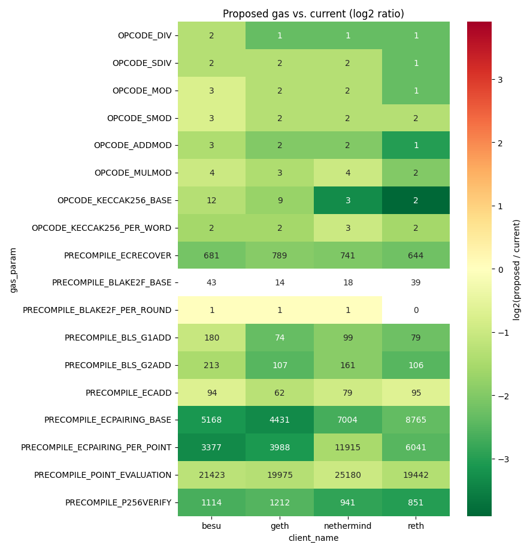

## Worst-case provenance per gas param

One collapsible block per gas parameter showing every per-client candidate that the worst-case selector saw. Rows are model combos (the source regression's `test_name`, `target_opcode`, `model_coef_name`, and any `model_by` factors — components constant within a parameter are dropped from the label). Cells carry each candidate's proposed gas; the cell the per-client selector picked is outlined in black. Colors are `log2(proposed / current)` against that parameter's baseline on a per-parameter symmetric scale.

_Single-combo parameters omitted (see proposal table for the sole estimation): `OPCODE_DIV`, `OPCODE_SDIV`, `OPCODE_ADDMOD`, `OPCODE_MULMOD`, `PRECOMPILE_ECRECOVER`, `PRECOMPILE_BLS_G1ADD`, `PRECOMPILE_BLS_G2ADD`._

<code>OPCODE_MOD</code> — 4 combos × 4 clients

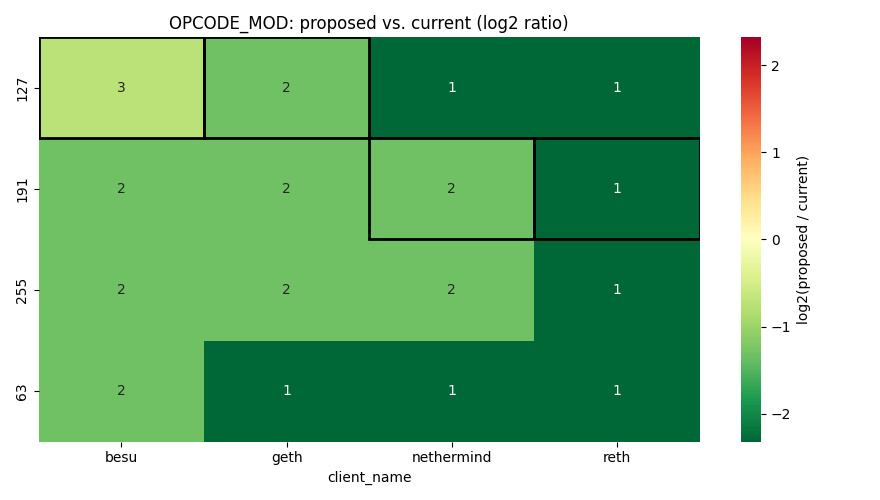

<code>OPCODE_SMOD</code> — 4 combos × 4 clients

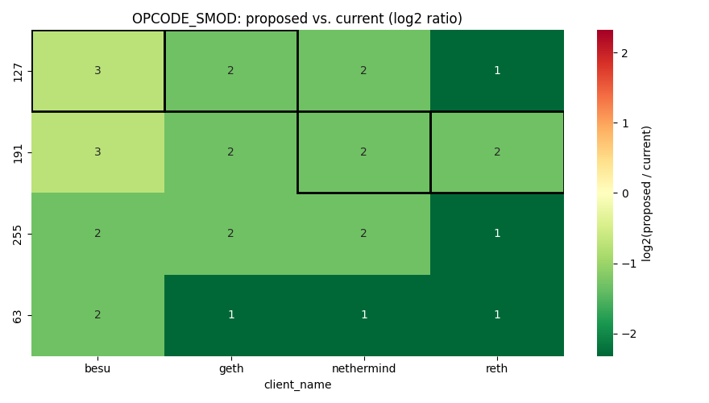

<code>OPCODE_KECCAK256_BASE</code> — 4 combos × 4 clients

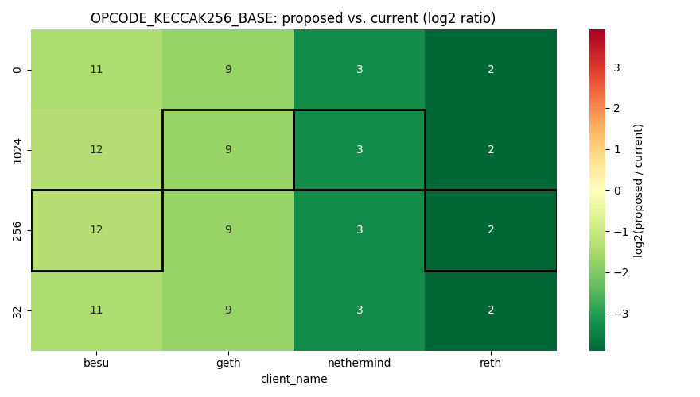

<code>OPCODE_KECCAK256_PER_WORD</code> — 4 combos × 4 clients

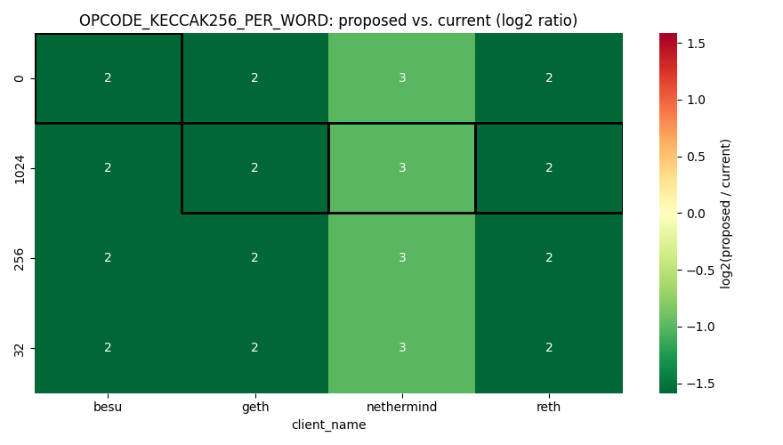

<code>PRECOMPILE_BLAKE2F_BASE</code> — 2 combos × 4 clients

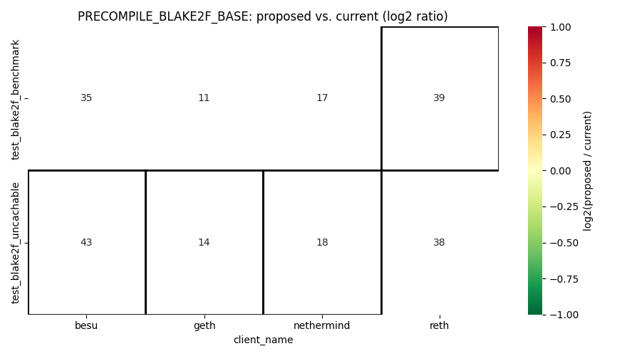

<code>PRECOMPILE_BLAKE2F_PER_ROUND</code> — 2 combos × 4 clients

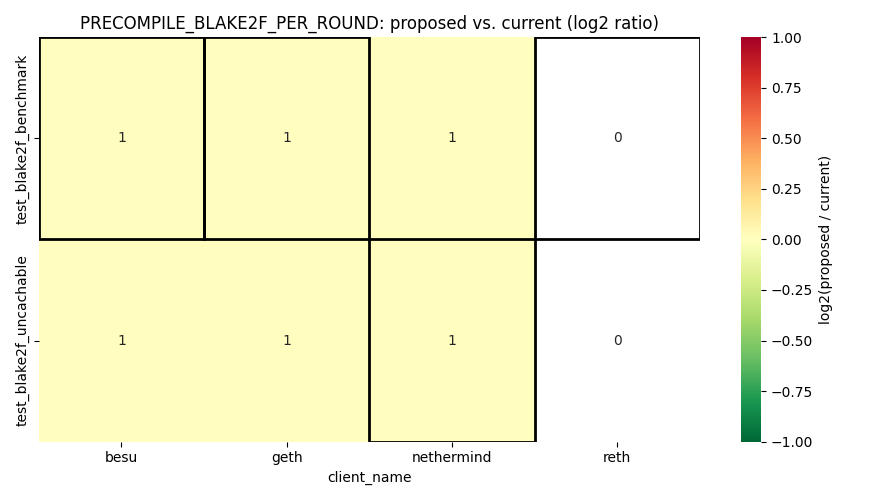

<code>PRECOMPILE_ECADD</code> — 5 combos × 4 clients

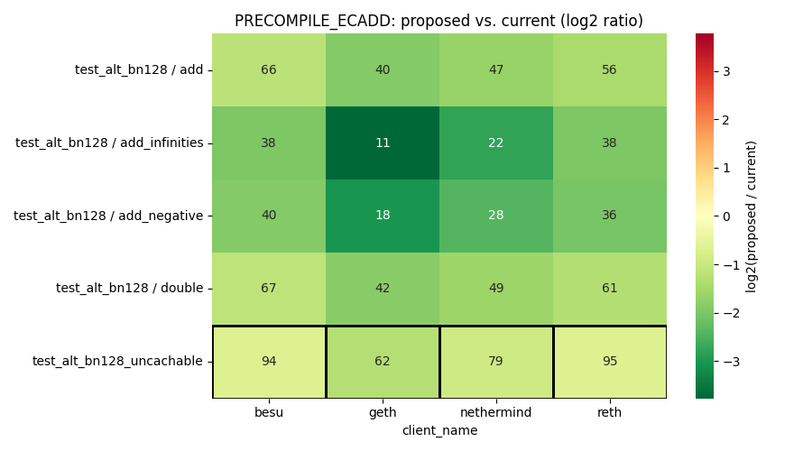

<code>PRECOMPILE_ECPAIRING_BASE</code> — 2 combos × 4 clients

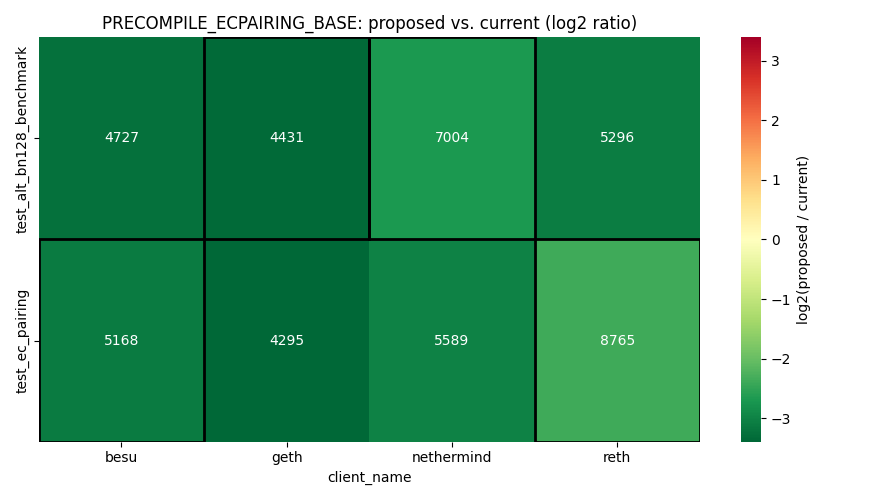

<code>PRECOMPILE_ECPAIRING_PER_POINT</code> — 2 combos × 4 clients

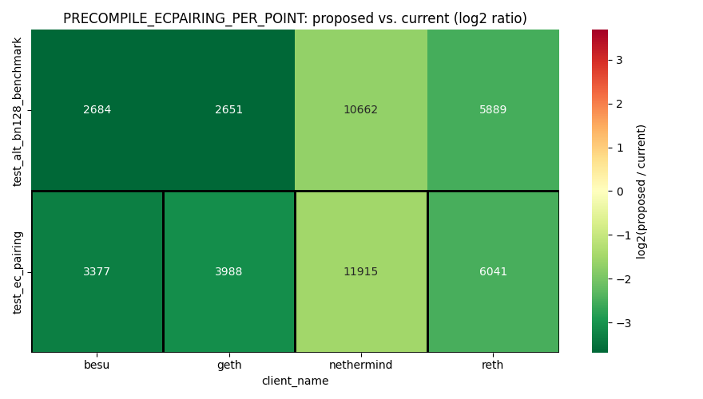

<code>PRECOMPILE_POINT_EVALUATION</code> — 2 combos × 4 clients

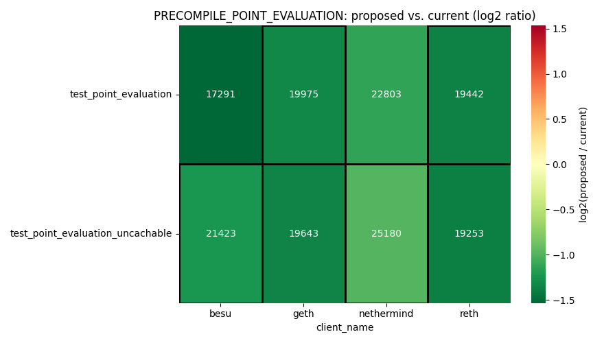

<code>PRECOMPILE_P256VERIFY</code> — 2 combos × 4 clients

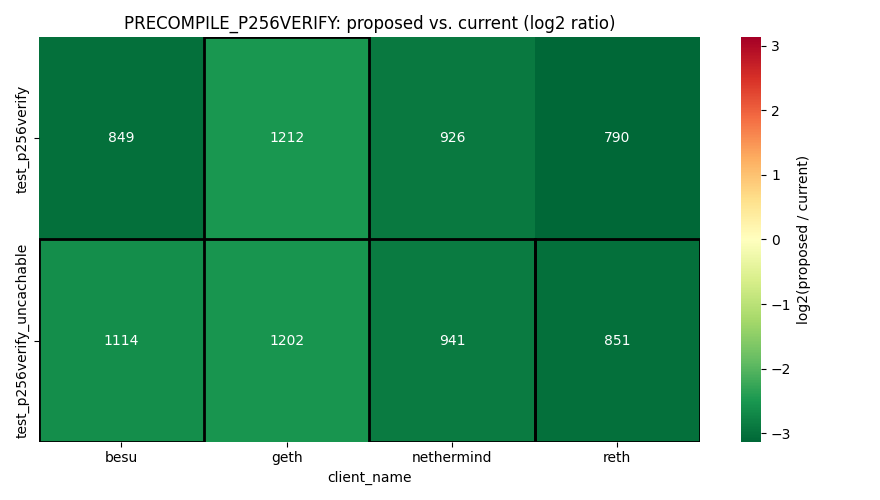

## Warnings

### Missing parameters

_None._

### Incomplete client coverage

**Clients with no estimations at all:** `erigon`. These configured clients produced no fits for any gas parameter — check that the runtimes CSV contains their rows and that the fixture-name conventions match. Inspect the `evm_gasfit` warnings in `meta.json` for the cause.

### Missing glue adjustments

<b>Priced glue opcodes with a poor fit</b> — 11 (glue_opcode, client) fits skipped

`p_value >= glue_contribution_p_value_threshold` (0.05) or `rsquared < glue_contribution_rsquared_threshold` (0.5) — the contribution of these (glue_opcode, client) fits was **skipped** when computing the glue adjustment, so the listed gas params carry a target coefficient that is not net of this glue opcode's runtime on the affected clients. See `glue_opcodes_autogenerated_report.md` for per-fit metrics.

| Glue opcode | Affected clients | Affected gas params |
| --- | --- | --- |
| `CALLDATALOAD` | `besu` (both), `geth` (R²), `nethermind` (R²), `reth` (R²) | `OPCODE_ADDMOD`, `OPCODE_MOD`, `OPCODE_MULMOD`, `OPCODE_SMOD` |
| `EXP` | `nethermind` (both) | — |
| `KECCAK256` | `besu` (R²), `geth` (R²), `nethermind` (both), `reth` (both) | — |
| `MSTORE` | `reth` (R²) | `OPCODE_KECCAK256_BASE`, `PRECOMPILE_ECPAIRING_BASE`, `PRECOMPILE_ECRECOVER`, `PRECOMPILE_P256VERIFY`, `PRECOMPILE_POINT_EVALUATION` |
| `SELFBALANCE` | `besu` (R²) | — |

## Poor-fit selections

Rows where the winning fit's p-value exceeded `modeling.poor_fit_p_value_threshold` (0.05) or its R² fell below `modeling.poor_fit_rsquared_threshold` (0.5). The failing threshold(s) are noted alongside each row; selections in `### Winners with poor fit` still drive the proposal, while `### Other weak candidates` lists losing candidates that the selector dropped in favor of a qualified alternative. See `runtime_estimation_autogenerated_report.md` for per-fit `runtime_ms`, `pvalue`, and `rsquared` metrics.

### Winners with poor fit

| Gas param | Client | Test | Target opcode | Coef | runtime_ms | pvalue | rsquared | Failed |
| --- | --- | --- | --- | --- | --- | --- | --- | --- |
| `OPCODE_KECCAK256_BASE` | `reth` | `test_keccak_diff_mem_msg_sizes` | `KECCAK256` | `target_coef` | 1.844e-05 | 0.051 | 0.5517 | p-value |
| `PRECOMPILE_BLAKE2F_PER_ROUND` | `reth` | `test_blake2f_benchmark` | `BLAKE2F` | `num_rounds` | 0 | 1 | 0.9909 | p-value |

### Other weak candidates

<code>OPCODE_KECCAK256_BASE</code> — 3 weak combos

| Test | Target opcode | Coef | Combo | Failing clients |
| --- | --- | --- | --- | --- |
| `test_keccak_diff_mem_msg_sizes` | `KECCAK256` | `target_coef` | `param_mem_size=0` | `reth` (p-value) |
| `test_keccak_diff_mem_msg_sizes` | `KECCAK256` | `target_coef` | `param_mem_size=1024` | `reth` (p-value) |
| `test_keccak_diff_mem_msg_sizes` | `KECCAK256` | `target_coef` | `param_mem_size=32` | `reth` (p-value) |

<code>PRECOMPILE_BLAKE2F_PER_ROUND</code> — 1 weak combo

| Test | Target opcode | Coef | Combo | Failing clients |
| --- | --- | --- | --- | --- |
| `test_blake2f_uncachable` | `BLAKE2F` | `num_rounds` | — | `reth` (p-value) |

