# Runtime estimation report

Per-spec NNLS fits of `test_runtime_ms` against `opcount`, one row per (target opcode, test, model_by combo, client).

## Contents

- [DIV](#div)
- [SDIV](#sdiv)
- [MOD](#mod)
- [SMOD](#smod)
- [ADDMOD](#addmod)
- [MULMOD](#mulmod)
- [KECCAK256](#keccak256)
- [ECRECOVER](#ecrecover)
- [BLAKE2F](#blake2f)
- [BLS12_G1ADD](#bls12_g1add)
- [BLS12_G2ADD](#bls12_g2add)
- [ECADD](#ecadd)
- [ECPAIRING](#ecpairing)
- [POINT_EVALUATION](#point_evaluation)
- [P256VERIFY](#p256verify)

## DIV

### test_arithmetic

| client | nobs | R² | target_coef (ms) | p-value | 95% CI |
| --- | --- | --- | --- | --- | --- |
| `besu` | 2398 | 0.7295 | 1.548e-05 | 1.00e-03 | [1.511e-05, 1.583e-05] |
| `erigon` | 165 | 0.9005 | 9.948e-06 | 1.00e-03 | [9.487e-06, 1.038e-05] |
| `geth` | 2794 | 0.8004 | 9.563e-06 | 1.00e-03 | [9.36e-06, 9.75e-06] |
| `nethermind` | 814 | 0.6282 | 7.63e-06 | 1.00e-03 | [7.118e-06, 8.125e-06] |
| `reth` | 99 | 0.8305 | 7.01e-06 | 1.00e-03 | [6.317e-06, 7.706e-06] |

<details><summary>besu — NNLS regression summary</summary>

```
==============================================================================
                           NNLS Regression Results                            
==============================================================================
Dep. Variable:          test_runtime_ms              R-squared:          0.729
Model:                  NNLS                    Adj. R-squared:          0.729
No. Observations:       2398                              RMSE:          74.41
Df Residuals:           2396                               MAE:          59.63
Df Model:               1      
==============================================================================
                      coef     std err     P-value      [0.025      0.975]
------------------------------------------------------------------------------
         const    141.2411      4.3147       0.001    132.3638    149.6311
       opcount      0.0000      0.0000       0.001      0.0000      0.0000
==============================================================================
Notes: Non-negative least squares with bootstrap inference (1000 iterations)
==============================================================================
```

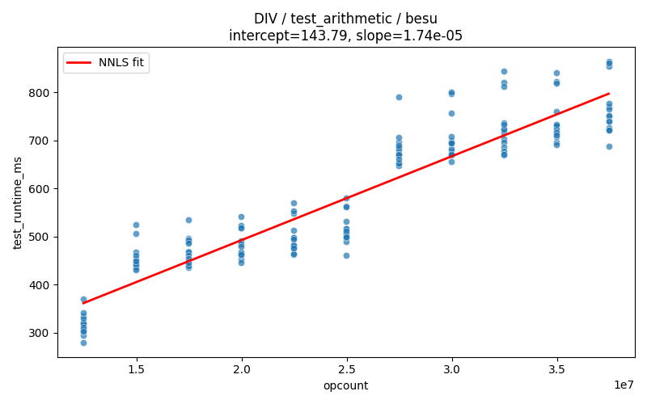

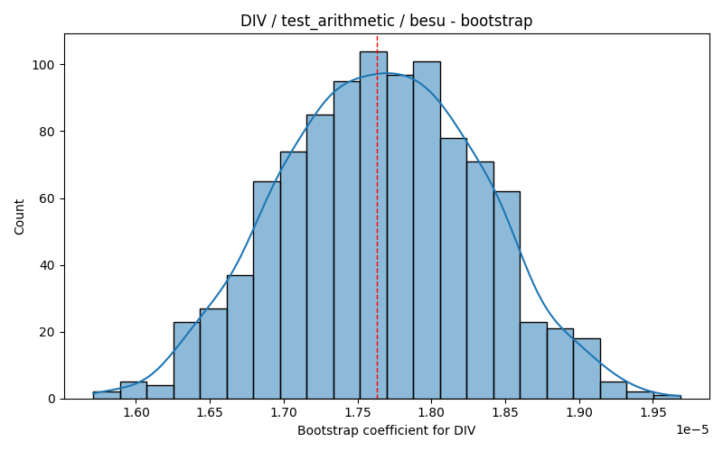

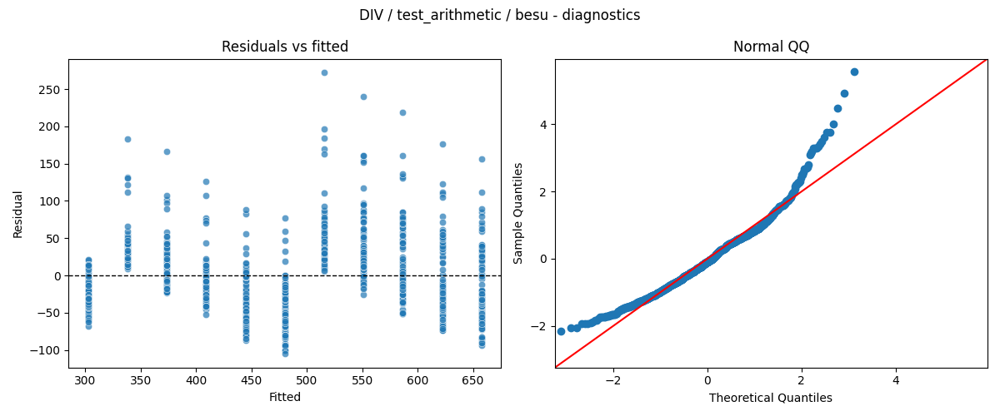

</details>

<details><summary>erigon — NNLS regression summary</summary>

```
==============================================================================
                           NNLS Regression Results                            
==============================================================================
Dep. Variable:          test_runtime_ms              R-squared:          0.901
Model:                  NNLS                    Adj. R-squared:          0.900
No. Observations:       165                               RMSE:          26.10
Df Residuals:           163                                MAE:          22.95
Df Model:               1      
==============================================================================
                      coef     std err     P-value      [0.025      0.975]
------------------------------------------------------------------------------
         const     27.0240      6.4093       0.001     15.3161     39.8709
       opcount      0.0000      0.0000       0.001      0.0000      0.0000
==============================================================================
Notes: Non-negative least squares with bootstrap inference (1000 iterations)
==============================================================================
```

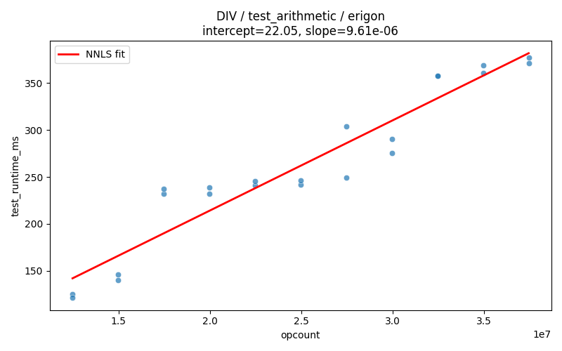

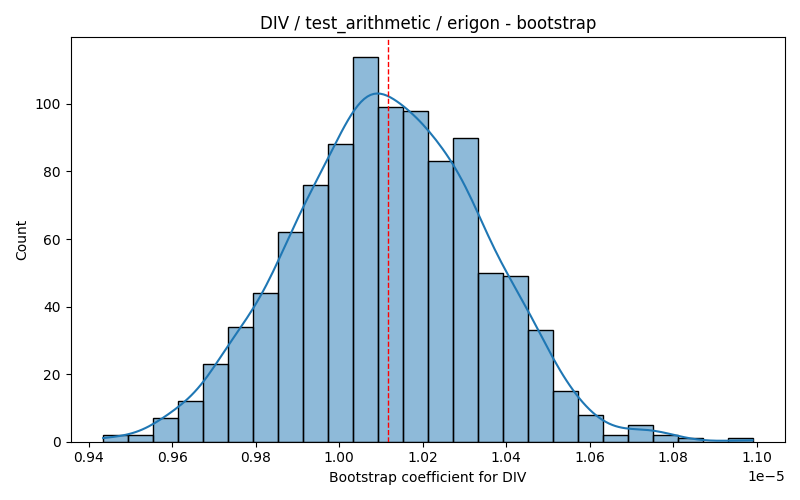

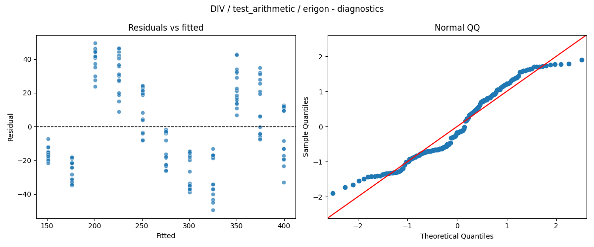

</details>

<details><summary>geth — NNLS regression summary</summary>

```
==============================================================================
                           NNLS Regression Results                            
==============================================================================
Dep. Variable:          test_runtime_ms              R-squared:          0.800
Model:                  NNLS                    Adj. R-squared:          0.800
No. Observations:       2794                              RMSE:          37.70
Df Residuals:           2792                               MAE:          30.88
Df Model:               1      
==============================================================================
                      coef     std err     P-value      [0.025      0.975]
------------------------------------------------------------------------------
         const     73.9858      2.5785       0.001     69.1589     79.2369
       opcount      0.0000      0.0000       0.001      0.0000      0.0000
==============================================================================
Notes: Non-negative least squares with bootstrap inference (1000 iterations)
==============================================================================
```

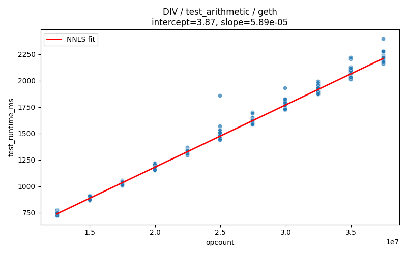

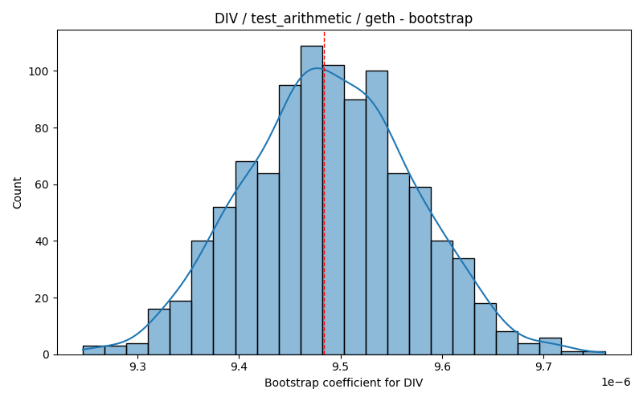

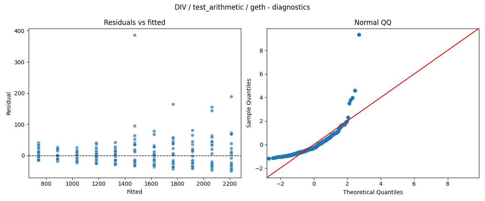

</details>

<details><summary>nethermind — NNLS regression summary</summary>

```
==============================================================================
                           NNLS Regression Results                            
==============================================================================
Dep. Variable:          test_runtime_ms              R-squared:          0.628
Model:                  NNLS                    Adj. R-squared:          0.628
No. Observations:       814                               RMSE:          46.33
Df Residuals:           812                                MAE:          36.82
Df Model:               1      
==============================================================================
                      coef     std err     P-value      [0.025      0.975]
------------------------------------------------------------------------------
         const    130.9458      7.1588       0.001    116.7338    144.9336
       opcount      0.0000      0.0000       0.001      0.0000      0.0000
==============================================================================
Notes: Non-negative least squares with bootstrap inference (1000 iterations)
==============================================================================
```

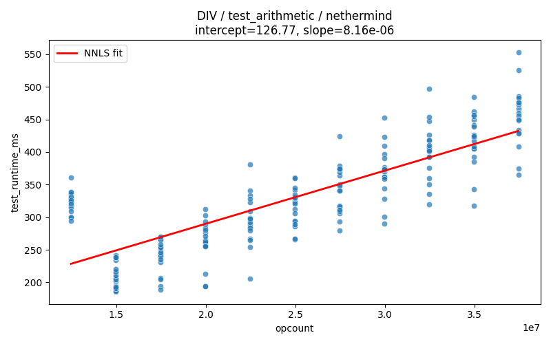

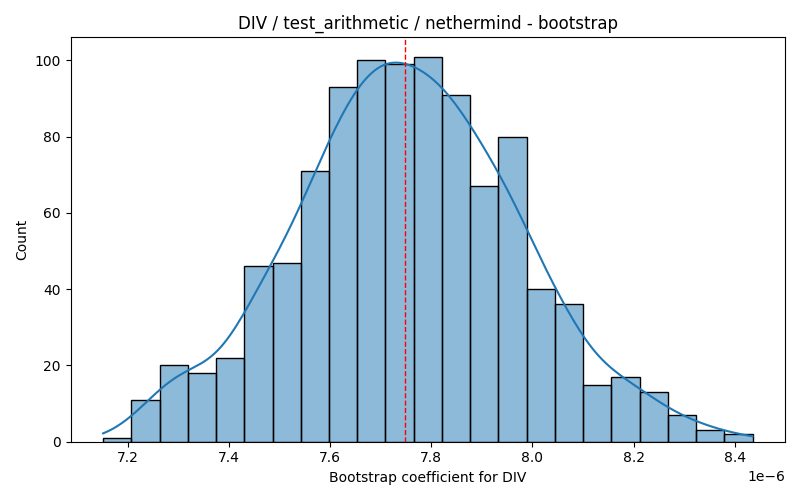

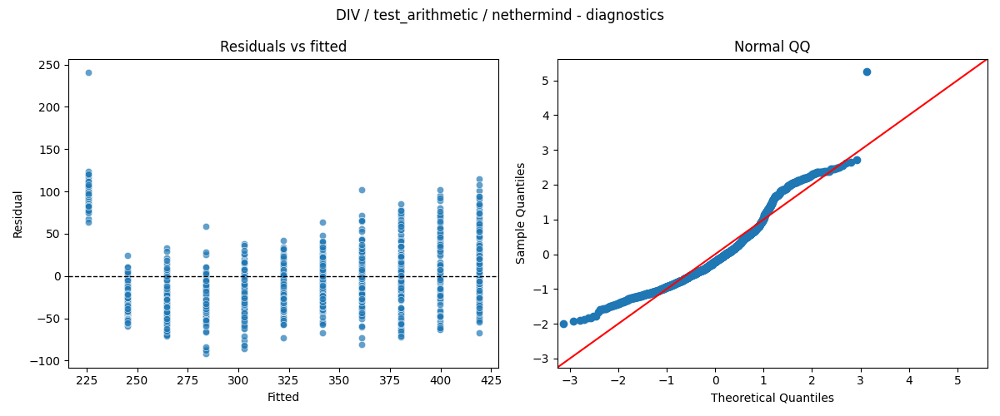

</details>

<details><summary>reth — NNLS regression summary</summary>

```
==============================================================================
                           NNLS Regression Results                            
==============================================================================
Dep. Variable:          test_runtime_ms              R-squared:          0.830
Model:                  NNLS                    Adj. R-squared:          0.829
No. Observations:       99                                RMSE:          25.00
Df Residuals:           97                                 MAE:          21.02
Df Model:               1      
==============================================================================
                      coef     std err     P-value      [0.025      0.975]
------------------------------------------------------------------------------
         const     55.0211      9.3538       0.001     36.6781     74.0580
       opcount      0.0000      0.0000       0.001      0.0000      0.0000
==============================================================================
Notes: Non-negative least squares with bootstrap inference (1000 iterations)
==============================================================================
```

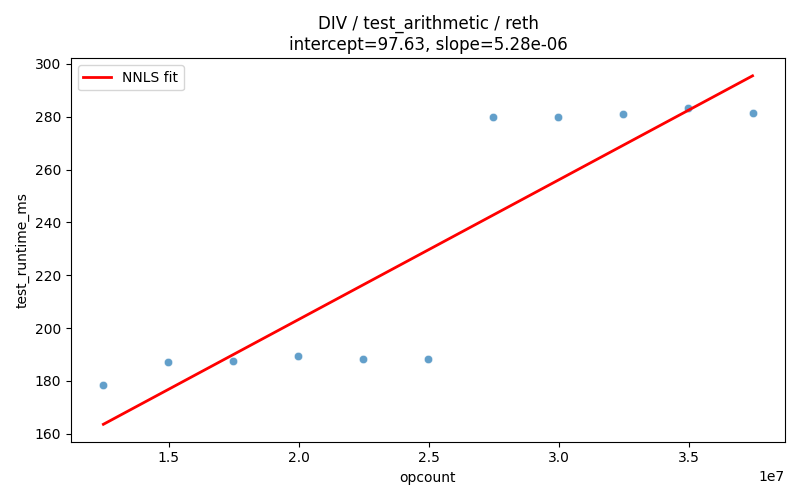

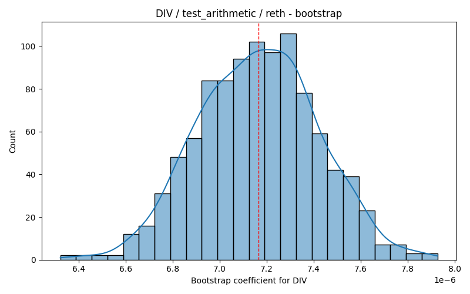

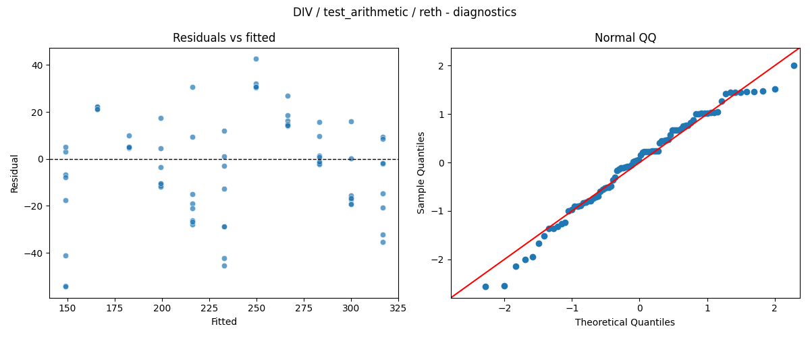

</details>

## SDIV

### test_arithmetic

| client | nobs | R² | target_coef (ms) | p-value | 95% CI |
| --- | --- | --- | --- | --- | --- |
| `besu` | 2398 | 0.7924 | 1.671e-05 | 1.00e-03 | [1.636e-05, 1.706e-05] |
| `erigon` | 165 | 0.7905 | 1.088e-05 | 1.00e-03 | [9.862e-06, 1.166e-05] |
| `geth` | 2794 | 0.8289 | 1.013e-05 | 1.00e-03 | [9.931e-06, 1.033e-05] |
| `nethermind` | 814 | 0.8623 | 1.318e-05 | 1.00e-03 | [1.282e-05, 1.353e-05] |
| `reth` | 99 | 0.8431 | 8.962e-06 | 1.00e-03 | [8.178e-06, 9.826e-06] |

<details><summary>besu — NNLS regression summary</summary>

```
==============================================================================
                           NNLS Regression Results                            
==============================================================================
Dep. Variable:          test_runtime_ms              R-squared:          0.792
Model:                  NNLS                    Adj. R-squared:          0.792
No. Observations:       2398                              RMSE:          67.52
Df Residuals:           2396                               MAE:          55.67
Df Model:               1      
==============================================================================
                      coef     std err     P-value      [0.025      0.975]
------------------------------------------------------------------------------
         const    134.1497      4.4044       0.001    125.1612    142.9939
       opcount      0.0000      0.0000       0.001      0.0000      0.0000
==============================================================================
Notes: Non-negative least squares with bootstrap inference (1000 iterations)
==============================================================================
```

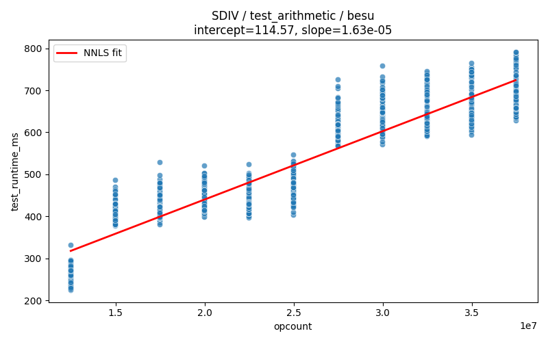

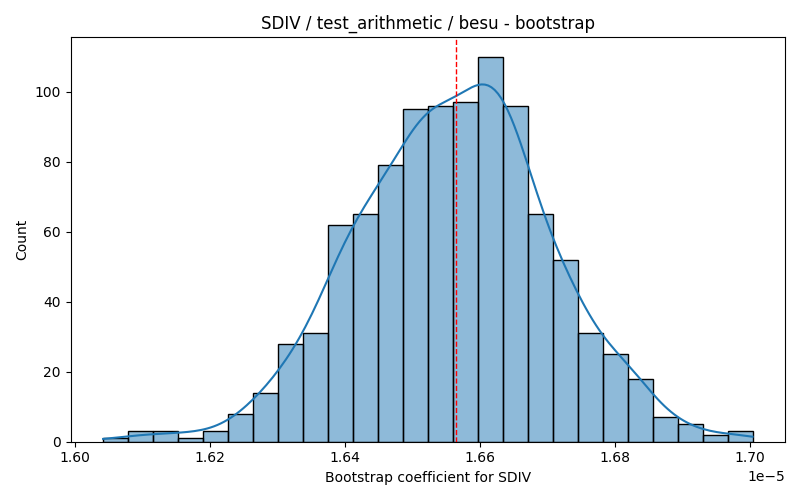

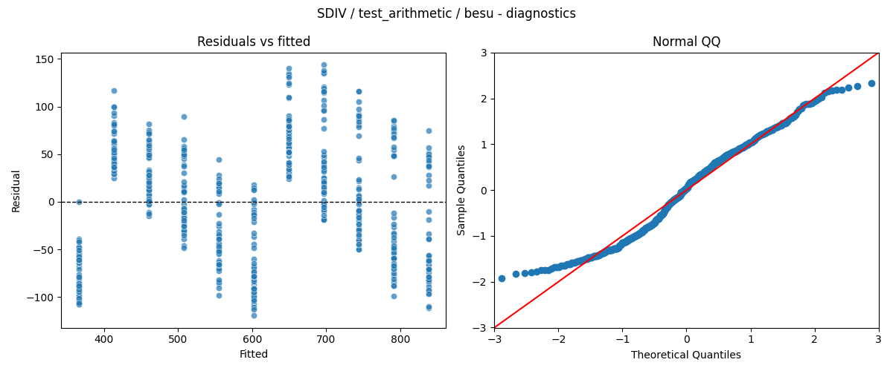

</details>

<details><summary>erigon — NNLS regression summary</summary>

```
==============================================================================
                           NNLS Regression Results                            
==============================================================================
Dep. Variable:          test_runtime_ms              R-squared:          0.791
Model:                  NNLS                    Adj. R-squared:          0.789
No. Observations:       165                               RMSE:          44.19
Df Residuals:           163                                MAE:          28.85
Df Model:               1      
==============================================================================
                      coef     std err     P-value      [0.025      0.975]
------------------------------------------------------------------------------
         const     45.2514     14.1156       0.001     22.3873     76.1319
       opcount      0.0000      0.0000       0.001      0.0000      0.0000
==============================================================================
Notes: Non-negative least squares with bootstrap inference (1000 iterations)
==============================================================================
```

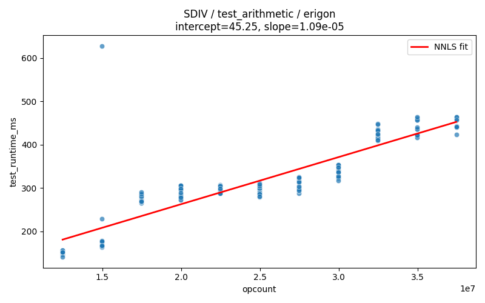

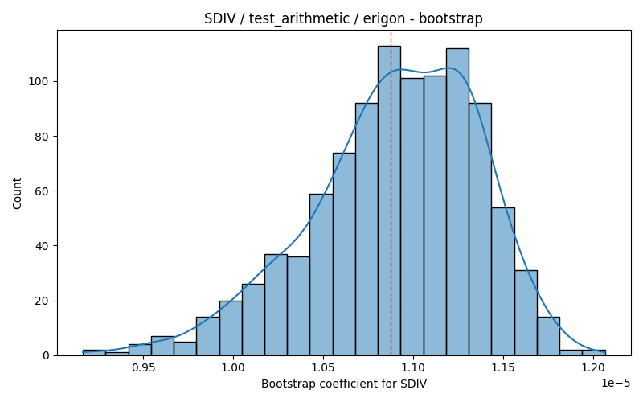

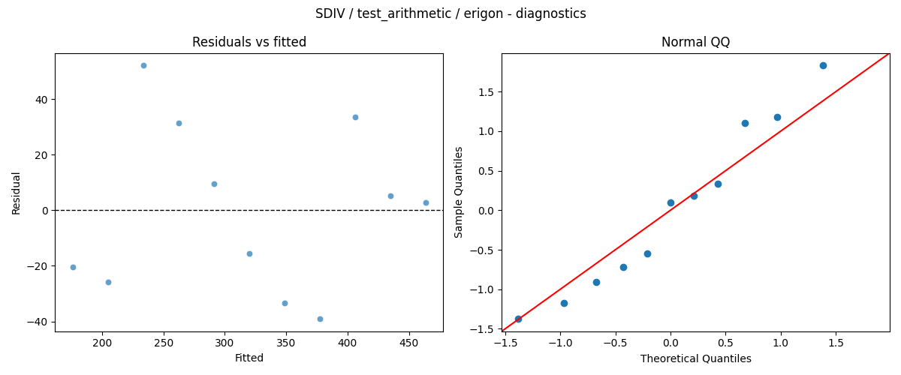

</details>

<details><summary>geth — NNLS regression summary</summary>

```
==============================================================================
                           NNLS Regression Results                            
==============================================================================
Dep. Variable:          test_runtime_ms              R-squared:          0.829
Model:                  NNLS                    Adj. R-squared:          0.829
No. Observations:       2794                              RMSE:          36.35
Df Residuals:           2792                               MAE:          30.42
Df Model:               1      
==============================================================================
                      coef     std err     P-value      [0.025      0.975]
------------------------------------------------------------------------------
         const     79.7890      2.5956       0.001     74.5974     85.0421
       opcount      0.0000      0.0000       0.001      0.0000      0.0000
==============================================================================
Notes: Non-negative least squares with bootstrap inference (1000 iterations)
==============================================================================
```

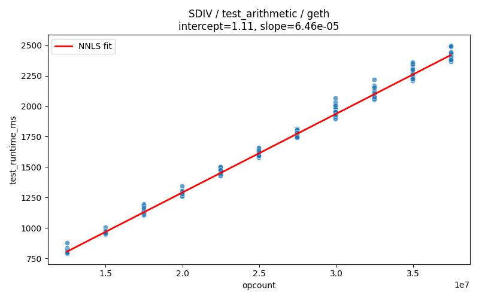

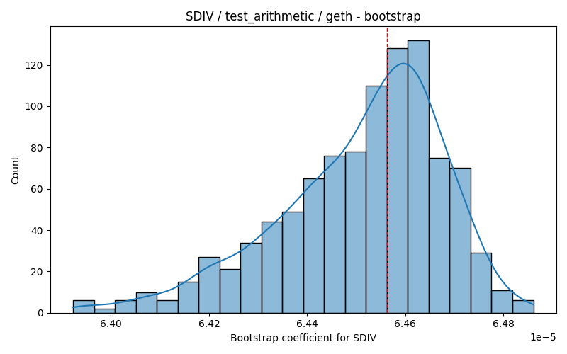

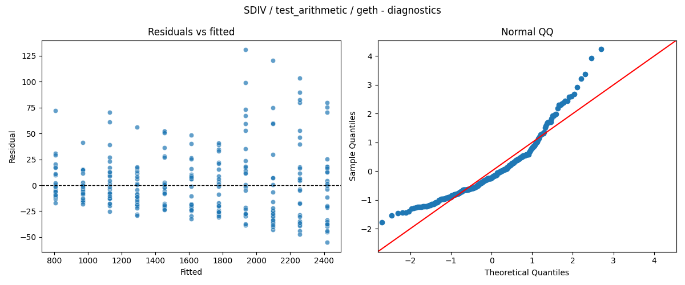

</details>

<details><summary>nethermind — NNLS regression summary</summary>

```
==============================================================================
                           NNLS Regression Results                            
==============================================================================
Dep. Variable:          test_runtime_ms              R-squared:          0.862
Model:                  NNLS                    Adj. R-squared:          0.862
No. Observations:       814                               RMSE:          41.56
Df Residuals:           812                                MAE:          33.41
Df Model:               1      
==============================================================================
                      coef     std err     P-value      [0.025      0.975]
------------------------------------------------------------------------------
         const     69.0164      4.1849       0.001     61.2333     77.3231
       opcount      0.0000      0.0000       0.001      0.0000      0.0000
==============================================================================
Notes: Non-negative least squares with bootstrap inference (1000 iterations)
==============================================================================
```

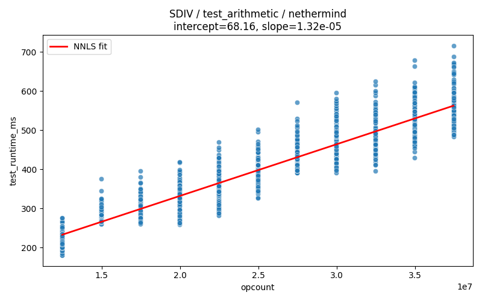

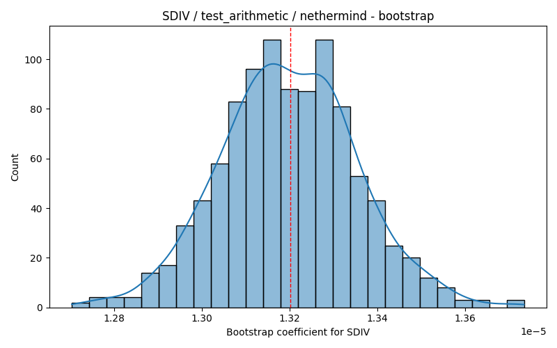

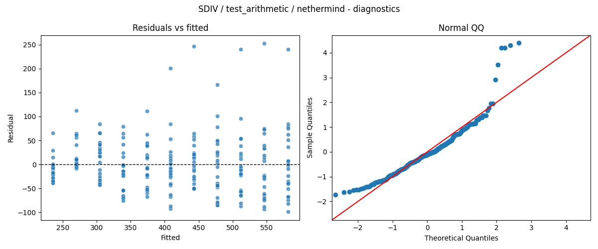

</details>

<details><summary>reth — NNLS regression summary</summary>

```
==============================================================================
                           NNLS Regression Results                            
==============================================================================
Dep. Variable:          test_runtime_ms              R-squared:          0.843
Model:                  NNLS                    Adj. R-squared:          0.841
No. Observations:       99                                RMSE:          30.52
Df Residuals:           97                                 MAE:          24.84
Df Model:               1      
==============================================================================
                      coef     std err     P-value      [0.025      0.975]
------------------------------------------------------------------------------
         const     76.1655     11.2760       0.001     53.4124     97.1894
       opcount      0.0000      0.0000       0.001      0.0000      0.0000
==============================================================================
Notes: Non-negative least squares with bootstrap inference (1000 iterations)
==============================================================================
```

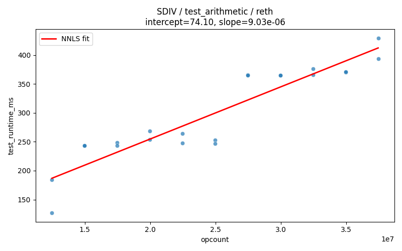

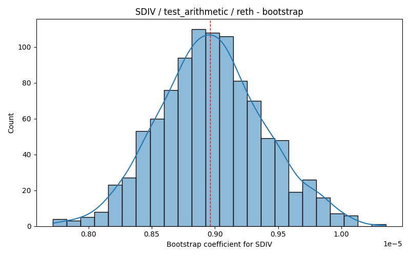

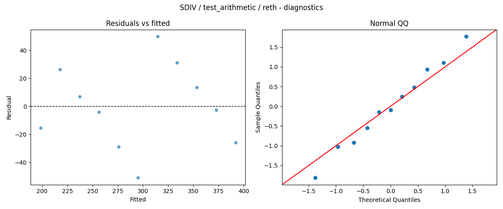

</details>

## MOD

### test_mod — combo `127`

| client | nobs | R² | target_coef (ms) | p-value | 95% CI |
| --- | --- | --- | --- | --- | --- |
| `besu` | 2398 | 0.846 | 1.961e-05 | 1.00e-03 | [1.927e-05, 1.996e-05] |
| `erigon` | 165 | 0.8847 | 1.211e-05 | 1.00e-03 | [1.148e-05, 1.264e-05] |
| `geth` | 2794 | 0.8335 | 1.161e-05 | 1.00e-03 | [1.139e-05, 1.184e-05] |
| `nethermind` | 814 | 0.8787 | 1.013e-05 | 1.00e-03 | [9.879e-06, 1.039e-05] |
| `reth` | 99 | 0.8527 | 7.02e-06 | 1.00e-03 | [6.409e-06, 7.626e-06] |

<details><summary>besu — NNLS regression summary</summary>

```
==============================================================================
                           NNLS Regression Results                            
==============================================================================
Dep. Variable:          test_runtime_ms              R-squared:          0.846
Model:                  NNLS                    Adj. R-squared:          0.846
No. Observations:       2398                              RMSE:          65.97
Df Residuals:           2396                               MAE:          55.34
Df Model:               1      
==============================================================================
                      coef     std err     P-value      [0.025      0.975]
------------------------------------------------------------------------------
         const    132.0504      4.6395       0.001    123.2889    141.2941
       opcount      0.0000      0.0000       0.001      0.0000      0.0000
==============================================================================
Notes: Non-negative least squares with bootstrap inference (1000 iterations)
==============================================================================
```

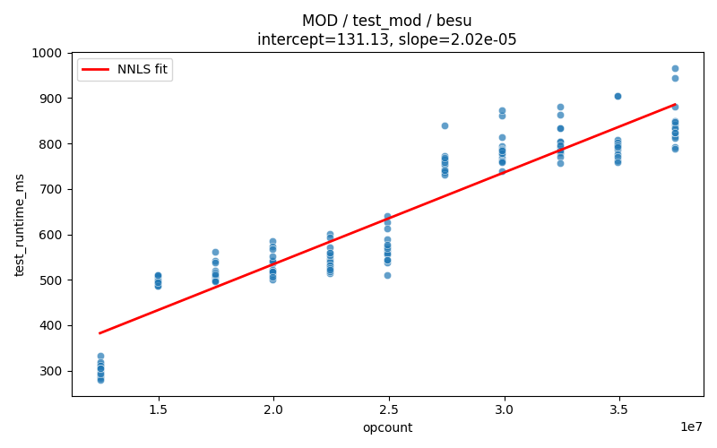

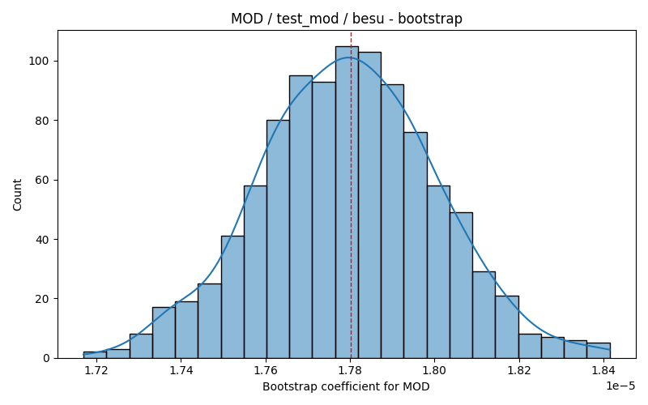

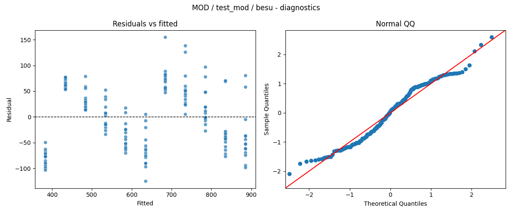

</details>

<details><summary>erigon — NNLS regression summary</summary>

```
==============================================================================
                           NNLS Regression Results                            
==============================================================================
Dep. Variable:          test_runtime_ms              R-squared:          0.885
Model:                  NNLS                    Adj. R-squared:          0.884
No. Observations:       165                               RMSE:          34.46
Df Residuals:           163                                MAE:          30.09
Df Model:               1      
==============================================================================
                      coef     std err     P-value      [0.025      0.975]
------------------------------------------------------------------------------
         const     37.8697      8.4515       0.001     22.6606     55.1527
       opcount      0.0000      0.0000       0.001      0.0000      0.0000
==============================================================================
Notes: Non-negative least squares with bootstrap inference (1000 iterations)
==============================================================================
```

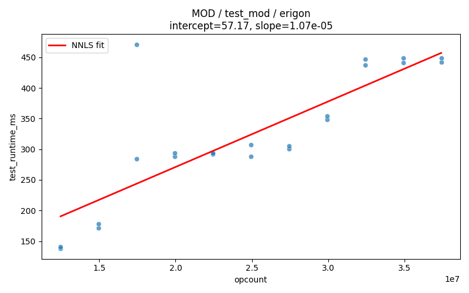

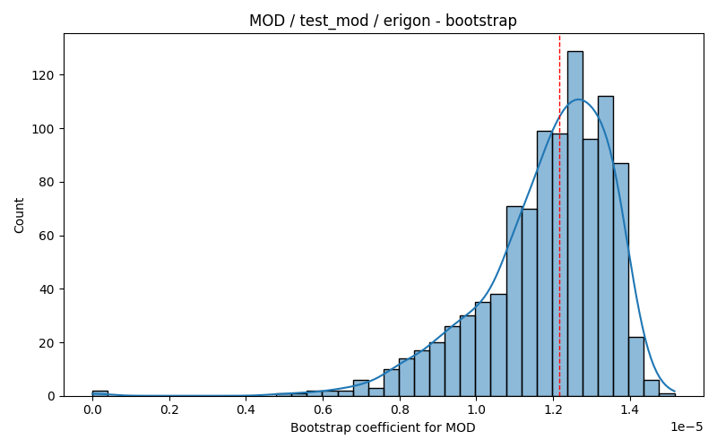

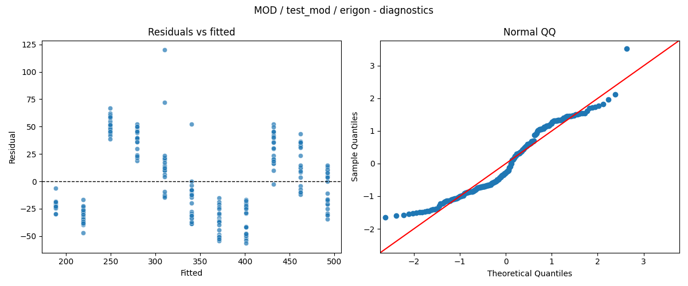

</details>

<details><summary>geth — NNLS regression summary</summary>

```
==============================================================================
                           NNLS Regression Results                            
==============================================================================
Dep. Variable:          test_runtime_ms              R-squared:          0.834
Model:                  NNLS                    Adj. R-squared:          0.833
No. Observations:       2794                              RMSE:          40.90
Df Residuals:           2792                               MAE:          34.64
Df Model:               1      
==============================================================================
                      coef     std err     P-value      [0.025      0.975]
------------------------------------------------------------------------------
         const     87.2735      3.1035       0.001     81.1010     93.0113
       opcount      0.0000      0.0000       0.001      0.0000      0.0000
==============================================================================
Notes: Non-negative least squares with bootstrap inference (1000 iterations)
==============================================================================
```

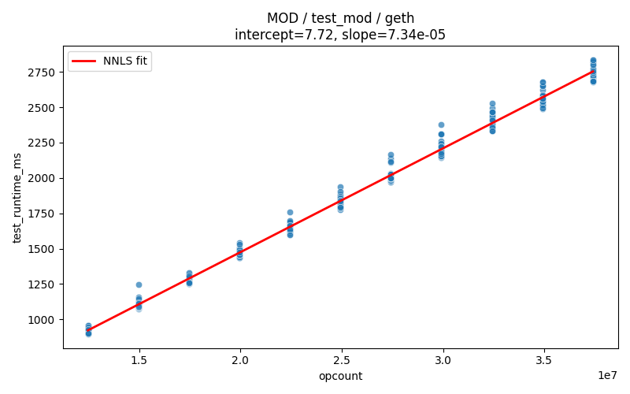

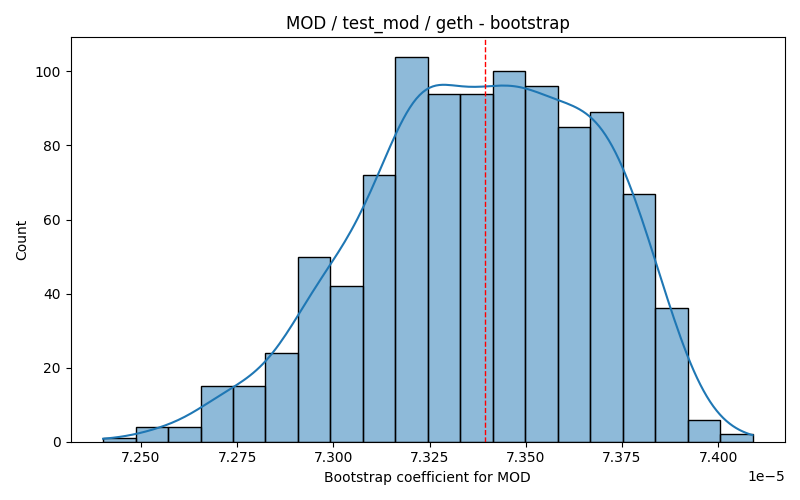

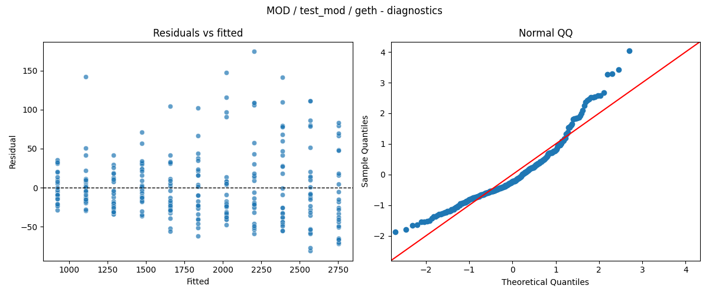

</details>

<details><summary>nethermind — NNLS regression summary</summary>

```
==============================================================================
                           NNLS Regression Results                            
==============================================================================
Dep. Variable:          test_runtime_ms              R-squared:          0.879
Model:                  NNLS                    Adj. R-squared:          0.879
No. Observations:       814                               RMSE:          29.67
Df Residuals:           812                                MAE:          23.25
Df Model:               1      
==============================================================================
                      coef     std err     P-value      [0.025      0.975]
------------------------------------------------------------------------------
         const     44.7589      3.0456       0.001     38.9109     50.9623
       opcount      0.0000      0.0000       0.001      0.0000      0.0000
==============================================================================
Notes: Non-negative least squares with bootstrap inference (1000 iterations)
==============================================================================
```

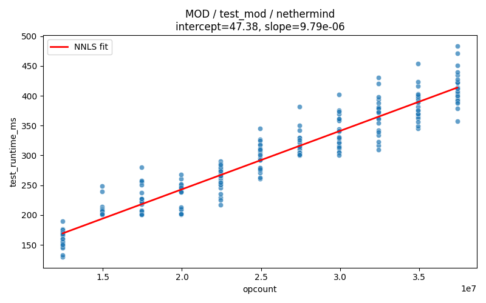

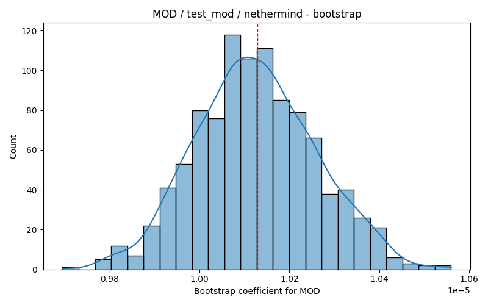

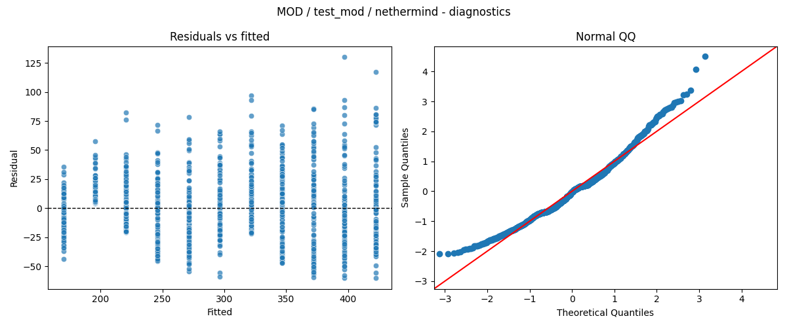

</details>

<details><summary>reth — NNLS regression summary</summary>

```
==============================================================================
                           NNLS Regression Results                            
==============================================================================
Dep. Variable:          test_runtime_ms              R-squared:          0.853
Model:                  NNLS                    Adj. R-squared:          0.851
No. Observations:       99                                RMSE:          23.01
Df Residuals:           97                                 MAE:          19.37
Df Model:               1      
==============================================================================
                      coef     std err     P-value      [0.025      0.975]
------------------------------------------------------------------------------
         const     50.7237      8.6950       0.001     34.7373     67.9577
       opcount      0.0000      0.0000       0.001      0.0000      0.0000
==============================================================================
Notes: Non-negative least squares with bootstrap inference (1000 iterations)
==============================================================================
```

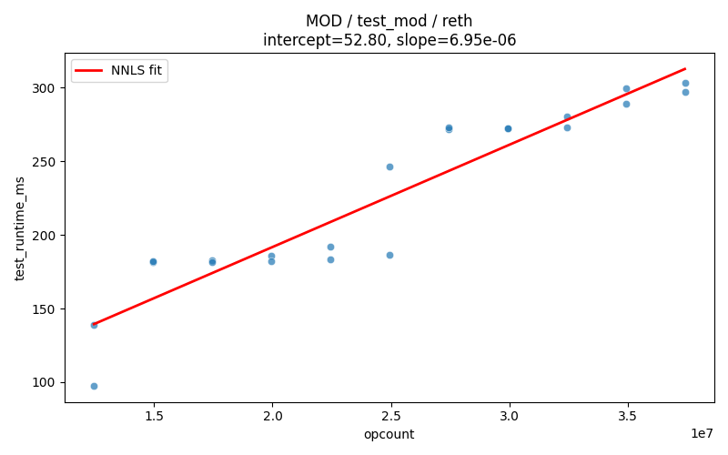

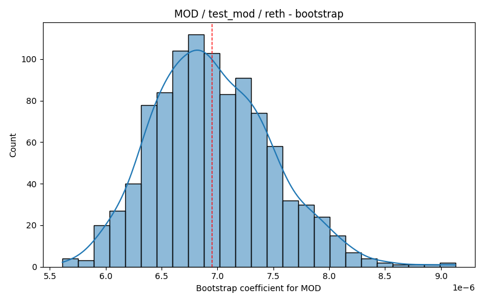

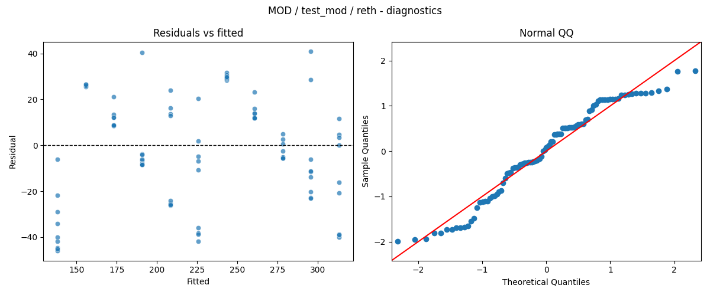

</details>

### test_mod — combo `191`

| client | nobs | R² | target_coef (ms) | p-value | 95% CI |
| --- | --- | --- | --- | --- | --- |
| `besu` | 2398 | 0.834 | 1.793e-05 | 1.00e-03 | [1.763e-05, 1.824e-05] |
| `erigon` | 165 | 0.8151 | 1.168e-05 | 1.00e-03 | [1.114e-05, 1.226e-05] |
| `geth` | 2794 | 0.8338 | 1.11e-05 | 1.00e-03 | [1.09e-05, 1.129e-05] |
| `nethermind` | 814 | 0.8877 | 1.114e-05 | 1.00e-03 | [1.087e-05, 1.141e-05] |
| `reth` | 99 | 0.8484 | 9.667e-06 | 1.00e-03 | [8.782e-06, 1.059e-05] |

<details><summary>besu — NNLS regression summary</summary>

```
==============================================================================
                           NNLS Regression Results                            
==============================================================================
Dep. Variable:          test_runtime_ms              R-squared:          0.834
Model:                  NNLS                    Adj. R-squared:          0.834
No. Observations:       2398                              RMSE:          63.05
Df Residuals:           2396                               MAE:          51.61
Df Model:               1      
==============================================================================
                      coef     std err     P-value      [0.025      0.975]
------------------------------------------------------------------------------
         const    133.7527      4.2145       0.001    125.3904    141.8387
       opcount      0.0000      0.0000       0.001      0.0000      0.0000
==============================================================================
Notes: Non-negative least squares with bootstrap inference (1000 iterations)
==============================================================================
```

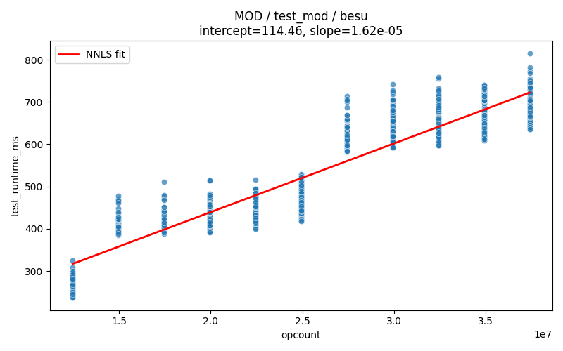

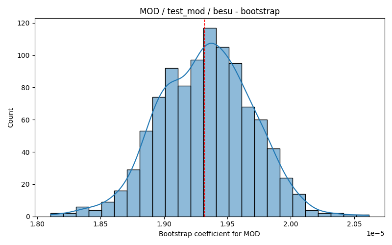

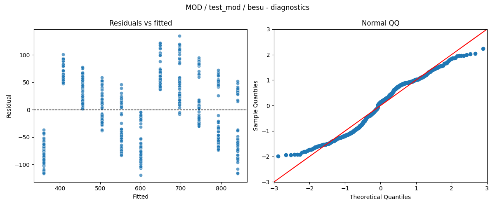

</details>

<details><summary>erigon — NNLS regression summary</summary>

```
==============================================================================
                           NNLS Regression Results                            
==============================================================================
Dep. Variable:          test_runtime_ms              R-squared:          0.815
Model:                  NNLS                    Adj. R-squared:          0.814
No. Observations:       165                               RMSE:          43.87
Df Residuals:           163                                MAE:          30.69
Df Model:               1      
==============================================================================
                      coef     std err     P-value      [0.025      0.975]
------------------------------------------------------------------------------
         const     38.3916      8.3023       0.001     22.9512     54.2014
       opcount      0.0000      0.0000       0.001      0.0000      0.0000
==============================================================================
Notes: Non-negative least squares with bootstrap inference (1000 iterations)
==============================================================================
```

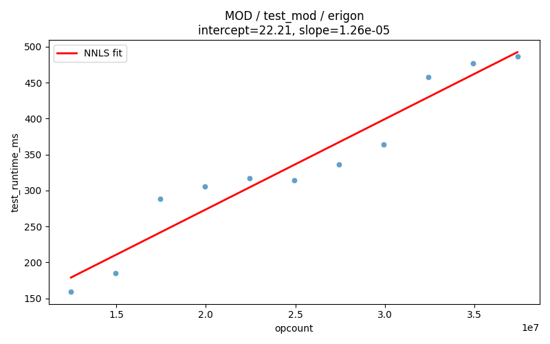

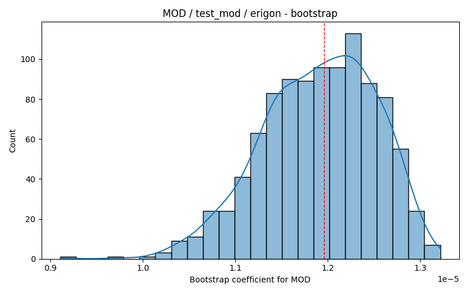

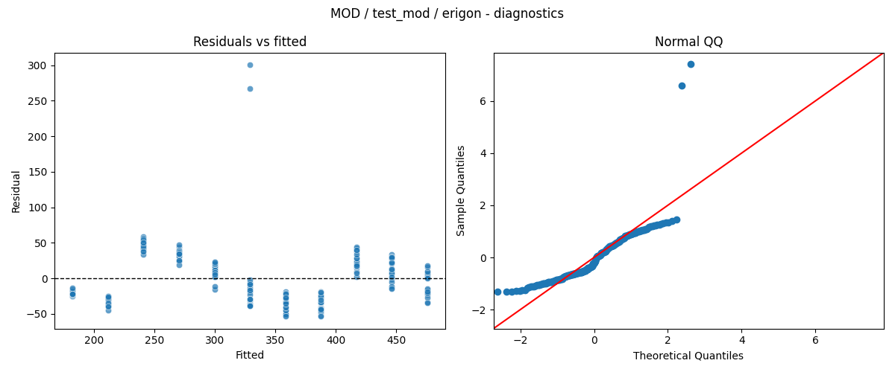

</details>

<details><summary>geth — NNLS regression summary</summary>

```
==============================================================================
                           NNLS Regression Results                            
==============================================================================
Dep. Variable:          test_runtime_ms              R-squared:          0.834
Model:                  NNLS                    Adj. R-squared:          0.834
No. Observations:       2794                              RMSE:          39.06
Df Residuals:           2792                               MAE:          33.00
Df Model:               1      
==============================================================================
                      coef     std err     P-value      [0.025      0.975]
------------------------------------------------------------------------------
         const     83.9700      2.8024       0.001     78.8453     89.3726
       opcount      0.0000      0.0000       0.001      0.0000      0.0000
==============================================================================
Notes: Non-negative least squares with bootstrap inference (1000 iterations)
==============================================================================
```

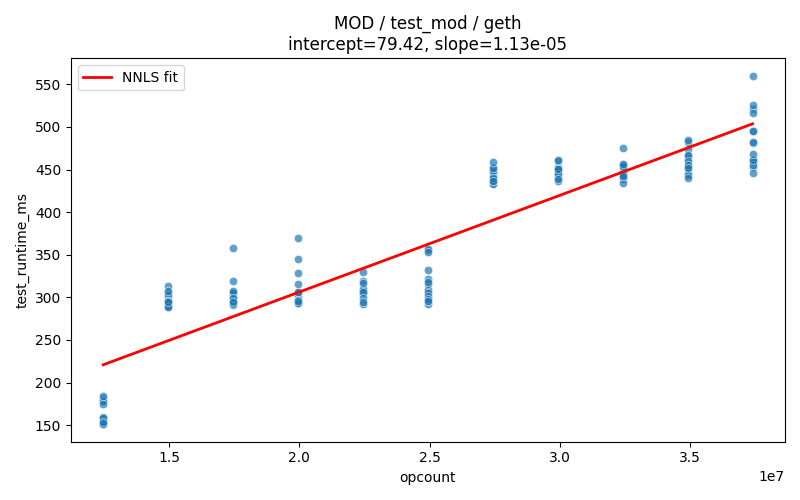

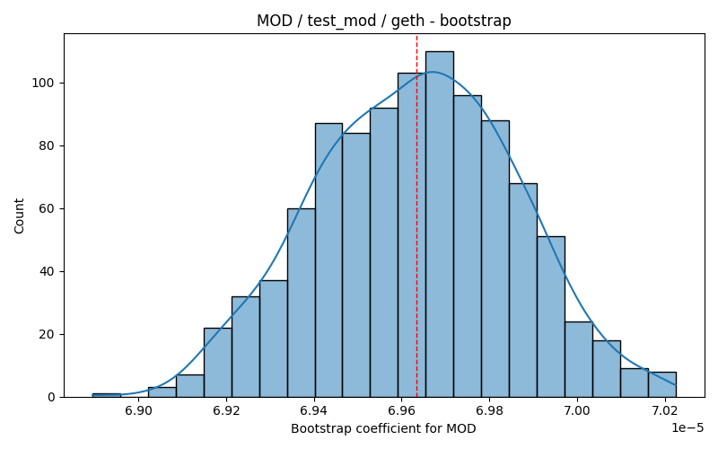

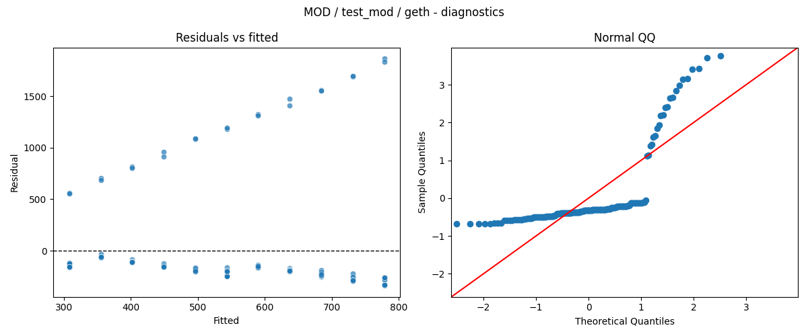

</details>

<details><summary>nethermind — NNLS regression summary</summary>

```
==============================================================================
                           NNLS Regression Results                            
==============================================================================
Dep. Variable:          test_runtime_ms              R-squared:          0.888
Model:                  NNLS                    Adj. R-squared:          0.888
No. Observations:       814                               RMSE:          31.26
Df Residuals:           812                                MAE:          24.57
Df Model:               1      
==============================================================================
                      coef     std err     P-value      [0.025      0.975]
------------------------------------------------------------------------------
         const     53.2198      3.2353       0.001     47.1146     59.6598
       opcount      0.0000      0.0000       0.001      0.0000      0.0000
==============================================================================
Notes: Non-negative least squares with bootstrap inference (1000 iterations)
==============================================================================
```

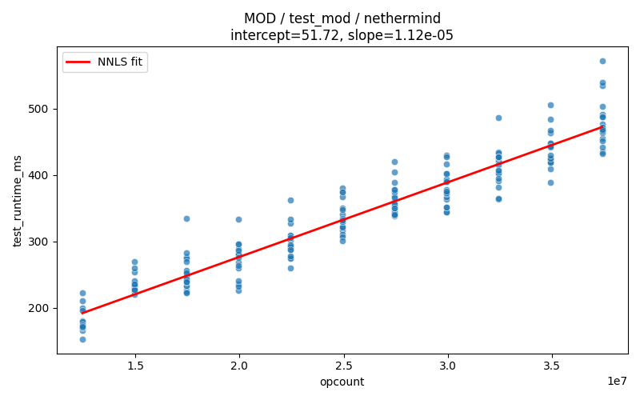

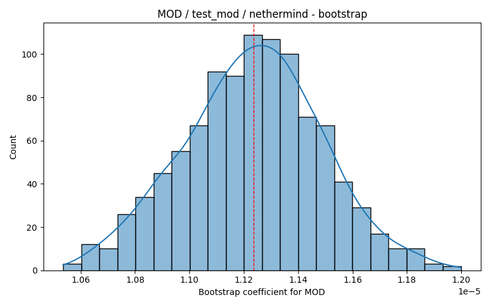

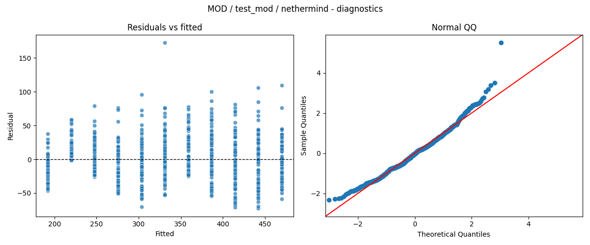

</details>

<details><summary>reth — NNLS regression summary</summary>

```
==============================================================================
                           NNLS Regression Results                            
==============================================================================
Dep. Variable:          test_runtime_ms              R-squared:          0.848
Model:                  NNLS                    Adj. R-squared:          0.847
No. Observations:       99                                RMSE:          32.22
Df Residuals:           97                                 MAE:          26.80
Df Model:               1      
==============================================================================
                      coef     std err     P-value      [0.025      0.975]
------------------------------------------------------------------------------
         const     80.1545     12.0225       0.001     57.1653    103.6467
       opcount      0.0000      0.0000       0.001      0.0000      0.0000
==============================================================================
Notes: Non-negative least squares with bootstrap inference (1000 iterations)
==============================================================================
```

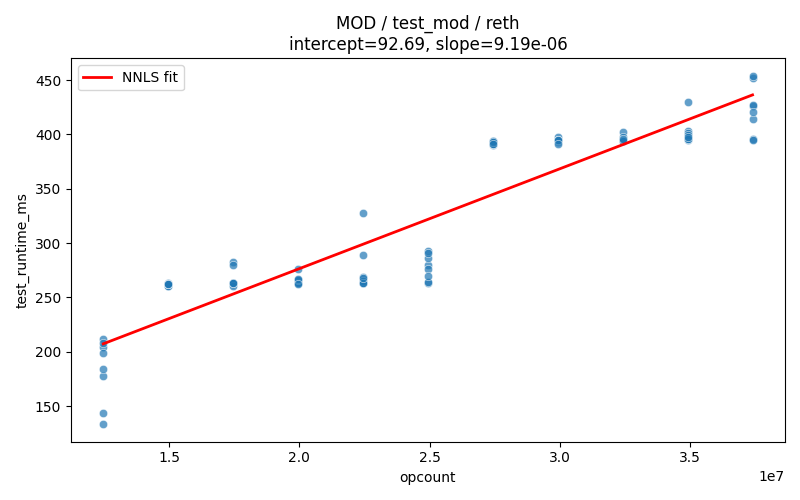

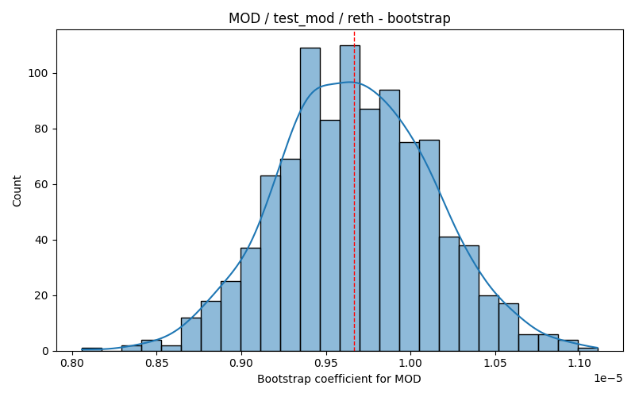

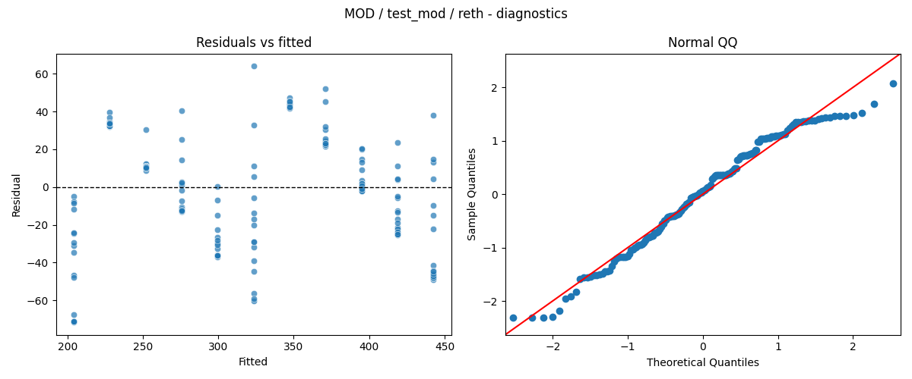

</details>

### test_mod — combo `255`

| client | nobs | R² | target_coef (ms) | p-value | 95% CI |
| --- | --- | --- | --- | --- | --- |
| `besu` | 2398 | 0.8125 | 1.466e-05 | 1.00e-03 | [1.437e-05, 1.493e-05] |
| `erigon` | 165 | 0.7818 | 1.146e-05 | 1.00e-03 | [1.08e-05, 1.214e-05] |
| `geth` | 2794 | 0.8328 | 1.018e-05 | 1.00e-03 | [1.001e-05, 1.039e-05] |
| `nethermind` | 814 | 0.9137 | 1.03e-05 | 1.00e-03 | [1.009e-05, 1.052e-05] |
| `reth` | 99 | 0.8313 | 8.048e-06 | 1.00e-03 | [7.341e-06, 8.779e-06] |

<details><summary>besu — NNLS regression summary</summary>

```
==============================================================================
                           NNLS Regression Results                            
==============================================================================
Dep. Variable:          test_runtime_ms              R-squared:          0.813
Model:                  NNLS                    Adj. R-squared:          0.812
No. Observations:       2398                              RMSE:          55.51
Df Residuals:           2396                               MAE:          45.98
Df Model:               1      
==============================================================================
                      coef     std err     P-value      [0.025      0.975]
------------------------------------------------------------------------------
         const    102.7902      3.6938       0.001     95.7475    110.0043
       opcount      0.0000      0.0000       0.001      0.0000      0.0000
==============================================================================
Notes: Non-negative least squares with bootstrap inference (1000 iterations)
==============================================================================
```

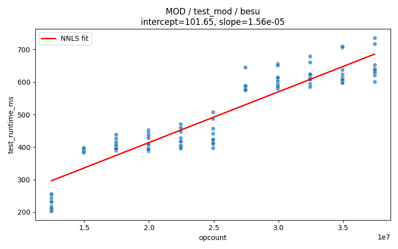

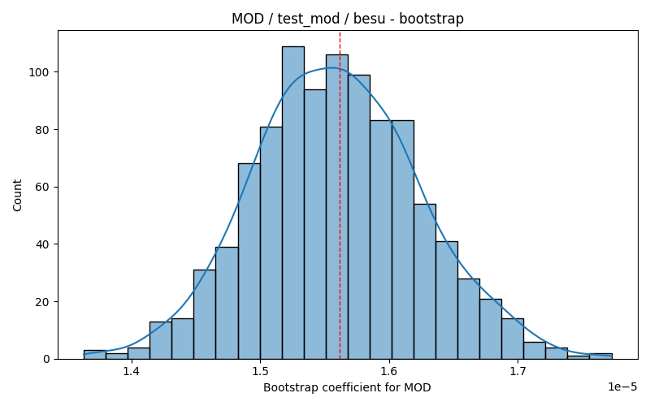

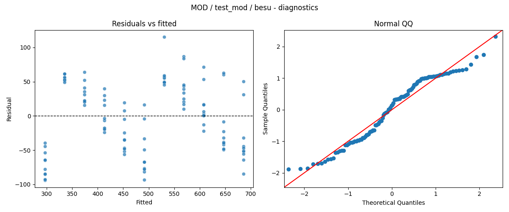

</details>

<details><summary>erigon — NNLS regression summary</summary>

```
==============================================================================
                           NNLS Regression Results                            
==============================================================================
Dep. Variable:          test_runtime_ms              R-squared:          0.782
Model:                  NNLS                    Adj. R-squared:          0.780
No. Observations:       165                               RMSE:          47.72
Df Residuals:           163                                MAE:          32.01
Df Model:               1      
==============================================================================
                      coef     std err     P-value      [0.025      0.975]
------------------------------------------------------------------------------
         const     31.8612      8.1423       0.001     16.6799     48.6091
       opcount      0.0000      0.0000       0.001      0.0000      0.0000
==============================================================================
Notes: Non-negative least squares with bootstrap inference (1000 iterations)
==============================================================================
```

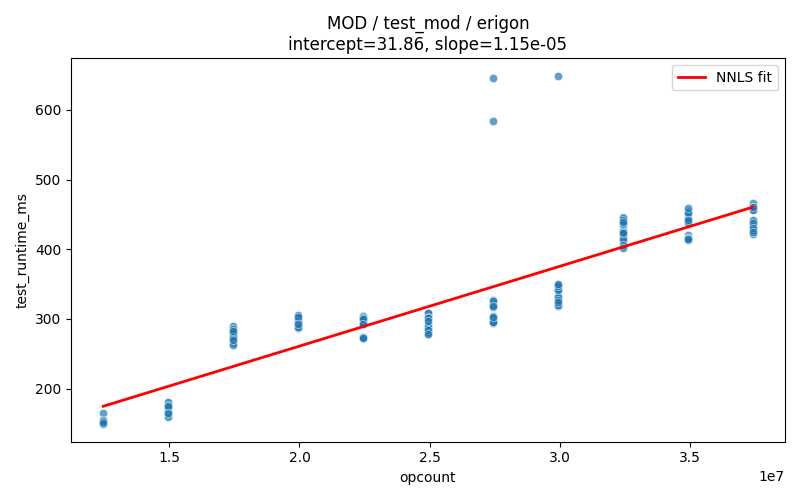

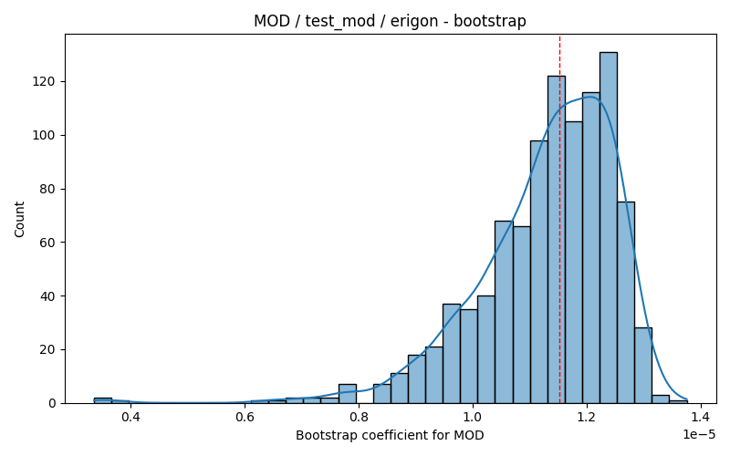

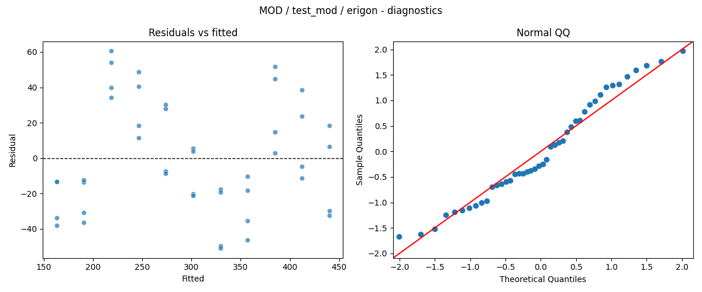

</details>

<details><summary>geth — NNLS regression summary</summary>

```
==============================================================================
                           NNLS Regression Results                            
==============================================================================
Dep. Variable:          test_runtime_ms              R-squared:          0.833
Model:                  NNLS                    Adj. R-squared:          0.833
No. Observations:       2794                              RMSE:          35.96
Df Residuals:           2792                               MAE:          30.42
Df Model:               1      
==============================================================================
                      coef     std err     P-value      [0.025      0.975]
------------------------------------------------------------------------------
         const     76.0280      2.6440       0.001     70.6372     81.0297
       opcount      0.0000      0.0000       0.001      0.0000      0.0000
==============================================================================
Notes: Non-negative least squares with bootstrap inference (1000 iterations)
==============================================================================
```

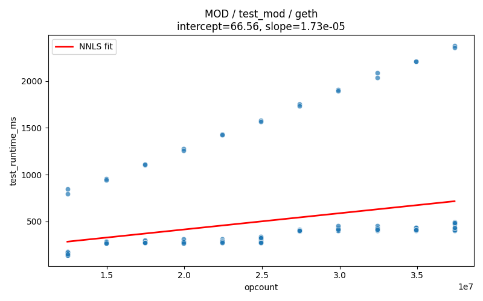

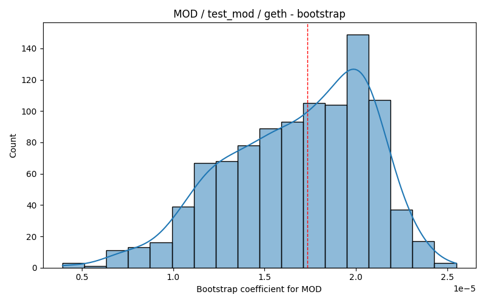

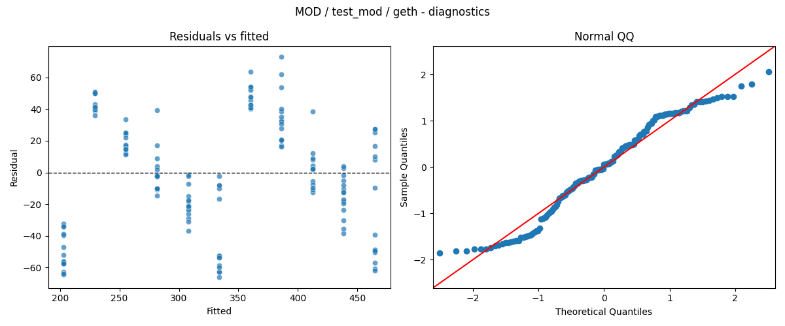

</details>

<details><summary>nethermind — NNLS regression summary</summary>

```
==============================================================================
                           NNLS Regression Results                            
==============================================================================
Dep. Variable:          test_runtime_ms              R-squared:          0.914
Model:                  NNLS                    Adj. R-squared:          0.914
No. Observations:       814                               RMSE:          24.96
Df Residuals:           812                                MAE:          19.83
Df Model:               1      
==============================================================================
                      coef     std err     P-value      [0.025      0.975]
------------------------------------------------------------------------------
         const     50.5737      2.8513       0.001     44.8627     56.4261
       opcount      0.0000      0.0000       0.001      0.0000      0.0000
==============================================================================
Notes: Non-negative least squares with bootstrap inference (1000 iterations)
==============================================================================
```

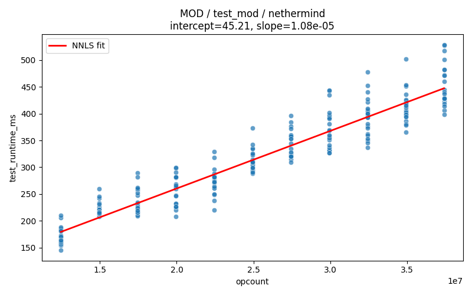

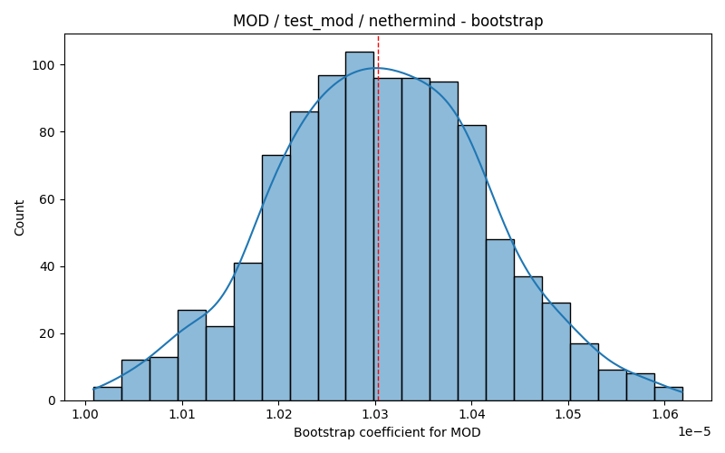

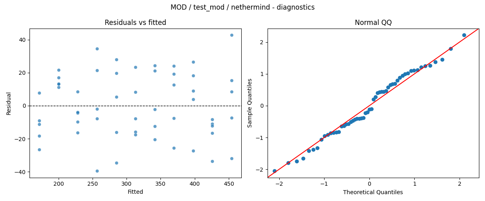

</details>

<details><summary>reth — NNLS regression summary</summary>

```
==============================================================================
                           NNLS Regression Results                            
==============================================================================
Dep. Variable:          test_runtime_ms              R-squared:          0.831
Model:                  NNLS                    Adj. R-squared:          0.830
No. Observations:       99                                RMSE:          28.59
Df Residuals:           97                                 MAE:          23.43
Df Model:               1      
==============================================================================
                      coef     std err     P-value      [0.025      0.975]
------------------------------------------------------------------------------
         const     74.8179      9.8075       0.001     55.6624     93.6979
       opcount      0.0000      0.0000       0.001      0.0000      0.0000
==============================================================================
Notes: Non-negative least squares with bootstrap inference (1000 iterations)
==============================================================================
```

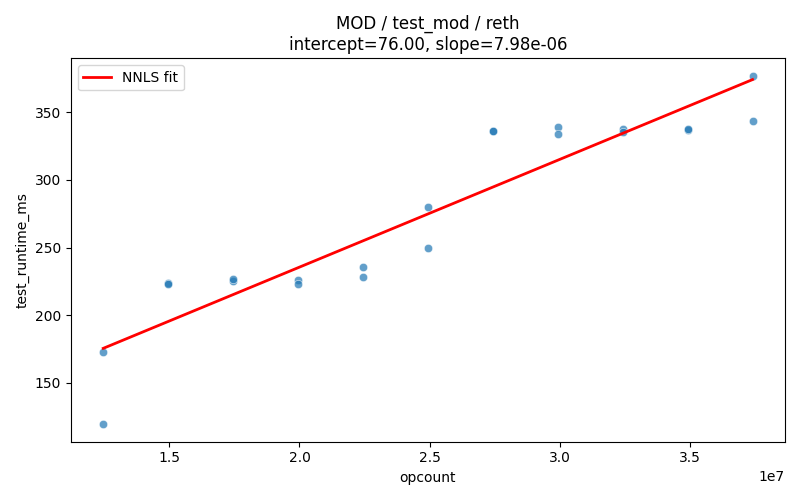

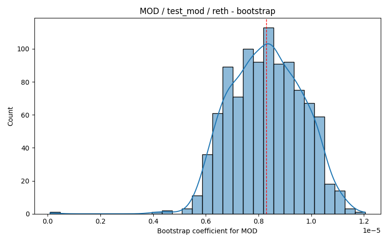

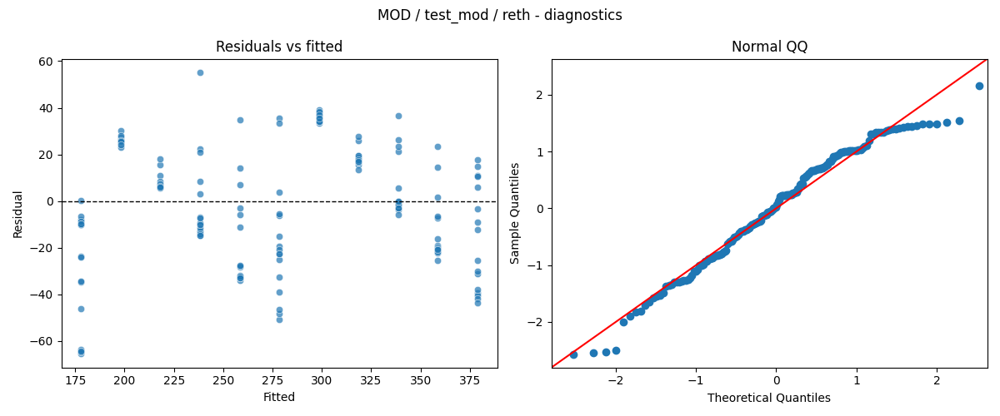

</details>

### test_mod — combo `63`

| client | nobs | R² | target_coef (ms) | p-value | 95% CI |
| --- | --- | --- | --- | --- | --- |
| `besu` | 2398 | 0.826 | 1.456e-05 | 1.00e-03 | [1.427e-05, 1.484e-05] |
| `erigon` | 165 | 0.709 | 9.143e-06 | 1.00e-03 | [8.51e-06, 9.955e-06] |
| `geth` | 2794 | 0.8322 | 8.209e-06 | 1.00e-03 | [8.053e-06, 8.359e-06] |
| `nethermind` | 814 | 0.8974 | 6.934e-06 | 1.00e-03 | [6.79e-06, 7.083e-06] |
| `reth` | 99 | 0.8596 | 6.34e-06 | 1.00e-03 | [5.802e-06, 6.885e-06] |

<details><summary>besu — NNLS regression summary</summary>

```
==============================================================================
                           NNLS Regression Results                            
==============================================================================
Dep. Variable:          test_runtime_ms              R-squared:          0.826
Model:                  NNLS                    Adj. R-squared:          0.826
No. Observations:       2398                              RMSE:          52.68
Df Residuals:           2396                               MAE:          43.55
Df Model:               1      
==============================================================================
                      coef     std err     P-value      [0.025      0.975]
------------------------------------------------------------------------------
         const     97.7356      3.7821       0.001     90.5193    105.3166
       opcount      0.0000      0.0000       0.001      0.0000      0.0000
==============================================================================
Notes: Non-negative least squares with bootstrap inference (1000 iterations)
==============================================================================
```

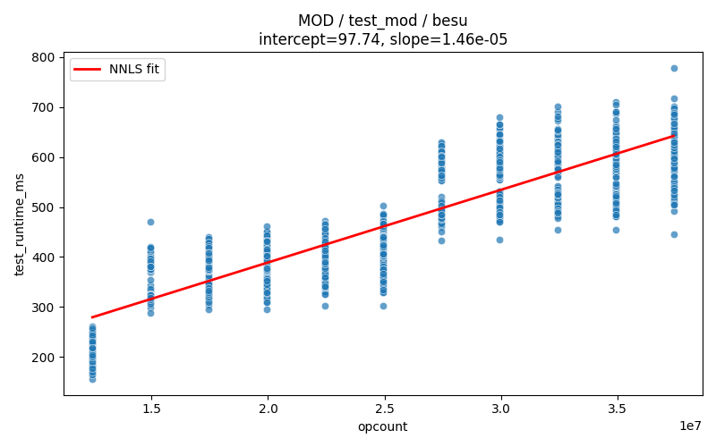

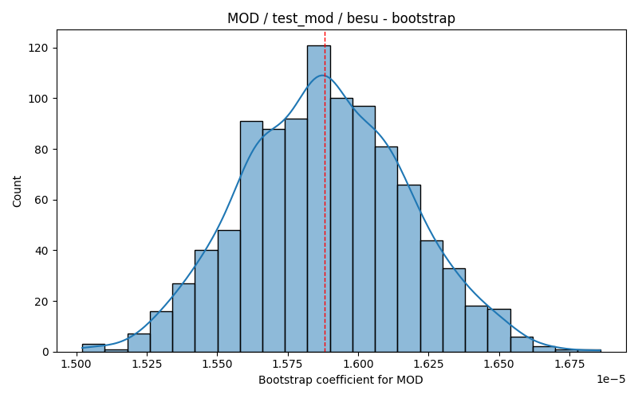

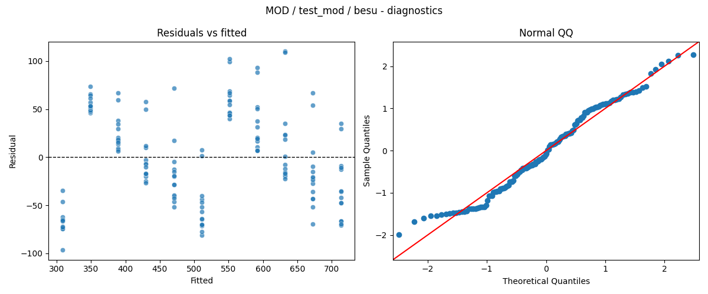

</details>

<details><summary>erigon — NNLS regression summary</summary>

```
==============================================================================
                           NNLS Regression Results                            
==============================================================================
Dep. Variable:          test_runtime_ms              R-squared:          0.709
Model:                  NNLS                    Adj. R-squared:          0.707
No. Observations:       165                               RMSE:          46.18
Df Residuals:           163                                MAE:          22.94
Df Model:               1      
==============================================================================
                      coef     std err     P-value      [0.025      0.975]
------------------------------------------------------------------------------
         const     15.2928      7.0940       0.027      0.0000     28.4891
       opcount      0.0000      0.0000       0.001      0.0000      0.0000
==============================================================================
Notes: Non-negative least squares with bootstrap inference (1000 iterations)
==============================================================================
```

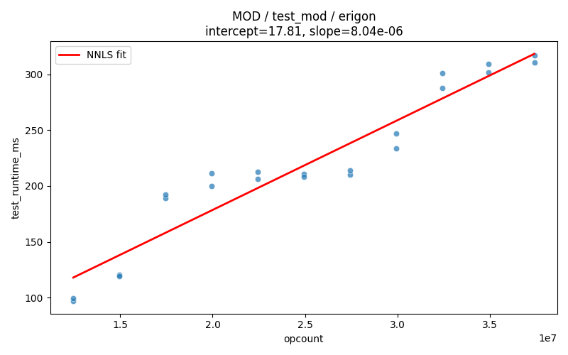

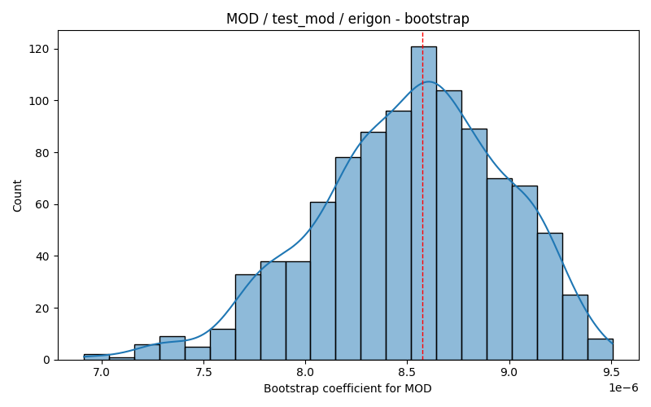

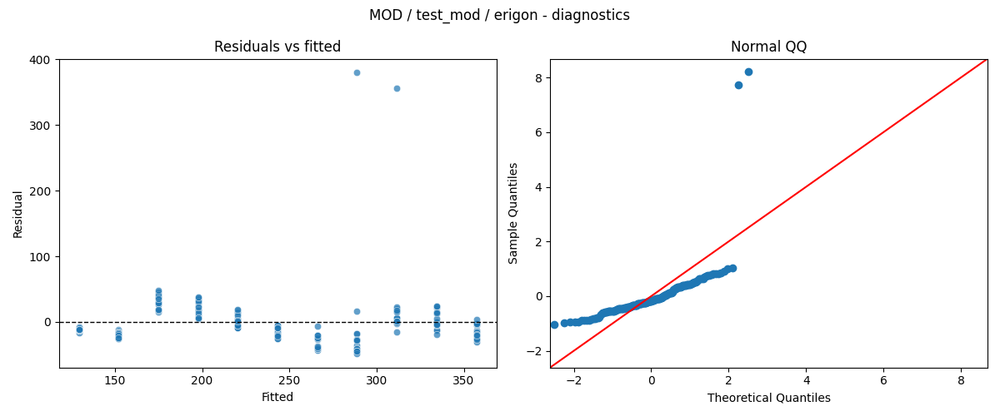

</details>

<details><summary>geth — NNLS regression summary</summary>

```
==============================================================================
                           NNLS Regression Results                            
==============================================================================
Dep. Variable:          test_runtime_ms              R-squared:          0.832
Model:                  NNLS                    Adj. R-squared:          0.832
No. Observations:       2794                              RMSE:          29.06
Df Residuals:           2792                               MAE:          24.42
Df Model:               1      
==============================================================================
                      coef     std err     P-value      [0.025      0.975]
------------------------------------------------------------------------------
         const     61.4250      2.1249       0.001     57.2615     65.7160
       opcount      0.0000      0.0000       0.001      0.0000      0.0000
==============================================================================
Notes: Non-negative least squares with bootstrap inference (1000 iterations)
==============================================================================
```

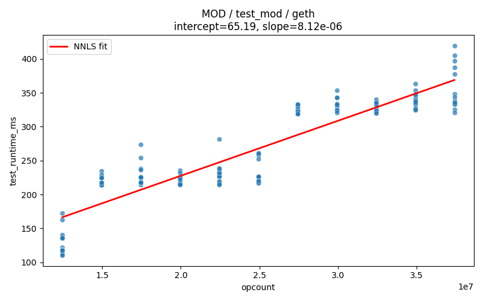

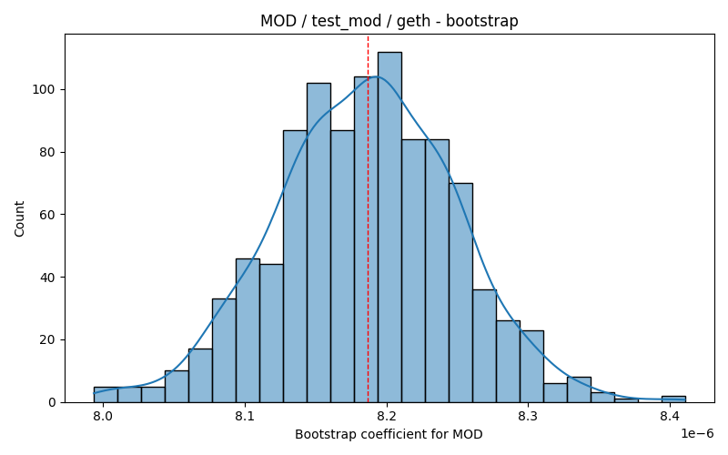

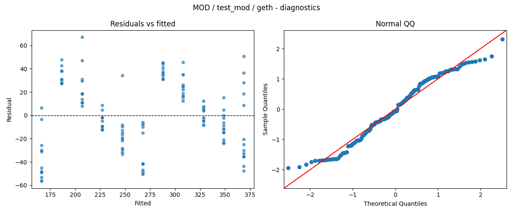

</details>

<details><summary>nethermind — NNLS regression summary</summary>

```
==============================================================================
                           NNLS Regression Results                            
==============================================================================
Dep. Variable:          test_runtime_ms              R-squared:          0.897
Model:                  NNLS                    Adj. R-squared:          0.897
No. Observations:       814                               RMSE:          18.48
Df Residuals:           812                                MAE:          12.23
Df Model:               1      
==============================================================================
                      coef     std err     P-value      [0.025      0.975]
------------------------------------------------------------------------------
         const     30.9975      1.6803       0.001     27.5353     34.2249
       opcount      0.0000      0.0000       0.001      0.0000      0.0000
==============================================================================
Notes: Non-negative least squares with bootstrap inference (1000 iterations)
==============================================================================
```

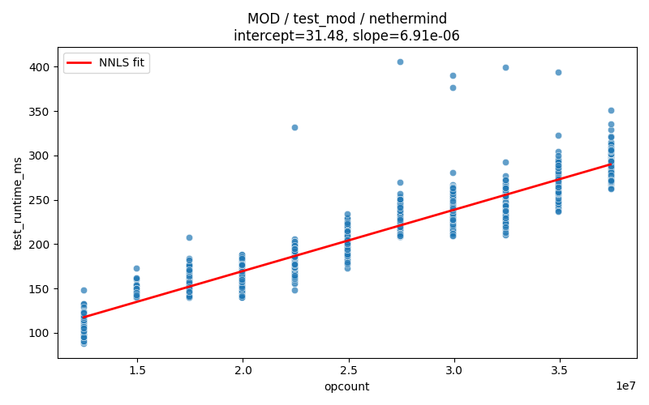

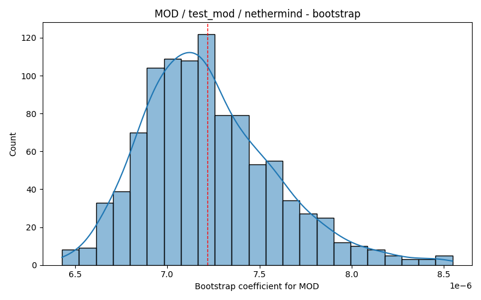

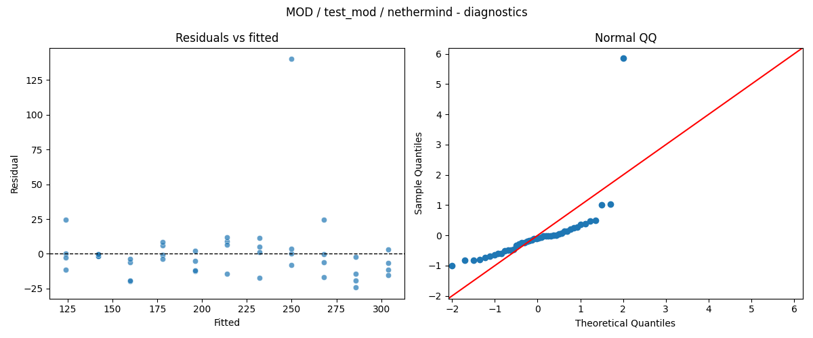

</details>

<details><summary>reth — NNLS regression summary</summary>

```
==============================================================================
                           NNLS Regression Results                            
==============================================================================
Dep. Variable:          test_runtime_ms              R-squared:          0.860
Model:                  NNLS                    Adj. R-squared:          0.858
No. Observations:       99                                RMSE:          20.20
Df Residuals:           97                                 MAE:          16.90
Df Model:               1      
==============================================================================
                      coef     std err     P-value      [0.025      0.975]
------------------------------------------------------------------------------
         const     51.8488      6.9785       0.001     37.9509     65.7563
       opcount      0.0000      0.0000       0.001      0.0000      0.0000
==============================================================================
Notes: Non-negative least squares with bootstrap inference (1000 iterations)
==============================================================================
```

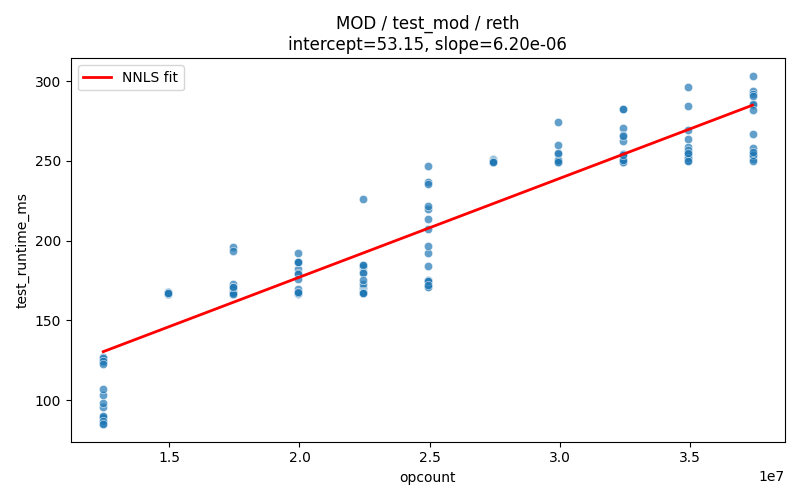

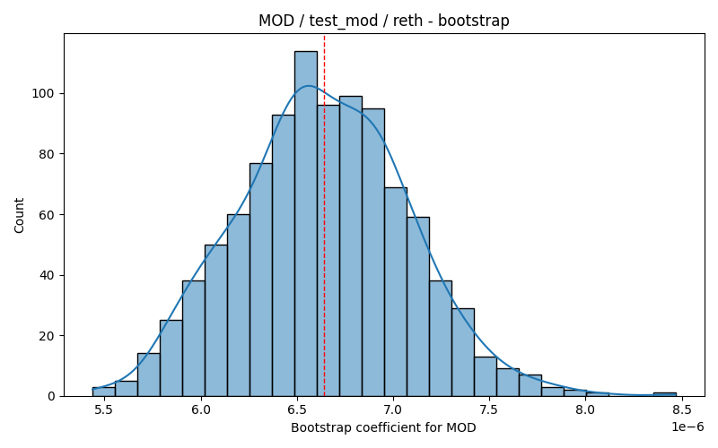

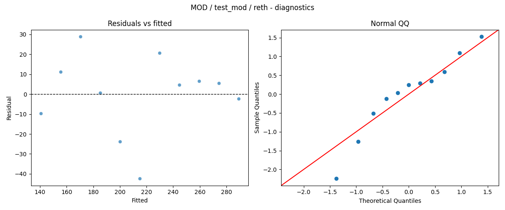

</details>

## SMOD

### test_mod — combo `127`

| client | nobs | R² | target_coef (ms) | p-value | 95% CI |
| --- | --- | --- | --- | --- | --- |
| `besu` | 2398 | 0.8492 | 2.032e-05 | 1.00e-03 | [1.997e-05, 2.065e-05] |
| `erigon` | 165 | 0.8955 | 1.281e-05 | 1.00e-03 | [1.219e-05, 1.336e-05] |
| `geth` | 2794 | 0.8308 | 1.215e-05 | 1.00e-03 | [1.191e-05, 1.236e-05] |
| `nethermind` | 814 | 0.9341 | 1.097e-05 | 1.00e-03 | [1.078e-05, 1.116e-05] |
| `reth` | 99 | 0.8675 | 7.022e-06 | 1.00e-03 | [6.457e-06, 7.574e-06] |

<details><summary>besu — NNLS regression summary</summary>

```
==============================================================================
                           NNLS Regression Results                            
==============================================================================
Dep. Variable:          test_runtime_ms              R-squared:          0.849
Model:                  NNLS                    Adj. R-squared:          0.849
No. Observations:       2398                              RMSE:          67.51
Df Residuals:           2396                               MAE:          56.59
Df Model:               1      
==============================================================================
                      coef     std err     P-value      [0.025      0.975]
------------------------------------------------------------------------------
         const    140.5895      4.7935       0.001    131.4592    150.1526
       opcount      0.0000      0.0000       0.001      0.0000      0.0000
==============================================================================
Notes: Non-negative least squares with bootstrap inference (1000 iterations)
==============================================================================
```

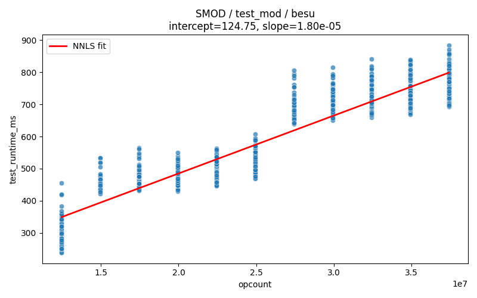

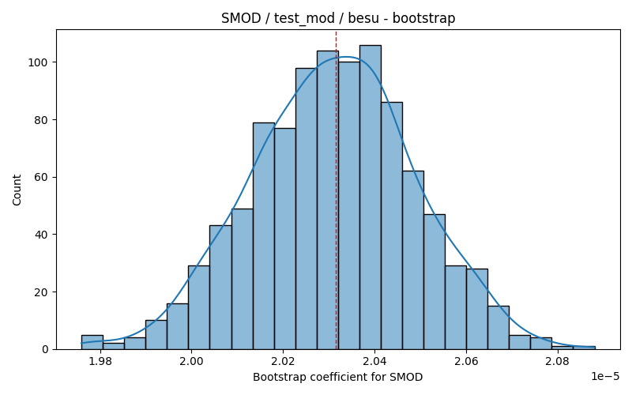

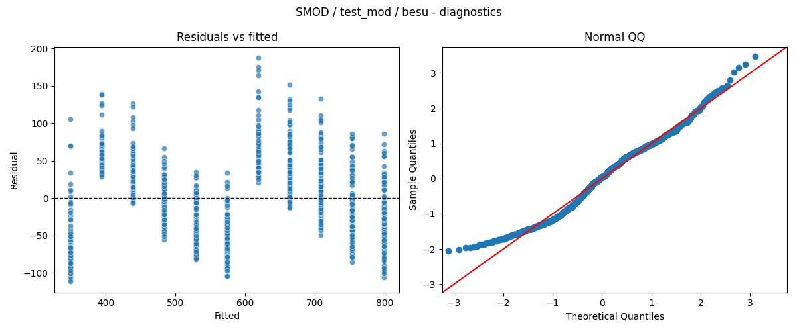

</details>

<details><summary>erigon — NNLS regression summary</summary>

```
==============================================================================
                           NNLS Regression Results                            
==============================================================================
Dep. Variable:          test_runtime_ms              R-squared:          0.895
Model:                  NNLS                    Adj. R-squared:          0.895
No. Observations:       165                               RMSE:          34.49
Df Residuals:           163                                MAE:          30.60
Df Model:               1      
==============================================================================
                      coef     std err     P-value      [0.025      0.975]
------------------------------------------------------------------------------
         const     34.1857      8.6707       0.001     18.8239     52.3283
       opcount      0.0000      0.0000       0.001      0.0000      0.0000
==============================================================================
Notes: Non-negative least squares with bootstrap inference (1000 iterations)
==============================================================================
```

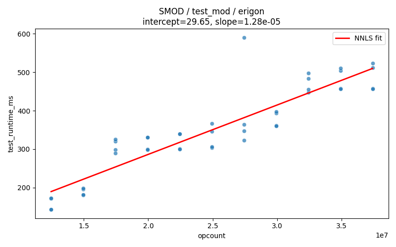

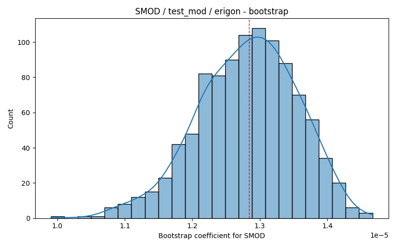

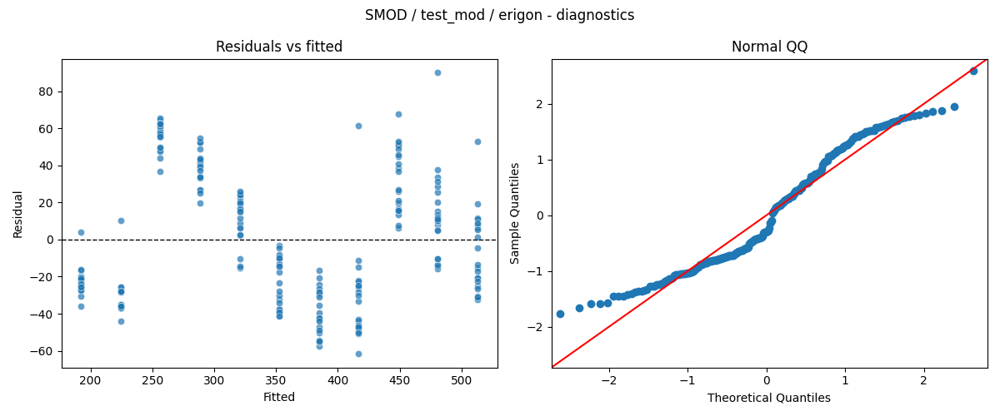

</details>

<details><summary>geth — NNLS regression summary</summary>

```
==============================================================================
                           NNLS Regression Results                            
==============================================================================
Dep. Variable:          test_runtime_ms              R-squared:          0.831
Model:                  NNLS                    Adj. R-squared:          0.831
No. Observations:       2794                              RMSE:          43.24
Df Residuals:           2792                               MAE:          36.68
Df Model:               1      
==============================================================================
                      coef     std err     P-value      [0.025      0.975]
------------------------------------------------------------------------------
         const     87.9470      3.1971       0.001     82.2150     94.4927
       opcount      0.0000      0.0000       0.001      0.0000      0.0000
==============================================================================
Notes: Non-negative least squares with bootstrap inference (1000 iterations)
==============================================================================
```

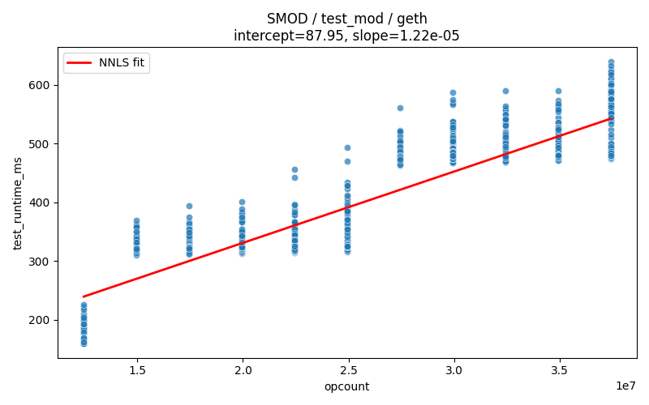

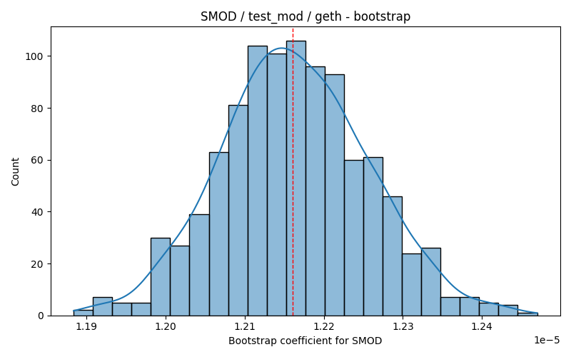

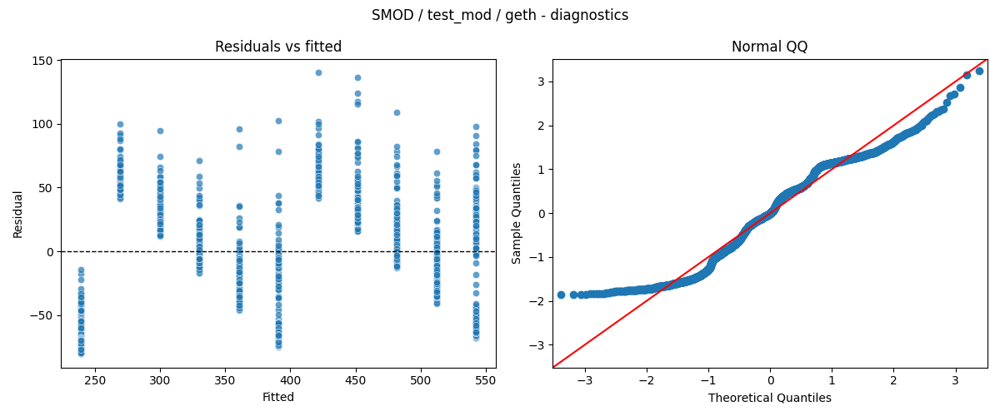

</details>

<details><summary>nethermind — NNLS regression summary</summary>

```
==============================================================================
                           NNLS Regression Results                            
==============================================================================
Dep. Variable:          test_runtime_ms              R-squared:          0.934
Model:                  NNLS                    Adj. R-squared:          0.934
No. Observations:       814                               RMSE:          22.97
Df Residuals:           812                                MAE:          18.76
Df Model:               1      
==============================================================================
                      coef     std err     P-value      [0.025      0.975]
------------------------------------------------------------------------------
         const     50.9834      2.4721       0.001     46.0341     55.9100
       opcount      0.0000      0.0000       0.001      0.0000      0.0000
==============================================================================
Notes: Non-negative least squares with bootstrap inference (1000 iterations)
==============================================================================
```

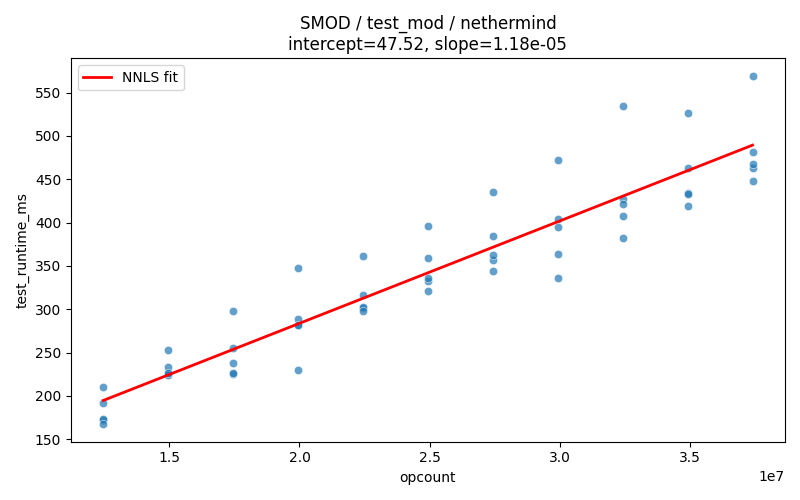

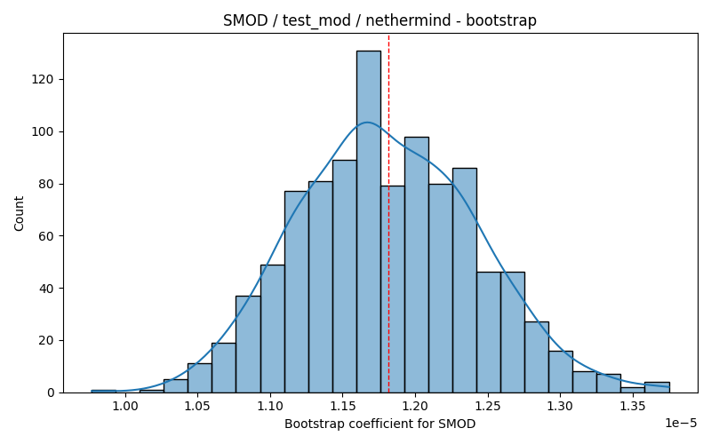

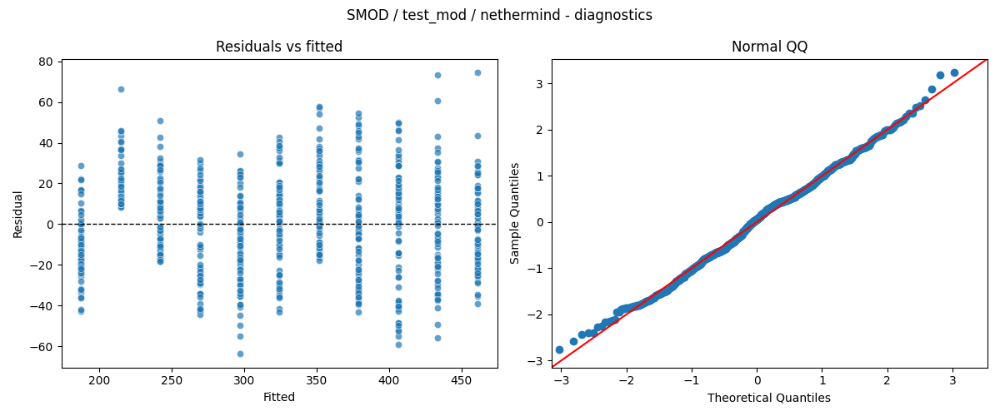

</details>

<details><summary>reth — NNLS regression summary</summary>

```
==============================================================================
                           NNLS Regression Results                            
==============================================================================
Dep. Variable:          test_runtime_ms              R-squared:          0.867
Model:                  NNLS                    Adj. R-squared:          0.866
No. Observations:       99                                RMSE:          21.64
Df Residuals:           97                                 MAE:          17.28
Df Model:               1      
==============================================================================
                      coef     std err     P-value      [0.025      0.975]
------------------------------------------------------------------------------
         const     56.1200      7.9813       0.001     40.9087     72.0673
       opcount      0.0000      0.0000       0.001      0.0000      0.0000
==============================================================================
Notes: Non-negative least squares with bootstrap inference (1000 iterations)
==============================================================================
```

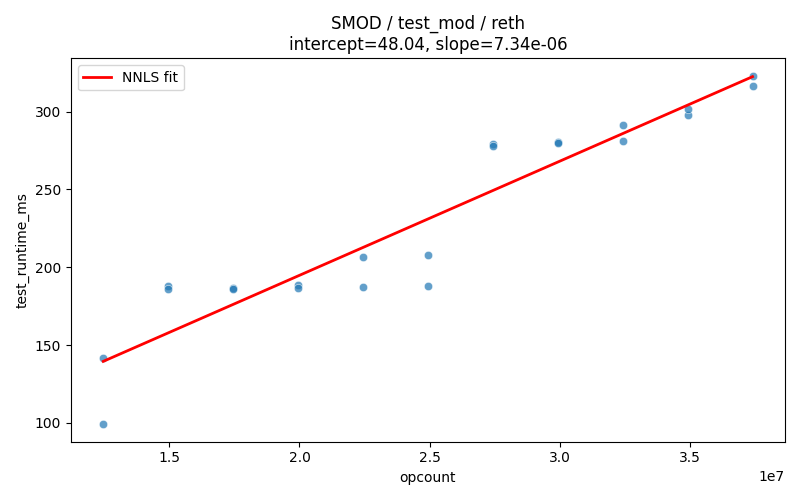

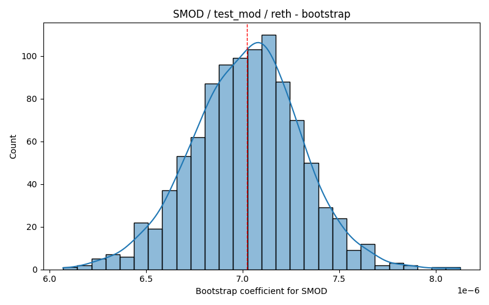

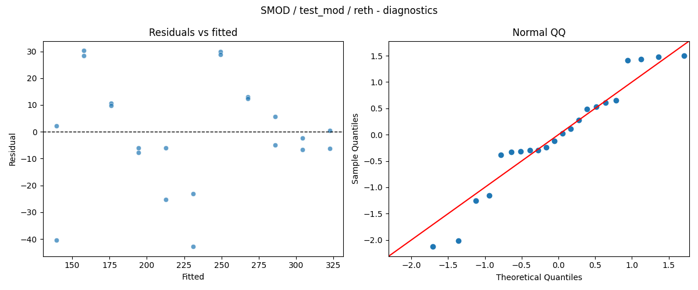

</details>

### test_mod — combo `191`

| client | nobs | R² | target_coef (ms) | p-value | 95% CI |
| --- | --- | --- | --- | --- | --- |
| `besu` | 2398 | 0.8337 | 1.888e-05 | 1.00e-03 | [1.855e-05, 1.922e-05] |
| `erigon` | 165 | 0.8942 | 1.253e-05 | 1.00e-03 | [1.192e-05, 1.306e-05] |
| `geth` | 2794 | 0.8309 | 1.155e-05 | 1.00e-03 | [1.133e-05, 1.175e-05] |
| `nethermind` | 814 | 0.9163 | 1.229e-05 | 1.00e-03 | [1.203e-05, 1.256e-05] |
| `reth` | 99 | 0.8589 | 1.058e-05 | 1.00e-03 | [9.658e-06, 1.152e-05] |

<details><summary>besu — NNLS regression summary</summary>

```
==============================================================================
                           NNLS Regression Results                            
==============================================================================
Dep. Variable:          test_runtime_ms              R-squared:          0.834
Model:                  NNLS                    Adj. R-squared:          0.834
No. Observations:       2398                              RMSE:          66.48
Df Residuals:           2396                               MAE:          55.46
Df Model:               1      
==============================================================================
                      coef     std err     P-value      [0.025      0.975]
------------------------------------------------------------------------------
         const    134.0980      4.5839       0.001    125.1145    143.0960
       opcount      0.0000      0.0000       0.001      0.0000      0.0000
==============================================================================
Notes: Non-negative least squares with bootstrap inference (1000 iterations)
==============================================================================
```

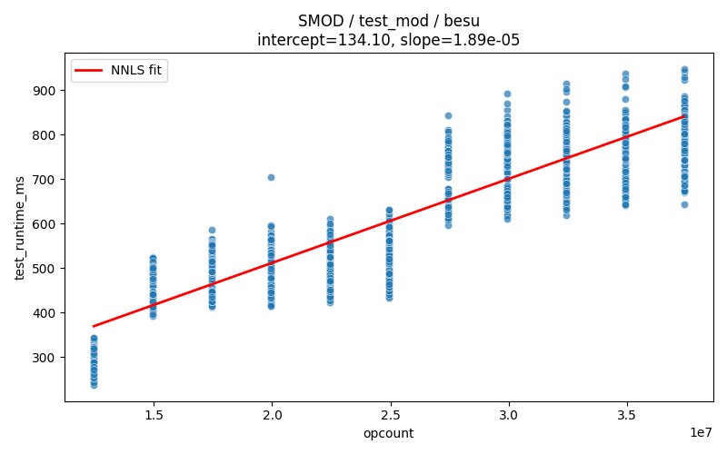

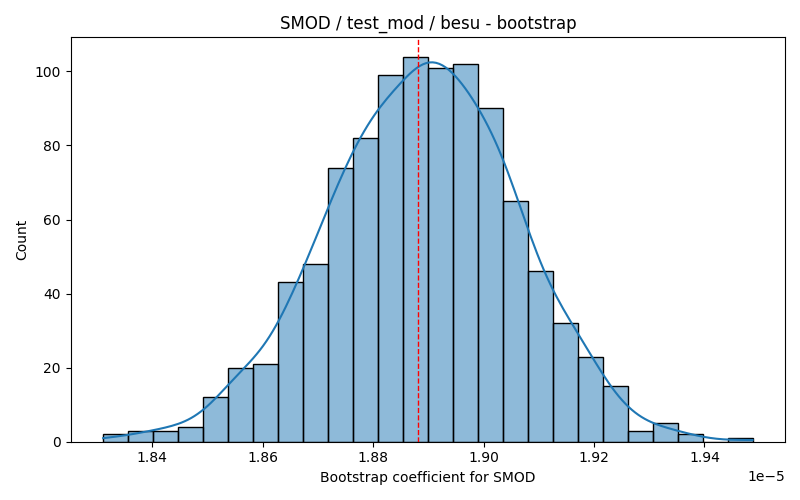

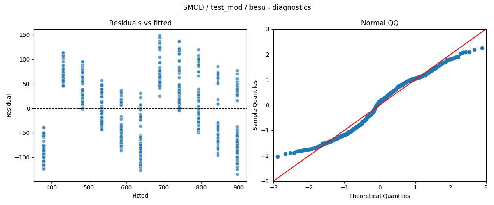

</details>

<details><summary>erigon — NNLS regression summary</summary>

```
==============================================================================
                           NNLS Regression Results                            
==============================================================================
Dep. Variable:          test_runtime_ms              R-squared:          0.894
Model:                  NNLS                    Adj. R-squared:          0.894
No. Observations:       165                               RMSE:          34.00
Df Residuals:           163                                MAE:          29.91
Df Model:               1      
==============================================================================
                      coef     std err     P-value      [0.025      0.975]
------------------------------------------------------------------------------
         const     32.6847      8.2637       0.001     17.3216     51.0924
       opcount      0.0000      0.0000       0.001      0.0000      0.0000
==============================================================================
Notes: Non-negative least squares with bootstrap inference (1000 iterations)
==============================================================================
```

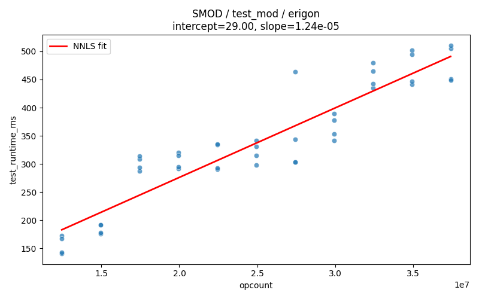

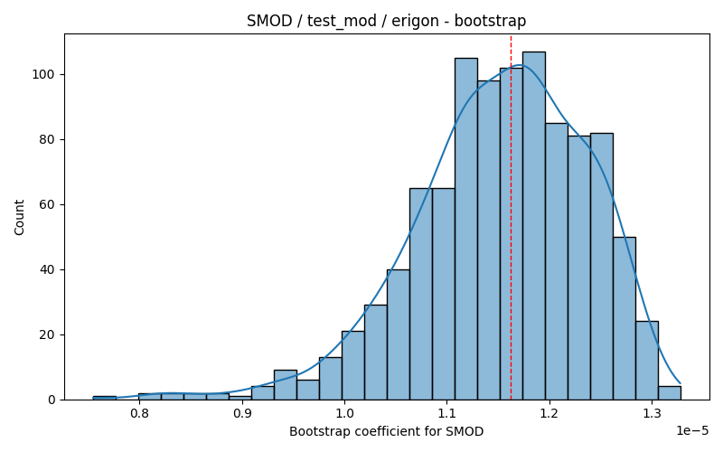

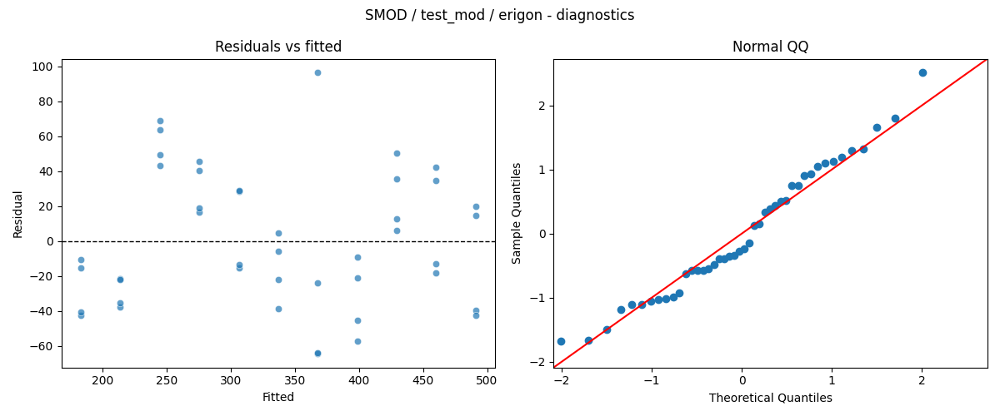

</details>

<details><summary>geth — NNLS regression summary</summary>

```
==============================================================================
                           NNLS Regression Results                            
==============================================================================
Dep. Variable:          test_runtime_ms              R-squared:          0.831
Model:                  NNLS                    Adj. R-squared:          0.831
No. Observations:       2794                              RMSE:          41.08
Df Residuals:           2792                               MAE:          34.82
Df Model:               1      
==============================================================================
                      coef     std err     P-value      [0.025      0.975]
------------------------------------------------------------------------------
         const     85.8233      2.8934       0.001     80.4034     91.7951
       opcount      0.0000      0.0000       0.001      0.0000      0.0000
==============================================================================
Notes: Non-negative least squares with bootstrap inference (1000 iterations)
==============================================================================
```

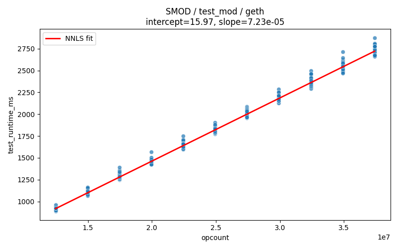

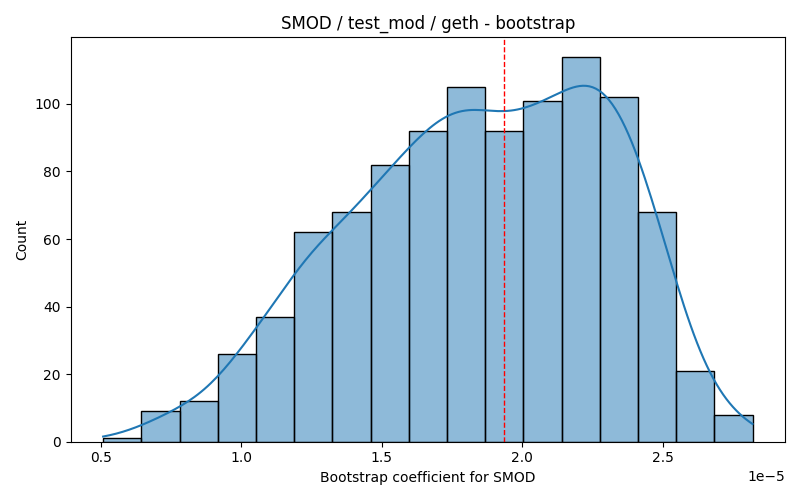

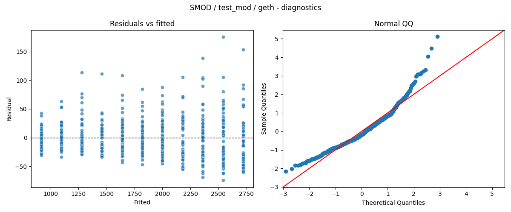

</details>

<details><summary>nethermind — NNLS regression summary</summary>

```
==============================================================================
                           NNLS Regression Results                            
==============================================================================
Dep. Variable:          test_runtime_ms              R-squared:          0.916
Model:                  NNLS                    Adj. R-squared:          0.916
No. Observations:       814                               RMSE:          29.29
Df Residuals:           812                                MAE:          23.27
Df Model:               1      
==============================================================================
                      coef     std err     P-value      [0.025      0.975]
------------------------------------------------------------------------------
         const     57.7332      3.3925       0.001     51.4116     64.3754
       opcount      0.0000      0.0000       0.001      0.0000      0.0000
==============================================================================
Notes: Non-negative least squares with bootstrap inference (1000 iterations)
==============================================================================
```

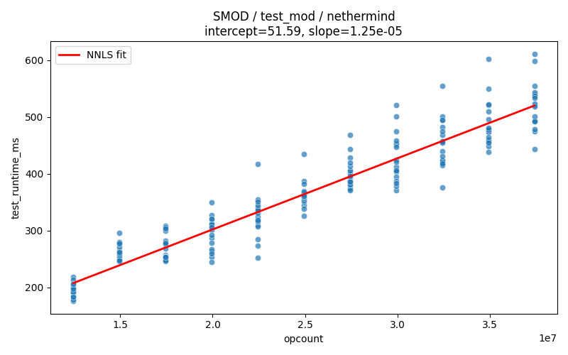

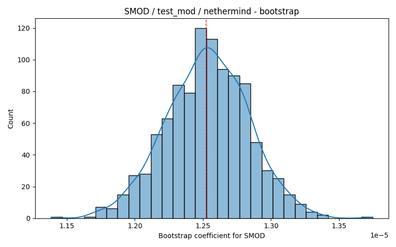

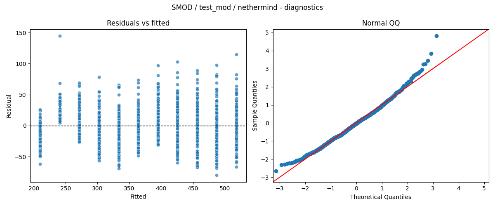

</details>

<details><summary>reth — NNLS regression summary</summary>

```
==============================================================================
                           NNLS Regression Results                            
==============================================================================
Dep. Variable:          test_runtime_ms              R-squared:          0.859
Model:                  NNLS                    Adj. R-squared:          0.857
No. Observations:       99                                RMSE:          33.81
Df Residuals:           97                                 MAE:          28.12
Df Model:               1      
==============================================================================
                      coef     std err     P-value      [0.025      0.975]
------------------------------------------------------------------------------
         const     66.7033     13.2193       0.001     40.6144     94.4093
       opcount      0.0000      0.0000       0.001      0.0000      0.0000
==============================================================================
Notes: Non-negative least squares with bootstrap inference (1000 iterations)
==============================================================================
```

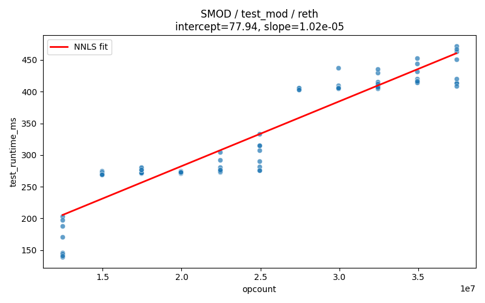

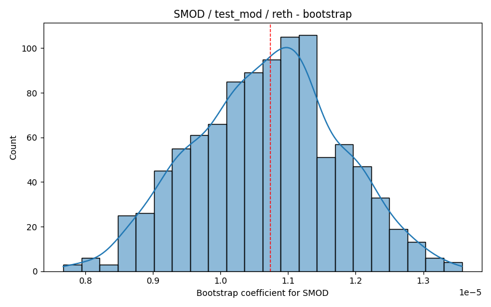


</details>

### test_mod — combo `255`

| client | nobs | R² | target_coef (ms) | p-value | 95% CI |
| --- | --- | --- | --- | --- | --- |
| `besu` | 2398 | 0.8181 | 1.544e-05 | 1.00e-03 | [1.515e-05, 1.573e-05] |
| `erigon` | 165 | 0.9018 | 1.169e-05 | 1.00e-03 | [1.114e-05, 1.219e-05] |
| `geth` | 2794 | 0.8307 | 1.029e-05 | 1.00e-03 | [1.009e-05, 1.048e-05] |
| `nethermind` | 814 | 0.934 | 1.11e-05 | 1.00e-03 | [1.092e-05, 1.13e-05] |
| `reth` | 99 | 0.8422 | 8.753e-06 | 1.00e-03 | [7.994e-06, 9.546e-06] |

<details><summary>besu — NNLS regression summary</summary>

```
==============================================================================
                           NNLS Regression Results                            
==============================================================================
Dep. Variable:          test_runtime_ms              R-squared:          0.818
Model:                  NNLS                    Adj. R-squared:          0.818
No. Observations:       2398                              RMSE:          57.40
Df Residuals:           2396                               MAE:          47.46
Df Model:               1      
==============================================================================
                      coef     std err     P-value      [0.025      0.975]
------------------------------------------------------------------------------
         const    105.9761      3.9891       0.001     98.1323    113.7453
       opcount      0.0000      0.0000       0.001      0.0000      0.0000
==============================================================================
Notes: Non-negative least squares with bootstrap inference (1000 iterations)
==============================================================================
```

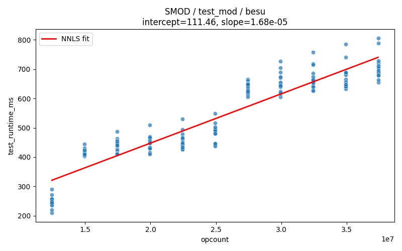

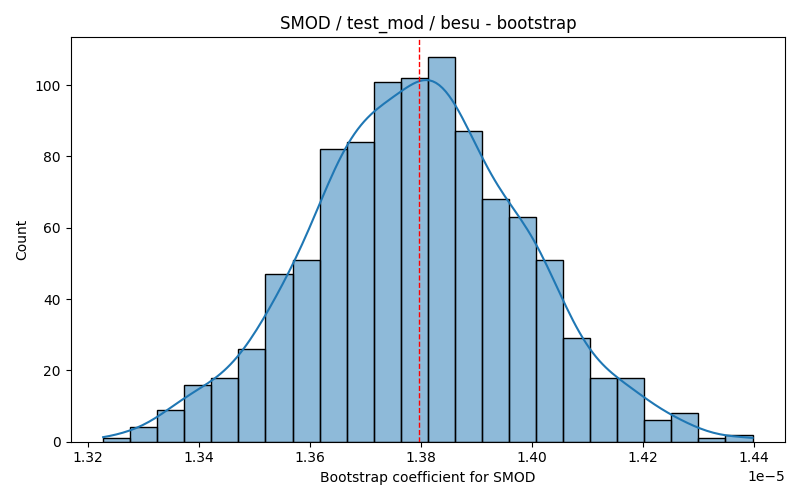

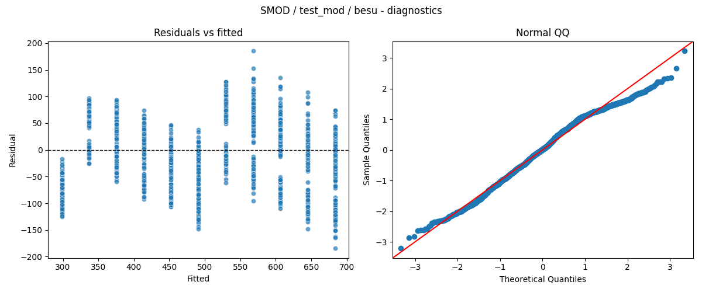

</details>

<details><summary>erigon — NNLS regression summary</summary>

```
==============================================================================
                           NNLS Regression Results                            
==============================================================================
Dep. Variable:          test_runtime_ms              R-squared:          0.902
Model:                  NNLS                    Adj. R-squared:          0.901
No. Observations:       165                               RMSE:          30.42
Df Residuals:           163                                MAE:          27.03
Df Model:               1      
==============================================================================
                      coef     std err     P-value      [0.025      0.975]
------------------------------------------------------------------------------
         const     28.0193      7.7164       0.001     13.7733     43.6199
       opcount      0.0000      0.0000       0.001      0.0000      0.0000
==============================================================================
Notes: Non-negative least squares with bootstrap inference (1000 iterations)
==============================================================================
```

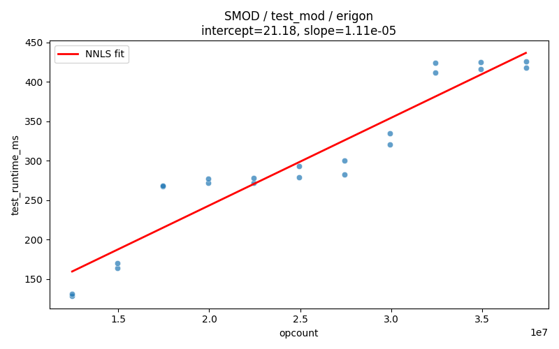

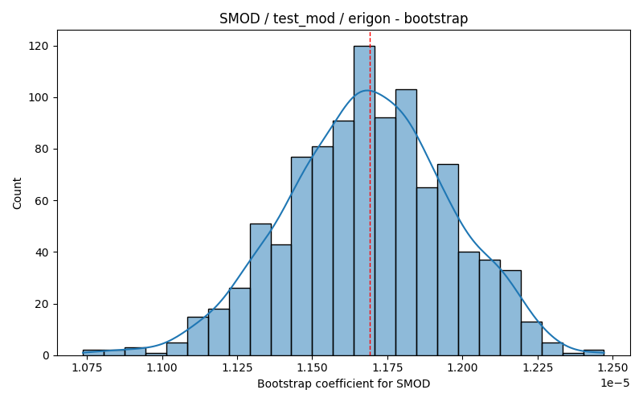

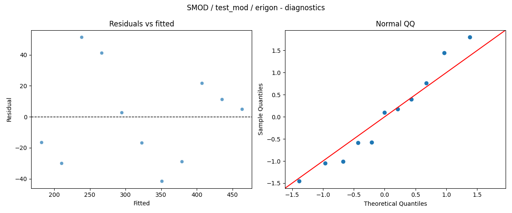

</details>

<details><summary>geth — NNLS regression summary</summary>

```
==============================================================================
                           NNLS Regression Results                            
==============================================================================
Dep. Variable:          test_runtime_ms              R-squared:          0.831
Model:                  NNLS                    Adj. R-squared:          0.831
No. Observations:       2794                              RMSE:          36.63
Df Residuals:           2792                               MAE:          30.82
Df Model:               1      
==============================================================================
                      coef     std err     P-value      [0.025      0.975]
------------------------------------------------------------------------------
         const     78.6174      2.6603       0.001     73.3965     84.0059
       opcount      0.0000      0.0000       0.001      0.0000      0.0000
==============================================================================
Notes: Non-negative least squares with bootstrap inference (1000 iterations)
==============================================================================
```

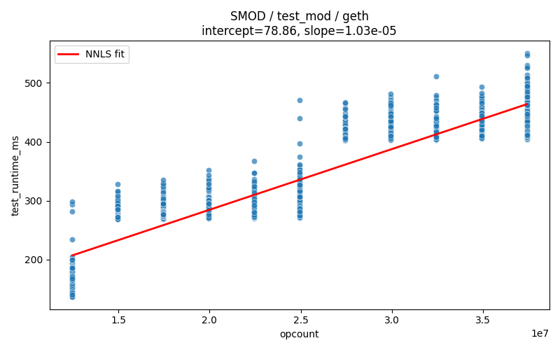

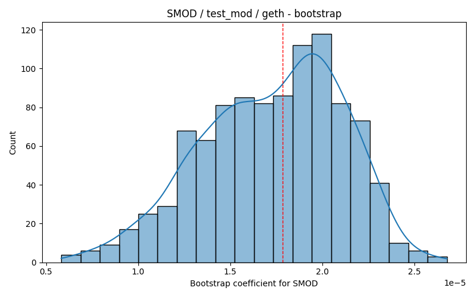

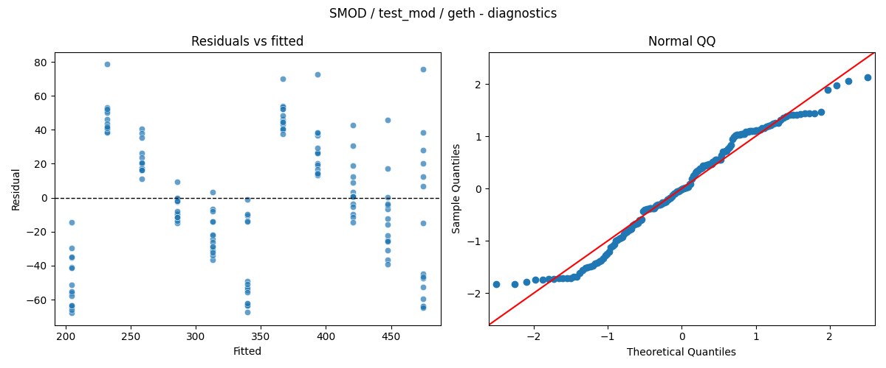

</details>

<details><summary>nethermind — NNLS regression summary</summary>

```
==============================================================================
                           NNLS Regression Results                            
==============================================================================
Dep. Variable:          test_runtime_ms              R-squared:          0.934
Model:                  NNLS                    Adj. R-squared:          0.934
No. Observations:       814                               RMSE:          23.27
Df Residuals:           812                                MAE:          18.77
Df Model:               1      
==============================================================================
                      coef     std err     P-value      [0.025      0.975]
------------------------------------------------------------------------------
         const     49.6608      2.5222       0.001     44.4744     54.1289
       opcount      0.0000      0.0000       0.001      0.0000      0.0000
==============================================================================
Notes: Non-negative least squares with bootstrap inference (1000 iterations)
==============================================================================
```

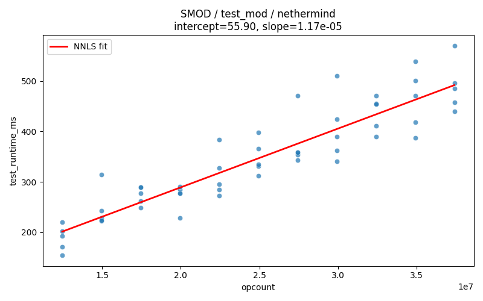

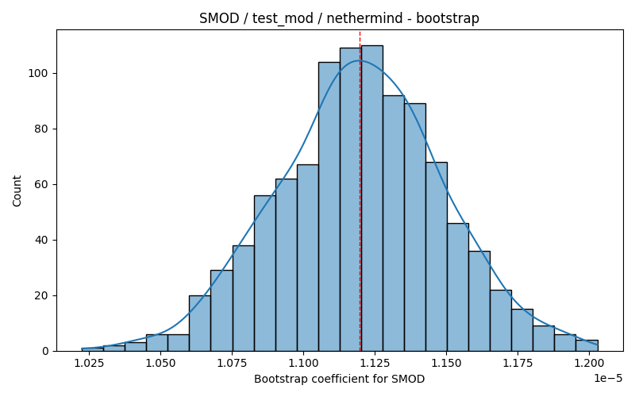

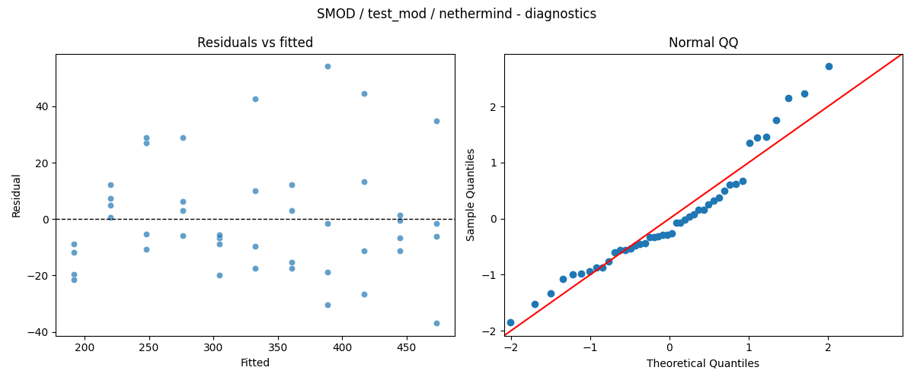

</details>

<details><summary>reth — NNLS regression summary</summary>

```
==============================================================================
                           NNLS Regression Results                            
==============================================================================
Dep. Variable:          test_runtime_ms              R-squared:          0.842
Model:                  NNLS                    Adj. R-squared:          0.841
No. Observations:       99                                RMSE:          29.87
Df Residuals:           97                                 MAE:          25.14
Df Model:               1      
==============================================================================
                      coef     std err     P-value      [0.025      0.975]
------------------------------------------------------------------------------
         const     69.8202     10.8710       0.001     48.1953     90.9060
       opcount      0.0000      0.0000       0.001      0.0000      0.0000
==============================================================================
Notes: Non-negative least squares with bootstrap inference (1000 iterations)
==============================================================================
```

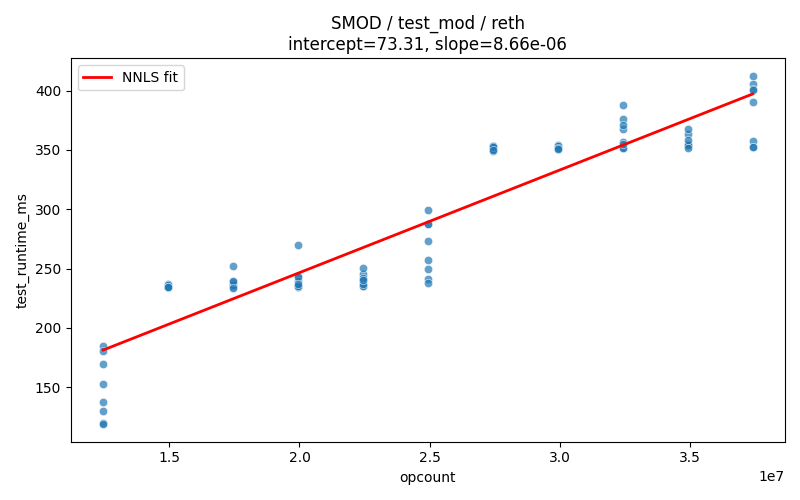

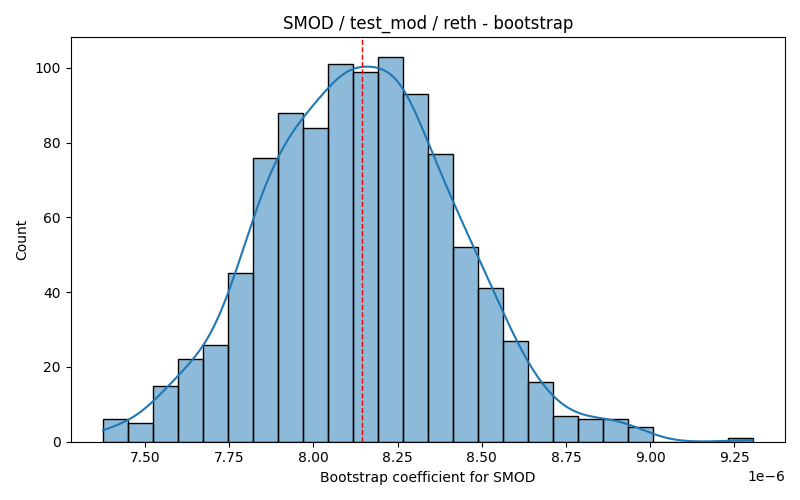

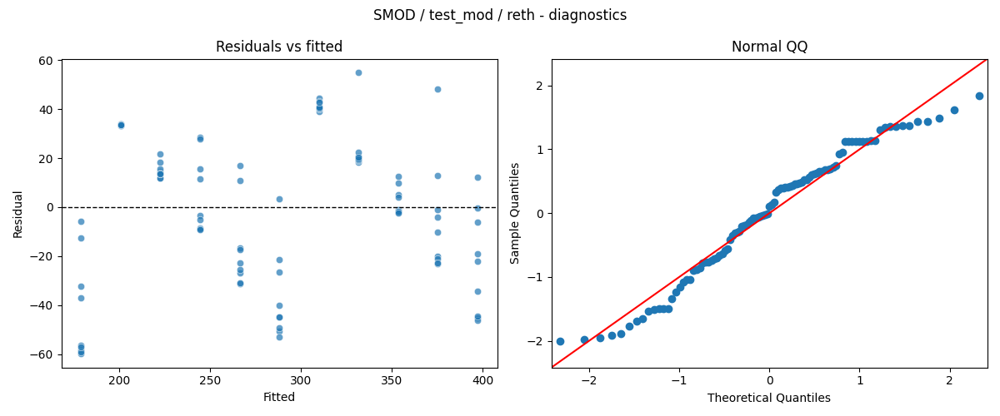

</details>

### test_mod — combo `63`

| client | nobs | R² | target_coef (ms) | p-value | 95% CI |
| --- | --- | --- | --- | --- | --- |
| `besu` | 2398 | 0.818 | 1.555e-05 | 1.00e-03 | [1.526e-05, 1.583e-05] |
| `erigon` | 165 | 0.8914 | 9.292e-06 | 1.00e-03 | [8.769e-06, 9.83e-06] |
| `geth` | 2794 | 0.8279 | 8.615e-06 | 1.00e-03 | [8.46e-06, 8.773e-06] |
| `nethermind` | 814 | 0.9213 | 8.118e-06 | 1.00e-03 | [7.953e-06, 8.276e-06] |
| `reth` | 99 | 0.8655 | 6.348e-06 | 1.00e-03 | [5.832e-06, 6.881e-06] |

<details><summary>besu — NNLS regression summary</summary>

```
==============================================================================
                           NNLS Regression Results                            
==============================================================================
Dep. Variable:          test_runtime_ms              R-squared:          0.818
Model:                  NNLS                    Adj. R-squared:          0.818
No. Observations:       2398                              RMSE:          57.81
Df Residuals:           2396                               MAE:          47.41
Df Model:               1      
==============================================================================
                      coef     std err     P-value      [0.025      0.975]
------------------------------------------------------------------------------
         const    115.0369      3.9414       0.001    107.3970    122.8392
       opcount      0.0000      0.0000       0.001      0.0000      0.0000
==============================================================================
Notes: Non-negative least squares with bootstrap inference (1000 iterations)
==============================================================================
```

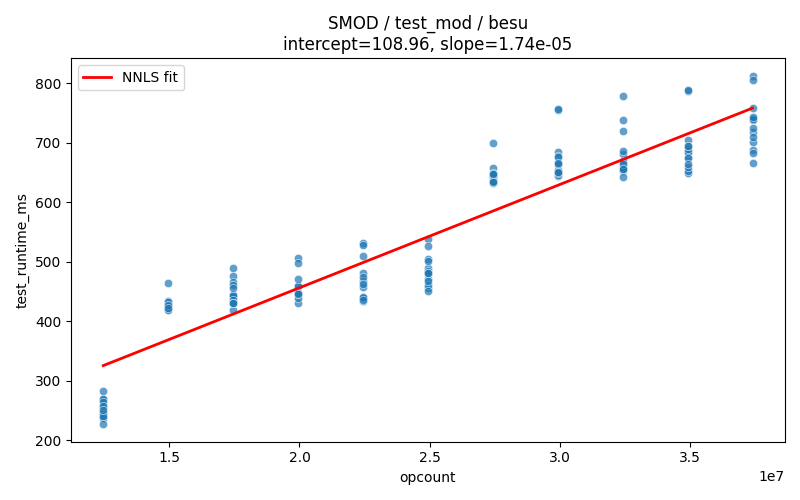

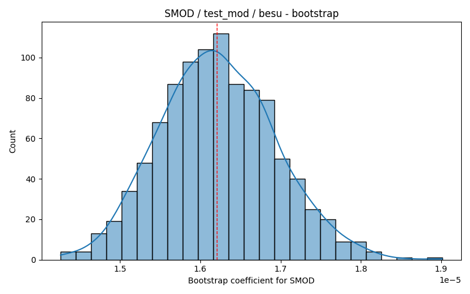

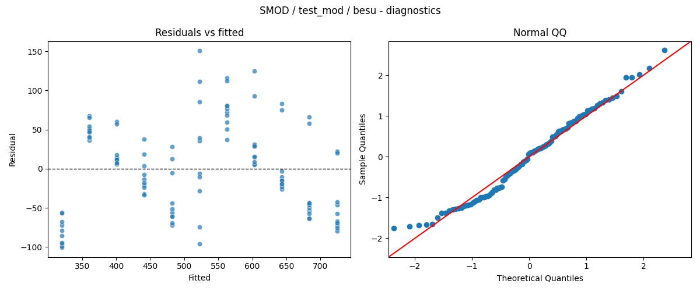

</details>

<details><summary>erigon — NNLS regression summary</summary>

```
==============================================================================
                           NNLS Regression Results                            
==============================================================================
Dep. Variable:          test_runtime_ms              R-squared:          0.891
Model:                  NNLS                    Adj. R-squared:          0.891
No. Observations:       165                               RMSE:          25.57
Df Residuals:           163                                MAE:          20.78
Df Model:               1      
==============================================================================
                      coef     std err     P-value      [0.025      0.975]
------------------------------------------------------------------------------
         const     17.7478      6.5690       0.001      4.9820     31.1617
       opcount      0.0000      0.0000       0.001      0.0000      0.0000
==============================================================================
Notes: Non-negative least squares with bootstrap inference (1000 iterations)
==============================================================================
```

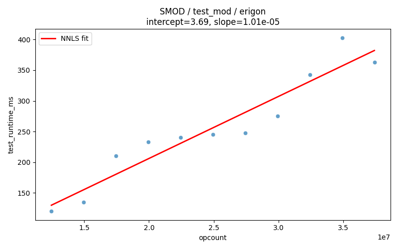

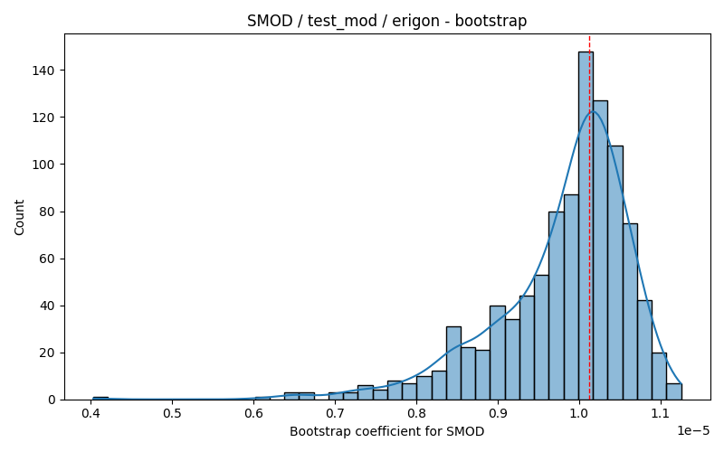

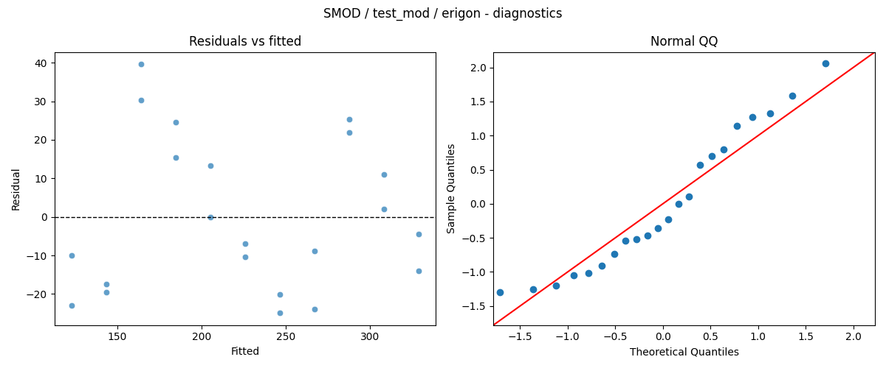

</details>

<details><summary>geth — NNLS regression summary</summary>

```
==============================================================================
                           NNLS Regression Results                            
==============================================================================
Dep. Variable:          test_runtime_ms              R-squared:          0.828
Model:                  NNLS                    Adj. R-squared:          0.828
No. Observations:       2794                              RMSE:          30.97
Df Residuals:           2792                               MAE:          25.88
Df Model:               1      
==============================================================================
                      coef     std err     P-value      [0.025      0.975]
------------------------------------------------------------------------------
         const     67.7575      2.1484       0.001     63.6459     71.7916
       opcount      0.0000      0.0000       0.001      0.0000      0.0000
==============================================================================
Notes: Non-negative least squares with bootstrap inference (1000 iterations)
==============================================================================
```

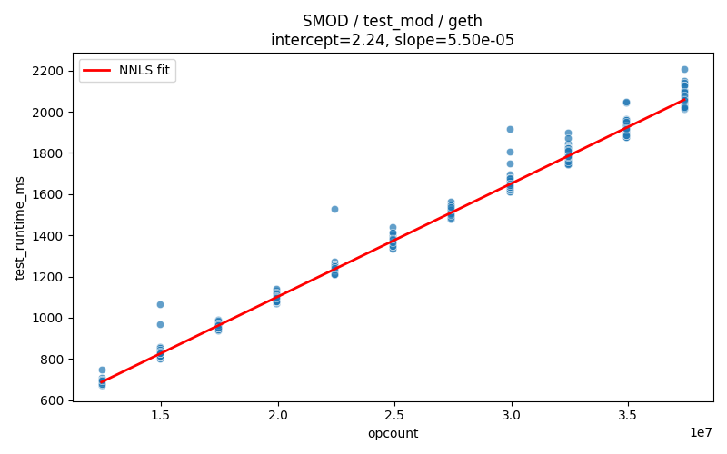

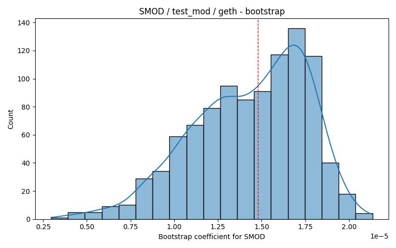

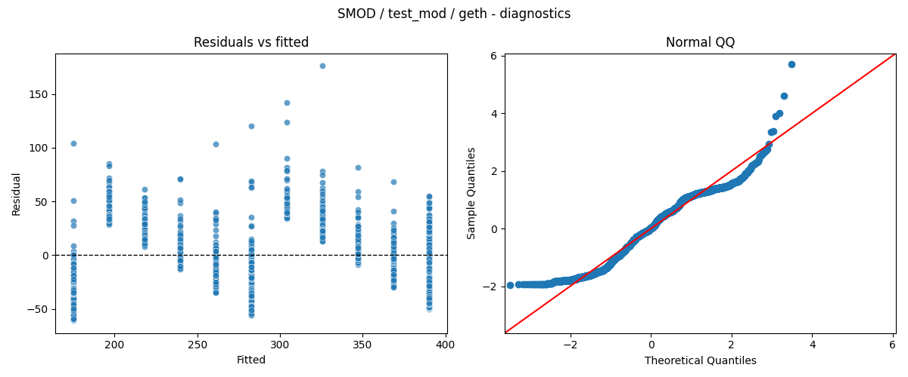

</details>

<details><summary>nethermind — NNLS regression summary</summary>

```
==============================================================================
                           NNLS Regression Results                            
==============================================================================
Dep. Variable:          test_runtime_ms              R-squared:          0.921
Model:                  NNLS                    Adj. R-squared:          0.921
No. Observations:       814                               RMSE:          18.71
Df Residuals:           812                                MAE:          13.67
Df Model:               1      
==============================================================================
                      coef     std err     P-value      [0.025      0.975]
------------------------------------------------------------------------------
         const     34.9794      1.8916       0.001     31.4922     38.7875
       opcount      0.0000      0.0000       0.001      0.0000      0.0000
==============================================================================
Notes: Non-negative least squares with bootstrap inference (1000 iterations)
==============================================================================
```

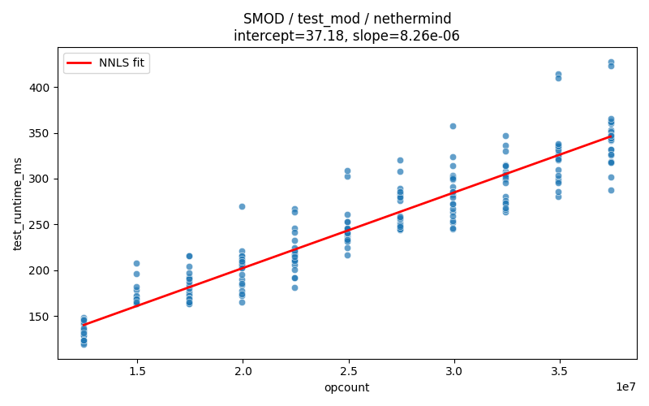

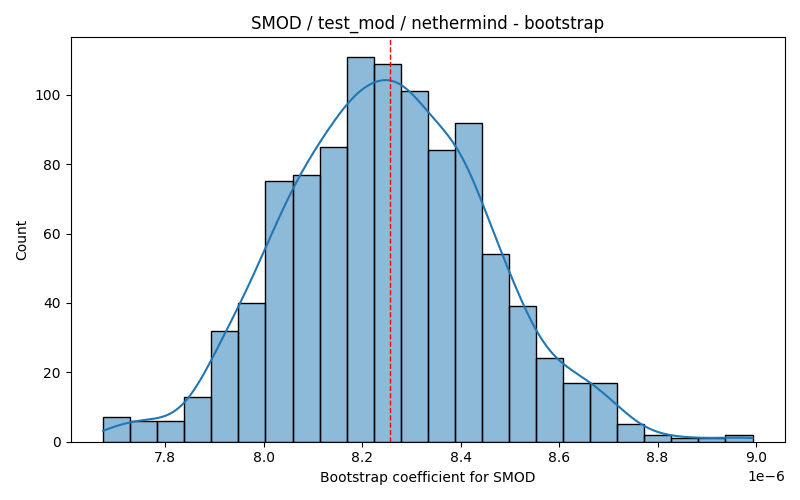

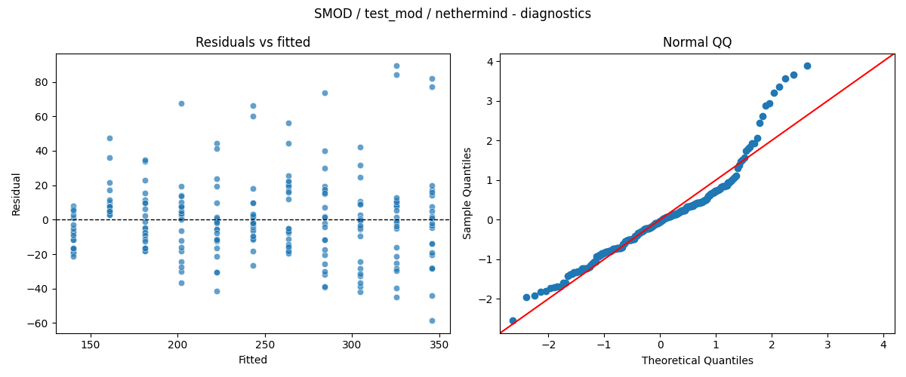

</details>

<details><summary>reth — NNLS regression summary</summary>

```
==============================================================================
                           NNLS Regression Results                            
==============================================================================
Dep. Variable:          test_runtime_ms              R-squared:          0.866
Model:                  NNLS                    Adj. R-squared:          0.864
No. Observations:       99                                RMSE:          19.73
Df Residuals:           97                                 MAE:          16.36
Df Model:               1      
==============================================================================
                      coef     std err     P-value      [0.025      0.975]
------------------------------------------------------------------------------
         const     51.7572      7.3986       0.001     37.5205     65.8323
       opcount      0.0000      0.0000       0.001      0.0000      0.0000
==============================================================================
Notes: Non-negative least squares with bootstrap inference (1000 iterations)
==============================================================================
```

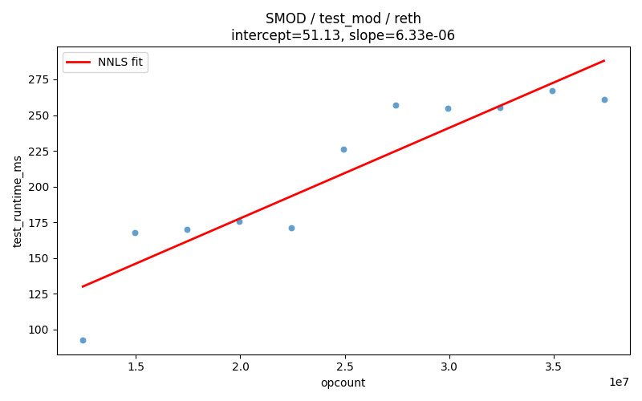

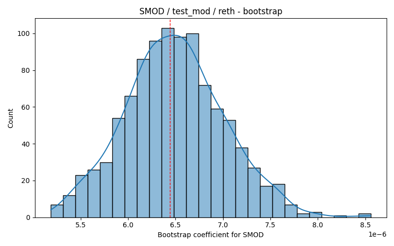

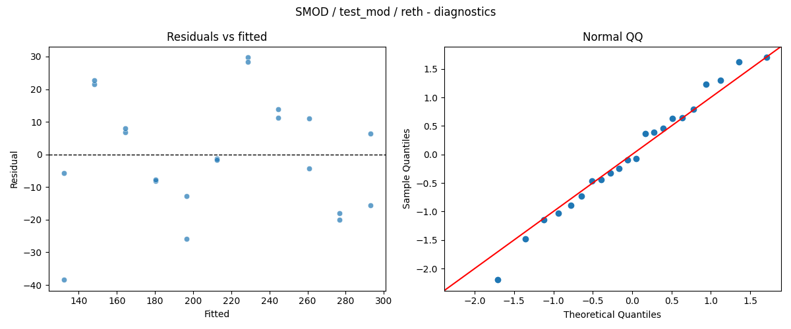

</details>

## ADDMOD

### test_mod_arithmetic — combo `191`

| client | nobs | R² | target_coef (ms) | p-value | 95% CI |
| --- | --- | --- | --- | --- | --- |
| `besu` | 2398 | 0.8388 | 2.355e-05 | 1.00e-03 | [2.309e-05, 2.394e-05] |
| `erigon` | 165 | 0.9044 | 1.823e-05 | 1.00e-03 | [1.741e-05, 1.892e-05] |
| `geth` | 2794 | 0.8378 | 1.653e-05 | 1.00e-03 | [1.624e-05, 1.684e-05] |
| `nethermind` | 814 | 0.9312 | 1.328e-05 | 1.00e-03 | [1.306e-05, 1.351e-05] |
| `reth` | 99 | 0.8579 | 9.424e-06 | 1.00e-03 | [8.543e-06, 1.031e-05] |

<details><summary>besu — NNLS regression summary</summary>

```
==============================================================================
                           NNLS Regression Results                            
==============================================================================
Dep. Variable:          test_runtime_ms              R-squared:          0.839
Model:                  NNLS                    Adj. R-squared:          0.839
No. Observations:       2398                              RMSE:          46.48
Df Residuals:           2396                               MAE:          38.17
Df Model:               1      
==============================================================================
                      coef     std err     P-value      [0.025      0.975]
------------------------------------------------------------------------------
         const    107.5663      3.0406       0.001    101.9496    114.1357
       opcount      0.0000      0.0000       0.001      0.0000      0.0000
==============================================================================
Notes: Non-negative least squares with bootstrap inference (1000 iterations)
==============================================================================
```

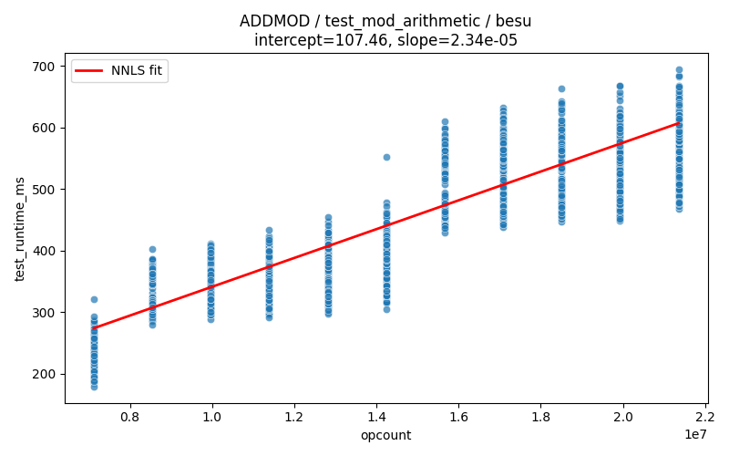

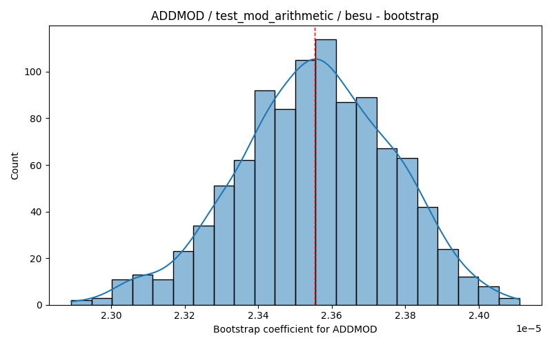

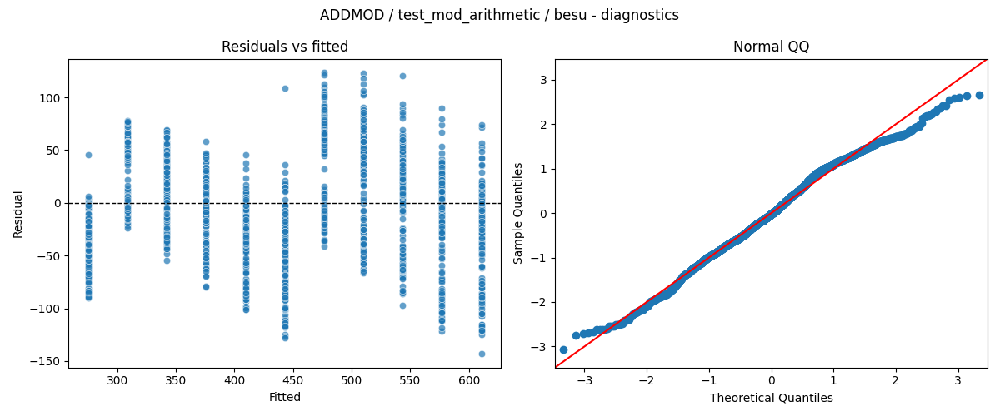

</details>

<details><summary>erigon — NNLS regression summary</summary>

```
==============================================================================
                           NNLS Regression Results                            
==============================================================================
Dep. Variable:          test_runtime_ms              R-squared:          0.904
Model:                  NNLS                    Adj. R-squared:          0.904
No. Observations:       165                               RMSE:          26.69
Df Residuals:           163                                MAE:          23.60
Df Model:               1      
==============================================================================
                      coef     std err     P-value      [0.025      0.975]
------------------------------------------------------------------------------
         const     27.9866      6.5028       0.001     16.3629     42.3258
       opcount      0.0000      0.0000       0.001      0.0000      0.0000
==============================================================================
Notes: Non-negative least squares with bootstrap inference (1000 iterations)
==============================================================================
```

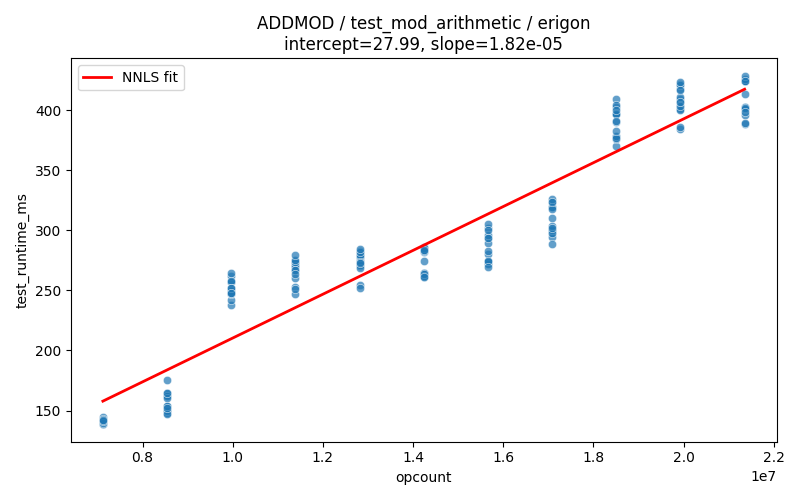

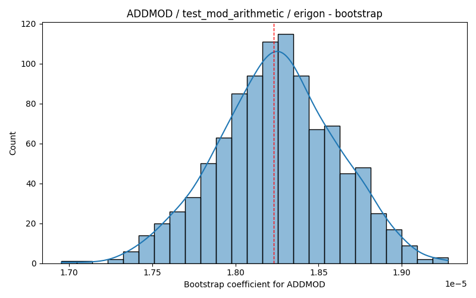

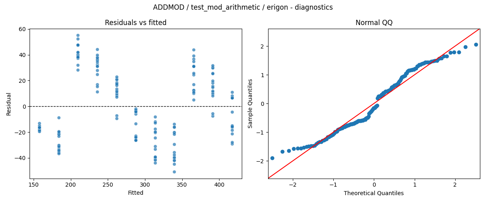

</details>

<details><summary>geth — NNLS regression summary</summary>

```
==============================================================================
                           NNLS Regression Results                            
==============================================================================
Dep. Variable:          test_runtime_ms              R-squared:          0.838
Model:                  NNLS                    Adj. R-squared:          0.838
No. Observations:       2794                              RMSE:          32.74
Df Residuals:           2792                               MAE:          27.63
Df Model:               1      
==============================================================================
                      coef     std err     P-value      [0.025      0.975]
------------------------------------------------------------------------------
         const     70.8988      2.3432       0.001     66.0245     75.4322
       opcount      0.0000      0.0000       0.001      0.0000      0.0000
==============================================================================
Notes: Non-negative least squares with bootstrap inference (1000 iterations)
==============================================================================
```

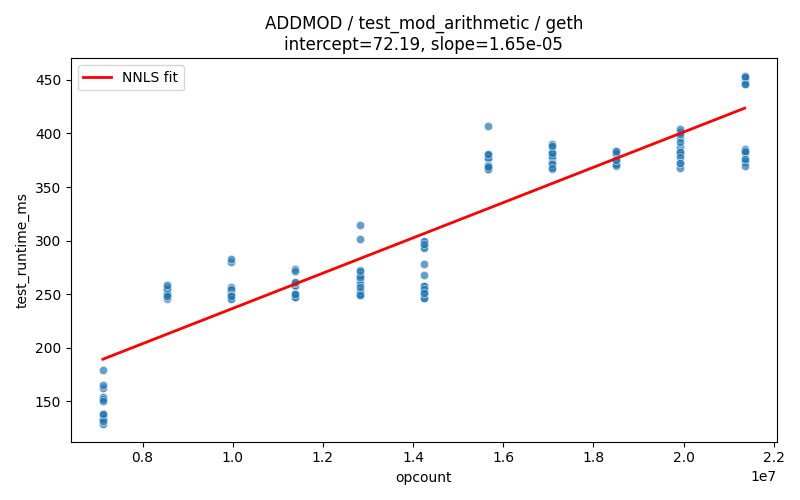

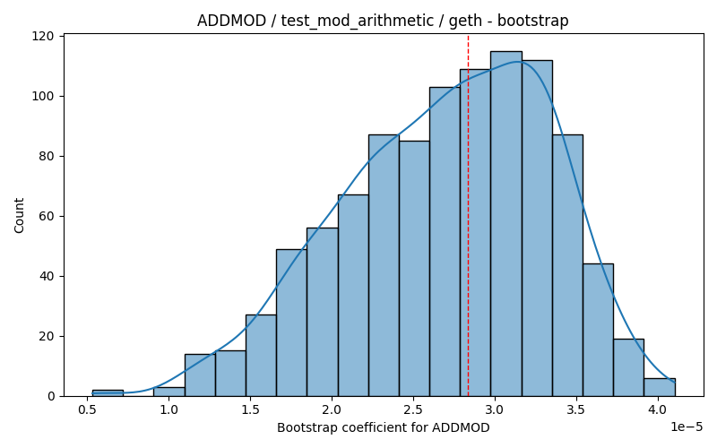

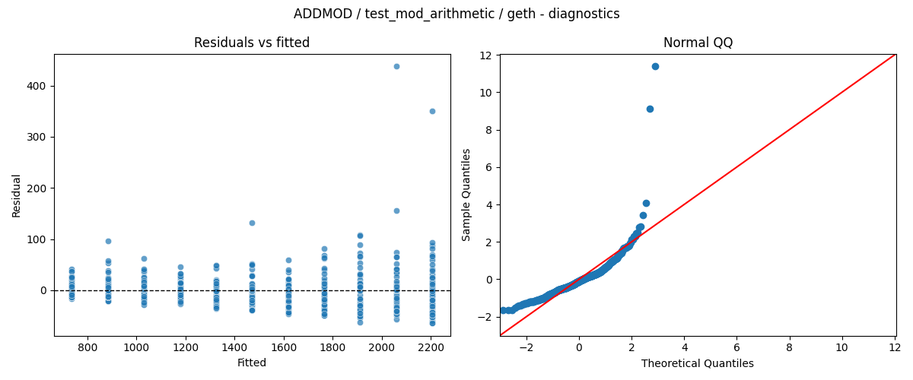

</details>

<details><summary>nethermind — NNLS regression summary</summary>

```
==============================================================================
                           NNLS Regression Results                            
==============================================================================
Dep. Variable:          test_runtime_ms              R-squared:          0.931
Model:                  NNLS                    Adj. R-squared:          0.931
No. Observations:       814                               RMSE:          16.25
Df Residuals:           812                                MAE:          13.21
Df Model:               1      
==============================================================================
                      coef     std err     P-value      [0.025      0.975]
------------------------------------------------------------------------------
         const     33.4635      1.6275       0.001     30.2893     36.5500
       opcount      0.0000      0.0000       0.001      0.0000      0.0000
==============================================================================
Notes: Non-negative least squares with bootstrap inference (1000 iterations)
==============================================================================
```

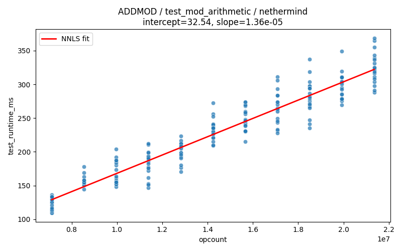

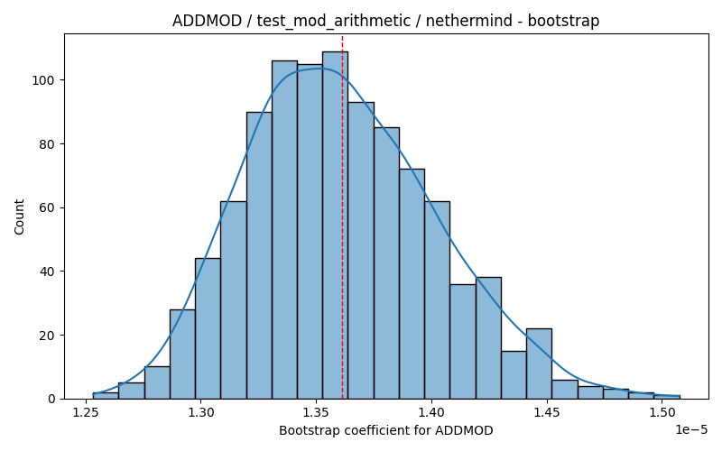

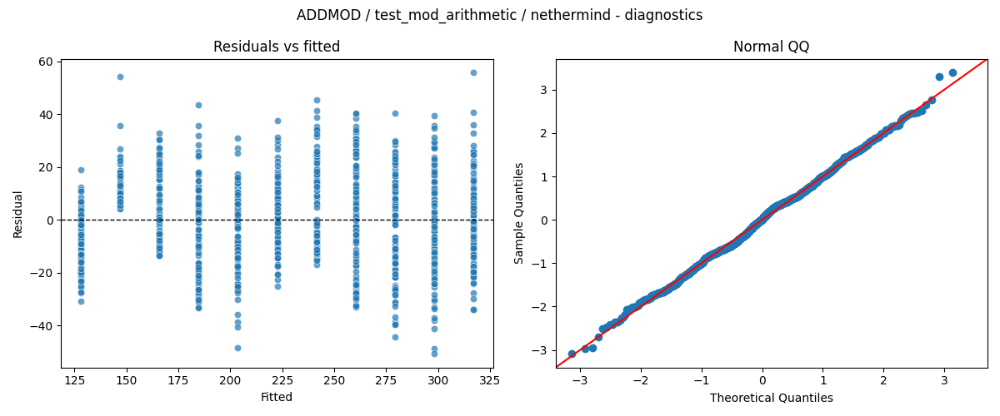

</details>

<details><summary>reth — NNLS regression summary</summary>

```
==============================================================================
                           NNLS Regression Results                            
==============================================================================
Dep. Variable:          test_runtime_ms              R-squared:          0.858
Model:                  NNLS                    Adj. R-squared:          0.856
No. Observations:       99                                RMSE:          17.27
Df Residuals:           97                                 MAE:          14.36
Df Model:               1      
==============================================================================
                      coef     std err     P-value      [0.025      0.975]
------------------------------------------------------------------------------
         const     40.7360      6.8612       0.001     26.9693     54.2698
       opcount      0.0000      0.0000       0.001      0.0000      0.0000
==============================================================================
Notes: Non-negative least squares with bootstrap inference (1000 iterations)
==============================================================================
```

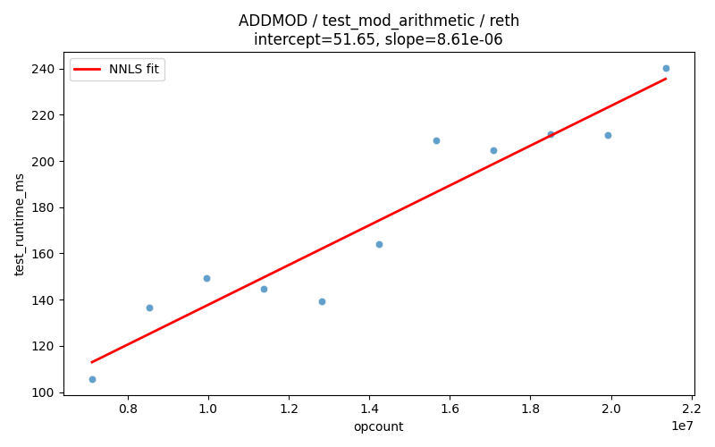

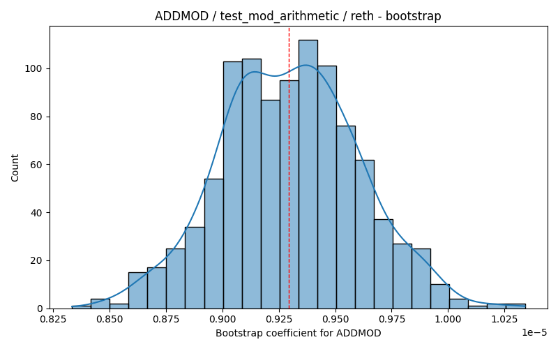


</details>

## MULMOD

### test_mod_arithmetic — combo `191`

| client | nobs | R² | target_coef (ms) | p-value | 95% CI |
| --- | --- | --- | --- | --- | --- |
| `besu` | 2398 | 0.8515 | 3.602e-05 | 1.00e-03 | [3.542e-05, 3.662e-05] |
| `erigon` | 165 | 0.8831 | 2.603e-05 | 1.00e-03 | [2.448e-05, 2.736e-05] |
| `geth` | 2794 | 0.8342 | 2.383e-05 | 1.00e-03 | [2.342e-05, 2.426e-05] |
| `nethermind` | 814 | 0.9067 | 3.357e-05 | 1.00e-03 | [3.284e-05, 3.427e-05] |
| `reth` | 99 | 0.8533 | 1.684e-05 | 1.00e-03 | [1.539e-05, 1.832e-05] |

<details><summary>besu — NNLS regression summary</summary>

```
==============================================================================
                           NNLS Regression Results                            
==============================================================================
Dep. Variable:          test_runtime_ms              R-squared:          0.851
Model:                  NNLS                    Adj. R-squared:          0.851
No. Observations:       2398                              RMSE:          67.73
Df Residuals:           2396                               MAE:          56.72
Df Model:               1      
==============================================================================
                      coef     std err     P-value      [0.025      0.975]
------------------------------------------------------------------------------
         const    154.8685      4.7268       0.001    146.0126    164.8156
       opcount      0.0000      0.0000       0.001      0.0000      0.0000
==============================================================================
Notes: Non-negative least squares with bootstrap inference (1000 iterations)
==============================================================================
```

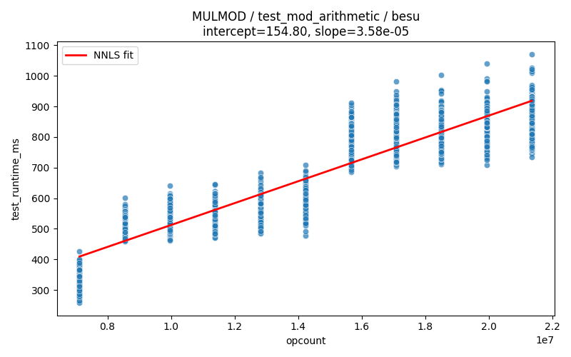

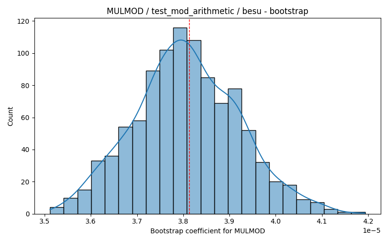

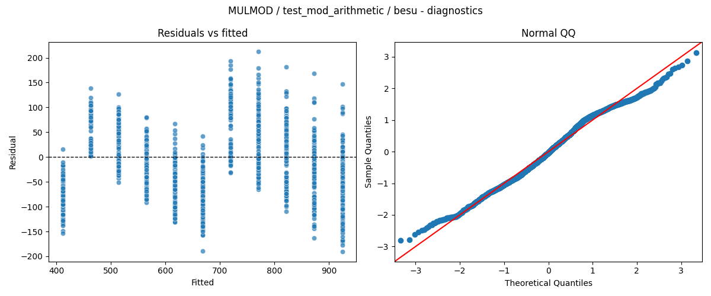

</details>

<details><summary>erigon — NNLS regression summary</summary>

```
==============================================================================
                           NNLS Regression Results                            
==============================================================================
Dep. Variable:          test_runtime_ms              R-squared:          0.883
Model:                  NNLS                    Adj. R-squared:          0.882
No. Observations:       165                               RMSE:          42.64
Df Residuals:           163                                MAE:          36.85
Df Model:               1      
==============================================================================
                      coef     std err     P-value      [0.025      0.975]
------------------------------------------------------------------------------
         const     46.0160     12.4467       0.001     23.4467     71.5449
       opcount      0.0000      0.0000       0.001      0.0000      0.0000
==============================================================================
Notes: Non-negative least squares with bootstrap inference (1000 iterations)
==============================================================================
```

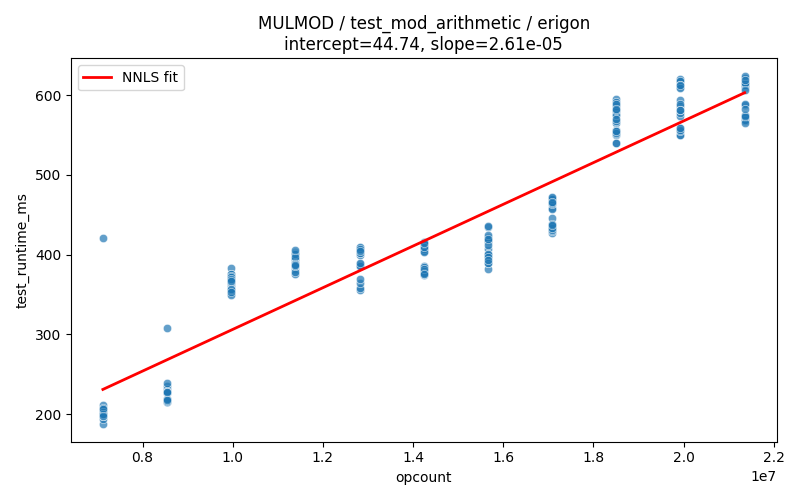

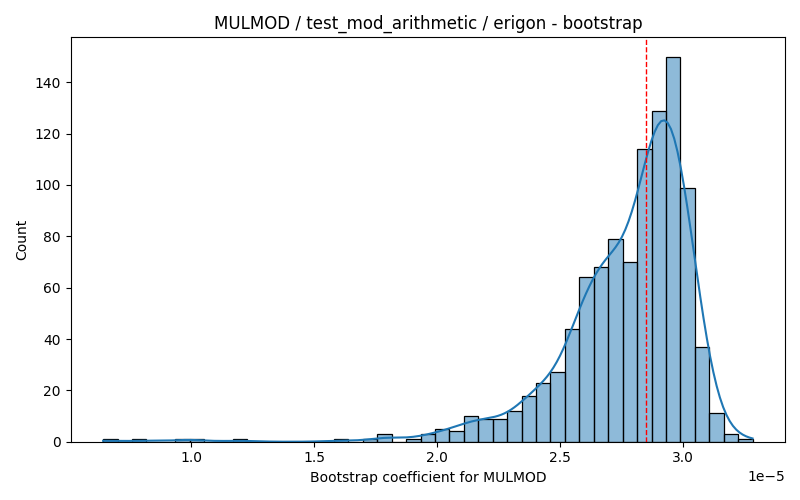

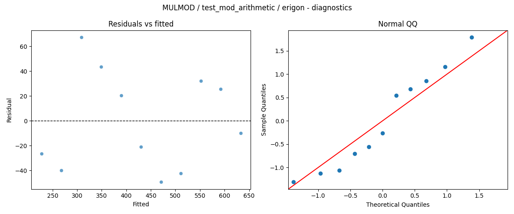

</details>

<details><summary>geth — NNLS regression summary</summary>

```
==============================================================================
                           NNLS Regression Results                            
==============================================================================
Dep. Variable:          test_runtime_ms              R-squared:          0.834
Model:                  NNLS                    Adj. R-squared:          0.834
No. Observations:       2794                              RMSE:          47.82
Df Residuals:           2792                               MAE:          40.65
Df Model:               1      
==============================================================================
                      coef     std err     P-value      [0.025      0.975]
------------------------------------------------------------------------------
         const    100.6955      3.3916       0.001     93.7053    107.0081
       opcount      0.0000      0.0000       0.001      0.0000      0.0000
==============================================================================
Notes: Non-negative least squares with bootstrap inference (1000 iterations)
==============================================================================
```

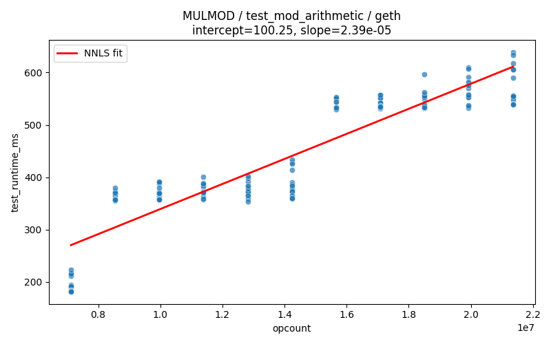

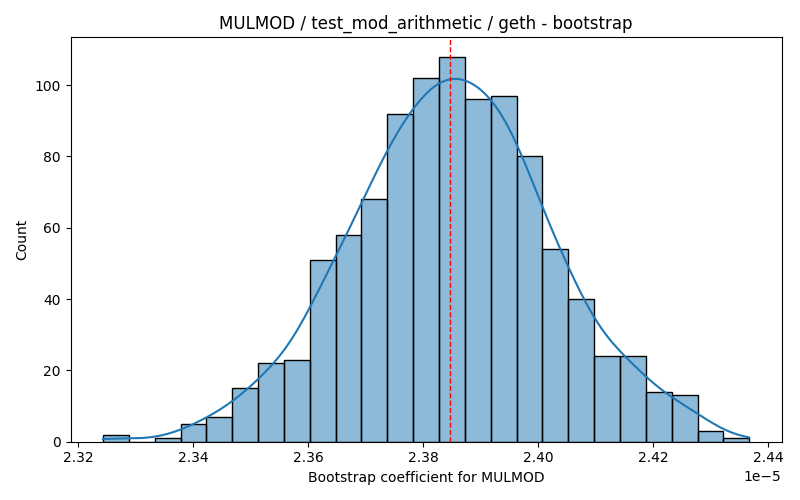

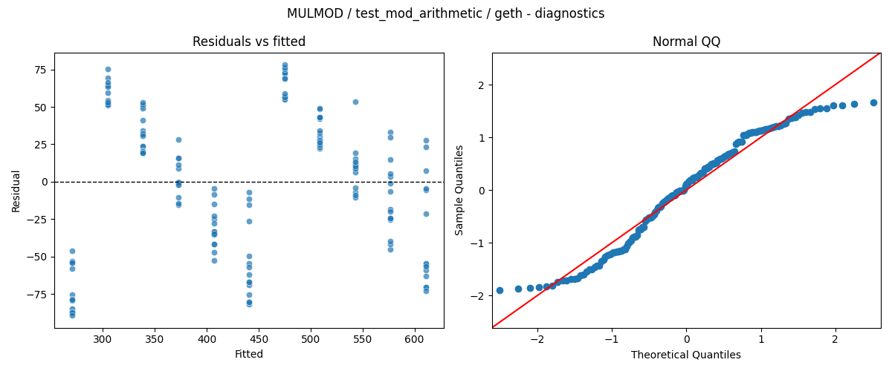

</details>

<details><summary>nethermind — NNLS regression summary</summary>

```
==============================================================================
                           NNLS Regression Results                            
==============================================================================
Dep. Variable:          test_runtime_ms              R-squared:          0.907
Model:                  NNLS                    Adj. R-squared:          0.907
No. Observations:       814                               RMSE:          48.48
Df Residuals:           812                                MAE:          37.64
Df Model:               1      
==============================================================================
                      coef     std err     P-value      [0.025      0.975]
------------------------------------------------------------------------------
         const     82.4022      4.8363       0.001     73.3671     92.2079
       opcount      0.0000      0.0000       0.001      0.0000      0.0000
==============================================================================
Notes: Non-negative least squares with bootstrap inference (1000 iterations)
==============================================================================
```

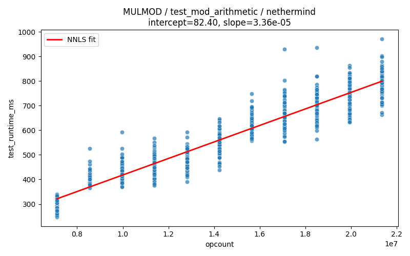

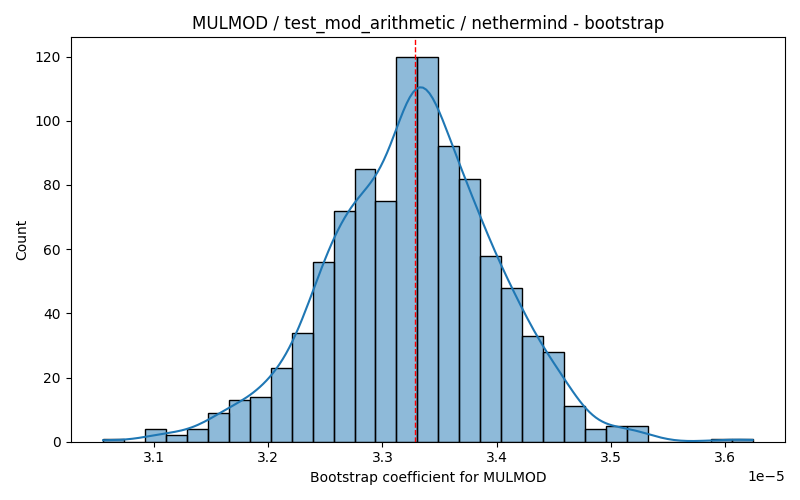

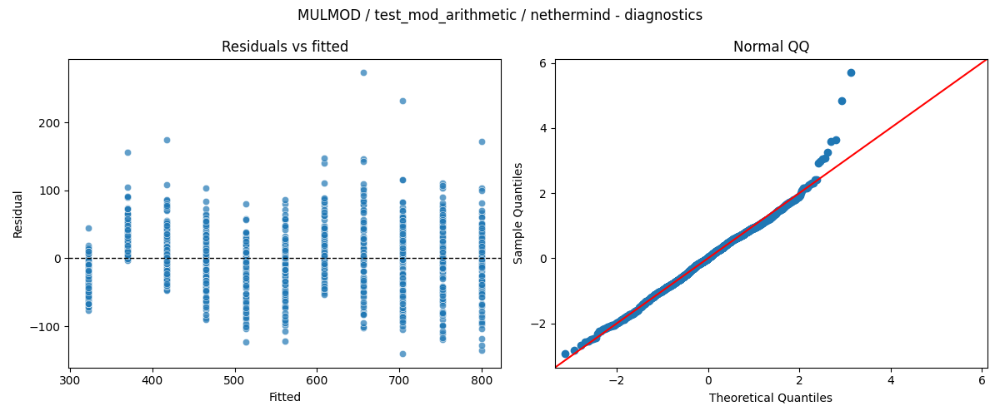

</details>

<details><summary>reth — NNLS regression summary</summary>

```
==============================================================================
                           NNLS Regression Results                            
==============================================================================
Dep. Variable:          test_runtime_ms              R-squared:          0.853
Model:                  NNLS                    Adj. R-squared:          0.852
No. Observations:       99                                RMSE:          31.45
Df Residuals:           97                                 MAE:          25.94
Df Model:               1      
==============================================================================
                      coef     std err     P-value      [0.025      0.975]
------------------------------------------------------------------------------
         const     89.1284     11.5187       0.001     66.1461    112.1967
       opcount      0.0000      0.0000       0.001      0.0000      0.0000
==============================================================================
Notes: Non-negative least squares with bootstrap inference (1000 iterations)
==============================================================================
```

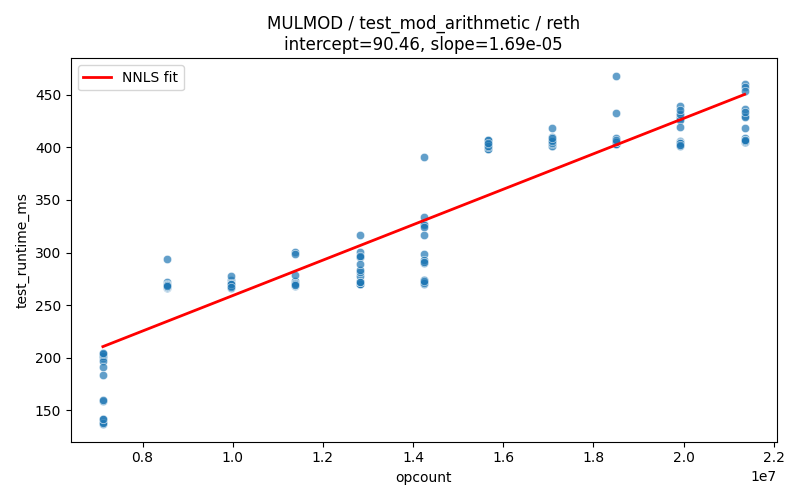

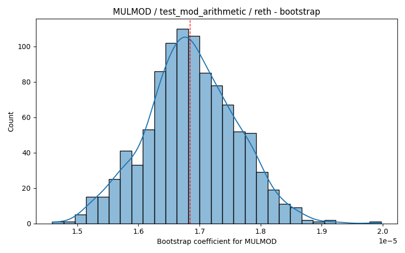

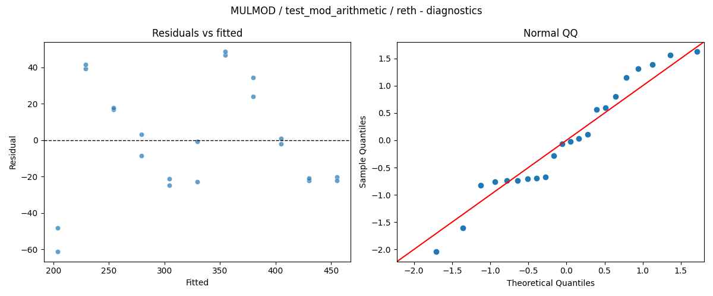

</details>

## KECCAK256

### test_keccak_diff_mem_msg_sizes — combo `0`

| client | nobs | R² | target_coef (ms) | p-value | 95% CI |
| --- | --- | --- | --- | --- | --- |
| `besu` | 9592 | 0.7668 | 9.9e-05 | 1.00e-03 | [9.781e-05, 0.0001002] |
| `erigon` | 660 | 0.8143 | 7.616e-05 | 1.00e-03 | [7.32e-05, 7.895e-05] |
| `geth` | 11176 | 0.7919 | 8.156e-05 | 1.00e-03 | [8.08e-05, 8.237e-05] |
| `nethermind` | 3256 | 0.698 | 2.405e-05 | 1.00e-03 | [2.002e-05, 2.821e-05] |
| `reth` | 396 | 0.5592 | 1.586e-05 | 1.00e-03 | [7.961e-06, 2.429e-05] |

<details><summary>besu — NNLS regression summary</summary>

```
==============================================================================
                           NNLS Regression Results                            
==============================================================================
Dep. Variable:          test_runtime_ms              R-squared:          0.767
Model:                  NNLS                    Adj. R-squared:          0.767
No. Observations:       9592                              RMSE:          85.66
Df Residuals:           9589                               MAE:          71.47
Df Model:               2      
==============================================================================
                      coef     std err     P-value      [0.025      0.975]
------------------------------------------------------------------------------
         const    140.6321      3.0446       0.001    134.7651    146.9170
       opcount      0.0001      0.0000       0.001      0.0001      0.0001
     msg_words      0.0000      0.0000       0.001      0.0000      0.0000
==============================================================================
Notes: Non-negative least squares with bootstrap inference (1000 iterations)
==============================================================================
```

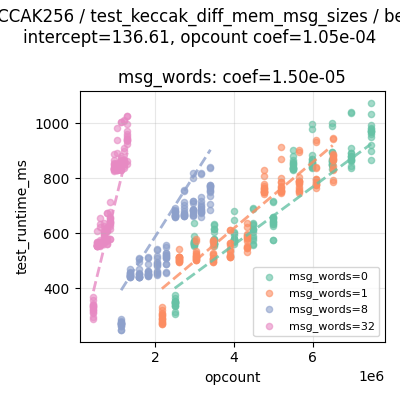

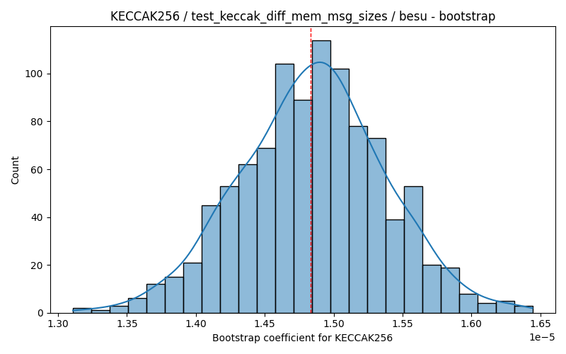

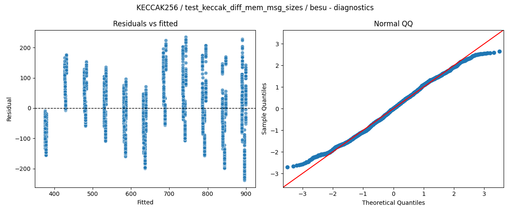

</details>

<details><summary>erigon — NNLS regression summary</summary>

```
==============================================================================
                           NNLS Regression Results                            
==============================================================================
Dep. Variable:          test_runtime_ms              R-squared:          0.814
Model:                  NNLS                    Adj. R-squared:          0.814
No. Observations:       660                               RMSE:          62.47
Df Residuals:           657                                MAE:          48.98
Df Model:               2      
==============================================================================
                      coef     std err     P-value      [0.025      0.975]
------------------------------------------------------------------------------
         const     38.7283      7.4617       0.001     23.9411     53.8449
       opcount      0.0001      0.0000       0.001      0.0001      0.0001
     msg_words      0.0000      0.0000       0.001      0.0000      0.0000
==============================================================================
Notes: Non-negative least squares with bootstrap inference (1000 iterations)
==============================================================================
```

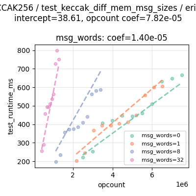

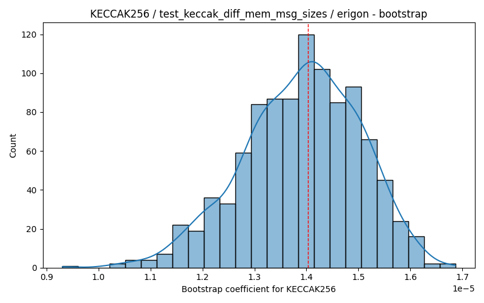

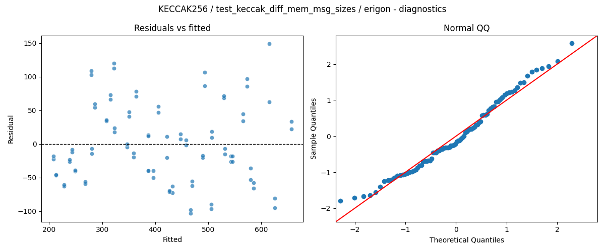

</details>

<details><summary>geth — NNLS regression summary</summary>

```
==============================================================================
                           NNLS Regression Results                            
==============================================================================
Dep. Variable:          test_runtime_ms              R-squared:          0.792
Model:                  NNLS                    Adj. R-squared:          0.792
No. Observations:       11176                             RMSE:          63.08
Df Residuals:           11173                              MAE:          51.32
Df Model:               2      
==============================================================================
                      coef     std err     P-value      [0.025      0.975]
------------------------------------------------------------------------------
         const    101.5285      1.9518       0.001     97.6939    105.1897
       opcount      0.0001      0.0000       0.001      0.0001      0.0001
     msg_words      0.0000      0.0000       0.001      0.0000      0.0000
==============================================================================
Notes: Non-negative least squares with bootstrap inference (1000 iterations)
==============================================================================
```

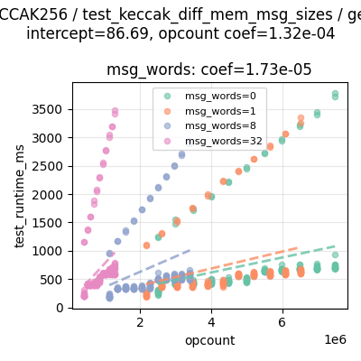

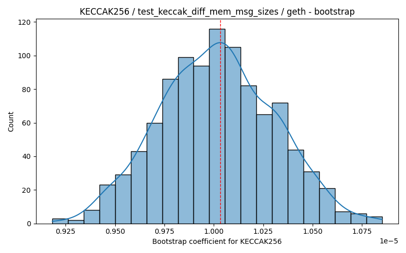

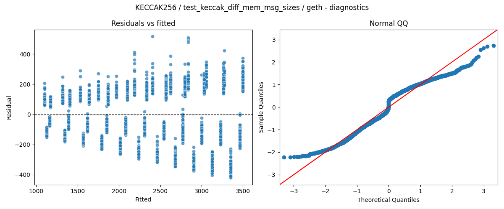

</details>

<details><summary>nethermind — NNLS regression summary</summary>

```
==============================================================================
                           NNLS Regression Results                            
==============================================================================
Dep. Variable:          test_runtime_ms              R-squared:          0.698
Model:                  NNLS                    Adj. R-squared:          0.698
No. Observations:       3256                              RMSE:         158.93
Df Residuals:           3253                               MAE:         130.34
Df Model:               2      
==============================================================================
                      coef     std err     P-value      [0.025      0.975]
------------------------------------------------------------------------------
         const     89.6611      8.3896       0.001     73.4003    106.2396
       opcount      0.0000      0.0000       0.001      0.0000      0.0000
     msg_words      0.0000      0.0000       0.001      0.0000      0.0000
==============================================================================
Notes: Non-negative least squares with bootstrap inference (1000 iterations)
==============================================================================
```

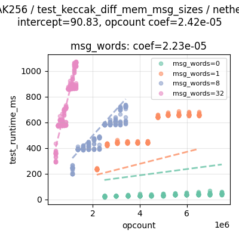

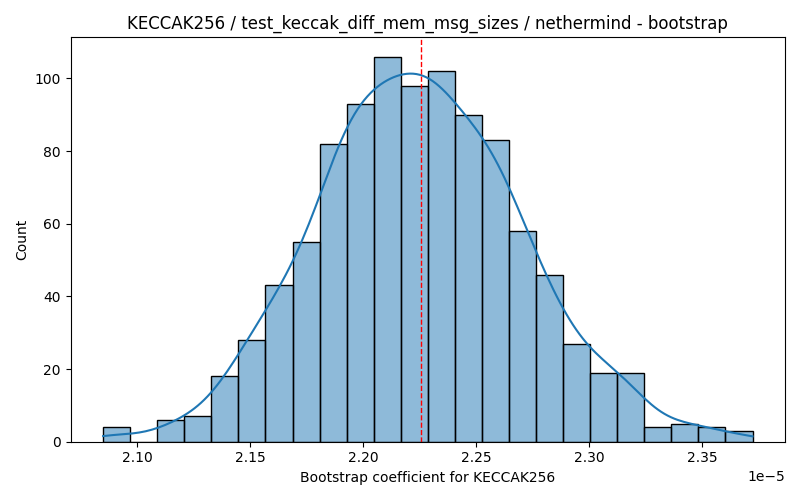

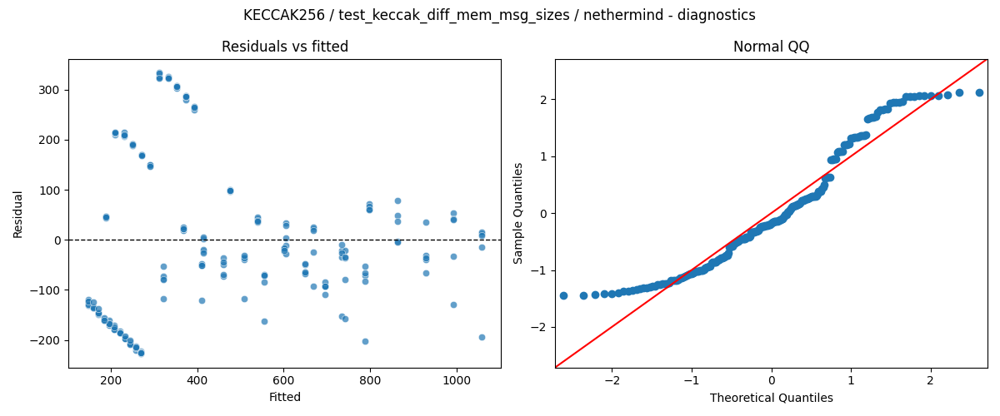

</details>

<details><summary>reth — NNLS regression summary</summary>

```
==============================================================================
                           NNLS Regression Results                            
==============================================================================
Dep. Variable:          test_runtime_ms              R-squared:          0.559
Model:                  NNLS                    Adj. R-squared:          0.557
No. Observations:       396                               RMSE:         106.66
Df Residuals:           393                                MAE:          85.96
Df Model:               2      
==============================================================================
                      coef     std err     P-value      [0.025      0.975]
------------------------------------------------------------------------------
         const     61.0340     15.9476       0.001     28.4883     92.7944
       opcount      0.0000      0.0000       0.001      0.0000      0.0000
     msg_words      0.0000      0.0000       0.001      0.0000      0.0000
==============================================================================
Notes: Non-negative least squares with bootstrap inference (1000 iterations)
==============================================================================
```

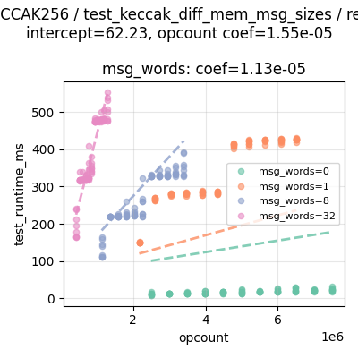

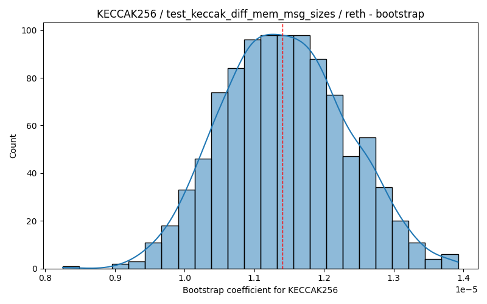

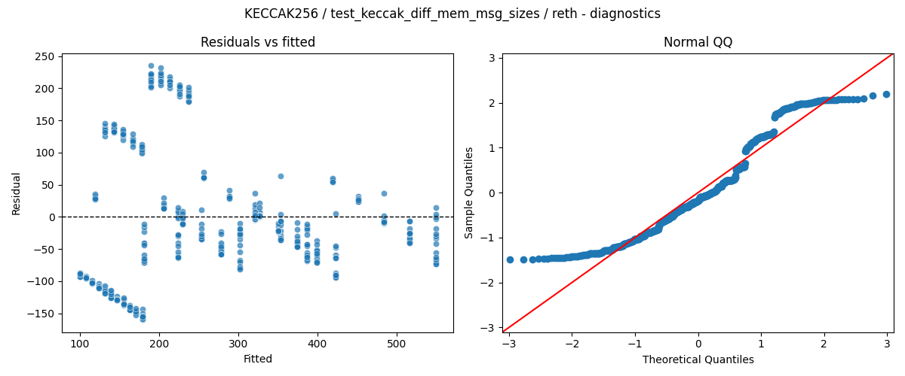

</details>

### test_keccak_diff_mem_msg_sizes — combo `1024`

| client | nobs | R² | target_coef (ms) | p-value | 95% CI |
| --- | --- | --- | --- | --- | --- |
| `besu` | 9592 | 0.7852 | 0.0001087 | 1.00e-03 | [0.0001075, 0.0001099] |
| `erigon` | 660 | 0.8233 | 7.65e-05 | 1.00e-03 | [7.359e-05, 7.916e-05] |
| `geth` | 11176 | 0.7944 | 8.165e-05 | 1.00e-03 | [8.081e-05, 8.239e-05] |
| `nethermind` | 3256 | 0.6996 | 2.443e-05 | 1.00e-03 | [2.037e-05, 2.886e-05] |
| `reth` | 396 | 0.5698 | 1.625e-05 | 1.00e-03 | [7.498e-06, 2.462e-05] |

<details><summary>besu — NNLS regression summary</summary>

```
==============================================================================
                           NNLS Regression Results                            
==============================================================================
Dep. Variable:          test_runtime_ms              R-squared:          0.785
Model:                  NNLS                    Adj. R-squared:          0.785
No. Observations:       9592                              RMSE:          86.81
Df Residuals:           9589                               MAE:          71.56
Df Model:               2      
==============================================================================
                      coef     std err     P-value      [0.025      0.975]
------------------------------------------------------------------------------
         const    132.6415      2.9473       0.001    126.8176    138.4787
       opcount      0.0001      0.0000       0.001      0.0001      0.0001
     msg_words      0.0000      0.0000       0.001      0.0000      0.0000
==============================================================================
Notes: Non-negative least squares with bootstrap inference (1000 iterations)
==============================================================================
```

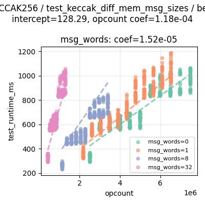

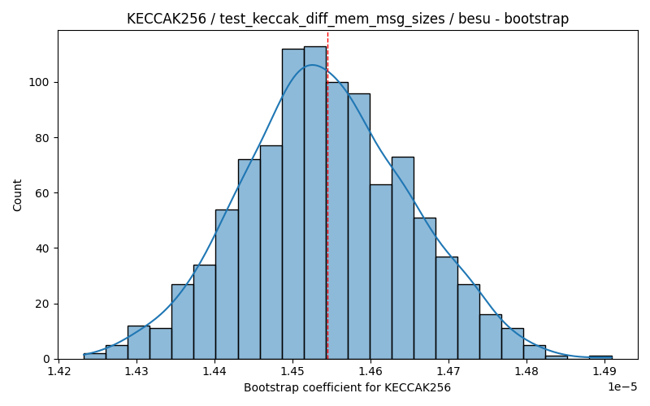

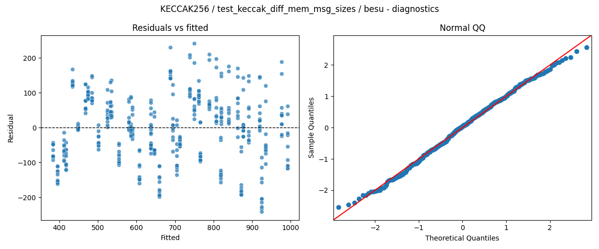

</details>

<details><summary>erigon — NNLS regression summary</summary>

```
==============================================================================
                           NNLS Regression Results                            
==============================================================================
Dep. Variable:          test_runtime_ms              R-squared:          0.823
Model:                  NNLS                    Adj. R-squared:          0.823
No. Observations:       660                               RMSE:          60.78
Df Residuals:           657                                MAE:          48.59
Df Model:               2      
==============================================================================
                      coef     std err     P-value      [0.025      0.975]
------------------------------------------------------------------------------
         const     37.4419      7.0944       0.001     23.9107     52.2431
       opcount      0.0001      0.0000       0.001      0.0001      0.0001
     msg_words      0.0000      0.0000       0.001      0.0000      0.0000
==============================================================================
Notes: Non-negative least squares with bootstrap inference (1000 iterations)
==============================================================================
```

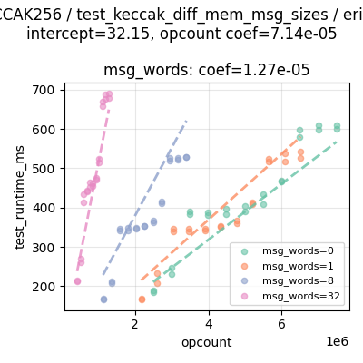

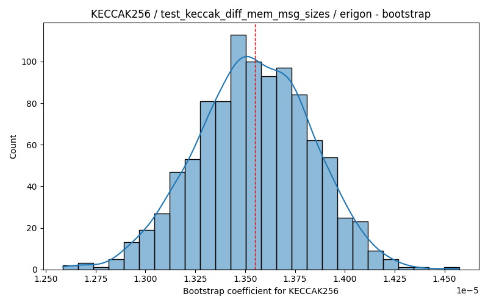

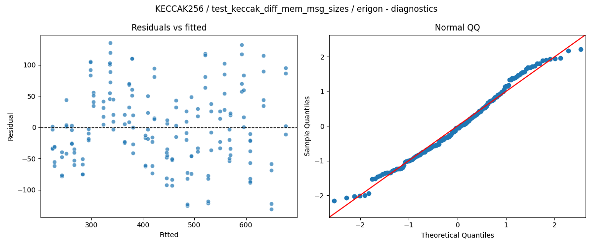

</details>

<details><summary>geth — NNLS regression summary</summary>

```
==============================================================================
                           NNLS Regression Results                            
==============================================================================
Dep. Variable:          test_runtime_ms              R-squared:          0.794
Model:                  NNLS                    Adj. R-squared:          0.794
No. Observations:       11176                             RMSE:          62.80
Df Residuals:           11173                              MAE:          51.23
Df Model:               2      
==============================================================================
                      coef     std err     P-value      [0.025      0.975]
------------------------------------------------------------------------------
         const     98.1948      2.0452       0.001     94.4617    102.3128
       opcount      0.0001      0.0000       0.001      0.0001      0.0001
     msg_words      0.0000      0.0000       0.001      0.0000      0.0000
==============================================================================
Notes: Non-negative least squares with bootstrap inference (1000 iterations)
==============================================================================
```

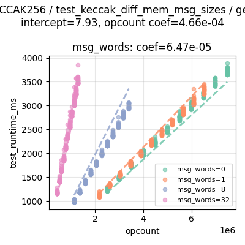

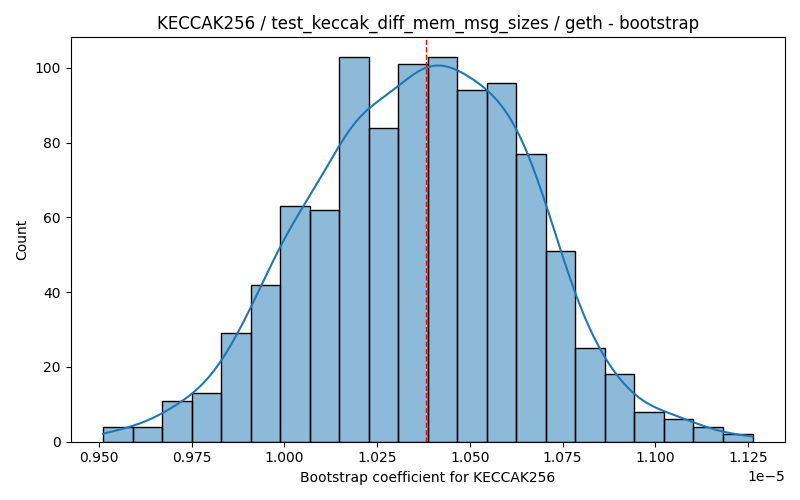

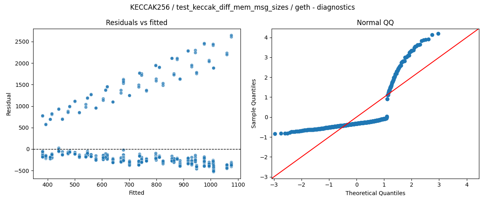

</details>

<details><summary>nethermind — NNLS regression summary</summary>

```
==============================================================================
                           NNLS Regression Results                            
==============================================================================
Dep. Variable:          test_runtime_ms              R-squared:          0.700
Model:                  NNLS                    Adj. R-squared:          0.699
No. Observations:       3256                              RMSE:         158.52
Df Residuals:           3253                               MAE:         129.64
Df Model:               2      
==============================================================================
                      coef     std err     P-value      [0.025      0.975]
------------------------------------------------------------------------------
         const     86.9956      8.0171       0.001     71.4246    103.7369
       opcount      0.0000      0.0000       0.001      0.0000      0.0000
     msg_words      0.0000      0.0000       0.001      0.0000      0.0000
==============================================================================
Notes: Non-negative least squares with bootstrap inference (1000 iterations)
==============================================================================
```

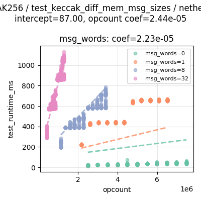

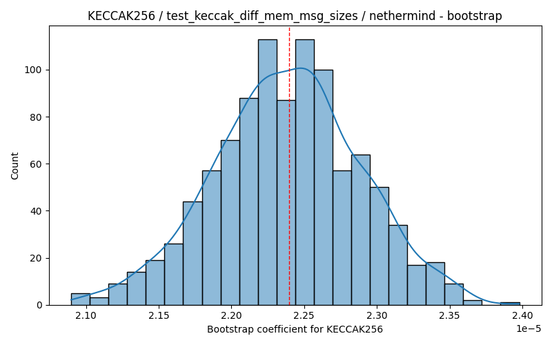

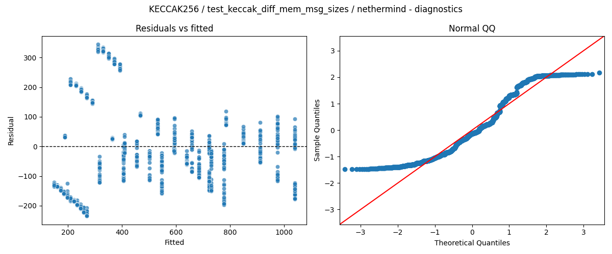

</details>

<details><summary>reth — NNLS regression summary</summary>

```
==============================================================================
                           NNLS Regression Results                            
==============================================================================
Dep. Variable:          test_runtime_ms              R-squared:          0.570
Model:                  NNLS                    Adj. R-squared:          0.568
No. Observations:       396                               RMSE:         106.37
Df Residuals:           393                                MAE:          85.33
Df Model:               2      
==============================================================================
                      coef     std err     P-value      [0.025      0.975]
------------------------------------------------------------------------------
         const     58.1366     16.2160       0.001     25.6331     88.6644
       opcount      0.0000      0.0000       0.001      0.0000      0.0000
     msg_words      0.0000      0.0000       0.001      0.0000      0.0000
==============================================================================
Notes: Non-negative least squares with bootstrap inference (1000 iterations)
==============================================================================
```

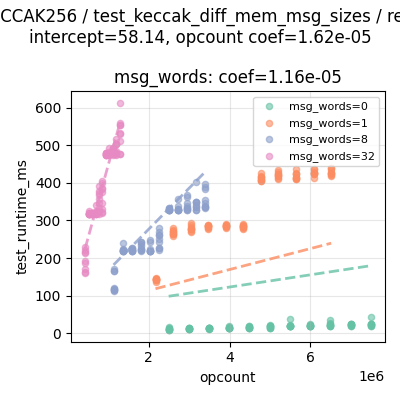

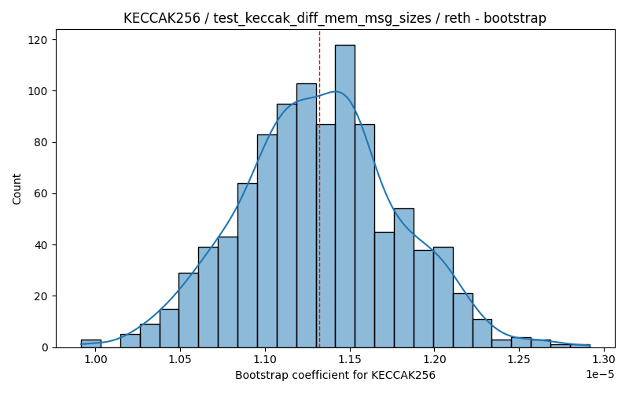

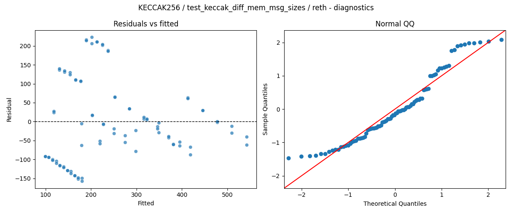

</details>

### test_keccak_diff_mem_msg_sizes — combo `256`

| client | nobs | R² | target_coef (ms) | p-value | 95% CI |
| --- | --- | --- | --- | --- | --- |
| `besu` | 9592 | 0.7805 | 0.0001111 | 1.00e-03 | [0.0001099, 0.0001123] |
| `erigon` | 660 | 0.8148 | 7.458e-05 | 1.00e-03 | [7.177e-05, 7.753e-05] |
| `geth` | 11176 | 0.7897 | 8.114e-05 | 1.00e-03 | [8.036e-05, 8.188e-05] |
| `nethermind` | 3256 | 0.6993 | 2.451e-05 | 1.00e-03 | [2.053e-05, 2.831e-05] |
| `reth` | 396 | 0.5606 | 1.602e-05 | 1.00e-03 | [7.885e-06, 2.455e-05] |

<details><summary>besu — NNLS regression summary</summary>

```
==============================================================================
                           NNLS Regression Results                            
==============================================================================
Dep. Variable:          test_runtime_ms              R-squared:          0.781
Model:                  NNLS                    Adj. R-squared:          0.780
No. Observations:       9592                              RMSE:          89.46
Df Residuals:           9589                               MAE:          73.68
Df Model:               2      
==============================================================================
                      coef     std err     P-value      [0.025      0.975]
------------------------------------------------------------------------------
         const    129.2460      3.0065       0.001    123.4490    135.1363
       opcount      0.0001      0.0000       0.001      0.0001      0.0001
     msg_words      0.0000      0.0000       0.001      0.0000      0.0000
==============================================================================
Notes: Non-negative least squares with bootstrap inference (1000 iterations)
==============================================================================
```

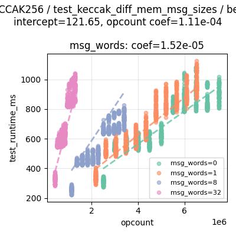

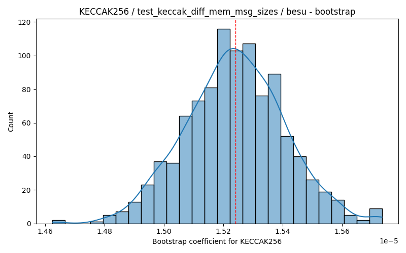

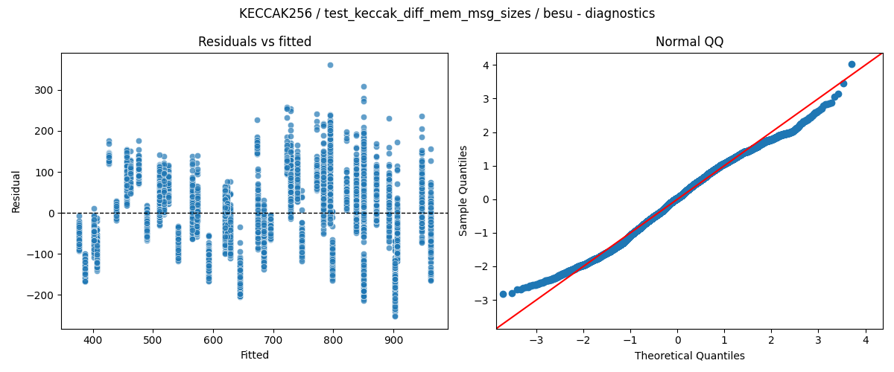

</details>

<details><summary>erigon — NNLS regression summary</summary>

```
==============================================================================
                           NNLS Regression Results                            
==============================================================================
Dep. Variable:          test_runtime_ms              R-squared:          0.815
Model:                  NNLS                    Adj. R-squared:          0.814
No. Observations:       660                               RMSE:          61.10
Df Residuals:           657                                MAE:          49.09
Df Model:               2      
==============================================================================
                      coef     std err     P-value      [0.025      0.975]
------------------------------------------------------------------------------
         const     46.7684      7.4440       0.001     32.7461     61.2522
       opcount      0.0001      0.0000       0.001      0.0001      0.0001
     msg_words      0.0000      0.0000       0.001      0.0000      0.0000
==============================================================================
Notes: Non-negative least squares with bootstrap inference (1000 iterations)
==============================================================================
```

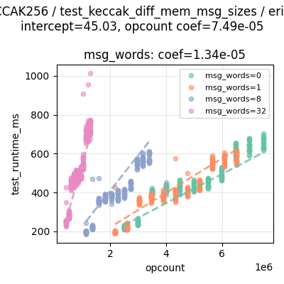

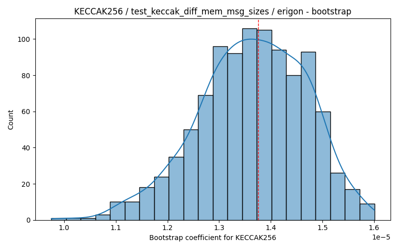

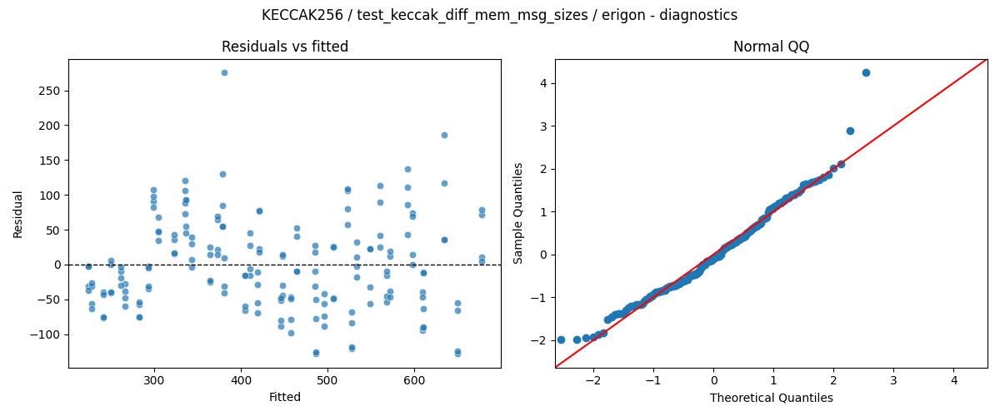

</details>

<details><summary>geth — NNLS regression summary</summary>

```
==============================================================================
                           NNLS Regression Results                            
==============================================================================
Dep. Variable:          test_runtime_ms              R-squared:          0.790
Model:                  NNLS                    Adj. R-squared:          0.790
No. Observations:       11176                             RMSE:          63.37
Df Residuals:           11173                              MAE:          51.21
Df Model:               2      
==============================================================================
                      coef     std err     P-value      [0.025      0.975]
------------------------------------------------------------------------------
         const     99.4054      1.9233       0.001     95.8130    103.4996
       opcount      0.0001      0.0000       0.001      0.0001      0.0001
     msg_words      0.0000      0.0000       0.001      0.0000      0.0000
==============================================================================
Notes: Non-negative least squares with bootstrap inference (1000 iterations)
==============================================================================
```

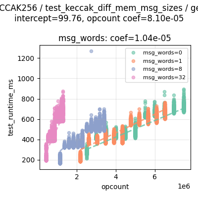

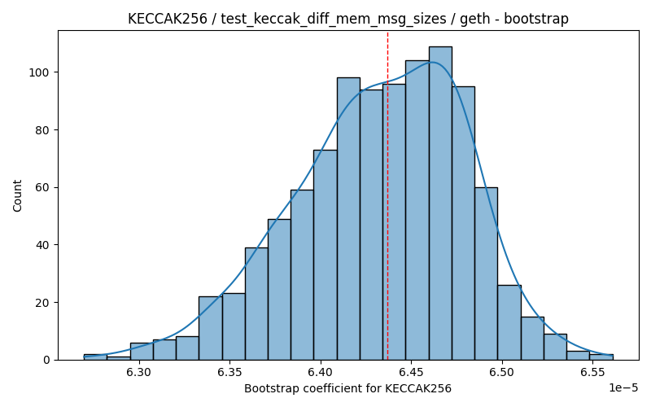

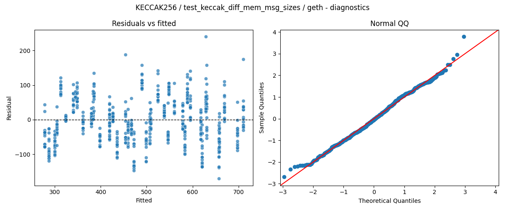

</details>

<details><summary>nethermind — NNLS regression summary</summary>

```
==============================================================================
                           NNLS Regression Results                            
==============================================================================
Dep. Variable:          test_runtime_ms              R-squared:          0.699
Model:                  NNLS                    Adj. R-squared:          0.699
No. Observations:       3256                              RMSE:         158.45
Df Residuals:           3253                               MAE:         129.68
Df Model:               2      
==============================================================================
                      coef     std err     P-value      [0.025      0.975]
------------------------------------------------------------------------------
         const     87.2211      8.0789       0.001     71.2540    102.9004
       opcount      0.0000      0.0000       0.001      0.0000      0.0000
     msg_words      0.0000      0.0000       0.001      0.0000      0.0000
==============================================================================
Notes: Non-negative least squares with bootstrap inference (1000 iterations)
==============================================================================
```

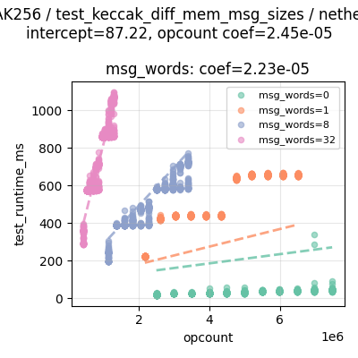

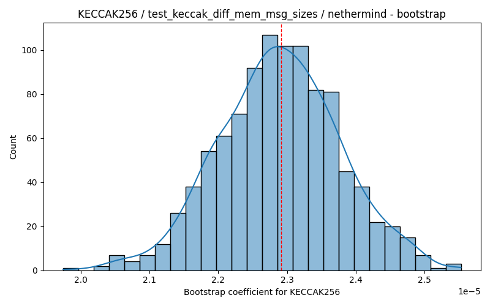

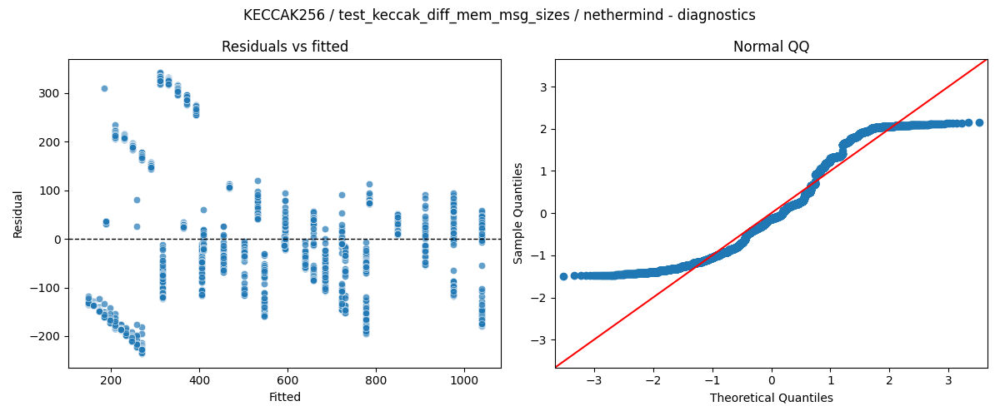

</details>

<details><summary>reth — NNLS regression summary</summary>

```
==============================================================================
                           NNLS Regression Results                            
==============================================================================
Dep. Variable:          test_runtime_ms              R-squared:          0.561
Model:                  NNLS                    Adj. R-squared:          0.558
No. Observations:       396                               RMSE:         106.64
Df Residuals:           393                                MAE:          85.88
Df Model:               2      
==============================================================================
                      coef     std err     P-value      [0.025      0.975]
------------------------------------------------------------------------------
         const     59.8467     15.4798       0.001     27.8576     88.8289
       opcount      0.0000      0.0000       0.001      0.0000      0.0000
     msg_words      0.0000      0.0000       0.001      0.0000      0.0000
==============================================================================
Notes: Non-negative least squares with bootstrap inference (1000 iterations)
==============================================================================
```

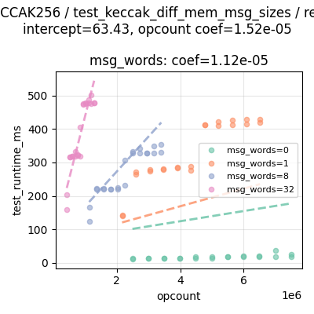


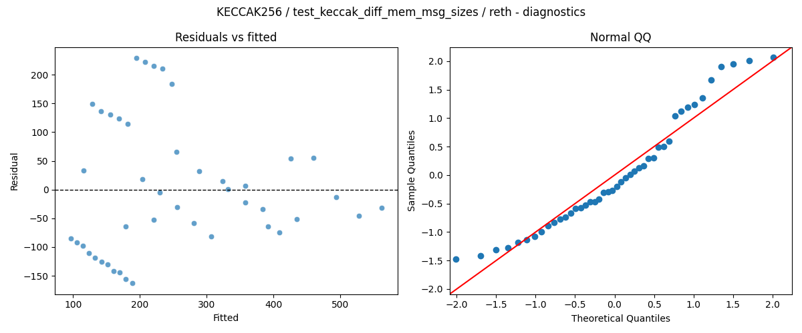

</details>

### test_keccak_diff_mem_msg_sizes — combo `32`

| client | nobs | R² | target_coef (ms) | p-value | 95% CI |
| --- | --- | --- | --- | --- | --- |
| `besu` | 9592 | 0.7596 | 0.0001025 | 1.00e-03 | [0.0001012, 0.0001036] |
| `erigon` | 660 | 0.83 | 7.518e-05 | 1.00e-03 | [7.223e-05, 7.81e-05] |
| `geth` | 11176 | 0.791 | 8.123e-05 | 1.00e-03 | [8.042e-05, 8.196e-05] |
| `nethermind` | 3256 | 0.6992 | 2.408e-05 | 1.00e-03 | [2.001e-05, 2.783e-05] |
| `reth` | 396 | 0.5645 | 1.527e-05 | 1.00e-03 | [7.06e-06, 2.302e-05] |

<details><summary>besu — NNLS regression summary</summary>

```
==============================================================================
                           NNLS Regression Results                            
==============================================================================
Dep. Variable:          test_runtime_ms              R-squared:          0.760
Model:                  NNLS                    Adj. R-squared:          0.760
No. Observations:       9592                              RMSE:          88.47
Df Residuals:           9589                               MAE:          74.00
Df Model:               2      
==============================================================================
                      coef     std err     P-value      [0.025      0.975]
------------------------------------------------------------------------------
         const    154.2106      3.0514       0.001    148.3014    160.3796
       opcount      0.0001      0.0000       0.001      0.0001      0.0001
     msg_words      0.0000      0.0000       0.001      0.0000      0.0000
==============================================================================
Notes: Non-negative least squares with bootstrap inference (1000 iterations)
==============================================================================
```

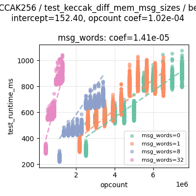

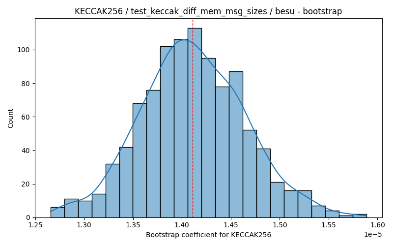

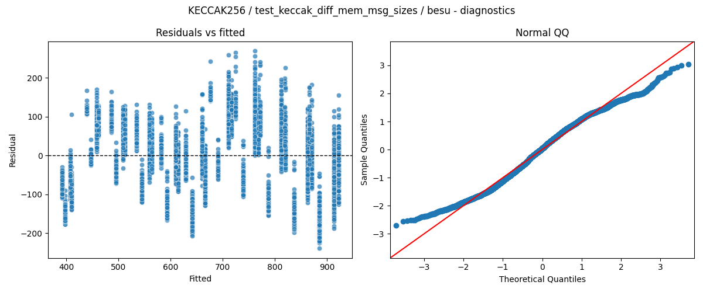

</details>

<details><summary>erigon — NNLS regression summary</summary>

```
==============================================================================
                           NNLS Regression Results                            
==============================================================================
Dep. Variable:          test_runtime_ms              R-squared:          0.830
Model:                  NNLS                    Adj. R-squared:          0.829
No. Observations:       660                               RMSE:          58.18
Df Residuals:           657                                MAE:          47.83
Df Model:               2      
==============================================================================
                      coef     std err     P-value      [0.025      0.975]
------------------------------------------------------------------------------
         const     43.8568      7.0810       0.001     29.9823     58.1704
       opcount      0.0001      0.0000       0.001      0.0001      0.0001
     msg_words      0.0000      0.0000       0.001      0.0000      0.0000
==============================================================================
Notes: Non-negative least squares with bootstrap inference (1000 iterations)
==============================================================================
```

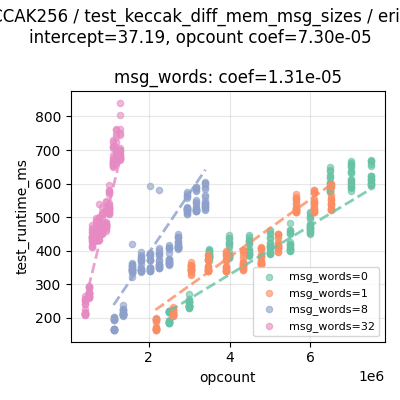

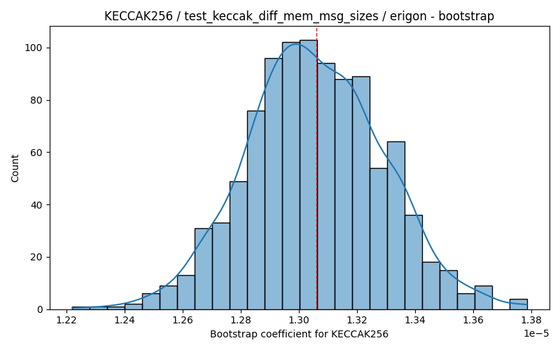

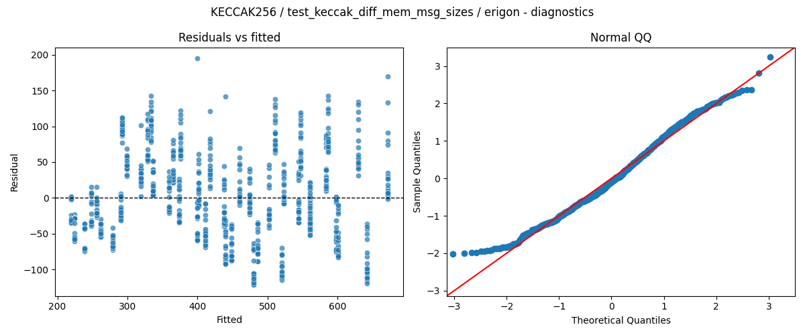

</details>

<details><summary>geth — NNLS regression summary</summary>

```
==============================================================================
                           NNLS Regression Results                            
==============================================================================
Dep. Variable:          test_runtime_ms              R-squared:          0.791
Model:                  NNLS                    Adj. R-squared:          0.791
No. Observations:       11176                             RMSE:          63.23
Df Residuals:           11173                              MAE:          51.92
Df Model:               2      
==============================================================================
                      coef     std err     P-value      [0.025      0.975]
------------------------------------------------------------------------------
         const     98.0372      2.0271       0.001     94.1495    101.9908
       opcount      0.0001      0.0000       0.001      0.0001      0.0001
     msg_words      0.0000      0.0000       0.001      0.0000      0.0000
==============================================================================
Notes: Non-negative least squares with bootstrap inference (1000 iterations)
==============================================================================
```

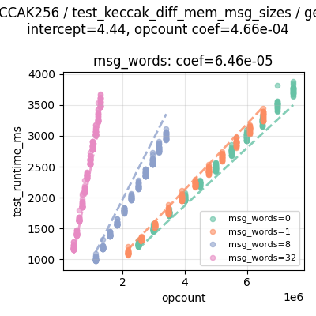

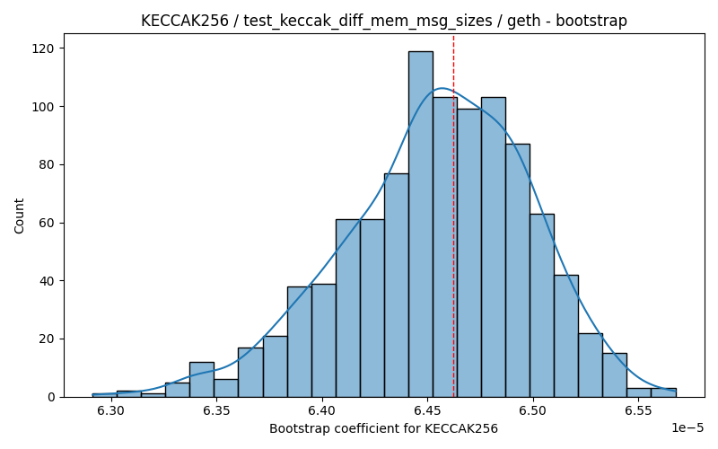

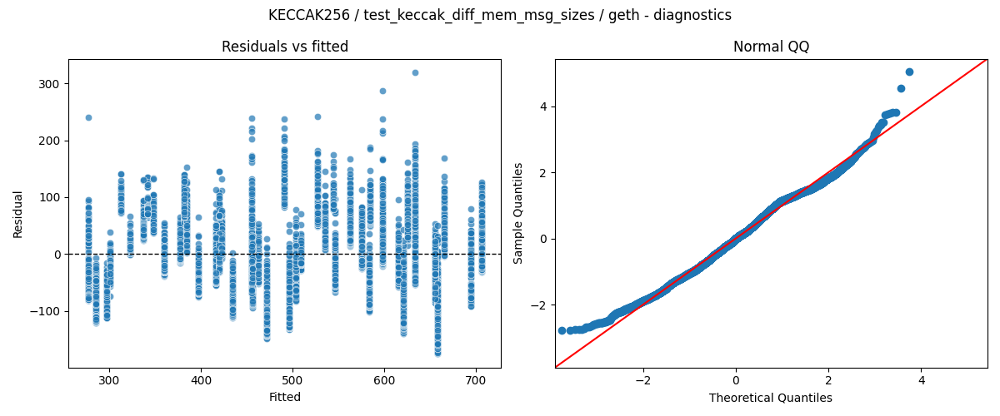

</details>

<details><summary>nethermind — NNLS regression summary</summary>

```
==============================================================================
                           NNLS Regression Results                            
==============================================================================
Dep. Variable:          test_runtime_ms              R-squared:          0.699
Model:                  NNLS                    Adj. R-squared:          0.699
No. Observations:       3256                              RMSE:         158.43
Df Residuals:           3253                               MAE:         129.99
Df Model:               2      
==============================================================================
                      coef     std err     P-value      [0.025      0.975]
------------------------------------------------------------------------------
         const     89.4926      7.8392       0.001     74.5466    105.2608
       opcount      0.0000      0.0000       0.001      0.0000      0.0000
     msg_words      0.0000      0.0000       0.001      0.0000      0.0000
==============================================================================
Notes: Non-negative least squares with bootstrap inference (1000 iterations)
==============================================================================
```

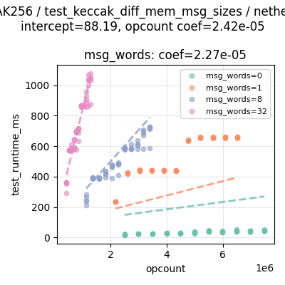

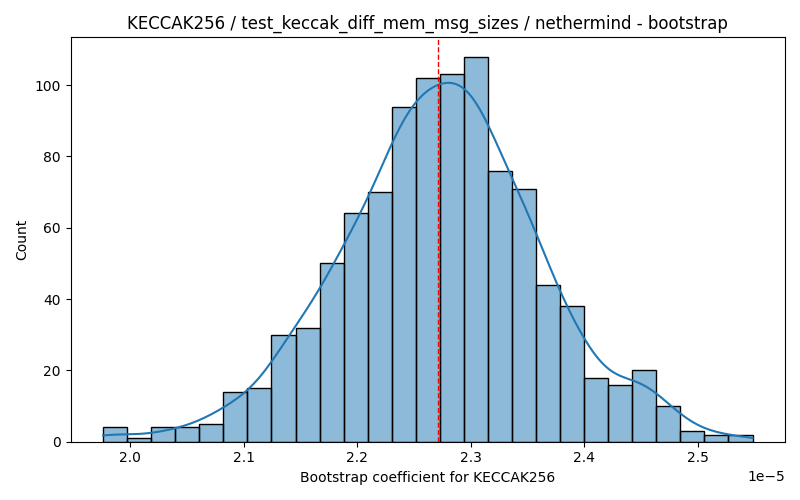

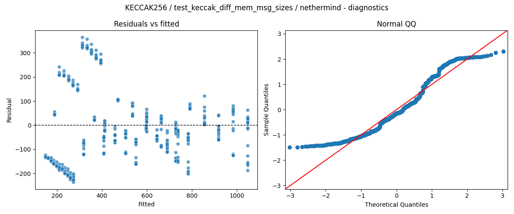

</details>

<details><summary>reth — NNLS regression summary</summary>

```
==============================================================================
                           NNLS Regression Results                            
==============================================================================
Dep. Variable:          test_runtime_ms              R-squared:          0.565
Model:                  NNLS                    Adj. R-squared:          0.562
No. Observations:       396                               RMSE:         106.18
Df Residuals:           393                                MAE:          85.13
Df Model:               2      
==============================================================================
                      coef     std err     P-value      [0.025      0.975]
------------------------------------------------------------------------------
         const     63.0521     15.0854       0.001     33.3584     93.2852
       opcount      0.0000      0.0000       0.001      0.0000      0.0000
     msg_words      0.0000      0.0000       0.001      0.0000      0.0000
==============================================================================
Notes: Non-negative least squares with bootstrap inference (1000 iterations)
==============================================================================
```


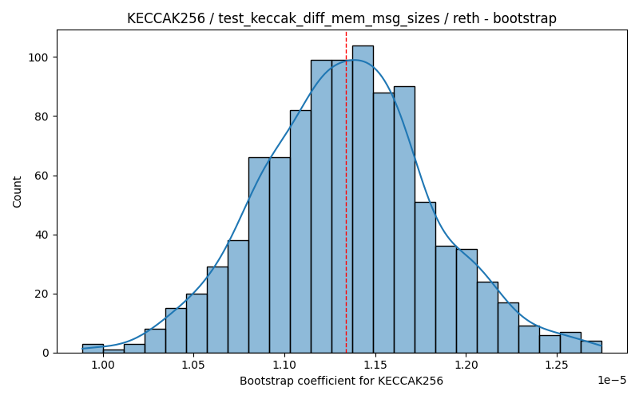

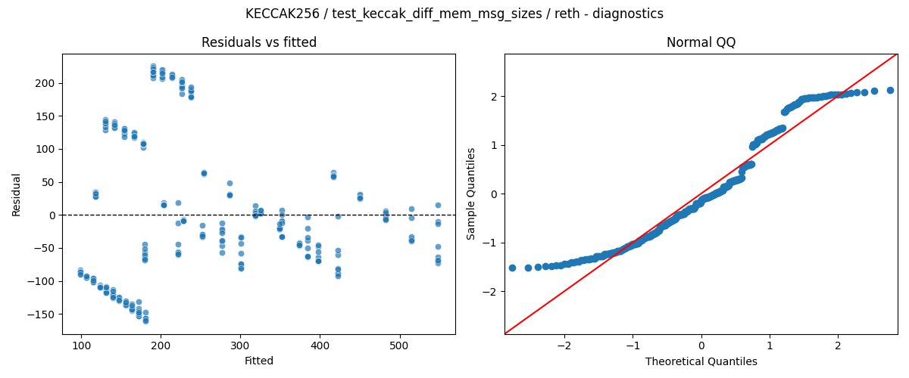

</details>

## ECRECOVER

### test_ecrecover

| client | nobs | R² | target_coef (ms) | p-value | 95% CI |
| --- | --- | --- | --- | --- | --- |
| `besu` | 2398 | 0.8825 | 0.006709 | 1.00e-03 | [0.006606, 0.006807] |
| `erigon` | 165 | 0.8134 | 0.008326 | 1.00e-03 | [0.007596, 0.00896] |
| `geth` | 2794 | 0.8819 | 0.00781 | 1.00e-03 | [0.007704, 0.007918] |
| `nethermind` | 814 | 0.8781 | 0.006909 | 1.00e-03 | [0.006702, 0.007101] |
| `reth` | 99 | 0.8359 | 0.006548 | 1.00e-03 | [0.005918, 0.007205] |

<details><summary>besu — NNLS regression summary</summary>

```
==============================================================================
                           NNLS Regression Results                            
==============================================================================
Dep. Variable:          test_runtime_ms              R-squared:          0.882
Model:                  NNLS                    Adj. R-squared:          0.882
No. Observations:       2398                              RMSE:          49.40
Df Residuals:           2396                               MAE:          41.99
Df Model:               1      
==============================================================================
                      coef     std err     P-value      [0.025      0.975]
------------------------------------------------------------------------------
         const    143.6498      3.4670       0.001    136.9704    150.9420
       opcount      0.0067      0.0000       0.001      0.0066      0.0068
==============================================================================
Notes: Non-negative least squares with bootstrap inference (1000 iterations)
==============================================================================
```

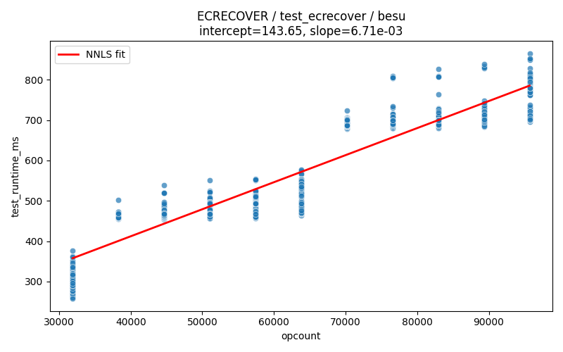

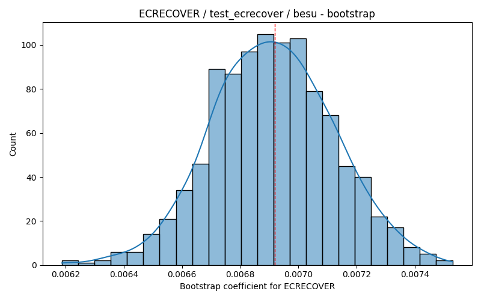

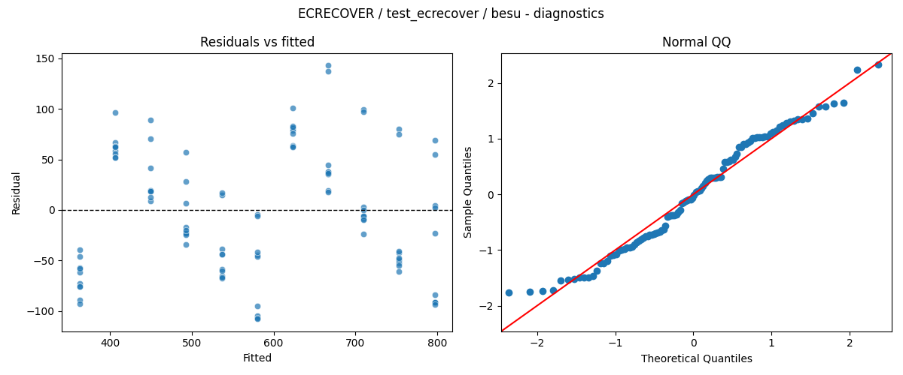

</details>

<details><summary>erigon — NNLS regression summary</summary>

```
==============================================================================
                           NNLS Regression Results                            
==============================================================================
Dep. Variable:          test_runtime_ms              R-squared:          0.813
Model:                  NNLS                    Adj. R-squared:          0.812
No. Observations:       165                               RMSE:          80.45
Df Residuals:           163                                MAE:          52.11
Df Model:               1      
==============================================================================
                      coef     std err     P-value      [0.025      0.975]
------------------------------------------------------------------------------
         const     94.3635     26.7514       0.001     46.5408    151.4553
       opcount      0.0083      0.0003       0.001      0.0076      0.0090
==============================================================================
Notes: Non-negative least squares with bootstrap inference (1000 iterations)
==============================================================================
```

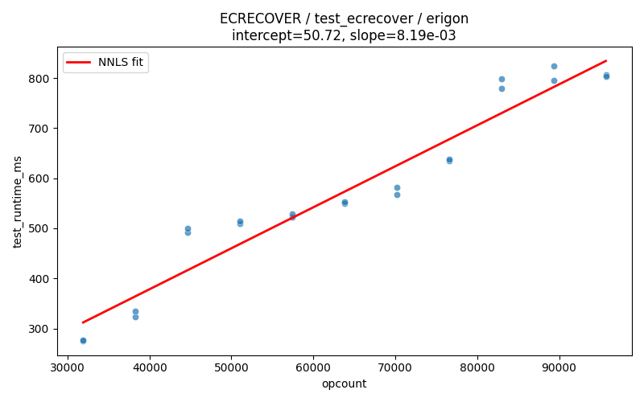

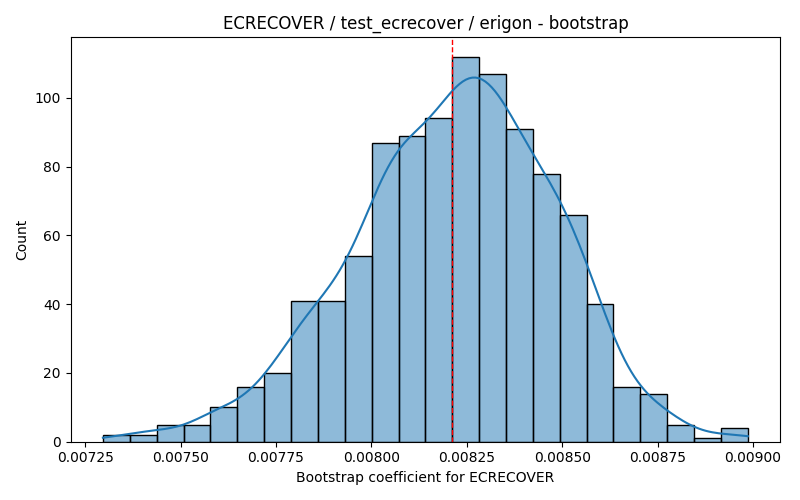

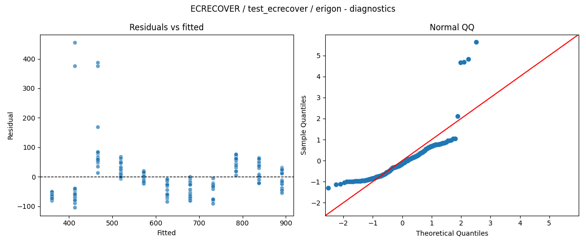

</details>

<details><summary>geth — NNLS regression summary</summary>

```
==============================================================================
                           NNLS Regression Results                            
==============================================================================
Dep. Variable:          test_runtime_ms              R-squared:          0.882
Model:                  NNLS                    Adj. R-squared:          0.882
No. Observations:       2794                              RMSE:          57.66
Df Residuals:           2792                               MAE:          49.44
Df Model:               1      
==============================================================================
                      coef     std err     P-value      [0.025      0.975]
------------------------------------------------------------------------------
         const    114.5758      3.7643       0.001    107.2410    121.8582
       opcount      0.0078      0.0001       0.001      0.0077      0.0079
==============================================================================
Notes: Non-negative least squares with bootstrap inference (1000 iterations)
==============================================================================
```

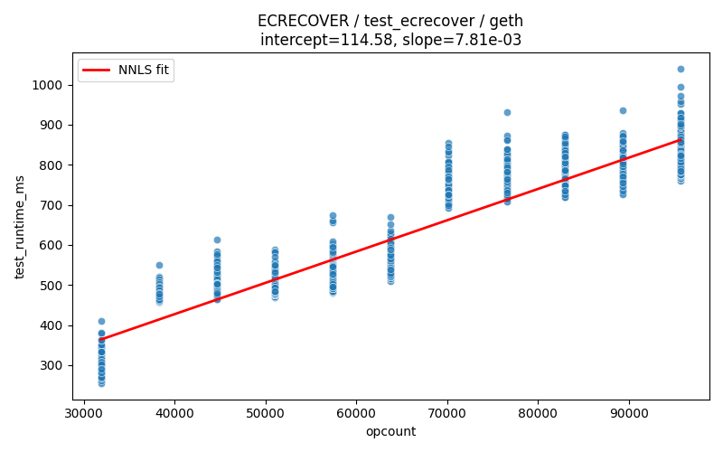

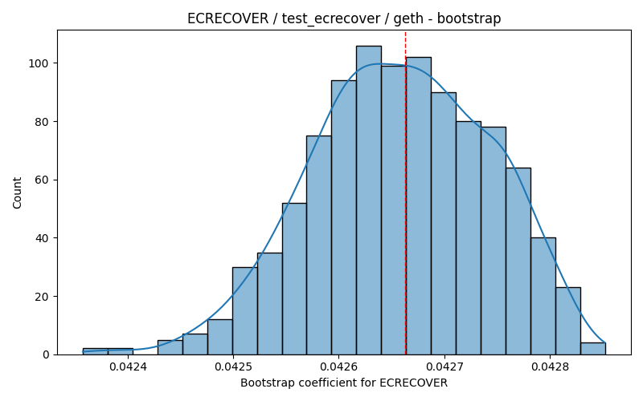

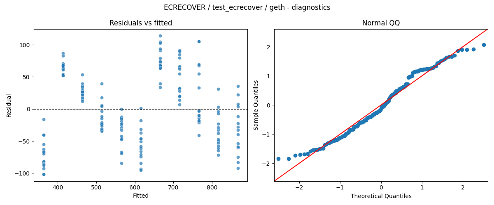

</details>

<details><summary>nethermind — NNLS regression summary</summary>

```
==============================================================================
                           NNLS Regression Results                            
==============================================================================
Dep. Variable:          test_runtime_ms              R-squared:          0.878
Model:                  NNLS                    Adj. R-squared:          0.878
No. Observations:       814                               RMSE:          51.94
Df Residuals:           812                                MAE:          43.18
Df Model:               1      
==============================================================================
                      coef     std err     P-value      [0.025      0.975]
------------------------------------------------------------------------------
         const    102.7033      6.9258       0.001     89.6459    116.5869
       opcount      0.0069      0.0001       0.001      0.0067      0.0071
==============================================================================
Notes: Non-negative least squares with bootstrap inference (1000 iterations)
==============================================================================
```

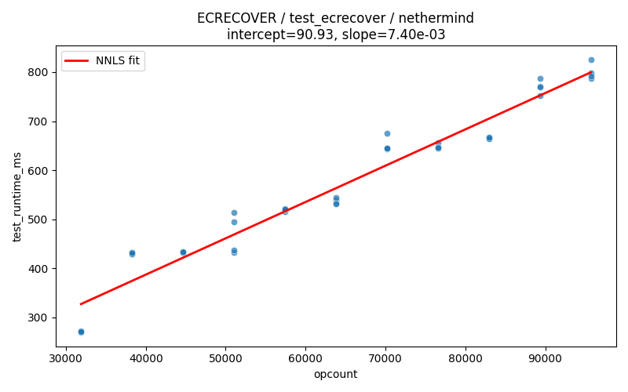

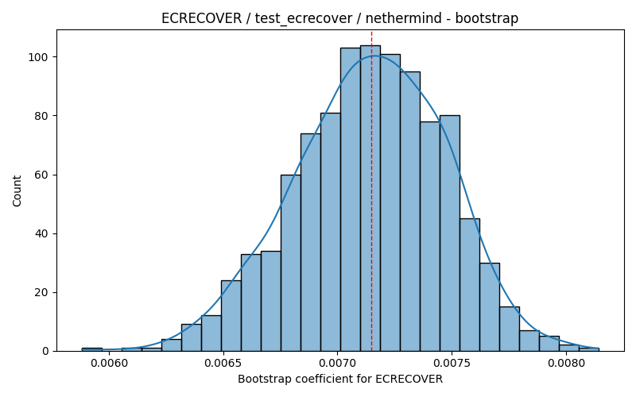

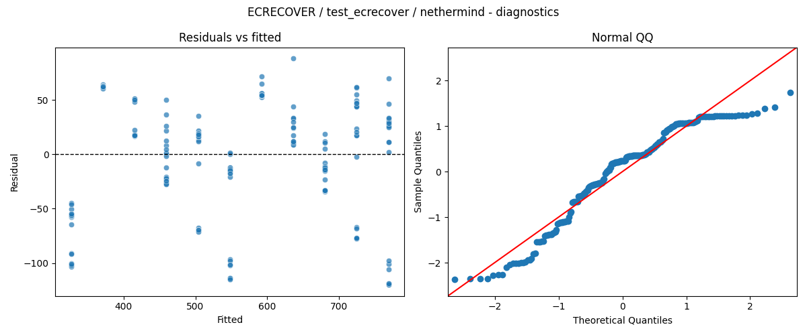

</details>

<details><summary>reth — NNLS regression summary</summary>

```
==============================================================================
                           NNLS Regression Results                            
==============================================================================
Dep. Variable:          test_runtime_ms              R-squared:          0.836
Model:                  NNLS                    Adj. R-squared:          0.834
No. Observations:       99                                RMSE:          58.53
Df Residuals:           97                                 MAE:          48.72
Df Model:               1      
==============================================================================
                      coef     std err     P-value      [0.025      0.975]
------------------------------------------------------------------------------
         const    121.0467     23.1192       0.001     76.5813    167.6927
       opcount      0.0065      0.0003       0.001      0.0059      0.0072
==============================================================================
Notes: Non-negative least squares with bootstrap inference (1000 iterations)
==============================================================================
```

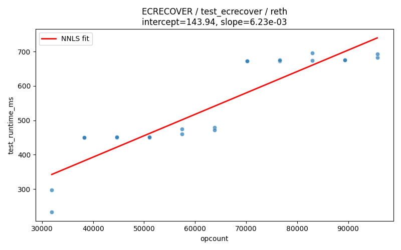

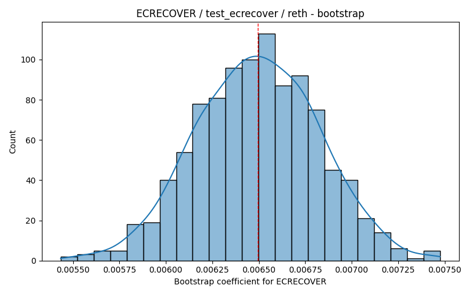

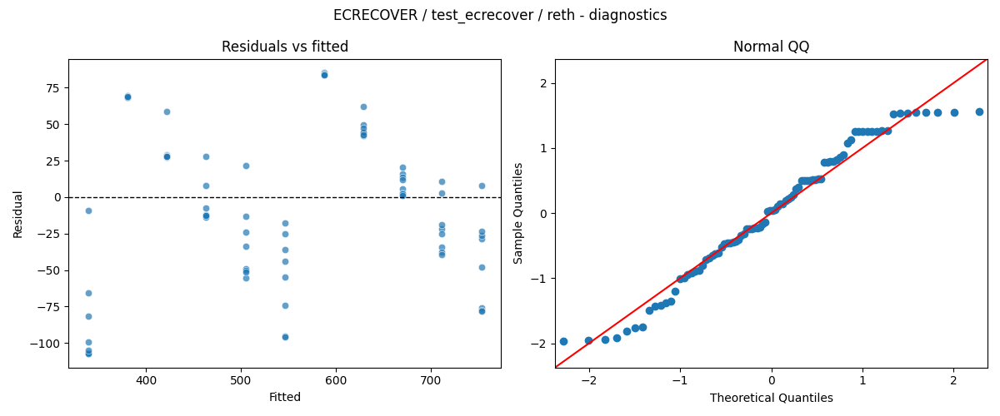

</details>

## BLAKE2F

### test_blake2f_benchmark

| client | nobs | R² | target_coef (ms) | p-value | 95% CI |
| --- | --- | --- | --- | --- | --- |
| `besu` | 9592 | 0.8689 | 0.0003373 | 1.00e-03 | [0.0003345, 0.0003403] |
| `erigon` | 660 | 0.9543 | 0.0005933 | 1.00e-03 | [0.0005817, 0.0006031] |
| `geth` | 11176 | 0.9297 | 0.0001041 | 1.00e-03 | [0.0001035, 0.0001048] |
| `nethermind` | 3256 | 0.9496 | 0.0001561 | 1.00e-03 | [0.0001548, 0.0001574] |
| `reth` | 396 | 0.9896 | 0.0003815 | 1.00e-03 | [0.0003779, 0.0003852] |

<details><summary>besu — NNLS regression summary</summary>

```
==============================================================================
                           NNLS Regression Results                            
==============================================================================
Dep. Variable:          test_runtime_ms              R-squared:          0.869
Model:                  NNLS                    Adj. R-squared:          0.869
No. Observations:       9592                              RMSE:          68.72
Df Residuals:           9589                               MAE:          58.09
Df Model:               2      
==============================================================================
                      coef     std err     P-value      [0.025      0.975]
------------------------------------------------------------------------------
         const    164.8792      2.6459       0.001    159.7752    169.8698
       opcount      0.0003      0.0000       0.001      0.0003      0.0003
    num_rounds      0.0000      0.0000       0.001      0.0000      0.0000
==============================================================================
Notes: Non-negative least squares with bootstrap inference (1000 iterations)
==============================================================================
```

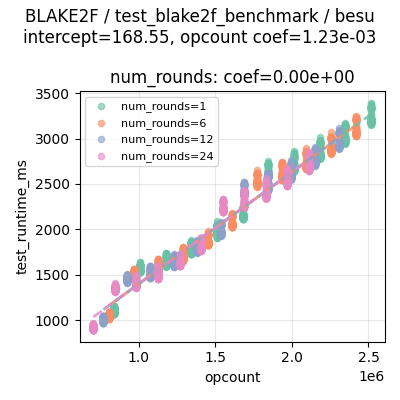

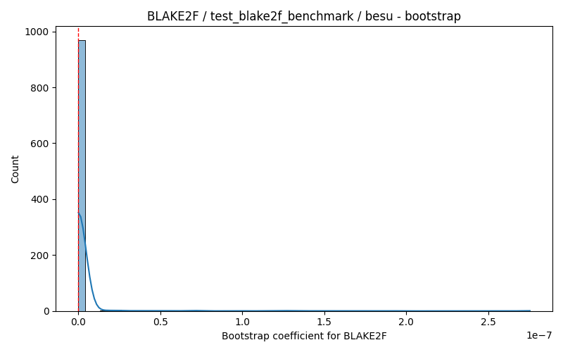

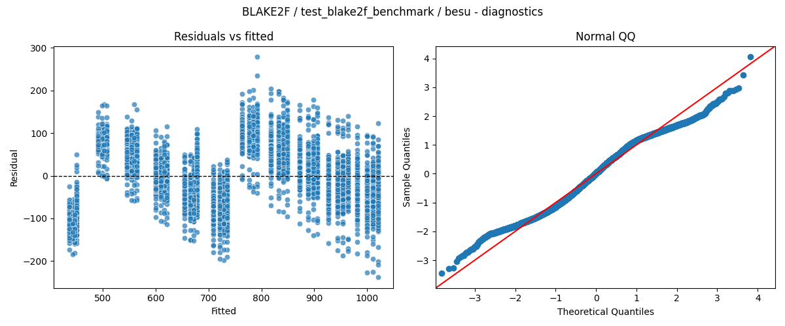

</details>

<details><summary>erigon — NNLS regression summary</summary>

```
==============================================================================
                           NNLS Regression Results                            
==============================================================================
Dep. Variable:          test_runtime_ms              R-squared:          0.954
Model:                  NNLS                    Adj. R-squared:          0.954
No. Observations:       660                               RMSE:          65.68
Df Residuals:           657                                MAE:          46.77
Df Model:               2      
==============================================================================
                      coef     std err     P-value      [0.025      0.975]
------------------------------------------------------------------------------
         const      9.8528      7.2600       0.100      0.0000     25.4485
       opcount      0.0006      0.0000       0.001      0.0006      0.0006
    num_rounds      0.0000      0.0000       0.014      0.0000      0.0000
==============================================================================
Notes: Non-negative least squares with bootstrap inference (1000 iterations)
==============================================================================
```

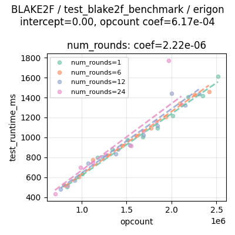

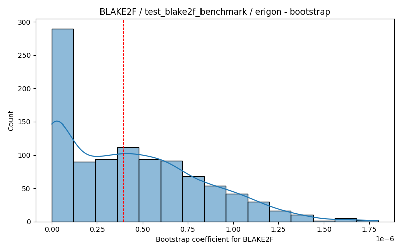

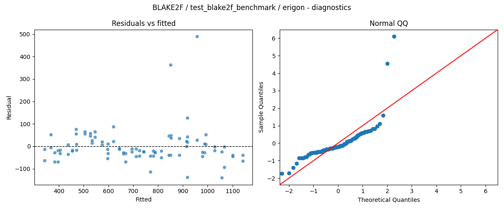

</details>

<details><summary>geth — NNLS regression summary</summary>

```
==============================================================================
                           NNLS Regression Results                            
==============================================================================
Dep. Variable:          test_runtime_ms              R-squared:          0.930
Model:                  NNLS                    Adj. R-squared:          0.930
No. Observations:       11176                             RMSE:          17.40
Df Residuals:           11173                              MAE:          13.91
Df Model:               2      
==============================================================================
                      coef     std err     P-value      [0.025      0.975]
------------------------------------------------------------------------------
         const     34.8251      0.5851       0.001     33.6719     35.8731
       opcount      0.0001      0.0000       0.001      0.0001      0.0001
    num_rounds      0.0000      0.0000       0.001      0.0000      0.0000
==============================================================================
Notes: Non-negative least squares with bootstrap inference (1000 iterations)
==============================================================================
```

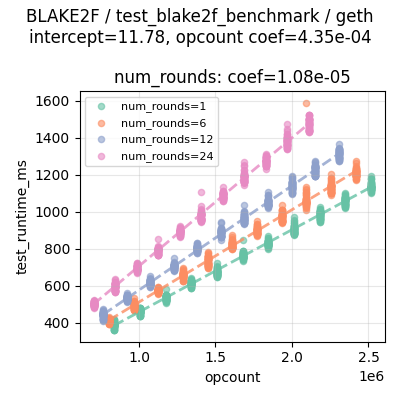

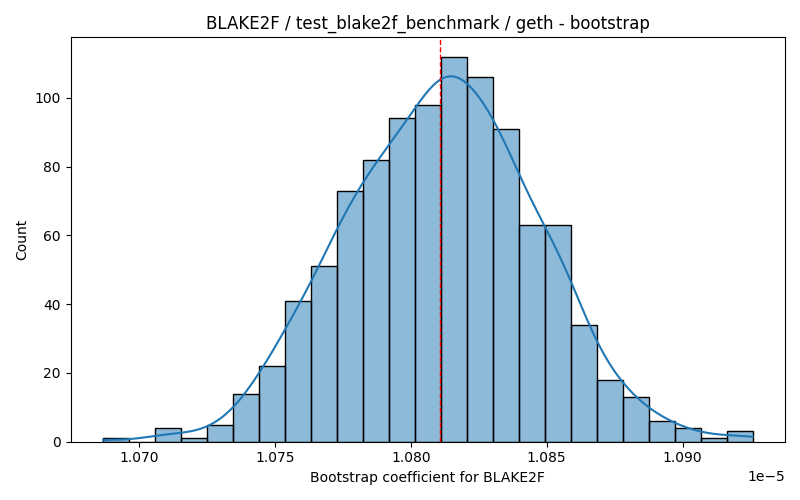

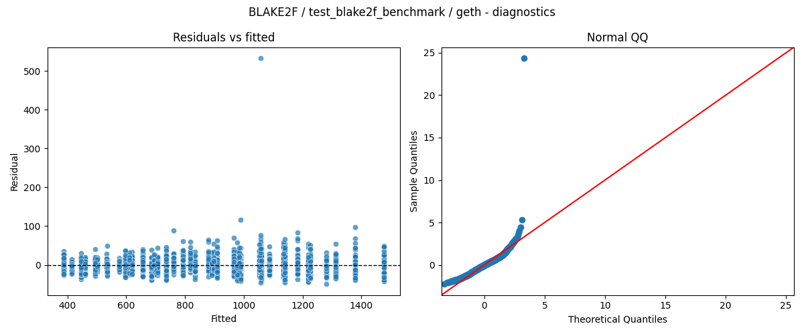

</details>

<details><summary>nethermind — NNLS regression summary</summary>

```
==============================================================================
                           NNLS Regression Results                            
==============================================================================
Dep. Variable:          test_runtime_ms              R-squared:          0.950
Model:                  NNLS                    Adj. R-squared:          0.950
No. Observations:       3256                              RMSE:          19.41
Df Residuals:           3253                               MAE:          16.08
Df Model:               2      
==============================================================================
                      coef     std err     P-value      [0.025      0.975]
------------------------------------------------------------------------------
         const     28.9058      0.9637       0.001     27.0245     30.6939
       opcount      0.0002      0.0000       0.001      0.0002      0.0002
    num_rounds      0.0000      0.0000       0.001      0.0000      0.0000
==============================================================================
Notes: Non-negative least squares with bootstrap inference (1000 iterations)
==============================================================================
```

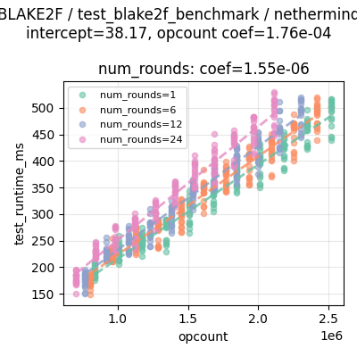

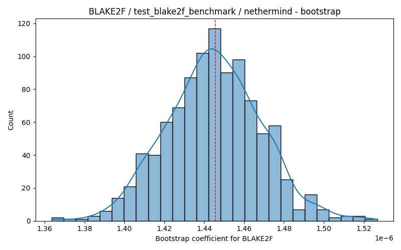

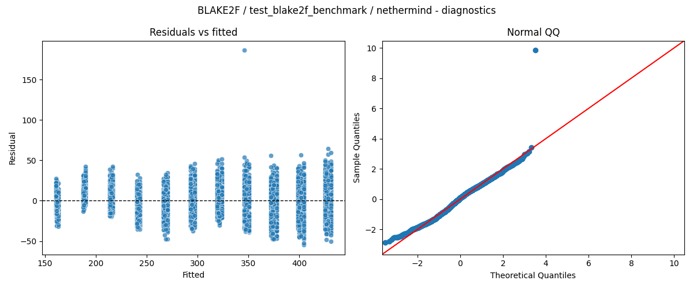

</details>

<details><summary>reth — NNLS regression summary</summary>

```
==============================================================================
                           NNLS Regression Results                            
==============================================================================
Dep. Variable:          test_runtime_ms              R-squared:          0.990
Model:                  NNLS                    Adj. R-squared:          0.989
No. Observations:       396                               RMSE:          19.75
Df Residuals:           393                                MAE:          15.67
Df Model:               2      
==============================================================================
                      coef     std err     P-value      [0.025      0.975]
------------------------------------------------------------------------------
         const     11.6857      3.0888       0.001      5.5188     17.8405
       opcount      0.0004      0.0000       0.001      0.0004      0.0004
    num_rounds      0.0000      0.0000       1.000      0.0000      0.0000
==============================================================================
Notes: Non-negative least squares with bootstrap inference (1000 iterations)
==============================================================================
```

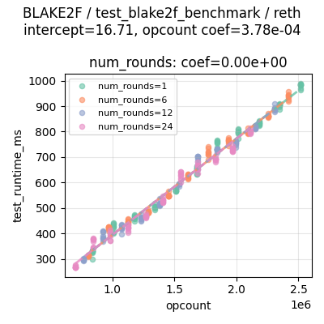


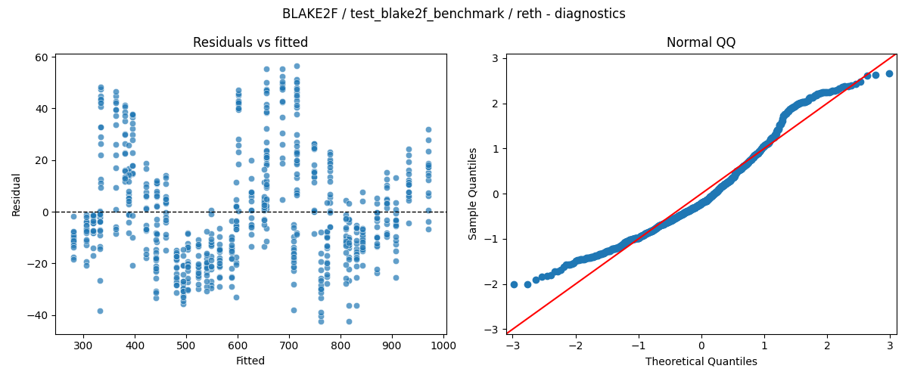

</details>

### test_blake2f_uncachable

| client | nobs | R² | target_coef (ms) | p-value | 95% CI |
| --- | --- | --- | --- | --- | --- |
| `besu` | 9592 | 0.8533 | 0.0004032 | 1.00e-03 | [0.0003994, 0.0004071] |
| `erigon` | 660 | 0.962 | 0.0009381 | 1.00e-03 | [0.0009224, 0.0009512] |
| `geth` | 11176 | 0.9238 | 0.0001358 | 1.00e-03 | [0.0001349, 0.0001366] |
| `nethermind` | 3256 | 0.94 | 0.0001651 | 1.00e-03 | [0.0001635, 0.0001666] |
| `reth` | 396 | 0.9875 | 0.0003756 | 1.00e-03 | [0.0003718, 0.0003789] |

<details><summary>besu — NNLS regression summary</summary>

```
==============================================================================
                           NNLS Regression Results                            
==============================================================================
Dep. Variable:          test_runtime_ms              R-squared:          0.853
Model:                  NNLS                    Adj. R-squared:          0.853
No. Observations:       9592                              RMSE:          71.92
Df Residuals:           9589                               MAE:          60.81
Df Model:               2      
==============================================================================
                      coef     std err     P-value      [0.025      0.975]
------------------------------------------------------------------------------
         const    155.6605      2.7888       0.001    150.1999    161.1063
       opcount      0.0004      0.0000       0.001      0.0004      0.0004
    num_rounds      0.0000      0.0000       0.001      0.0000      0.0000
==============================================================================
Notes: Non-negative least squares with bootstrap inference (1000 iterations)
==============================================================================
```

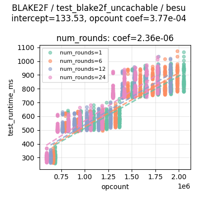

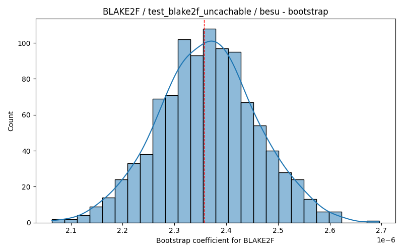

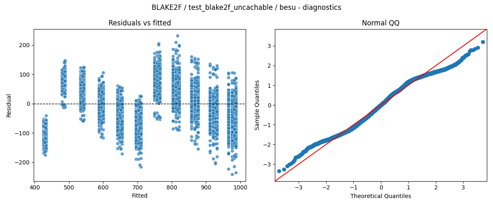

</details>

<details><summary>erigon — NNLS regression summary</summary>

```
==============================================================================
                           NNLS Regression Results                            
==============================================================================
Dep. Variable:          test_runtime_ms              R-squared:          0.962
Model:                  NNLS                    Adj. R-squared:          0.962
No. Observations:       660                               RMSE:          77.06
Df Residuals:           657                                MAE:          56.97
Df Model:               2      
==============================================================================
                      coef     std err     P-value      [0.025      0.975]
------------------------------------------------------------------------------
         const     46.4907      9.8797       0.001     27.2797     66.9200
       opcount      0.0009      0.0000       0.001      0.0009      0.0010
    num_rounds      0.0000      0.0000       0.461      0.0000      0.0000
==============================================================================
Notes: Non-negative least squares with bootstrap inference (1000 iterations)
==============================================================================
```

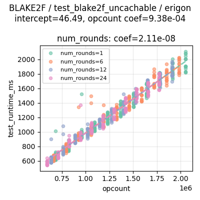

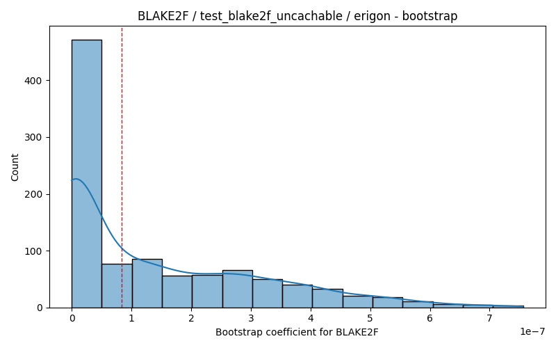

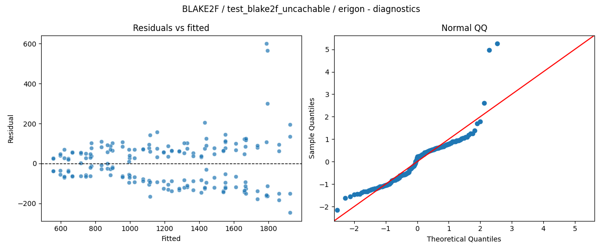

</details>

<details><summary>geth — NNLS regression summary</summary>

```
==============================================================================
                           NNLS Regression Results                            
==============================================================================
Dep. Variable:          test_runtime_ms              R-squared:          0.924
Model:                  NNLS                    Adj. R-squared:          0.924
No. Observations:       11176                             RMSE:          18.44
Df Residuals:           11173                              MAE:          14.56
Df Model:               2      
==============================================================================
                      coef     std err     P-value      [0.025      0.975]
------------------------------------------------------------------------------
         const     23.9426      0.6363       0.001     22.7571     25.2218
       opcount      0.0001      0.0000       0.001      0.0001      0.0001
    num_rounds      0.0000      0.0000       0.001      0.0000      0.0000
==============================================================================
Notes: Non-negative least squares with bootstrap inference (1000 iterations)
==============================================================================
```

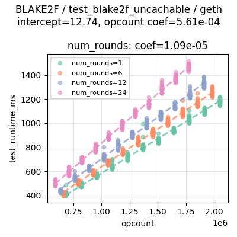

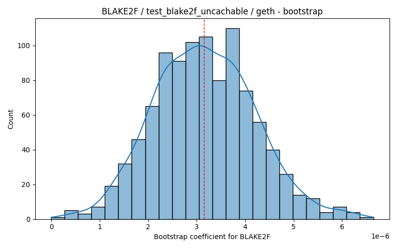

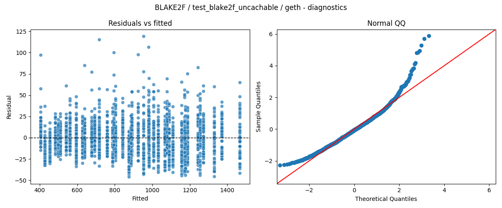

</details>

<details><summary>nethermind — NNLS regression summary</summary>

```
==============================================================================
                           NNLS Regression Results                            
==============================================================================
Dep. Variable:          test_runtime_ms              R-squared:          0.940
Model:                  NNLS                    Adj. R-squared:          0.940
No. Observations:       3256                              RMSE:          18.61
Df Residuals:           3253                               MAE:          14.80
Df Model:               2      
==============================================================================
                      coef     std err     P-value      [0.025      0.975]
------------------------------------------------------------------------------
         const     26.9811      0.9492       0.001     25.1916     29.0140
       opcount      0.0002      0.0000       0.001      0.0002      0.0002
    num_rounds      0.0000      0.0000       0.001      0.0000      0.0000
==============================================================================
Notes: Non-negative least squares with bootstrap inference (1000 iterations)
==============================================================================
```

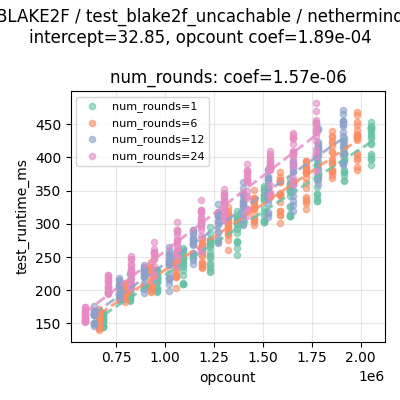

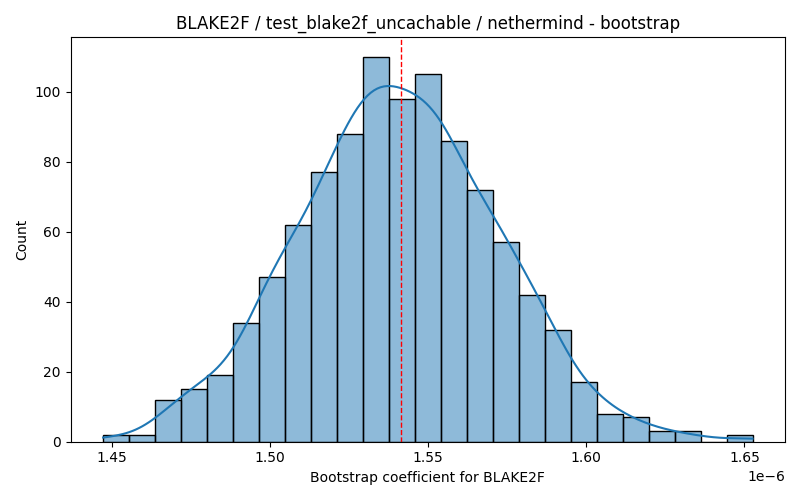

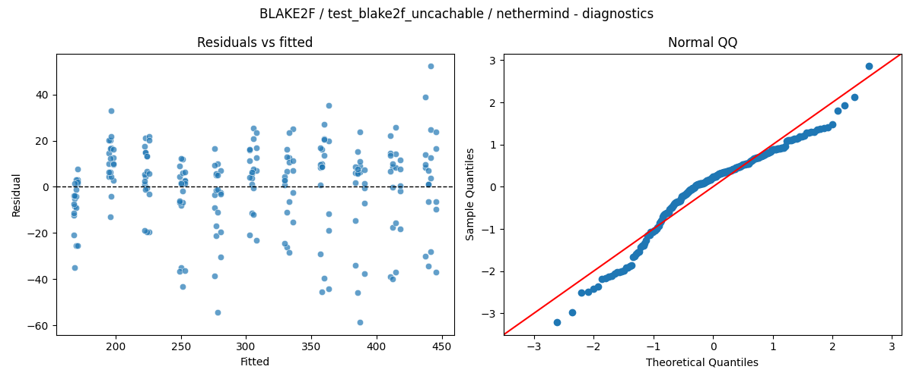

</details>

<details><summary>reth — NNLS regression summary</summary>

```
==============================================================================
                           NNLS Regression Results                            
==============================================================================
Dep. Variable:          test_runtime_ms              R-squared:          0.988
Model:                  NNLS                    Adj. R-squared:          0.987
No. Observations:       396                               RMSE:          17.44
Df Residuals:           393                                MAE:          14.04
Df Model:               2      
==============================================================================
                      coef     std err     P-value      [0.025      0.975]
------------------------------------------------------------------------------
         const     16.4682      2.6589       0.001     11.4694     21.9744
       opcount      0.0004      0.0000       0.001      0.0004      0.0004
    num_rounds      0.0000      0.0000       1.000      0.0000      0.0000
==============================================================================
Notes: Non-negative least squares with bootstrap inference (1000 iterations)
==============================================================================
```

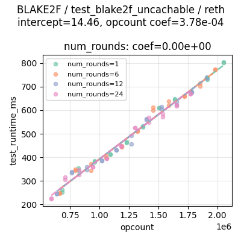

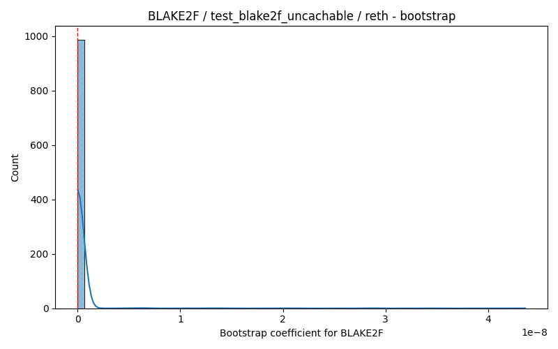

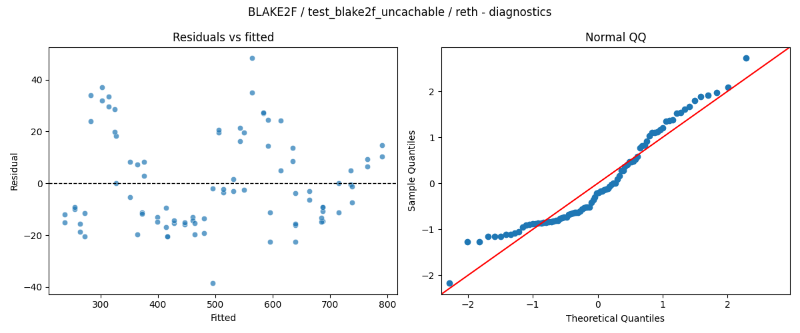

</details>

## BLS12_G1ADD

### test_bls12_381

| client | nobs | R² | target_coef (ms) | p-value | 95% CI |
| --- | --- | --- | --- | --- | --- |
| `besu` | 2398 | 0.854 | 0.00174 | 1.00e-03 | [0.001709, 0.001769] |
| `erigon` | 165 | 0.8474 | 0.0009948 | 1.00e-03 | [0.0009471, 0.001034] |
| `geth` | 2794 | 0.9003 | 0.0007318 | 1.00e-03 | [0.0007219, 0.0007417] |
| `nethermind` | 814 | 0.939 | 0.0009694 | 1.00e-03 | [0.0009533, 0.0009855] |
| `reth` | 99 | 0.8538 | 0.0007585 | 1.00e-03 | [0.0006852, 0.000828] |

<details><summary>besu — NNLS regression summary</summary>

```
==============================================================================
                           NNLS Regression Results                            
==============================================================================
Dep. Variable:          test_runtime_ms              R-squared:          0.854
Model:                  NNLS                    Adj. R-squared:          0.854
No. Observations:       2398                              RMSE:          92.15
Df Residuals:           2396                               MAE:          73.11
Df Model:               1      
==============================================================================
                      coef     std err     P-value      [0.025      0.975]
------------------------------------------------------------------------------
         const    100.3777      7.1421       0.001     86.8052    114.7729
       opcount      0.0017      0.0000       0.001      0.0017      0.0018
==============================================================================
Notes: Non-negative least squares with bootstrap inference (1000 iterations)
==============================================================================
```

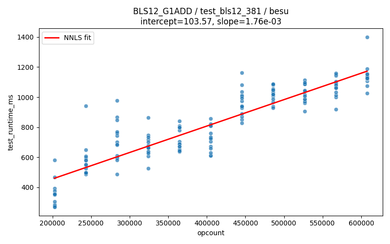

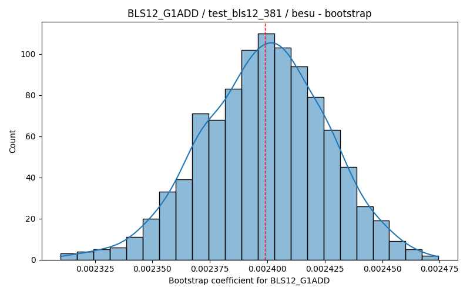

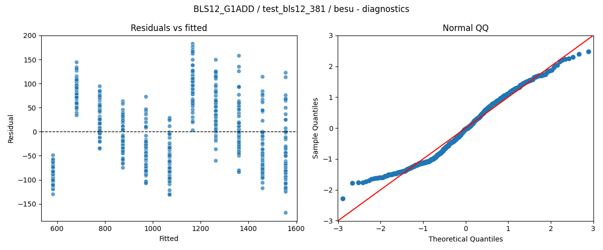

</details>

<details><summary>erigon — NNLS regression summary</summary>

```
==============================================================================
                           NNLS Regression Results                            
==============================================================================
Dep. Variable:          test_runtime_ms              R-squared:          0.847
Model:                  NNLS                    Adj. R-squared:          0.846
No. Observations:       165                               RMSE:          54.08
Df Residuals:           163                                MAE:          36.47
Df Model:               1      
==============================================================================
                      coef     std err     P-value      [0.025      0.975]
------------------------------------------------------------------------------
         const     44.1424     10.8727       0.001     25.3249     67.2779
       opcount      0.0010      0.0000       0.001      0.0009      0.0010
==============================================================================
Notes: Non-negative least squares with bootstrap inference (1000 iterations)
==============================================================================
```

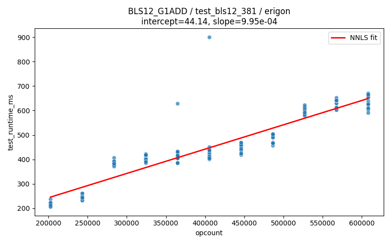

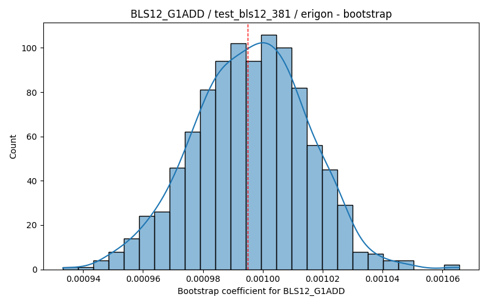

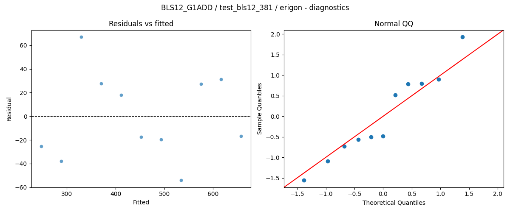

</details>

<details><summary>geth — NNLS regression summary</summary>

```
==============================================================================
                           NNLS Regression Results                            
==============================================================================
Dep. Variable:          test_runtime_ms              R-squared:          0.900
Model:                  NNLS                    Adj. R-squared:          0.900
No. Observations:       2794                              RMSE:          31.20
Df Residuals:           2792                               MAE:          26.30
Df Model:               1      
==============================================================================
                      coef     std err     P-value      [0.025      0.975]
------------------------------------------------------------------------------
         const     65.6485      2.2883       0.001     61.3691     70.2046
       opcount      0.0007      0.0000       0.001      0.0007      0.0007
==============================================================================
Notes: Non-negative least squares with bootstrap inference (1000 iterations)
==============================================================================
```

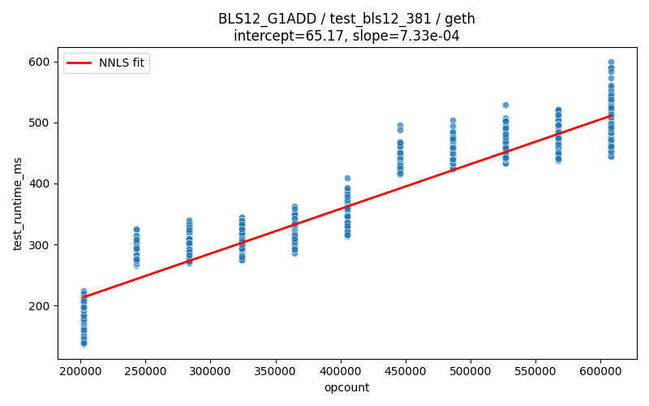

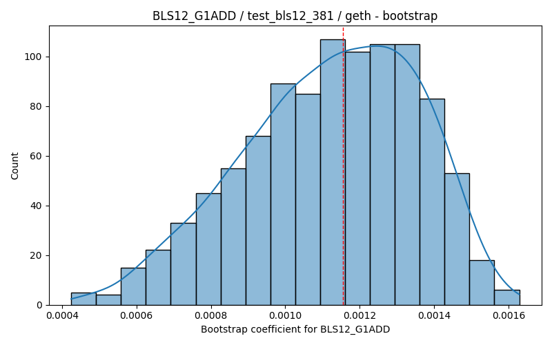

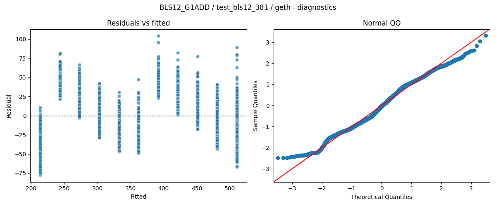

</details>

<details><summary>nethermind — NNLS regression summary</summary>

```
==============================================================================
                           NNLS Regression Results                            
==============================================================================
Dep. Variable:          test_runtime_ms              R-squared:          0.939
Model:                  NNLS                    Adj. R-squared:          0.939
No. Observations:       814                               RMSE:          31.65
Df Residuals:           812                                MAE:          25.76
Df Model:               1      
==============================================================================
                      coef     std err     P-value      [0.025      0.975]
------------------------------------------------------------------------------
         const     76.6096      3.3261       0.001     70.3721     82.8366
       opcount      0.0010      0.0000       0.001      0.0010      0.0010
==============================================================================
Notes: Non-negative least squares with bootstrap inference (1000 iterations)
==============================================================================
```

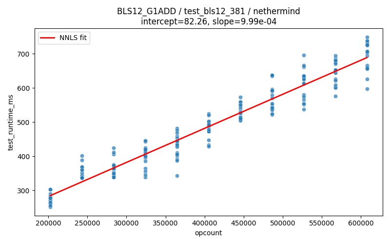

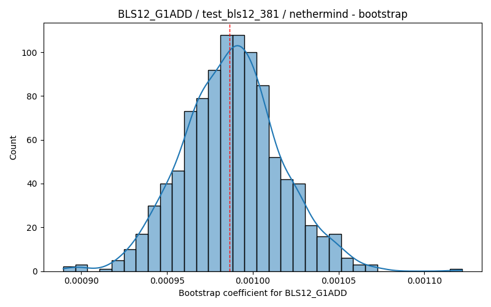

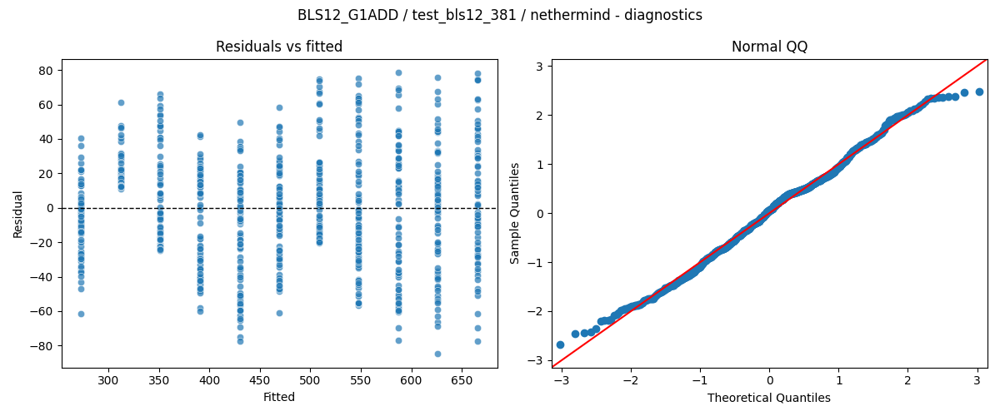

</details>

<details><summary>reth — NNLS regression summary</summary>

```
==============================================================================
                           NNLS Regression Results                            
==============================================================================
Dep. Variable:          test_runtime_ms              R-squared:          0.854
Model:                  NNLS                    Adj. R-squared:          0.852
No. Observations:       99                                RMSE:          40.20
Df Residuals:           97                                 MAE:          34.13
Df Model:               1      
==============================================================================
                      coef     std err     P-value      [0.025      0.975]
------------------------------------------------------------------------------
         const     90.0398     16.2699       0.001     58.7032    123.1038
       opcount      0.0008      0.0000       0.001      0.0007      0.0008
==============================================================================
Notes: Non-negative least squares with bootstrap inference (1000 iterations)
==============================================================================
```

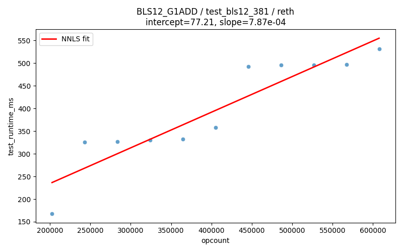

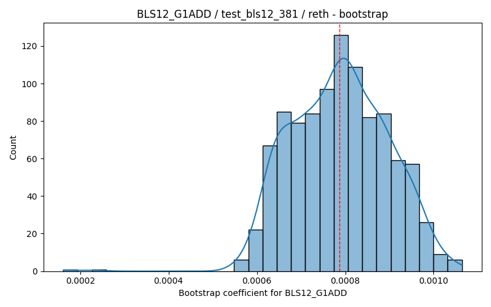

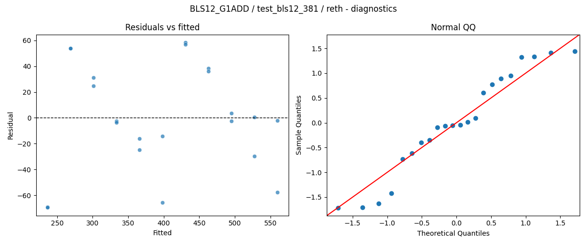

</details>

## BLS12_G2ADD

### test_bls12_381

| client | nobs | R² | target_coef (ms) | p-value | 95% CI |
| --- | --- | --- | --- | --- | --- |
| `besu` | 2398 | 0.8653 | 0.002111 | 1.00e-03 | [0.002078, 0.002146] |
| `erigon` | 165 | 0.8671 | 0.00125 | 1.00e-03 | [0.001189, 0.001302] |
| `geth` | 2794 | 0.8985 | 0.001049 | 1.00e-03 | [0.001034, 0.001064] |
| `nethermind` | 814 | 0.9351 | 0.001485 | 1.00e-03 | [0.00146, 0.001511] |
| `reth` | 99 | 0.8454 | 0.001013 | 1.00e-03 | [0.0009255, 0.001108] |

<details><summary>besu — NNLS regression summary</summary>

```
==============================================================================
                           NNLS Regression Results                            
==============================================================================
Dep. Variable:          test_runtime_ms              R-squared:          0.865
Model:                  NNLS                    Adj. R-squared:          0.865
No. Observations:       2398                              RMSE:          73.26
Df Residuals:           2396                               MAE:          59.07
Df Model:               1      
==============================================================================
                      coef     std err     P-value      [0.025      0.975]
------------------------------------------------------------------------------
         const     91.4534      5.1640       0.001     81.2395    100.8937
       opcount      0.0021      0.0000       0.001      0.0021      0.0021
==============================================================================
Notes: Non-negative least squares with bootstrap inference (1000 iterations)
==============================================================================
```

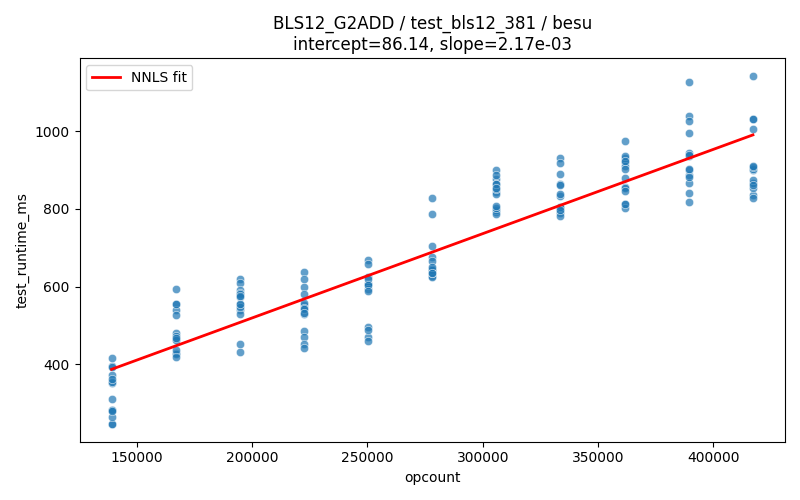

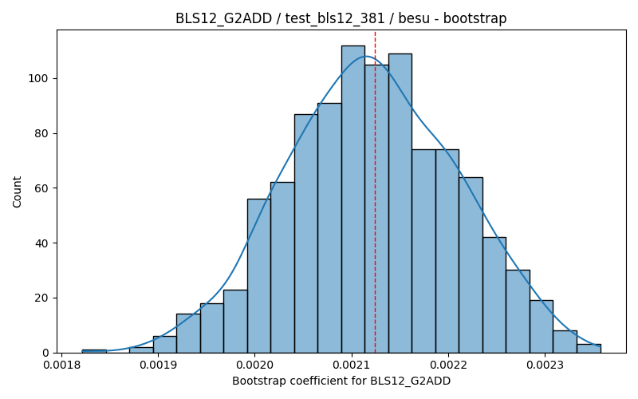

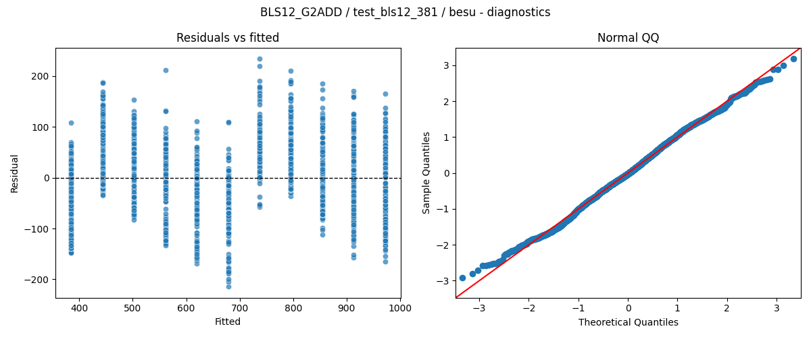

</details>

<details><summary>erigon — NNLS regression summary</summary>

```
==============================================================================
                           NNLS Regression Results                            
==============================================================================
Dep. Variable:          test_runtime_ms              R-squared:          0.867
Model:                  NNLS                    Adj. R-squared:          0.866
No. Observations:       165                               RMSE:          43.04
Df Residuals:           163                                MAE:          32.31
Df Model:               1      
==============================================================================
                      coef     std err     P-value      [0.025      0.975]
------------------------------------------------------------------------------
         const     44.4318      9.2734       0.001     27.8605     64.7683
       opcount      0.0013      0.0000       0.001      0.0012      0.0013
==============================================================================
Notes: Non-negative least squares with bootstrap inference (1000 iterations)
==============================================================================
```

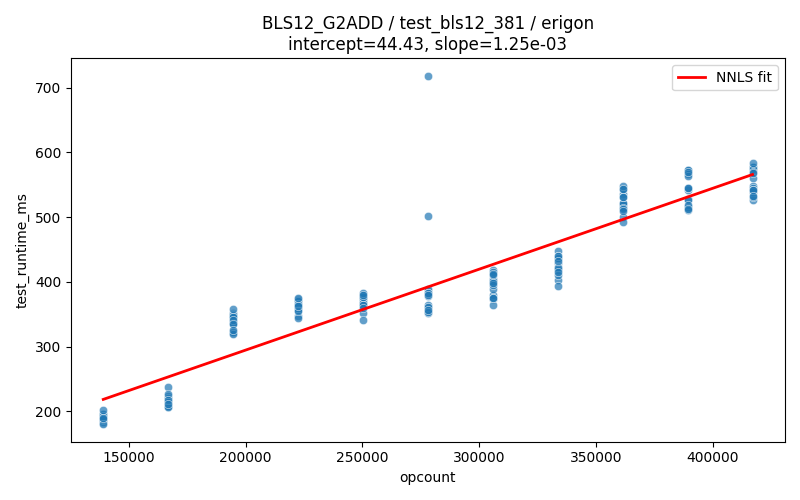

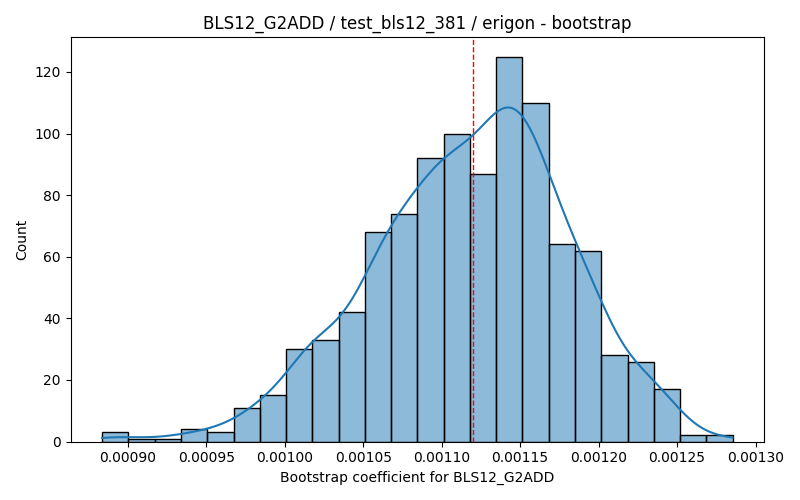

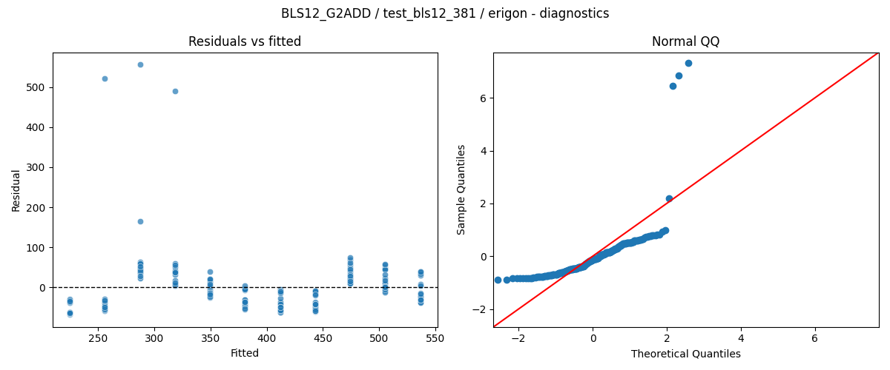

</details>

<details><summary>geth — NNLS regression summary</summary>

```
==============================================================================
                           NNLS Regression Results                            
==============================================================================
Dep. Variable:          test_runtime_ms              R-squared:          0.899
Model:                  NNLS                    Adj. R-squared:          0.899
No. Observations:       2794                              RMSE:          30.99
Df Residuals:           2792                               MAE:          25.90
Df Model:               1      
==============================================================================
                      coef     std err     P-value      [0.025      0.975]
------------------------------------------------------------------------------
         const     54.9370      2.2772       0.001     50.4103     59.3986
       opcount      0.0010      0.0000       0.001      0.0010      0.0011
==============================================================================
Notes: Non-negative least squares with bootstrap inference (1000 iterations)
==============================================================================
```

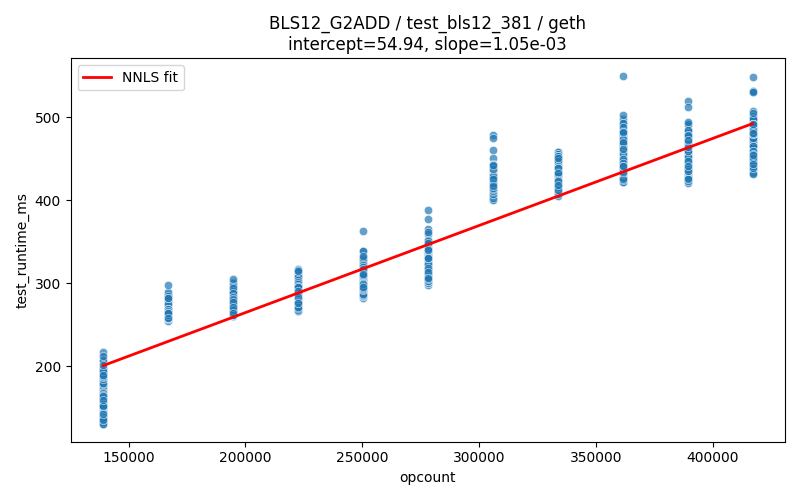

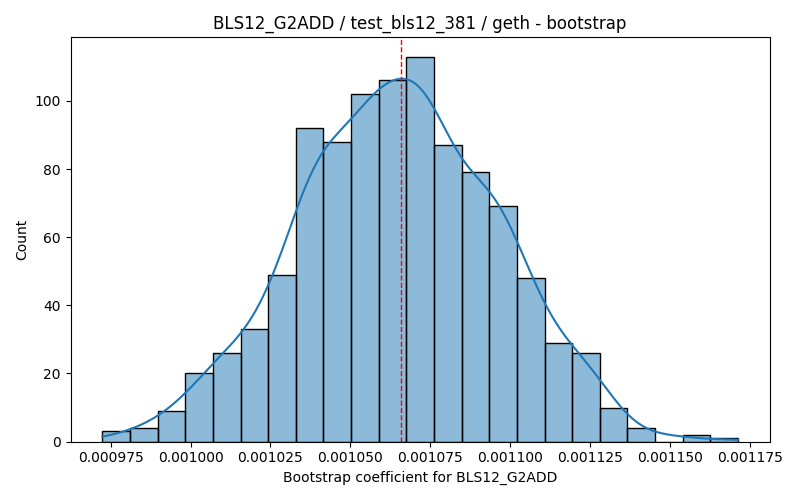

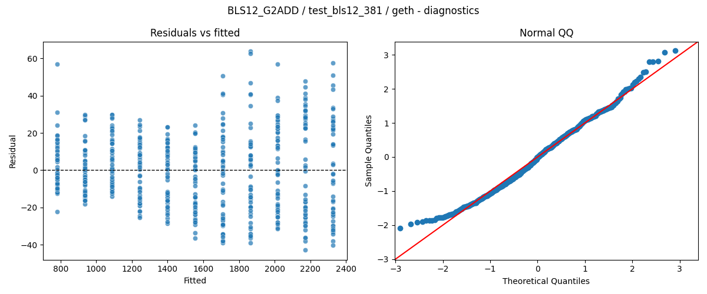

</details>

<details><summary>nethermind — NNLS regression summary</summary>

```
==============================================================================
                           NNLS Regression Results                            
==============================================================================
Dep. Variable:          test_runtime_ms              R-squared:          0.935
Model:                  NNLS                    Adj. R-squared:          0.935
No. Observations:       814                               RMSE:          34.41
Df Residuals:           812                                MAE:          27.32
Df Model:               1      
==============================================================================
                      coef     std err     P-value      [0.025      0.975]
------------------------------------------------------------------------------
         const     82.7569      3.5509       0.001     75.9427     89.3956
       opcount      0.0015      0.0000       0.001      0.0015      0.0015
==============================================================================
Notes: Non-negative least squares with bootstrap inference (1000 iterations)
==============================================================================
```

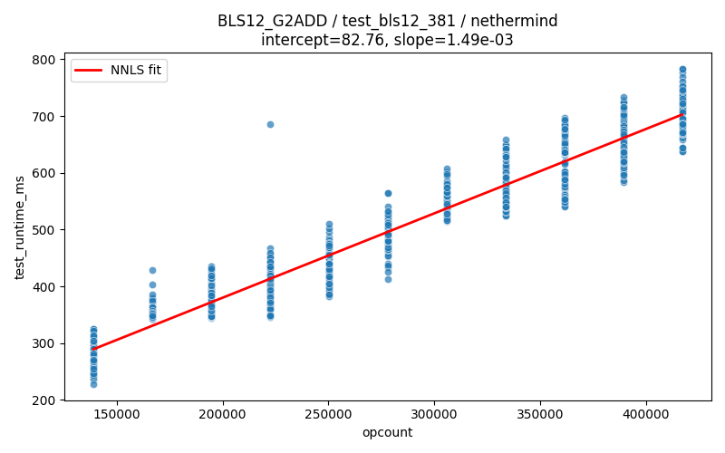

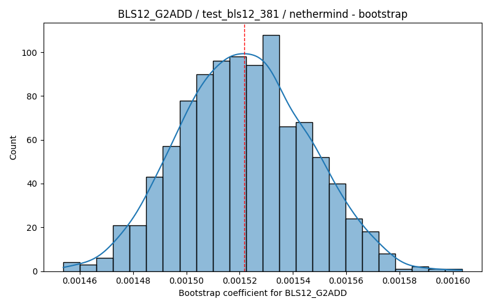

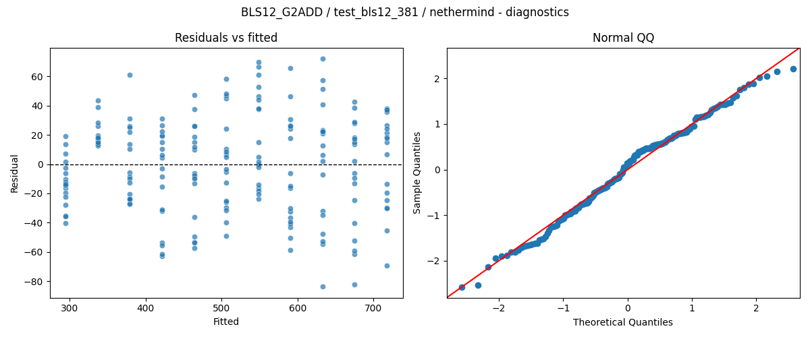

</details>

<details><summary>reth — NNLS regression summary</summary>

```
==============================================================================
                           NNLS Regression Results                            
==============================================================================
Dep. Variable:          test_runtime_ms              R-squared:          0.845
Model:                  NNLS                    Adj. R-squared:          0.844
No. Observations:       99                                RMSE:          38.10
Df Residuals:           97                                 MAE:          31.07
Df Model:               1      
==============================================================================
                      coef     std err     P-value      [0.025      0.975]
------------------------------------------------------------------------------
         const    100.4848     14.6671       0.001     72.5037    128.0705
       opcount      0.0010      0.0000       0.001      0.0009      0.0011
==============================================================================
Notes: Non-negative least squares with bootstrap inference (1000 iterations)
==============================================================================
```

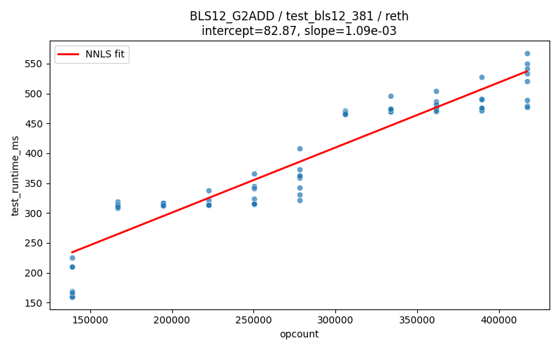

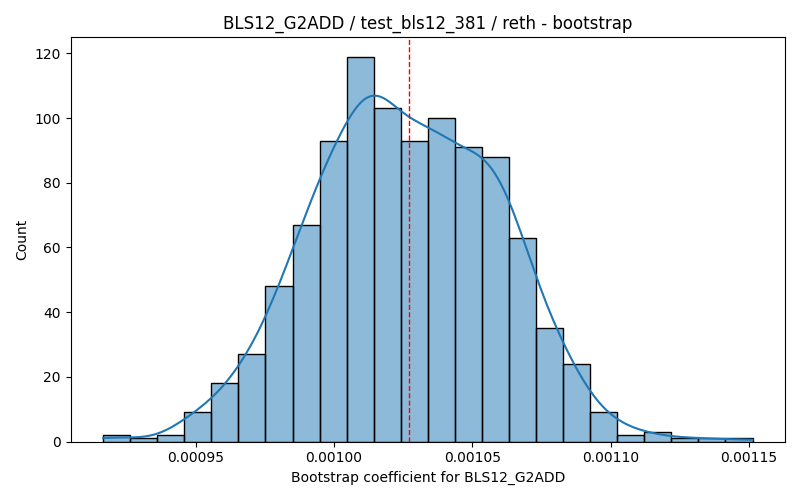

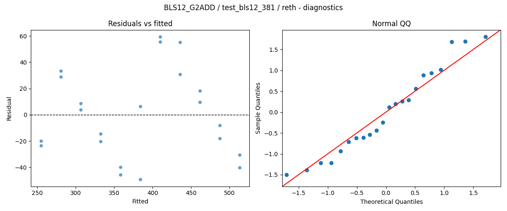

</details>

## ECADD

### test_alt_bn128 — combo `add`

| client | nobs | R² | target_coef (ms) | p-value | 95% CI |
| --- | --- | --- | --- | --- | --- |
| `besu` | 2398 | 0.8848 | 0.0006236 | 1.00e-03 | [0.000614, 0.0006327] |
| `erigon` | 165 | 0.93 | 0.0007149 | 1.00e-03 | [0.000685, 0.0007398] |
| `geth` | 2794 | 0.8797 | 0.0003889 | 1.00e-03 | [0.0003837, 0.000394] |
| `nethermind` | 814 | 0.9205 | 0.0004384 | 1.00e-03 | [0.0004301, 0.0004474] |
| `reth` | 99 | 0.867 | 0.0005895 | 1.00e-03 | [0.0005412, 0.0006379] |

<details><summary>besu — NNLS regression summary</summary>

```
==============================================================================
                           NNLS Regression Results                            
==============================================================================
Dep. Variable:          test_runtime_ms              R-squared:          0.885
Model:                  NNLS                    Adj. R-squared:          0.885
No. Observations:       2398                              RMSE:          53.02
Df Residuals:           2396                               MAE:          44.98
Df Model:               1      
==============================================================================
                      coef     std err     P-value      [0.025      0.975]
------------------------------------------------------------------------------
         const    147.3710      3.9883       0.001    139.6678    155.2236
       opcount      0.0006      0.0000       0.001      0.0006      0.0006
==============================================================================
Notes: Non-negative least squares with bootstrap inference (1000 iterations)
==============================================================================
```


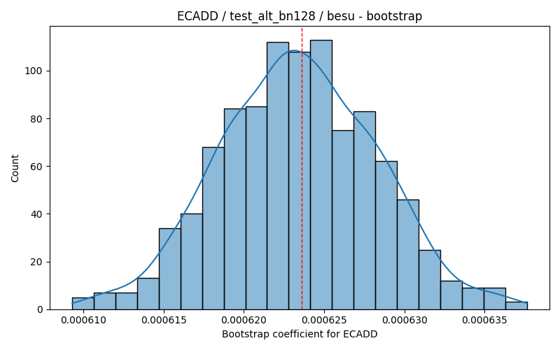

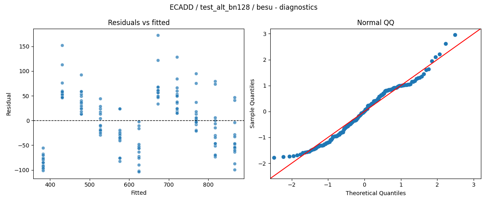

</details>

<details><summary>erigon — NNLS regression summary</summary>

```
==============================================================================
                           NNLS Regression Results                            
==============================================================================
Dep. Variable:          test_runtime_ms              R-squared:          0.930
Model:                  NNLS                    Adj. R-squared:          0.930
No. Observations:       165                               RMSE:          46.24
Df Residuals:           163                                MAE:          39.23
Df Model:               1      
==============================================================================
                      coef     std err     P-value      [0.025      0.975]
------------------------------------------------------------------------------
         const     42.0966     11.5712       0.001     21.6733     65.9673
       opcount      0.0007      0.0000       0.001      0.0007      0.0007
==============================================================================
Notes: Non-negative least squares with bootstrap inference (1000 iterations)
==============================================================================
```

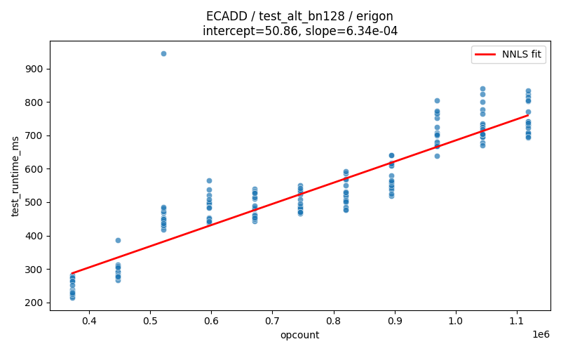

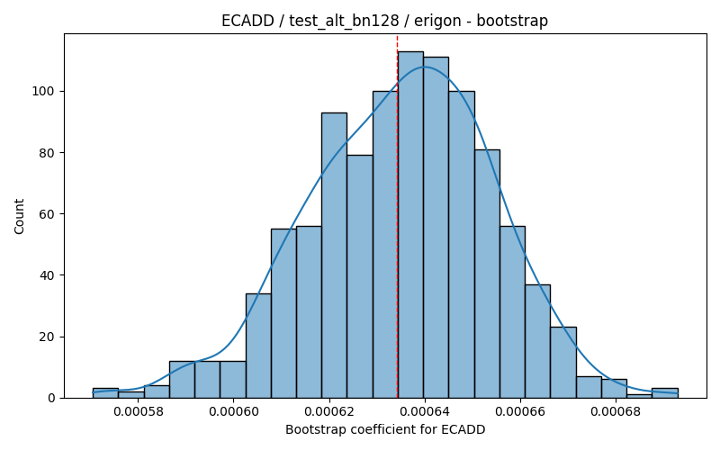

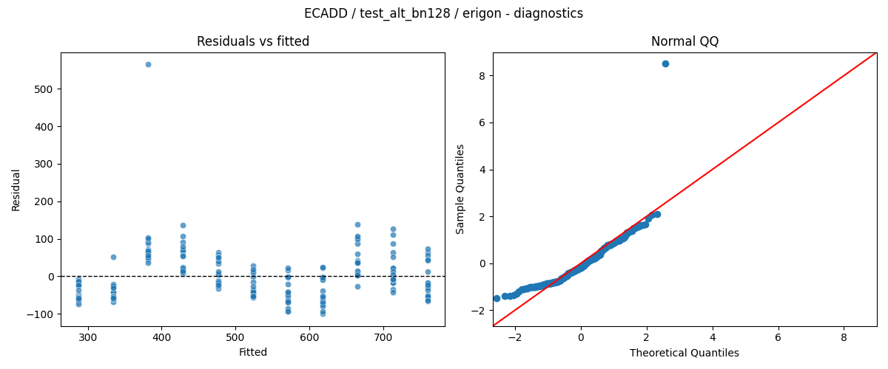

</details>

<details><summary>geth — NNLS regression summary</summary>

```
==============================================================================
                           NNLS Regression Results                            
==============================================================================
Dep. Variable:          test_runtime_ms              R-squared:          0.880
Model:                  NNLS                    Adj. R-squared:          0.880
No. Observations:       2794                              RMSE:          33.89
Df Residuals:           2792                               MAE:          29.19
Df Model:               1      
==============================================================================
                      coef     std err     P-value      [0.025      0.975]
------------------------------------------------------------------------------
         const     80.3756      2.2631       0.001     75.8041     84.6248
       opcount      0.0004      0.0000       0.001      0.0004      0.0004
==============================================================================
Notes: Non-negative least squares with bootstrap inference (1000 iterations)
==============================================================================
```

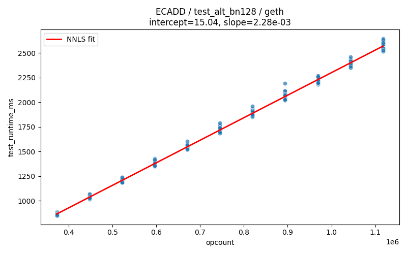

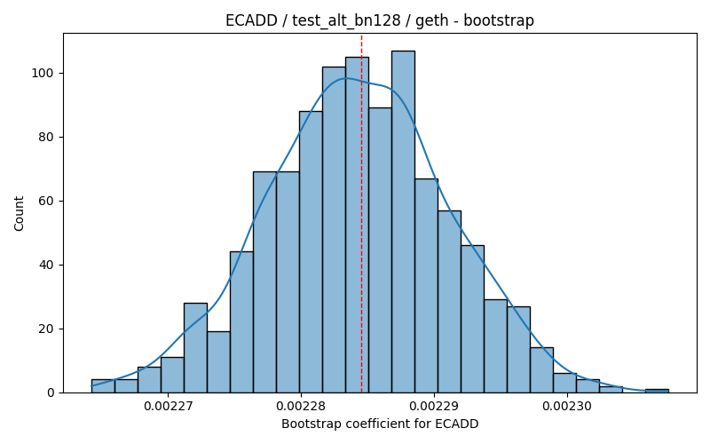

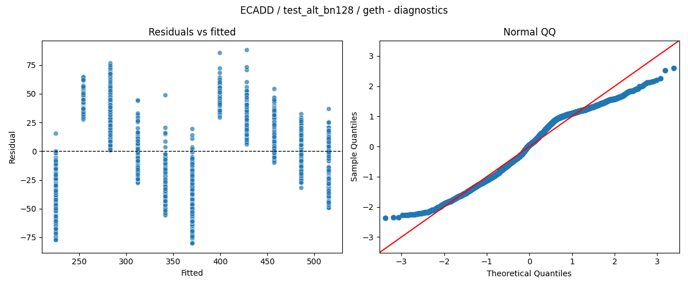

</details>

<details><summary>nethermind — NNLS regression summary</summary>

```
==============================================================================
                           NNLS Regression Results                            
==============================================================================
Dep. Variable:          test_runtime_ms              R-squared:          0.921
Model:                  NNLS                    Adj. R-squared:          0.920
No. Observations:       814                               RMSE:          30.35
Df Residuals:           812                                MAE:          23.98
Df Model:               1      
==============================================================================
                      coef     std err     P-value      [0.025      0.975]
------------------------------------------------------------------------------
         const     77.5782      3.2851       0.001     70.8837     83.8647
       opcount      0.0004      0.0000       0.001      0.0004      0.0004
==============================================================================
Notes: Non-negative least squares with bootstrap inference (1000 iterations)
==============================================================================
```

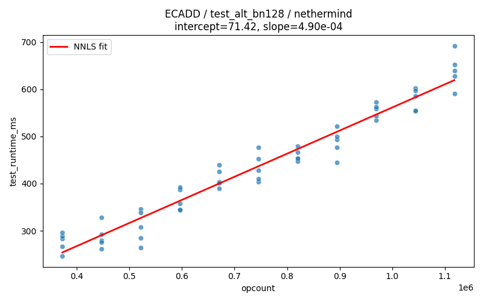

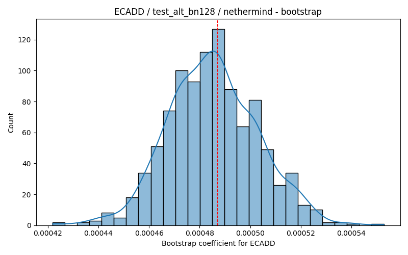

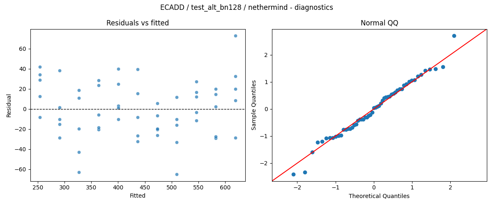

</details>

<details><summary>reth — NNLS regression summary</summary>

```
==============================================================================
                           NNLS Regression Results                            
==============================================================================
Dep. Variable:          test_runtime_ms              R-squared:          0.867
Model:                  NNLS                    Adj. R-squared:          0.866
No. Observations:       99                                RMSE:          54.42
Df Residuals:           97                                 MAE:          45.80
Df Model:               1      
==============================================================================
                      coef     std err     P-value      [0.025      0.975]
------------------------------------------------------------------------------
         const    133.0129     20.8191       0.001     93.7482    175.6213
       opcount      0.0006      0.0000       0.001      0.0005      0.0006
==============================================================================
Notes: Non-negative least squares with bootstrap inference (1000 iterations)
==============================================================================
```

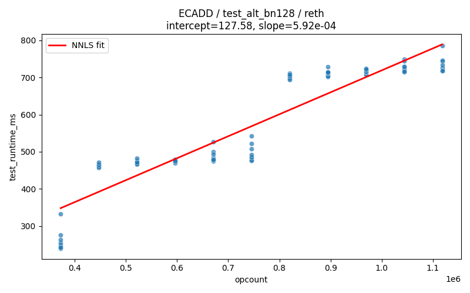

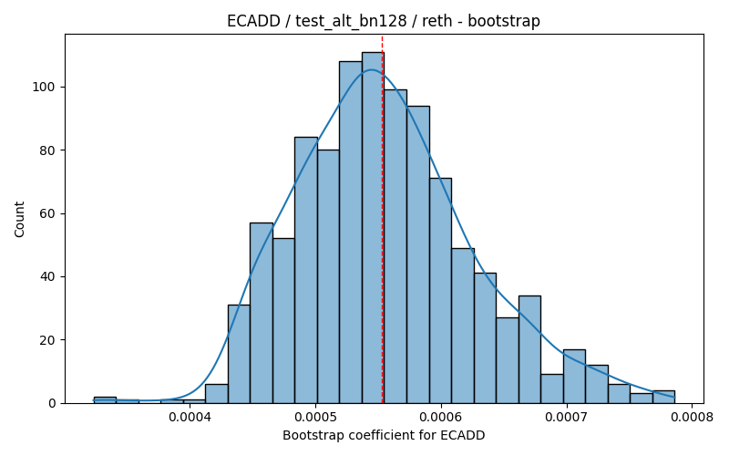

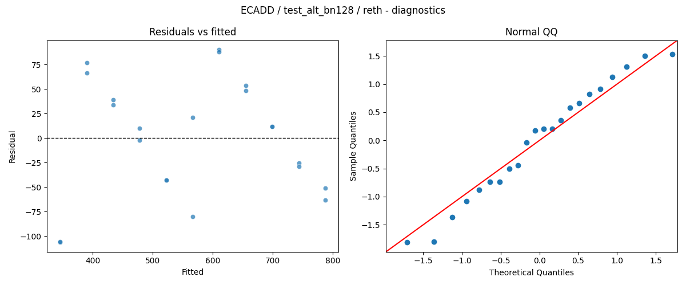

</details>

### test_alt_bn128 — combo `add_infinities`

| client | nobs | R² | target_coef (ms) | p-value | 95% CI |
| --- | --- | --- | --- | --- | --- |
| `besu` | 2398 | 0.8901 | 0.0003658 | 1.00e-03 | [0.0003606, 0.0003715] |
| `erigon` | 165 | 0.9053 | 0.000573 | 1.00e-03 | [0.0005546, 0.0005888] |
| `geth` | 2794 | 0.7898 | 0.0001094 | 1.00e-03 | [0.0001075, 0.0001113] |
| `nethermind` | 814 | 0.9308 | 0.0002008 | 1.00e-03 | [0.0001973, 0.0002046] |
| `reth` | 99 | 0.9867 | 0.0003772 | 1.00e-03 | [0.0003692, 0.0003854] |

<details><summary>besu — NNLS regression summary</summary>

```
==============================================================================
                           NNLS Regression Results                            
==============================================================================
Dep. Variable:          test_runtime_ms              R-squared:          0.890
Model:                  NNLS                    Adj. R-squared:          0.890
No. Observations:       2398                              RMSE:          30.29
Df Residuals:           2396                               MAE:          25.53
Df Model:               1      
==============================================================================
                      coef     std err     P-value      [0.025      0.975]
------------------------------------------------------------------------------
         const     77.8359      2.2951       0.001     73.3010     82.1016
       opcount      0.0004      0.0000       0.001      0.0004      0.0004
==============================================================================
Notes: Non-negative least squares with bootstrap inference (1000 iterations)
==============================================================================
```

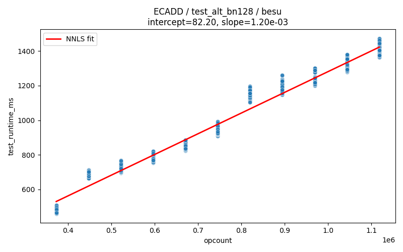

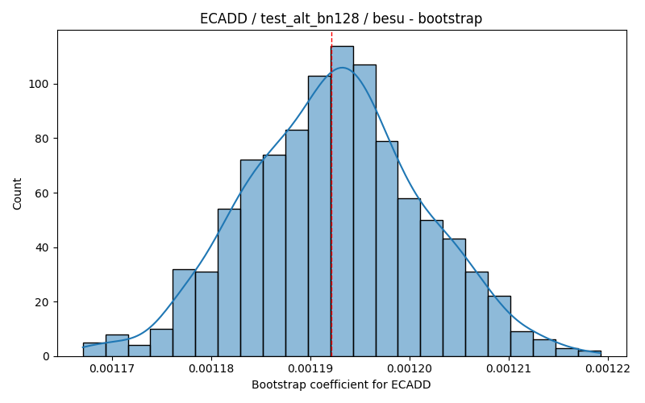

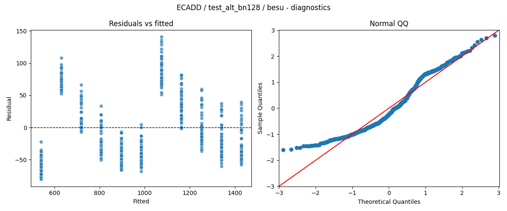

</details>

<details><summary>erigon — NNLS regression summary</summary>

```
==============================================================================
                           NNLS Regression Results                            
==============================================================================
Dep. Variable:          test_runtime_ms              R-squared:          0.905
Model:                  NNLS                    Adj. R-squared:          0.905
No. Observations:       165                               RMSE:          43.69
Df Residuals:           163                                MAE:          22.89
Df Model:               1      
==============================================================================
                      coef     std err     P-value      [0.025      0.975]
------------------------------------------------------------------------------
         const     21.6737      7.8106       0.001      9.0244     39.7597
       opcount      0.0006      0.0000       0.001      0.0006      0.0006
==============================================================================
Notes: Non-negative least squares with bootstrap inference (1000 iterations)
==============================================================================
```

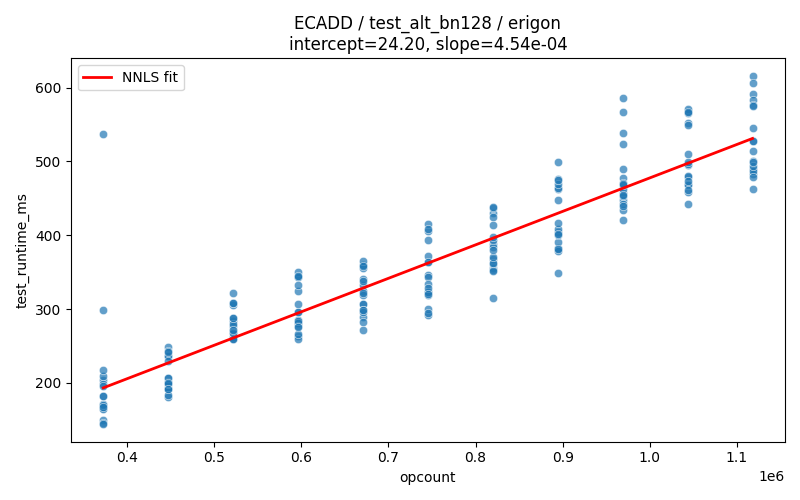

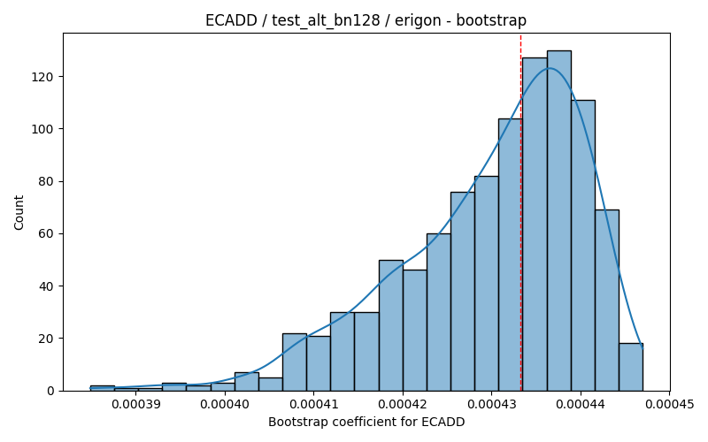

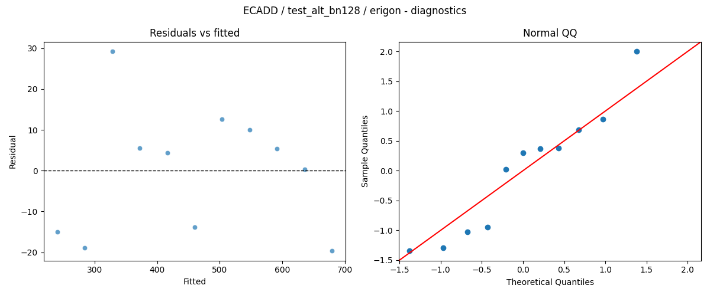

</details>

<details><summary>geth — NNLS regression summary</summary>

```
==============================================================================
                           NNLS Regression Results                            
==============================================================================
Dep. Variable:          test_runtime_ms              R-squared:          0.790
Model:                  NNLS                    Adj. R-squared:          0.790
No. Observations:       2794                              RMSE:          13.30
Df Residuals:           2792                               MAE:          10.54
Df Model:               1      
==============================================================================
                      coef     std err     P-value      [0.025      0.975]
------------------------------------------------------------------------------
         const     12.9582      0.8424       0.001     11.3446     14.5628
       opcount      0.0001      0.0000       0.001      0.0001      0.0001
==============================================================================
Notes: Non-negative least squares with bootstrap inference (1000 iterations)
==============================================================================
```

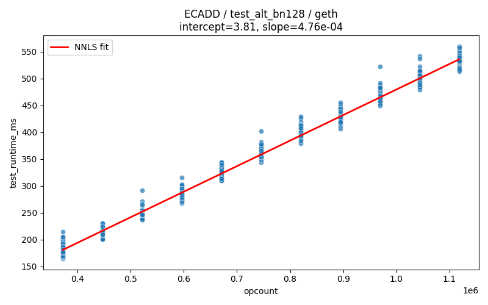

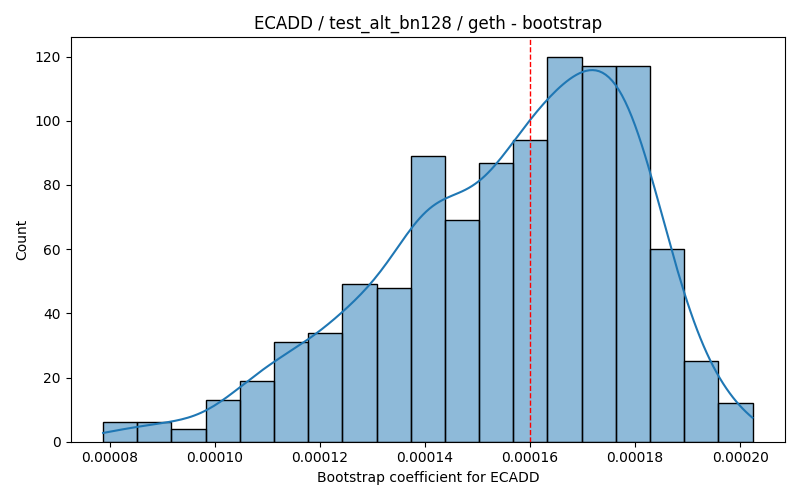

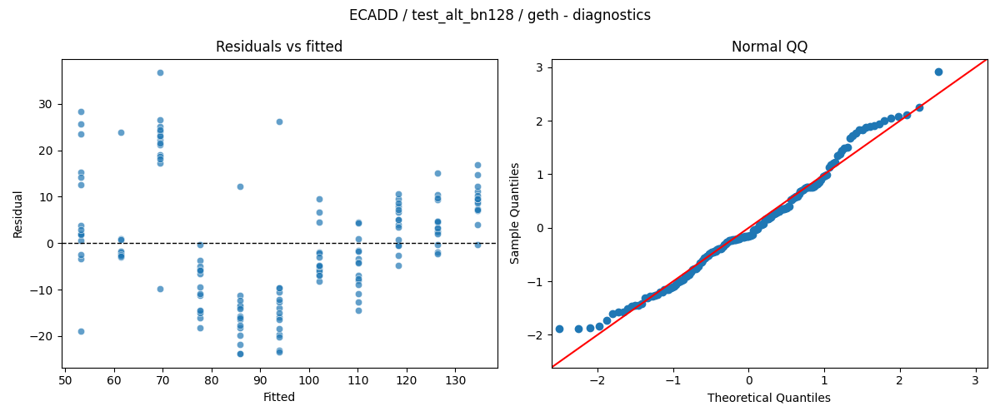

</details>

<details><summary>nethermind — NNLS regression summary</summary>

```
==============================================================================
                           NNLS Regression Results                            
==============================================================================
Dep. Variable:          test_runtime_ms              R-squared:          0.931
Model:                  NNLS                    Adj. R-squared:          0.931
No. Observations:       814                               RMSE:          12.90
Df Residuals:           812                                MAE:           9.50
Df Model:               1      
==============================================================================
                      coef     std err     P-value      [0.025      0.975]
------------------------------------------------------------------------------
         const     15.6348      1.2531       0.001     13.1150     17.9787
       opcount      0.0002      0.0000       0.001      0.0002      0.0002
==============================================================================
Notes: Non-negative least squares with bootstrap inference (1000 iterations)
==============================================================================
```

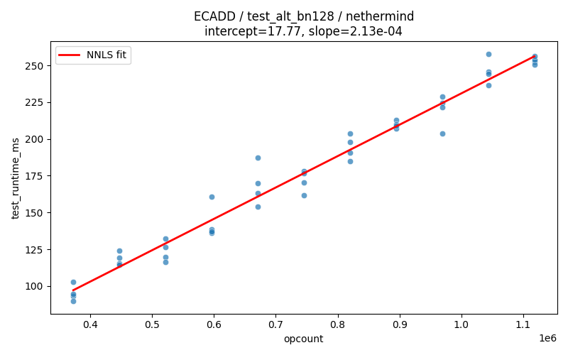

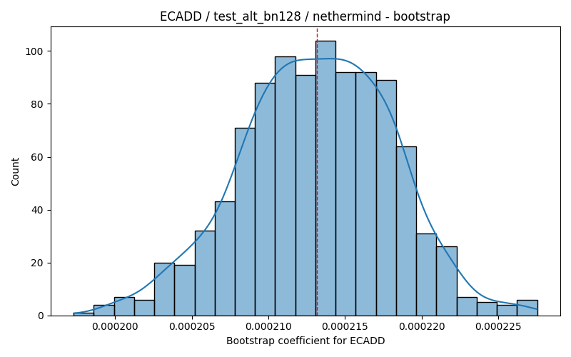

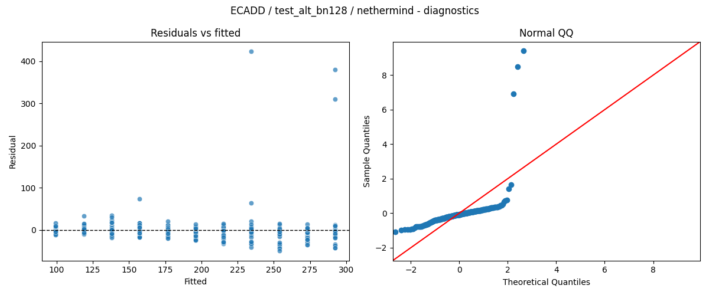

</details>

<details><summary>reth — NNLS regression summary</summary>

```
==============================================================================
                           NNLS Regression Results                            
==============================================================================
Dep. Variable:          test_runtime_ms              R-squared:          0.987
Model:                  NNLS                    Adj. R-squared:          0.987
No. Observations:       99                                RMSE:          10.31
Df Residuals:           97                                 MAE:           8.04
Df Model:               1      
==============================================================================
                      coef     std err     P-value      [0.025      0.975]
------------------------------------------------------------------------------
         const      7.5468      3.4866       0.016      0.6702     14.2900
       opcount      0.0004      0.0000       0.001      0.0004      0.0004
==============================================================================
Notes: Non-negative least squares with bootstrap inference (1000 iterations)
==============================================================================
```

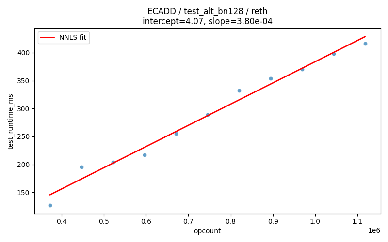

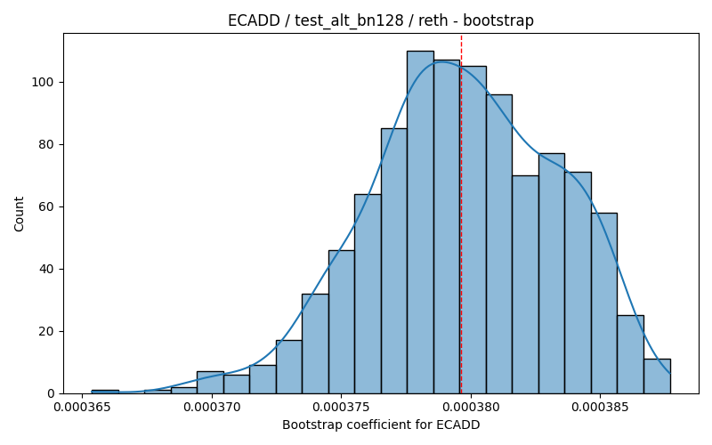


</details>

### test_alt_bn128 — combo `add_negative`

| client | nobs | R² | target_coef (ms) | p-value | 95% CI |
| --- | --- | --- | --- | --- | --- |
| `besu` | 2398 | 0.8847 | 0.0003841 | 1.00e-03 | [0.0003786, 0.0003904] |
| `erigon` | 165 | 0.8897 | 0.0005783 | 1.00e-03 | [0.0005525, 0.0006001] |
| `geth` | 2794 | 0.873 | 0.0001696 | 1.00e-03 | [0.0001672, 0.000172] |
| `nethermind` | 814 | 0.9058 | 0.0002681 | 1.00e-03 | [0.0002623, 0.0002735] |
| `reth` | 99 | 0.9774 | 0.0003535 | 1.00e-03 | [0.0003448, 0.0003627] |

<details><summary>besu — NNLS regression summary</summary>

```
==============================================================================
                           NNLS Regression Results                            
==============================================================================
Dep. Variable:          test_runtime_ms              R-squared:          0.885
Model:                  NNLS                    Adj. R-squared:          0.885
No. Observations:       2398                              RMSE:          32.68
Df Residuals:           2396                               MAE:          27.59
Df Model:               1      
==============================================================================
                      coef     std err     P-value      [0.025      0.975]
------------------------------------------------------------------------------
         const     83.0932      2.5108       0.001     78.0886     87.7993
       opcount      0.0004      0.0000       0.001      0.0004      0.0004
==============================================================================
Notes: Non-negative least squares with bootstrap inference (1000 iterations)
==============================================================================
```

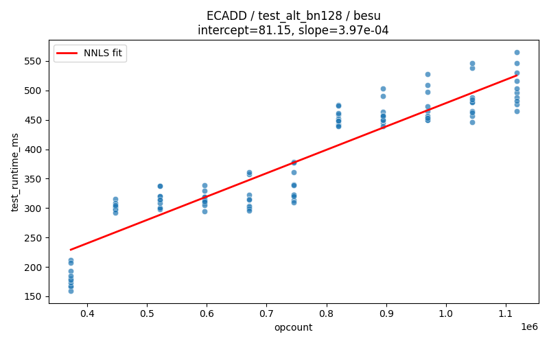

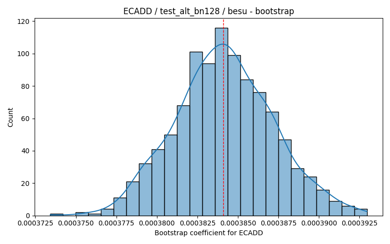

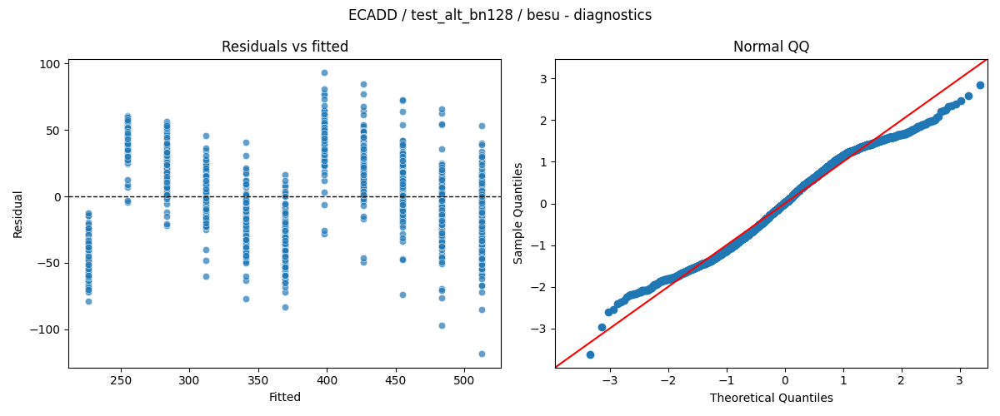

</details>

<details><summary>erigon — NNLS regression summary</summary>

```
==============================================================================
                           NNLS Regression Results                            
==============================================================================
Dep. Variable:          test_runtime_ms              R-squared:          0.890
Model:                  NNLS                    Adj. R-squared:          0.889
No. Observations:       165                               RMSE:          47.97
Df Residuals:           163                                MAE:          26.96
Df Model:               1      
==============================================================================
                      coef     std err     P-value      [0.025      0.975]
------------------------------------------------------------------------------
         const     26.7533     11.0961       0.001      8.7385     51.1435
       opcount      0.0006      0.0000       0.001      0.0006      0.0006
==============================================================================
Notes: Non-negative least squares with bootstrap inference (1000 iterations)
==============================================================================
```

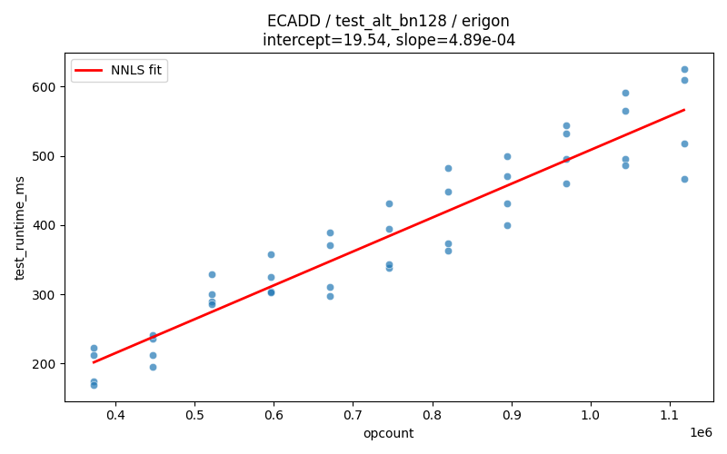

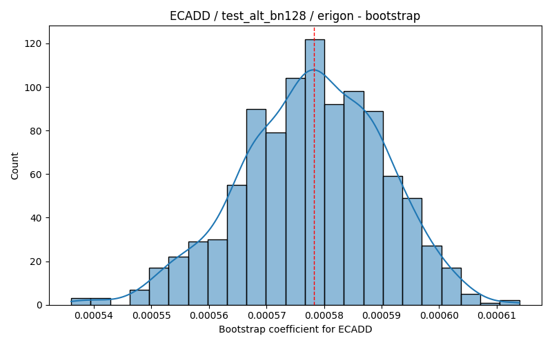

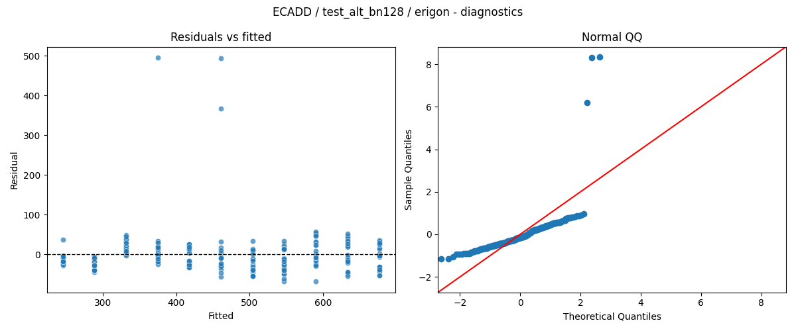

</details>

<details><summary>geth — NNLS regression summary</summary>

```
==============================================================================
                           NNLS Regression Results                            
==============================================================================
Dep. Variable:          test_runtime_ms              R-squared:          0.873
Model:                  NNLS                    Adj. R-squared:          0.873
No. Observations:       2794                              RMSE:          15.25
Df Residuals:           2792                               MAE:          11.95
Df Model:               1      
==============================================================================
                      coef     std err     P-value      [0.025      0.975]
------------------------------------------------------------------------------
         const     16.9405      1.1242       0.001     14.7583     19.1408
       opcount      0.0002      0.0000       0.001      0.0002      0.0002
==============================================================================
Notes: Non-negative least squares with bootstrap inference (1000 iterations)
==============================================================================
```

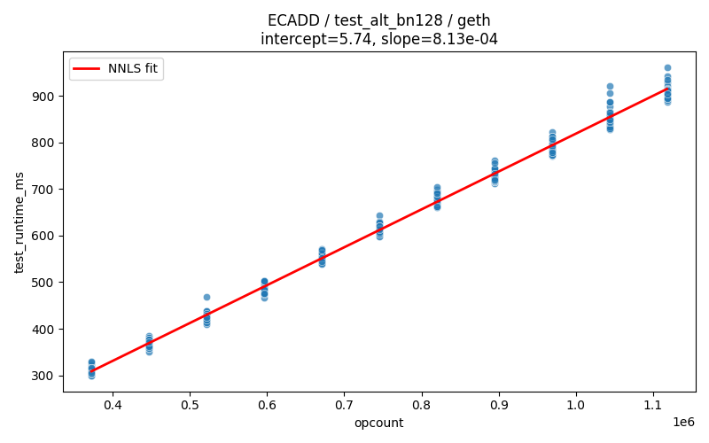

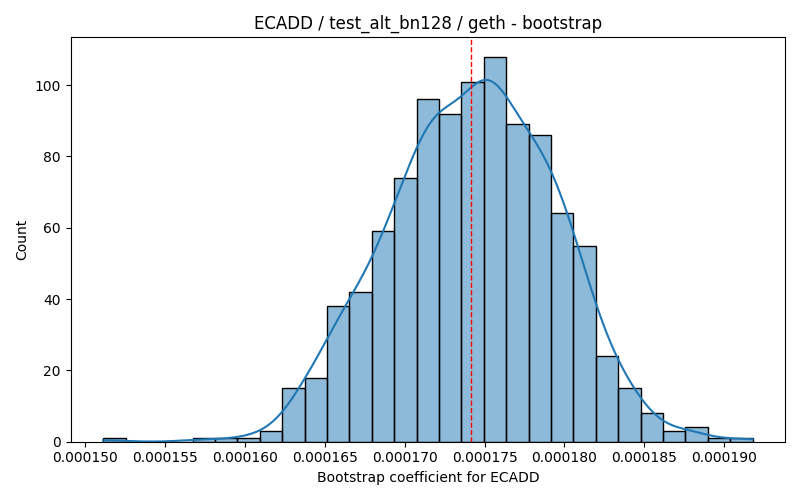

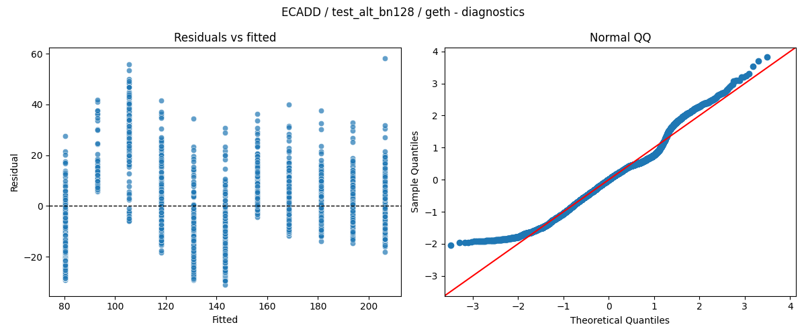

</details>

<details><summary>nethermind — NNLS regression summary</summary>

```
==============================================================================
                           NNLS Regression Results                            
==============================================================================
Dep. Variable:          test_runtime_ms              R-squared:          0.906
Model:                  NNLS                    Adj. R-squared:          0.906
No. Observations:       814                               RMSE:          20.38
Df Residuals:           812                                MAE:          13.14
Df Model:               1      
==============================================================================
                      coef     std err     P-value      [0.025      0.975]
------------------------------------------------------------------------------
         const     26.7692      2.0933       0.001     23.1375     31.2454
       opcount      0.0003      0.0000       0.001      0.0003      0.0003
==============================================================================
Notes: Non-negative least squares with bootstrap inference (1000 iterations)
==============================================================================
```

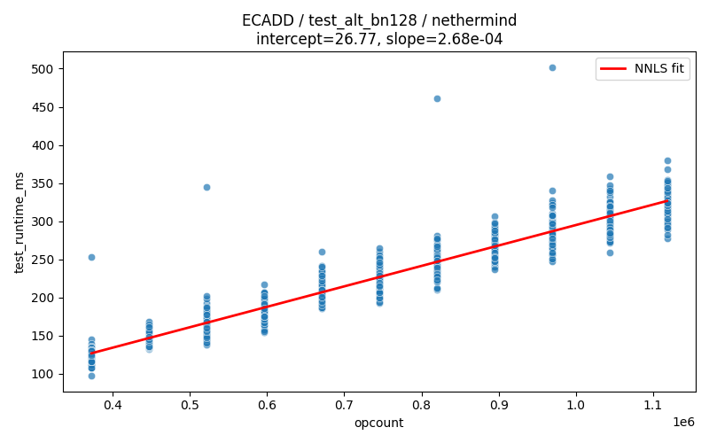

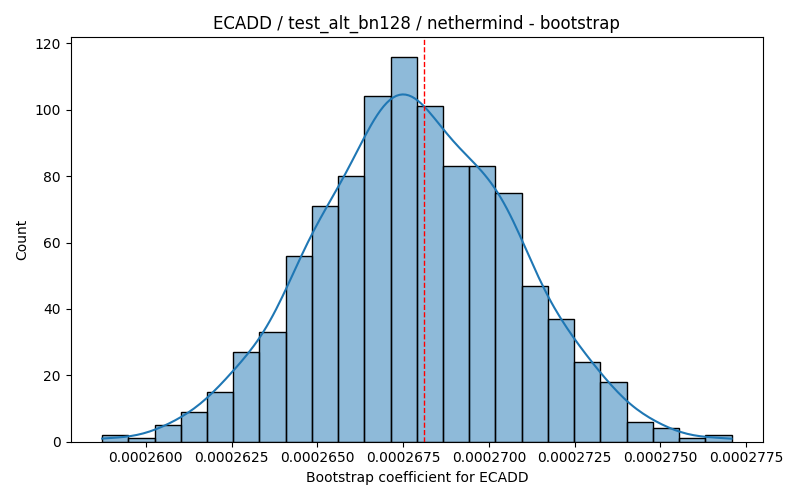

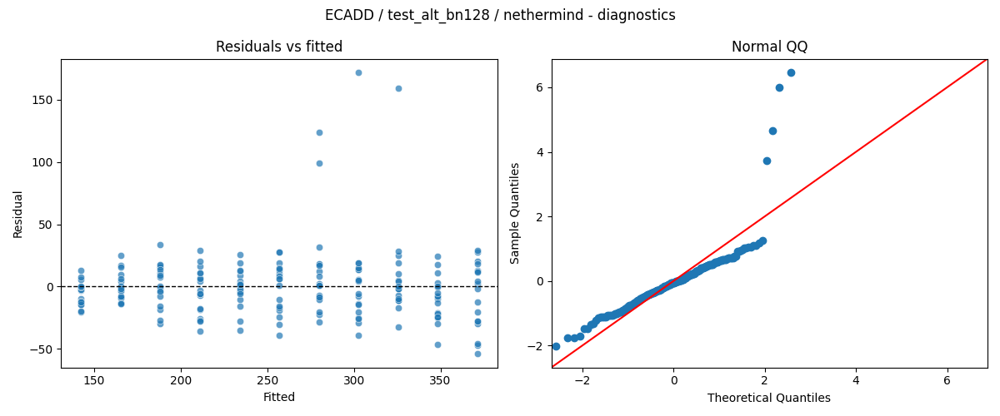

</details>

<details><summary>reth — NNLS regression summary</summary>

```
==============================================================================
                           NNLS Regression Results                            
==============================================================================
Dep. Variable:          test_runtime_ms              R-squared:          0.977
Model:                  NNLS                    Adj. R-squared:          0.977
No. Observations:       99                                RMSE:          12.67
Df Residuals:           97                                 MAE:          10.42
Df Model:               1      
==============================================================================
                      coef     std err     P-value      [0.025      0.975]
------------------------------------------------------------------------------
         const     25.1619      3.7891       0.001     17.4157     33.0829
       opcount      0.0004      0.0000       0.001      0.0003      0.0004
==============================================================================
Notes: Non-negative least squares with bootstrap inference (1000 iterations)
==============================================================================
```

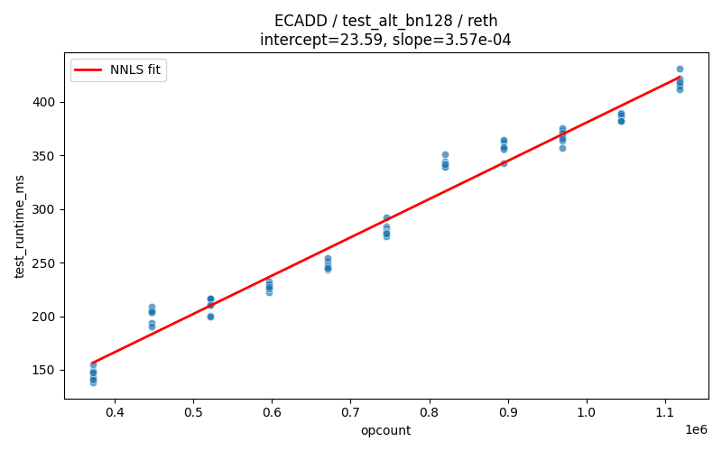

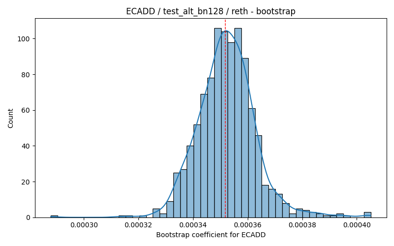

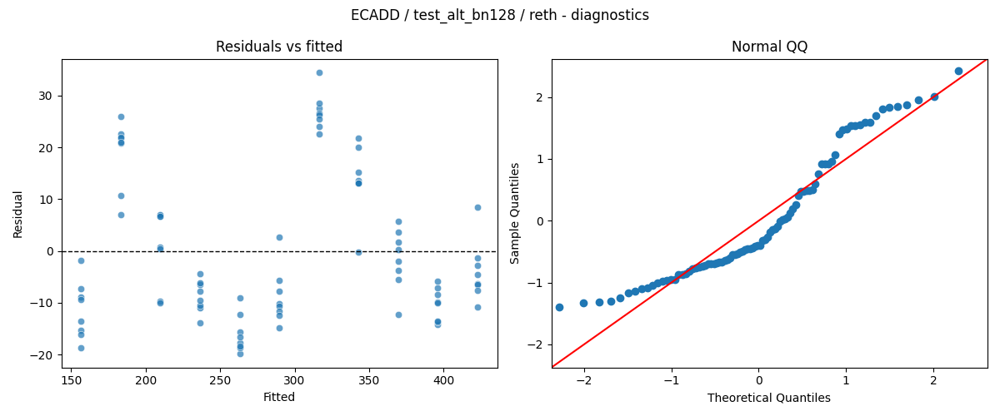

</details>

### test_alt_bn128 — combo `double`

| client | nobs | R² | target_coef (ms) | p-value | 95% CI |
| --- | --- | --- | --- | --- | --- |
| `besu` | 2398 | 0.8806 | 0.0006548 | 1.00e-03 | [0.0006444, 0.0006658] |
| `erigon` | 165 | 0.8248 | 0.0007011 | 1.00e-03 | [0.0006654, 0.0007302] |
| `geth` | 2794 | 0.8785 | 0.0004044 | 1.00e-03 | [0.0003986, 0.0004107] |
| `nethermind` | 814 | 0.9325 | 0.0004746 | 1.00e-03 | [0.0004667, 0.0004828] |
| `reth` | 99 | 0.8591 | 0.0006084 | 1.00e-03 | [0.0005562, 0.0006598] |

<details><summary>besu — NNLS regression summary</summary>

```
==============================================================================
                           NNLS Regression Results                            
==============================================================================
Dep. Variable:          test_runtime_ms              R-squared:          0.881
Model:                  NNLS                    Adj. R-squared:          0.881
No. Observations:       2398                              RMSE:          56.81
Df Residuals:           2396                               MAE:          48.72
Df Model:               1      
==============================================================================
                      coef     std err     P-value      [0.025      0.975]
------------------------------------------------------------------------------
         const    128.3581      4.3768       0.001    119.4847    137.0446
       opcount      0.0007      0.0000       0.001      0.0006      0.0007
==============================================================================
Notes: Non-negative least squares with bootstrap inference (1000 iterations)
==============================================================================
```

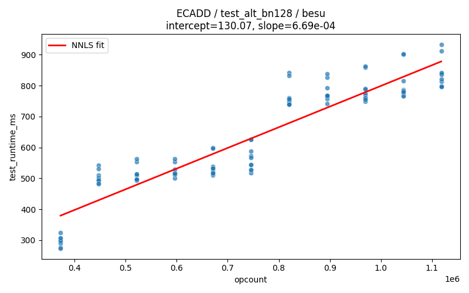

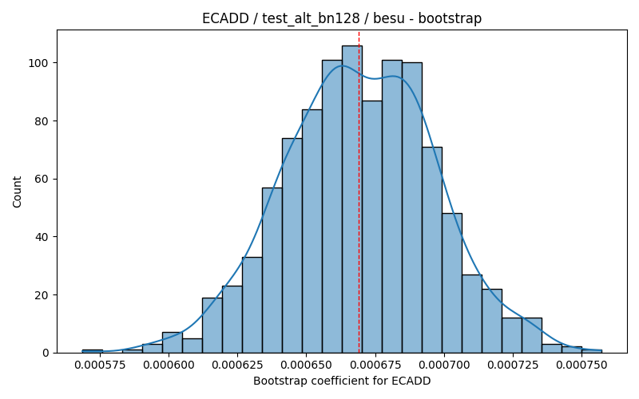

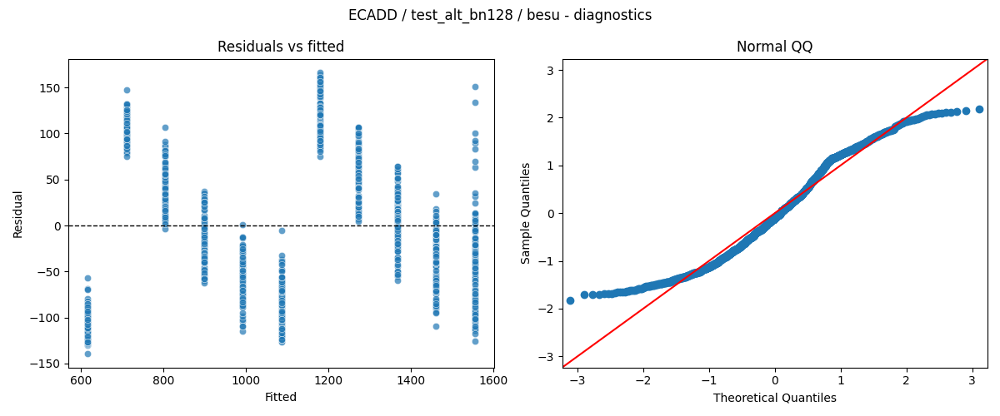

</details>

<details><summary>erigon — NNLS regression summary</summary>

```
==============================================================================
                           NNLS Regression Results                            
==============================================================================
Dep. Variable:          test_runtime_ms              R-squared:          0.825
Model:                  NNLS                    Adj. R-squared:          0.824
No. Observations:       165                               RMSE:          76.14
Df Residuals:           163                                MAE:          51.10
Df Model:               1      
==============================================================================
                      coef     std err     P-value      [0.025      0.975]
------------------------------------------------------------------------------
         const     63.3709     16.5454       0.001     34.0467     97.0596
       opcount      0.0007      0.0000       0.001      0.0007      0.0007
==============================================================================
Notes: Non-negative least squares with bootstrap inference (1000 iterations)
==============================================================================
```

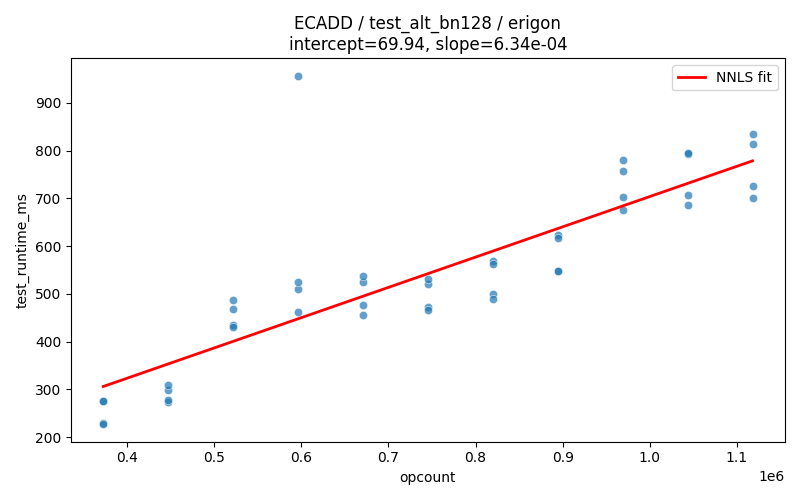

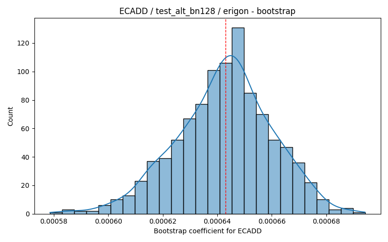

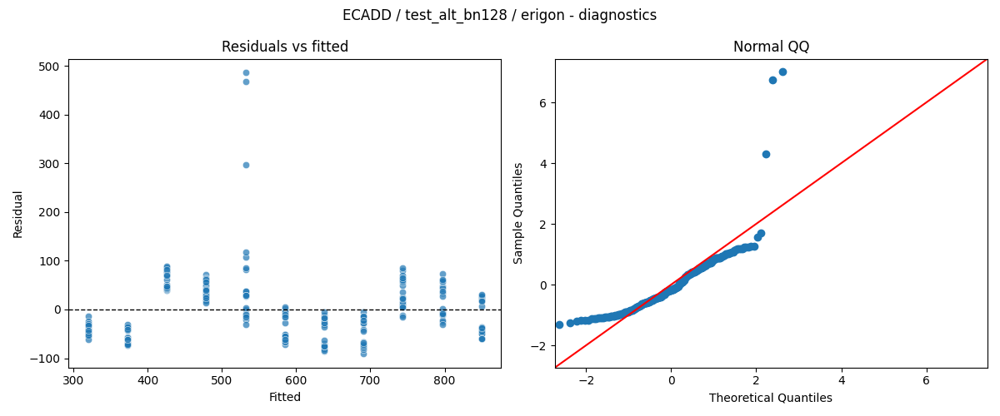

</details>

<details><summary>geth — NNLS regression summary</summary>

```
==============================================================================
                           NNLS Regression Results                            
==============================================================================
Dep. Variable:          test_runtime_ms              R-squared:          0.878
Model:                  NNLS                    Adj. R-squared:          0.878
No. Observations:       2794                              RMSE:          35.45
Df Residuals:           2792                               MAE:          30.56
Df Model:               1      
==============================================================================
                      coef     std err     P-value      [0.025      0.975]
------------------------------------------------------------------------------
         const     73.9872      2.6593       0.001     68.9579     78.7328
       opcount      0.0004      0.0000       0.001      0.0004      0.0004
==============================================================================
Notes: Non-negative least squares with bootstrap inference (1000 iterations)
==============================================================================
```

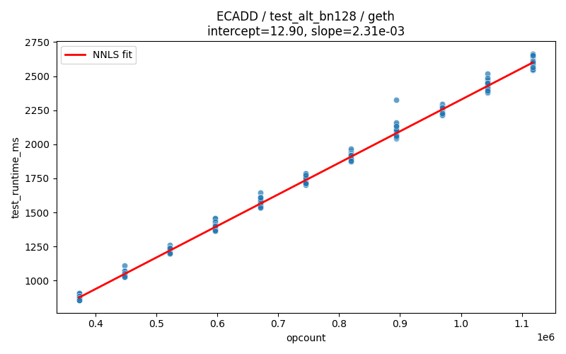

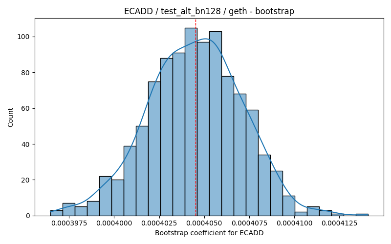

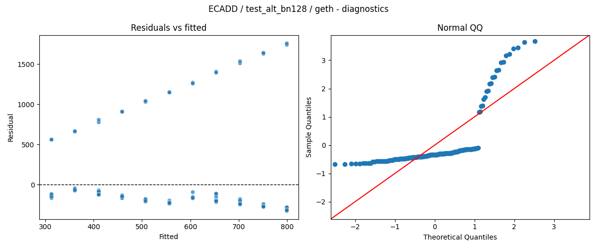

</details>

<details><summary>nethermind — NNLS regression summary</summary>

```
==============================================================================
                           NNLS Regression Results                            
==============================================================================
Dep. Variable:          test_runtime_ms              R-squared:          0.933
Model:                  NNLS                    Adj. R-squared:          0.932
No. Observations:       814                               RMSE:          30.09
Df Residuals:           812                                MAE:          23.41
Df Model:               1      
==============================================================================
                      coef     std err     P-value      [0.025      0.975]
------------------------------------------------------------------------------
         const     46.3228      3.0944       0.001     40.5798     52.2204
       opcount      0.0005      0.0000       0.001      0.0005      0.0005
==============================================================================
Notes: Non-negative least squares with bootstrap inference (1000 iterations)
==============================================================================
```

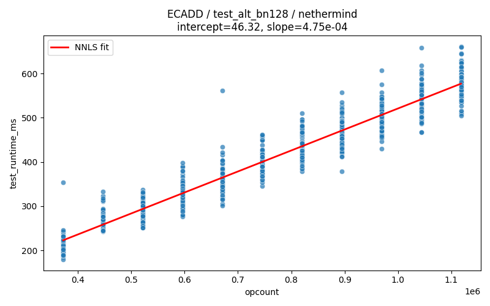

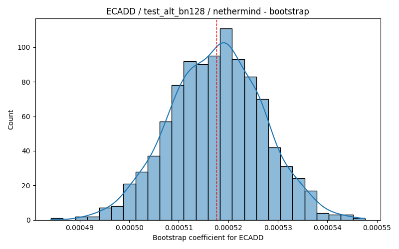

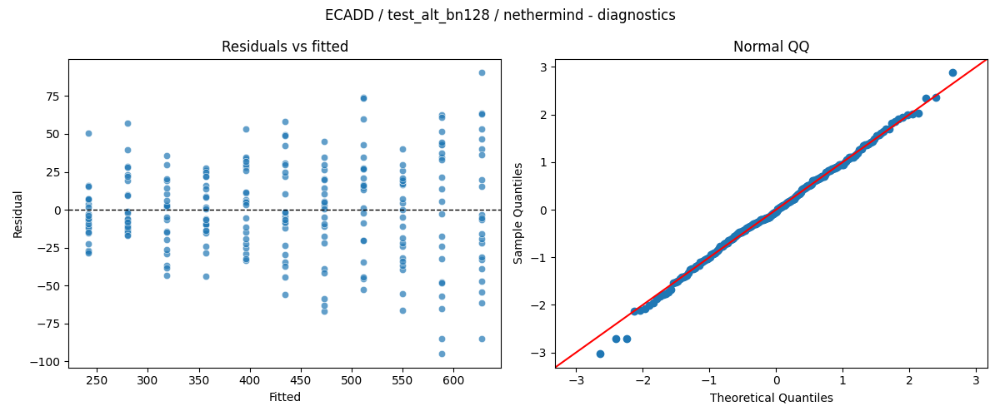

</details>

<details><summary>reth — NNLS regression summary</summary>

```
==============================================================================
                           NNLS Regression Results                            
==============================================================================
Dep. Variable:          test_runtime_ms              R-squared:          0.859
Model:                  NNLS                    Adj. R-squared:          0.858
No. Observations:       99                                RMSE:          58.07
Df Residuals:           97                                 MAE:          48.83
Df Model:               1      
==============================================================================
                      coef     std err     P-value      [0.025      0.975]
------------------------------------------------------------------------------
         const    122.7038     22.3725       0.001     79.8058    165.7491
       opcount      0.0006      0.0000       0.001      0.0006      0.0007
==============================================================================
Notes: Non-negative least squares with bootstrap inference (1000 iterations)
==============================================================================
```

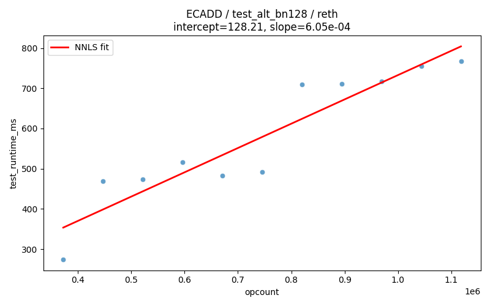

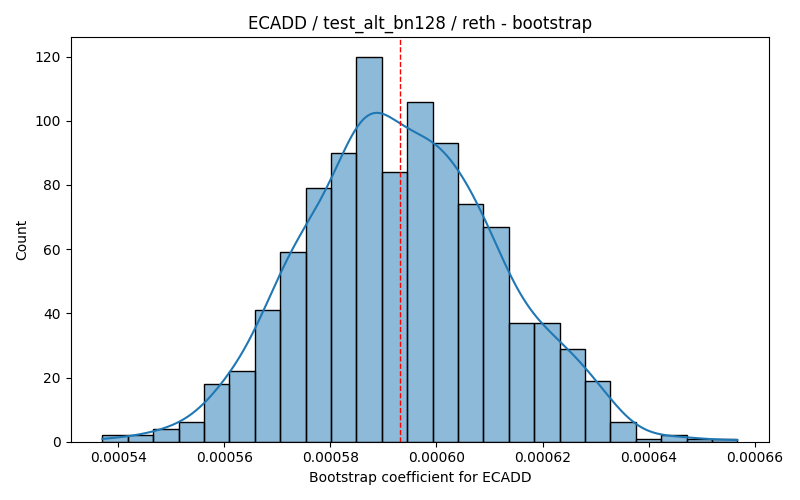

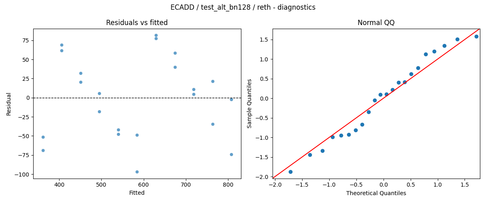

</details>

### test_alt_bn128_uncachable

| client | nobs | R² | target_coef (ms) | p-value | 95% CI |
| --- | --- | --- | --- | --- | --- |
| `besu` | 2398 | 0.8769 | 0.0009008 | 1.00e-03 | [0.0008867, 0.0009156] |
| `erigon` | 165 | 0.9348 | 0.001075 | 1.00e-03 | [0.001031, 0.001113] |
| `geth` | 2794 | 0.8605 | 0.0006032 | 1.00e-03 | [0.0005933, 0.0006129] |
| `nethermind` | 814 | 0.9441 | 0.0007569 | 1.00e-03 | [0.0007442, 0.0007706] |
| `reth` | 99 | 0.8362 | 0.0009582 | 1.00e-03 | [0.00087, 0.001044] |

<details><summary>besu — NNLS regression summary</summary>

```
==============================================================================
                           NNLS Regression Results                            
==============================================================================
Dep. Variable:          test_runtime_ms              R-squared:          0.877
Model:                  NNLS                    Adj. R-squared:          0.877
No. Observations:       2398                              RMSE:          72.27
Df Residuals:           2396                               MAE:          61.73
Df Model:               1      
==============================================================================
                      coef     std err     P-value      [0.025      0.975]
------------------------------------------------------------------------------
         const    173.3351      5.5562       0.001    162.1225    183.8231
       opcount      0.0009      0.0000       0.001      0.0009      0.0009
==============================================================================
Notes: Non-negative least squares with bootstrap inference (1000 iterations)
==============================================================================
```

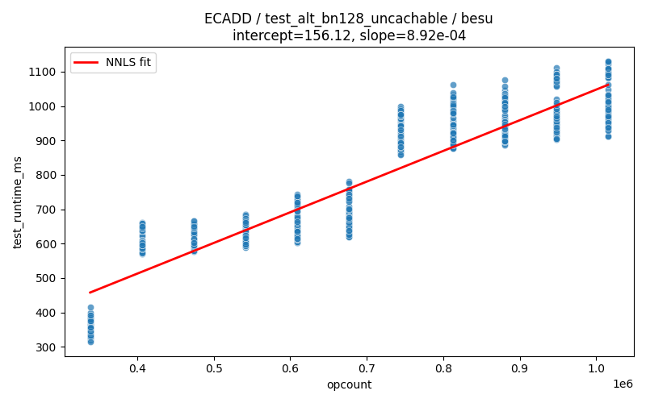

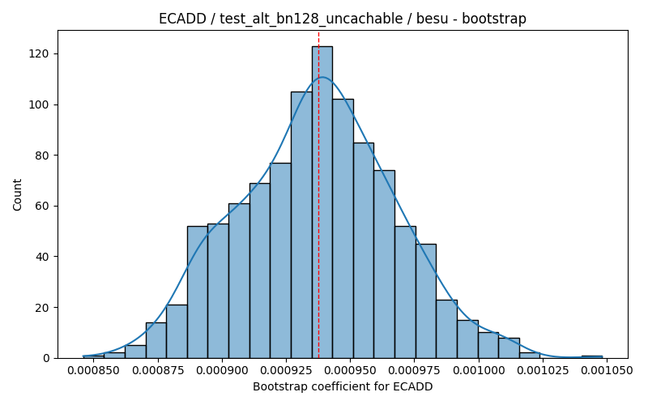

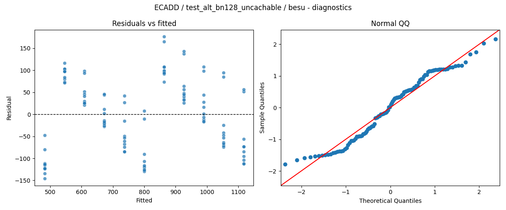

</details>

<details><summary>erigon — NNLS regression summary</summary>

```
==============================================================================
                           NNLS Regression Results                            
==============================================================================
Dep. Variable:          test_runtime_ms              R-squared:          0.935
Model:                  NNLS                    Adj. R-squared:          0.934
No. Observations:       165                               RMSE:          60.73
Df Residuals:           163                                MAE:          51.72
Df Model:               1      
==============================================================================
                      coef     std err     P-value      [0.025      0.975]
------------------------------------------------------------------------------
         const     65.8598     16.4849       0.001     36.1058     99.7680
       opcount      0.0011      0.0000       0.001      0.0010      0.0011
==============================================================================
Notes: Non-negative least squares with bootstrap inference (1000 iterations)
==============================================================================
```

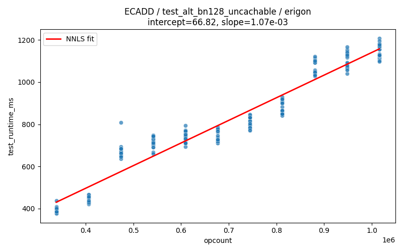

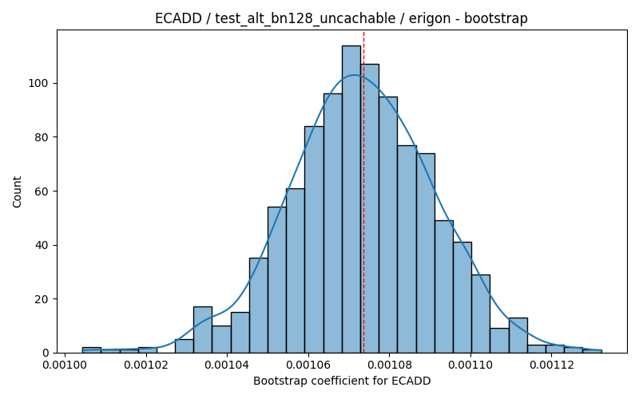

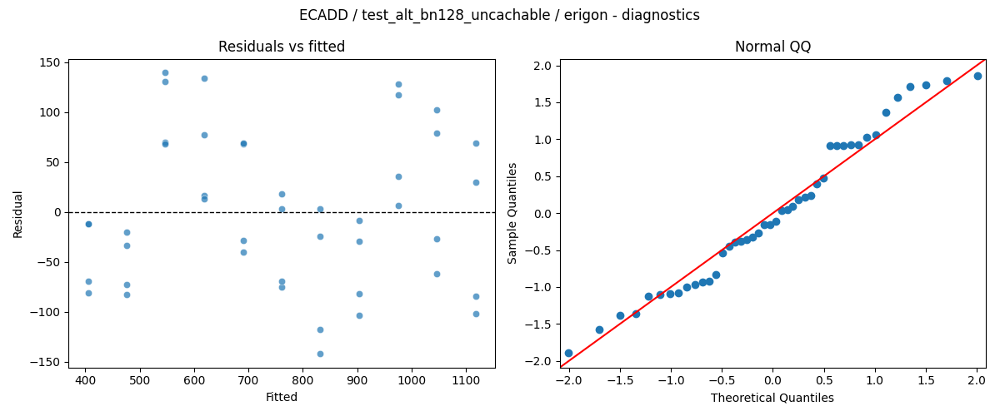

</details>

<details><summary>geth — NNLS regression summary</summary>

```
==============================================================================
                           NNLS Regression Results                            
==============================================================================
Dep. Variable:          test_runtime_ms              R-squared:          0.861
Model:                  NNLS                    Adj. R-squared:          0.860
No. Observations:       2794                              RMSE:          51.99
Df Residuals:           2792                               MAE:          44.55
Df Model:               1      
==============================================================================
                      coef     std err     P-value      [0.025      0.975]
------------------------------------------------------------------------------
         const    107.1257      3.8210       0.001     99.5003    114.6890
       opcount      0.0006      0.0000       0.001      0.0006      0.0006
==============================================================================
Notes: Non-negative least squares with bootstrap inference (1000 iterations)
==============================================================================
```

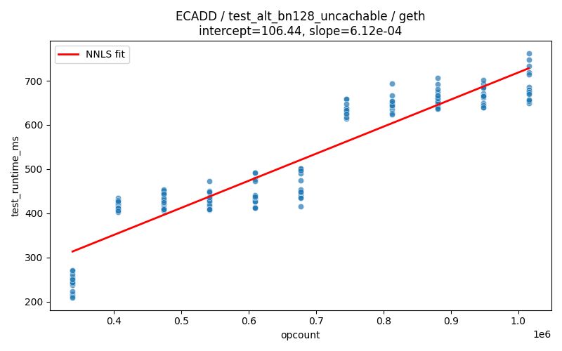

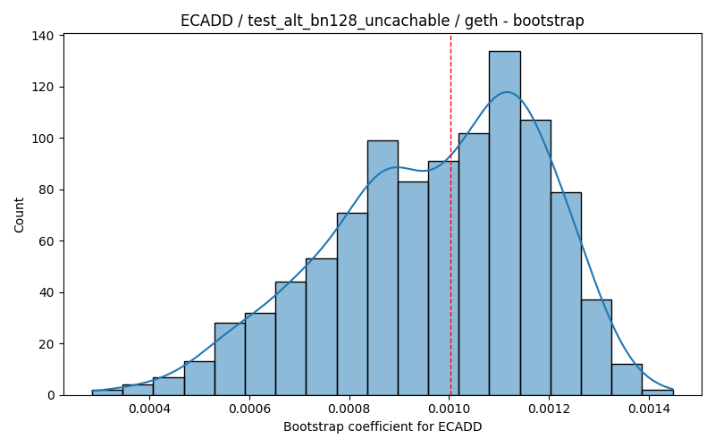

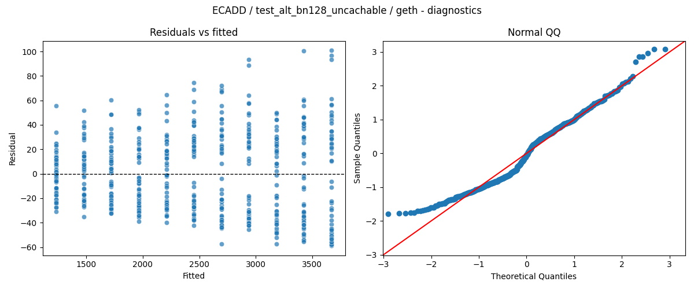

</details>

<details><summary>nethermind — NNLS regression summary</summary>

```
==============================================================================
                           NNLS Regression Results                            
==============================================================================
Dep. Variable:          test_runtime_ms              R-squared:          0.944
Model:                  NNLS                    Adj. R-squared:          0.944
No. Observations:       814                               RMSE:          39.44
Df Residuals:           812                                MAE:          31.76
Df Model:               1      
==============================================================================
                      coef     std err     P-value      [0.025      0.975]
------------------------------------------------------------------------------
         const     70.8082      4.4419       0.001     61.6423     79.3999
       opcount      0.0008      0.0000       0.001      0.0007      0.0008
==============================================================================
Notes: Non-negative least squares with bootstrap inference (1000 iterations)
==============================================================================
```

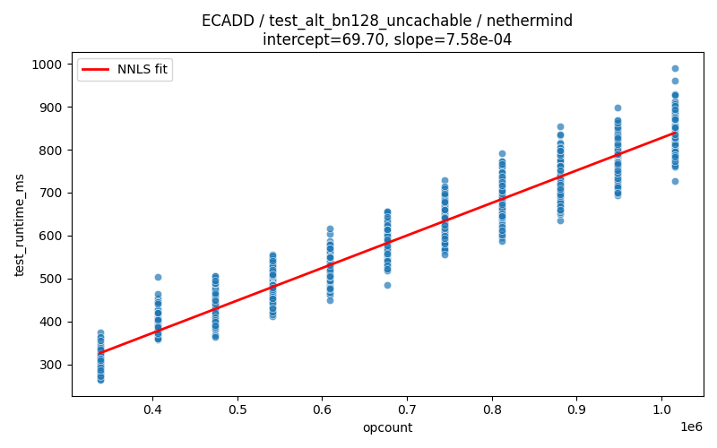

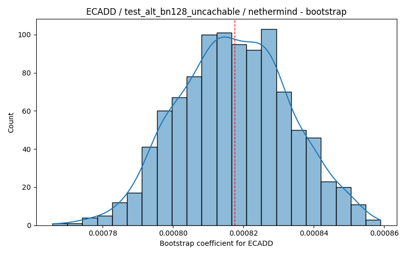

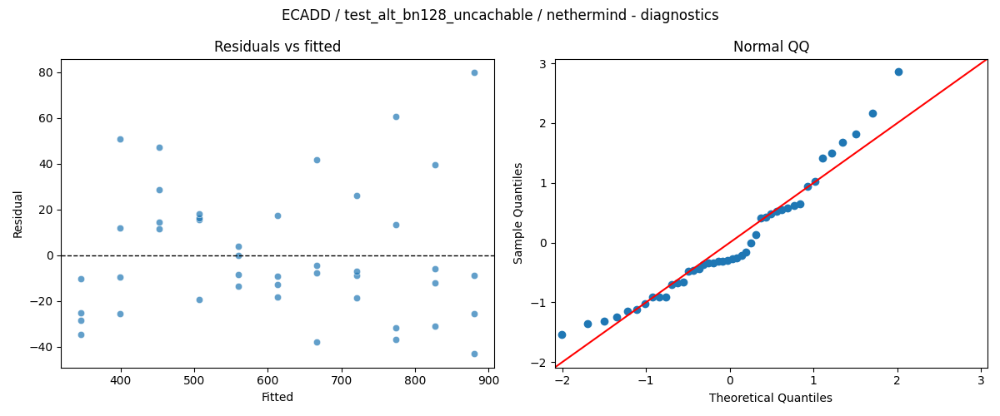

</details>

<details><summary>reth — NNLS regression summary</summary>

```
==============================================================================
                           NNLS Regression Results                            
==============================================================================
Dep. Variable:          test_runtime_ms              R-squared:          0.836
Model:                  NNLS                    Adj. R-squared:          0.835
No. Observations:       99                                RMSE:          90.79
Df Residuals:           97                                 MAE:          77.72
Df Model:               1      
==============================================================================
                      coef     std err     P-value      [0.025      0.975]
------------------------------------------------------------------------------
         const    186.4975     34.3214       0.001    121.1542    255.6964
       opcount      0.0010      0.0000       0.001      0.0009      0.0010
==============================================================================
Notes: Non-negative least squares with bootstrap inference (1000 iterations)
==============================================================================
```

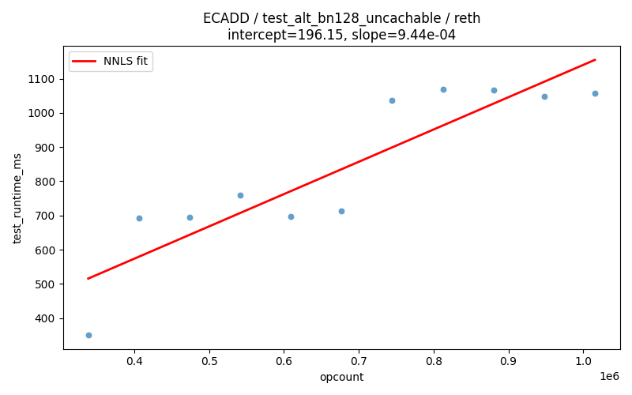

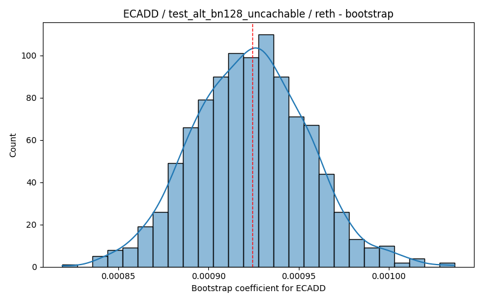

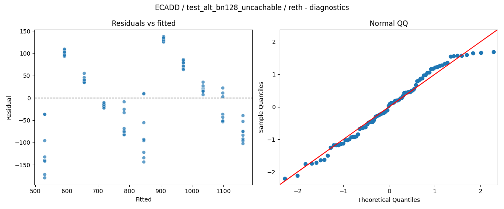

</details>

## ECPAIRING

### test_alt_bn128_benchmark

| client | nobs | R² | target_coef (ms) | p-value | 95% CI |
| --- | --- | --- | --- | --- | --- |
| `besu` | 11990 | 0.8805 | 0.04589 | 1.00e-03 | [0.04547, 0.04628] |
| `erigon` | 825 | 0.8443 | 0.05163 | 1.00e-03 | [0.04997, 0.05341] |
| `geth` | 13970 | 0.8166 | 0.04433 | 1.00e-03 | [0.04385, 0.04484] |
| `nethermind` | 4070 | 0.9331 | 0.06663 | 1.00e-03 | [0.06489, 0.06828] |
| `reth` | 495 | 0.8172 | 0.04688 | 1.00e-03 | [0.04257, 0.05164] |

<details><summary>besu — NNLS regression summary</summary>

```
==============================================================================
                           NNLS Regression Results                            
==============================================================================
Dep. Variable:          test_runtime_ms              R-squared:          0.881
Model:                  NNLS                    Adj. R-squared:          0.881
No. Observations:       11990                             RMSE:          20.34
Df Residuals:           11987                              MAE:          17.19
Df Model:               2      
==============================================================================
                      coef     std err     P-value      [0.025      0.975]
------------------------------------------------------------------------------
         const     52.7158      0.6839       0.001     51.4238     54.1823
       opcount      0.0459      0.0002       0.001      0.0455      0.0463
     num_pairs      0.0262      0.0001       0.001      0.0260      0.0264
==============================================================================
Notes: Non-negative least squares with bootstrap inference (1000 iterations)
==============================================================================
```

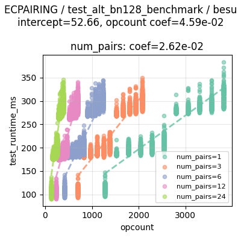

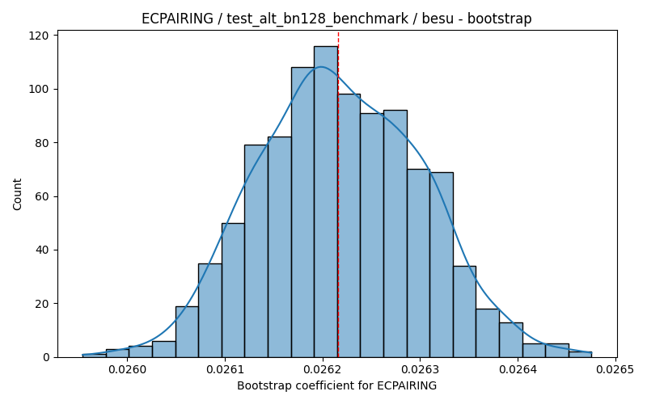

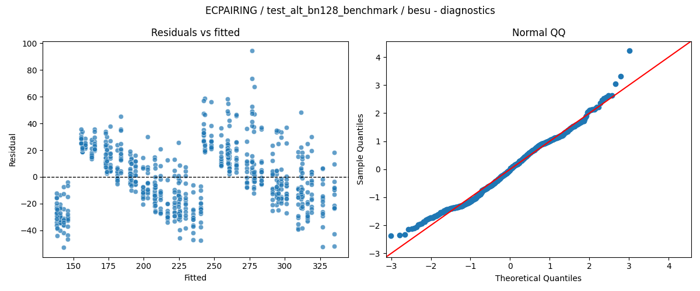

</details>

<details><summary>erigon — NNLS regression summary</summary>

```
==============================================================================
                           NNLS Regression Results                            
==============================================================================
Dep. Variable:          test_runtime_ms              R-squared:          0.844
Model:                  NNLS                    Adj. R-squared:          0.844
No. Observations:       825                               RMSE:          27.39
Df Residuals:           822                                MAE:          18.20
Df Model:               2      
==============================================================================
                      coef     std err     P-value      [0.025      0.975]
------------------------------------------------------------------------------
         const     19.7233      3.2141       0.001     13.1742     25.4882
       opcount      0.0516      0.0009       0.001      0.0500      0.0534
     num_pairs      0.0307      0.0007       0.001      0.0295      0.0322
==============================================================================
Notes: Non-negative least squares with bootstrap inference (1000 iterations)
==============================================================================
```

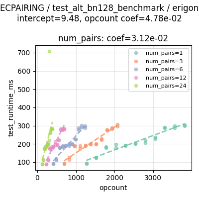

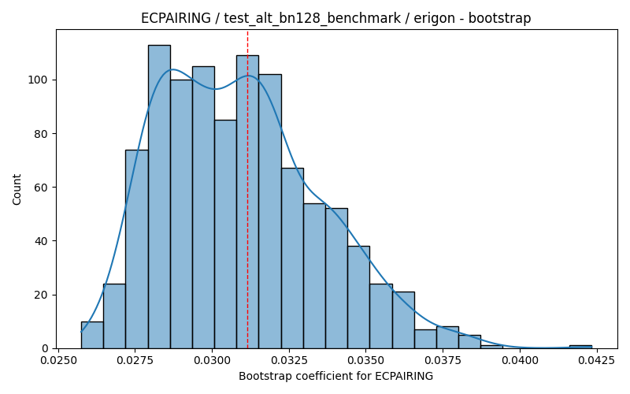

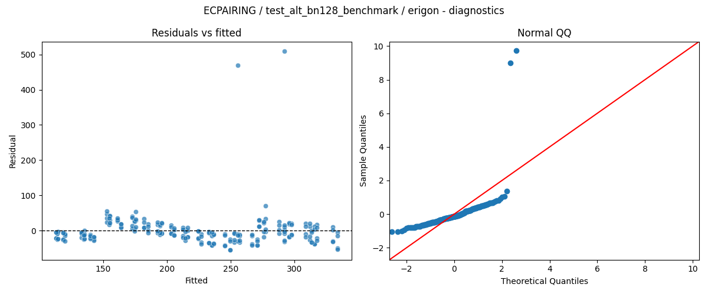

</details>

<details><summary>geth — NNLS regression summary</summary>

```
==============================================================================
                           NNLS Regression Results                            
==============================================================================
Dep. Variable:          test_runtime_ms              R-squared:          0.817
Model:                  NNLS                    Adj. R-squared:          0.817
No. Observations:       13970                             RMSE:          26.01
Df Residuals:           13967                              MAE:          21.78
Df Model:               2      
==============================================================================
                      coef     std err     P-value      [0.025      0.975]
------------------------------------------------------------------------------
         const     52.7948      0.8492       0.001     51.0945     54.4038
       opcount      0.0443      0.0003       0.001      0.0439      0.0448
     num_pairs      0.0265      0.0001       0.001      0.0262      0.0267
==============================================================================
Notes: Non-negative least squares with bootstrap inference (1000 iterations)
==============================================================================
```

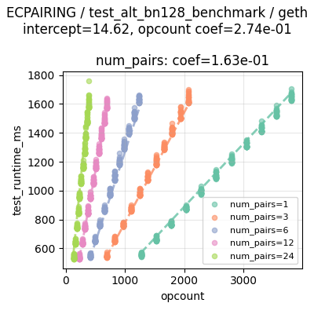

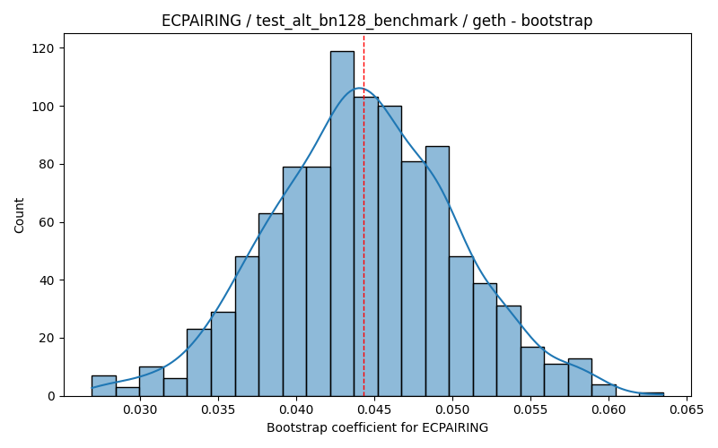

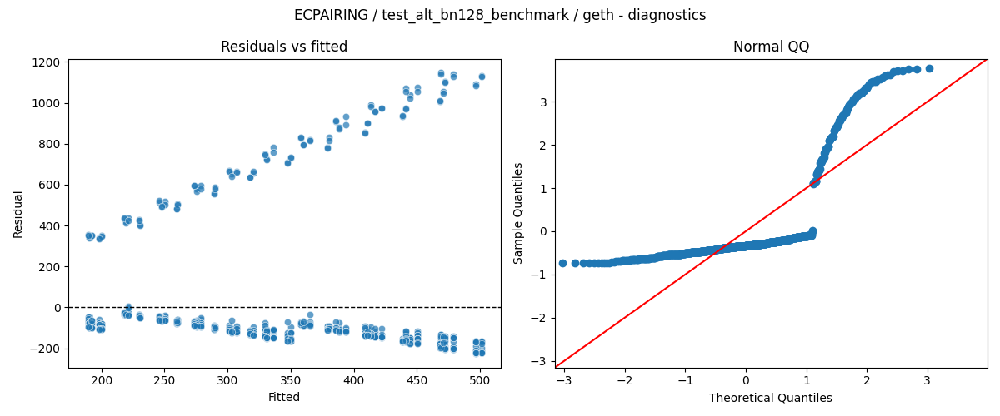

</details>

<details><summary>nethermind — NNLS regression summary</summary>

```
==============================================================================
                           NNLS Regression Results                            
==============================================================================
Dep. Variable:          test_runtime_ms              R-squared:          0.933
Model:                  NNLS                    Adj. R-squared:          0.933
No. Observations:       4070                              RMSE:          51.68
Df Residuals:           4067                               MAE:          40.77
Df Model:               2      
==============================================================================
                      coef     std err     P-value      [0.025      0.975]
------------------------------------------------------------------------------
         const     80.2936      2.4411       0.001     75.6295     85.1350
       opcount      0.0666      0.0009       0.001      0.0649      0.0683
     num_pairs      0.1020      0.0005       0.001      0.1011      0.1029
==============================================================================
Notes: Non-negative least squares with bootstrap inference (1000 iterations)
==============================================================================
```

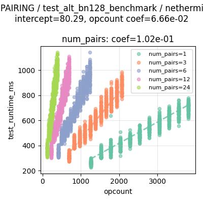

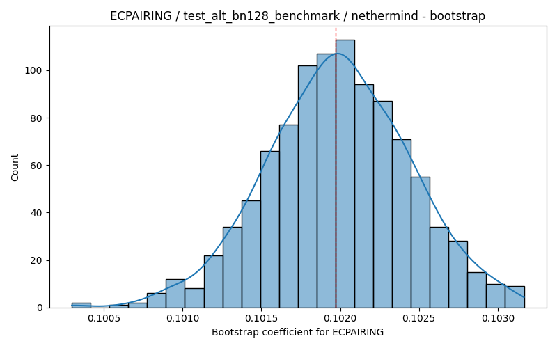

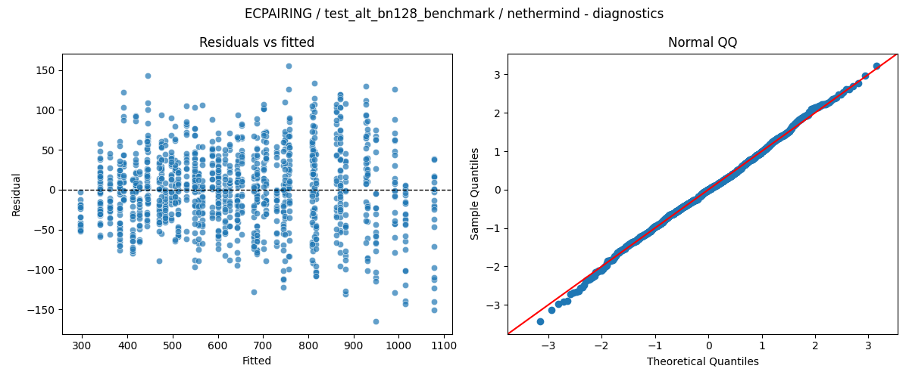

</details>

<details><summary>reth — NNLS regression summary</summary>

```
==============================================================================
                           NNLS Regression Results                            
==============================================================================
Dep. Variable:          test_runtime_ms              R-squared:          0.817
Model:                  NNLS                    Adj. R-squared:          0.817
No. Observations:       495                               RMSE:          51.84
Df Residuals:           492                                MAE:          43.05
Df Model:               2      
==============================================================================
                      coef     std err     P-value      [0.025      0.975]
------------------------------------------------------------------------------
         const    112.0218      8.0009       0.001     96.5744    126.9719
       opcount      0.0469      0.0023       0.001      0.0426      0.0516
     num_pairs      0.0580      0.0013       0.001      0.0555      0.0605
==============================================================================
Notes: Non-negative least squares with bootstrap inference (1000 iterations)
==============================================================================
```

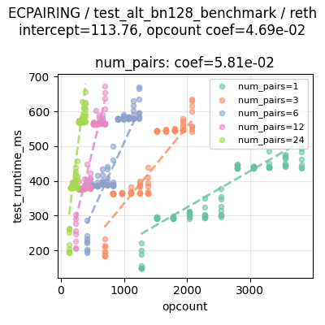

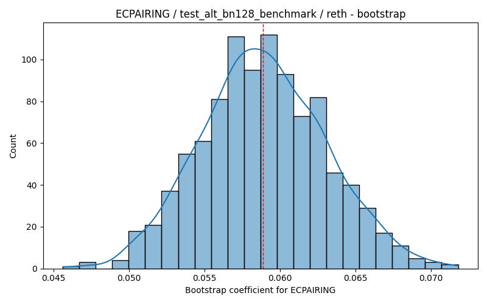

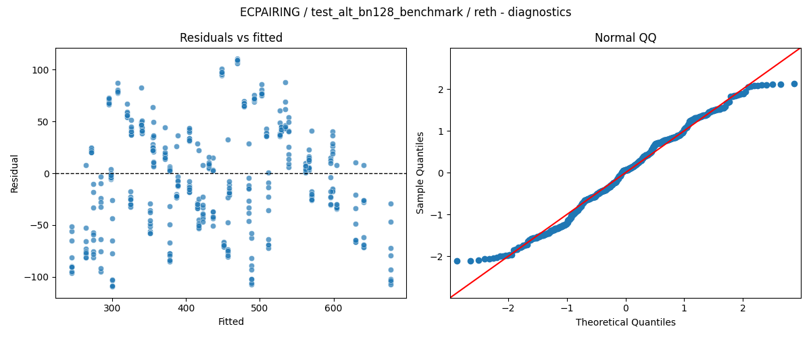

</details>

### test_ec_pairing

| client | nobs | R² | target_coef (ms) | p-value | 95% CI |
| --- | --- | --- | --- | --- | --- |
| `besu` | 11990 | 0.9078 | 0.05103 | 1.00e-03 | [0.0506, 0.05149] |
| `erigon` | 825 | 0.9064 | 0.04762 | 1.00e-03 | [0.04619, 0.04884] |
| `geth` | 13970 | 0.8661 | 0.04142 | 1.00e-03 | [0.04092, 0.04195] |
| `nethermind` | 4070 | 0.9471 | 0.05252 | 1.00e-03 | [0.0511, 0.05387] |
| `reth` | 495 | 0.8392 | 0.08247 | 1.00e-03 | [0.07785, 0.08735] |

<details><summary>besu — NNLS regression summary</summary>

```
==============================================================================
                           NNLS Regression Results                            
==============================================================================
Dep. Variable:          test_runtime_ms              R-squared:          0.908
Model:                  NNLS                    Adj. R-squared:          0.908
No. Observations:       11990                             RMSE:          19.19
Df Residuals:           11987                              MAE:          16.01
Df Model:               2      
==============================================================================
                      coef     std err     P-value      [0.025      0.975]
------------------------------------------------------------------------------
         const     43.6064      0.6298       0.001     42.3511     44.7799
       opcount      0.0510      0.0002       0.001      0.0506      0.0515
     num_pairs      0.0332      0.0001       0.001      0.0329      0.0334
==============================================================================
Notes: Non-negative least squares with bootstrap inference (1000 iterations)
==============================================================================
```

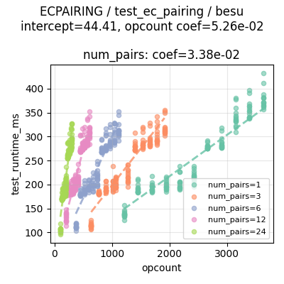

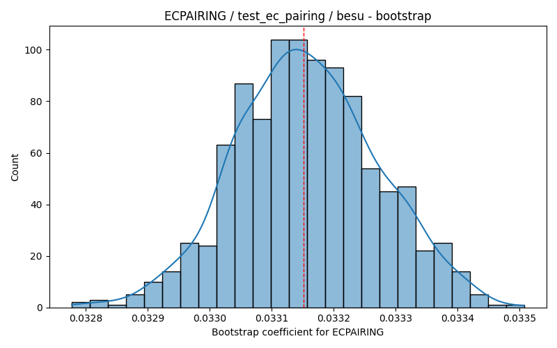

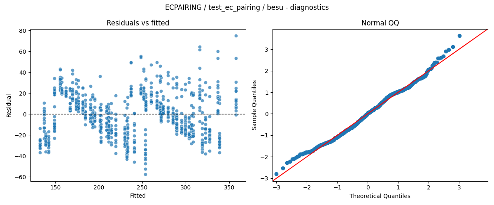

</details>

<details><summary>erigon — NNLS regression summary</summary>

```
==============================================================================
                           NNLS Regression Results                            
==============================================================================
Dep. Variable:          test_runtime_ms              R-squared:          0.906
Model:                  NNLS                    Adj. R-squared:          0.906
No. Observations:       825                               RMSE:          21.45
Df Residuals:           822                                MAE:          15.23
Df Model:               2      
==============================================================================
                      coef     std err     P-value      [0.025      0.975]
------------------------------------------------------------------------------
         const     24.5475      1.9210       0.001     21.0551     28.6005
       opcount      0.0476      0.0007       0.001      0.0462      0.0488
     num_pairs      0.0398      0.0004       0.001      0.0391      0.0404
==============================================================================
Notes: Non-negative least squares with bootstrap inference (1000 iterations)
==============================================================================
```

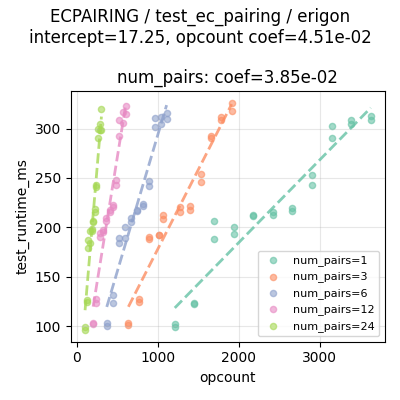

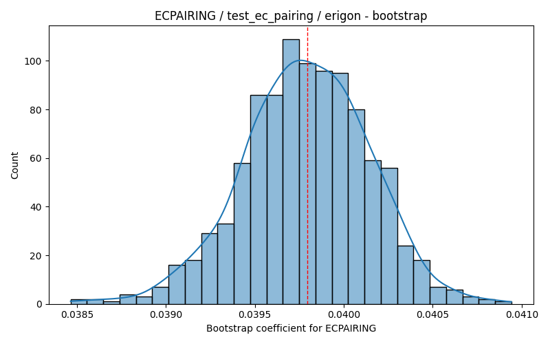

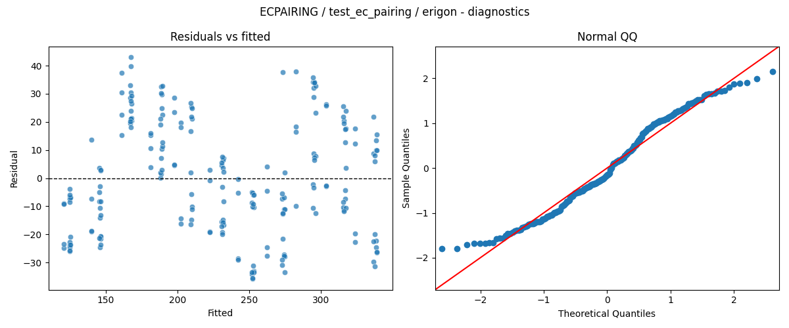

</details>

<details><summary>geth — NNLS regression summary</summary>

```
==============================================================================
                           NNLS Regression Results                            
==============================================================================
Dep. Variable:          test_runtime_ms              R-squared:          0.866
Model:                  NNLS                    Adj. R-squared:          0.866
No. Observations:       13970                             RMSE:          25.21
Df Residuals:           13967                              MAE:          20.93
Df Model:               2      
==============================================================================
                      coef     std err     P-value      [0.025      0.975]
------------------------------------------------------------------------------
         const     49.9736      0.7631       0.001     48.4877     51.4898
       opcount      0.0414      0.0003       0.001      0.0409      0.0419
     num_pairs      0.0392      0.0001       0.001      0.0390      0.0395
==============================================================================
Notes: Non-negative least squares with bootstrap inference (1000 iterations)
==============================================================================
```

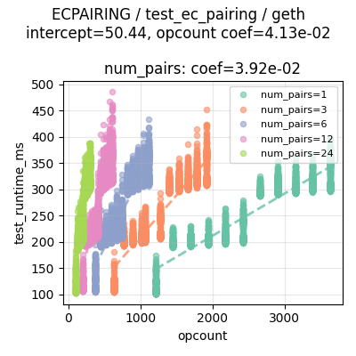

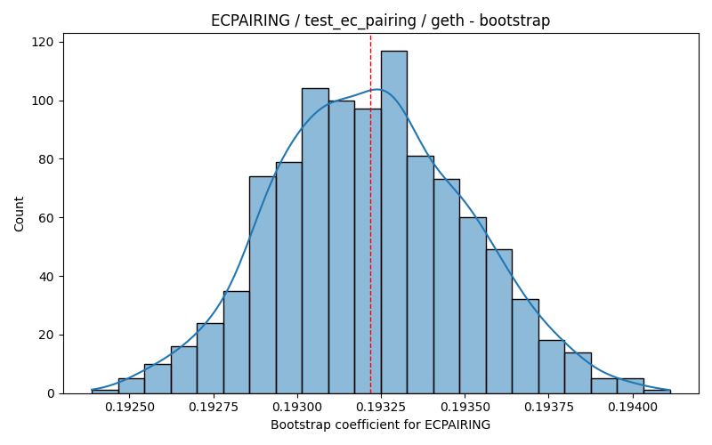

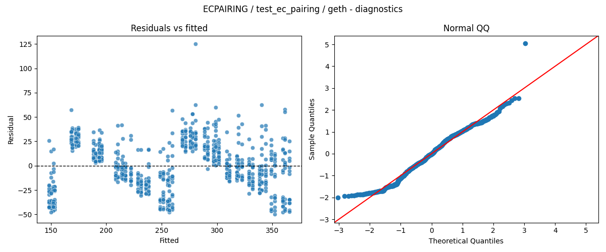

</details>

<details><summary>nethermind — NNLS regression summary</summary>

```
==============================================================================
                           NNLS Regression Results                            
==============================================================================
Dep. Variable:          test_runtime_ms              R-squared:          0.947
Model:                  NNLS                    Adj. R-squared:          0.947
No. Observations:       4070                              RMSE:          42.87
Df Residuals:           4067                               MAE:          34.47
Df Model:               2      
==============================================================================
                      coef     std err     P-value      [0.025      0.975]
------------------------------------------------------------------------------
         const     73.5818      2.0519       0.001     69.4813     77.7341
       opcount      0.0525      0.0007       0.001      0.0511      0.0539
     num_pairs      0.1169      0.0004       0.001      0.1160      0.1179
==============================================================================
Notes: Non-negative least squares with bootstrap inference (1000 iterations)
==============================================================================
```

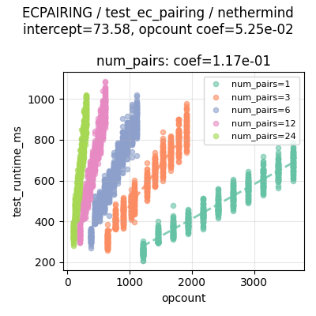

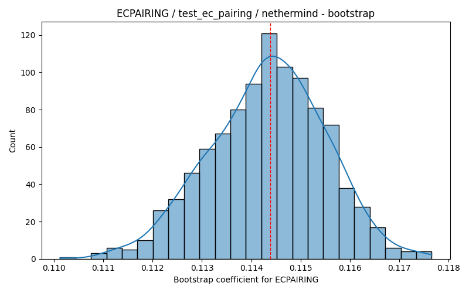

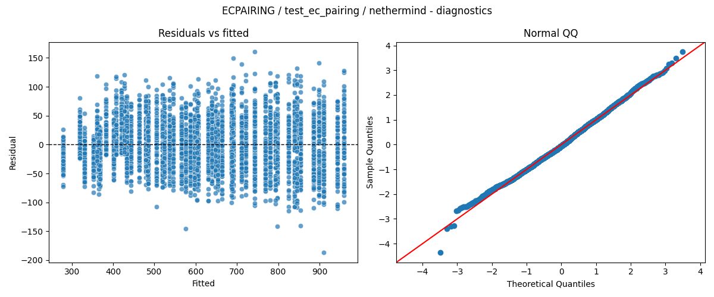

</details>

<details><summary>reth — NNLS regression summary</summary>

```
==============================================================================
                           NNLS Regression Results                            
==============================================================================
Dep. Variable:          test_runtime_ms              R-squared:          0.839
Model:                  NNLS                    Adj. R-squared:          0.839
No. Observations:       495                               RMSE:          46.22
Df Residuals:           492                                MAE:          38.57
Df Model:               2      
==============================================================================
                      coef     std err     P-value      [0.025      0.975]
------------------------------------------------------------------------------
         const    105.5209      7.4806       0.001     91.2479    120.5613
       opcount      0.0825      0.0024       0.001      0.0778      0.0873
     num_pairs      0.0608      0.0013       0.001      0.0582      0.0634
==============================================================================
Notes: Non-negative least squares with bootstrap inference (1000 iterations)
==============================================================================
```

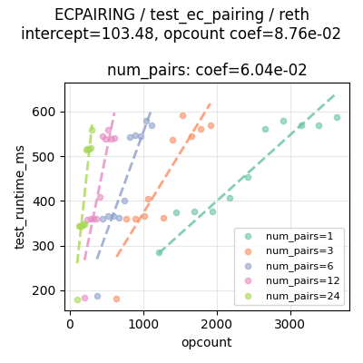

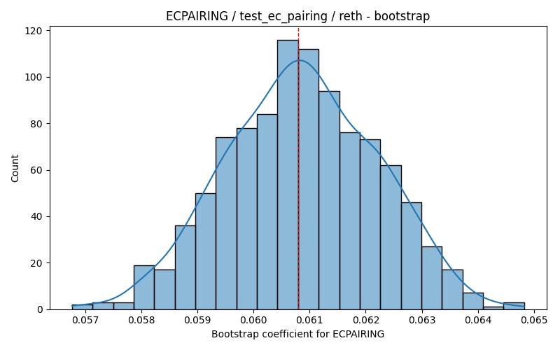

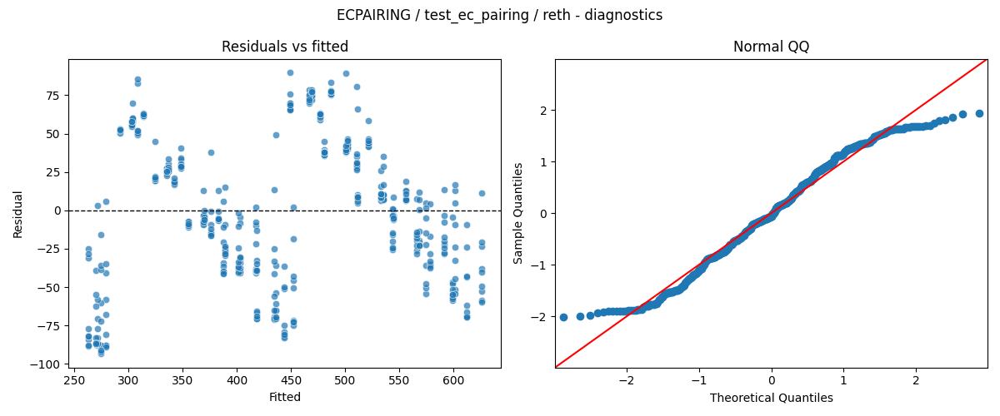

</details>

## POINT_EVALUATION

### test_point_evaluation

| client | nobs | R² | target_coef (ms) | p-value | 95% CI |
| --- | --- | --- | --- | --- | --- |
| `besu` | 2398 | 0.8736 | 0.1733 | 1.00e-03 | [0.17, 0.1767] |
| `erigon` | 165 | 0.8986 | 0.1781 | 1.00e-03 | [0.169, 0.1861] |
| `geth` | 2794 | 0.8286 | 0.198 | 1.00e-03 | [0.1944, 0.2016] |
| `nethermind` | 814 | 0.8761 | 0.2153 | 1.00e-03 | [0.2084, 0.2215] |
| `reth` | 99 | 0.8398 | 0.1978 | 1.00e-03 | [0.1799, 0.2152] |

<details><summary>besu — NNLS regression summary</summary>

```
==============================================================================
                           NNLS Regression Results                            
==============================================================================
Dep. Variable:          test_runtime_ms              R-squared:          0.874
Model:                  NNLS                    Adj. R-squared:          0.874
No. Observations:       2398                              RMSE:          83.46
Df Residuals:           2396                               MAE:          65.31
Df Model:               1      
==============================================================================
                      coef     std err     P-value      [0.025      0.975]
------------------------------------------------------------------------------
         const    419.8918      7.6516       0.001    404.4276    434.7843
       opcount      0.1733      0.0017       0.001      0.1700      0.1767
==============================================================================
Notes: Non-negative least squares with bootstrap inference (1000 iterations)
==============================================================================
```

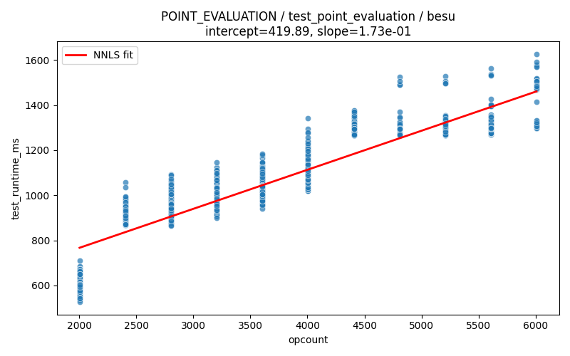

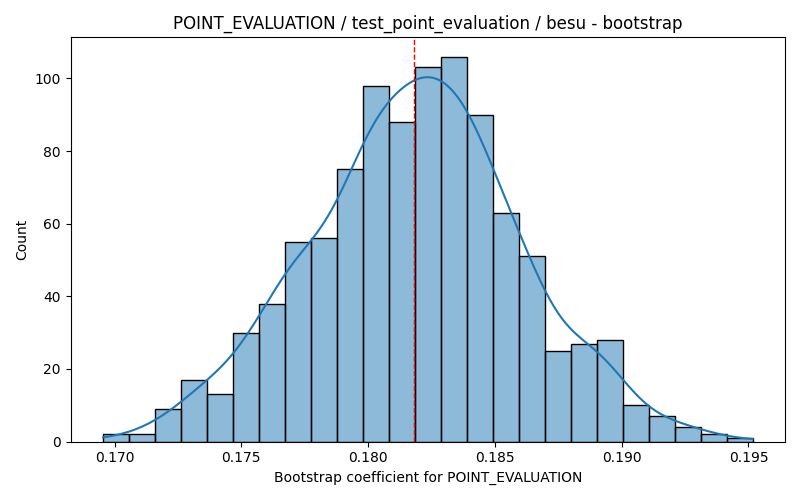

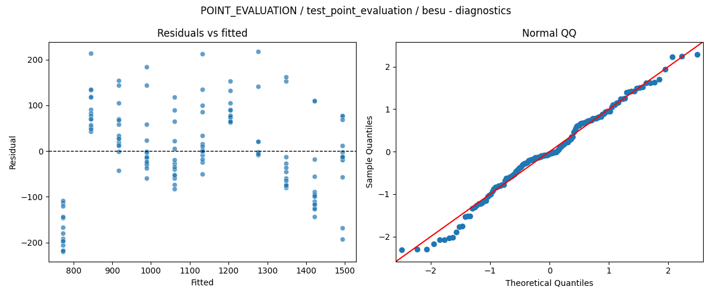

</details>

<details><summary>erigon — NNLS regression summary</summary>

```
==============================================================================
                           NNLS Regression Results                            
==============================================================================
Dep. Variable:          test_runtime_ms              R-squared:          0.899
Model:                  NNLS                    Adj. R-squared:          0.898
No. Observations:       165                               RMSE:          75.79
Df Residuals:           163                                MAE:          67.74
Df Model:               1      
==============================================================================
                      coef     std err     P-value      [0.025      0.975]
------------------------------------------------------------------------------
         const     68.8386     19.4505       0.001     32.7581    109.3174
       opcount      0.1781      0.0044       0.001      0.1690      0.1861
==============================================================================
Notes: Non-negative least squares with bootstrap inference (1000 iterations)
==============================================================================
```

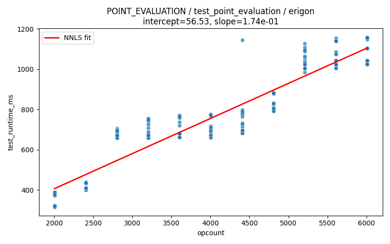

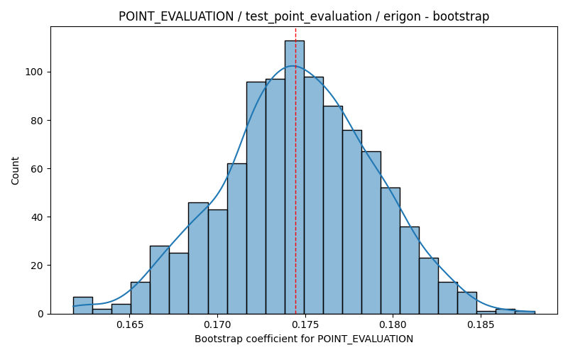

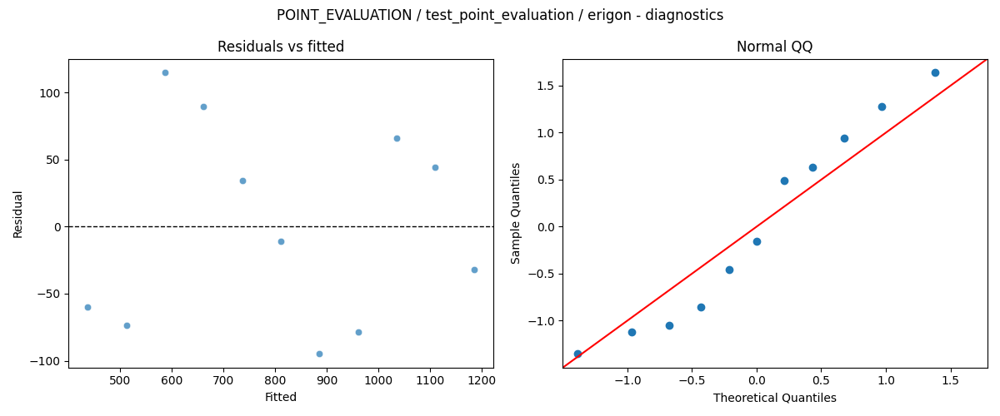

</details>

<details><summary>geth — NNLS regression summary</summary>

```
==============================================================================
                           NNLS Regression Results                            
==============================================================================
Dep. Variable:          test_runtime_ms              R-squared:          0.829
Model:                  NNLS                    Adj. R-squared:          0.828
No. Observations:       2794                              RMSE:         114.08
Df Residuals:           2792                               MAE:          97.27
Df Model:               1      
==============================================================================
                      coef     std err     P-value      [0.025      0.975]
------------------------------------------------------------------------------
         const    230.1216      8.3717       0.001    214.1881    246.1778
       opcount      0.1980      0.0019       0.001      0.1944      0.2016
==============================================================================
Notes: Non-negative least squares with bootstrap inference (1000 iterations)
==============================================================================
```

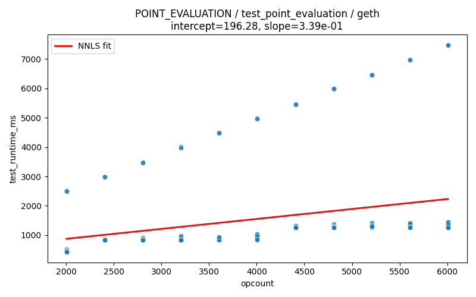

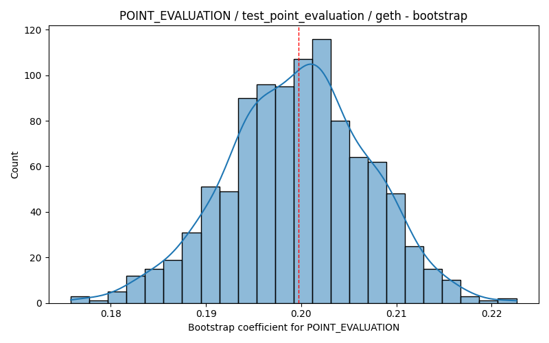

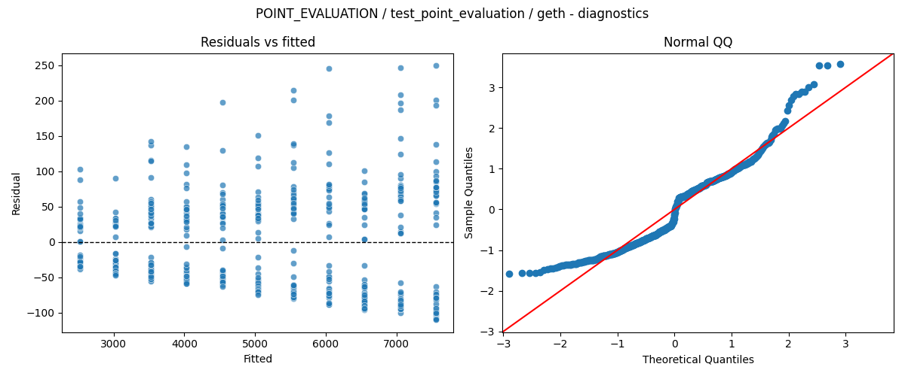

</details>

<details><summary>nethermind — NNLS regression summary</summary>

```
==============================================================================
                           NNLS Regression Results                            
==============================================================================
Dep. Variable:          test_runtime_ms              R-squared:          0.876
Model:                  NNLS                    Adj. R-squared:          0.876
No. Observations:       814                               RMSE:         102.56
Df Residuals:           812                                MAE:          85.28
Df Model:               1      
==============================================================================
                      coef     std err     P-value      [0.025      0.975]
------------------------------------------------------------------------------
         const    200.0987     13.4457       0.001    174.8842    227.6242
       opcount      0.2153      0.0032       0.001      0.2084      0.2215
==============================================================================
Notes: Non-negative least squares with bootstrap inference (1000 iterations)
==============================================================================
```

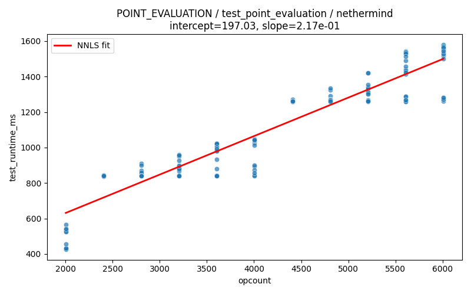

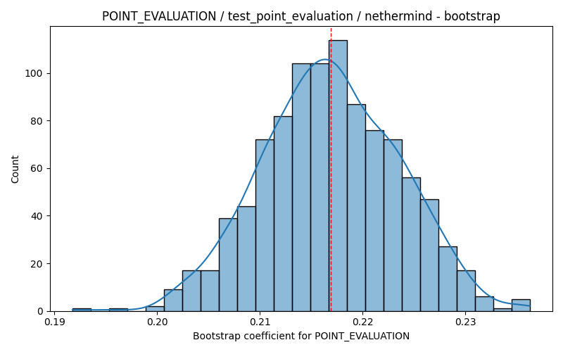

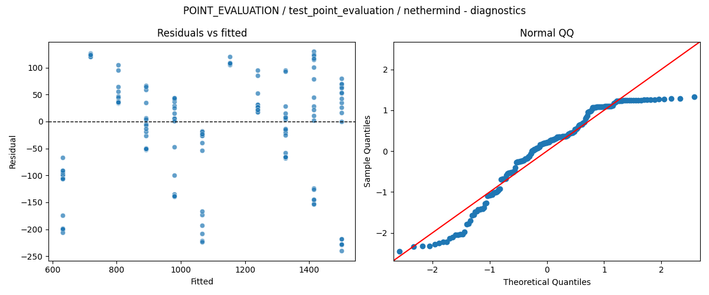

</details>

<details><summary>reth — NNLS regression summary</summary>

```
==============================================================================
                           NNLS Regression Results                            
==============================================================================
Dep. Variable:          test_runtime_ms              R-squared:          0.840
Model:                  NNLS                    Adj. R-squared:          0.838
No. Observations:       99                                RMSE:         109.44
Df Residuals:           97                                 MAE:          94.34
Df Model:               1      
==============================================================================
                      coef     std err     P-value      [0.025      0.975]
------------------------------------------------------------------------------
         const    224.9285     41.7326       0.001    149.6991    313.9231
       opcount      0.1978      0.0093       0.001      0.1799      0.2152
==============================================================================
Notes: Non-negative least squares with bootstrap inference (1000 iterations)
==============================================================================
```

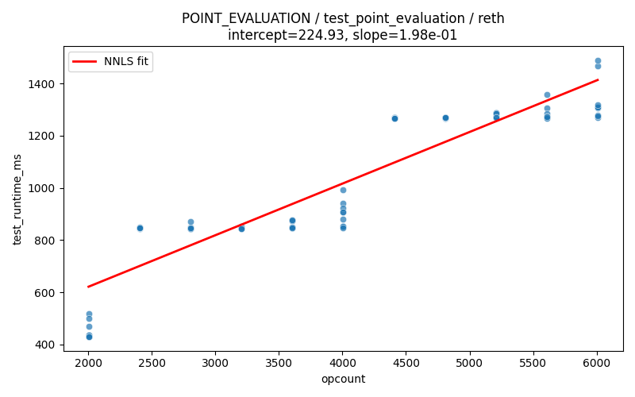

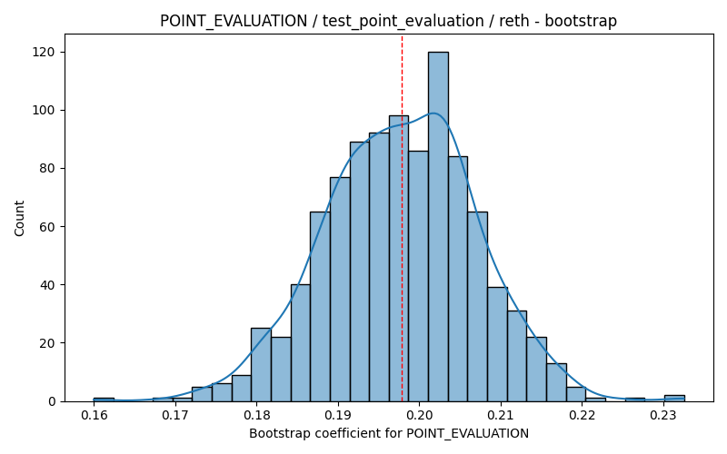

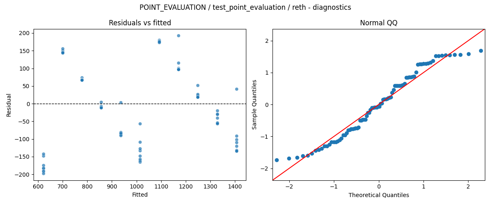

</details>

### test_point_evaluation_uncachable

| client | nobs | R² | target_coef (ms) | p-value | 95% CI |
| --- | --- | --- | --- | --- | --- |
| `besu` | 2398 | 0.8744 | 0.2086 | 1.00e-03 | [0.2052, 0.2119] |
| `erigon` | 165 | 0.8916 | 0.1935 | 1.00e-03 | [0.184, 0.2022] |
| `geth` | 2794 | 0.8407 | 0.1923 | 1.00e-03 | [0.1891, 0.1956] |
| `nethermind` | 814 | 0.8634 | 0.2334 | 1.00e-03 | [0.2263, 0.2411] |
| `reth` | 99 | 0.8355 | 0.1966 | 1.00e-03 | [0.178, 0.2139] |

<details><summary>besu — NNLS regression summary</summary>

```
==============================================================================
                           NNLS Regression Results                            
==============================================================================
Dep. Variable:          test_runtime_ms              R-squared:          0.874
Model:                  NNLS                    Adj. R-squared:          0.874
No. Observations:       2398                              RMSE:          93.59
Df Residuals:           2396                               MAE:          79.12
Df Model:               1      
==============================================================================
                      coef     std err     P-value      [0.025      0.975]
------------------------------------------------------------------------------
         const    219.3558      7.1325       0.001    204.8854    233.8020
       opcount      0.2086      0.0017       0.001      0.2052      0.2119
==============================================================================
Notes: Non-negative least squares with bootstrap inference (1000 iterations)
==============================================================================
```

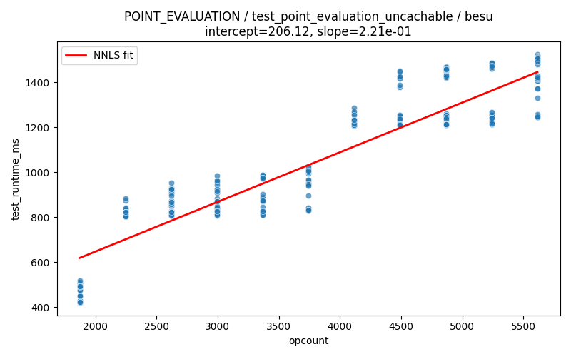

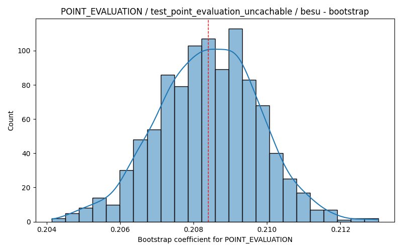

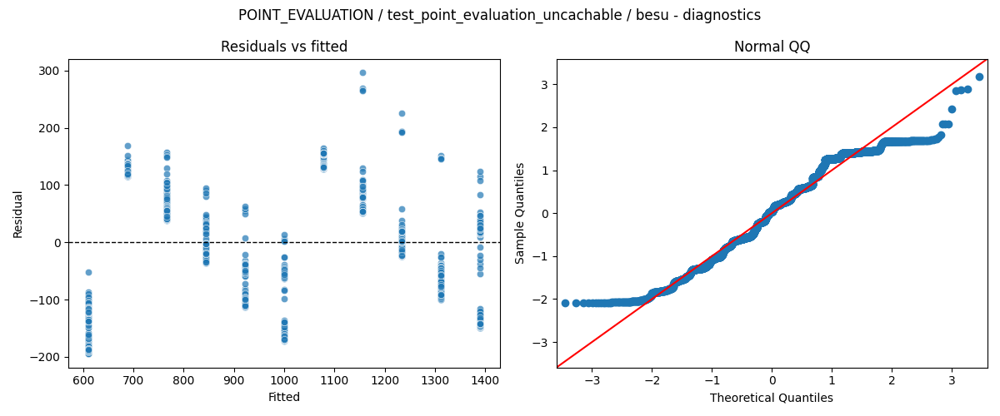

</details>

<details><summary>erigon — NNLS regression summary</summary>

```
==============================================================================
                           NNLS Regression Results                            
==============================================================================
Dep. Variable:          test_runtime_ms              R-squared:          0.892
Model:                  NNLS                    Adj. R-squared:          0.891
No. Observations:       165                               RMSE:          79.85
Df Residuals:           163                                MAE:          68.91
Df Model:               1      
==============================================================================
                      coef     std err     P-value      [0.025      0.975]
------------------------------------------------------------------------------
         const     71.4340     19.5876       0.001     34.5457    111.0291
       opcount      0.1935      0.0046       0.001      0.1840      0.2022
==============================================================================
Notes: Non-negative least squares with bootstrap inference (1000 iterations)
==============================================================================
```

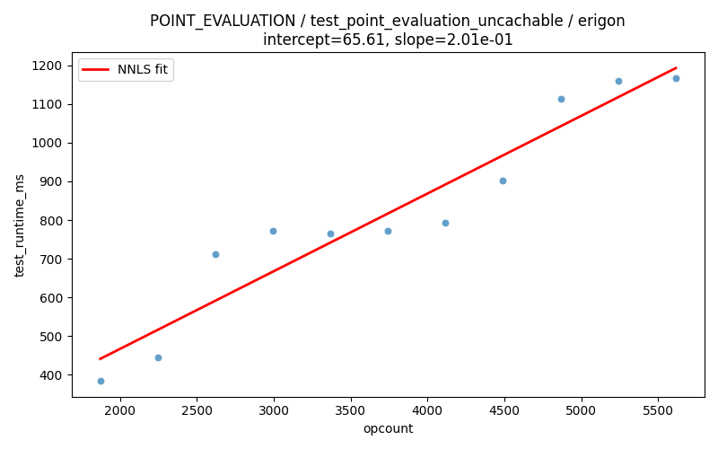

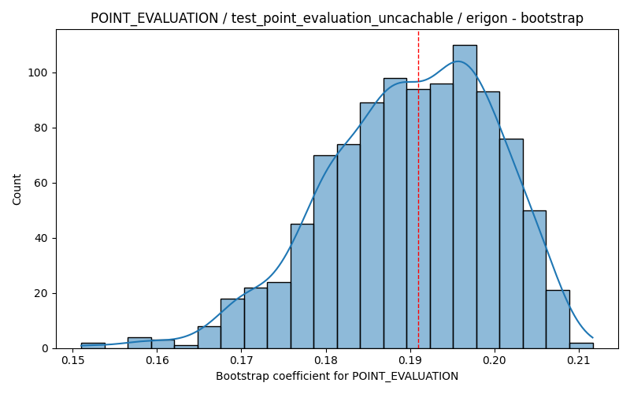

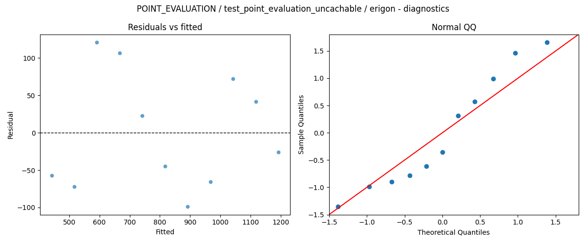

</details>

<details><summary>geth — NNLS regression summary</summary>

```
==============================================================================
                           NNLS Regression Results                            
==============================================================================
Dep. Variable:          test_runtime_ms              R-squared:          0.841
Model:                  NNLS                    Adj. R-squared:          0.841
No. Observations:       2794                              RMSE:          99.06
Df Residuals:           2792                               MAE:          83.86
Df Model:               1      
==============================================================================
                      coef     std err     P-value      [0.025      0.975]
------------------------------------------------------------------------------
         const    195.1287      6.8089       0.001    180.7679    208.2778
       opcount      0.1923      0.0017       0.001      0.1891      0.1956
==============================================================================
Notes: Non-negative least squares with bootstrap inference (1000 iterations)
==============================================================================
```

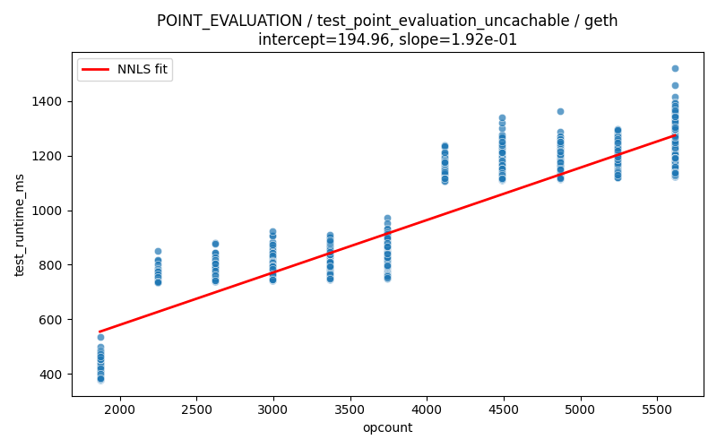

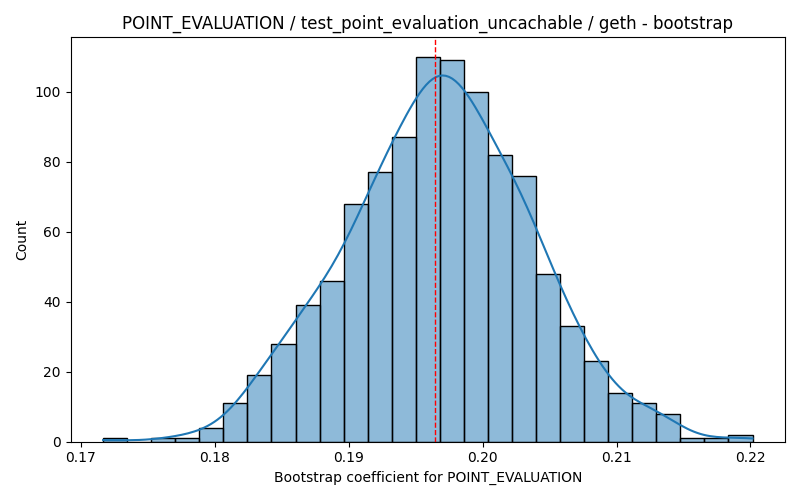

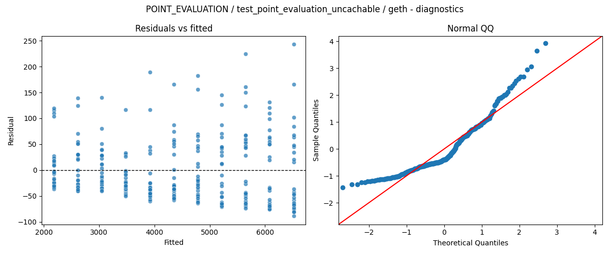

</details>

<details><summary>nethermind — NNLS regression summary</summary>

```
==============================================================================
                           NNLS Regression Results                            
==============================================================================
Dep. Variable:          test_runtime_ms              R-squared:          0.863
Model:                  NNLS                    Adj. R-squared:          0.863
No. Observations:       814                               RMSE:         109.88
Df Residuals:           812                                MAE:          85.28
Df Model:               1      
==============================================================================
                      coef     std err     P-value      [0.025      0.975]
------------------------------------------------------------------------------
         const    151.4634     13.8224       0.001    124.2227    177.1973
       opcount      0.2334      0.0037       0.001      0.2263      0.2411
==============================================================================
Notes: Non-negative least squares with bootstrap inference (1000 iterations)
==============================================================================
```

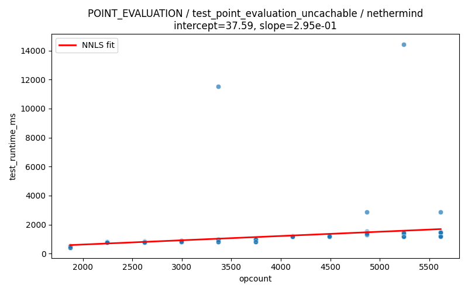

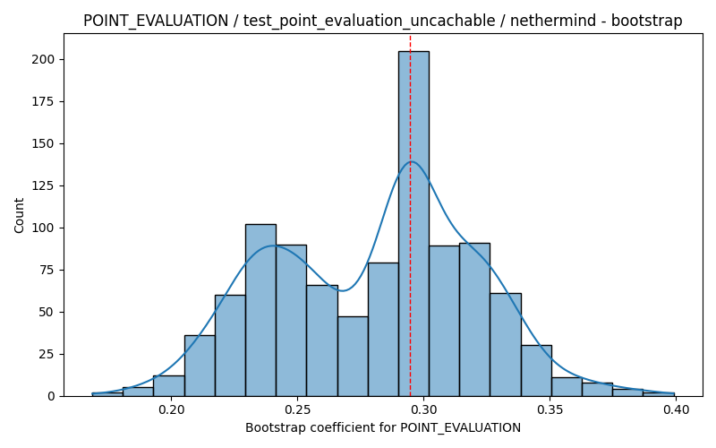

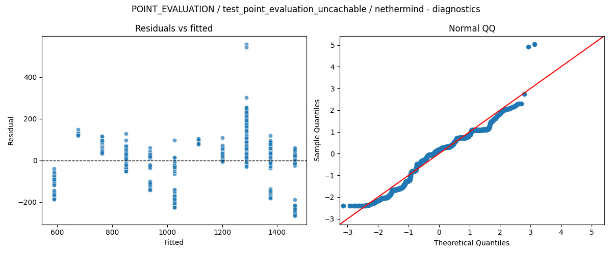

</details>

<details><summary>reth — NNLS regression summary</summary>

```
==============================================================================
                           NNLS Regression Results                            
==============================================================================
Dep. Variable:          test_runtime_ms              R-squared:          0.835
Model:                  NNLS                    Adj. R-squared:          0.834
No. Observations:       99                                RMSE:         103.29
Df Residuals:           97                                 MAE:          86.35
Df Model:               1      
==============================================================================
                      coef     std err     P-value      [0.025      0.975]
------------------------------------------------------------------------------
         const    225.5452     39.6374       0.001    152.3949    305.7742
       opcount      0.1966      0.0094       0.001      0.1780      0.2139
==============================================================================
Notes: Non-negative least squares with bootstrap inference (1000 iterations)
==============================================================================
```

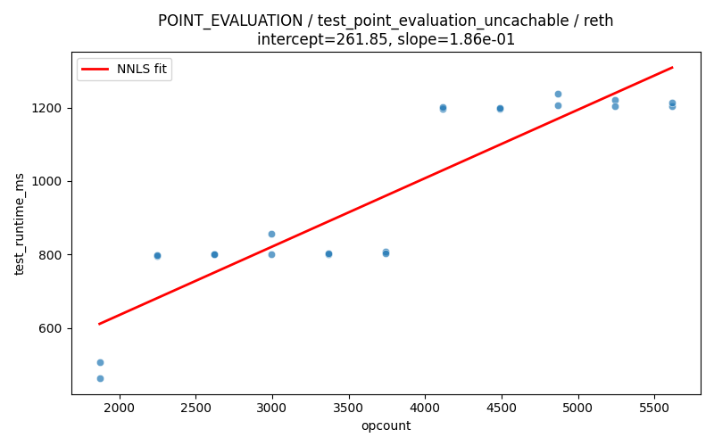

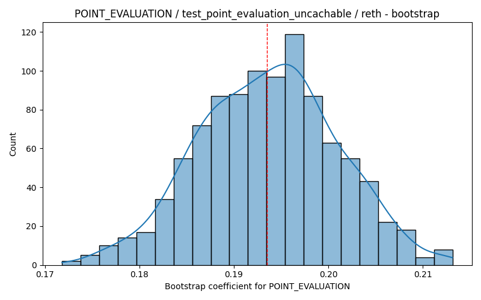

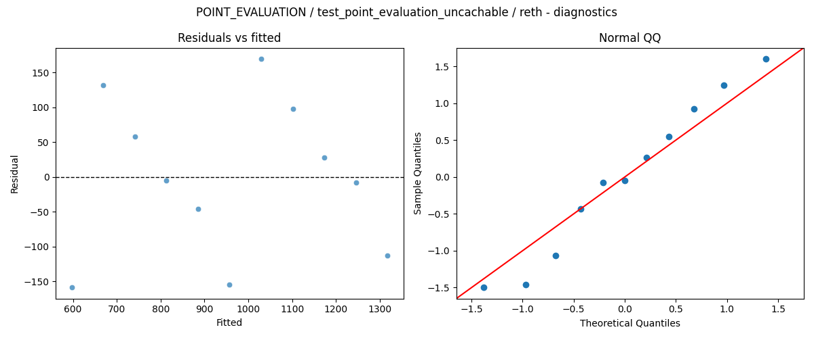

</details>

## P256VERIFY

### test_p256verify

| client | nobs | R² | target_coef (ms) | p-value | 95% CI |
| --- | --- | --- | --- | --- | --- |
| `besu` | 2398 | 0.8671 | 0.008338 | 1.00e-03 | [0.008211, 0.008469] |
| `erigon` | 165 | 0.8282 | 0.0142 | 1.00e-03 | [0.01347, 0.01485] |
| `geth` | 2794 | 0.8275 | 0.0117 | 1.00e-03 | [0.01149, 0.01191] |
| `nethermind` | 814 | 0.8827 | 0.008613 | 1.00e-03 | [0.008351, 0.008877] |
| `reth` | 99 | 0.8427 | 0.008424 | 1.00e-03 | [0.007627, 0.009186] |

<details><summary>besu — NNLS regression summary</summary>

```
==============================================================================
                           NNLS Regression Results                            
==============================================================================
Dep. Variable:          test_runtime_ms              R-squared:          0.867
Model:                  NNLS                    Adj. R-squared:          0.867
No. Observations:       2398                              RMSE:          29.40
Df Residuals:           2396                               MAE:          24.56
Df Model:               1      
==============================================================================
                      coef     std err     P-value      [0.025      0.975]
------------------------------------------------------------------------------
         const     76.9250      2.0225       0.001     72.9036     80.8594
       opcount      0.0083      0.0001       0.001      0.0082      0.0085
==============================================================================
Notes: Non-negative least squares with bootstrap inference (1000 iterations)
==============================================================================
```

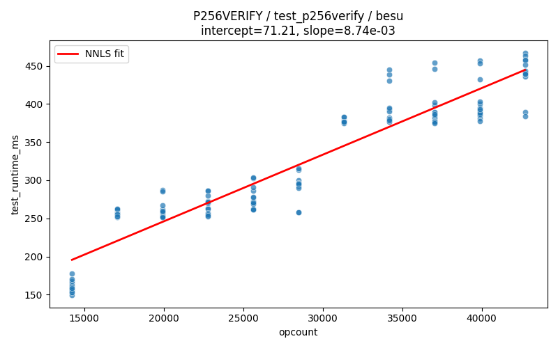

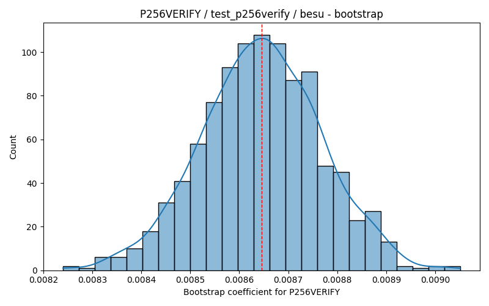

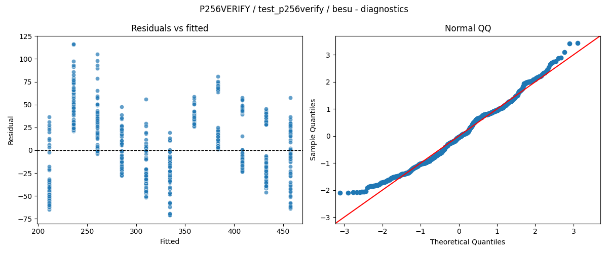

</details>

<details><summary>erigon — NNLS regression summary</summary>

```
==============================================================================
                           NNLS Regression Results                            
==============================================================================
Dep. Variable:          test_runtime_ms              R-squared:          0.828
Model:                  NNLS                    Adj. R-squared:          0.827
No. Observations:       165                               RMSE:          58.23
Df Residuals:           163                                MAE:          39.90
Df Model:               1      
==============================================================================
                      coef     std err     P-value      [0.025      0.975]
------------------------------------------------------------------------------
         const     45.4465     11.0090       0.001     25.8950     69.2770
       opcount      0.0142      0.0004       0.001      0.0135      0.0148
==============================================================================
Notes: Non-negative least squares with bootstrap inference (1000 iterations)
==============================================================================
```

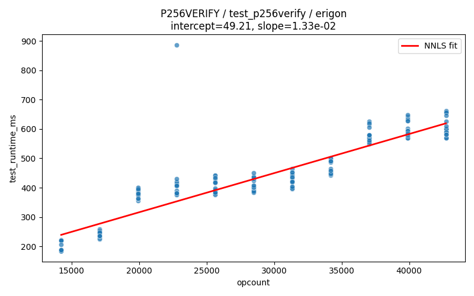

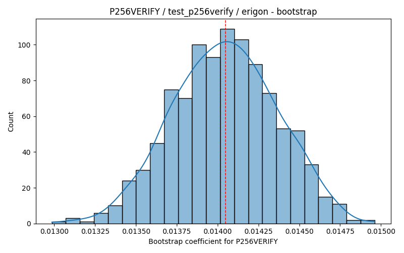

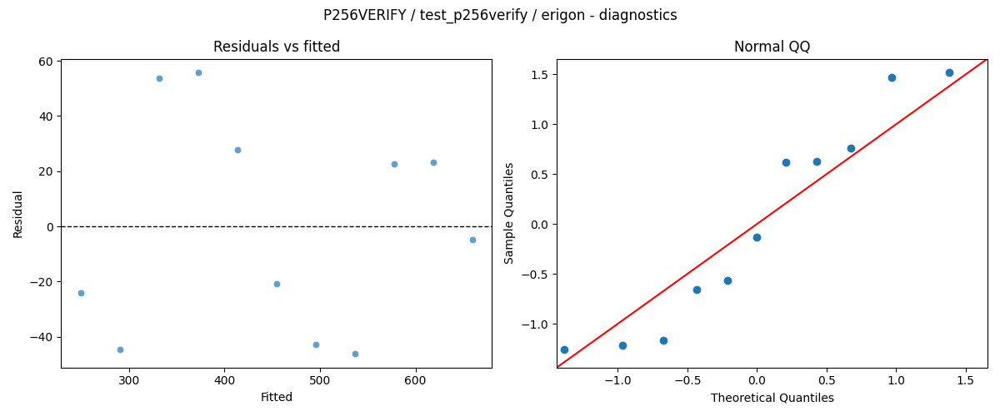

</details>

<details><summary>geth — NNLS regression summary</summary>

```
==============================================================================
                           NNLS Regression Results                            
==============================================================================
Dep. Variable:          test_runtime_ms              R-squared:          0.827
Model:                  NNLS                    Adj. R-squared:          0.827
No. Observations:       2794                              RMSE:          48.10
Df Residuals:           2792                               MAE:          40.27
Df Model:               1      
==============================================================================
                      coef     std err     P-value      [0.025      0.975]
------------------------------------------------------------------------------
         const     95.0270      3.3389       0.001     88.5333    101.6905
       opcount      0.0117      0.0001       0.001      0.0115      0.0119
==============================================================================
Notes: Non-negative least squares with bootstrap inference (1000 iterations)
==============================================================================
```

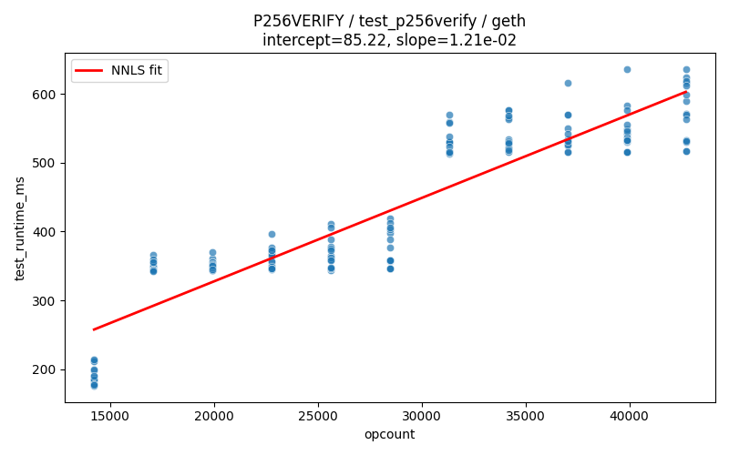

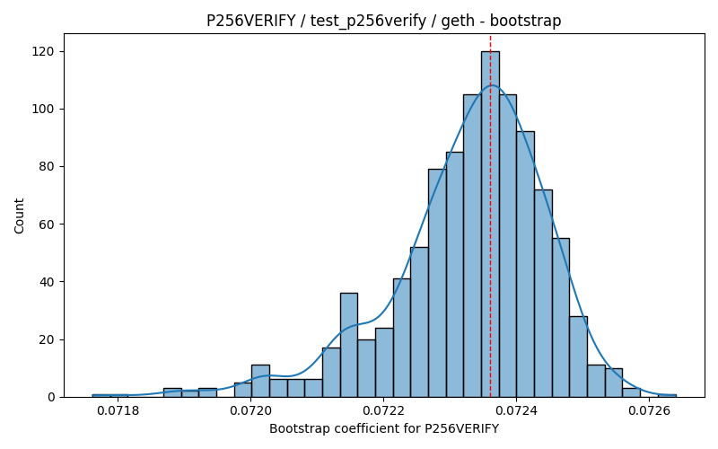

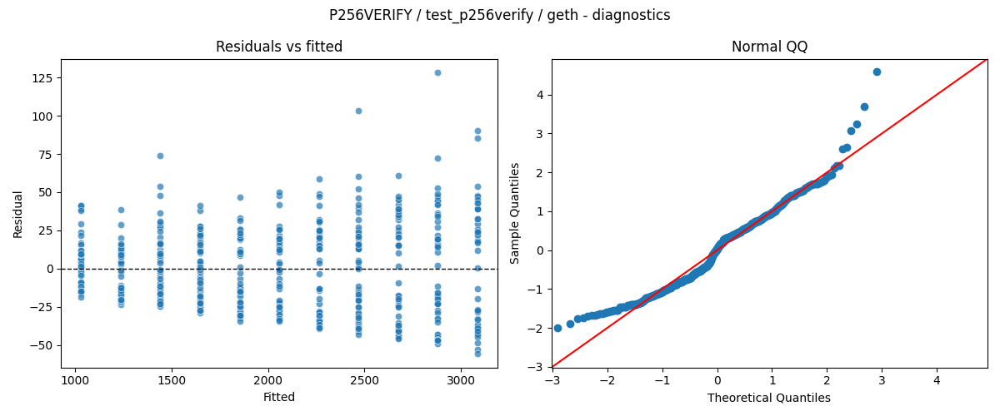

</details>

<details><summary>nethermind — NNLS regression summary</summary>

```
==============================================================================
                           NNLS Regression Results                            
==============================================================================
Dep. Variable:          test_runtime_ms              R-squared:          0.883
Model:                  NNLS                    Adj. R-squared:          0.883
No. Observations:       814                               RMSE:          28.27
Df Residuals:           812                                MAE:          23.34
Df Model:               1      
==============================================================================
                      coef     std err     P-value      [0.025      0.975]
------------------------------------------------------------------------------
         const     58.5741      3.8877       0.001     50.8515     66.2546
       opcount      0.0086      0.0001       0.001      0.0084      0.0089
==============================================================================
Notes: Non-negative least squares with bootstrap inference (1000 iterations)
==============================================================================
```

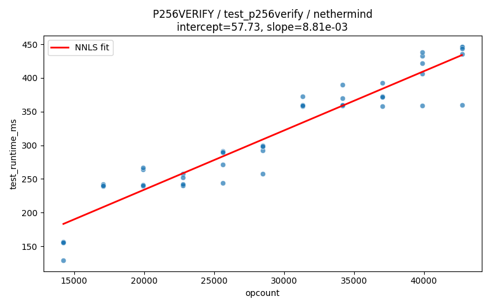

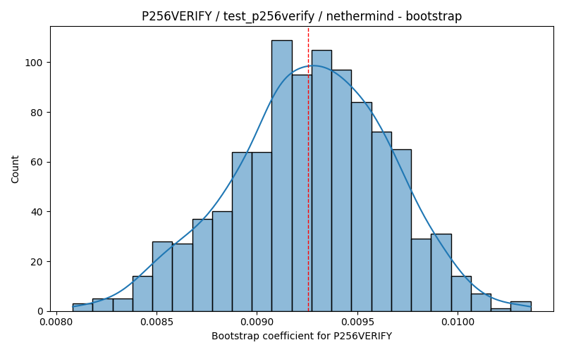

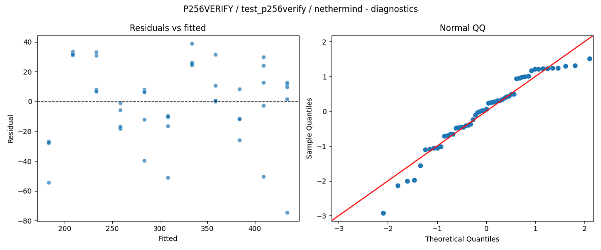

</details>

<details><summary>reth — NNLS regression summary</summary>

```
==============================================================================
                           NNLS Regression Results                            
==============================================================================
Dep. Variable:          test_runtime_ms              R-squared:          0.843
Model:                  NNLS                    Adj. R-squared:          0.841
No. Observations:       99                                RMSE:          32.78
Df Residuals:           97                                 MAE:          27.80
Df Model:               1      
==============================================================================
                      coef     std err     P-value      [0.025      0.975]
------------------------------------------------------------------------------
         const     63.0968     12.8506       0.001     38.1110     89.1053
       opcount      0.0084      0.0004       0.001      0.0076      0.0092
==============================================================================
Notes: Non-negative least squares with bootstrap inference (1000 iterations)
==============================================================================
```


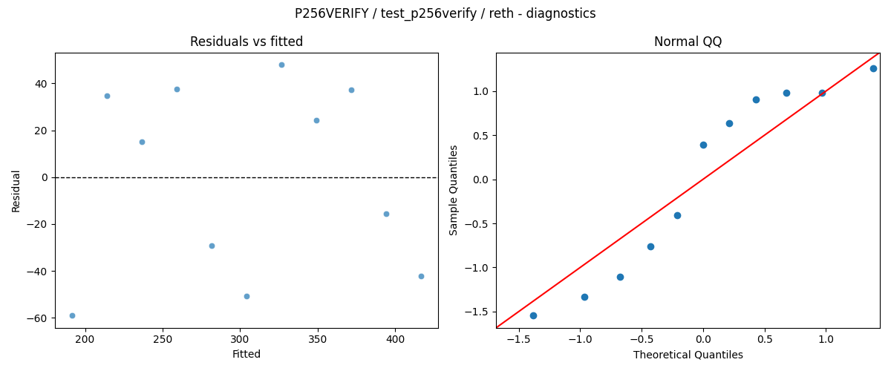

</details>

### test_p256verify_uncachable

| client | nobs | R² | target_coef (ms) | p-value | 95% CI |
| --- | --- | --- | --- | --- | --- |
| `besu` | 2398 | 0.9088 | 0.01094 | 1.00e-03 | [0.0108, 0.01108] |
| `erigon` | 165 | 0.8057 | 0.01398 | 1.00e-03 | [0.01265, 0.01512] |
| `geth` | 2794 | 0.8257 | 0.0118 | 1.00e-03 | [0.01159, 0.01203] |
| `nethermind` | 814 | 0.8835 | 0.008729 | 1.00e-03 | [0.008452, 0.008978] |
| `reth` | 99 | 0.8658 | 0.008419 | 1.00e-03 | [0.007681, 0.00912] |

<details><summary>besu — NNLS regression summary</summary>

```
==============================================================================
                           NNLS Regression Results                            
==============================================================================
Dep. Variable:          test_runtime_ms              R-squared:          0.909
Model:                  NNLS                    Adj. R-squared:          0.909
No. Observations:       2398                              RMSE:          31.00
Df Residuals:           2396                               MAE:          26.46
Df Model:               1      
==============================================================================
                      coef     std err     P-value      [0.025      0.975]
------------------------------------------------------------------------------
         const     24.3178      2.0380       0.001     20.4474     28.3700
       opcount      0.0109      0.0001       0.001      0.0108      0.0111
==============================================================================
Notes: Non-negative least squares with bootstrap inference (1000 iterations)
==============================================================================
```

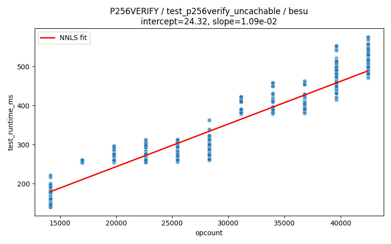

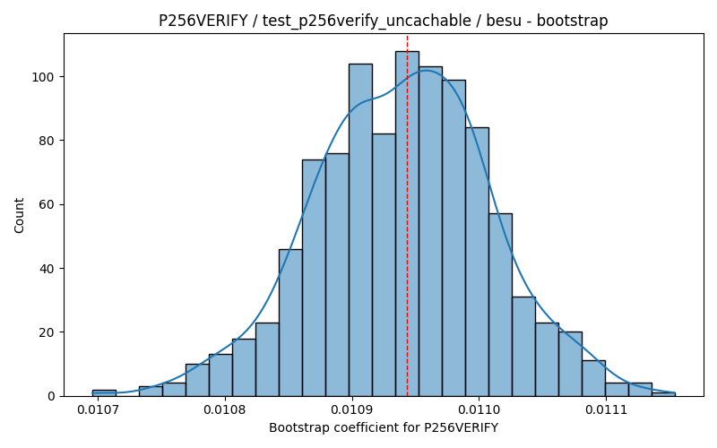

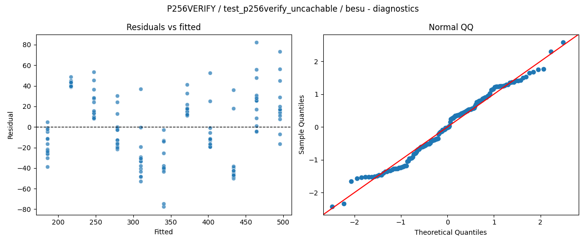

</details>

<details><summary>erigon — NNLS regression summary</summary>

```
==============================================================================
                           NNLS Regression Results                            
==============================================================================
Dep. Variable:          test_runtime_ms              R-squared:          0.806
Model:                  NNLS                    Adj. R-squared:          0.805
No. Observations:       165                               RMSE:          61.40
Df Residuals:           163                                MAE:          39.73
Df Model:               1      
==============================================================================
                      coef     std err     P-value      [0.025      0.975]
------------------------------------------------------------------------------
         const     53.0820     19.6676       0.001     19.5608     94.4306
       opcount      0.0140      0.0006       0.001      0.0126      0.0151
==============================================================================
Notes: Non-negative least squares with bootstrap inference (1000 iterations)
==============================================================================
```

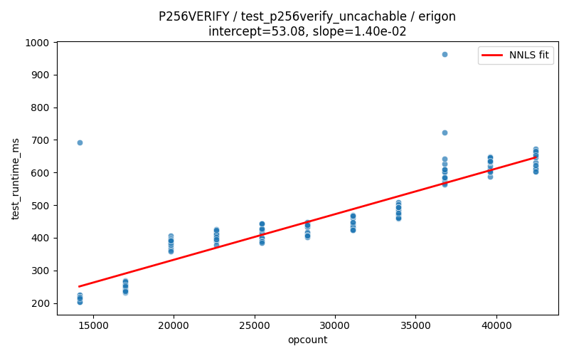

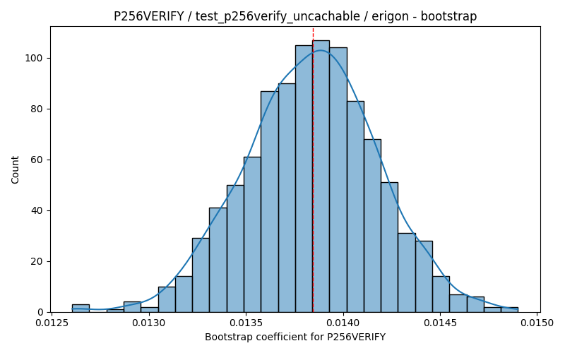

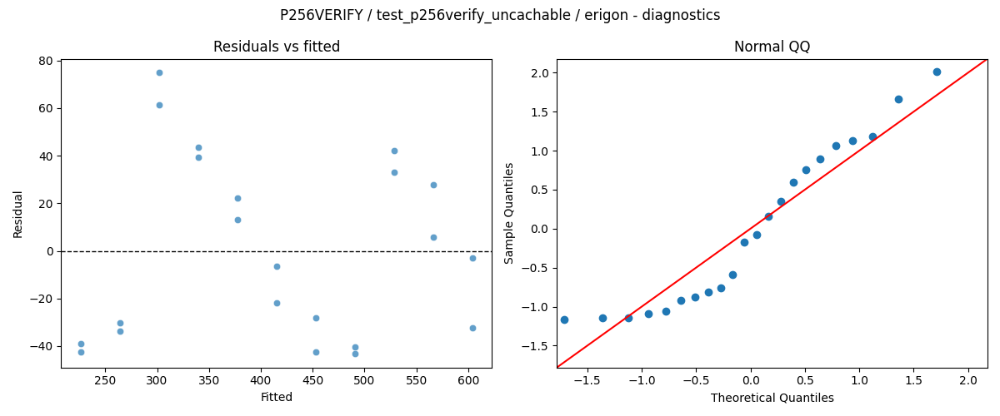

</details>

<details><summary>geth — NNLS regression summary</summary>

```
==============================================================================
                           NNLS Regression Results                            
==============================================================================
Dep. Variable:          test_runtime_ms              R-squared:          0.826
Model:                  NNLS                    Adj. R-squared:          0.826
No. Observations:       2794                              RMSE:          48.49
Df Residuals:           2792                               MAE:          40.52
Df Model:               1      
==============================================================================
                      coef     std err     P-value      [0.025      0.975]
------------------------------------------------------------------------------
         const     93.1744      3.4638       0.001     86.4846     99.4198
       opcount      0.0118      0.0001       0.001      0.0116      0.0120
==============================================================================
Notes: Non-negative least squares with bootstrap inference (1000 iterations)
==============================================================================
```

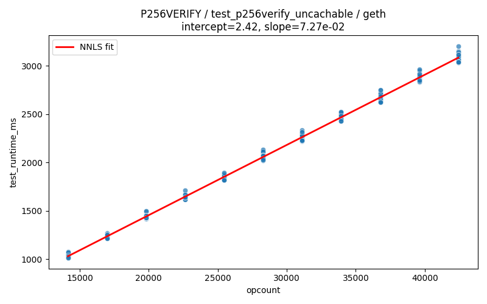

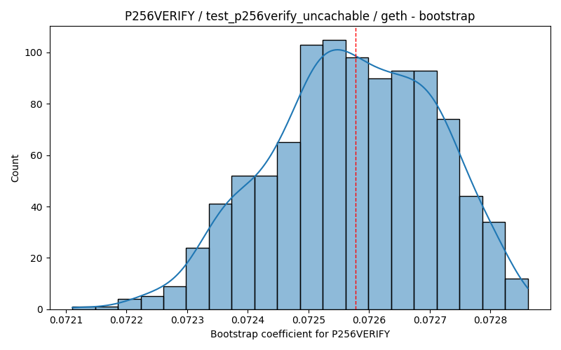

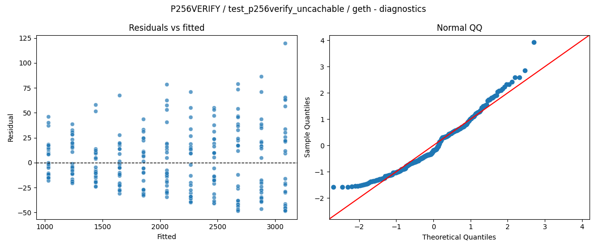

</details>

<details><summary>nethermind — NNLS regression summary</summary>

```
==============================================================================
                           NNLS Regression Results                            
==============================================================================
Dep. Variable:          test_runtime_ms              R-squared:          0.883
Model:                  NNLS                    Adj. R-squared:          0.883
No. Observations:       814                               RMSE:          28.36
Df Residuals:           812                                MAE:          23.35
Df Model:               1      
==============================================================================
                      coef     std err     P-value      [0.025      0.975]
------------------------------------------------------------------------------
         const     57.6284      3.8985       0.001     50.4890     65.2041
       opcount      0.0087      0.0001       0.001      0.0085      0.0090
==============================================================================
Notes: Non-negative least squares with bootstrap inference (1000 iterations)
==============================================================================
```

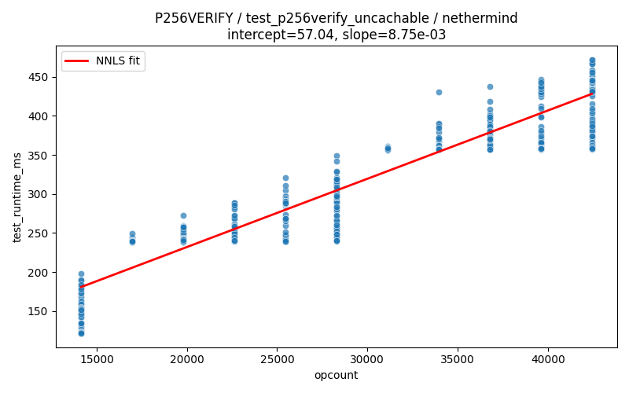

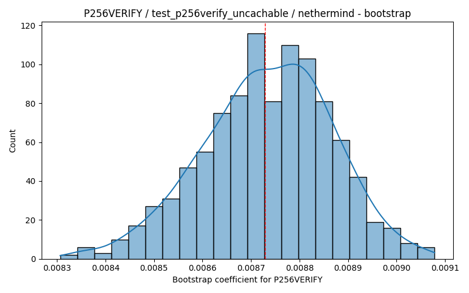

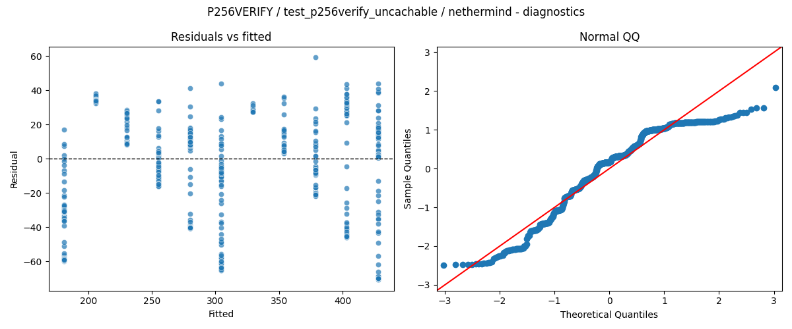

</details>

<details><summary>reth — NNLS regression summary</summary>

```
==============================================================================
                           NNLS Regression Results                            
==============================================================================
Dep. Variable:          test_runtime_ms              R-squared:          0.866
Model:                  NNLS                    Adj. R-squared:          0.864
No. Observations:       99                                RMSE:          29.65
Df Residuals:           97                                 MAE:          24.52
Df Model:               1      
==============================================================================
                      coef     std err     P-value      [0.025      0.975]
------------------------------------------------------------------------------
         const     69.2118     11.7461       0.001     47.1850     91.9381
       opcount      0.0084      0.0004       0.001      0.0077      0.0091
==============================================================================
Notes: Non-negative least squares with bootstrap inference (1000 iterations)
==============================================================================
```

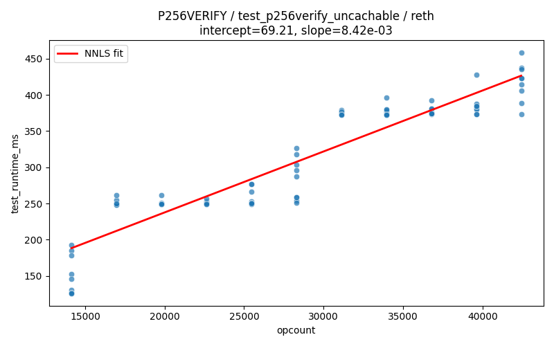


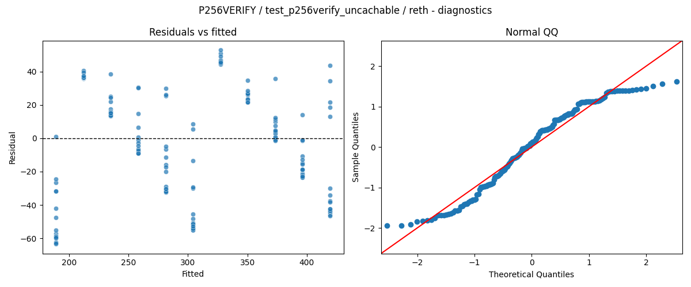

</details>
